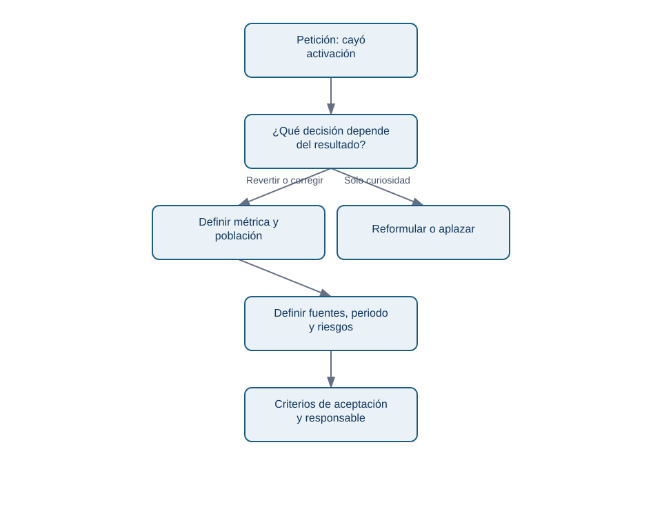
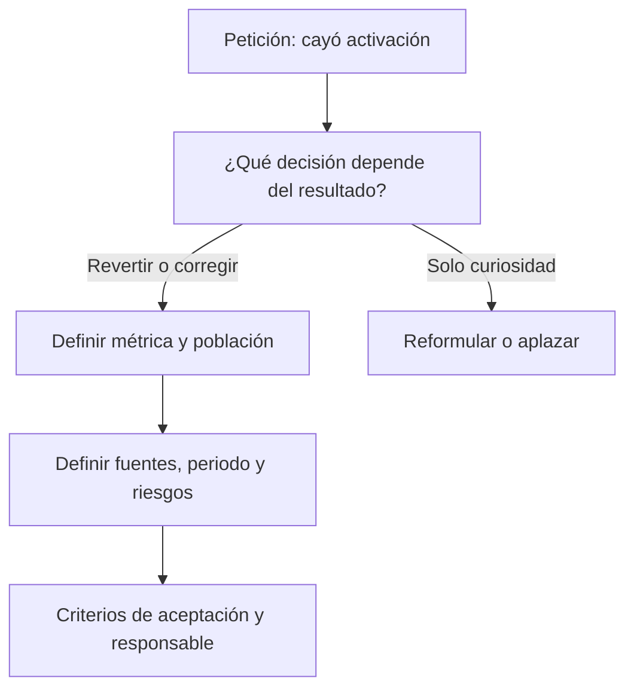

# 1. De petición a ticket analítico

## Objetivo y prerrequisitos

Convertirás «mira por qué baja el onboarding» en un acuerdo que permita tomar una decisión y evaluar si el trabajo está terminado. Necesitas distinguir una métrica y un segmento (bloque 10); no necesitas conocer Jira.

## Del mensaje ambiguo al problema decidible

Un equipo recibe: «la activación ha caído; miradlo». Es una **petición**, no una pregunta analítica. Puede significar que cambió el producto, que el evento dejó de llegar, que entró tráfico distinto o que cambió la definición. Si el analista empieza por abrir un gráfico, el resultado puede ser interesante pero inútil.

Un *ticket* es una ficha compartida de trabajo. Jira es una aplicación popular para guardar estas fichas; la idea es independiente de la marca. Su función no es vigilar personas: conserva el contexto, las decisiones y los criterios de aceptación cuando la conversación ya no está en Slack o en la memoria de alguien.

<!-- mobile-diagram: rendered fallback -->

Ver código Mermaid editable

La pregunta del diagrama obliga a fijar el uso antes de medir. «¿Cayó?» no basta; en Nébula se decide entre revertir la versión 4.2, corregir el flujo o mantenerla.

## El contrato mínimo de Nébula

- **Decisión:** el PM decide revertir, lanzar corrección o mantener 4.2 el martes.
- **Pregunta:** ¿la tasa de activación a siete días difiere por versión de app tras el lanzamiento?
- **Métrica:** cuentas nuevas que completan `reserva_creada` en sus primeros siete días / cuentas nuevas elegibles.
- **Población y grano:** una fila por cuenta y fecha de alta; se excluyen cuentas internas y pruebas.
- **Periodo:** altas del 1 al 28 de abril; corte de datos el 6 de mayo para observar siete días.
- **Segmentos:** versión, plataforma, país y canal de adquisición.
- **Evidencia:** consulta versionada, extracción fechada, auditoría del evento y tabla de resultados.
- **Dueño:** Ana (Producto) decide; Leo analiza; Marta (Datos) valida instrumentación.

El detalle evita una trampa frecuente: comparar altas muy recientes contra altas antiguas. Las primeras aún no tuvieron siete días para activarse. La **fecha de corte** y la ventana de observación son parte de la definición, no letra pequeña.

## Criterios de aceptación y límites

Un criterio de aceptación no es «hacer dashboard». Para este ticket: (1) la fórmula se puede recalcular desde una fuente identificada; (2) la cobertura de `reserva_creada` se compara entre versiones; (3) se muestra tamaño de cada grupo, tasa y diferencia; (4) se enumeran riesgos de causalidad; (5) la entrega recomienda una acción o explica por qué aún no puede hacerlo.

No redactes «demostrar que 4.2 causó la caída». Una comparación antes/después observa asociación; coincide con campañas, estacionalidad y cambios de tráfico. Para afirmar causalidad se necesitaría un diseño apropiado, como experimento o una estrategia cuasiexperimental (bloque 14).

### Error habitual

«Activación» puede ser pulsar un botón, crear una reserva o recibir confirmación del servidor. Elegir la definición después de ver el resultado es *moving the goalposts*: transforma una investigación en una búsqueda de una conclusión deseada.

## Resumen y comprobación

Un buen ticket contiene una decisión, pregunta, contrato de métrica, población, corte temporal, fuentes, riesgos, responsable y criterios de aceptación. Pregúntate: ¿otra persona sabría qué hacer si Leo no está disponible? ¿el resultado puede cambiar una acción concreta?

Continúa con [proyecto reproducible y Git](02-proyecto-reproducible-y-git.md): el ticket define qué demostrar; el proyecto conserva cómo se demostró.
