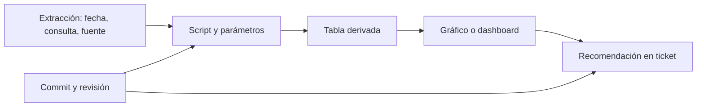

# 2. Proyecto reproducible y Git

## Objetivo y problema

Organizarás el análisis de Nébula para que una compañera pueda repetirlo semanas después. Reproducible significa: con una entrada identificada, una versión de código y parámetros explícitos, se obtiene el mismo resultado o se explica por qué no. No significa subir datos personales a internet.

Una **carpeta** agrupa archivos; un **repositorio Git** es una carpeta cuyo historial Git registra cambios en archivos de texto. Git no entiende por sí mismo qué es correcto: guarda quién cambió qué, cuándo y con qué mensaje. La documentación aporta significado.

## Estructura mínima que separa responsabilidades

```text
activacion-nebula/
├── README.md                 # propósito, cómo ejecutar y límites
├── data/
│   ├── raw/                  # extracción original; no se versiona si es sensible
│   └── processed/            # derivado reproducible; normalmente tampoco se versiona
├── src/
│   └── calcular_activacion.py
├── tests/                    # comprobaciones de la lógica
├── docs/
│   ├── ticket.md
│   ├── contrato-metrica.md
│   └── tracking-plan.md
├── outputs/                  # tablas o gráficos regenerables
└── requirements.txt          # dependencias y versiones, si existen
```

`raw` conserva la evidencia original; `processed` contiene transformaciones que se pueden regenerar; `src` declara la lógica. Si mezclas copia manual de Excel, resultado final y script sin nombres claros, nadie sabe qué es fuente y qué es consecuencia.

## Trazabilidad como cadena de custodia analítica



Para reproducir una conclusión hay que poder recorrer las flechas hacia atrás. Un número en una diapositiva sin consulta, corte ni definición no es auditable aunque sea cierto.

## Git en lenguaje de trabajo

Un **commit** es una fotografía etiquetada de una unidad coherente de cambio. Una **rama** permite preparar una propuesta sin alterar la línea principal. Una **pull request (PR)** muestra la diferencia de una rama y abre una conversación de revisión antes de integrarla. GitHub documenta que la revisión permite comentar, aprobar o solicitar cambios; no sustituye ejecutar el análisis ni revisar su significado.

Ejemplo de secuencia:

```bash
git switch -c fix/definicion-activacion
# editar contrato y script
git status
git add docs/contrato-metrica.md src/calcular_activacion.py
git commit -m "Aclara población elegible de activación"
git push -u origin fix/definicion-activacion
```

El mensaje no dice «cambios varios»: permite entender el propósito sin abrir todos los archivos. Antes de `git add`, `git status` es una pausa de seguridad: evita incluir credenciales, exportaciones sensibles o resultados irrelevantes.

## Datos sensibles y entorno

No incluyas identificadores de usuarios, claves de API, contraseñas ni un `data/raw` real en un repositorio. Usa `.gitignore` para prevenir adiciones accidentales, un archivo de ejemplo sintético y un documento que indique quién puede regenerar la extracción y con qué permisos. Una variable de entorno es un valor configurado fuera del código, útil para rutas o secretos; tampoco se imprime en el informe.

La reproducibilidad total puede fallar si una API cambia, la fuente se actualiza o una librería tiene otra versión. Por ello registra fecha de extracción, versión de dependencias y parámetros. No prometas repetir hoy exactamente una cifra basada en una tabla que cambia cada hora.

## Resumen y comprobación

Explica la diferencia entre un commit y una copia de seguridad; entre dato bruto y derivado; entre un archivo ignorado y un archivo inexistente. Después pasa a [notebooks, scripts y revisión](03-notebooks-scripts-y-revision.md): decidirás dónde vive cada parte de la lógica.

**Referencia primaria:** [GitHub Docs: revisiones de pull request](https://docs.github.com/en/pull-requests/get-started/reviewing-pull-requests-quickstart).
