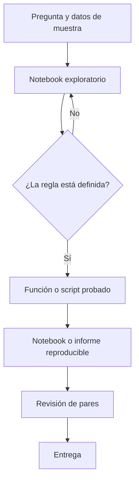

# 3. Notebooks, scripts y revisión de pares

## Objetivo

Elegirás una forma de trabajo que permita explorar sin convertir el resultado en una caja negra. Un **notebook** es un documento con celdas de explicación, código y salida; un **script** es un archivo de instrucciones que se ejecuta de principio a fin. Ambos pueden ser correctos; resuelven problemas distintos.

## Exploración, producción y explicación

En Nébula Leo explora una muestra en un notebook: cuenta cuentas por versión, mira nulos y formula hipótesis. Cuando ya sabe la regla de activación, la mueve a `src/calcular_activacion.py` para que se ejecute siempre igual. El notebook final importa esa lógica, explica decisiones y muestra la tabla que revisa Producto.



El bucle de exploración es normal. El peligro aparece si una celda usa un estado oculto: el notebook parece funcionar porque una variable se ejecutó ayer, pero falla desde cero.

## Contrato de una función analítica

Una función no es solo sintaxis: declara una entrada, una transformación y una salida esperada.

```python
def tasa_activacion(cuentas):
    """Devuelve activadas / elegibles; exige una fila por cuenta."""
    elegibles = [fila for fila in cuentas if not fila["es_interna"]]
    if not elegibles:
        raise ValueError("No hay cuentas elegibles")
    activadas = sum(fila["activa_7d"] for fila in elegibles)
    return activadas / len(elegibles)
```

El comentario expone el **grano** (una fila por cuenta) y el error explícito evita devolver una tasa falsa cuando el denominador es cero. Una prueba pequeña verifica, por ejemplo, que dos activadas de cuatro cuentas dan `0.5` y que las internas no entran en el denominador.

## Lista de revisión que importa

Una revisión útil no dice solo «usa otro nombre». Quien revisa debe poder responder:

- ¿la fuente, fecha de corte y consulta están identificadas?
- ¿la unidad de análisis es una cuenta, usuario o evento y se mantiene al unir tablas?
- ¿el denominador coincide con el contrato de métrica?
- ¿hay filtros de pruebas, duplicados, nulos y zonas horarias documentados?
- ¿el notebook se ejecuta de arriba abajo en un entorno limpio?
- ¿la conclusión distingue una caída observada de una causa probada?

Un comentario accionable dice: «En la línea que une eventos con cuentas, valida que cada cuenta siga apareciendo una vez; de lo contrario varios eventos inflan el denominador». Incluye el riesgo y cómo verificarlo.

### Contraejemplo

Copiar una tabla desde un notebook al dashboard puede dar una respuesta rápida, pero si no existe script ni parámetros esa tabla no puede actualizarse ni auditarse. Automatizar tampoco es siempre mejor: para una pregunta irrepetible y pequeña, documentar un paso manual controlado puede ser suficiente; lo importante es declararlo.

## Resumen

Explora en notebooks, estabiliza reglas en scripts y revisa supuestos, no solo formato. En la siguiente lección comprobarás que un script correcto no arregla eventos que nunca se recogieron: [instrumentación y tracking plan](04-instrumentacion-y-amplitude.md).
