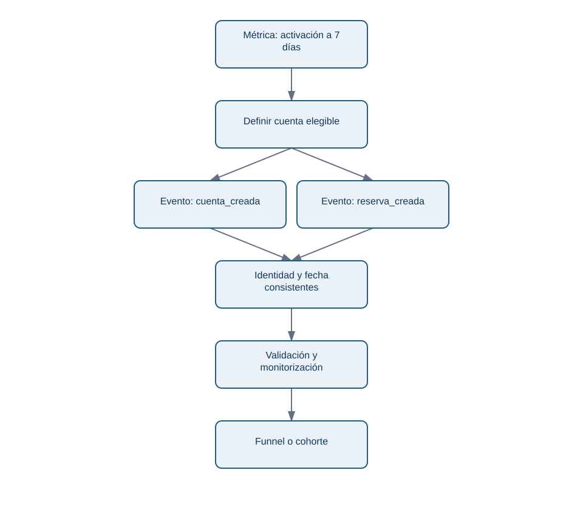
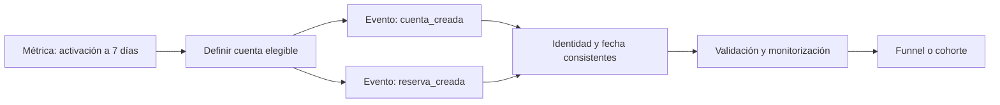

# 4. Instrumentación, tracking plan y Amplitude

## Objetivo y vocabulario

Diseñarás evidencia antes de pedir un funnel. Un **evento** es el registro de que ocurrió una acción en un momento; una **propiedad** describe su contexto. Por ejemplo, `reserva_creada` es un evento y `version_app="4.2"` puede ser una propiedad. Instrumentar es programar el producto para que emita esos registros de forma definida.

Un *tracking plan* es el contrato compartido de esos eventos. Amplitude es una plataforma que puede gestionar ese plan y analizar eventos; no convierte automáticamente datos ambiguos en datos fiables. Su documentación actual recomienda diseñar el plan antes de escalar la instrumentación y define eventos, propiedades y fuentes de emisión.

## De una métrica a los eventos necesarios

<!-- mobile-diagram: rendered fallback -->

Ver código Mermaid editable

El diagrama muestra una dependencia: un funnel es el último paso. Si `cuenta_creada` usa un identificador y `reserva_creada` otro, no se puede saber con honestidad si una misma cuenta hizo ambas cosas.

## Extracto de tracking plan para Nébula

- **Evento:** `cuenta_creada`.
- **Cuándo se emite:** el backend confirma la creación; no al abrir el formulario.
- **Identidad:** `account_id` estable; nunca correo ni nombre en la herramienta analítica.
- **Propiedades:** `version_app`, `plataforma`, `canal`, `pais`, `timestamp_utc`.
- **Reglas:** `version_app` es texto no vacío; plataforma está en `ios`, `android`, `web`; fecha en UTC.
- **Dueño:** Ingeniería de plataforma implementa; Producto aprueba la semántica; Datos valida cobertura.
- **Versión:** `tracking_plan_v3`, fecha de entrada y fecha de retirada.

La propiedad no existe para «capturarlo todo». Recoger país puede ser proporcional para segmentar una versión; recoger contenido de notas de usuario no lo es para medir activación. Minimizar información reduce riesgo de privacidad y complejidad.

## Validar antes de interpretar

Antes de comparar 4.1 y 4.2, revisa: volumen diario de cada evento, proporción de propiedades obligatorias presentes, distribución por versión, duplicados y retraso de llegada. Si el evento de reserva dejó de emitirse en Android 4.2, una caída del funnel es un problema de medición, no evidencia sobre comportamiento.

Amplitude Data permite definir eventos, propiedades, fuentes y reglas; también puede señalar datos inesperados o inválidos frente al plan. Esa validación es una ayuda operativa, no una sustitución de la decisión humana sobre qué significa «activación».

### Error habitual: cliente frente a servidor

Un evento enviado desde el móvil puede no llegar si la aplicación se cierra o no tiene red. Un evento confirmado por servidor suele representar una acción completada, pero puede llegar con retraso y no refleja abandonos del formulario. El tracking plan debe declarar cuál se usa y por qué; mezclar ambos sin distinguirlos genera doble conteo.

## Resumen y fuentes

La instrumentación es un sistema de evidencia con semántica, identidad, reglas, propietarios y versión. Antes de un dashboard, valida que el sistema sigue observando lo que promete.

Fuentes primarias actuales: [crear un tracking plan en Amplitude](https://amplitude.com/docs/data/create-tracking-plan), [planificar la implementación](https://amplitude.com/docs/get-started/plan-your-implementation) y [monitorizar eventos frente al plan](https://amplitude.com/docs/data/validate-events).

Sigue con [BI y dashboards](05-bi-y-dashboards.md), donde esa evidencia se convierte en una vista de decisión repetible.
