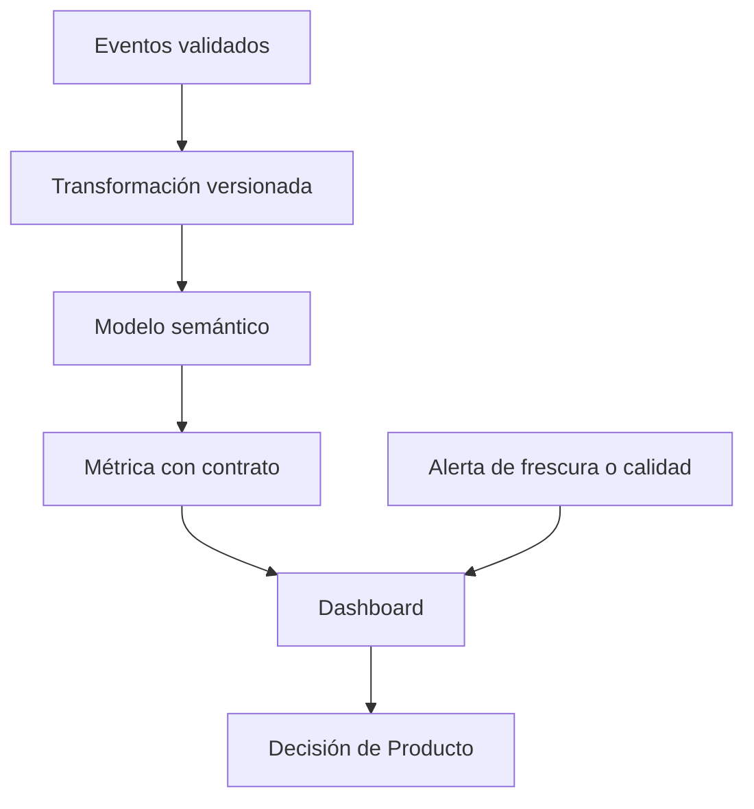

# 5. BI, dashboards y contrato de métrica

## Objetivo

Diseñarás un dashboard que ayude a decidir sin ocultar su definición. Una herramienta de **BI** (business intelligence), como Power BI, Tableau o Looker, conecta datos, modelo semántico, métricas y visuales. La interfaz cambia; el problema permanece: muchas personas necesitan consultar la misma medida sin que cada una escriba una fórmula diferente.

Un dashboard no es una investigación completa ni un mural de gráficos. Es un producto recurrente para una audiencia, una decisión y una cadencia concreta.

## El contrato viaja con la métrica

Para Nébula, el título «Activación» no basta. El contrato debe ser visible mediante un enlace o panel de información:

- **Fórmula:** cuentas elegibles con reserva confirmada en siete días / cuentas elegibles dadas de alta.
- **Grano:** una fila por cuenta de alta; no una fila por evento.
- **Ventana:** cohorte por fecha de alta, observada siete días completos.
- **Fuente:** tabla derivada `activation_cohort_v3`, refrescada desde eventos validados.
- **Exclusiones:** cuentas internas, demos y altas sin siete días observables.
- **Frescura:** última actualización, zona horaria y retraso esperado visibles.
- **Propietario:** Datos mantiene la definición; Producto aprueba cambios de propósito.

Cada capa tiene una responsabilidad. Añadir una fórmula rápida directamente al gráfico evita el modelo compartido y multiplica definiciones. La alerta no implica que el dato sea falso, pero evita que una cifra atrasada se lea como presente.

## Vista de decisión, no colección de gráficos

El panel de activación puede contener: indicador global y diferencia frente al periodo comparable; tendencia por cohorte; tabla por versión/plataforma con tamaños de muestra; estado de cobertura de los dos eventos; enlace a ticket y contrato. Cada visual responde una pregunta escrita: «¿dónde está la caída?» en lugar de «gráfico 3».

Un filtro puede cambiar el denominador. Si la persona elige Android, el panel debe indicar que analiza solo cuentas Android y preservar la definición temporal. No permitas filtros silenciosos que combinen ventanas distintas o excluyan datos sin aviso.

## Refresco, permisos y mantenimiento

El refresco lee de una fuente, actualiza el modelo y actualiza visuales que dependen de él; por eso un dashboard necesita fecha de último refresco y dueño. Power BI documenta estas fases y sus dependencias. Los permisos deben dar acceso al mínimo necesario: no todo consumidor de un panel necesita acceso a identificadores de eventos.

### Contraejemplo

Un tablero puede mostrar que Android 4.2 tiene 42 % frente a 48 % en 4.1. No prueba que la versión sea causa: puede haber canales, países o cohortes distintos. El dashboard señala dónde investigar; el ticket, diseño de análisis y límites deciden qué se puede afirmar.

## Resumen y comprobación

Un dashboard fiable hace visibles fórmula, grano, frescura, filtros, fuentes y responsable. Comprueba: ¿puedes recrear la métrica fuera del panel? ¿alguien detectaría un fallo de tracking antes de tomar una decisión?

**Fuente primaria:** [Microsoft Learn: ciclo de actualización de datos en Power BI](https://learn.microsoft.com/en-us/power-bi/connect-data/refresh-data). Continúa con [entrega y seguimiento](06-entrega-y-seguimiento.md).
