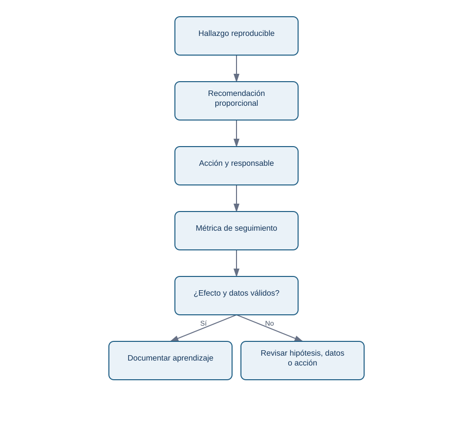
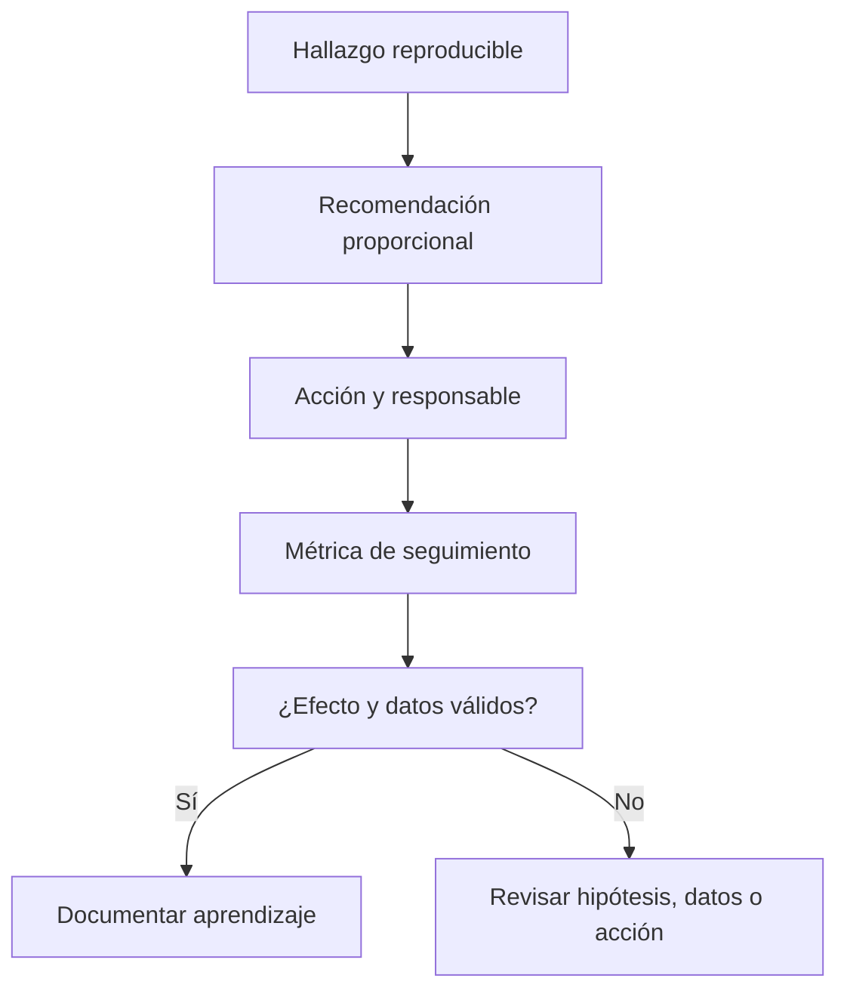

# 6. Entrega, seguimiento y comunicación

## Objetivo

Cerrarás un análisis de manera que una decisión sea revisable y genere aprendizaje. La entrega correcta no es «muchos gráficos»: combina una recomendación, la evidencia que la respalda, incertidumbre, artefactos reproducibles y un plan para comprobar el efecto.

La secuencia siguiente muestra qué debe quedar unido cuando el análisis se entrega y se opera:

<!-- mobile-diagram: rendered fallback -->

Ver código Mermaid editable

La secuencia evita dos errores opuestos: defender la primera conclusión por orgullo y cambiar de decisión cada vez que un gráfico se mueve. Si la evidencia no es válida, se abre una nueva investigación; el seguimiento puede invalidar la interpretación inicial y eso es aprendizaje, no fracaso.

## La nota de decisión de Nébula

Una nota de una página puede seguir esta estructura:

1. **Decisión solicitada:** no revertir todavía; lanzar corrección de tracking Android y limitar el despliegue de 4.2.
2. **Hallazgo:** la activación observada es menor en Android 4.2, pero `reserva_creada` cae de forma anómala el mismo día de la versión.
3. **Evidencia:** enlace a consulta/script versionado, cohorte, tamaños, cobertura diaria y dashboard.
4. **Qué no sabemos:** no se puede atribuir la caída al flujo de producto hasta validar emisión del evento.
5. **Siguiente medición:** tras corrección, comparar cohorte con siete días completos; responsable y fecha.

## Adaptar el formato sin alterar la certeza

Dirección necesita decisión, coste, riesgo y fecha. Ingeniería necesita definición del evento, entorno, criterios de validación y enlace al ticket. Datos necesita consulta, versión de código, corte y controles de calidad. Son vistas del mismo contrato: resumir no autoriza a convertir una asociación en causalidad.

Registra también decisiones negativas: «no se publica la tasa por país porque falta cobertura en Android». Sin ese registro, el equipo puede volver a hacer el mismo análisis defectuoso dentro de tres meses.

## Cierre operativo

Antes de cerrar el ticket, confirma que el entregable tiene: enlace al repositorio o script, versión de definición, fuente y fecha de corte, revisión realizada, dueño de la acción, métrica de seguimiento y fecha de revisión. Si se modifica la métrica, abre un cambio nuevo: reescribir el pasado sin versión rompe la comparabilidad.

### Límite profesional

Reproducible no equivale a útil. Puedes repetir un cálculo impecable basado en una pregunta irrelevante. Por eso el ticket vuelve a aparecer al final: el análisis sirve a una decisión explícita y sus consecuencias deben observarse.

## Práctica

Resuelve la [investigación reproducible de activación](../../../ejercicios/temario-13/aplicacion/investigacion-activacion.md), ejecuta el [laboratorio](../../../notebooks/practicas/13-activacion-reproducible.py) y compara tus decisiones con la [solución](../../../soluciones/temario-13/investigacion-activacion.md).

Al terminar, el bloque 14 amplía tus herramientas técnicas, pero el hábito de contratos, trazabilidad y seguimiento debe permanecer en todos los proyectos.
