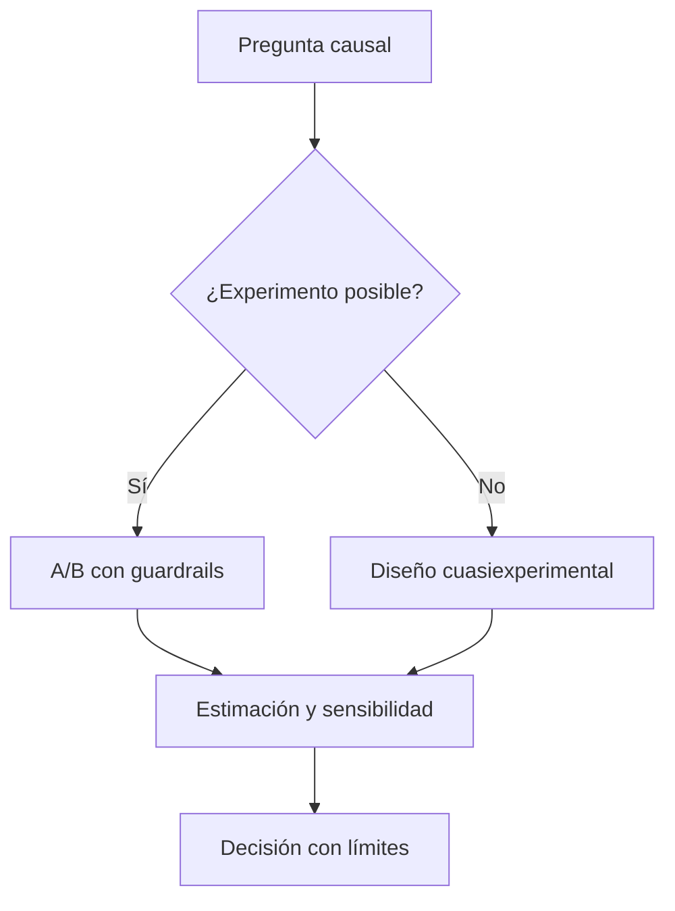

# Bloque 14 - Nivel avanzado: causalidad, escala y criterio

## Objetivo

Reconocer problemas avanzados que aparecen al analizar productos y operaciones reales: causalidad, anomalías, datos grandes y datos con estructura espacial o externa.

## Causalidad

Cuando la pregunta es "qué ocurriría si cambiamos X", una correlación no basta. Los experimentos aleatorizados son la referencia cuando son posibles. Cuando no lo son, considera diseños cuasiexperimentales, diferencias en diferencias, regresión discontinua o matching con gran cautela y supuestos explícitos.

## Escala y rendimiento

Cuando un dataset no cabe cómodamente en memoria, empieza por reducir columnas y filas, filtrar antes de transferir y usar formatos columnares. DuckDB y Polars son herramientas útiles; no sustituyen un modelado correcto ni la definición clara de la pregunta.

## Anomalías y monitorización

Una anomalía es una observación inesperada respecto a un patrón, no necesariamente un incidente. Comprueba primero cambios de tracking, calendario, despliegues y calidad de datos. Diseña alertas con umbrales y responsables para evitar fatiga de alertas.

## APIs y datos externos

Documenta procedencia, licencia, frecuencia y sesgo de cada fuente. Una API puede cambiar sus campos o límites; la reproducibilidad exige guardar fecha de extracción, versión y transformaciones.

## Práctica

Evalúa [un supuesto causal](../../ejercicios/temario-14/aplicacion/supuesto-causal.md).
