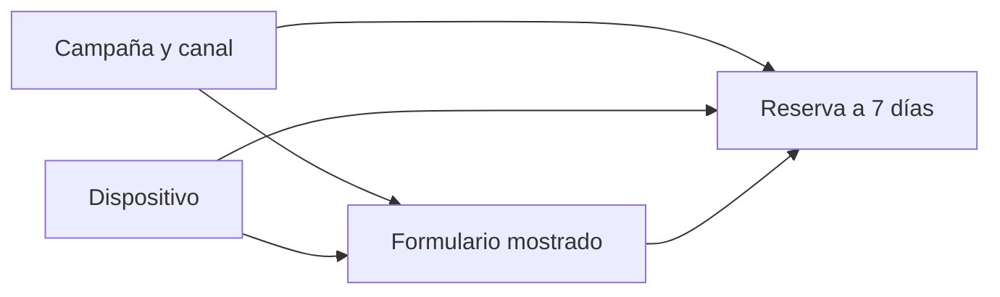

# Causalidad: contrafactuales, DAG y diseños

## Resultado y prerrequisitos

Al terminar podrás convertir “el formulario nuevo bajó la conversión” en una pregunta que se pueda investigar, declarar el efecto que buscas y elegir un diseño proporcional a la decisión. Necesitas distinguir una tasa de conversión de una causa; no necesitas haber usado un modelo causal.

## El problema: dos explicaciones para el mismo descenso

En Lumen, el formulario B se activó el 8 de junio. A partir de entonces la conversión observada bajó. Eso describe una **asociación temporal**: dos hechos ocurrieron juntos. La pregunta causal es distinta: *¿cuánto habría cambiado la conversión de esas mismas visitas si B no se hubiera mostrado?* Ese resultado alternativo, no observable para la misma visita en el mismo instante, se llama **contrafactual**.

Definimos el estimando antes de mirar el resultado: diferencia media de conversión a 7 días entre mostrar B y mostrar A a las visitas elegibles entre el 8 y el 21 de junio. La población, la ventana, la unidad (visita, no evento) y el horizonte cambian la pregunta. “Subió el uso” no es un estimando.

Una campaña de pago empezó el mismo día y trae visitas menos propensas a reservar. También cambió el navegador móvil de parte de la audiencia. Ambas variables pueden explicar simultáneamente qué formulario vio una persona y si reservó: son **confusores**.

## Un DAG hace explícita la historia que estás suponiendo

La pregunta es: ¿por qué una comparación bruta puede engañar? El siguiente grafo dirigido acíclico (DAG) no prueba causalidad; obliga a declarar qué caminos se deben bloquear.

El camino `Formulario <- Campaña -> Reserva` no representa el efecto del formulario: mezcla audiencia con experiencia. Medir canal y dispositivo puede permitir ajustar; no medir una causa relevante impide prometer que el ajuste “ha eliminado el sesgo”. No controles una variable que ocurre **después** del tratamiento, como “tiempo dentro del nuevo formulario”: podría ser un mediador y cambiar la pregunta.

## Diseños: qué comparan realmente

Un experimento A/B asigna A o B al azar antes de la experiencia. La aleatorización hace comparables, en expectativa, variables conocidas y desconocidas. Requiere asignación estable, análisis por intención de tratar, instrumentación válida y guardrails (errores, cancelaciones, latencia). No autoriza parar al primer resultado llamativo ni ignorar interferencias entre usuarios.

Si no se puede experimentar, el diseño cuasiexperimental intenta construir un contrafactual aproximado, nunca automático:

| Diseño | Comparación | Supuesto crítico | Evidencia que pedir |
| --- | --- | --- | --- |
| Diferencias en diferencias | cambio de grupo tratado frente a control | tendencias paralelas sin cambio | serie pretratamiento y placebo |
| Discontinuidad | usuarios justo a ambos lados de un umbral | nadie manipula el umbral; continuidad local | densidad y covariables cerca del corte |
| Matching/ponderación | tratados y no tratados con perfiles observados | no hay confusores no medidos relevantes | balance posterior y solapamiento |

Para Lumen, el diseño preferible es A/B por visita elegible, estratificado por plataforma si el equipo lo necesita operativamente. Si B se desplegó a toda la población, una comparación antes/después **no separa** campaña, estacionalidad y formulario; una diferencia en diferencias con un país no desplegado solo es defendible tras mostrar tendencias previas semejantes y cambios comparables.

## Ejemplo trabajado: lectura prudente

Supón 20.000 visitas A y 20.000 B. A convierte 4,8 % y B 4,2 %: diferencia B-A = -0,6 puntos porcentuales. Esa es la estimación observada, no “B destruye 12,5 % de las reservas”. La siguiente lección calcula su incertidumbre. Si la asignación fue defectuosa o B solo se mostró en móvil, el número responde a otra pregunta.

## Errores frecuentes

- Ajustar por todas las columnas disponibles sin dibujar el momento causal de cada una.
- Llamar “control” a usuarios que nunca pudieron recibir B; viola comparabilidad.
- Confundir significación estadística con impacto de producto: -0,05 puntos puede ser muy preciso y aun irrelevante.
- Ocultar cambios de definición del evento `reserva_confirmada` entre variantes.

## Resumen y comprobación

Una afirmación causal necesita tratamiento, resultado, población, contrafactual y supuestos. Un DAG es un mapa de supuestos, no una máquina de verdad.

1. ¿Qué contrafactual falta en una comparación antes/después?
2. ¿Por qué campaña puede ser confusor y tiempo de formulario un mal control?
3. ¿Qué prueba previa pedirías antes de aceptar diferencias en diferencias?

Aplica la formulación al [laboratorio integrado](../../../ejercicios/temario-14/aplicacion/investigar-caida-conversion.md).
