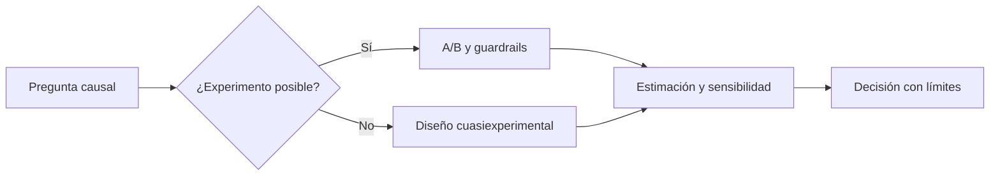

# Preguntas causales y diseños posibles

## Objetivos y prerrequisitos

Distinguirás “qué ocurrió” de “qué habría ocurrido si cambiamos algo” y elegirás evidencia proporcional a la decisión.

Una pregunta causal compara escenarios que no se observan a la vez: “¿reducir el formulario aumentaría reservas?”. La correlación entre formularios cortos y más reservas no basta; quizá los usuarios o campañas eran distintos. Un experimento aleatorizado aproxima una comparación justa al asignar variantes de forma controlada.

Cuando no hay experimento, diferencias en diferencias, regresión discontinua o matching pueden aportar evidencia, pero cada uno necesita supuestos verificables y análisis de sensibilidad. No son “botones de causalidad”.

## Resumen

Declara el cambio, la población, el contrafactual y los supuestos. Continúa con [bootstrap y sensibilidad](02-bootstrap-y-sensibilidad.md).
