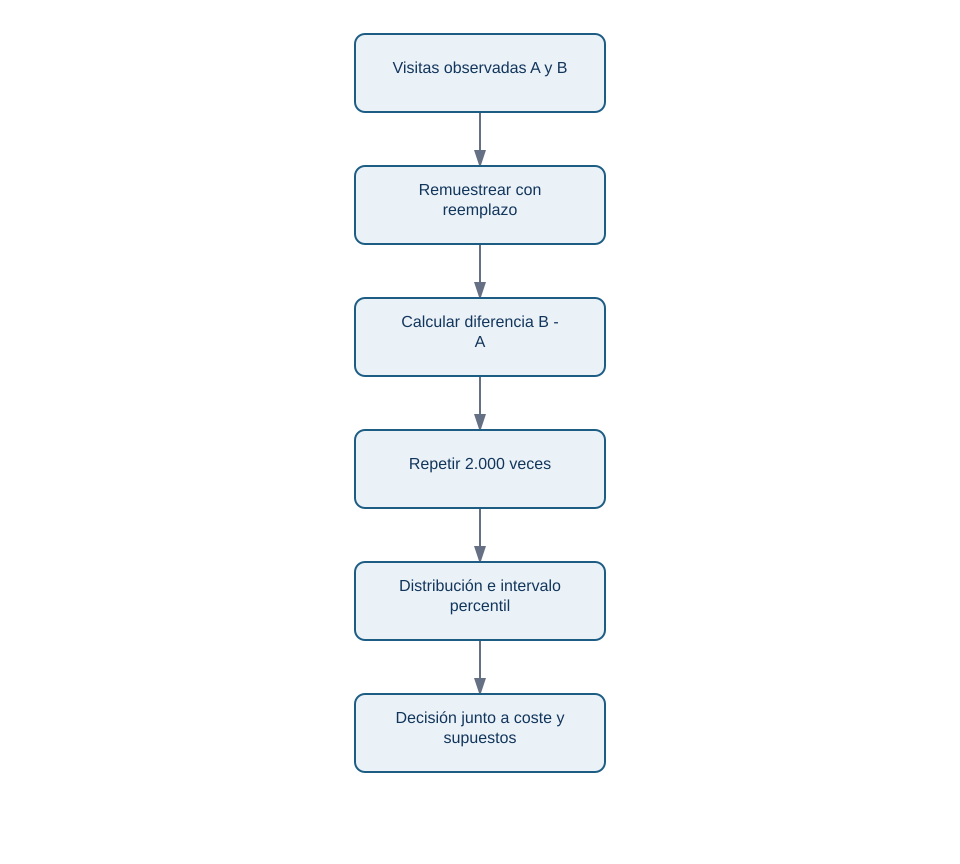
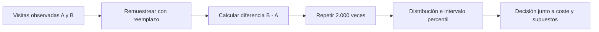

# Bootstrap, incertidumbre y sensibilidad

## Resultado y prerrequisitos

Podrás construir e interpretar una distribución bootstrap para una diferencia de conversión y separar incertidumbre de muestreo de sesgo causal. Debes saber calcular una media o proporción.

## De un número a una distribución de números

Lumen observa una diferencia B-A de -0,6 puntos porcentuales. Una muestra alternativa de visitas habría dado una cifra algo distinta. El **bootstrap** aproxima esa variación: toma muchas muestras del mismo tamaño, con reemplazo, de los datos observados; recalcula la estadística en cada una; y usa la distribución resultante para describir estabilidad.

<!-- mobile-diagram: rendered fallback -->

Ver código Mermaid editable

“Con reemplazo” significa que una visita puede aparecer dos veces en una réplica y otra ninguna. No inventa usuarios nuevos ni corrige el sesgo de selección. Si los eventos de una persona están repetidos, la unidad de remuestreo debe ser la persona o el clúster, no cada evento; de lo contrario se finge más información de la que existe.

## Ejemplo mínimo y lectura

Para cada réplica, muestrea 20.000 conversiones de A y 20.000 de B, calcula `proporcion_B - proporcion_A`, y guarda el resultado. Si los percentiles 2,5 y 97,5 son -0,95 y -0,23 puntos, un intervalo bootstrap percentil al 95 % compatible con este procedimiento es `[-0,95, -0,23]`. No significa “hay 95 % de probabilidad de que el efecto verdadero esté dentro” sin especificar un marco estadístico; sí comunica que con este modelo de remuestreo el efecto negativo no es frágil al azar muestral.

La decisión requiere magnitud: si perder 0,23 puntos ya supera el guardrail, se pausa B. Si el intervalo incluye un daño pequeño e impacto esperado muy bajo, se puede ampliar muestra. Reporta denominadores, fecha de corte, variantes excluidas y si el intervalo fue planeado antes de mirar.

## Sensibilidad: hacer visibles decisiones que cambian el veredicto

La sensibilidad pregunta “¿seguiría la recomendación bajo alternativas defendibles?”. Para Lumen construye una tabla: ventana de 7 frente a 14 días; incluir/excluir tráfico de afiliados etiquetado tarde; métrica por visita frente a usuario; y ajuste por plataforma. No elijas alternativas después para fabricar una conclusión.

| Decisión razonable | Estimación B-A | Lectura |
| --- | ---: | --- |
| Intención de tratar, 7 días | -0,60 pp | estimando principal |
| Solo móvil | -1,10 pp | posible interacción; investigar UX |
| Excluir campaña defectuosa | -0,18 pp | tracking/canal puede explicar parte |

Si la conclusión cambia de “daño claro” a “sin efecto” por una limpieza defendible, la conclusión correcta es fragilidad y necesidad de auditar, no escoger la fila favorita. El bootstrap tampoco arregla un evento duplicado, atribución errónea o confusor no medido.

## Mini-laboratorio

Ejecuta `python notebooks/practicas/14-caida-conversion.py`. Compara el intervalo de la diferencia y modifica la semilla o la tasa de B. Después explica qué pregunta **no** responde el código: no demuestra que B cause el efecto porque los datos simulados no representan el mecanismo de asignación real.

## Resumen y comprobación

Bootstrap cuantifica variación al remuestrear los datos disponibles. Sensibilidad expone la dependencia de decisiones y supuestos; ninguna reemplaza un diseño causal.

1. ¿Qué unidad remuestrearías si cada usuario genera muchas visitas?
2. ¿Por qué un intervalo estrecho puede coexistir con un resultado sesgado?
3. Nombra una alternativa de definición de métrica que probarías.
