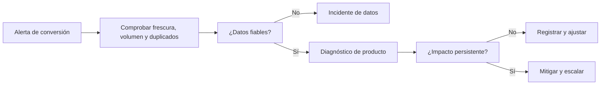

# Anomalías, alertas y runbooks

## Resultado y prerrequisitos

Podrás diferenciar una observación rara de un incidente, definir una alerta accionable y escribir el primer tramo de su runbook. Se asume que conoces una métrica y su denominador.

## Una alerta no es una línea roja

Una **anomalía** es un valor que se aparta de un patrón esperado. Un descenso de conversión puede ser producto, estacionalidad semanal, campaña, falta de datos o una definición cambiada. Una **alerta** es una regla que pide a una persona actuar porque el coste de no detectar algo supera el coste de investigarlo. El detector no diagnostica por sí solo.

Para Lumen se define: “alertar a la persona de guardia si la conversión diaria por plataforma está 25 % por debajo de la referencia comparable durante dos ventanas consecutivas, con al menos 1.000 visitas y frescura menor de 90 minutos”. La referencia debe ser explícita: mediana de los cuatro mismos días de semana anteriores, no una media de todo el mes que mezcle fin de semana y laborable.

El flujo evita un error común: comunicar “la conversión cayó” a dirección cuando en realidad el SDK dejó de enviar eventos Android. El primer paso es validar la observabilidad.

## Runbook mínimo, responsable y evidencia

Un **runbook** es una instrucción operativa para responder de forma repetible. Debe existir antes de alertar. Para esta señal incluye:

1. Propietario y horario de cobertura; canal de escalado y severidad.
2. Enlace a consulta versionada: numerador, denominador, zona horaria y retraso esperado.
3. Comprobaciones de calidad: frescura, conteo de eventos fuente, nulos, duplicados y cambios de esquema.
4. Cortes de diagnóstico: plataforma, versión de app, canal, país y experimento; evitar segmentar hasta encontrar ruido.
5. Contexto operativo: despliegues, campañas, precios, stock y cambios de tracking.
6. Acción reversible y criterio de cierre: pausar flag, corregir instrumentación, o documentar efecto esperado.

Guarda cada alerta con hora, valor, referencia, versión de regla, persona que cerró y causa final. Esa etiqueta permite estimar precisión operativa: cuántas alertas eran incidentes reales frente a ruido. Un umbral más sensible sube detección pero también fatiga; una alerta ignorada repetidamente es una deuda de confianza.

## Límite de un z-score y alternativa práctica

Un umbral “menos de 3 desviaciones estándar” presupone una distribución y estabilidad que la conversión diaria rara vez tiene: cambia con día de semana, campañas y tamaño de muestra. Para empezar, una referencia estacional explícita, mínimo de volumen y persistencia es más auditable. Después se pueden evaluar modelos de detección, pero se comparan contra este baseline y se miden retraso y falsos positivos.

## Resumen y comprobación

Una buena alerta incluye métrica, referencia comparable, ventana, umbral, mínimos de calidad, propietario y acción. Monitorizar es diseñar una decisión, no añadir color rojo a un panel.

1. ¿Qué comprobarías antes de atribuir la caída al formulario?
2. ¿Por qué el mismo umbral no sirve necesariamente en lunes y domingo?
3. Escribe un criterio de cierre verificable para el incidente.
