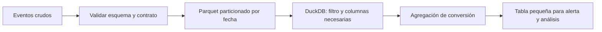

# Escala: Parquet, particiones y DuckDB

## Resultado y prerrequisitos

Sabrás decidir por qué una consulta es costosa antes de cambiar de herramienta, y podrás consultar un conjunto Parquet particionado sin leer columnas ni archivos innecesarios. Debes conocer tabla, columna, filtro y agregación.

## El problema antes de la herramienta

Lumen guarda cientos de millones de eventos de visita. Abrir todo en memoria para calcular la conversión de Android en junio es innecesario: la pregunta necesita fecha, plataforma, tipo de evento y usuario; no necesita URL completa, propiedades JSON ni meses distintos. Reducir columnas, filas y transferencias suele ser el primer escalado real.

Un archivo **Parquet** guarda columnas juntas, a diferencia de un archivo de texto que suele recorrer cada fila completa. Esto permite que un motor lea solo las columnas requeridas. Una **partición** divide el conjunto en carpetas o archivos por una clave, por ejemplo `fecha=2026-06-08/plataforma=android/`. No es una sustitución de índices ni una garantía de velocidad: demasiadas particiones pequeñas crean coste de archivos y metadatos.



El diagrama muestra un punto esencial: el formato no decide qué significa una visita ni resuelve duplicados; el contrato se valida antes.

## Consultar sin cargarlo todo

DuckDB es un motor SQL embebido: se ejecuta dentro de un proceso local y puede consultar archivos. Un ejemplo con datos particionados de Lumen es:

```sql
SELECT
  event_date,
  platform,
  count(DISTINCT user_id) FILTER (WHERE event_name = 'visit') AS visitas,
  count(DISTINCT user_id) FILTER (WHERE event_name = 'booking_confirmed') AS reservas
FROM read_parquet('eventos/event_date=*/platform=*/*.parquet', hive_partitioning = true)
WHERE event_date BETWEEN DATE '2026-06-08' AND DATE '2026-06-14'
  AND platform = 'android'
  AND event_name IN ('visit', 'booking_confirmed')
GROUP BY 1, 2;
```

**Projection pushdown** significa que el motor solicita solo las columnas usadas; **filter pushdown**, que intenta aplicar filtros al leer para saltarse partes irrelevantes. DuckDB documenta ambos comportamientos para Parquet, pero debes confirmar el plan y medir: un filtro sobre una columna no ordenada o archivos sin estadísticas puede no evitar tanta lectura como esperas. `EXPLAIN ANALYZE` es evidencia, no decoración.

## Particionar para preguntas, no por costumbre

Particionar por fecha suele ser útil cuando casi todas las consultas tienen ventana temporal. Añadir `platform` puede ayudar si es un filtro habitual y cada partición sigue teniendo tamaño razonable. Particionar por `user_id` generaría muchísimas carpetas pequeñas: mal patrón para este caso. Revisa tamaño de archivos, coste de listar objetos, evolución de esquema, zona horaria que define `event_date` y retención.

La siguiente estructura hace visible el contrato de lectura:

```text
eventos/
  event_date=2026-06-08/platform=android/part-000.parquet
  event_date=2026-06-08/platform=ios/part-000.parquet
```

No copies indiscriminadamente datos personales a archivos locales para “ir más rápido”. Conserva permisos, minimiza columnas y usa entornos autorizados. Escala también implica coste, acceso y reproducibilidad.

## Fuentes técnicas actuales

- [DuckDB: lectura de Parquet y pushdown](https://duckdb.org/docs/stable/data/parquet/overview)
- [DuckDB: escritura y coste de particiones](https://duckdb.org/docs/stable/data/partitioning/partitioned_writes)
- [Apache Parquet](https://parquet.apache.org/)

## Resumen y comprobación

Empieza por el grano y la pregunta; después reduce columnas, filas y transferencia. Parquet y DuckDB ayudan cuando su diseño coincide con el acceso, no porque sean etiquetas modernas.

1. ¿Qué columnas son imprescindibles para la consulta de Lumen?
2. ¿Por qué una partición por usuario es mala aquí?
3. ¿Qué evidencia pedirías antes de afirmar que hay pushdown efectivo?
