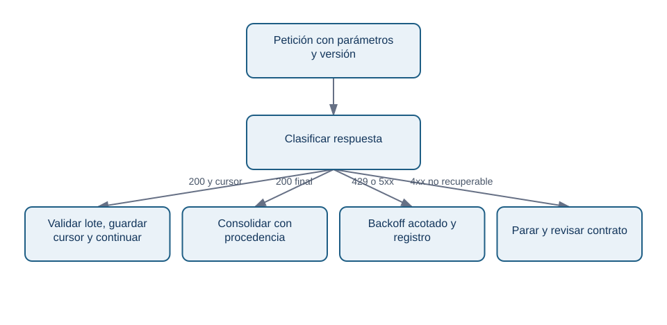
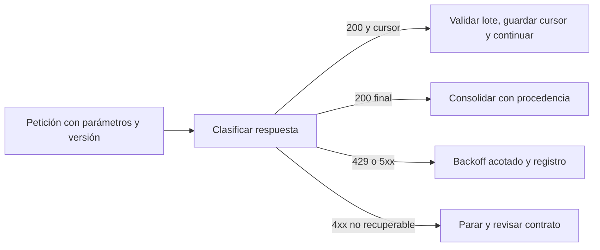
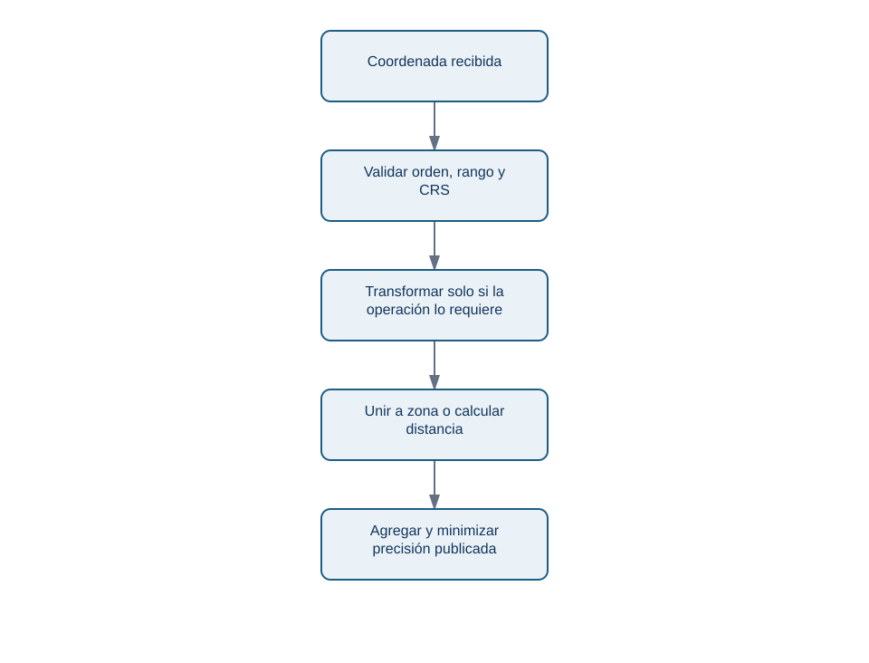
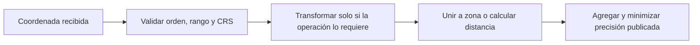

# APIs, datos geoespaciales y fuentes externas

## Resultado y prerrequisitos

Podrás diseñar una extracción externa pequeña que sea repetible y respetuosa con el proveedor, y evitar dos errores geográficos frecuentes: tratar coordenadas como direcciones y medir distancias con un sistema de referencia inadecuado.

## Pedir datos a otro sistema de forma responsable

Una **API** es una interfaz mediante la que un programa solicita datos o una acción a otro servicio. Para Lumen se quiere unir meteorología pública a reservas por día y zona para investigar una caída. Antes de escribir código, crea un contrato: proveedor y licencia, URL y versión, campos, zona horaria, cobertura, fecha de extracción, propósito, responsable, clave autorizada y política de retención. “Es público” no autoriza cualquier reutilización.

La respuesta puede venir en páginas: el servicio entrega, por ejemplo, 1.000 registros y un cursor para solicitar el siguiente lote. La extracción debe guardar cursor, fecha y respuesta cruda o hash para reproducibilidad. Ante `429 Too Many Requests`, espera el tiempo indicado o aplica espera exponencial con límite; no reintentes en bucle ni paralelices hasta derribar el límite. Ante errores 5xx, reintenta un número acotado; ante 4xx de validación, corrige la petición.

<!-- mobile-diagram: rendered fallback -->

Ver código Mermaid editable

El diagrama no es una receta para ignorar términos de uso: cada reintento debe tener límite, registro y dueño. Además, nunca guardes secretos de API en el repositorio; usa un almacén de secretos o variables de entorno autorizadas.

## Coordenadas: número, lugar y sistema de referencia no son sinónimos

Una coordenada `40.4168, -3.7038` es una posición bajo un **sistema de referencia de coordenadas** (CRS). Antes de unirla a barrios o calcular distancia, declara su CRS. EPSG:4326 suele expresar longitud/latitud en grados; los grados no son metros. Calcular distancia euclídea directamente sobre longitud/latitud da una cifra difícil de interpretar y que varía según ubicación. Para medidas métricas locales, transforma a un CRS proyectado apropiado y documenta la decisión.

<!-- mobile-diagram: rendered fallback -->

Ver código Mermaid editable

No infieras hogar, salud, renta o comportamiento a partir de una posición de entrega. Para un panel de Lumen, publicar reservas por celda muy pequeña puede reidentificar a una persona incluso sin nombre. Agrega a zonas con suficiente población, aplica mínimos de conteo, limita acceso y conserva solo la precisión necesaria para la decisión.

## Ejemplo conectado: meteorología no es explicación automática

Tras extraer precipitación diaria por ciudad, Lumen ve menos reservas en días lluviosos. Esa asociación puede servir como variable de contexto para una alerta o una previsión, pero no prueba que la lluvia causó la caída del formulario: puede coincidir con festivo, campaña o cobertura distinta de la fuente. Une por fecha, ciudad, zona horaria y versión de fuente; deja explícita la granularidad perdida al agregar.

## Mini-laboratorio y fuentes técnicas actuales

En el ejercicio integrado diseña una petición paginada y el contrato de una unión geográfica. No necesitas llamar una API real para aprender a diseñarla: evita cargar secretos o datos personales de prueba.

- [MDN: códigos HTTP y 429](https://developer.mozilla.org/en-US/docs/Web/HTTP/Status/429)
- [PostGIS: transformación entre sistemas de referencia](https://postgis.net/docs/ST_Transform.html)
- [Open Geospatial Consortium: CRS](https://www.ogc.org/standards/crs/)

## Resumen y comprobación

Una fuente externa requiere procedencia, límites de uso y validación; una coordenada exige CRS y una decisión de privacidad. Ninguno de los dos convierte una correlación en explicación causal.

1. ¿Qué guardarías para repetir una extracción de API mañana?
2. ¿Por qué no debes calcular kilómetros directamente con longitud y latitud?
3. ¿Qué regla de publicación reduce riesgo de reidentificación en un mapa?
