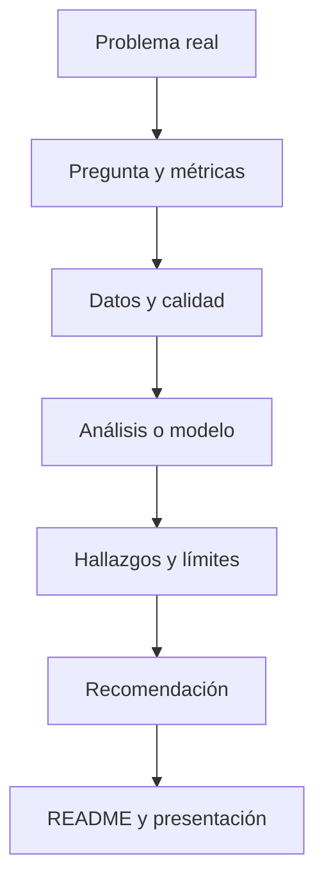

# Bloque 15 - Portfolio y preparación profesional

## Objetivo

Convertir competencias en evidencia visible: proyectos que muestran criterio, técnica, comunicación y honestidad sobre los límites.

## Qué demuestra un buen proyecto

Un portfolio no es una colección de gráficos. Cada proyecto debe partir de una pregunta relevante, explicar los datos, mostrar transformaciones, justificar decisiones, comunicar hallazgos y reconocer incertidumbre. La persona que lo lea debe poder reproducir el recorrido o entender dónde no puede hacerlo.

## Formato recomendado

Un proyecto contiene un README ejecutivo, un diccionario de datos, código o notebook reproducible, visualizaciones explicativas y una presentación breve. Es mejor tener tres proyectos claros y acabados que diez exploraciones incompletas.

## Entrevistas

Practica explicar una consulta SQL, detectar un error de calidad, definir una métrica y cuestionar una conclusión estadística. En casos de negocio, di qué pregunta harías primero, qué datos pedirías y cómo validarías tu recomendación.

## Capstone

El [proyecto final](../../proyectos/capstone/README.md) integra el curso: datos sin limpiar, análisis, métricas, visualización, recomendación y una entrega para público no técnico.

## Cierre

Terminar el curso no significa saberlo todo. Significa tener un método fiable para aprender una herramienta nueva, hacer preguntas mejores y justificar decisiones con evidencia.
