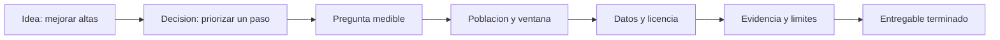

# Seleccionar y delimitar casos

## Resultado y prerrequisitos

Al acabar podras convertir una idea vaga en un proyecto terminable: una pregunta, una decision, un conjunto de datos y una evidencia concreta. Se presupone que sabes distinguir tabla, metrica, visualizacion y asociacion de causalidad.

## Antes del portfolio: una decision, no una herramienta

"Hice un dashboard con Python" describe una actividad, no un problema. En cambio, "identifique en que paso del alta se concentran los abandonos para decidir que pantalla investigar primero" indica a quien ayuda el analisis y que podria cambiar.

En *Nimbo*, la responsable de producto pregunta: "Debemos invertir el proximo sprint en activar comercios nuevos?". Un alcance defendible es analizar el embudo de alta de comercios iniciados entre el 1 y el 30 de abril, medir la proporcion que publica su primer menu en siete dias y localizar el paso con mayor abandono. No promete demostrar que un redisenyo aumentara ventas; para eso haria falta un experimento.

Este diagrama responde a "cuando una idea ya se puede convertir en proyecto?":

Cada flecha obliga a concretar una pieza. Si faltan datos para la pregunta, se modifica la pregunta o se declara el limite; no se rellena con una conclusion atractiva.

## Contrato de proyecto en una pagina

Antes de abrir un notebook, redacta este contrato:

1. **Decision y destinatario.** Quien decidira que, y cuando. Ejemplo: la responsable prioriza el sprint del lunes.
2. **Pregunta y metrica.** "En que paso cae la activacion?"; activacion = comercio que publica menu en siete dias / comercio que inicia alta. Define denominador, ventana y grano.
3. **Poblacion y corte.** Altas iniciadas en abril, con datos extraidos el 15 de mayo. Evita mezclar comercios sin tiempo suficiente para completar siete dias.
4. **Evidencia disponible.** Tabla de eventos, definicion de cada evento, procedencia, licencia y si los datos son reales o simulados.
5. **Entregable y exclusiones.** Un README, un analisis reproducible, una recomendacion y una presentacion de cinco diapositivas. Se excluye atribuir causalidad.

Una **hipotesis** es una explicacion que se puede contrastar, no el resultado que se desea. "El paso fiscal parece friccion" es una hipotesis; el conteo por paso es evidencia observacional. El error habitual es escribir "el paso fiscal causa el abandono" solo porque coinciden: pueden influir tipo de comercio, canal de captacion o fallos de tracking.

## Seleccionar tres casos con senal profesional

Un portfolio inicial puede tener dos casos muy terminados y un capstone. Busca variedad de decisiones, no de logos:

- **Fundamentos y limpieza:** datos tabulares con diccionario, duplicados, valores ausentes y una decision descriptiva.
- **Producto u operaciones:** SQL, metrica con contrato, segmentacion y una recomendacion priorizada.
- **Incertidumbre:** prevision, experimento o modelo solo si puedes validar y explicar su limite.

No uses datos personales innecesarios. Una licencia permite ciertos usos; cita URL y fecha de consulta. Si generas datos simulados, dilo en el titulo y explica que parte del razonamiento ilustran.

## Comprobacion y proximo paso

Responde: que decision cambiaria si el resultado fuese A en vez de B? Si la respuesta es "ninguna", el caso es una exploracion, no un proyecto analitico. Redacta el contrato del [ejercicio de auditoria](../../../ejercicios/temario-15/auditoria-portfolio.md) antes de consultar su solucion.
