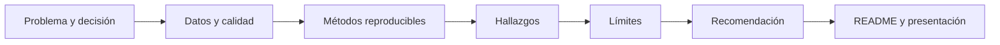

# Estructurar un proyecto defendible

## Objetivos y prerrequisitos

Organizarás los artefactos que permiten a otra persona entender, ejecutar y cuestionar un análisis.

Un proyecto debe incluir README ejecutivo, pregunta y decisión, diccionario de datos, procedencia/licencia, código o notebook reproducible, visualizaciones, límites y próximos pasos. El README no repite cada detalle técnico: permite entender en dos minutos qué se halló y dónde está la evidencia.

Este flujo responde a “¿qué debe poder seguir una persona que revisa un caso?”

El diagrama no obliga a una secuencia rígida: al hallar un error de datos puedes volver a la pregunta. Sí obliga a no saltar de datos a recomendación sin mostrar el razonamiento.

## Resumen

Un caso defendible conserva tanto el resultado como el camino. Continúa con [narrativa y revisión](03-narrativa-revision-y-publicacion.md).
