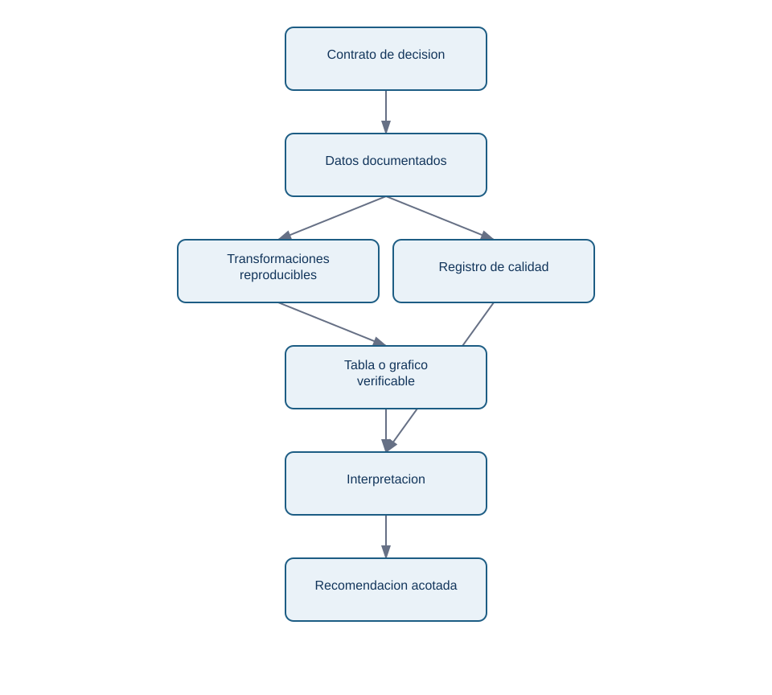
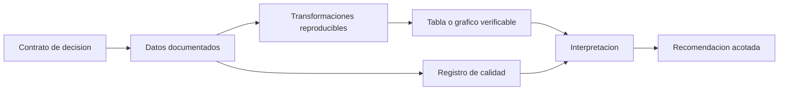

# Estructurar un proyecto defendible

## Resultado y prerrequisitos

Organizaras los archivos que permiten a otra persona entender, ejecutar y cuestionar un analisis sin depender de tu memoria. Necesitas el contrato anterior y un entorno desde el que ejecutar Python o SQL.

## De notebook exploratorio a entrega

Un **notebook** mezcla texto, codigo y resultados; es excelente para explorar. Una **entrega reproducible** es el conjunto de instrucciones y archivos con los que otra persona obtiene el mismo resultado a partir de una fuente conocida. Ninguno sustituye al otro. En *Nimbo*, un notebook puede probar como contar el embudo; la entrega debe aclarar que archivo contiene eventos, que columnas se usan y como generar la tabla final.

La estructura minima responde a "donde esta cada evidencia?":

```text
capstone-nimbo/
  README.md                 # decision, resultado y como reproducir
  data/README.md            # procedencia; no subir datos sensibles
  docs/diccionario-datos.md # significado, grano y calidad de columnas
  docs/registro-decisiones.md
  notebooks/01_analisis.ipynb
  src/                      # pasos repetibles, si son necesarios
  outputs/                  # tablas y graficos generados
  requirements.txt          # versiones o instrucciones del entorno
  LICENSE
```

No es necesario usar todas las carpetas en un proyecto pequeno. Si es necesario que toda omision sea intencionada y que las rutas del README existan.

Este diagrama responde a "que evidencia sostiene una recomendacion?":

<!-- mobile-diagram: rendered fallback -->


<details>
<summary>Ver código Mermaid editable</summary>


</details>

La rama de calidad no es burocracia: un duplicado, una ventana incompleta o un evento mal definido puede cambiar el resultado antes de que aparezca el grafico.

## Los cuatro documentos que hacen defendible el caso

1. **README ejecutivo.** En menos de dos minutos responde: decision, datos, hallazgo, recomendacion, limites y como reproducir. "El 42 % abandona antes del menu" es observacion; "redisenyar aumentara activacion" es una propuesta a probar.
2. **Diccionario de datos.** Por campo: nombre, significado, tipo, unidad, ejemplo, grano, nulos permitidos y fuente. `event_time` no es solo "fecha": puede ser hora UTC de registro y no hora real de accion.
3. **Registro de decisiones.** Fecha, decision, motivo, evidencia, impacto y alternativa descartada. Anota por que filtraste pruebas internas o fijaste siete dias de ventana.
4. **Licencia y procedencia.** Indica de donde salen datos y codigo, que permiso existe y que no se puede redistribuir. Nunca publiques identificadores, correos, ubicaciones precisas o credenciales.

Las [plantillas del capstone](../../../proyectos/capstone/plantillas/README.md) dan un inicio. Copiarlas no basta: sustituye cada marcador por informacion comprobable.

## Reproducibilidad proporcional y limite

Para aprendizaje, es aceptable una instruccion precisa como `python notebooks/01_analisis.py` y un archivo de requisitos. Para datos no publicables, incluye esquema, datos sinteticos pequenos o pasos de acceso autorizados; no inventes un enlace. El error habitual es pegar una captura de pantalla sin consulta, tabla o script: comunica, pero no permite verificar.

## Comprobacion

Pide a otra persona que encuentre pregunta, definicion de activacion, fuente de cada grafico y comando de ejecucion. Si tarda mas de unos minutos, reordena la entrega antes de anadir otra visualizacion.
