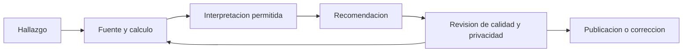

# Narrativa, revision y publicacion

## Resultado y prerrequisitos

Comunicaras una evidencia a una audiencia concreta, revisaras una entrega con criterios observables y publicaras solo lo que sea seguro y defendible. Parte de una estructura de proyecto ya creada.

## La historia es un argumento, no una cronologia

Una narrativa analitica responde, en orden, a: que decision existe; que evidencia se observo; que significa con cautela; que propones hacer; y que falta comprobar. "Use Python y SQL" describe medios. "La mayor caida observada esta entre verificacion y menu; revisar ese paso es la prioridad, condicionado a validar el tracking" permite decidir.

Para *Nimbo*, una presentacion de cinco diapositivas puede ser:

1. Decision y poblacion: altas de abril que disponen de siete dias de observacion.
2. Contrato de metrica y calidad: eventos excluidos, duplicados y cobertura.
3. Evidencia: embudo con numeradores y denominadores visibles.
4. Interpretacion y alternativas: asociacion, no causalidad; posible sesgo por canal.
5. Recomendacion, prueba siguiente y riesgo: auditoria de tracking y experimento acotado.

El flujo responde a "que debe sobrevivir a una revision?":

Volver de revision a fuente y calculo es normal: la revision busca descubrir errores, no aprobar una historia ya decidida.

## Auditoria cuantificable antes de publicar

Usa la [rubrica ponderada](../../../evaluaciones/rubricas/capstone.md) para puntuar cada dimension de 0 a 4. La nota no sustituye el juicio: un 80/100 con un fallo critico de privacidad no esta listo. Exige al menos 3/4 en datos, metodo, razonamiento y etica, ademas de una puntuacion total de 70/100. Registra defecto, prioridad y correccion en el registro de decisiones.

Un ejemplo defectuoso ayuda a calibrar: un repositorio afirma que "la nueva pantalla mejoro la retencion 20 %", adjunta un grafico sin denominador, no dice de que fechas salen datos ni como define retencion, y comparte un CSV con correos. Aunque el grafico sea bonito, recibe 0/4 en datos, razonamiento y etica: no se publica. La [solucion del ejercicio](../../../soluciones/temario-15/auditoria-portfolio.md) muestra como justificar la evaluacion y priorizar arreglos.

## Lista de control de publicacion

- Ejecuta instrucciones desde un entorno limpio o pide a otra persona que las siga.
- Comprueba que cada visual tiene fuente, unidad, poblacion, ventana y explicacion equivalente.
- Revisa enlaces, rutas, versiones, licencia y si el dataset puede redistribuirse.
- Busca identificadores, secretos, correos, tokens y rutas locales antes de subir.
- Cambia afirmaciones causales por lenguaje observacional cuando no hay diseno causal.
- Declara datos simulados, decisiones excluidas y limites que afectarian la recomendacion.

**Error habitual.** Eliminar pasos incomodos para que el portfolio parezca perfecto. Documentar una limitacion o dato descartado con su motivo aumenta credibilidad; ocultar un resultado negativo la destruye cuando alguien reproduce el trabajo.

## Comprobacion

Haz una revision ciega: entrega el README y sus enlaces a una persona. Si no puede explicar que se decidio, de donde sale el numero principal y que no permite concluir, la narrativa necesita trabajo.
