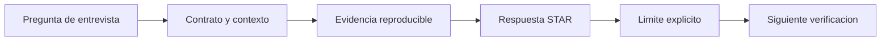

# Entrevistas, CV y capstone

## Resultado y prerrequisitos

Defenderas un proyecto con un guion de cinco minutos, responderas preguntas tecnicas sin sobreafirmar y ejecutaras el capstone por hitos. Necesitas un caso documentado y la rubrica del bloque.

## Guion de defensa de cinco minutos

Una defensa no es leer el README. Es un argumento breve para quien evalua tu criterio. Ensaya esta distribucion:

1. **0:00-0:45, situacion y decision.** "En Nimbo evalue donde investigar la activacion de comercios; no medi el impacto de una intervencion".
2. **0:45-1:30, tarea y contrato.** Poblacion, ventana, grano y definicion exacta de la metrica.
3. **1:30-3:00, acciones y evidencia.** Calidad revisada, transformaciones, validaciones y grafico o tabla central.
4. **3:00-4:00, resultado e interpretacion.** Que se observo, que no prueba y que alternativa se considero.
5. **4:00-5:00, recomendacion y siguiente prueba.** Accion proporcional, riesgo, propietario y como verificarias el resultado.

La estructura **STAR** (situacion, tarea, accion, resultado) sirve para contar tu contribucion, pero anade siempre evidencia y limite. Decir "mejore la retencion" sin diseno experimental no es defendible; di "observe una diferencia y propuse una prueba".

Este diagrama responde a "como se conecta una respuesta oral con evidencia?":

Una buena respuesta enlaza a un archivo, consulta, metrica o decision registrada; no depende de memorizar una frase brillante.

## Preguntas que debes poder responder

- Que representa una fila y que filas excluiste? Explica el grano y por que.
- Como comprobaste que un `JOIN` no duplicaba importes o usuarios? Menciona cardinalidad y conteos antes y despues.
- Que ocurre si faltan datos, hay ceros o cambia el tracking? Distingue ausencia, cero y cambio de definicion.
- Por que el grafico no demuestra causalidad? Identifica una variable de confusion y una prueba posible.
- Que harias diferente con una semana mas? Propone una comprobacion concreta, no "usaria IA".

El CV y GitHub deben enlazar solo casos defendibles linea a linea: problema, contribucion, herramientas, resultado, evidencia y limite. Una tecnologia se menciona porque resolvio algo; no como palabra clave.

## Ruta del capstone: hitos y criterio de terminado

El [capstone](../../../proyectos/capstone/README.md) integra el curso con datos publicos o simulados declarados. No se avanza por calendario sino por evidencia:

1. **Hito 1: contrato aprobado.** Decision, pregunta, metrica, poblacion, fuente/licencia y exclusiones escritos. Terminado cuando otra persona puede repetir la pregunta sin pedir definiciones.
2. **Hito 2: datos auditados.** Diccionario, grano, calidad, privacidad y validaciones. Terminado cuando problemas y tratamiento estan registrados.
3. **Hito 3: evidencia reproducible.** Consulta o script ejecutable que genera tabla o grafico. Terminado cuando una ejecucion limpia reproduce el resultado o se documenta la limitacion de acceso.
4. **Hito 4: recomendacion revisada.** Narrativa, limites, siguiente prueba y rubrica. Terminado con al menos 70/100 y sin fallo critico.
5. **Hito 5: entrega y defensa.** README, licencia, presentacion y guion. Terminado cuando un revisor puede seguirla y plantear objeciones fundamentadas.

## Cierre y practica

Ejecuta el [proyecto minimo de Nimbo](../../../proyectos/capstone/README.md#proyecto-minimo-guiado) o adapta su contrato a un dominio que conozcas. Despues, resuelve la [auditoria de portfolio](../../../ejercicios/temario-15/auditoria-portfolio.md). El objetivo no es parecer experto: es hacer visible un metodo fiable para aprender, preguntar y justificar decisiones con evidencia.
