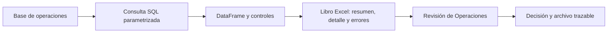

# Bloque 16 — Excel, Power Query y entrega automatizada

## Propósito

Una hoja de cálculo suele ser el último kilómetro de un análisis: la abre Operaciones, la revisa Finanzas y la usa una persona que no ejecutará tu código. Por eso Excel no es una alternativa a SQL o Python: es una interfaz de entrega con riesgos propios. En este bloque Leo actúa como analista de **Norte Operaciones**, una plataforma de suscripciones. Cada lunes debe entregar un libro con las operaciones pagadas de la semana anterior, excepciones, conciliación y trazabilidad.

La pregunta continua es: **¿cómo entregar una cifra semanal que otra persona pueda revisar sin repetir pasos manuales ni perder el significado del dato?**

## Resultados observables

Al terminar podrás distinguir la herramienta adecuada para cada parte del trabajo, preparar datos repetibles con Power Query, consultar una base de solo lectura desde Python, validar una extracción, generar un libro Excel con varias hojas y dejar registro de parámetros, fuente y errores.

**Prerrequisitos:** bloques 01, 02, 05, 09 y 13. Se explican desde cero los conceptos propios de Excel, Power Query y una exportación automatizada.

## Mapa del caso

El flujo separa **fuente**, **cálculo**, **control** y **entrega**. Excel puede mostrar un resultado muy convincente aunque la consulta haya usado un periodo incorrecto; por ello los controles y metadatos viajan dentro del mismo libro.

## Lecciones

1. [De la exportación manual al proceso reproducible](lecciones/01-exportacion-manual-y-proceso.md)
2. [Excel profesional: tablas, fórmulas y controles](lecciones/02-excel-profesional-y-controles.md)
3. [Power Query: importar y transformar sin repetir clics](lecciones/03-power-query-y-transformaciones.md)
4. [Consultar y validar datos desde Python](lecciones/04-sql-python-y-validacion.md)
5. [Generar un libro Excel verificable](lecciones/05-generar-libro-excel.md)
6. [Automatizar, operar y entregar el informe](lecciones/06-automatizar-y-entregar.md)

## Práctica

Resuelve el [informe semanal de operaciones](../../ejercicios/temario-16/informe-semanal-operaciones.md) antes de ver la [solución razonada](../../soluciones/temario-16/informe-semanal-operaciones.md). El [script de laboratorio](../../notebooks/practicas/16-informe-operaciones.py) genera un libro real a partir de una base SQLite local; puedes ejecutarlo en Colab u ordenador tras instalar [`pandas` y `openpyxl`](../../notebooks/practicas/requirements-bloque-16.txt). El planteamiento también se puede razonar desde el móvil.

## Criterio de dominio

No basta con que el archivo abra. Debes poder responder: ¿qué periodo se extrajo?, ¿qué filas se excluyeron?, ¿cuadra el total con la fuente?, ¿quién puede modificar el libro y cómo se volvería a generar el lunes siguiente?
