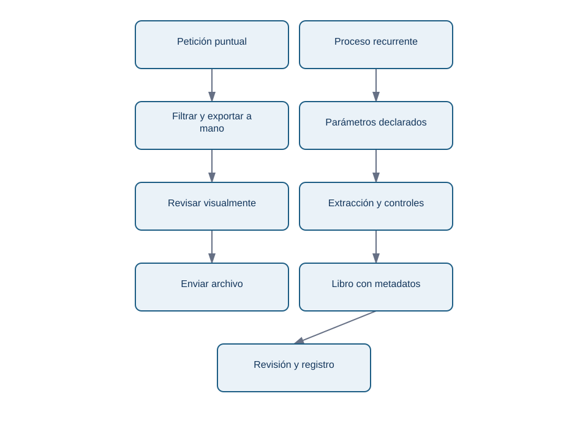
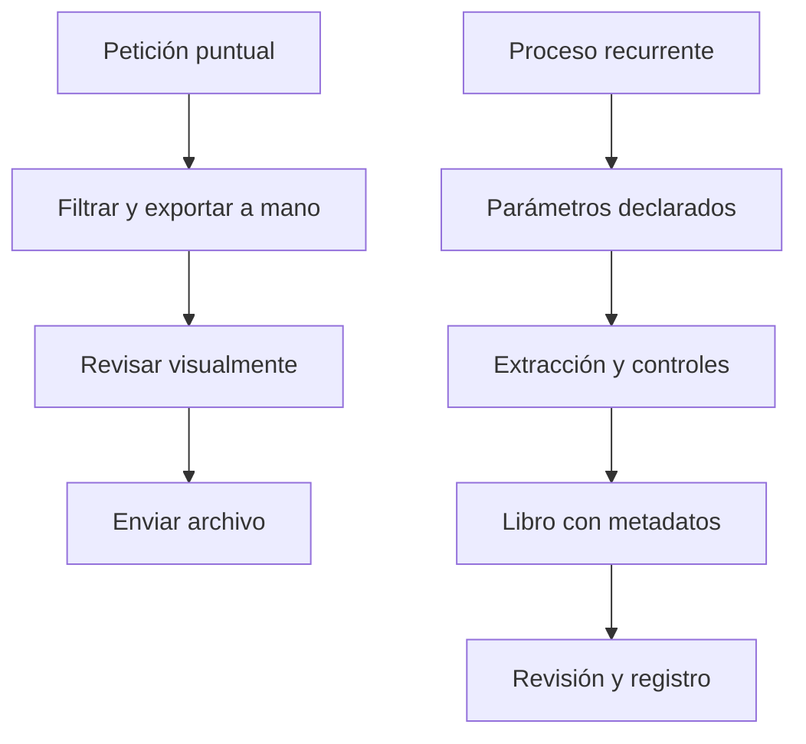

# 1. De la exportación manual al proceso reproducible

## Objetivo y punto de partida

Aprenderás a decidir cuándo basta exportar con un botón y cuándo construir un proceso repetible. Necesitas recordar que una **fila** representa una observación y que el **grano** declara qué representa exactamente. Aquí, una fila representa un intento de cobro, no necesariamente una suscripción ni un cliente.

## El problema antes del nombre técnico

El lunes Marta abre una herramienta, filtra fechas, exporta un CSV, borra columnas, pega una tabla en Excel y manda el archivo. La semana siguiente repite los clics. Si cambia una fecha, un filtro o un cálculo, el resultado puede ser plausible pero no repetible. El problema no es que use Excel: es que el procedimiento está solo en su memoria.

Un **proceso reproducible** recibe unas entradas declaradas, ejecuta pasos conocidos y deja las mismas salidas y controles para las mismas entradas. No elimina la revisión humana; permite que la revisión se centre en decisiones y anomalías, no en reconstruir clics.

¿Qué cambia entre una exportación puntual y una entrega que se repite?

<!-- mobile-diagram: rendered fallback -->

Ver código Mermaid editable

La ruta recurrente añade parámetros y evidencia. No es automáticamente mejor: para una pregunta única de veinte filas, el botón puede ser más rápido y suficientemente seguro. Automatiza cuando hay repetición, varios pasos, riesgo de error, necesidad de auditoría o varias consultas que deben ser coherentes.

## Elegir la herramienta por responsabilidad

**SQL** pregunta a una base de datos y reduce el volumen cerca de la fuente. **Python/Pandas** aplica lógica repetible, validaciones y transformaciones que conviene versionar. **Power Query** permite importar y transformar datos de forma visible y refrescable dentro de Excel o Power BI. **Excel** permite revisar, explorar, anotar y entregar un resultado a consumidores de negocio.

No hay una jerarquía universal. Una tabla dinámica es excelente para explorar cientos o miles de filas ya preparadas; no es la fuente de verdad para un cálculo complejo que se debe regenerar cada semana. Tampoco se deben exportar millones de filas a Excel: se agrega o filtra antes, se entrega una muestra/detalle justificado y se conserva la fuente en la base o en un formato analítico.

## Error habitual

«La interfaz ya exporta a Excel, así que Python sobra» confunde exportar con controlar. Python no hace mágica a la base: permite parametrizar fechas, ejecutar varias consultas, registrar exclusiones, dar formato coherente y detectar un total inesperado antes de que llegue a dirección.

## Resumen y comprobación

Un proceso recurrente declara entradas, transforma de manera conocida, valida y registra la entrega. Antes de automatizar, pregunta: ¿qué decisión se toma?, ¿con qué frecuencia?, ¿qué riesgo tiene una cifra errónea y quién debe poder reconstruirla?

**Comprobación:** describe una exportación que hoy haces con clics. Identifica un parámetro, un control y una evidencia que añadirías.

