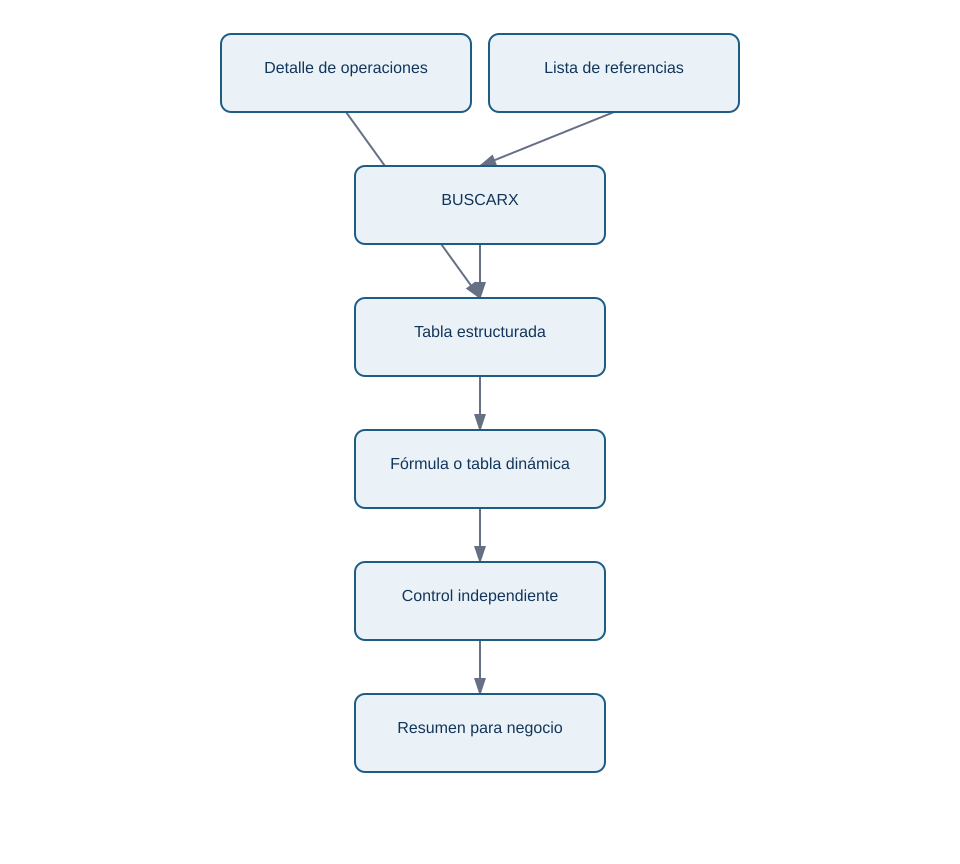

# 2. Excel profesional: tablas, fórmulas y controles

## Objetivo y prerrequisitos

Convertirás un rango de celdas en una entrega revisable. Un **libro** es un archivo con hojas; una **hoja** es una cuadrícula; una **celda** guarda un valor, fórmula o formato. Excel sirve para que una persona examine y use una entrega, no para esconder la lógica esencial de una métrica.

## De una lista pegada a una tabla controlable

Si pegas operaciones en celdas sueltas, los filtros y fórmulas pueden no incluir las filas nuevas. Una **tabla estructurada** da nombre al conjunto, conserva encabezados y permite que fórmulas, filtros y tablas dinámicas trabajen sobre columnas con significado. Por ejemplo, `importe_eur` comunica más que «columna F».

Para el informe de Norte Operaciones, crea una tabla `operaciones` con `operacion_id`, `fecha_utc`, `estado`, `importe_eur` y `canal`. Filtra por `estado = pagada` para revisar detalle; usa una tabla dinámica para responder «¿cuánto se cobró por canal?»; añade una segmentación si una persona necesita seleccionar canal sin modificar la fuente.

## Fórmulas que resuelven preguntas concretas

`SUMAR.SI.CONJUNTO` responde «suma importes que cumplen varias condiciones». Por ejemplo, el total pagado de web en un periodo. `CONTAR.SI.CONJUNTO` permite contar operaciones bajo condiciones. `BUSCARX` busca un valor —por ejemplo, el responsable de un canal— en una tabla de referencia; `INDICE` + `COINCIDIR` es una alternativa útil cuando se trabaja con versiones antiguas.

Una fórmula no sustituye una definición. Antes de calcular «tasa de rechazo», escribe numerador, denominador, periodo y grano. Si el denominador cuenta intentos y el numerador cuenta operaciones únicas, el porcentaje puede parecer normal y ser inválido.

¿Cómo se protege una entrega contra una cifra incompleta?

<!-- mobile-diagram: rendered fallback -->

Ver código Mermaid editable

El control independiente no debe repetir el mismo error. Si el resumen suma pagos, compara también número de filas, importe contra la extracción y periodo mínimo/máximo. Resalta con formato condicional una diferencia no nula; la celda roja no demuestra que haya un problema, obliga a investigarlo.

## Fechas, validación y protección

Una fecha de Excel es un valor con formato, no texto decorativo. Declara zona horaria y límite de periodo: «semana anterior cerrada en UTC» evita que el lunes incluya una hora incompleta. Usa validación de datos para campos manuales como `revisado_por` o `estado_revision`; no permitas que cada persona escriba variantes como “OK”, “okey” o “correcto”.

Congela encabezados, aplica formato de moneda y fecha coherente, protege las celdas de fórmulas y deja editables solo las celdas de comentario si procede. La protección de hoja evita errores accidentales, no es un sistema de seguridad ni sustituye permisos de acceso al archivo.

## Límite y comprobación

Excel no es una base transaccional ni un lugar apropiado para millones de filas, secretos o transformaciones críticas sin historial. Úsalo para revisión y entrega; conserva la lógica repetible en consulta, Power Query o código.

**Comprobación:** ¿qué diferencia hay entre una tabla dinámica y la fuente que alimenta la tabla dinámica? ¿Qué control añadirías a un total de cobros?

**Fuente primaria:** [Microsoft Learn: Power Query](https://learn.microsoft.com/power-query/) explica el motor de importación y preparación que se utilizará en la siguiente lección.
