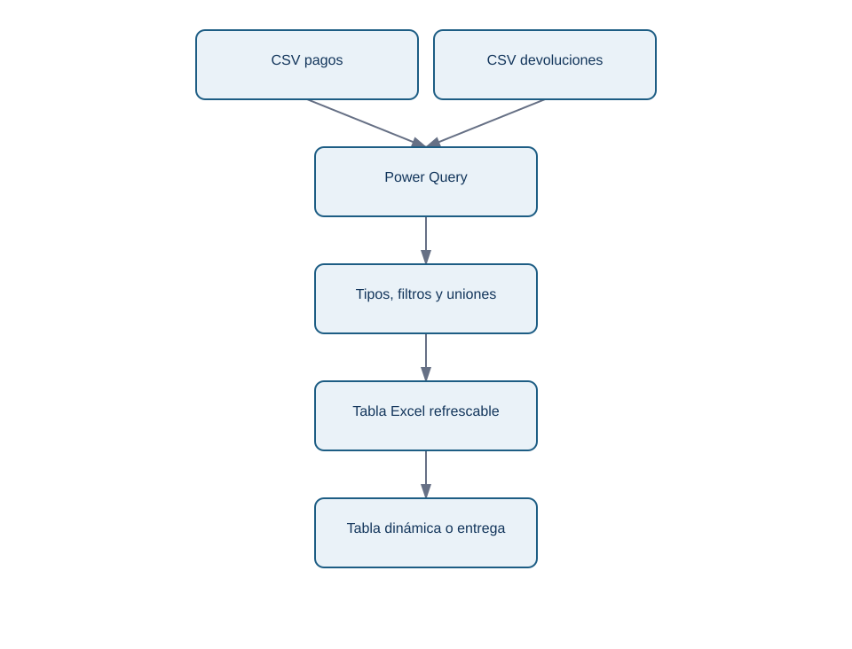

# 3. Power Query: importar y transformar sin repetir clics

## Objetivo

Aprenderás qué aporta Power Query y cómo diseñar una transformación que se pueda refrescar. Power Query es un motor de conexión y preparación de datos disponible, entre otros productos, en Excel y Power BI. Su interfaz registra una secuencia de pasos; no es simplemente «limpiar una vez y guardar».

## Caso visible

Norte Operaciones recibe cada semana un CSV de pagos y otro de devoluciones. Ambos tienen nombres de columnas distintos, importes con coma decimal y una fila de prueba que no debe entrar en el informe. Abrir, corregir y pegar cada archivo puede funcionar una semana; al refrescar una consulta, Power Query vuelve a aplicar los pasos documentados al archivo nuevo.

<!-- mobile-diagram: rendered fallback -->

Ver código Mermaid editable

El diagrama representa una preparación para consumo, no una licencia para mezclar cualquier fuente. Antes de anexar archivos comprueba que comparten grano, significan lo mismo y que las columnas ausentes son tratadas explícitamente.

## Pasos guiados

1. Usa **Datos → Obtener datos** y selecciona el CSV. Guarda el archivo original sin editar: es evidencia de entrada.
2. En el editor, nombra la consulta por su propósito, por ejemplo `pagos_semana`.
3. Promueve encabezados solo después de verificar que la primera fila contiene nombres. Cambia tipos: fecha a fecha/hora, importe a decimal, identificador a texto para no perder ceros iniciales.
4. Filtra registros de prueba con una regla visible; no borres filas «porque parecen raras» sin criterio.
5. Combina consultas con **Anexar** cuando son el mismo tipo de hecho y con **Combinar** cuando agregas atributos mediante una clave. Revisa la cardinalidad de la clave antes de expandir columnas.
6. Carga como tabla y refresca con otro archivo de muestra. Si el refresco falla, el fallo es información: puede haber cambiado el esquema o el formato.

## Cuándo usar Power Query, Python o SQL

Power Query es apropiado cuando el consumidor necesita ver o mantener una preparación sencilla en Excel/Power BI y el volumen cabe en ese flujo. SQL es preferible para filtrar, agregar y unir datos en una base con permisos y volumen. Python es preferible para reglas complejas, pruebas automáticas, llamadas a API, generación de archivos y versionado. Es habitual combinarlos, pero hay que asignar una fuente de verdad a cada regla.

## Error frecuente: el refresco que cambia el resultado

Si una columna pasa de `importe` a `importe_total`, una consulta puede fallar o, peor, cargar nulos. Añade controles de número de filas, columnas esperadas, fechas mínima/máxima y total. Power Query permite pasos como quitar errores o reemplazar nulos; no los apliques sin medir cuántos registros afectan y sin registrar la decisión.

## Resumen y práctica

Power Query hace explícitos los pasos de importación y transformación, por eso permite refrescar. No reemplaza la comprensión del grano, los tipos ni la validación.

**Práctica:** diseña la secuencia de consultas para pagos y devoluciones. Escribe qué clave verificarías antes de combinarlas y qué control ejecutarías después.

**Fuente primaria:** [Microsoft Learn: qué es Power Query](https://learn.microsoft.com/power-query/power-query-what-is-power-query) documenta sus conectores, transformaciones y límites de producto.

