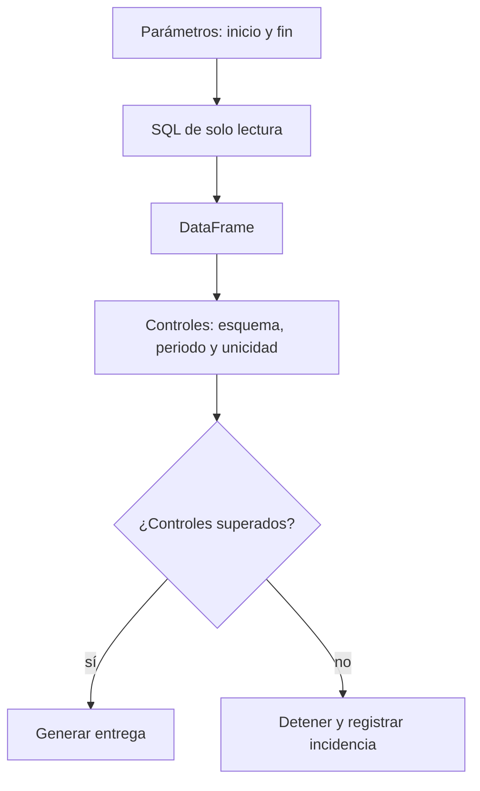

# 4. Consultar y validar datos desde Python

## Objetivo

Extraerás datos de una base con una consulta de solo lectura, parámetros y controles. Una **consulta parametrizada** separa la instrucción SQL de los valores como fechas; evita construir texto SQL mezclando datos externos y hace visible qué periodo se pidió.

## Antes de programar: contrato de extracción

Para el informe semanal define: variable objetivo = importes cobrados; grano = un intento de cobro; periodo = desde el lunes 00:00 UTC inclusive hasta el lunes siguiente exclusivo; fuente = tabla `operaciones`; exclusión = pruebas internas; salida = resumen, detalle y rechazados. Sin este contrato, el código puede ser correcto y responder otra pregunta.

<!-- mobile-diagram: rendered fallback -->


<details>
<summary>Ver código Mermaid editable</summary>


</details>

Detener es una salida válida. Generar un Excel con una extracción incompleta solo porque el script no produjo una excepción es peor que avisar de una incidencia.

## Ejemplo mínimo

```python
import sqlite3
import pandas as pd

consulta = """
SELECT operacion_id, fecha_utc, estado, importe_eur, canal
FROM operaciones
WHERE fecha_utc >= :inicio AND fecha_utc < :fin
  AND es_prueba = 0
"""

with sqlite3.connect("operaciones.sqlite") as conexion:
    datos = pd.read_sql_query(
        consulta, conexion,
        params={"inicio": "2026-07-13", "fin": "2026-07-20"},
    )
```

`read_sql_query` crea un DataFrame —una tabla en memoria con filas y columnas— a partir de la consulta. SQLite es útil para aprender porque es local; en un entorno empresarial el conector puede ser PostgreSQL u otro motor. Las credenciales no se escriben dentro del script ni se suben al repositorio: se inyectan mediante variables de entorno o un gestor de secretos y se usan con un usuario de solo lectura.

## Controles que responden a riesgos

- **Esquema:** ¿están las columnas necesarias y sus tipos son interpretables?
- **Periodo:** ¿la fecha mínima y máxima están dentro de los límites declarados?
- **Unicidad:** ¿`operacion_id` se repite cuando el grano promete una fila por intento?
- **Completitud:** ¿hay nulos en identificador, fecha, estado o importe?
- **Conciliación:** ¿el número e importe de pagos concuerda con una consulta independiente o total de control?
- **Exclusiones:** ¿cuántas filas de prueba, devoluciones o estados desconocidos quedaron fuera y por qué?

Un `assert` o una excepción con mensaje claro puede impedir la entrega. Un control no es un adorno: debe estar vinculado a una decisión de qué hacer al fallar.

## Límite técnico y ético

Parametrizar valores no habilita parametrizar arbitrariamente nombres de tabla o permisos. No ejecutes escrituras (`DELETE`, `UPDATE`) desde un informe; limita columnas y filas al mínimo necesario y evita exportar identificadores personales si el destinatario no los requiere.

**Comprobación:** si el total cae a cero porque cambió el nombre de un estado, ¿qué control lo detectaría y qué debería hacer el proceso?

**Fuente primaria:** [pandas `read_sql_query`](https://pandas.pydata.org/docs/reference/api/pandas.read_sql_query.html).
