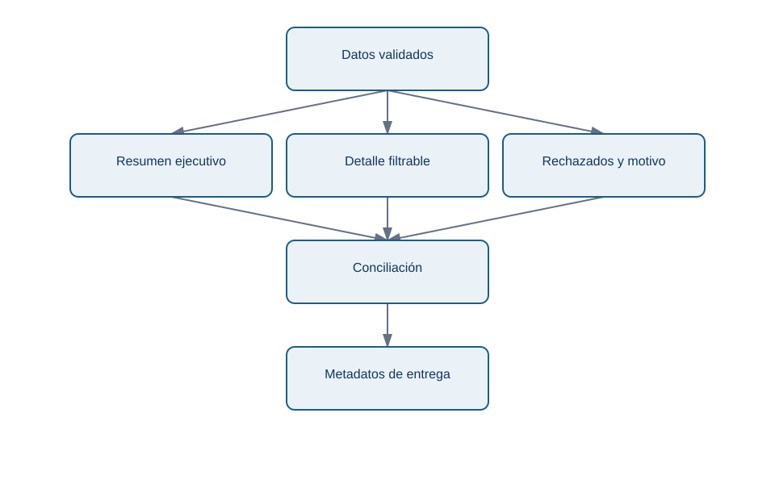
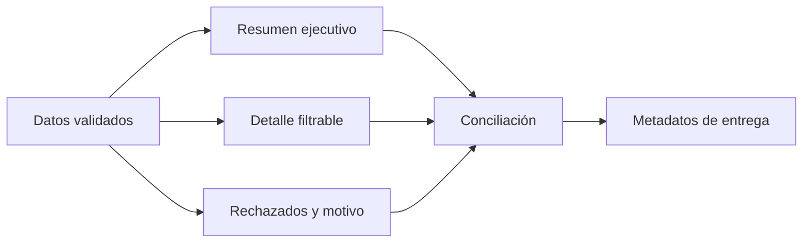

# 5. Generar un libro Excel verificable

## Objetivo

Construirás un archivo que sirva para leer y revisar, no solo para descargar filas. `DataFrame.to_excel` escribe una tabla; una biblioteca como `openpyxl` permite aplicar formato, congelar encabezados, crear varias hojas y proteger contra modificaciones accidentales.

## Diseño antes del código

El libro semanal de Norte Operaciones tendrá cinco hojas: `Resumen`, `Detalle`, `Rechazados`, `Conciliacion` y `Metadatos`. Esta separación evita que el resumen esconda excepciones y permite a cada audiencia empezar por la hoja adecuada.

<!-- mobile-diagram: rendered fallback -->


<details>
<summary>Ver código Mermaid editable</summary>


</details>

La hoja de metadatos registra fecha de generación, parámetros, fuente, versión del script y controles ejecutados. No es una garantía de veracidad: es el punto de partida para que alguien reconstruya una cifra.

## Ejemplo de generación

```python
from pathlib import Path
import pandas as pd
from openpyxl import load_workbook
from openpyxl.styles import Font, PatternFill

ruta = Path("salidas/informe_operaciones_2026-07-13.xlsx")
with pd.ExcelWriter(ruta, engine="openpyxl") as escritor:
    resumen.to_excel(escritor, sheet_name="Resumen", index=False)
    detalle.to_excel(escritor, sheet_name="Detalle", index=False)
    rechazados.to_excel(escritor, sheet_name="Rechazados", index=False)
    controles.to_excel(escritor, sheet_name="Conciliacion", index=False)
    metadatos.to_excel(escritor, sheet_name="Metadatos", index=False)

libro = load_workbook(ruta)
for hoja in libro.worksheets:
    hoja.freeze_panes = "A2"
    hoja.auto_filter.ref = hoja.dimensions
    for celda in hoja[1]:
        celda.font = Font(bold=True, color="FFFFFF")
        celda.fill = PatternFill("solid", fgColor="1D5D84")
libro.save(ruta)
```

El formato sigue al significado: `importe_eur` usa moneda; `fecha_utc` usa un formato de fecha/hora y un nombre que declare la zona; las columnas se ajustan con límite razonable para que no aparezcan hojas ilegibles. Evita fórmulas críticas ocultas; si introduces una, documenta fórmula, rango y control independiente.

## Conciliación y lectura humana

En `Conciliacion`, compara al menos: filas extraídas, identificadores distintos, importe de estados pagados, importe de devoluciones y diferencia contra el total de la consulta de control. Muestra resultado, umbral y acción: «diferencia = 0 → entregar; diferencia ≠ 0 → bloquear y revisar». Los registros rechazados deben conservar motivo y regla de rechazo, no desaparecer.

## Errores frecuentes

Un archivo con formato bonito puede ser inutilizable si: cambia la columna de fecha a texto, trunca decimales, exporta filas personales no necesarias, sobrescribe el informe anterior o titula “Total” a una suma que mezcla monedas. El nombre de archivo debe incluir periodo y momento de generación, por ejemplo `operaciones_2026-07-13_a_2026-07-20_generado_2026-07-20T0815Z.xlsx`.

## Resumen

Un libro profesional comunica resultado, detalle, excepciones y evidencia. Formatear no es maquillar: reduce errores de interpretación y facilita una revisión que pueda fallar de manera visible.

**Fuente primaria:** [documentación de `DataFrame.to_excel`](https://pandas.pydata.org/docs/reference/api/pandas.DataFrame.to_excel.html) y [tutorial de openpyxl](https://openpyxl.readthedocs.io/en/stable/tutorial.html).

