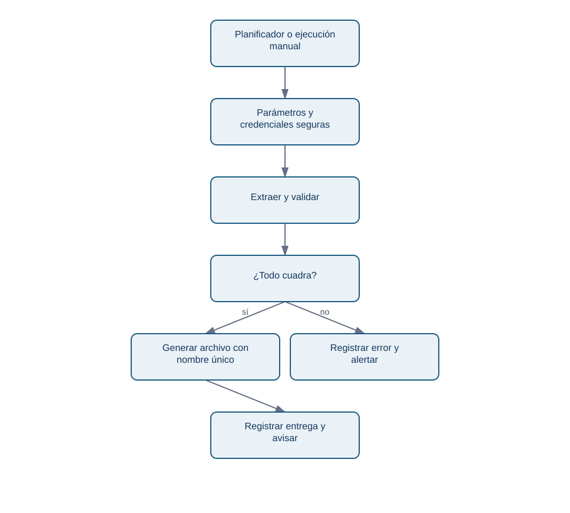
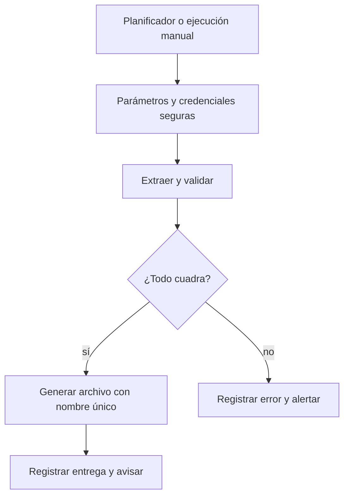

# 6. Automatizar, operar y entregar el informe

## Objetivo

Convertirás el script en una operación fiable: entradas explícitas, registro, errores visibles y una salida que no destruya evidencias anteriores. Automatizar no significa ejecutar sin supervisión; significa poder saber qué ocurrió cuando algo sale distinto.

## El contrato operativo

Cada ejecución recibe `--inicio`, `--fin` y `--salida` o valores equivalentes. Registra versión del script, hora UTC, consulta usada, número de filas, resultados de controles y ruta del archivo. Devuelve código de salida distinto de cero si no puede conectarse, faltan columnas o falla una conciliación. Un planificador —por ejemplo, una tarea del sistema o una automatización corporativa— debe alertar ante ese fallo, no enviar un archivo vacío.

<!-- mobile-diagram: rendered fallback -->

Ver código Mermaid editable

El planificador no sustituye el juicio analítico. Si un cambio de negocio hace que los rechazos suban, el informe puede ser correcto y aun así requerir una explicación antes de distribuirlo.

## Reglas de operación

- Conserva archivos de entrada y salidas según la política de retención; no sobrescribas el lunes anterior.
- Usa rutas configurables y un directorio de salida separado del código.
- Nunca guardes contraseñas, tokens ni datos personales de prueba en Git. Un archivo `.env` local puede aportar configuración, pero también se excluye del repositorio.
- Registra valores seguros: periodo, conteos, duración y mensaje de error. No registres datos personales o secretos.
- Prueba primero una semana histórica conocida y compara con una conciliación manual independiente.
- Documenta el propietario, la cadencia, el destinatario y qué hacer cuando falla un control.

## Ejemplo de informe útil

El director de Operaciones abre `Resumen`: importe cobrado, variación frente a semana comparable y estado de controles. Si hay diferencia, no usa ese total para decidir. El equipo analista abre `Conciliacion` y `Rechazados`, identifica si el origen es un estado nuevo o una carga tardía, corrige o explica la excepción y deja registro. Esta es la diferencia entre enviar un Excel y entregar un proceso.

## Autoevaluación y siguiente paso

Comprueba: ¿podría otra persona generar el mismo informe con la misma base?, ¿sabría si el periodo fue mal introducido?, ¿podría distinguir un fallo técnico de una variación real?, ¿el destinatario ve solo lo que necesita?

Resuelve ahora el [proyecto de informe semanal](../../../ejercicios/temario-16/informe-semanal-operaciones.md). En el siguiente ciclo de profesionalización, este mismo contrato se conectará con un modelo dimensional y un dashboard BI, sin duplicar definiciones.
