# Temario completo - Curso de Analista de Datos con Python

# Bloque 00 - Orientación y pensamiento analítico

## Propósito

Antes de escribir una consulta, abrir Python o crear un gráfico, un analista debe saber qué decisión está ayudando a tomar. Este bloque enseña a convertir una preocupación de negocio en una investigación revisable: una pregunta concreta, una hipótesis que puede fallar, evidencia adecuada, una recomendación prudente y un plan de seguimiento.

El hilo conductor es un caso de producto IT: **Lumen**, una app de reservas de espacios de trabajo, detecta que menos personas que instalan la app completan su primera reserva. Leo acompañará a producto e ingeniería desde el aviso inicial hasta la decisión y su medición posterior.

## Resultados observables

Al completar el bloque podrás:

- distinguir descripción, diagnóstico, predicción y prescripción, y saber qué no permite concluir cada uno;
- redactar un brief analítico que otra persona pueda ejecutar y revisar;
- separar hechos observados, hipótesis y evidencia;
- definir una métrica con evento, denominador, exclusiones, grano, ventana, fuente y decisión asociada;
- estudiar desde el móvil dejando un registro reproducible de tus respuestas y supuestos.

## Ruta de aprendizaje

1. [El rol del analista, tipos de análisis y ciclo de decisión](lecciones/01-rol-y-ciclo-de-decision.md)
2. [Preguntas, hipótesis, evidencia y contrato de métrica](lecciones/02-preguntas-hipotesis-y-evidencia.md)
3. [Método de estudio, brief y trabajo reproducible](lecciones/03-metodo-de-estudio-y-diagnostico.md)

## Prerrequisitos y práctica móvil

No necesitas programación ni vocabulario técnico. Desde el móvil puedes leer las lecciones, copiar la [plantilla de brief](plantillas/brief-analitico.md) en una nota y responder el ejercicio. Cuando dispongas de ordenador, repetirás este mismo razonamiento con datos en los bloques siguientes.

## Evaluación del bloque

Completa el [caso integrador de Lumen](../../ejercicios/temario-00/comprension/preguntas.md) sin mirar la solución. Después compáralo con la [solución razonada y rúbrica](../../soluciones/temario-00/preguntas.md). No se evalúa acertar una causa inventada: se evalúa formular una investigación y una decisión defendibles.

# El rol del analista, tipos de análisis y ciclo de decisión

## Resultado observable y punto de partida

Al terminar podrás recibir una frase como «la activación ha caído» y convertirla en un recorrido de investigación. Distinguirás cuatro tipos de análisis sin confundir una descripción con una causa o una recomendación. No necesitas saber programar: una **app** es un programa que una persona usa en su teléfono; un **evento** será una acción que la app registra, como instalarla o completar una reserva.

## Caso continuo: la caída de activación de Lumen

Lumen permite reservar puestos de trabajo. El lunes, la responsable de producto escribe: «La activación ha bajado; arregladlo». Antes de actuar faltan datos importantes.

Llamaremos **activación** a que una persona nueva llega a realizar la primera acción de valor del producto. En Lumen, de momento, esa acción será completar una primera reserva. Esta definición es una elección de negocio, no una propiedad mágica del software: más adelante se formalizará para que todos cuenten lo mismo.

El encargo útil no es «mirar los datos». Es decidir entre opciones con coste: ¿priorizar una incidencia de ingeniería en el formulario?, ¿cambiar el texto de bienvenida?, ¿pausar una campaña que atrae usuarios poco adecuados?, ¿esperar porque la caída es solo una variación normal? El analista hace visible qué evidencia haría preferible una opción.

## Del brief al seguimiento

Este flujo responde a «¿qué debe ocurrir entre una alarma y una decisión responsable?».

<!-- mobile-diagram: rendered fallback -->


<details>
<summary>Ver código Mermaid editable</summary>

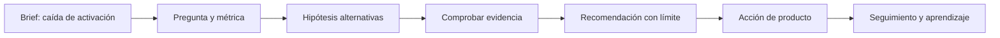
</details>

El seguimiento vuelve a abrir una pregunta, aunque lo representemos como el final de este recorrido para conservar un diagrama legible en PDF. Si Lumen simplifica una pantalla, debe comprobar después si sube la activación **sin** empeorar cancelaciones, soporte o ingresos. Una recomendación no cierra el análisis; crea una nueva situación que hay que observar.

## Cuatro preguntas, cuatro tipos de análisis

La misma caída puede estudiarse con preguntas distintas. La tabla no es una escalera automática: cada tipo necesita evidencia diferente.

| Tipo | Pregunta de Lumen | Entrega útil | Lo que no permite afirmar por sí solo |
| --- | --- | --- | --- |
| Descriptivo | ¿Cuánto cambió la activación y en qué fechas? | Serie, segmentos y definición de la medida | Por qué cambió ni qué hacer |
| Diagnóstico | ¿En qué paso, dispositivo o canal se concentra la caída? | Hipótesis priorizadas y comprobaciones | Que un factor observado sea la causa |
| Predictivo | ¿Cuántas activaciones esperamos la próxima semana si continúa el patrón? | Estimación con incertidumbre | Que una acción concreta produzca el resultado |
| Prescriptivo | ¿Qué opción conviene ejecutar dadas las evidencias, costes y riesgos? | Recomendación, condiciones y seguimiento | Que sea óptima o causalmente demostrada sin experimento |

En lectura rápida, el análisis **descriptivo** responde «qué pasó»; el **diagnóstico** pregunta «dónde y con qué explicaciones plausibles»; el **predictivo** estima «qué podría pasar»; y el **prescriptivo** propone «qué conviene hacer, bajo qué condiciones y cómo sabremos si funcionó». Ninguno autoriza por sí solo a afirmar causalidad.

### Ejemplo trabajado

La primera comprobación muestra que la activación pasó de 38% a 29% entre dos semanas comparables. Eso es **descriptivo**. Al separar por plataforma, la caída aparece sobre todo en Android y coincide con una actualización. Eso es **diagnóstico exploratorio**: orienta a revisar el formulario y los registros de error, pero aún no prueba que la actualización sea la causa. Si Lumen estima el número de activaciones de la semana siguiente para dimensionar soporte, está haciendo una **predicción**. Si decide revertir la actualización temporalmente porque el riesgo de perder usuarios es alto y medirá el efecto, está haciendo una **prescripción** bajo incertidumbre.

### Contraejemplos que evitan errores caros

- «Android cayó después de la actualización; por tanto, la actualización causó la caída». Es una hipótesis plausible, no una prueba. También pudo cambiar la mezcla de campañas o dejar de registrarse un evento.
- «El modelo predice 600 activaciones; por tanto, cambiar el botón dará 600». Una predicción de demanda no mide el efecto causal de un cambio de interfaz.
- «Recomiendo cambiar el texto porque parece claro». Una recomendación sin métrica de éxito, coste o plan de reversión es una opinión, no una decisión analítica.

## El producto real del analista

Un gráfico puede ser una evidencia, pero no es el producto final. Una entrega profesional deja una cadena que otra persona puede revisar:

- **Decisión:** qué se puede hacer y quién decide.
- **Pregunta:** qué comparación responderá esa decisión.
- **Evidencia:** qué registros, periodos y comprobaciones la sostienen.
- **Interpretación:** qué muestra el resultado y qué permanece incierto.
- **Recomendación:** acción, coste, riesgo y criterio de seguimiento.

Esta cadena protege tanto a Lumen como al analista: evita que una cifra bonita se convierta en una afirmación que los datos no permiten.

## Resumen y comprobación

- Describir, diagnosticar, predecir y prescribir responden preguntas distintas.
- Una asociación observada puede priorizar una investigación, pero no demuestra causalidad.
- Toda acción debe tener una métrica de seguimiento y una posible condición de reversión.

Comprueba tu comprensión: si la activación baja solo en Android, ¿qué dos explicaciones alternativas investigarías antes de culpar al formulario? ¿Qué dato distinguiría una caída real de un fallo de medición?

En la siguiente lección convertirás la alarma de Lumen en una pregunta comprobable y un contrato de métrica. Después resuelve el [caso integrador](../../../ejercicios/temario-00/comprension/preguntas.md).

# Preguntas, hipótesis, evidencia y contrato de métrica

## Resultado observable y prerrequisitos

Al terminar redactarás una pregunta analítica y el contrato completo de una métrica de activación. Usarás el caso de Lumen de la lección anterior. Una **métrica** es una regla repetible para medir algo; un **KPI** es una métrica elegida para seguir un objetivo importante. No toda cifra merece ser KPI.

## De una preocupación a una pregunta comprobable

«Queremos que más personas usen la aplicación» expresa una intención, no una investigación. Una pregunta comprobable especifica, como mínimo:

- **Población:** ¿de qué personas o casos hablamos?
- **Resultado:** ¿qué acción o valor observaremos?
- **Ventana temporal:** ¿cuánto tiempo tiene cada persona para lograrlo?
- **Comparación:** ¿frente a qué fecha, segmento o versión?
- **Decisión:** ¿qué acción puede cambiar la respuesta?

Para Lumen: «Entre las personas que instalan la versión 4.2 de Lumen, ¿qué porcentaje completa una primera reserva dentro de siete días, comparado con la versión 4.1, y en qué paso del flujo se concentra la diferencia para decidir si revertimos el cambio?».

La pregunta no presupone que la versión sea culpable. Ese detalle permite que la evidencia contradiga la sospecha inicial.

## Hecho, hipótesis y evidencia: mantener las piezas separadas

Una **hipótesis** es una explicación provisional que podría ser falsa; por ejemplo: «el selector de fecha de Android impide avanzar». Un **hecho observado** sería: «en Android, el 31% llega a `reserva_iniciada`, frente al 43% antes de la versión». La **evidencia** es la información que puede apoyar, matizar o refutar la hipótesis: registros de error, repetición del flujo, una comparación con iOS o una prueba controlada.

Este diagrama responde a «¿cómo evitar que una sospecha se disfrace de conclusión?».

<!-- mobile-diagram: rendered fallback -->


<details>
<summary>Ver código Mermaid editable</summary>

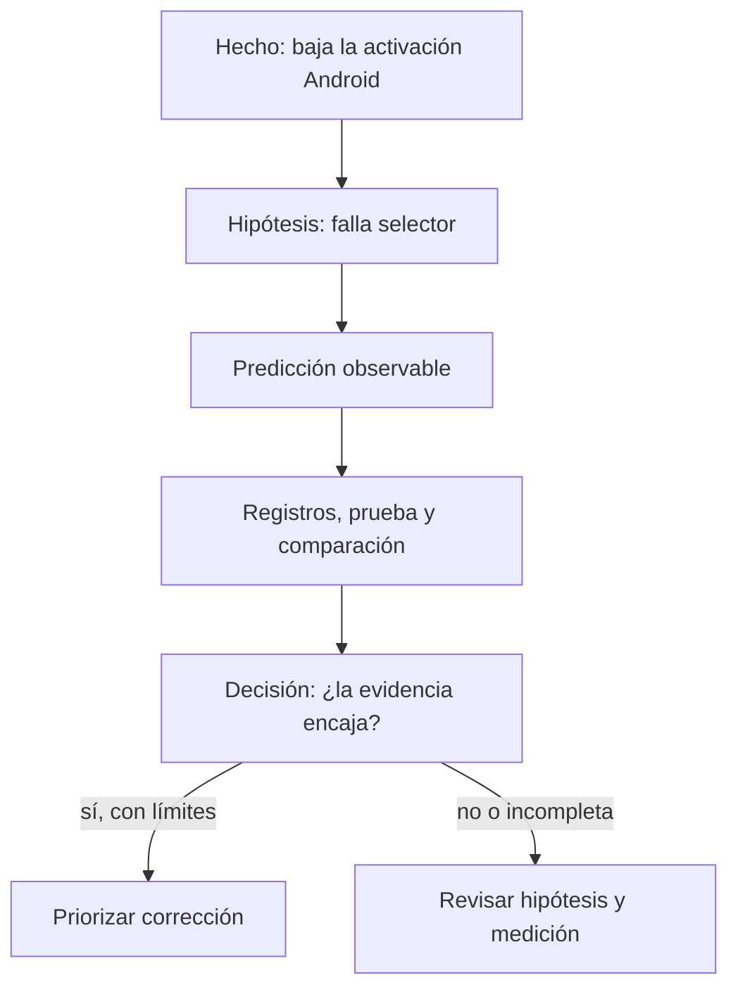
</details>

La ruta «sí» no elimina los límites: quizá el cambio coincide con una campaña. Por eso la recomendación debe indicar el nivel de seguridad y qué se medirá tras actuar.

## Contrato completo de métrica

Decir «la activación es 29%» es insuficiente. Dos personas pueden llegar a números distintos si una cuenta instalaciones y otra cuentas, o si una incluye empleados de Lumen. Un **contrato de métrica** documenta las reglas antes de discutir el resultado.

| Campo | Contrato de activación de Lumen | Por qué evita errores |
| --- | --- | --- |
| Nombre y decisión | Activación a 7 días; decidir si investigar/revertir cambios de onboarding | Conecta medida y acción |
| Evento numerador | Usuarios únicos con `reserva_completada` dentro de 7 días tras instalar | Dice qué éxito cuenta |
| Denominador | Usuarios únicos con `app_instalada` en la versión y periodo definidos | Evita dividir por una población distinta |
| Exclusiones | Empleados, cuentas de prueba, fraudes detectados y reinstalaciones identificadas | Evita inflar o sesgar la tasa |
| Grano | Una fila lógica por usuario e instalación elegible | Impide contar varias reservas como varias personas |
| Ventana y fecha de corte | 7 días desde instalación; solo instalaciones con 7 días completos al corte | Evita comparar cohortes inmaduras |
| Fuente y calidad | Eventos de la app y tabla de usuarios; comprobar duplicados, zona horaria y eventos faltantes | Hace el número auditable |
| Segmentos autorizados | Versión, sistema operativo y canal de adquisición | Permite localizar el problema sin inventar segmentos |
| Propietario y revisión | Producto es propietario; Datos revisa cambios de tracking antes de publicar | Define responsabilidad |
| Métricas de protección | Cancelación en 7 días y contactos a soporte por reserva | Evita optimizar activación a costa de la experiencia |

Para que el contrato también pueda leerse sin una tabla, conserva esta lista de control:

- Cuenta como éxito el evento `reserva_completada` dentro de siete días; cuenta como entrada cada instalación elegible.
- Excluye empleados, pruebas, fraude conocido y reinstalaciones identificadas; cada unidad es una instalación elegible por usuario.
- Espera a que cada cohorte complete siete días y documenta zona horaria, fuente y comprobaciones de duplicados o eventos ausentes.
- Segmenta por versión, sistema operativo y canal; Producto es propietario y Datos revisa cambios de tracking.
- Junto a activación, vigila cancelaciones y contactos a soporte para no mejorar un número a costa de la experiencia.

En notación sencilla:

`activación_7d = usuarios elegibles con primera reserva en 7 días / usuarios elegibles que instalaron`

La fórmula no sustituye el contrato. Sin exclusiones, grano y ventana, dos fracciones con el mismo nombre pueden significar cosas opuestas.

## Ejemplo trabajado: decidir con un contrato

El 8 de julio, Lumen compara instalaciones del 1 al 7 de junio (versión 4.1) con instalaciones del 1 al 7 de julio (versión 4.2). Espera hasta el 15 de julio para que todos tengan siete días completos. Tras excluir empleados y reinstalaciones, calcula 380 activados de 1.000 elegibles (38%) frente a 290 de 1.000 (29%).

La diferencia describe una señal prioritaria, pero todavía hay preguntas: ¿el evento `reserva_completada` siguió enviándose? ¿cambió el canal de adquisición? ¿la caída aparece también en iOS? El contrato no responde por sí solo; garantiza que esas preguntas parten del mismo objeto medido.

## Error frecuente: optimizar una métrica huérfana

Si Lumen premia solo «reservas creadas», podría añadir una reserva automática que después se cancela. La tasa parecería mejor mientras el usuario recibe una experiencia peor. Por eso una métrica principal necesita métricas de protección y una decisión explícita. Esto se verá con más profundidad en el bloque de métricas y producto.

Otro error es cambiar el contrato después de ver el resultado para hacerlo favorable. Si la definición debe cambiar por una mejora legítima de tracking, se versiona: se conserva la definición anterior, se indica desde qué fecha rige la nueva y se evita comparar series incompatibles como si fueran iguales.

## Resumen y comprobación

- Una pregunta comprobable incluye población, resultado, ventana, comparación y decisión.
- Hecho, hipótesis y evidencia cumplen papeles distintos; una correlación no prueba una causa.
- Una métrica profesional necesita más que una fórmula: evento, denominador, exclusiones, grano, ventana, fuente y uso.

Antes de avanzar, intenta explicar por qué «usuarios activos: 10.000» no es aún un resultado interpretable. Después usa la [plantilla de brief](../plantillas/brief-analitico.md) y resuelve el [caso integrador](../../../ejercicios/temario-00/comprension/preguntas.md).

# Método de estudio, brief y trabajo reproducible

## Resultado observable y prerrequisitos

Sabrás estudiar una lección desde el móvil y dejar un brief que otra persona pueda continuar. No hace falta instalar nada. Un **brief** es una nota breve que fija el problema, la decisión, las reglas de medida y los límites antes de investigar; no es un informe final ni una orden de confirmar una sospecha.

## Estudiar para poder aplicar, no solo reconocer

Leer «activación = 29%» puede hacer que el concepto parezca familiar. Poder usarlo exige recuperar la idea sin mirar y defender una decisión. Para cada lección, alterna:

1. **Comprender:** lee el ejemplo y señala palabras nuevas.
2. **Recuperar:** cierra la página y explica con tus palabras qué se mide y por qué.
3. **Aplicar:** resuelve una variación pequeña sin consultar la solución.
4. **Contrastar:** compara con la solución, corrige el razonamiento y anota qué supuesto omitiste.

Desde el móvil puedes copiar la plantilla en una aplicación de notas y escribir en frases cortas. No necesitas escribir código todavía. Cuando tengas ordenador, un **notebook** será una página que mezcla explicación, código ejecutable y resultados; empezarás desde cero en el bloque de Python.

## El brief mínimo que hace el análisis continuable

Una investigación no es reproducible porque use una herramienta moderna. Es **reproducible** cuando otra persona puede entender qué se preguntó, qué información se usó, qué reglas se aplicaron y por qué se recomendó actuar. El siguiente mapa responde a «¿qué debe conservarse para revisar el caso de Lumen?».

<!-- mobile-diagram: rendered fallback -->


<details>
<summary>Ver código Mermaid editable</summary>

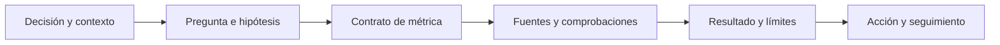
</details>

Si alguien recibe solo un gráfico final, no puede comprobar si se incluyeron cuentas de prueba, si la comparación tenía la misma ventana o si la recomendación fue prudente. La [plantilla reutilizable](../plantillas/brief-analitico.md) guarda los seis eslabones.

## Ejemplo: un brief inicial para Lumen

Un inicio honesto podría decir:

> **Decisión:** Producto decidirá el viernes si revierte temporalmente el onboarding 4.2 en Android. **Pregunta:** comparar activación a siete días de instalaciones 4.2 frente a 4.1, por sistema operativo y paso del flujo. **Hipótesis alternativas:** error en selector de fecha, cambio de mezcla de campañas o evento de reserva no registrado. **Límite inicial:** una comparación antes/después no demuestra causalidad. **Seguimiento:** si se revierte, medir activación, cancelación y contactos a soporte durante una semana comparable.

Fíjate en lo que no hace: no afirma que el selector «es la causa» y no borra explicaciones alternativas. Un brief puede empezar con incógnitas; su trabajo es hacerlas visibles.

## Usar AI como tutor, no como piloto automático

La AI puede adaptar ejemplos y hacer preguntas, pero no convierte una respuesta convincente en evidencia. Una petición útil para Leo sería: «No sé qué es un denominador. Explícame la activación de Lumen usando tres personas ficticias; después pídeme que defina a quién excluiría». Después verifica el ejemplo cambiando valores y explica por qué cambia el resultado.

No pegues datos personales, credenciales ni información privada de una empresa en una herramienta pública. Cuando más adelante uses código, conserva la fuente y los pasos; cuando uses AI, conserva también la pregunta importante y verifica cualquier consulta o conclusión antes de compartirla.

## Diagnóstico y siguiente ruta

Tener formación matemática ayuda, pero no permite saltarse las decisiones de medida. Una tasa puede estar bien calculada y responder una pregunta equivocada. Si ya dominas porcentajes, usa los ejemplos para repasar y dedica tiempo a los conceptos nuevos: población, evento, grano, ventana y evidencia.

Después de completar el ejercicio, continúa con el [bloque 01](../../01-fundamentos-datos/README.md). Allí aprenderás qué es un archivo, una tabla, una fila y una columna: las piezas que después permitirán implementar el contrato de métrica con datos reales.

## Resumen y comprobación

- Estudiar implica recuperar, aplicar y corregir, no solo leer.
- Un brief conserva decisión, pregunta, contrato, evidencia, límites y seguimiento.
- AI es útil para practicar si mantienes el control de los datos y verificas las conclusiones.

Pregúntate: ¿qué tendría que escribir Lumen en el brief si el sistema deja de registrar `reserva_completada`? ¿Por qué un número calculado correctamente podría seguir siendo una mala base para decidir?

# Bloque 01 — Fundamentos de datos

## Propósito

Antes de programar, Leo necesita aprender a mirar un conjunto de datos como una representación limitada de una operación real. Usaremos durante todo el bloque el caso de **Mercado Faro**, un marketplace con una web y una app: usuarios crean cuentas, hacen pedidos compuestos por líneas de producto y generan eventos de uso.

## Resultado de salida

Al acabar podrás explicar qué representa cada archivo y cada fila; elegir el grano adecuado; relacionar usuarios, pedidos, líneas y eventos sin multiplicar resultados; leer CSV y JSON con precaución; y documentar controles de calidad, privacidad y trazabilidad antes de recomendar una decisión.

## Prerrequisitos

Ninguno. Los términos archivo, tabla, CSV, JSON, clave y relación se construyen desde cero.

## Caso continuo

La dirección pregunta: «¿cuántos pedidos pagados tuvimos ayer y qué canal conviene mejorar?». Esta pregunta parece simple, pero obliga a distinguir personas de pedidos, pedidos de líneas de producto y acciones dentro de una app. Cada lección añade una pieza al mismo mapa.

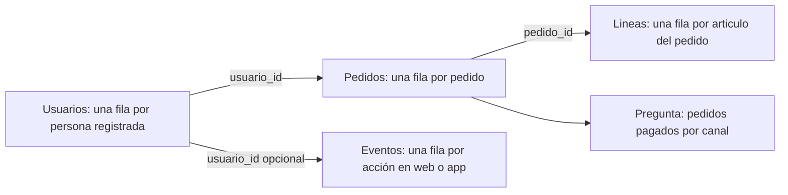

El diagrama no dice que todas las tablas puedan sumarse entre sí: muestra qué identificador permite conectar cada hecho sin cambiar su significado.

## Lecciones

1. [Archivo, tabla, observación y grano](lecciones/01-archivo-tabla-y-grano.md).
2. [Entidades, eventos, claves, relaciones y joins](lecciones/02-filas-columnas-y-relaciones.md).
3. [CSV, JSON y conversión a tablas analizables](lecciones/03-formatos-y-almacenamiento.md).
4. [Contrato, calidad, privacidad y trazabilidad](lecciones/04-calidad-y-uso-responsable.md).

## Práctica y laboratorio

- Resuelve [la auditoría del marketplace](../../ejercicios/temario-01/comprension/auditoria-marketplace.md) y consulta después [la solución razonada](../../soluciones/temario-01/auditoria-marketplace.md).
- Ejecuta [`notebooks/practicas/01-fundamentos-marketplace.py`](../../notebooks/practicas/01-fundamentos-marketplace.py). No requiere instalar librerías: lee los archivos de ejemplo, verifica reglas y demuestra cómo un join mal planteado cambia una cifra.
- Los archivos mínimos del caso están en [`datasets/temario-01/`](../../datasets/temario-01/).

## Criterio de dominio

No sigas al bloque de Python hasta poder completar, para cada tabla: «cada fila representa…», «su identificador es…», «esta métrica se calcula contando/sumando…» y «estos datos no permiten concluir…».

# 01.1 Archivo, tabla, observación y grano

## Objetivos y prerrequisitos

Al terminar podrás distinguir archivo, tabla, fila, columna y celda; escribir el **grano** de una fuente; y explicar por qué contar filas no siempre equivale a contar personas. No se presupone vocabulario técnico.

## Una pregunta cotidiana antes de la jerga

Mercado Faro quiere saber cuántos pedidos pagados recibió ayer. El sistema no guarda «la respuesta»; guarda huellas de cosas que ocurrieron: una persona se registró, pulsó un botón, creó un pedido o añadió dos artículos. Un **dato** es una representación registrada de una parte de la realidad, no la realidad completa.

Un **archivo** es una unidad con nombre y contenido que se puede guardar, copiar y abrir, como una foto o una nota. Si el contenido sigue filas y columnas, puede representar una **tabla**. Una tabla organiza observaciones comparables: una **fila** contiene un caso; una **columna** describe la misma propiedad para todos los casos; una **celda** es el cruce de ambas.

| pedido_id | usuario_id | creado_en | estado | total_eur |
| --- | --- | --- | --- | ---: |
| P-100 | U-10 | 2026-07-24 09:14 | pagado | 42.00 |
| P-101 | U-10 | 2026-07-24 18:05 | cancelado | 18.00 |
| P-102 | U-24 | 2026-07-24 20:22 | pagado | 65.00 |

Aquí cada fila es una observación de **un pedido**, no de un usuario. U-10 aparece dos veces porque hizo dos pedidos. El nombre técnico de esta precisión es el **grano**: la unidad que representa exactamente una fila.

## El grano determina qué cálculo responde a qué pregunta

Antes de abrir una herramienta completa esta frase: «cada fila de esta tabla representa ___». Si la respuesta es «un pedido», contar tres filas responde «tres pedidos»; no «tres clientes». Para clientes únicos se cuentan valores distintos de `usuario_id`; para facturación pagada se suman `total_eur` solo donde `estado = pagado`.

¿Qué camino convierte la pregunta en una cifra defendible?

<!-- mobile-diagram: rendered fallback -->


<details>
<summary>Ver código Mermaid editable</summary>

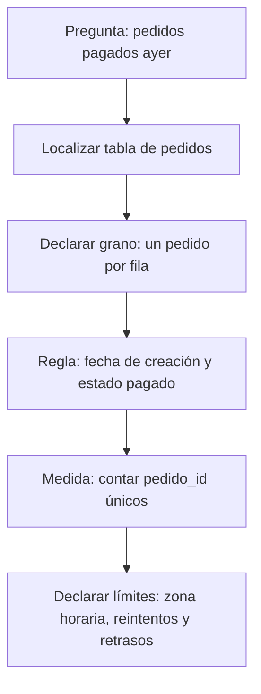
</details>

La cifra no es solo un `COUNT`: depende de la definición de «ayer», del estado que cuenta como pago y de que `pedido_id` no esté duplicado.

## Cuatro granos que no se pueden intercambiar

| Fuente | Cada fila representa | Pregunta adecuada | Error si se trata como pedido |
| --- | --- | --- | --- |
| `usuarios` | una cuenta registrada | ¿Cuántas cuentas nuevas? | ignora compras y sesiones |
| `pedidos` | un pedido iniciado | ¿Cuántos pedidos pagados? | puede incluir varios artículos |
| `lineas_pedido` | un artículo dentro de un pedido | ¿Qué unidades se vendieron? | cuenta artículos como pedidos |
| `eventos` | una acción con hora | ¿Dónde abandona la app? | un usuario puede generar cientos |

Una **entidad** es algo relativamente estable que queremos identificar, como usuario o producto. Un **evento** es algo que ocurre en un momento, como `checkout_iniciado`. Un pedido es una **transacción**: registra un intercambio u operación de negocio. En la siguiente lección se afina esta distinción.

## Ejemplo trabajado: un total que parece correcto y no lo es

El pedido P-100 tiene dos líneas: camiseta (20 €) y envío (2 €); P-102 tiene tres líneas por 65 €. Si unimos pedidos con líneas y después contamos filas, veremos cinco filas y podríamos decir «cinco pedidos». Es falso: hay dos pedidos. La suma de `pedidos.total_eur` tras ese join también se repetirá una vez por línea, inflando los ingresos.

El problema no es el software: es haber olvidado el grano al cambiar de tabla. Conserva siempre una nota junto al análisis: fuente, grano, filtro, periodo y unidad.

## Límites y error frecuente

No asumas que una tabla contiene todo. Los eventos pueden faltar si una persona usa bloqueador; un pedido puede estar pendiente de pago; la hora puede venir en UTC mientras la dirección habla de Madrid. Una tabla es evidencia parcial y debe leerse junto con su cobertura y reglas.

## Resumen y comprobación

- Archivo: contenido guardado con un nombre y un formato.
- Tabla: organización en filas y columnas.
- Grano: lo que representa una fila; dicta qué se puede contar o sumar.

1. Escribe el grano de una tabla de sesiones y otro de una tabla de usuarios.
2. ¿Por qué tres filas con el mismo `usuario_id` no son necesariamente un error?
3. Para «productos vendidos», ¿usarías pedidos o líneas de pedido? Justifica la elección.

Aplica estas ideas en [la práctica del marketplace](../../../ejercicios/temario-01/comprension/auditoria-marketplace.md).

# 01.2 Entidades, eventos, claves, relaciones y joins

## Objetivos y prerrequisitos

Aprenderás a diseñar y leer relaciones entre tablas, distinguir clave primaria y foránea, comprobar cardinalidades 1:1, 1:N y N:M, y detectar un join que multiplica filas. Parte de la lección 01: ya sabes que cada tabla tiene grano.

## Del mundo real a varias tablas pequeñas

Guardar nombre, dirección y producto repetidos en cada pedido vuelve los datos difíciles de corregir y de analizar. Separamos la información según lo que representa: `usuarios` para personas registradas, `pedidos` para transacciones y `lineas_pedido` para artículos del pedido. Una **dimensión** suele describir una entidad (por ejemplo, producto o usuario); una tabla de hechos registra eventos o transacciones medibles.

También existe un **snapshot**: una fotografía de estado en un instante. Una tabla con una fila por producto y día que guarda su stock al cierre no es un evento de cambio de stock: es el estado observado a esa fecha. Confundir ambos altera tendencias y acumulados.

## Claves: etiquetas para reconocer y conectar

Una **clave primaria** identifica de manera única una fila dentro de su tabla: `usuarios.usuario_id` o `pedidos.pedido_id`. Una **clave foránea** guarda la referencia a otra tabla: `pedidos.usuario_id` apunta al usuario que hizo el pedido. Que sea numérica o de texto no la convierte en medida: no tiene sentido promediar identificadores.

¿Cómo se conectan las piezas del caso sin inventar relaciones?

<!-- mobile-diagram: rendered fallback -->


<details>
<summary>Ver código Mermaid editable</summary>

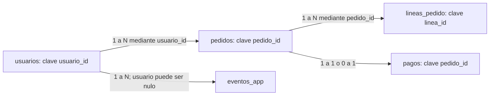
</details>

Un usuario puede tener muchos pedidos (1:N); cada pedido pertenece a un usuario si el negocio lo exige. Un pago puede ser 0:1 con pedido si hay pedidos iniciados pero no cobrados. Las relaciones describen una regla de negocio, no una forma de dibujo.

## Cardinalidad y tabla puente

- **1:1:** una fila A se asocia como máximo a una fila B; por ejemplo, pedido y comprobante de pago final si el sistema lo garantiza.
- **1:N:** un usuario puede tener N pedidos; cada pedido tiene un usuario.
- **N:M:** un pedido puede incluir N productos y un producto aparece en M pedidos. No se conecta directamente: `lineas_pedido` actúa como **tabla puente** con `pedido_id`, `producto_id`, cantidad y precio.

| pedido_id | producto_id | cantidad | precio_unitario_eur |
| --- | --- | ---: | ---: |
| P-100 | PR-7 | 1 | 20.00 |
| P-100 | PR-9 | 1 | 20.00 |
| P-102 | PR-7 | 2 | 32.50 |

La tabla puente no es una molestia técnica: conserva el grano «un artículo de un pedido» y permite responder unidades por producto sin repetir atributos del pedido.

## Join: combinar solo con una hipótesis verificable

Un **join** combina filas según una clave. Antes de ejecutarlo escribe: (1) grano de la tabla izquierda, (2) grano de la derecha, (3) cardinalidad esperada, (4) qué métrica se mantendrá. Si `pedidos` (uno por pedido) se une a `lineas_pedido` (varias por pedido), el resultado tendrá grano de línea, no de pedido.

Ejemplo: P-100 total 42 € y dos líneas. Tras el join aparecerá dos veces con 42 €. Sumar `total_eur` da 84 € para ese pedido: una multiplicación silenciosa. Para facturación, agrega las líneas por pedido primero o calcula la métrica en `pedidos` antes de unir dimensiones.

Un caso especialmente peligroso es unir dos tablas que tienen varias filas por `usuario_id` (eventos y pedidos). Si U-10 tiene 3 eventos y 2 pedidos, el join produce 6 filas. Esa tabla no representa ni eventos ni pedidos originales.

## Diccionario y contrato de datos

El **diccionario de datos** define el significado de cada columna. Un **contrato de datos** además expresa reglas compartidas entre quien produce y quien consume la fuente: esquema, grano, claves, actualización, valores válidos y responsable.

| Campo | Definición | Regla | Propietario |
| --- | --- | --- | --- |
| `pedido_id` | identificador estable de pedido | único, no nulo | Checkout |
| `creado_en_utc` | instante de creación en UTC | ISO 8601, no nulo | Plataforma |
| `total_eur` | importe cobrado, IVA incluido | >= 0; devolución separada | Pagos |
| `canal` | origen atribuido al pedido | `web`, `app`, `partner` | Growth |

Un contrato evita que «total» cambie de incluir a excluir IVA sin aviso. También permite investigar una incidencia: versión de fuente, momento de carga y responsable dejan **trazabilidad**.

## Error frecuente, resumen y comprobación

No des por única una clave por el nombre ni des por válida una relación por tener la misma columna. Comprueba nulos, duplicados y número de filas antes y después de cada join.

1. ¿Cuál es el grano del resultado de unir `pedidos` con `lineas_pedido`?
2. Da un ejemplo realista de relación N:M distinta de productos y pedidos.
3. ¿Qué regla del contrato impediría contar dos veces el mismo pedido?

Resuelve las preguntas de joins en [la práctica](../../../ejercicios/temario-01/comprension/auditoria-marketplace.md).

# 01.3 CSV, JSON y conversión a tablas analizables

## Objetivos y prerrequisitos

Sabrás leer un CSV y un JSON como archivos de texto, explicar sus diferencias operativas, reconocer separador, codificación y fechas, y convertir un JSON de pedidos en tablas con grano claro. Se parte de archivo y tabla, no de experiencia con programación.

## CSV: una tabla escrita línea a línea

Un **CSV** (*comma-separated values*) guarda una tabla como texto. La primera línea suele ser el encabezado; cada línea posterior, una fila. El nombre es histórico: en España es frecuente usar punto y coma para no confundir la coma decimal con el separador.

```text
pedido_id;creado_en_utc;total_eur;canal
P-100;2026-07-24T07:14:00Z;42,00;web
P-102;2026-07-24T18:22:00Z;65,00;app
```

Antes de tratarlo como tabla hay que acordar el **dialecto**: separador `;`, decimal `,`, codificación de caracteres (preferiblemente UTF-8), comillas para texto con separadores y formato de fecha. Si una herramienta espera coma como separador, puede leer toda la línea como una sola columna; si interpreta `42,00` en otro contexto, puede dejarlo como texto.

La fecha `2026-07-24T07:14:00Z` sigue ISO 8601: `Z` significa UTC. No la cambies a «hora local» sin declarar zona y regla de conversión.

## JSON: una ficha con estructura interna

Un archivo **JSON** (*JavaScript Object Notation*) también es texto, pero puede contener objetos y listas. Es habitual al recibir datos de una API: un servicio responde con una ficha de pedido que incluye al usuario y sus artículos.

```json
{
  "pedido_id": "P-100",
  "usuario": {"usuario_id": "U-10", "pais": "ES"},
  "items": [
    {"producto_id": "PR-7", "cantidad": 1, "precio_eur": 20.0},
    {"producto_id": "PR-9", "cantidad": 1, "precio_eur": 20.0}
  ],
  "total_eur": 42.0
}
```

No hay una única conversión correcta de JSON a CSV. El objeto principal se puede convertir en una fila de `pedidos`; `usuario.usuario_id` se extrae como una columna; cada elemento de `items` debe crear una fila de `lineas_pedido`. Repetir el pedido en cada línea es válido solo si declaramos que el resultado tiene grano de línea y no reutilizamos `total_eur` como si fuera un importe por línea.

<!-- mobile-diagram: rendered fallback -->


<details>
<summary>Ver código Mermaid editable</summary>

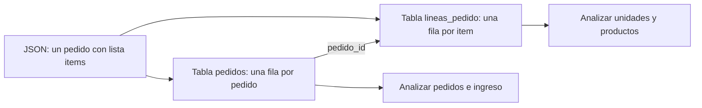
</details>

El objetivo de la conversión no es «aplanar todo»: es conservar significado y poder analizar cada pregunta con el grano correspondiente.

## Otros medios y elección razonada

Excel es una aplicación y un formato útil para revisión humana y casos pequeños, pero varias ediciones manuales sin historial dificultan reproducir un análisis. Parquet guarda datos por columnas y tipos de forma eficiente; suele usarse con herramientas de datos, no editándose a mano. Una base de datos mantiene datos compartidos con consultas, permisos y reglas; SQL, MongoDB o DynamoDB se verán más adelante con profundidad.

La elección responde a una necesidad: CSV para intercambio de tabla simple; JSON para respuestas estructuradas; Parquet para volúmenes tabulares y procesos analíticos; base de datos para operación concurrente. Ningún formato arregla un grano o una definición defectuosos.

## Contraejemplos y comprobación

No abras un CSV «a doble clic» y des por hecho que se interpretó bien. Verifica columnas, filas, tipos, caracteres como `ñ` y fechas. No conviertas una lista JSON en una sola celda para luego intentar contar productos.

1. ¿Qué separador y decimal usa el CSV del ejemplo?
2. ¿Qué dos tablas crearías a partir del JSON y cuál sería su clave de unión?
3. ¿Por qué `total_eur` no se debe sumar sin cuidado tras expandir `items`?

El laboratorio ejecutable muestra una conversión deliberadamente pequeña y auditable.

# 01.4 Contrato, calidad, privacidad y trazabilidad

## Objetivos y prerrequisitos

Aprenderás a convertir «revisar datos» en reglas observables, clasificar incidencias por severidad, investigar ausencias sin borrarlas por costumbre y limitar el uso de información personal. Requiere comprender grano, claves y formatos de las lecciones anteriores.

## Calidad no significa perfección

Un conjunto es de calidad suficiente si sirve para una decisión concreta con límites conocidos. Los pedidos de Mercado Faro pueden ser aptos para planificar empaquetado diario y no para estudiar satisfacción, porque no contienen opiniones. Antes de calcular una métrica, documenta qué debe ser cierto.

| Dimensión | Pregunta operativa | Regla de ejemplo |
| --- | --- | --- |
| Completitud | ¿faltan campos necesarios? | `pedido_id`, fecha y estado no nulos |
| Validez | ¿respetan formato y rango? | importe >= 0; fecha ISO 8601 |
| Consistencia | ¿la misma idea se codifica igual? | canal solo `web`, `app`, `partner` |
| Unicidad | ¿se repite indebidamente el hecho? | `pedido_id` único en pedidos |
| Actualidad | ¿llega a tiempo? | carga antes de 09:00 del día siguiente |

La calidad necesita responsable y reacción, no solo una lista. Una regla fallida se registra con fecha, fuente, número de filas afectadas, severidad, decisión y seguimiento: eso es **trazabilidad**.

## De regla a decisión: severidad y contrato

El contrato de datos de la lección 02 declara esquema, grano, reglas, propietario y frecuencia. Ahora añadimos severidad. Un `pedido_id` duplicado que infla ingresos es **crítico**: se bloquea el reporte. Un canal nuevo `affiliate` puede ser una advertencia: se aísla, se consulta a Growth y no se adivina a qué categoría pertenece. Una descripción de producto vacía quizá sea informativa y no impida el cálculo de pedidos.

¿Cómo se gobierna una incidencia sin esconderla bajo una limpieza automática?

<!-- mobile-diagram: rendered fallback -->


<details>
<summary>Ver código Mermaid editable</summary>

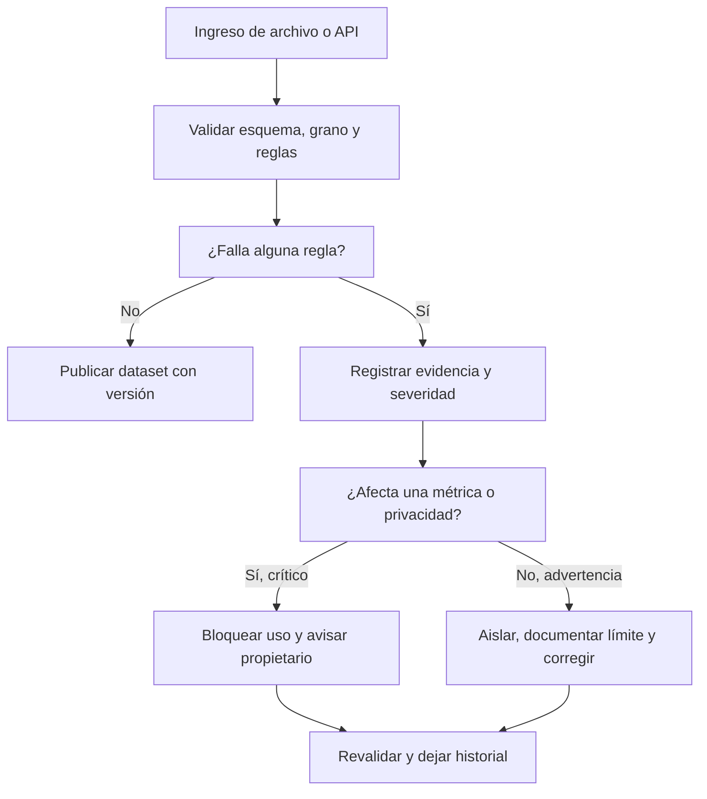
</details>

El flujo enseña que «limpiar» no equivale a borrar. Primero se preserva evidencia; después se decide una corrección reproducible.

## Ausencias, sesgo y cobertura

Un vacío puede significar «no aplica», «no se capturó», «falló el tracking» o «la persona no quiso responder». Si `pais` falta sobre todo en usuarios de la app antigua, eliminar esas filas altera la población y puede esconder un fallo técnico. Mide ausencia por fecha, versión, canal y segmento; declara quién queda fuera antes de concluir que un canal rinde peor.

El **sesgo de cobertura** aparece cuando la fuente representa peor a parte de la población. Observar que quienes activaron notificaciones compran más no prueba que activar notificaciones cause compras: pueden ser usuarios ya más interesados. Un analista separa observación, explicación posible y decisión que aún requiere evidencia.

## Privacidad: finalidad, minimización y retención

Los datos personales identificables (**PII**, por *personally identifiable information*) son datos que identifican o pueden ayudar a identificar a una persona, como correo, teléfono, dirección o combinaciones poco frecuentes. Para contar pedidos por canal no necesitamos el correo. Aplicamos:

- **Finalidad:** define para qué se usa cada campo antes de recogerlo o consultarlo.
- **Minimización:** usa solo los campos necesarios; sustituye identificadores por un ID interno cuando sea posible.
- **Acceso:** limita quién puede ver PII y no copies datos reales en notebooks, ejercicios o capturas.
- **Retención:** fija cuánto tiempo se conserva y cómo se elimina o anonimiza según la política y normativa aplicables.

Pseudonimizar no vuelve un conjunto automáticamente anónimo: un identificador sustituido aún puede relacionarse con una persona si existe la tabla de correspondencia o combinaciones reidentificables. Para decisiones legales o de tratamiento real, intervienen responsables de privacidad y la normativa vigente; el analista no debe improvisar permisos.

## Resumen y comprobación

Una métrica defendible exige grano, contrato y controles. La ausencia es un resultado que se investiga; calidad y privacidad son condiciones del análisis, no una fase administrativa final.

1. Clasifica como crítica, advertencia o informativa una fecha nula en un pedido pagado y justifica.
2. ¿Por qué borrar todos los nulos de `pais` puede sesgar una comparación por canal?
3. Para un dashboard de pedidos por canal, ¿qué PII puedes excluir?

Completa [la auditoría](../../../ejercicios/temario-01/comprension/auditoria-marketplace.md) y ejecuta el laboratorio antes de pasar a Python.

# Bloque 02 - Python desde cero: reglas verificables para eventos y pedidos

## Propósito y resultado de salida

Python es un lenguaje para expresar instrucciones que un ordenador puede repetir. En análisis no se aprende para "programar por programar": se usa para convertir una regla de negocio -por ejemplo, «un pedido confirmado debe tener importe positivo»- en un proceso visible, repetible y comprobable.

Al terminar, Leo podrá leer, escribir y depurar un programa pequeño que reciba eventos o pedidos, valide casos anómalos, calcule resultados y explique qué datos descartó y por qué. Aún no trabajará con miles de filas ni con Pandas: primero dominará las piezas que luego Pandas automatiza.

## Caso continuo: Lumen

Lumen es una app ficticia de comercio. Cada vez que una persona inicia o completa una compra se registra un **evento**: un pequeño diccionario con información como `tipo`, `usuario` e `importe`. Durante el bloque construiremos un auditor sencillo de pedidos: clasifica su estado, suma solo pedidos válidos y deja constancia de los errores. El caso permite ver que sintaxis, calidad de datos y decisión de negocio están unidas.

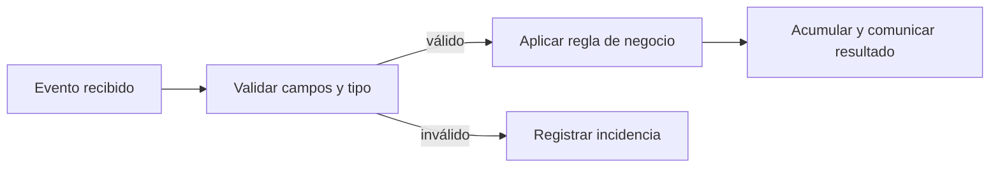

El mismo esquema aparecerá después en un notebook y, con estructuras más potentes, en Pandas. No se debe «arreglar» silenciosamente un evento: que sea inválido es información útil para producto e ingeniería.

## Prerrequisitos y forma de estudio

Solo se presupone haber visto qué es un dato y una tabla en los bloques 00-01. Puede usarse [Google Colab](https://colab.research.google.com/) desde un navegador: crea un notebook, pega una celda, ejecútala y observa la salida. Un **notebook** mezcla texto, código y resultados; un **script** es un archivo `.py` que se ejecuta completo. Ambos usan Python; se elige notebook para explorar y script para repetir un proceso estable.

En cada lección: copia el ejemplo, predice su salida, ejecútalo, cambia un valor y explica qué regla se ha modificado. No avances si un mensaje de error aún parece misterioso: la lección 05 enseña a convertirlo en una pista.

## Lecciones

1. [Entorno, valores, variables y expresiones](lecciones/01-entorno-valores-y-variables.md)
2. [Colecciones: pedidos, copias y estructura anidada](lecciones/02-colecciones-y-datos-sencillos.md)
3. [Condiciones, operadores lógicos y bucles seguros](lecciones/03-condiciones-y-bucles.md)
4. [Funciones, contratos, módulos y alcance](lecciones/04-funciones-y-alcance.md)
5. [Errores, pruebas y depuración basada en evidencia](lecciones/05-errores-y-depuracion.md)
6. [Laboratorio: auditoría reproducible de pedidos](lecciones/06-estilo-y-practica-gastos.md)

## Práctica verificable

1. Lee el [laboratorio ejecutable de Lumen](../../notebooks/practicas/02-auditoria-pedidos.py). Puedes pegarlo por secciones en Colab o ejecutarlo con `python notebooks/practicas/02-auditoria-pedidos.py`.
2. Resuelve [la auditoría de pedidos](../../ejercicios/temario-02/aplicacion/gastos-personales.md) antes de mirar la [solución razonada](../../soluciones/temario-02/gastos-personales.md).
3. El notebook histórico de gastos queda como práctica adicional, pero el caso de Lumen es la evaluación recomendada porque incluye entradas inválidas, límites y salidas esperadas.

## Criterio de dominio

No basta con que el código «no falle». Debes poder señalar la entrada, la salida, la regla y al menos un caso límite para cada función. Si no sabes qué haría tu programa con `None`, un importe como texto, una lista vacía o un pedido exactamente en el umbral, todavía no está listo para automatizar decisiones.

# 01 - Entorno, valores, variables y expresiones

## Resultado observable y prerrequisitos

Al finalizar podrás ejecutar una celda, predecir el resultado de una expresión y guardar cada resultado con un nombre que explique qué representa. No se requiere experiencia programando.

## Del dato a una regla ejecutable

Imagina que Lumen recibe un pedido de 42,50 euros. Antes de hablar de «variables», mira una operación mínima:

```python
42.50 * 1.21
```

Python evalúa esa **expresión** y devuelve `51.425`. Una expresión combina valores y operadores para producir otro valor. Para análisis, conviene dar un significado a cada parte:

```python
importe_sin_iva = 42.50
TIPO_IVA = 0.21
importe_con_iva = importe_sin_iva * (1 + TIPO_IVA)
print(importe_con_iva)
```

Una **variable** es un nombre que referencia un valor; `=` es una asignación, no una igualdad matemática. La constante en mayúsculas comunica una convención humana: no debería cambiar durante el cálculo. Python no impide modificarla, por lo que la revisión sigue siendo necesaria.

<!-- mobile-diagram: rendered fallback -->


<details>
<summary>Ver código Mermaid editable</summary>

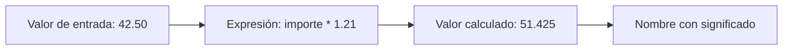
</details>

El diagrama recuerda que un nombre no convierte un dato en correcto: solo hace visible qué creemos que representa.

## Tipos y operadores

Los tipos básicos son entero (`3`, `int`), decimal (`3.5`, `float`), texto (`"web"`, `str`), booleano (`True` / `False`, `bool`) y ausencia explícita (`None`). `type(valor)` permite inspeccionarlos. Los operadores aritméticos incluyen `+`, `-`, `*`, `/` y `%` (resto); los comparadores `==`, `!=`, `<`, `<=`, `>` y `>=` producen booleanos.

```python
canal = "web"
importe = 42.50
es_web = canal == "web"
es_importe_positivo = importe > 0
print(es_web, es_importe_positivo)  # True True
```

`"42.50" + "10"` da `"42.5010"`: une texto. No conviertas un dato a `float` por reflejo; primero confirma que la fuente define ese texto como número y qué moneda usa.

## Notebook, script y estado de ejecución

En un notebook ejecutas celdas en cualquier orden. Si ejecutas una celda que usa `importe` antes de aquella que lo crea, aparecerá `NameError`. En un script, Python lee las líneas de arriba abajo cada vez. Para aprendizaje, un notebook facilita experimentar; para una auditoría repetible, un script evita depender del orden oculto de clics.

## Micropráctica

1. Predice y ejecuta `7 // 2`, `7 / 2` y `7 % 2`.
2. Crea `importe = "42.50"`. Compara `type(importe)` con `type(42.50)` y explica por qué no deben sumarse directamente.
3. Guarda `importe_original` y `importe_con_descuento` en nombres distintos. ¿Qué valor podrías auditar si sobrescribieras el primero?

## Error frecuente y resumen

Evita nombres como `x` o `dato` cuando `importe_bruto` explica el significado. Tampoco confundas `=` con `==`: el primero guarda; el segundo compara. En la próxima lección varios valores formarán un pedido y una colección de eventos.

# 02 - Colecciones: pedidos, copias y estructura anidada

## Resultado observable y prerrequisitos

Al finalizar sabrás elegir lista, tupla, conjunto o diccionario para representar eventos de Lumen; accederás sin perder de vista índices, claves, copias y mutabilidad. Requiere valores y tipos de la lección 01.

## Un pedido tiene partes; una colección conserva relaciones

Un diccionario asocia una **clave** con su valor. Una lista conserva una secuencia ordenada. Juntos pueden representar pedidos recibidos:

```python
pedido = {"id": "p-101", "canal": "web", "importe": 42.50, "etiquetas": ["nuevo", "promo"]}
pedidos = [pedido, {"id": "p-102", "canal": "app", "importe": 18.00, "etiquetas": []}]
print(pedidos[0]["importe"])  # 42.5
```

`pedidos[0]` significa «primer elemento» porque Python empieza a contar desde cero. `pedido["importe"]` usa una clave, no una posición. El anidamiento (`lista` dentro de `dict`) se parece a una respuesta JSON de una API; todavía no es una tabla, pero ya obliga a preguntar qué campos son obligatorios.

<!-- mobile-diagram: rendered fallback -->


<details>
<summary>Ver código Mermaid editable</summary>

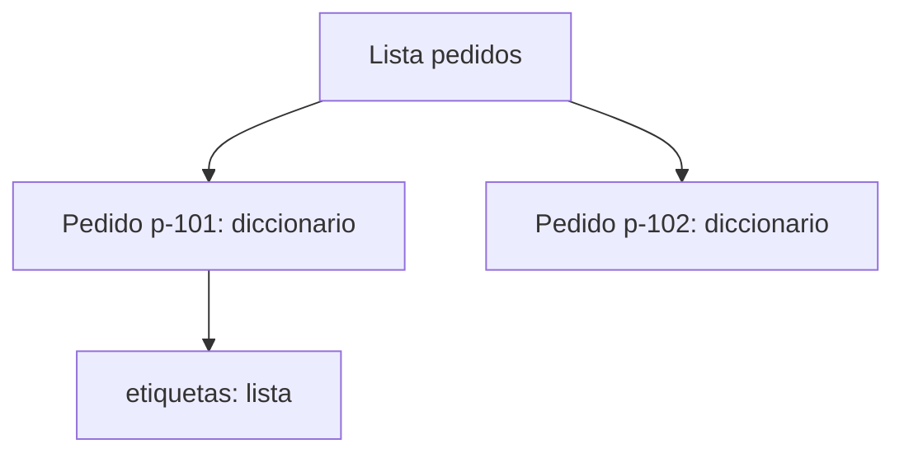
</details>

La relación no es una secuencia: un pedido tiene varios campos y una lista contiene varios pedidos.

## Cuatro colecciones y su propósito

| Colección | Ejemplo | Mantiene orden | Se puede modificar | Uso razonable |
| --- | --- | --- | --- | --- |
| Lista `[]` | `["web", "app"]` | Sí | Sí | Eventos o resultados en orden. |
| Tupla `()` | `("EUR", 2)` | Sí | No | Configuración que no debe cambiar. |
| Conjunto `set()` | `{ "web", "app" }` | No prometido | Sí | Valores únicos, por ejemplo canales observados. |
| Diccionario `{}` | `{"importe": 42.5}` | Claves accesibles por nombre | Sí | Un registro con campos. |

Un conjunto elimina duplicados: `set(["web", "web", "app"])` contiene dos canales. No lo uses si necesitas conservar cada evento: que dos pedidos compartan canal no los vuelve duplicados.

## Slicing, mutabilidad y copias

El *slicing* toma una parte: `pedidos[0:2]` incluye posiciones 0 y 1; el extremo final no entra. Las listas y diccionarios son **mutables**: se pueden alterar después de crearse. Por eso esta aparente copia es peligrosa:

```python
original = {"id": "p-101", "etiquetas": ["nuevo"]}
alias = original
alias["etiquetas"].append("revisar")
print(original["etiquetas"])  # también cambia
```

`alias` y `original` apuntan al mismo objeto. `original.copy()` copia solo el nivel exterior; para datos anidados usa `copy.deepcopy` cuando de verdad necesites independizar todos los niveles. Antes de copiar masivamente, pregunta si modificar el original es parte de la regla o un error.

```python
from copy import deepcopy
pedido_limpio = deepcopy(original)
pedido_limpio["etiquetas"].append("auditable")
```

## Microprácticas y límites

1. Crea tres pedidos y obtén los dos últimos con slicing.
2. Obtén los canales únicos con un conjunto. ¿Por qué el resultado no prueba cuántos pedidos hubo?
3. Prueba `pedido["descuento"]`: aparecerá `KeyError`. Después usa `pedido.get("descuento")` y explica la diferencia entre «no existe» y un descuento igual a cero.
4. Haz una copia profunda de un pedido con etiquetas, modifica la copia y verifica que el original no cambia.

No uses `get("importe", 0)` sin acordar su significado: sustituir ausencia por cero puede esconder un fallo de instrumentación. En la siguiente lección decidirás qué hacer con cada pedido mediante condiciones y bucles.

# 03 - Condiciones, operadores lógicos y bucles seguros

## Resultado observable y prerrequisitos

Aplicarás una regla explícita a cada pedido, distinguiendo estados, y repetirás el proceso sin perder eventos. Requiere listas y diccionarios.

## Una regla de negocio tiene bordes

Lumen considera revisable un pedido si su importe es al menos 100 EUR **y** está confirmado. Antes de codificar, decide qué pasa en los límites: 100 entra; 99,99 no; un importe desconocido no se aprueba automáticamente.

```python
importe = 100
estado = "confirmado"

if importe >= 100 and estado == "confirmado":
    accion = "revisar"
elif estado != "confirmado":
    accion = "esperar confirmacion"
else:
    accion = "operacion normal"
```

`if` evalúa una condición, `elif` ofrece una alternativa y `else` cubre el resto. La sangría define qué instrucciones pertenecen a cada rama. Los operadores `and`, `or` y `not` combinan condiciones: `and` exige ambas verdaderas; `or` basta con una; `not` invierte. Usa paréntesis cuando mezcles condiciones para que la prioridad sea legible.

<!-- mobile-diagram: rendered fallback -->


<details>
<summary>Ver código Mermaid editable</summary>

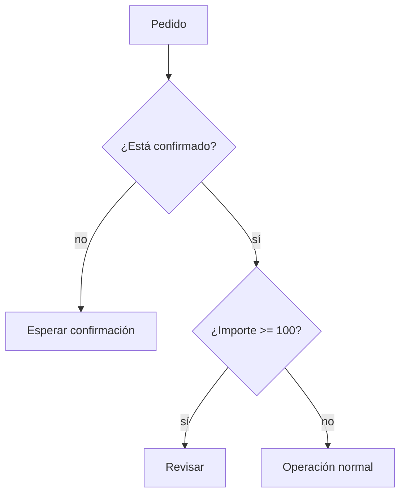
</details>

El orden de las preguntas importa: comparar un importe ausente antes de validar el estado o el tipo puede provocar un error o una decisión falsa.

## Repetir: `for` cuando conoces la colección, `while` cuando esperas una condición

Un `for` visita cada elemento de una lista. Para sumar solo confirmados, se usa un acumulador que empieza en cero:

```python
total_confirmado = 0
for pedido in pedidos:
    if pedido["estado"] == "confirmado":
        total_confirmado += pedido["importe"]
```

Un `while` repite mientras una condición sea verdadera. Es útil, por ejemplo, para reintentar una petición con límite; sin actualizar el contador puede no terminar nunca.

```python
intentos = 0
MAX_INTENTOS = 3
while intentos < MAX_INTENTOS:
    intentos += 1
    print(f"Intento {intentos}")
```

No uses `while True` en un primer programa salvo que haya una salida clara (`break`) y una razón documentada. Para recorrer una lista de pedidos, `for` expresa mejor la intención.

## `break`, `continue` y no modificar la lista recorrida

`continue` salta al siguiente elemento; `break` termina el bucle. Pueden ser correctos, pero un `break` tras el primer pedido inválido puede impedir auditar los demás. En análisis suele ser preferible guardar incidencias y continuar cuando el problema es local.

```python
validos = []
incidencias = []
for pedido in pedidos:
    if not isinstance(pedido.get("importe"), (int, float)):
        incidencias.append(pedido.get("id", "sin_id"))
        continue
    validos.append(pedido)
```

No borres elementos de `pedidos` dentro del `for`: puedes saltarte posiciones. Construye `validos` y `incidencias`; así también conservas evidencia de la calidad de origen.

## Microprácticas

1. Clasifica importes 99, 100 y 101. Explica por qué `>` no cumple la regla acordada.
2. Añade un pedido cancelado y otro con `importe=None`. Diseña qué lista debe recibir cada uno y justifica tu decisión.
3. Escribe un `while` de tres intentos y provoca deliberadamente el error de no incrementar el contador; no lo ejecutes sin un límite.
4. Recorre una lista y crea otra solo con canales `web` o `app`. ¿Cuándo usarías `or`?

Las condiciones hacen visibles decisiones; las funciones de la próxima lección impedirán repetir esas decisiones de manera inconsistente.

# 04 - Funciones, contratos, módulos y alcance

## Resultado observable y prerrequisitos

Crearás funciones pequeñas con entradas, salida y casos límite definidos; usarás argumentos opcionales, `return`, docstrings y comprobaciones. Requiere condiciones y bucles.

## Una función es un contrato comprobable

Repetir `if importe >= 100` en varias celdas invita a que cada copia use un límite diferente. Una función nombra la regla y publica su contrato: qué acepta, qué devuelve y qué no hace.

```python
def clasificar_importe(importe, limite=100):
    """Devuelve 'alto' si importe es numérico y alcanza limite; si no, devuelve 'invalido'."""
    if not isinstance(importe, (int, float)):
        return "invalido"
    if importe >= limite:
        return "alto"
    return "normal"
```

`importe` y `limite` son parámetros. `limite=100` es un argumento opcional: la persona que llama puede usar el valor por defecto o indicar otro. `return` entrega un resultado y termina la función; `print` solo lo muestra en pantalla. Por eso una función analítica debe normalmente devolver datos y dejar que otra parte decida cómo presentarlos.

<!-- mobile-diagram: rendered fallback -->


<details>
<summary>Ver código Mermaid editable</summary>

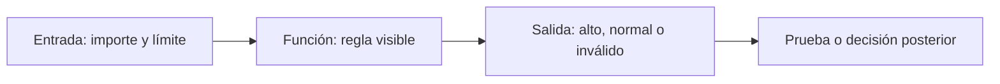
</details>

## Pruebas mínimas: normal, límite y dato inválido

Un ejemplo no demuestra que una regla funcione. Comprueba al menos un caso normal, el borde y una entrada inválida:

```python
assert clasificar_importe(99) == "normal"
assert clasificar_importe(100) == "alto"
assert clasificar_importe("100") == "invalido"
assert clasificar_importe(150, limite=200) == "normal"
```

`assert` detiene la ejecución si la afirmación es falsa. No sustituye una suite profesional de tests, pero impide confiar en una salida bonita sin comprobar la regla. Un `AssertionError` es evidencia de que la expectativa y el código no coinciden.

## Alcance y efectos secundarios

Los nombres creados dentro de una función son locales. Pasar datos como parámetros hace visible de qué depende la regla:

```python
LIMITE_GLOBAL = 100

def es_revisable(importe, limite):
    return importe >= limite
```

Evita que `es_revisable` lea `LIMITE_GLOBAL` sin recibirlo: cambiar una variable global en otra celda podría alterar resultados sin que la llamada lo muestre. Evita además modificar una lista recibida salvo que el contrato lo anuncie; es preferible devolver una nueva estructura o documentar el efecto.

## Módulos, imports, script y notebook

Un **módulo** es un archivo Python que contiene funciones reutilizables. `import math` carga un módulo de la biblioteca estándar; `from math import ceil` importa un nombre concreto. No nombres tu archivo `math.py`, porque ocultaría el módulo oficial. Un script puede proteger su ejecución principal:

```python
def main():
    print(clasificar_importe(120))

if __name__ == "__main__":
    main()
```

Al ejecutar el archivo directamente se llama a `main`; al importarlo desde otro archivo se obtienen las funciones sin ejecutar el informe. Un notebook es útil para explorar; un módulo reduce copias cuando una regla ya está estable.

## Microprácticas y resumen

1. Cambia el límite por defecto a 75 y prueba una llamada que lo sobrescriba.
2. Escribe `es_pedido_valido(pedido)` que devuelva `True` solo si contiene id, importe numérico positivo y estado confirmado.
3. Añade tres `assert` antes de confiar en ella.
4. Explica qué diferencia hay entre devolver una lista y hacer `print(lista)`.

Una función clara permite localizar fallos. La próxima lección enseña a distinguir los errores que Python señala y los resultados erróneos que Python no puede adivinar.

# 05 - Errores, pruebas y depuración basada en evidencia

## Resultado observable y prerrequisitos

Sabrás leer el final de un traceback, aislar un fallo, distinguir errores de sintaxis y de datos, y manejar solo excepciones esperadas. Requiere haber ejecutado funciones sencillas.

## El traceback es un mapa, no una acusación

Un **traceback** es la ruta de llamadas que Python muestra cuando no puede continuar. La última línea nombra normalmente el tipo y la causa inmediata. Léela primero, luego vuelve a la línea de tu código indicada.

| Error | Ejemplo típico | Pregunta útil |
| --- | --- | --- |
| `SyntaxError` | Falta `:` o paréntesis | ¿Python puede interpretar el programa? |
| `NameError` | Usar `importe` antes de asignarlo | ¿Ejecuté la definición y escribí el nombre igual? |
| `IndexError` | `pedidos[3]` en lista de tres | ¿Existe esa posición? |
| `KeyError` | `pedido["importe"]` sin clave | ¿El contrato exige ese campo? |
| `ValueError` | `float("cuarenta")` | ¿El valor tiene forma válida para esa conversión? |
| `TypeError` | `"42" + 5` | ¿Las operaciones son compatibles con los tipos? |

Un programa puede no lanzar excepciones y aun así estar equivocado: usar `>` en lugar de `>=` en el umbral de Lumen cambia la clasificación de 100 EUR sin que Python proteste. Por eso se combinan traceback y pruebas de casos límite.

<!-- mobile-diagram: rendered fallback -->


<details>
<summary>Ver código Mermaid editable</summary>

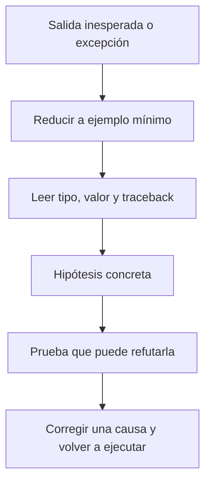
</details>

La corrección se hace después de entender la causa; cambiar cinco líneas a la vez impide saber cuál resolvió el problema.

## Validar cerca de la entrada

El laboratorio recibe eventos de una fuente simulada. Conviene transformar o rechazar un valor justo al llegar, no cuando el total ya es extraño:

```python
def leer_importe(pedido):
    try:
        importe = float(pedido["importe"])
    except KeyError as error:
        raise ValueError("El pedido no contiene importe") from error
    except (TypeError, ValueError) as error:
        raise ValueError("El importe debe ser numérico") from error
    if importe <= 0:
        raise ValueError("El importe debe ser positivo")
    return importe
```

Capturamos excepciones concretas porque son esperables en esta frontera. `except Exception: pass` sería mala práctica: silencia también problemas de programación y puede dejar un informe incompleto sin aviso. La excepción se traduce a un mensaje de negocio, pero se conserva la causa con `from error`.

## `assert` y registro de incidencias

Usa `assert` para afirmar un comportamiento que el programador espera durante desarrollo. Para datos que vienen de fuera, una excepción controlada o una incidencia suele ser mejor que detener toda la auditoría:

```python
incidencias = []
for pedido in pedidos:
    try:
        importe = leer_importe(pedido)
    except ValueError as error:
        incidencias.append({"id": pedido.get("id", "sin_id"), "motivo": str(error)})
        continue
```

Esto no «arregla» el origen. Permite calcular un total de pedidos válidos y comunicar cuántos se excluyeron. Un analista debe informar ambos números; de lo contrario, la cifra parece más precisa de lo que es.

## Microprácticas

1. Provoca un `SyntaxError` eliminando dos puntos tras `if`; restaura el código y explica qué esperaba Python.
2. Crea una lista con dos pedidos e intenta acceder a `pedidos[2]`. ¿Por qué es `IndexError` y no `KeyError`?
3. Haz que `leer_importe({"importe": "--"})` lance `ValueError`; comprueba el mensaje.
4. Escribe un `assert` para el borde: un importe 0 no es válido.

Depurar consiste en producir evidencia sobre una hipótesis. En el laboratorio final reunirás datos válidos, incidencias, pruebas y una salida que otra persona pueda revisar.

# 06 - Laboratorio: auditoría reproducible de pedidos

## Resultado observable y prerrequisitos

Construirás y ejecutarás una auditoría pequeña de Lumen: entradas simuladas, reglas explícitas, incidencias, totales y pruebas. Requiere las cinco lecciones anteriores.

## El problema operativo

Producto quiere conocer el importe confirmado del día. Ingeniería advierte que algunos eventos llegan con texto en lugar de número, importe cero o estado inesperado. Informar únicamente un total sería engañoso: también hay que comunicar qué quedó fuera y por qué.

El [laboratorio ejecutable](../../../notebooks/practicas/02-auditoria-pedidos.py) separa cuatro responsabilidades:

<!-- mobile-diagram: rendered fallback -->


<details>
<summary>Ver código Mermaid editable</summary>

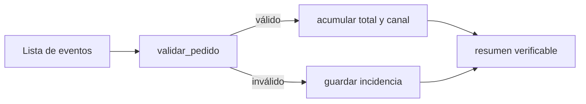
</details>

Separar funciones no es estética: permite probar la validación sin depender de la presentación del resumen.

## Lectura guiada del laboratorio

Primero observa `PEDIDOS_DEMO`. Es una lista deliberadamente pequeña con pedidos correctos, un importe de texto convertible, un importe cero, una clave ausente y un pedido cancelado. Después ejecuta las pruebas `assert`: si una falla, no continúes al resumen; la regla ha cambiado o está mal implementada.

La función `validar_pedido` devuelve una copia normalizada del pedido válido o lanza `ValueError` con una explicación. `auditar_pedidos` no oculta la excepción: la convierte en una incidencia con id y motivo. La salida esperada de los datos demo es:

```text
Pedidos válidos confirmados: 2
Importe confirmado: 160.50 EUR
Por canal: {'web': 120.5, 'app': 40.0}
Incidencias: 4
```

El pedido cancelado aparece como incidencia porque este informe tiene el contrato «solo confirmados». En otro informe podría contarse como estado separado; no hay una respuesta universal, sí debe haber una definición visible.

## Estilo que protege el análisis

- Usa nombres que expresen unidad y significado: `importe_confirmado`, no `resultado`.
- Declara límites (`LIMITE_REVISION = 100`) en lugar de números mágicos repartidos.
- No mezcles lectura, validación, cálculo y `print` en un bucle enorme.
- Devuelve datos desde las funciones; imprime solo en el borde del programa.
- Conserva incidencias y recuentos. Un valor excluido sin rastro es una fuga de trazabilidad.

No basta con que una salida coincida una vez. Cambia un pedido demo para que valga 100, añade un canal nuevo y prueba una lista vacía. El programa debe responder de forma definida, no por accidente.

## Ejercicio de cierre

Resuelve [Auditoría de pedidos de Lumen](../../../ejercicios/temario-02/aplicacion/gastos-personales.md). Incluye un estado adicional y un límite de revisión; luego compara tu razonamiento con la [solución](../../../soluciones/temario-02/gastos-personales.md). Si estudias desde móvil, copia por partes el script en Colab o redacta primero el contrato de cada función, sus entradas y salidas esperadas.

## Puente a NumPy y Pandas

Aquí recorres una lista pedido por pedido para comprender el control. NumPy y Pandas aplicarán operaciones parecidas a muchas filas, pero las preguntas no desaparecen: ¿qué es válido?, ¿qué se excluyó?, ¿qué significa cero?, ¿puedo reproducir el resultado? Lleva estas preguntas al bloque 04 y, especialmente, al bloque 05.

# Bloque 03 - Matemáticas aplicadas al análisis

## Por qué este bloque existe

Un analista no estudia matemáticas para repetir fórmulas: las utiliza para no confundir una mejora pequeña con una grande, sumar cantidades incompatibles o recomendar una decisión sobre una comparación injusta. Este bloque acompaña un caso continuo: **Nexo**, una aplicación de reparto. Su equipo quiere saber si el aumento de pedidos está mejorando realmente el negocio y si hace falta más capacidad de reparto.

Leo necesita primero poder leer una cifra con seguridad. Después usará estas ideas con NumPy, Pandas, EDA, estadística y series temporales. Si ya manejas matemática universitaria, puedes saltar la demostración elemental, pero no los supuestos, unidades, contraejemplos ni decisiones del caso.

## Resultados observables

Al completar el bloque podrás:

- declarar qué mide una cifra, en qué unidad, sobre qué población y periodo;
- calcular e interpretar cambios absolutos, porcentajes, tasas y puntos porcentuales sin cambiar la base de comparación;
- resumir datos con media, mediana, percentiles, IQR y desviación estándar, explicando cuándo cada resumen engaña;
- construir agregaciones y medias ponderadas que respeten el grano del dato;
- usar una función, vector o matriz como modelo sencillo de un problema de IT;
- comparar tiempo, crecimiento, ventanas y granularidades sin mezclar periodos.

## Prerrequisitos y ruta

No presupone programación. Se usa una **tabla** como una lista ordenada de registros: cada fila representa una observación y cada columna una propiedad. Por ejemplo, una fila puede ser el resumen de pedidos de un día. Los cálculos se muestran a mano primero y después se automatizan en el laboratorio.

## Lecciones

1. [Magnitudes, unidades, porcentajes y tasas](lecciones/01-magnitudes-porcentajes-y-tasas.md)
2. [Describir una distribución: centro, dispersión y percentiles](lecciones/02-descriptiva-y-distribuciones.md)
3. [Ponderación, agregación y el grano del dato](lecciones/03-ponderacion-agregacion-y-grano.md)
4. [Funciones y modelos sencillos para decisiones](lecciones/04-funciones-y-modelos.md)
5. [Vectores, matrices y cálculo por lotes](lecciones/05-vectores-matrices-y-numpy.md)
6. [Tiempo, granularidad, crecimiento y ventanas](lecciones/06-tiempo-granularidad-y-ventanas.md)

## Práctica y laboratorio

- [Caso integrador: capacidad y crecimiento de Nexo](../../ejercicios/temario-03/aplicacion/caso-nexo-capacidad.md)
- [Solución razonada](../../soluciones/temario-03/caso-nexo-capacidad.md)
- [Laboratorio reproducible](../../notebooks/practicas/03-matematicas-nexo.py)

## Criterio de salida

No basta con obtener un número. Una respuesta se considera defendible cuando explica unidad, denominador, periodo, granularidad, tratamiento de ausencias y qué conclusión permite - y cuál no permite.

# 01. Magnitudes, unidades, porcentajes y tasas

## Objetivo y prerrequisitos

Al terminar distinguirás una cantidad, su unidad y su referencia; calcularás cambio absoluto, relativo, tasa y puntos porcentuales. Basta con aritmética básica. Una **magnitud** es algo medible (pedidos, euros, minutos); su **unidad** expresa cómo se cuenta (pedidos, EUR, minutos).

## El problema antes de la fórmula

El lunes Nexo recibe 1.200 pedidos y el martes 1.320. Decir solamente "subieron 120" no dice si se trata de pedidos, euros o minutos, ni frente a qué periodo se compara. La descripción mínima es: *pedidos confirmados por día, España, martes frente a lunes*. Esa frase funciona como contrato de la cifra.

| Día | Pedidos confirmados | Facturación | Tiempo medio de entrega |
| --- | ---: | ---: | ---: |
| Lunes | 1.200 pedidos | 24.000 EUR | 31 min |
| Martes | 1.320 pedidos | 26.400 EUR | 36 min |

El cambio absoluto de pedidos es `1.320 - 1.200 = +120 pedidos`. El cambio relativo usa una **base**: `(1.320 - 1.200) / 1.200 = 0,10 = 10 %`. El primero ayuda a prever repartidores; el segundo compara mercados de distinto tamaño.

Este esquema responde: "¿qué hay que fijar antes de comparar?"

<!-- mobile-diagram: rendered fallback -->


<details>
<summary>Ver código Mermaid editable</summary>

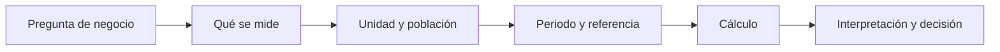
</details>

Sin población y periodo, el mismo número puede tener significado opuesto. Un incremento de 120 pedidos diarios sí exige revisar capacidad; 120 pedidos más en todo un año quizá no.

## Porcentaje, tasa y puntos porcentuales

Una **proporción** es una parte dividida entre un total compatible. Si 66 de 1.320 pedidos terminan cancelados, la tasa de cancelación es `66 / 1.320 = 5 %`. Una **tasa** relaciona dos cantidades con un denominador explícito: pedidos por hora, incidencias por 1.000 pedidos o conversiones por visita.

Si la conversión pasa de 3 % a 5 %, aumenta **2 puntos porcentuales (pp)**, porque `5 % - 3 % = 2 pp`. Relativamente aumenta `(5 - 3) / 3 = 66,7 %`. Ambas formas son correctas y responden a preguntas distintas. Nunca llames "2 %" a los 2 pp: borra la base y puede inducir a error.

### Ejemplo trabajado: ¿creció el negocio?

Nexo pasa de 1.200 a 1.320 pedidos y de 24.000 a 26.400 EUR. El valor medio por pedido es `24.000 / 1.200 = 20 EUR` ambos días. Facturación y pedidos crecen al 10 %, no porque cada pedido valga más sino porque entran más pedidos. A la vez, el tiempo de entrega aumenta 5 min, un empeoramiento absoluto de 5 min y relativo de `5 / 31 = 16,1 %`. Una presentación honesta contiene ambos lados.

## Unidades, dimensiones y conversiones

Una **dimensión** describe la clase física o lógica de una cantidad: dinero, tiempo, pedidos o personas. Solo se suman magnitudes de la misma dimensión: `24.000 EUR + 26.400 EUR` tiene sentido; `1.320 pedidos + 36 min`, no. Dividir sí crea una tasa: `1.320 pedidos / 24 horas = 55 pedidos/hora`.

Convierte antes de operar. Si una fuente usa minutos y otra segundos, `36 min = 2.160 s`. Mezclar moneda, IVA incluido/no incluido o zonas horarias produce errores que una fórmula correcta no arregla.

## Límites y errores frecuentes

- Un descenso del 20 % tras un aumento del 20 % no vuelve al origen: `100 × 1,20 × 0,80 = 96`. Los porcentajes usan bases diferentes.
- Una tasa con denominador cero no se define. No sustituyas por 0 sin marcarlo: quizá no hubo visitas o falta el dato.
- Un 100 % sobre dos observaciones puede ser poco relevante. Comunica también el numerador y denominador.
- La tasa no demuestra causa. Una conversión mayor durante una campaña no prueba que la campaña la haya causado.

## Resumen y comprobación

1. ¿Qué especificarías antes de publicar "la conversión subió"?
2. Si pasa de 8 % a 10 %, ¿cuántos pp y qué crecimiento relativo representa?
3. ¿Por qué `pedidos/día` y `pedidos totales` no responden igual a capacidad?

Continúa con [cómo resumir muchos días sin ocultar variabilidad](02-descriptiva-y-distribuciones.md).

# 02. Describir una distribución: centro, dispersión y percentiles

## Resultado observable

Podrás resumir los tiempos de entrega de Nexo sin confundir un día típico con un día problemático. Conocerás media, mediana, percentiles, rango intercuartílico (IQR) y desviación estándar; no necesitas estadística previa.

## De una lista a una pregunta operativa

Una **distribución** es el conjunto de valores que toma una variable y la frecuencia con que aparece. Nexo observa los minutos de entrega de siete pedidos: `22, 24, 25, 26, 27, 28, 80`. La lista no es cómoda para una reunión; resumirla permite responder "¿qué experiencia recibe la mayoría?" y "¿hay colas extremas?".

La **media** suma y divide por el número de valores: `232 / 7 = 33,1 min`. La **mediana** es el valor central al ordenar: `26 min`. El pedido de 80 minutos arrastra la media, pero no la mediana. Ninguno de los dos números es "el correcto" fuera de contexto: la media sirve para estimar minutos totales de capacidad; la mediana describe mejor una entrega típica cuando existen extremos.

<!-- mobile-diagram: rendered fallback -->


<details>
<summary>Ver código Mermaid editable</summary>

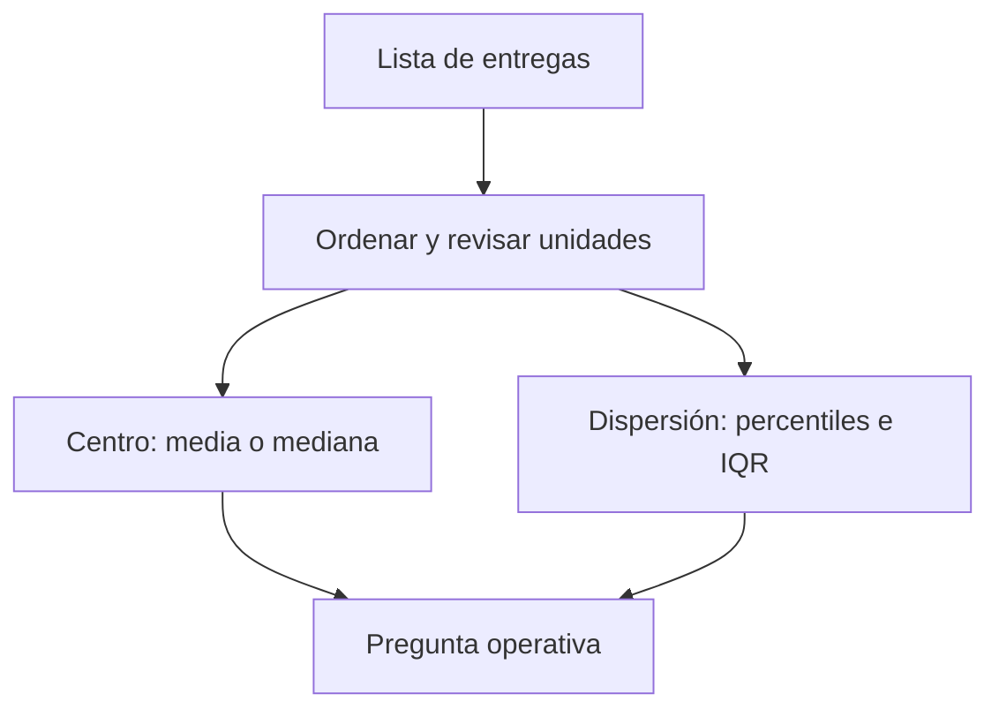
</details>

El diagrama separa dos preguntas. Un centro alto puede deberse a que todos empeoran o a unos pocos pedidos muy tardíos; la dispersión lo aclara.

## Percentiles e IQR

Un **percentil p** deja aproximadamente el `p %` de observaciones por debajo. Si el p90 de entrega es 45 min, nueve de cada diez pedidos se entregan en 45 minutos o menos; no significa que el 90 % tarde exactamente 45. El p50 coincide con la mediana. El p25 y p75 delimitan la mitad central; `IQR = p75 - p25` es el rango intercuartílico.

Para una muestra grande de Nexo, `p25=24`, `p50=29`, `p75=38`, `p90=52`. El IQR es `14 min`. Producto puede prometer una experiencia típica cercana a 29 min, mientras Operaciones investiga por qué el 10 % más lento supera 52 min. Publicar solo una media de 31 min ocultaría este riesgo.

## Desviación estándar, con cautela

La **varianza** mide la distancia media cuadrática al promedio; la **desviación estándar** es su raíz y vuelve a la unidad original. Si la media es 30 min y la desviación estándar es 2 min, los tiempos son mucho más homogéneos que con 15 min. Pero esa lectura de "media ± desviación" es especialmente interpretable si la distribución es aproximadamente simétrica y sin colas graves. En entregas con retrasos extremos, percentiles e IQR suelen comunicar mejor el servicio.

No uses un valor atípico automáticamente como error. Un pedido de 80 min puede ser una tormenta, una dirección errónea o un fallo de registro. Primero conserva su identificador, revisa la causa y decide si se analiza por separado.

## Segmentos y comparabilidad

Una distribución agregada puede mezclar centros urbanos y rurales. Si Madrid tiene mediana 26 min y una zona periférica 42 min, una mediana nacional de 29 min no responde qué debe arreglar cada equipo. Segmenta solo cuando la variable cambia la decisión, manteniendo suficientes observaciones y el mismo periodo.

## Resumen y comprobación

- Media: carga/coste promedio; sensible a extremos.
- Mediana y percentiles: experiencia típica y cola de servicio.
- IQR/desviación: variabilidad, no causalidad.

1. ¿Qué usarías para un SLA: media o p90, y por qué?
2. ¿Puede bajar la media mientras empeora p90? Describe un caso.
3. ¿Qué comprobarías antes de borrar un valor de 80 min?

La siguiente lección explica cómo resumir grupos sin dar a cada fila el mismo peso por error.

# 03. Ponderación, agregación y el grano del dato

## Objetivo

Sabrás elegir el denominador y el peso de un resumen. El **grano** indica qué representa una fila: un pedido, un día, una ciudad o un cliente. Agregar sin saberlo puede duplicar o diluir información.

## La falsa media de tasas

Nexo compara conversión por ciudad:

| Ciudad | Visitas | Pedidos | Conversión |
| --- | ---: | ---: | ---: |
| A | 100 | 15 | 15 % |
| B | 10.000 | 800 | 8 % |

La media simple `(15 % + 8 %) / 2 = 11,5 %` trata ambas ciudades como si tuvieran igual exposición. La conversión global correcta es `815 / 10.100 = 8,07 %`. Una **media ponderada** multiplica cada valor por un **peso** adecuado y divide por la suma de pesos: `(0,15×100 + 0,08×10.000) / 10.100`.

<!-- mobile-diagram: rendered fallback -->


<details>
<summary>Ver código Mermaid editable</summary>

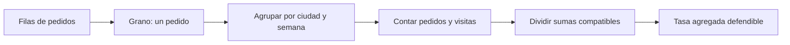
</details>

La regla práctica es sumar primero numeradores y denominadores compatibles y dividir después. Promediar porcentajes casi nunca sustituye esa operación.

## Agregar responde una pregunta nueva

De pedidos individuales a ciudad/día cambiamos de grano. El total de ingresos se suma, pero el tiempo de entrega no debe sumarse: puede promediarse o expresarse como percentil. Una tabla diaria tampoco debe unirse a una tabla por pedido sin comprobar cardinalidad; repetir una fila diaria en cada pedido multiplicaría su facturación.

Define antes: población (pedidos confirmados), filtro (sin pruebas internas), periodo (semana 20), agrupación (ciudad) y función (`sum`, `count`, `mean`, percentil). Esa especificación será después el contrato de una métrica en el bloque 10.

## Ponderar no es maquillar

El peso debe corresponder al mecanismo que se resume. Para conversión se pondera por visitas; para tiempo promedio por pedidos entregados; para una encuesta representativa pueden existir pesos muestrales definidos por investigación. Ponderar por ingresos para resumir tiempo de entrega cambia la pregunta a "tiempo medio de un euro facturado", que quizá no interesa.

### Ejemplo: media de promedios diarios

Dos días tienen 20 pedidos a 20 min y 200 pedidos a 40 min. La media simple de sus medias es 30 min; la media por pedido es `(20×20 + 200×40)/220 = 38,2 min`. Si se planifican repartidores con 30 min, faltará capacidad.

## Errores y comprobación

- Un total puede crecer porque hay más filas duplicadas, no porque hay más pedidos: compara claves únicas.
- Un promedio sin número de casos oculta su fiabilidad.
- Agregar puede ocultar diferencias de segmento; desagrega cuando cambia la acción.

1. ¿Cuál es el grano de una tabla con una fila por pedido?
2. ¿Qué peso usarías para combinar tasas de cancelación por ciudad?
3. ¿Qué función usarías para resumir ingresos y cuál para p90 de entrega?

Continúa con [funciones y modelos](04-funciones-y-modelos.md).

# 04. Funciones y modelos sencillos para decisiones

## Objetivo

Representarás una relación entre entradas y salida como una **función**: una regla que asigna una salida a cada entrada válida. Usarás esta idea para planificar capacidad sin confundir una relación observada con una causa demostrada.

## El modelo mínimo

Nexo estima minutos de trabajo de reparto como `M(p) = 24 × p`, donde `p` son pedidos y 24 es una estimación de minutos por pedido. Para 1.320 pedidos, `M(1320)=31.680 minutos`. Dividir por 480 minutos disponibles por repartidor/día da 66 repartidores-equivalentes antes de descansos e incidencias.

La entrada `p` tiene unidad pedidos; el coeficiente `24` tiene unidad minutos/pedido; la salida tiene minutos. Este chequeo dimensional detecta fórmulas absurdas.

<!-- mobile-diagram: rendered fallback -->


<details>
<summary>Ver código Mermaid editable</summary>

```mermaid
flowchart LR
  A[Pedidos previstos p] --> B[Modelo M(p)=24×p]
  B --> C[Minutos requeridos]
  C --> D[Capacidad disponible]
  D --> E{¿Hay holgura?}
  E -->|No| F[Reforzar turno o limitar demanda]
  E -->|Sí| G[Monitorizar servicio]
```
</details>

El modelo convierte una previsión en una decisión, no en una verdad. Sus supuestos deben quedar visibles.

## Pendiente, intercepto y linealidad

Una forma frecuente es `y = a + b x`. `a` es un valor base y `b` es la **pendiente**, el cambio esperado de `y` por una unidad de `x`. Si el tiempo total incluye 600 min fijos de preparación y 24 min por pedido, `M(p)=600+24p`.

La linealidad es una aproximación. Con tráfico, saturación o zonas lejanas, el minuto por pedido puede aumentar cuando crece `p`. Un modelo lineal sencillo es útil como baseline y para comunicar, pero debe contrastarse con datos y no extrapolarse fuera del rango observado.

## Funciones por tramos y reglas de negocio

Nexo cobra 2 EUR de entrega hasta 15 EUR de cesta y entrega gratis desde 15 EUR. Esto es una función por tramos: la salida depende del intervalo de la entrada. Las reglas de negocio deben documentar frontera e inclusividad (`>=15`), porque cambiar un símbolo puede afectar a miles de pedidos.

## Asociación no es causalidad

Si los pedidos y las demoras crecen juntos, puede haber saturación, pero también lluvia o una campaña. La función describe o predice una relación; no prueba que cambiar pedidos cause el efecto. Para causalidad harán falta diseño experimental o métodos del bloque 14.

## Comprobación

1. Indica unidades de cada término de `600 + 24p`.
2. ¿Qué supuesto rompería este modelo durante lluvia intensa?
3. ¿Por qué una función útil no demuestra causalidad?

En la siguiente lección aplicarás la misma regla a muchas observaciones de una vez.

# 05. Vectores, matrices y cálculo por lotes

## Objetivo y puente a NumPy

Un **vector** es una lista ordenada de números del mismo tipo conceptual; una **matriz** es una tabla rectangular de números. Estas estructuras permiten aplicar una operación a muchas filas y preparan el pensamiento vectorial de NumPy (bloque 04).

## Del pedido individual al vector

Para tres zonas, los pedidos son `p = [120, 80, 100]` y los minutos medios por pedido son `t = [22, 30, 26]`. Multiplicar componente a componente produce minutos por zona: `[2640, 2400, 2600]`; sumarlos da 7.640 minutos. El orden importa: la primera posición de ambos vectores debe representar la misma zona. Si una fuente ordena zonas distinto, el resultado parece matemático pero es falso.

<!-- mobile-diagram: rendered fallback -->


<details>
<summary>Ver código Mermaid editable</summary>

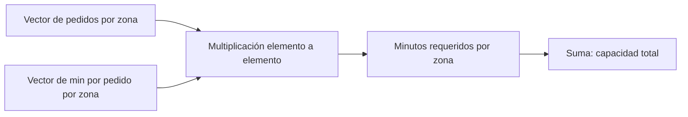
</details>

El diagrama muestra una condición oculta: las posiciones deben estar alineadas por una clave de zona, no solo por su posición.

## Matriz: varias variables o relaciones

Una matriz puede tener filas de zonas y columnas de franja horaria. Por ejemplo, la fila de Centro `[30, 45, 35]` puede representar pedidos de mañana, comida y noche. Sumar por fila responde carga por zona; sumar por columna responde carga por franja. El **eje** que se suma cambia la pregunta.

Otra matriz puede representar costes de asignar repartidores a zonas. No hace falta memorizar álgebra lineal avanzada ahora: importa comprender que una dimensión representa entidades y otra variables, y que las etiquetas deben viajar con los números.

## Operaciones seguras y límites

La **multiplicación matricial** combina filas de una matriz con columnas de otra; solo es válida si las dimensiones interiores coinciden. En la práctica, una incompatibilidad de tamaños suele avisar de que se han mezclado variables o periodos. NumPy hará estas operaciones rápido, pero no conoce el significado de las columnas.

Evita confundir multiplicación elemento a elemento con matricial. `[120,80] * [22,30]` equivale a dos productos por zona; no es un cruce de asignaciones. Comprueba forma, unidad y clave antes de automatizar.

## Comprobación

1. ¿Qué representan filas y columnas de una matriz de pedidos por zona y hora?
2. ¿Qué falla si el vector de tiempos usa un orden de zona diferente?
3. ¿Qué suma usarías para conocer carga por franja?

El [laboratorio](../../../notebooks/practicas/03-matematicas-nexo.py) reproduce estas operaciones con listas de Python.

# 06. Tiempo, granularidad, crecimiento y ventanas

## Objetivo

Sabrás definir un periodo comparable y calcular crecimiento sin mezclar días incompletos, zonas horarias ni granularidades. Una **granularidad** es el tamaño de cada intervalo: pedido, hora, día, semana o mes.

## El mismo fenómeno visto a distinta escala

Nexo registra cada pedido a las 23:30 UTC. En España puede pertenecer al día siguiente local. Antes de agrupar por día hay que fijar zona horaria y regla de corte. Después, una fila diaria puede contener total de pedidos, ingresos y p90 de entrega; una fila semanal resume siete días, pero ya no permite estudiar la hora punta.

<!-- mobile-diagram: rendered fallback -->


<details>
<summary>Ver código Mermaid editable</summary>

```mermaid
flowchart LR
  A[Eventos con hora y zona] --> B[Normalizar calendario]
  B --> C[Elegir grano: hora, día o semana]
  C --> D[Agregar con función adecuada]
  D --> E[Comparar periodos equivalentes]
  E --> F[Decisión]
```
</details>

La ventana temporal es parte de la definición de una métrica. Cambiarla cambia el valor y, con frecuencia, la conclusión.

## Crecimiento: base y periodo

El crecimiento intersemanal de 10.000 a 11.000 pedidos es 10 %. Para comparar demanda con patrón semanal, lunes contra lunes suele ser más justo que lunes contra domingo. Para campañas estacionales, conviene comparar con el mismo periodo del año anterior. En periodos largos, el crecimiento acumulado no se reparte linealmente: de 100 a 121 en dos meses equivale a 21 % total, no dos meses de 21 %.

Una **ventana móvil** resume los últimos `k` periodos. La media móvil de 7 días suaviza oscilaciones diarias, pero retrasa la detección de un cambio brusco. No uses datos futuros en una ventana destinada a una decisión de hoy; eso sería fuga de información y se trata a fondo en series temporales.

## Datos faltantes, ceros y días parciales

Un cero puede significar que no hubo pedidos; un valor ausente puede significar que el tracking falló. Son casos diferentes. Tampoco compares un día completo con el día actual a las 10:00. Etiqueta cobertura, fecha de extracción y definición de día antes de afirmar que cae la demanda.

## Resumen y comprobación

- El grano controla qué patrones se pueden observar.
- Una comparación exige poblaciones y ventanas equivalentes.
- Una media móvil reduce ruido y añade retraso.

1. ¿Qué perderías al pasar de pedidos por hora a pedidos semanales?
2. ¿Por qué el día actual puede parecer una caída artificial?
3. ¿Qué comparación harías para un lunes posterior a un festivo?

Resuelve ahora el [caso integrador](../../../ejercicios/temario-03/aplicacion/caso-nexo-capacidad.md).

# Bloque 04 - NumPy y cálculo vectorizado

## Propósito

En este bloque Leo trabaja con el caso continuo de **NexoCloud**, una aplicación que registra para cada día las solicitudes resueltas, los minutos de respuesta y el canal de entrada. NumPy es una biblioteca de Python para guardar números en un **array** y calcular con muchos valores de una vez. No sustituye a saber qué mide cada número: hace más segura y breve la parte repetitiva cuando el significado ya está definido.

Al terminar podrás transformar una matriz de métricas operativas, seleccionar observaciones, detectar valores faltantes y explicar qué dimensión representa cada resultado. Es la base numérica sobre la que el bloque 05 construirá tablas con nombres de columnas usando Pandas.

## Resultados observables

- Crear arrays, leer su `dtype`, `ndim`, `shape` y tamaño sin confundirlos con su significado de negocio.
- Aplicar operaciones vectorizadas y reducciones por eje, comprobando unidades y denominadores.
- Extraer subconjuntos con índices, cortes y máscaras booleanas sin desalinear datos.
- Usar broadcasting conscientemente y reconocer el error de forma antes de que propague una regla equivocada.
- Tratar `NaN`, distinguir una vista de una copia y reproducir una simulación sencilla.

## Prerrequisitos y forma de trabajo

Se asume el vocabulario básico de Python del bloque 02: variable, lista, función y error. No se asume experiencia previa con bibliotecas. Puedes leer todo desde el móvil; para ejecutar el laboratorio usa un navegador con Google Colab o un entorno Python remoto. El script está en [notebooks/practicas/04-operaciones-nexocloud.py](../../notebooks/practicas/04-operaciones-nexocloud.py).

## Mapa del caso

La pregunta es: «¿qué canal requiere atención esta semana sin confundir días, métricas o datos ausentes?».

```mermaid
flowchart LR
  A[Registros diarios de NexoCloud] --> B[Array con filas: días]
  B --> C[Columnas: resueltos y minutos]
  C --> D[Filtrar y resumir]
  D --> E[Decisión operativa explicable]
```

El array contiene posición; el diccionario de métricas del caso aporta significado. Mantendremos ambos durante todo el bloque.

## Lecciones

1. [Arrays, tipos y cálculo vectorizado](lecciones/01-arrays-y-vectorizacion.md)
2. [Forma, ejes e indexación](lecciones/02-seleccion-mascaras-y-forma.md)
3. [Máscaras, valores ausentes y copias](lecciones/03-mascaras-nan-y-copias.md)
4. [Broadcasting y reglas por canal](lecciones/04-broadcasting-y-reglas-por-canal.md)
5. [Simulación, reproducibilidad y laboratorio](lecciones/05-simulacion-y-laboratorio.md)

## Práctica evaluable

Resuelve el [diagnóstico operativo de NexoCloud](../../ejercicios/temario-04/diagnostico-operativo-nexocloud.md) antes de consultar la [solución razonada](../../soluciones/temario-04/diagnostico-operativo-nexocloud.md). La práctica no pide memorizar sintaxis: pide justificar formas, filtros, datos faltantes y una recomendación.

# Arrays, tipos y cálculo vectorizado

## Objetivos y prerrequisitos

Al terminar sabrás convertir valores numéricos en un array, comprobar el tipo que NumPy ha elegido y aplicar una misma regla a todos los valores. Necesitas conocer variables y listas de Python. Un **dato** es un valor que describe algo; una **colección** agrupa varios valores. NumPy resulta útil cuando esa colección tiene una estructura numérica conocida.

## El problema antes del nombre técnico

NexoCloud cerró 5, 8 y 6 solicitudes en sus tres primeros días de una prueba. Para calcular la carga total no hace falta recorrer cada número manualmente:

```python
solicitudes = [5, 8, 6]
```

Una lista es flexible: puede mezclar texto, números y otros objetos. Para cálculo científico conviene una estructura homogénea. Un **array de NumPy** (`numpy.ndarray`) es un bloque ordenado de elementos, normalmente de un tipo compatible, sobre el que las operaciones aritméticas se aplican elemento a elemento.

```python
import numpy as np

resueltas = np.array([5, 8, 6], dtype=np.int64)
minutos = np.array([42.5, 51.0, 47.5], dtype=float)
print(resueltas.dtype)  # int64: enteros
print(minutos.dtype)    # float64: números con decimales
```

`dtype` significa *data type*, el tipo con que el array guarda sus elementos. No es una etiqueta de negocio: `float64` no dice si 42.5 son euros, minutos o usuarios. Esa unidad debe documentarse fuera del array.

## Vectorizar: una regla, muchos elementos

Supón que el equipo quiere convertir minutos a horas para comparar el esfuerzo diario. La **vectorización** aplica una operación a cada posición correspondiente sin escribir un bucle explícito:

```python
horas = minutos / 60
objetivo_minutos = np.array([45.0, 45.0, 45.0])
desviacion = minutos - objetivo_minutos
```

El resultado de `minutos / 60` conserva tres posiciones. La tercera línea compara día con día porque los arrays tienen la misma longitud y el mismo orden. Es más fácil revisar «esta regla se aplica a todos los días» que repetir una instrucción manual por cada valor.

Este diagrama responde a «¿qué tiene que seguir siendo cierto para que una operación vectorizada signifique lo que creemos?»:

<!-- mobile-diagram: rendered fallback -->


<details>
<summary>Ver código Mermaid editable</summary>

```mermaid
flowchart LR
  A[Array de minutos por día] --> B[Regla: dividir entre 60]
  B --> C[Horas por día]
  C --> D[Resumen o decisión]
  E[Unidad y orden documentados] --> B
```
</details>

La flecha desde unidad y orden no es decorativa: sin ellos el cálculo puede ejecutarse y seguir siendo analíticamente falso.

## Reducciones: de muchos valores a un resumen

Una **reducción** resume varias posiciones en un resultado. `sum`, `mean`, `min` y `max` son comunes:

```python
total = resueltas.sum()       # 19 solicitudes
media = minutos.mean()        # 47.0 minutos
peor_dia = minutos.max()      # 51.0 minutos
```

La media no demuestra que cada cliente espere 47 minutos. Es una descripción de esos tres días y puede ocultar picos. Antes de comunicar «el servicio tarda 47 minutos», define el período, la población incluida y si una media es la medida adecuada.

## Conversión y pérdida de información

NumPy intenta encontrar un tipo común. Si introduces un decimal entre enteros, puede convertir todo el array a `float`; si introduces texto, puede convertir los números en texto. Forzar un tipo también puede perder información:

```python
np.array([42.9, 51.0], dtype=int)  # array([42, 51]); trunca, no redondea
```

No uses esta conversión para «limpiar» datos sin investigarlos. Truncar minutos puede sesgar un promedio y convertir identificadores como `"0012"` a entero puede borrar ceros significativos. Un identificador no es una magnitud para sumar.

## Resumen y comprobación

- Un array organiza valores con forma y tipo; la unidad de negocio no viaja sola en `dtype`.
- Vectorizar aplica una regla a cada elemento; presupone orden, unidad y población compatibles.
- Las reducciones resumen, pero no explican por sí solas la distribución.

Comprueba: ¿por qué `np.array([1, "2"])` es peligroso para una suma? ¿Qué hipótesis estás haciendo al restar dos arrays de igual longitud? En la siguiente lección verás cómo expresar qué representa cada dimensión.

# Forma, ejes e indexación

## Objetivos y prerrequisitos

Aprenderás a leer una matriz como filas y columnas, resumir por la dirección correcta y seleccionar posiciones sin alterar su significado. Requiere arrays y operaciones vectorizadas del tema anterior.

## Una matriz necesita un contrato

Una lista de números no indica por sí sola qué representa cada posición. En NexoCloud registraremos cuatro días (filas) y tres canales (columnas: web, chat y correo). Cada celda es el número de solicitudes resueltas ese día por ese canal:

```python
import numpy as np

canales = np.array(["web", "chat", "correo"])
resueltas = np.array([
    [12, 8, 4],
    [15, 7, 5],
    [11, 9, 6],
    [13, 10, 4],
])
print(resueltas.shape)  # (4, 3): 4 días, 3 canales
print(resueltas.ndim)   # 2 dimensiones
```

`shape` es una tupla que enumera el tamaño de cada dimensión. No dice «días» ni «canales»: eso es parte del contrato que acabamos de escribir. Una matriz con forma `(4, 3)` también podría significar cuatro tiendas y tres productos. `ndim` cuenta dimensiones y `size` cuenta celdas: aquí `4 * 3 = 12`.

## Ejes: resumir hacia una dirección

En una matriz bidimensional, `axis=0` reduce las filas y conserva columnas; `axis=1` reduce las columnas y conserva filas. Es más seguro describirlo como «lo que queda» que memorizar una frase:

```python
por_canal = resueltas.sum(axis=0)  # [51, 34, 19], un total por canal
por_dia = resueltas.sum(axis=1)    # [24, 27, 26, 27], un total por día
```

La relación visual responde a «¿qué etiqueta conserva cada suma?»:

<!-- mobile-diagram: rendered fallback -->


<details>
<summary>Ver código Mermaid editable</summary>

```mermaid
flowchart TB
  A[Matriz: días por canales] --> B[sum axis=0]
  B --> C[Un total por canal]
  A --> D[sum axis=1]
  D --> E[Un total por día]
```
</details>

`axis=0` no significa «mejor» ni «vertical» en abstracto; solo resulta correcto porque el contrato asignó filas a días y columnas a canales. Verifica la forma del resultado antes de asignarle un nombre.

## Índices y cortes

Python empieza a contar en cero. La sintaxis `[fila, columna]` selecciona una celda; los cortes `inicio:fin` incluyen el inicio y excluyen el final:

```python
primer_dia = resueltas[0, :]   # [12, 8, 4]
chat = resueltas[:, 1]         # [8, 7, 9, 10]
dos_primeros_dias = resueltas[:2, :]
```

La posición `1` solo significa chat porque `canales[1]` lo documenta. Si se reordena `canales` sin reordenar las columnas, el código seguirá funcionando y la conclusión será errónea. En tablas de producción, Pandas reduce este riesgo al usar etiquetas; aun así hay que validar las claves.

## Error habitual: forma válida, comparación inválida

Dos arrays pueden tener misma forma y referirse a períodos distintos. Restar las solicitudes de lunes a jueves a las de viernes a lunes entrega cuatro números, pero no mide una evolución comparable si los días no representan la misma condición. La forma comprueba compatibilidad técnica; no comprueba comparabilidad de negocio.

## Resumen y comprobación

- Documenta qué representa cada dimensión antes de usar `shape`.
- `axis=0` devuelve una medida por columna; `axis=1`, una medida por fila en este contrato.
- Los índices son posiciones, no etiquetas con significado propio.

Pregunta: si `resueltas.mean(axis=0)` tiene forma `(3,)`, ¿qué representa cada resultado? Continúa con máscaras para seleccionar por una condición explícita.

# Máscaras, valores ausentes y copias

## Objetivos y prerrequisitos

Sabrás construir una condición, usarla para seleccionar datos, reconocer un valor ausente y evitar modificar un array por accidente. Requiere entender `shape`, índices y operaciones de comparación.

## De una pregunta a una máscara

La responsable de soporte pregunta: «¿qué días superaron 50 minutos medios en chat?». Una **máscara booleana** es un array de `True` y `False`, uno por valor, que expresa esa pregunta:

```python
chat_minutos = np.array([48.0, 55.0, 51.0, 43.0])
supera_objetivo = chat_minutos > 50
print(supera_objetivo)          # [False, True, True, False]
print(chat_minutos[supera_objetivo])  # [55., 51.]
```

El umbral de 50 no lo inventa NumPy. Debe proceder de un acuerdo de nivel de servicio, un objetivo o una hipótesis explícita. Cambiarlo a 45 cambia la población seleccionada y, por tanto, la historia que se cuenta.

Para combinar requisitos usa `&` (y) y `|` (o), siempre entre paréntesis:

```python
es_lento = chat_minutos > 50
es_critico = chat_minutos >= 60
revisar = es_lento & ~es_critico
```

No escribas `es_lento and es_critico`: `and` pregunta por el array completo y no representa una comparación elemento a elemento.

## Ausencia no es cero

Un **valor ausente** significa que no conocemos o no recibimos el valor. En datos numéricos NumPy suele representarlo con `np.nan` (*not a number*). No equivale a cero: cero minutos sería una medida real que hay que interpretar; `NaN` dice que no hay medida utilizable.

```python
tiempo_chat = np.array([48.0, np.nan, 51.0, 43.0])
print(np.isnan(tiempo_chat))       # identifica el hueco
print(np.mean(tiempo_chat))        # nan: la ausencia se propaga
print(np.nanmean(tiempo_chat))     # 47.33..., ignora NaN
```

`np.nanmean` puede ser apropiado para un resumen exploratorio, pero no «arregla» el problema. Primero pregunta por qué faltó la medición: ¿falló el tracking, no hubo conversaciones o se retrasó la carga? Si los días de más tráfico son precisamente los ausentes, ignorarlos sesga el resultado.

## Vista frente a copia: una modificación con consecuencias

Un corte básico suele devolver una **vista**: comparte memoria con el array original. Una copia tiene memoria propia. La diferencia importa cuando limpias o pruebas transformaciones:

```python
original = np.array([48.0, 55.0, 51.0, 43.0])
vista = original[:2]
vista[0] = 999.0
print(original[0])  # 999.0: la vista modificó el original

seguro = original.copy()
seguro[0] = 48.0    # solo cambia seguro
```

No dependas de recordar todas las reglas de indexación avanzada. Si vas a alterar valores para una prueba o una imputación, llama explícitamente a `.copy()` y conserva el origen. Esto permite repetir la auditoría.

## Flujo de decisión para un dato sospechoso

<!-- mobile-diagram: rendered fallback -->


<details>
<summary>Ver código Mermaid editable</summary>

```mermaid
flowchart TD
  A[Valor de tiempo] --> B[¿Es NaN?]
  B -->|Sí| C[Investigar causa y cobertura]
  C --> G[Abrir incidencia de calidad]
  B -->|No| D[¿Supera umbral acordado?]
  D -->|Sí| E[Incluir en revisión]
  D -->|No| F[Conservar y documentar]
```
</details>

El flujo separa ausencia de rendimiento bajo: sustituir ambos por cero convertiría problemas distintos en el mismo número.

## Resumen y comprobación

- Una máscara deja visible el criterio de selección; valida su longitud y procedencia.
- `NaN` es desconocido, no un cero conveniente.
- Copia antes de modificar datos para análisis; documenta cualquier regla de tratamiento.

¿Qué respuesta adicional pedirías antes de usar `np.nanmean` para informar a dirección? En la siguiente lección aplicarás reglas distintas por canal sin duplicar la matriz.

# Broadcasting y reglas por canal

## Objetivos y prerrequisitos

Aprenderás cuándo NumPy puede combinar dimensiones de forma segura y cómo detectar una regla aplicada sobre el eje equivocado. Requiere matrices, `shape` y operaciones vectorizadas.

## La necesidad: un objetivo distinto para cada canal

NexoCloud pacta objetivos de respuesta diferentes: web 40 minutos, chat 45 y correo 120. Los tiempos diarios tienen forma `(días, canales)`; el objetivo tiene forma `(canales,)`:

```python
tiempos = np.array([
    [38.0, 52.0, 110.0],
    [41.0, 43.0, 130.0],
    [44.0, 47.0, 115.0],
])
objetivos = np.array([40.0, 45.0, 120.0])
desviacion = tiempos - objetivos
```

**Broadcasting** es el conjunto de reglas por el que NumPy alinea dimensiones compatibles. Aquí interpreta `objetivos` como una fila que puede usarse para cada día, sin que tengas que crear manualmente tres copias. El resultado `(3, 3)` conserva una desviación por día y canal.

La pregunta es «¿qué objetivo se resta de cada celda?»:

<!-- mobile-diagram: rendered fallback -->


<details>
<summary>Ver código Mermaid editable</summary>

```mermaid
flowchart LR
  A[Matriz días x canales] --> C[Restar por columnas]
  B[Vector: objetivo por canal] --> C
  C --> D[Matriz: desviación por día y canal]
```
</details>

Cada columna recibe su objetivo. No se está calculando todavía la causa de las demoras: solo una diferencia respecto a una referencia acordada.

## Compatibilidad, no telepatía

NumPy compara dimensiones desde el final. Son compatibles si son iguales o una vale 1. Por eso `(3, 3)` y `(3,)` funcionan. En cambio, un vector de tres objetivos de día podría tener también forma `(3,)`; NumPy no puede saber si representa días o canales. Si ambos tamaños coinciden, el código puede ejecutarse sobre el eje incorrecto.

Cuando el significado sea «un valor por fila», haz la orientación visible con `[:, np.newaxis]`:

```python
factor_por_dia = np.array([1.0, 1.1, 0.9])[:, np.newaxis]  # forma (3, 1)
ajustado = tiempos * factor_por_dia
```

`np.newaxis` agrega una dimensión de tamaño uno. No crea conocimiento de negocio; hace explícita la intención de multiplicar cada fila por su factor.

## Error habitual: confundir eficiencia con corrección

Broadcasting ahorra código, pero puede amplificar un supuesto erróneo. Aplicar un factor de campaña a todos los canales cuando solo afectó a web produce números plausibles y falsos. Antes de ejecutar, escribe el contrato: forma, unidades, orden de canales y período de validez de la regla.

## Resumen y comprobación

- Broadcasting combina dimensiones compatibles; no decide qué dimensión tiene sentido.
- Un vector `(canales,)` se alinea con la última dimensión de `(días, canales)`.
- Usa `(días, 1)` para declarar una regla por fila y verifica el resultado.

¿Qué `shape` debería tener una tasa distinta para cada día y canal? Respuesta: `(días, canales)`, salvo que una regla común esté justificada.

# Simulación, reproducibilidad y laboratorio

## Objetivos y prerrequisitos

Aplicarás el caso NexoCloud de principio a fin y sabrás para qué sirve fijar una semilla aleatoria. Requiere máscaras, `NaN`, ejes y broadcasting.

## Simular no es observar

Una simulación crea datos artificiales según reglas elegidas. Sirve para practicar, explorar escenarios y comprobar código cuando aún no tienes acceso a producción. No permite afirmar que clientes reales se comportaron así: esa afirmación requeriría datos observados y evaluación de calidad.

```python
generador = np.random.default_rng(2026)
ruido = generador.normal(loc=0, scale=4, size=(7, 3))
```

La **semilla** `2026` inicializa el generador de forma repetible: otra persona que ejecute las mismas instrucciones obtiene el mismo ruido. No convierte la simulación en verdadera ni debe reutilizarse como mecanismo de seguridad.

## Laboratorio: responder una pregunta operativa

El script [04-operaciones-nexocloud.py](../../../notebooks/practicas/04-operaciones-nexocloud.py) construye siete días de tiempos medios, incorpora un dato ausente y contesta:

1. ¿Qué días y canales superaron su objetivo?
2. ¿Qué media por canal puede calcularse sin ocultar la cobertura?
3. ¿Qué canal merece una revisión y qué dato faltante debe investigarse?

Antes de ejecutar, predice la forma de `tiempos`, `objetivos` y `desviacion`. Después compara tu predicción con la salida. Un análisis reproducible deja visibles los datos de entrada, la semilla si se usa, las transformaciones y las decisiones; no solo un número final.

## Una recomendación responsable

Si `chat` supera el objetivo en varios días, una recomendación inicial podría ser «revisar capacidad y clasificación de conversaciones de chat». No sería correcto afirmar que falta personal solo por esa matriz: pueden intervenir severidad, cambios de tracking, mezcla de casos o fallos de medición. NumPy prepara la evidencia numérica; la investigación operativa exige contexto.

## Cierre

Has pasado de valores sueltos a una matriz con contrato, filtros, valores ausentes y reglas por canal. Resuelve ahora el [ejercicio aplicado](../../../ejercicios/temario-04/diagnostico-operativo-nexocloud.md). El bloque 05 trasladará este razonamiento a datos tabulares con columnas y claves.

# Bloque 05 - Pandas: datos tabulares fiables

## Propósito

Una empresa no necesita que alguien «limpie un Excel»: necesita poder responder, sin cambiar la respuesta cada vez, cuántos pedidos válidos hubo, qué ingresos representan y qué información falta. En este bloque Leo trabaja como analista de **Nébula**, una aplicación de suscripción que vende complementos. Recibirá exportaciones de pedidos y clientes, construirá una tabla analítica y dejará evidencia de cada decisión.

Pandas es una biblioteca de Python para trabajar con tablas. No decide qué dato es correcto: convierte reglas de negocio explícitas en transformaciones repetibles y comprobaciones que pueden fallar.

## Resultado de salida y prerrequisitos

Al terminar podrás cargar un CSV realista, diagnosticarlo, limpiarlo sin perder el original, combinarlo con clientes y publicar una tabla de ingresos por canal reconciliada con el detalle. Necesitas los conceptos de fila, columna, clave, nulo y Python básico de los bloques 01 y 02.

El caso usa los archivos [pedidos_nebula.csv](../../datasets/pandas/pedidos_nebula.csv) y [clientes_nebula.csv](../../datasets/pandas/clientes_nebula.csv). Son pequeños deliberadamente: permiten inspeccionar cada anomalía antes de automatizarla.

## Itinerario

1. [Importar y perfilar una tabla](lecciones/01-dataframes-importacion-y-perfilado.md)
2. [Seleccionar, tipar y limpiar sin ocultar pérdidas](lecciones/02-seleccion-tipos-y-limpieza.md)
3. [Transformar, agrupar y reconciliar una métrica](lecciones/03-transformacion-y-agregacion.md)
4. [Unir tablas y proteger la cardinalidad](lecciones/04-uniones-y-cardinalidad.md)
5. [Contrato de datos, validación y linaje](lecciones/05-validacion-y-trazabilidad.md)
6. [Laboratorio: pipeline de pedidos de Nébula](lecciones/06-caso-integrado-pedidos.md)

## Práctica

Primero ejecuta el [laboratorio reproducible](../../notebooks/practicas/05-pipeline-pedidos-nebula.py). Después resuelve [la auditoría de pedidos](../../ejercicios/temario-05/aplicacion/auditoria-pedidos-nebula.md) sin mirar la [solución razonada](../../soluciones/temario-05/auditoria-pedidos-nebula.md).

## Documentación primaria

- [Pandas: lectura de CSV](https://pandas.pydata.org/docs/reference/api/pandas.read_csv.html)
- [Pandas: merge, join y compare](https://pandas.pydata.org/docs/user_guide/merging.html)
- [Pandas: Copy-on-Write](https://pandas.pydata.org/docs/user_guide/copy_on_write.html)

# 01 - Importar y perfilar una tabla

## Objetivo y prerrequisitos

Al terminar podrás explicar qué representa una fila de un CSV, cargarla con parámetros deliberados y producir un perfil inicial antes de calcular una métrica. Requiere saber que una tabla tiene filas y columnas.

## Del archivo a una tabla en memoria

Imagina un archivo de texto con estas dos líneas:

```text
pedido_id;fecha_pedido;importe_bruto
P-1001;2026-06-03;29,90
```

Un **CSV** es un archivo de texto que separa valores; su nombre histórico dice «comma-separated», pero aquí el separador es `;`. No lleva una garantía de tipos: `29,90` llega como caracteres, no como dinero. Un **DataFrame** es la tabla que Pandas mantiene en memoria; una **Series** es una sola columna, con un valor por fila y un índice que identifica su posición.

En Nébula una fila de `pedidos_nebula.csv` pretende representar **un pedido creado**. Esa frase es el *grano*: si una fila fuese una línea de producto, sumar importes o contar pedidos cambiaría de significado.

```python
from pathlib import Path
import pandas as pd

datos = Path("datasets/pandas")
pedidos_raw = pd.read_csv(
    datos / "pedidos_nebula.csv",
    sep=";",
    encoding="utf-8",
    na_values=["", "NA", "sin dato"],
    dtype={"pedido_id": "string", "cliente_id": "string", "canal": "string"},
)
```

`dtype` protege identificadores: un ID no es una cantidad y no se debe convertir en número. Las fechas y los importes se convertirán después, de forma visible, porque primero interesa descubrir qué valores no cumplen el formato.

El diagrama responde a «¿qué debo saber antes de transformar una exportación?»:

<!-- mobile-diagram: rendered fallback -->


<details>
<summary>Ver código Mermaid editable</summary>

```mermaid
flowchart LR
 A[Archivo CSV] --> B[Parámetros de lectura]
 B --> C[DataFrame raw]
 C --> D[Grano y diccionario]
 C --> E[Tipos y nulos]
 C --> F[Claves y duplicados]
 D --> G[Decisiones de limpieza]
 E --> G
 F --> G
```
</details>

La importación no es todavía limpieza. Produce una versión `raw` que se conserva para poder explicar de dónde salió cualquier fila descartada.

## Perfil mínimo que evita errores caros

Antes de preguntar «¿qué canal vende más?» pregunta qué llegó:

```python
print(pedidos_raw.head(3))
print(pedidos_raw.shape)
print(pedidos_raw.dtypes)
print(pedidos_raw.isna().sum())
print(pedidos_raw["pedido_id"].duplicated().sum())
print(pedidos_raw["estado"].value_counts(dropna=False))
```

`head()` ofrece ejemplos, no prueba calidad. `shape` permite detectar una carga incompleta. `isna().sum()` cuenta ausencias por columna. `value_counts(dropna=False)` muestra tanto categorías inesperadas como nulos; sin `dropna=False` podríamos no ver que falta un estado.

Un perfil profesional también define un pequeño diccionario: `pedido_id` es la clave esperada, `fecha_pedido` es la fecha de creación en UTC, `importe_bruto` está en EUR y `estado` decide si el pedido entra en ingresos. No basta con que los nombres «suenen bien».

## Error habitual y límite

Un error frecuente es usar `pd.read_csv("pedidos.csv")` y continuar porque no dio excepción. Si el fichero usa `;`, Pandas puede construir una sola columna enorme; si usa coma decimal, el importe puede quedar como texto. La carga técnicamente correcta no demuestra que la semántica sea correcta.

Otra falsa seguridad es hacer `parse_dates` y asumir que todo se interpretó. En datos no estándar o mezclados es preferible convertir luego con `pd.to_datetime(..., errors="coerce")`, medir los fallos y decidir qué hacer con ellos.

## Resumen y comprobación

- CSV describe una forma de separar texto; DataFrame es la tabla en memoria.
- Grano, clave y unidades se declaran antes de agregar.
- El perfil mide lo que llegó; no lo corrige a escondidas.

1. ¿Por qué `pedido_id` debe leerse como texto aunque contenga dígitos?
2. Si aparecen 500 filas en lugar de 50 000, ¿qué comprobarías antes de concluir que hubo menos pedidos?

Sigue con [selección, tipos y limpieza](02-seleccion-tipos-y-limpieza.md).

# 02 - Seleccionar, tipar y limpiar sin ocultar pérdidas

## Objetivo y prerrequisitos

Transformarás el extracto de Nébula en una tabla utilizable sin confundir una corrección técnica con una decisión de negocio. Partimos del DataFrame `pedidos_raw` de la lección anterior.

## Seleccionar es formular una condición

`pedidos["canal"]` devuelve una Series. `pedidos[["pedido_id", "canal"]]` conserva un DataFrame. Para seleccionar con intención hay dos herramientas: `loc` usa etiquetas y una condición; `iloc` usa posiciones numéricas para inspección, no para reglas de negocio.

```python
pedidos = pedidos_raw.copy()
pagados = pedidos.loc[pedidos["estado"].eq("pagado")].copy()
ejemplo = pedidos.iloc[:3, :4]
```

La máscara `pedidos["estado"].eq("pagado")` es una Serie de `True`/`False`, una respuesta por fila. Antes de filtrar, cuenta los estados. «Pagado» no equivale siempre a «cobrado», «facturado» ni «sin devolución»: aquí es una definición operativa que debe figurar en el contrato.

## Tipos, fechas y nulos: convertir sin inventar

Los tipos (`dtypes`) determinan qué operaciones son válidas. Para Nébula la fecha llega como texto y el importe usa coma decimal:

```python
pedidos["fecha_pedido"] = pd.to_datetime(
    pedidos["fecha_pedido"], format="%Y-%m-%d", errors="coerce", utc=True
)
pedidos["importe_bruto"] = pd.to_numeric(
    pedidos["importe_bruto"].str.replace(",", ".", regex=False), errors="coerce"
)
pedidos["descuento"] = pd.to_numeric(
    pedidos["descuento"].str.replace(",", ".", regex=False), errors="coerce"
).fillna(0)
```

`errors="coerce"` convierte una conversión imposible en ausente (`NaN` o `NaT`); es una alarma medible, no una reparación. Por ejemplo, una fecha inválida no debe convertirse silenciosamente en la fecha de hoy. Después clasificamos el motivo y conservamos las filas rechazadas:

```python
es_valido = (
    pedidos["pedido_id"].notna()
    & pedidos["fecha_pedido"].notna()
    & pedidos["importe_bruto"].ge(0)
    & pedidos["canal"].isin(["web", "app", "partner"])
)
rechazos = pedidos.loc[~es_valido].assign(motivo="regla_basica")
pedidos_validos = pedidos.loc[es_valido].copy()
```

## Copias y duplicados tienen significado

`copy()` comunica que el resultado será una tabla independiente. Evita modificar de manera inesperada un subconjunto de `pedidos_raw` y evita depender de comportamientos de vista/copia que han evolucionado en Pandas. La regla práctica: conserva `raw`, crea pasos con nombres y asigna con `.loc` sobre el DataFrame que posees.

Un **duplicado técnico** es una fila idéntica repetida por una exportación. Un **duplicado de negocio** son dos filas que comparten `pedido_id` aunque otro campo cambie; puede representar reintento, corrección o corrupción. No se tratan igual:

```python
duplicados_tecnicos = pedidos.duplicated(keep=False)
duplicados_negocio = pedidos.duplicated("pedido_id", keep=False)
print(pedidos.loc[duplicados_negocio].sort_values("pedido_id"))
```

Eliminar con `drop_duplicates("pedido_id")` sin inspección puede quedarse con la primera versión arbitraria. En el laboratorio se conserva la fila más reciente por `fecha_extraccion`, una regla que debe validarse con el área dueña de la fuente.

## Resumen y comprobación

- `loc` expresa reglas con nombres; `iloc` inspecciona posiciones.
- Convertir con `coerce` hace visibles los errores; no equivale a aceptar la fila.
- `raw`, tabla válida y rechazos son artefactos distintos que permiten auditar.

1. ¿Qué información perderías al ejecutar `dropna()` sobre toda la tabla?
2. ¿Por qué dos filas con el mismo `pedido_id` requieren una conversación de negocio antes de eliminarlas?

Sigue con [transformación y agregación](03-transformacion-y-agregacion.md).

# 03 - Transformar, agrupar y reconciliar una métrica

## Objetivo y prerrequisitos

Construirás ingresos netos por canal sin perder la relación con cada pedido. Requiere una tabla de pedidos válida y saber que el grano actual es un pedido.

## Una columna derivada es una regla, no una fórmula suelta

Nébula quiere ingresos netos de pedidos pagados. El contrato acordado es: importe bruto menos descuento, en EUR, por pedido creado en junio; no representa margen ni ingresos tras devoluciones futuras.

```python
pedidos_validos = pedidos_validos.assign(
    importe_neto=lambda tabla: tabla["importe_bruto"] - tabla["descuento"]
)
assert pedidos_validos["importe_neto"].ge(0).all()
```

`assign` devuelve una nueva tabla y el `lambda` deja claro que la regla usa las columnas de esa misma tabla. El `assert` verifica un supuesto; si falla, debemos mirar las filas, no cambiar el umbral para que el programa continúe.

## De detalle a resumen sin cambiar el denominador

`groupby` reúne filas con el mismo valor de una clave de agrupación. Después `agg` define con nombre qué resume cada columna:

```python
por_canal = (
    pedidos_validos.groupby("canal", as_index=False)
    .agg(
        pedidos=("pedido_id", "nunique"),
        ingresos_netos=("importe_neto", "sum"),
        ticket_medio=("importe_neto", "mean"),
    )
    .sort_values("ingresos_netos", ascending=False)
)
```

`nunique` cuenta pedidos distintos; `count` cuenta valores no nulos y `size` cuenta filas. Si aún hubiese dos registros para un pedido, `size` inflaría el volumen. El promedio no debe viajar solo: un canal con un único pedido caro puede tener el mayor ticket y aportar poco al total.

Este flujo responde a «¿cómo sé que el resumen no perdió o duplicó dinero?»:

<!-- mobile-diagram: rendered fallback -->


<details>
<summary>Ver código Mermaid editable</summary>

```mermaid
flowchart LR
 A[Pedidos válidos] --> B[Regla importe neto]
 B --> C[Agrupar por canal]
 C --> D[Tabla resumen]
 B --> E[Total detalle]
 D --> F[Total resumen]
 E --> G[Reconciliar]
 F --> G
```
</details>

La reconciliación compara dos caminos que deberían coincidir:

```python
total_detalle = pedidos_validos["importe_neto"].sum()
total_resumen = por_canal["ingresos_netos"].sum()
assert total_detalle == total_resumen
```

En importes con muchos decimales se usaría `math.isclose`, porque la representación binaria de `float` puede introducir diferencias minúsculas. Para facturación real, la unidad monetaria y el redondeo se acuerdan con finanzas; no se resuelven solo con Python.

## Error habitual y pregunta analítica

Agrupar por canal responde una pregunta descriptiva: «¿cómo se distribuyen los ingresos observados?». No demuestra que el canal haya causado la venta: web, app y partner pueden atraer clientes distintos. También puede ocultar país, campaña o periodo; por eso una segunda agrupación debe añadir una hipótesis, no columnas por costumbre.

## Resumen y comprobación

- Una medida derivada lleva definición, unidad, población y límite.
- La función de conteo debe coincidir con el grano.
- Reconciliar es comparar el detalle con el resumen antes de publicar.

1. ¿Cuándo usarías `size` en lugar de `nunique`?
2. ¿Por qué la igualdad entre totales no demuestra por sí sola que los estados incluidos sean correctos?

Sigue con [uniones y cardinalidad](04-uniones-y-cardinalidad.md).

# 04 - Unir tablas y proteger la cardinalidad

## Objetivo y prerrequisitos

Enriquecerás pedidos con el segmento de cliente sin multiplicar ingresos por accidente. Requiere conocer clave, grano y el resumen de la lección anterior.

## La pregunta que precede a `merge`

`pedidos` contiene muchos pedidos por `cliente_id`; `clientes` debe contener una sola ficha vigente por cliente. Por tanto, la relación esperada es **muchos a uno**: muchos pedidos encuentran un cliente. Una unión combina columnas mediante una clave; no es una prueba de que la clave represente a la misma persona en ambos sistemas.

<!-- mobile-diagram: rendered fallback -->


<details>
<summary>Ver código Mermaid editable</summary>

```mermaid
flowchart LR
 A[Pedidos: muchos por cliente] --> C[cliente_id]
 B[Clientes: una ficha por cliente] --> C
 C --> D[Merge many_to_one]
 D --> E[Pedidos enriquecidos]
 D --> F[Auditar sin coincidencia]
```
</details>

`how="left"` conserva todas las filas del lado izquierdo, importante cuando un pedido no encuentra cliente: ocultarlo convertiría un problema de cobertura en una aparente mejora de calidad.

```python
clientes = pd.read_csv(datos / "clientes_nebula.csv", sep=";", dtype="string")
assert clientes["cliente_id"].is_unique

enriquecidos = pedidos_validos.merge(
    clientes[["cliente_id", "segmento", "pais"]],
    on="cliente_id",
    how="left",
    validate="many_to_one",
    indicator=True,
)
print(enriquecidos["_merge"].value_counts())
```

`validate` hace fallar el código si `clientes` contiene la misma clave dos veces. `_merge` clasifica el resultado: `both` coincidió, `left_only` no encontró ficha. La elección de excluir `left_only` depende de la métrica: para ingresos de pedidos suele conservarse el pedido y se etiqueta su segmento como desconocido; para analizar segmentación se comunica la cobertura.

## Cardinalidades y contraejemplo

- **uno a uno:** una fila de cada lado por clave;
- **uno a muchos:** una cuenta tiene muchos eventos;
- **muchos a uno:** muchos pedidos pertenecen a un cliente;
- **muchos a muchos:** cada clave se repite en ambos lados. Puede ser válido en una tabla puente, pero multiplica combinaciones.

Si el archivo de clientes tuviera dos fichas para `C-10`, un pedido de 40 EUR podría salir dos veces tras el merge y convertirse falsamente en 80 EUR. La conciliación de la lección 03 debe ejecutarse otra vez después de cada unión que afecte a las filas.

## Resumen y comprobación

- Declara cardinalidad y `how` antes de escribir el merge.
- `validate` protege el supuesto; `indicator` mide cobertura.
- Una unión correcta en sintaxis puede ser errónea en negocio.

1. ¿Por qué un `inner` merge puede ocultar pedidos importantes?
2. ¿Qué tabla adicional necesitarías para modelar correctamente una relación muchos a muchos entre pedidos y productos?

Sigue con [contrato, validación y linaje](05-validacion-y-trazabilidad.md).

# 05 - Contrato de datos, validación y linaje

## Objetivo y prerrequisitos

Convertirás expectativas sobre los datos en controles y describirás el camino desde un archivo fuente hasta un resultado. Requiere el pipeline de las lecciones anteriores.

## El contrato evita que «limpio» sea una opinión

Un **contrato de datos** es un acuerdo comprobable entre quien publica y quien consume una tabla. No tiene que ser una plataforma compleja: para `pedidos_nebula` basta documentar el grano, clave, columnas, tipos, rangos, categorías permitidas, zona horaria, actualización y propietario.

| Elemento | Contrato de Nébula |
| --- | --- |
| Grano | Un pedido creado; la última extracción prevalece por `pedido_id`. |
| Clave | `pedido_id`, única tras deduplicar. |
| Importe | EUR, bruto, mayor o igual que cero. |
| Fecha | ISO `YYYY-MM-DD`, creación del pedido, UTC. |
| Estados válidos | `pagado`, `pendiente`, `cancelado`. |
| Propietario | Equipo de pagos; revisión diaria. |

Cada regla se comprueba cerca de la transformación que la necesita:

```python
def comprobar_pedidos(tabla: pd.DataFrame) -> None:
    requeridas = {"pedido_id", "cliente_id", "fecha_pedido", "importe_neto", "canal"}
    assert requeridas.issubset(tabla.columns), "Faltan columnas del contrato"
    assert tabla["pedido_id"].is_unique, "Un pedido aparece más de una vez"
    assert tabla["fecha_pedido"].notna().all(), "Hay fechas no interpretables"
    assert tabla["importe_neto"].ge(0).all(), "Hay importes netos negativos"
```

Un `assert` es adecuado para un pipeline educativo o una comprobación interna. En producción debe convertirse en una señal con contexto: número de filas, muestra segura de claves, versión de fuente y decisión de detener, avisar o aislar datos.

## Linaje: poder responder «¿de dónde sale este número?»

El **linaje** registra origen, transformaciones y salida. El diagrama responde esa pregunta para ingresos por canal:

<!-- mobile-diagram: rendered fallback -->


<details>
<summary>Ver código Mermaid editable</summary>

```mermaid
flowchart LR
 A[CSV pedidos v1] --> B[Carga raw]
 B --> C[Tipos y rechazos]
 C --> D[Deduplicar regla acordada]
 D --> E[Importe neto]
 E --> F[Merge clientes]
 F --> G[Resumen por canal]
```
</details>

Junto a cada ejecución conserva: fecha/hora de extracción, ruta o identificador de versión, conteo de entrada, rechazos por motivo, filas de salida y total reconciliado. No guardes datos personales innecesarios en el registro; IDs y muestras deben tratarse según la política de privacidad.

## Límite y resumen

Pasar validaciones no prueba que una métrica sea útil: podría cumplir el contrato y medir la fecha de creación cuando dirección quería fecha de cobro. El contrato aclara y detecta desviaciones; la decisión de negocio sigue necesitando dueño y contexto.

- El contrato define lo que se espera antes de ejecutar código.
- Las validaciones protegen supuestos de grano, tipos y rangos.
- El linaje permite repetir y auditar una cifra.

1. ¿Qué dato mínimo guardarías para explicar por qué cambiaron los ingresos de ayer?
2. ¿Qué regla del contrato no puede inferir Pandas y debe acordarse con negocio?

Aplica el flujo en el [laboratorio integrado](06-caso-integrado-pedidos.md).

# 06 - Laboratorio: pipeline de pedidos de Nébula

## Objetivo y entrega

Ejecuta [05-pipeline-pedidos-nebula.py](../../../notebooks/practicas/05-pipeline-pedidos-nebula.py). El script no descarga nada: lee los dos CSV del repositorio, muestra los perfiles, aisla rechazos, deduplica de forma explícita, calcula ingresos netos, une clientes y reconcilia el resumen.

La pregunta de negocio es: **«en la extracción de junio, ¿cuántos pedidos pagados válidos e ingresos netos observamos por canal, y qué cobertura tiene la segmentación de clientes?»**. La respuesta no es margen, LTV ni causalidad de canal.

## Secuencia de trabajo

<!-- mobile-diagram: rendered fallback -->


<details>
<summary>Ver código Mermaid editable</summary>

```mermaid
flowchart LR
 A[Leer CSV raw] --> B[Perfilar]
 B --> C[Tipar y clasificar]
 C --> D[Deduplicar pedido]
 D --> E[Filtrar pagados válidos]
 E --> F[Crear importe neto]
 F --> G[Merge many_to_one]
 G --> H[Agregar y reconciliar]
```
</details>

Al ejecutar, revisa especialmente tres decisiones: una fecha inválida se rechaza en vez de inventarse; una actualización duplicada de `P-1002` se resuelve por fecha de extracción; un cliente sin ficha se conserva en ingresos y se declara como cobertura incompleta.

## Resultados esperados y lectura profesional

El resultado debe imprimir `Ingresos por canal`, un total de detalle igual al total del resumen y una tabla de `both`/`left_only`. Si cambias una regla, por ejemplo incluyes pendientes, no basta con que el script termine: modifica la definición de la métrica, vuelve a conciliar y explica el impacto.

Un pipeline pequeño es ya una entrega profesional si otra persona puede ejecutarlo, entender sus supuestos y detectar qué datos quedaron fuera. La automatización no sustituye a confirmar que pagos, devoluciones y moneda corresponden a la decisión.

Después resuelve [la auditoría de pedidos](../../../ejercicios/temario-05/aplicacion/auditoria-pedidos-nebula.md). El bloque 06 utilizará esta tabla trazable para explorar patrones; no convertirá una diferencia entre canales en una explicación causal.

# Bloque 06 - Análisis exploratorio de datos

## Propósito

El análisis exploratorio de datos (EDA, por *exploratory data analysis*) es la investigación inicial antes de explicar, predecir o cambiar algo. Sirve para responder: «¿qué ha ocurrido realmente en los datos, dónde ocurre y qué datos faltan para entenderlo?». No sirve, por sí solo, para afirmar la causa.

Al terminar podrás transformar una alerta vaga -por ejemplo, «han bajado las compras»- en un informe reproducible que producto, ingeniería o dirección pueda revisar.

## Caso continuo: la incidencia de checkout de Nébula

Nébula es una aplicación de suscripción. El lunes 12 de mayo el panel muestra que la conversión de visita a compra ha pasado de 5,1 % a 4,4 %. Recibimos un archivo: cada fila resume un día, plataforma y canal. A lo largo del bloque usarás ese mismo archivo para comprobar si la caída es real, localizar segmentos afectados, detectar valores sospechosos y proponer la siguiente comprobación.

> **Antes de empezar.** Una *fila* es un registro; aquí representa «un día para una plataforma y un canal». Una *columna* guarda una característica de esas filas, como `visitas` o `compras`. El archivo CSV es texto con valores separados por comas: se parece a una tabla de hoja de cálculo, pero puede abrirse con un editor o con Python. El bloque 05 explica cómo cargarlo con Pandas.

## Resultados observables

- escribir una pregunta exploratoria, su periodo y su unidad de observación;
- perfilar una fuente: filas, columnas, cobertura, nulos, duplicados, rangos y definiciones;
- describir distribuciones y segmentos sin ocultar el total ni los denominadores;
- distinguir un hallazgo, una asociación y una afirmación causal;
- decidir qué hacer con un valor extremo dejando una regla trazable;
- entregar una nota de hallazgos, límites y próxima acción junto con código reproducible.

## Prerrequisitos

Necesitas los conceptos de tabla, tipos de dato y calidad del bloque 01, Python básico del bloque 02 y carga/manipulación elemental con Pandas del bloque 05. No necesitas estadística inferencial: la aprenderás en el bloque 08.

## Ruta de lecciones

1. [De una alerta a una pregunta y un perfil reproducible](lecciones/01-preguntas-y-perfil-exploratorio.md)
2. [Distribuciones, denominadores y segmentación](lecciones/02-distribuciones-segmentos-y-outliers.md)
3. [Valores extremos: investigar antes de borrar](lecciones/03-valores-extremos-y-calidad.md)
4. [Relaciones, correlación, causalidad y paradoja de Simpson](lecciones/04-relaciones-correlacion-y-causalidad.md)
5. [Del hallazgo a una decisión responsable](lecciones/05-registro-de-hallazgos-y-decisiones.md)
6. [Laboratorio: investigar la caída de checkout](lecciones/06-laboratorio-incidencia-checkout.md)

## Material práctico

- [Datos de Nébula](../../datasets/nebula_checkout_mayo.csv)
- [Laboratorio ejecutable](../../notebooks/practicas/06-eda-incidencia-checkout.py)
- [Ejercicio aplicado](../../ejercicios/temario-06/aplicacion/investigar-caida.md)
- [Solución razonada](../../soluciones/temario-06/investigar-caida.md)

## Qué no concluye este bloque

Un patrón descriptivo puede justificar abrir una incidencia, priorizar una comprobación o diseñar un experimento. No demuestra que una versión, un canal o una campaña haya causado el cambio. Esa frontera es la diferencia entre un análisis útil y una decisión precipitada.

# Lección 01 - De una alerta a una pregunta y un perfil reproducible

## Objetivo y prerrequisitos

Convertirás una alerta de negocio en una pregunta que los datos puedan responder parcialmente y crearás el primer perfil de su fuente. Requiere saber leer un CSV con Pandas.

## El problema antes de la técnica

«La conversión ha caído» no basta para analizar. ¿Conversión de qué evento a qué evento? ¿En qué fechas, países o plataformas? Si mezclamos esos significados, podemos comparar semanas incompletas o sumar personas con sesiones y llamar al resultado «conversión».

En Nébula, una fila representa el agregado de un `día`, `plataforma` y `canal`. La métrica de esa fila es `compras / visitas`. La pregunta inicial es: **¿la caída de conversión entre el 5 y el 11 de mayo está concentrada en algún segmento y el archivo permite investigarla?** No pregunta todavía por una causa.

<!-- mobile-diagram: rendered fallback -->


<details>
<summary>Ver código Mermaid editable</summary>

```mermaid
flowchart LR
 A[Alerta: conversion baja] --> B[Definir metrica, periodo y grano]
 B --> C[Perfilar archivo]
 C --> D[Comparar segmentos]
 D --> E[Hallazgo descriptivo]
 E --> F[Comprobar explicaciones rivales]
```
</details>

El diagrama responde al orden de trabajo: primero definimos qué mide cada fila; después miramos patrones. Un gráfico bonito hecho antes del perfil puede estar describiendo una fuente defectuosa.

## Qué es perfilar una fuente

Un *perfil* es una ficha de salud y significado del conjunto. Antes de calcular medias, revisa:

- **Esquema:** nombres y tipo esperado de cada columna. `fecha` debe ser fecha, `visitas` y `compras` números enteros no negativos; `plataforma` y `canal` categorías.
- **Grano:** qué representa exactamente una fila. Aquí no es una persona ni una compra: es un resumen diario por segmento.
- **Cobertura:** primera y última fecha, días ausentes y combinaciones de segmentos que faltan.
- **Calidad:** nulos, duplicados, valores imposibles y cambios de definición o de tracking.
- **Semántica:** de dónde procede el dato y qué cuenta como visita o compra.

Un nulo significa que falta un valor; un cero significa que se registró una cantidad cero. Son cosas distintas: cambiar uno por otro sin comprobarlo inventa evidencia.

## Ejemplo trabajado: el primer perfil

```python
import pandas as pd

datos = pd.read_csv("datasets/nebula_checkout_mayo.csv", parse_dates=["fecha"])
print(datos.shape)
print(datos.dtypes)
print(datos.isna().sum())
print(datos.duplicated().sum())
print(datos.groupby("plataforma").size())
print(datos[["fecha", "visitas", "compras"]].describe())
```

El resultado no responde aún a la alerta. Sí verifica si podemos confiar en el punto de partida. Además, una clave de unicidad razonable es `(fecha, plataforma, canal)`: si aparece dos veces, no conviene sumar ambas sin saber si son duplicados o correcciones.

## Error habitual: usar el promedio de porcentajes

Si Android tuvo 1 compra de 10 visitas (10 %) y web 10 compras de 1.000 visitas (1 %), el promedio simple es 5,5 %. La conversión real conjunta es 11 / 1.010 = 1,09 %. Para combinar tasas, suma primero numeradores y denominadores; luego divide.

## Resumen y comprobación

Una pregunta útil nombra métrica, población, periodo y comparación. Un perfil documenta si el archivo representa esa pregunta.

1. ¿Qué representa una fila del caso Nébula?
2. ¿Por qué un valor cero no debe tratarse automáticamente como nulo?
3. ¿Qué clave usarías para buscar duplicados y por qué?

Sigue con [distribuciones y segmentación](02-distribuciones-segmentos-y-outliers.md).

# Lección 02 - Distribuciones, denominadores y segmentación

## Objetivo

Describirás cómo se reparten los datos y compararás segmentos sin perder de vista cuántas observaciones los sostienen.

## De una cifra a una distribución

La *distribución* muestra qué valores aparecen y con qué frecuencia. La media responde «cuál sería el reparto igualitario»; la mediana es el valor central al ordenar; los percentiles indican umbrales. Si los importes de pedidos son 8, 10, 11, 12 y 800 euros, la media (168,2) describe mal a la mayoría; la mediana (11) la representa mejor. No hay un resumen universal: depende de la pregunta.

Para conversiones diarias conviene observar al menos el mínimo, mediana, máximo y volumen de visitas. Una tasa de 0 % con dos visitas puede ser ruido; una tasa de 0 % con 20.000 visitas exige investigación.

## Segmentar es comparar poblaciones, no decorar una tabla

Un *segmento* es un subconjunto definido antes de mirar el resultado: por plataforma, canal, país o versión. En Nébula, `plataforma` divide los datos entre web y Android. Calculamos una tasa agregada correcta:

```python
resumen = (
    datos.groupby("plataforma", as_index=False)
    .agg(visitas=("visitas", "sum"), compras=("compras", "sum"))
)
resumen["conversion"] = resumen["compras"] / resumen["visitas"]
```

<!-- mobile-diagram: rendered fallback -->


<details>
<summary>Ver código Mermaid editable</summary>

```mermaid
flowchart TB
 A[Total: compras / visitas] --> B[Segmentar con una pregunta]
 B --> C[Web: sumar compras y visitas]
 B --> D[Android: sumar compras y visitas]
 C --> E[Comparar tasa y volumen]
 D --> E
 E --> F[Preguntar que explicacion distingue el dato]
```
</details>

El diagrama muestra que los segmentos son ramas paralelas: no debemos sumar sus porcentajes ni tratarlos como pasos de una secuencia.

## Ejemplo: caída localizada

Compara el 5-11 de mayo con el periodo anterior, pero mantén los denominadores:

```python
datos["semana"] = datos["fecha"].between("2025-05-05", "2025-05-11").map(
    {True: "actual", False: "referencia"}
)
tabla = datos.groupby(["semana", "plataforma"]).agg(
    visitas=("visitas", "sum"), compras=("compras", "sum")
)
tabla["conversion"] = tabla["compras"] / tabla["visitas"]
print(tabla)
```

Si Android cae y web permanece estable, el hallazgo es «la caída observada se concentra en Android, dentro de este archivo». No es «Android causó la caída»: Android es un lugar donde mirar versión, errores y eventos de tracking.

## Límites y preguntas

Un segmento pequeño puede variar por azar y un segmento grande puede ocultar grupos internos distintos. Evita probar decenas de cortes hasta encontrar uno llamativo: registra qué comparaciones responden a la pregunta inicial. En el bloque 08 aprenderás a cuantificar incertidumbre.

1. ¿Por qué una tasa siempre necesita su denominador?
2. ¿Cuándo preferirías la mediana a la media?
3. ¿Qué segmento pedirías antes de concluir que una campaña funcionó?

El siguiente paso es decidir qué hacer con un valor muy raro sin convertirlo automáticamente en un error.

# Lección 03 - Valores extremos: investigar antes de borrar

## Objetivo

Aprenderás a distinguir un valor raro, un error de calidad y un caso de negocio importante, y a dejar una decisión reproducible.

## Un outlier no es un permiso para eliminar

Un *valor extremo* u *outlier* es una observación alejada del patrón de referencia. Puede ser un fallo de medición (visitas negativas), un cambio legítimo (una campaña con mucho tráfico), fraude, una unidad equivocada o un cliente relevante. El dato no trae pegada la etiqueta «error».

En Nébula, un día con muchas visitas y compras cero puede señalar un checkout roto, un evento de compra que dejó de llegar o tráfico no humano. Borrarlo haría el promedio más agradable, pero podría ocultar justo la incidencia que buscamos.

## Protocolo de investigación

<!-- mobile-diagram: rendered fallback -->


<details>
<summary>Ver código Mermaid editable</summary>

```mermaid
flowchart LR
 A[Valor inusual] --> B[Comprobar tipo, rango y duplicados]
 B --> C[Contrastar con fuente y contexto]
 C --> D[Error confirmado?]
 D -->|Si| E[Corregir o excluir con regla]
 D -->|No o duda| F[Conservar y marcar sensibilidad]
 E --> G[Documentar impacto]
 F --> G
```
</details>

La decisión tiene dos salidas legítimas. Solo se excluye después de confirmar el motivo; si hay duda, se conserva y se explica cómo cambia el resultado con y sin ese caso.

## Reglas cuantitativas como alarma, no sentencia

El rango intercuartílico (IQR) usa el percentil 25, `Q1`, y el 75, `Q3`: una regla común marca como candidata a revisión una observación menor que `Q1 - 1,5 x IQR` o mayor que `Q3 + 1,5 x IQR`. Es una forma de priorizar una revisión, no una prueba de error. En variables con colas largas -como gasto o tráfico de campañas- marcará muchos casos legítimos.

```python
q1 = datos["visitas"].quantile(0.25)
q3 = datos["visitas"].quantile(0.75)
iqr = q3 - q1
candidatos = datos[datos["visitas"] > q3 + 1.5 * iqr]
```

También comprueba reglas de negocio claras: `compras > visitas` es imposible si ambos eventos se miden en la misma población; una fecha futura puede ser un error de carga; una categoría nueva puede ser un cambio de producto, no un valor inválido.

## Registro de una exclusión

Una regla defendible dice: «Se excluye la fila de Android/ads del 08-05 del cálculo de conversión porque el equipo de instrumentación confirmó que `compras` no se exportó ese día. Se conserva en la tabla fuente y se publica el resultado con y sin la corrección». «Quité los datos raros» no es reproducible.

## Comprobación

1. ¿Qué evidencia pedirías antes de borrar un día de conversión cero?
2. ¿Qué diferencia hay entre una regla de detección y una decisión de exclusión?
3. ¿Por qué conservarías una fila conocida como errónea en la fuente original?

Sigue con [relaciones, causalidad y paradoja de Simpson](04-relaciones-correlacion-y-causalidad.md).

# Lección 04 - Relaciones, correlación, causalidad y paradoja de Simpson

## Objetivo

Separarás lo que los datos observacionales muestran de lo que sería necesario para atribuir una causa.

## Cuatro afirmaciones que no significan lo mismo

- **Observación:** «La conversión de Android fue menor esta semana». Es una descripción del archivo y su periodo.
- **Asociación:** «Los días con más errores de pago coinciden con menor conversión». Dos variables cambian juntas.
- **Predicción:** «Con los datos disponibles, el número de errores ayuda a anticipar conversión». Puede ser útil sin ser causal.
- **Causalidad:** «Reducir errores de pago aumentará conversión». Requiere un diseño que descarte explicaciones alternativas.

La *correlación* mide una forma de asociación lineal; no es una flecha de causa. Una campaña puede aumentar a la vez visitas y compras. La correlación entre ambas no demuestra que una visita concreta haya causado una compra ni que aumentar tráfico de baja calidad funcione.

<!-- mobile-diagram: rendered fallback -->


<details>
<summary>Ver código Mermaid editable</summary>

```mermaid
flowchart TB
 A[Campana] --> B[Visitas]
 A --> C[Compras]
 B --> E[Posible efecto real a evaluar]
 C --> E
 D[Cambio de tracking] --> B
 D --> C
```
</details>

El diagrama formula explicaciones rivales: campaña y tracking pueden producir un patrón parecido. El EDA permite encontrarlas; un experimento, un análisis causal o una investigación técnica decide entre ellas.

## Paradoja de Simpson: el total puede engañar

Imagina que la conversión total parece caer. Al dividir por plataforma, web mejora y Android mejora, pero Android recibe una proporción mucho mayor de tráfico que web y normalmente convierte peor. El cambio de mezcla puede hacer que el total baje aun cuando cada plataforma mejore. Esto es una versión de la *paradoja de Simpson*: una tendencia agregada puede invertirse al estratificar por una variable que cambia la composición.

Por eso la pregunta «¿qué segmentos cambian su peso?» acompaña a «¿qué tasa cambia?». No significa segmentar hasta obtener la respuesta deseada; significa elegir variables que representen poblaciones distintas y mostrar siempre el total y los tamaños.

## Comprobación práctica

Para cada explicación rival, escribe qué observación la haría más o menos plausible:

| Explicación | Evidencia que buscar |
| --- | --- |
| Checkout roto en Android | errores de pago y abandono aumentan solo tras la versión afectada |
| Cambio de mezcla de tráfico | cambia el peso de canales/plataformas, con tasas internas estables |
| Tracking incompleto | caen eventos de compra, pero pagos confirmados en la pasarela no |

## Resumen

El lenguaje responsable dice «consistente con», «concentrado en» o «requiere comprobar». En la siguiente lección convertirás esa prudencia en una recomendación accionable.

# Lección 05 - Del hallazgo a una decisión responsable

## Objetivo

Producirás un registro que permita repetir el análisis, cuestionar sus límites y decidir la siguiente acción sin exagerar la evidencia.

## El formato de un hallazgo profesional

Un análisis no termina al encontrar un número. Debe permitir que otra persona responda «¿de dónde salió?» y «¿qué hacemos mañana?». Para cada hallazgo registra:

1. Pregunta y decisión a la que aporta evidencia.
2. Fuente, versión del archivo, periodo y grano.
3. Filtros, definiciones y código o pasos reproducibles.
4. Resultado con numerador, denominador y comparación.
5. Interpretación y explicaciones alternativas.
6. Límite o riesgo de calidad.
7. Siguiente acción, responsable y señal que la confirmaría.

## Ejemplo completo de Nébula

> **Hallazgo.** Entre 05-05 y 11-05, la conversión agregada de Android es menor que en el periodo de referencia; web no muestra la misma magnitud de cambio. Se calcula como suma de `compras` dividida por suma de `visitas`, con filas agregadas por día/canal/plataforma. La coincidencia temporal con la versión 4.2 es consistente con una incidencia, pero no demuestra causalidad. Antes de pausar una campaña, ingeniería debe contrastar errores del formulario y pagos confirmados con los eventos exportados. Una fila con compras cero el 08-05 se conserva hasta verificar tracking.

Esta nota dice qué se observó y qué falta. Una mala versión sería «la versión 4.2 rompió Android»: oculta el método, borra incertidumbre y puede hacer actuar al equipo sobre una causa falsa.

<!-- mobile-diagram: rendered fallback -->


<details>
<summary>Ver código Mermaid editable</summary>

```mermaid
flowchart LR
 A[Hallazgo reproducible] --> B[Limites y explicaciones rivales]
 B --> C[Accion de bajo riesgo]
 C --> D[Comprobacion tecnica o experimento]
 D --> E[Actualizar decision]
```
</details>

El flujo no termina en una conclusión tajante. La salida del EDA es una acción proporcional a la evidencia y una forma concreta de aprender más.

## Privacidad y comunicación

Para una incidencia de checkout no necesitas exportar correos, tarjetas ni identificadores personales a un notebook. Minimiza las columnas, agrega donde sea suficiente y usa datos sintéticos para compartir ejemplos. También evita nombrar a una persona o equipo como causa sin evidencia: los registros suelen tener fallos de proceso, no culpables evidentes.

## Comprobación

1. ¿Qué tres elementos hacen reproducible un hallazgo?
2. ¿Qué acción es razonable con evidencia descriptiva y cuál exigiría evidencia causal?
3. ¿Cómo comunicarías una limitación de tracking sin bloquear la investigación?

Continúa con el [laboratorio reproducible](06-laboratorio-incidencia-checkout.md).

# Lección 06 - Laboratorio: investigar la caída de checkout

## Objetivo

Ejecutarás un análisis exploratorio completo, desde el perfil hasta una nota de decisión, sobre un archivo pequeño y auditable.

## Datos y contrato

Abre `datasets/nebula_checkout_mayo.csv`. Cada fila es una combinación diaria de fecha, plataforma y canal. `visitas` cuenta visitas al checkout y `compras` pagos completados atribuidos al mismo corte diario. Es un dataset didáctico: no representa usuarios individuales ni prueba causalidad.

Ejecuta desde la raíz del repositorio:

```bash
python notebooks/practicas/06-eda-incidencia-checkout.py
```

El script usa solo la biblioteca estándar de Python para que pueda correrse sin instalar paquetes. El código muestra el perfil, tasas correctamente ponderadas por visitas, comparaciones por plataforma y una alerta de calidad. Después reescribe una parte con Pandas para quien quiera practicar el flujo habitual.

## Secuencia de trabajo

1. Lee el contrato y comprueba las columnas, fechas, duplicados y rangos.
2. Calcula la tasa total sumando compras y visitas.
3. Separa referencia y semana actual; compara total y plataforma.
4. Examina el día de conversión cero y formula al menos dos explicaciones.
5. Redacta el hallazgo con una limitación y una siguiente comprobación.

No hay una causa «oculta» que debas adivinar. La respuesta correcta identifica qué muestran los datos y qué información externa sería necesaria para pasar de sospecha a causa.

## Entrega mínima

Tu respuesta al [ejercicio aplicado](../../../ejercicios/temario-06/aplicacion/investigar-caida.md) debe incluir una tabla de tasas con denominadores, dos hipótesis rivales, tratamiento justificado de la observación extrema y una actualización responsable al equipo. Consulta la [solución razonada](../../../soluciones/temario-06/investigar-caida.md) solo después de intentarlo.

# Bloque 07 — Visualización y comunicación de datos

## Propósito

Una visualización es una afirmación hecha con datos: decide qué comparación será visible y qué quedará fuera. En este bloque Leo trabaja como analista de **Lumen**, una app de suscripción. El equipo observa que las altas se mantienen, pero los pagos terminados han caído. El objetivo no es “hacer gráficos bonitos”: es entregar evidencia que permita decidir si investigar el checkout, una campaña o el propio sistema de medición.

## Resultados observables

Al terminar podrás convertir una pregunta en un gráfico defendible; construirlo con Matplotlib y Seaborn; explicar su población, denominador, periodo y límites; y diseñar un dashboard que un responsable pueda usar sin interpretar a ciegas.

## Prerrequisitos

Se parte del bloque 05 (tablas con Pandas) y 06 (EDA). Un gráfico no sustituye revisar duplicados, valores ausentes o una definición de métrica: los hace más fáciles de detectar y comunicar.

## Caso continuo: Lumen

La tabla de ejemplo representa sesiones diarias. Cada fila agrega un día y un canal; `visitas` es el número de sesiones, `inicio_checkout` las sesiones que empezaron a pagar y `pago` las que terminaron. Por tanto, la conversión de pago es `pago / visitas`, no el número de pagos. Cambiar el denominador cambia la pregunta.

```mermaid
flowchart LR
 A[Pregunta de decisión] --> B[Contrato de métrica]
 B --> C[Datos y calidad]
 C --> D[Gráfico exploratorio]
 D --> E[Gráfico explicativo]
 E --> F[Decisión, límite y seguimiento]
```

El flujo evita el error habitual de empezar por una plantilla de dashboard: primero se decide qué evidencia hace falta y después cómo verla.

## Lecciones

1. [De la pregunta al tipo de gráfico](lecciones/01-pregunta-y-tipo-de-grafico.md)
2. [Diseño honesto, accesible y reproducible](lecciones/02-diseno-honesto-y-accesible.md)
3. [Matplotlib y Seaborn: de datos a evidencia](lecciones/03-exploracion-y-narrativa.md)
4. [Dashboards y entregables profesionales](lecciones/04-dashboards-y-entregables.md)

## Práctica y laboratorio

Sigue el laboratorio reproducible [11-visualizacion-lumen.py](../../notebooks/practicas/07-visualizacion-lumen.py). Después resuelve el [caso de diagnóstico](../../ejercicios/temario-07/aplicacion/diagnostico-lumen.md) antes de consultar la [solución razonada](../../soluciones/temario-07/diagnostico-lumen.md).

## Fuentes técnicas

La interfaz `plt.subplots` y el modelo Figure/Axes se consultan en la [documentación de Matplotlib](https://matplotlib.org/stable/api/_as_gen/matplotlib.pyplot.subplots.html); Seaborn documenta sus interfaces de alto nivel en su [tutorial oficial](https://seaborn.pydata.org/tutorial.html). Para color, revisa [la guía oficial de mapas de color](https://matplotlib.org/stable/users/explain/colors/colormaps.html).

# Lección 01 — De la pregunta al tipo de gráfico

## Objetivos y prerrequisitos

Sabrás elegir una representación según la comparación necesaria y justificar por qué su forma no induce una conclusión falsa. Necesitas distinguir fila, columna, variable numérica, categoría y fecha.

## Antes del gráfico: la decisión y el contrato

Imagina que la responsable de Lumen pregunta: “¿por qué bajaron los pagos?”. Esa frase no pide todavía una gráfica. Hay que concretar: *¿bajó el número de pagos, la conversión de visitas a pago o ambos; desde cuándo; para qué usuarios; y qué decisión depende de ello?* Un **contrato de métrica** deja escrito numerador, denominador, población, periodo, fuente y responsable.

En Lumen se comprueba primero que `pago` cuenta pagos finalizados únicos y que `visitas` cuenta sesiones. La conversión diaria es `pago / visitas`. Si el tráfico se duplica pero los pagos se mantienen, los pagos no “caen”, pero la conversión sí. La misma columna puede responder preguntas distintas solo con cambiar el denominador.

## Elegir la comparación

La pregunta siguiente guía la forma. Este esquema responde: “¿qué tipo de relación necesito ver?”

<!-- mobile-diagram: rendered fallback -->


<details>
<summary>Ver código Mermaid editable</summary>

```mermaid
flowchart LR
 A[Pregunta concreta] --> B[Comparación principal]
 B --> C[Tiempo]
 B --> D[Categorías o proceso]
 B --> E[Valores o relación]
 C --> H[Hallazgo y acción]
 D --> H
 E --> H
```
</details>

La ramificación no es una receta automática. Una línea codifica continuidad temporal: úsala para la conversión diaria de Lumen, donde el eje horizontal sí tiene orden y distancia. Barras horizontales ordenadas permiten comparar la conversión por canal sin obligar al lector a adivinar cuál es mayor. Un histograma muestra cuántas observaciones caen en intervalos; sirve para estudiar la distribución de tiempo de carga, no para contar categorías. Una caja resume mediana, cuartiles y posibles valores extremos, pero no muestra todos los picos de una distribución pequeña.

Un gráfico de dispersión coloca cada observación en dos ejes numéricos. Si cada punto es una campaña, puede explorar asociación entre gasto e ingresos. No prueba que el gasto *cause* el ingreso: una campaña de temporada o la calidad del público pueden explicar ambos.

## Funnel: no es una pirámide decorativa

En un **funnel** cada paso es una condición del proceso: visita → inicio de checkout → pago. Hay que mostrar el número de personas y el porcentaje respecto al paso anterior, y decidir si cada persona puede repetir el evento. Si `inicio_checkout` tiene más sesiones que visitas, la visualización ha descubierto un problema de grano, de instrumentación o de definición; no hay que “arreglarlo” recortando la barra.

Ejemplo: 10.000 visitas, 2.000 inicios y 1.600 pagos. Conversión de visita a pago = 16%; de inicio a pago = 80%. El primer porcentaje orienta adquisición y producto; el segundo orienta checkout. Nunca digas “la conversión es 80%” sin el paso de referencia.

## Ejemplo trabajado: caída tras una versión

Lumen despliega la versión 4.2 el 15 de mayo. Para decidir si abrir una incidencia se construye una línea de conversión diaria, se marca la fecha del despliegue y se separa móvil de escritorio. Después se contrasta el volumen de visitas: una caída de conversión con 50 visitas es mucho menos estable que con 50.000. El gráfico comunica una asociación temporal y una prioridad de investigación; no demuestra que el despliegue fuera la causa.

## Errores y límites

- Un gráfico circular con nueve canales hace difícil comparar ángulos similares; usa barras ordenadas.
- Una línea sobre “Android, iOS, web” inventa una continuidad que no existe.
- Agregar por semana puede ocultar una caída de un día; diario puede ser demasiado ruidoso. La granularidad se decide por la acción y el volumen.
- Un promedio de tiempo de carga puede esconder que un grupo pequeño tiene una experiencia muy mala. Complementa con distribución o percentiles.

## Resumen y comprobación

Primero formula decisión, población y denominador; luego elige una forma cuya codificación coincida con la comparación. ¿Qué gráfico usarías para pagos por canal? ¿Qué información adicional exigirías antes de interpretar un funnel? Continúa con [diseño honesto](02-diseno-honesto-y-accesible.md) y aplica estas decisiones en el [caso Lumen](../../../ejercicios/temario-07/aplicacion/diagnostico-lumen.md).

# Lección 02 — Diseño honesto, accesible y reproducible

## Objetivos y prerrequisitos

Aprenderás a hacer legible una comparación sin amplificarla, ocultar sus condiciones ni depender de que el lector distinga un color. Partimos de la elección de gráfico de la lección anterior.

## El gráfico es un argumento verificable

Una figura de Lumen debe permitir responder: qué se mide, en qué unidades, para quién, durante qué periodo y con qué fuente. Un título como “Conversión móvil cae 1,8 pp desde la versión 4.2; investigar checkout” dice la afirmación. Un subtítulo o nota dice “pagos finalizados / sesiones; usuarios autenticados; 1–31 mayo; fuente `events_v3`”. **Punto porcentual (pp)** es la diferencia entre porcentajes: pasar de 12% a 10,2% son -1,8 pp, no necesariamente -1,8% relativo.

Etiquetas, leyenda y anotaciones no son adornos. Etiqueta ejes con unidad (`Fecha`, `Conversión a pago (%)`), nombra las series directamente cuando haya pocas y anota el despliegue que se investiga. Exporta el código y la versión de datos junto a la imagen: una captura sin origen no es reproducible.

## Escalas y denominadores

En barras de magnitudes, el eje debe empezar en cero: la longitud representa cantidad. Recortar de 96% a 100% hace que una diferencia de 1 pp parezca gigantesca. En líneas de una tasa, un rango recortado puede ser legítimo para estudiar variación pequeña, pero debe verse el rango, explicarse y acompañarse de los valores. No uses eje doble para sugerir relación: dos escalas elegidas a mano pueden hacer coincidir curvas no relacionadas.

El denominador es parte del mensaje. “800 pagos” y “8% de conversión” no son intercambiables. Compara canales con tráfico distinto mediante tasa y muestra además el tamaño de muestra (`n`). Una conversión de 20% sobre 10 visitas no tiene la misma fuerza descriptiva que 18% sobre 10.000; la lección 08 formaliza intervalos, pero aquí se debe declarar la fragilidad.

## Color, forma y lectura en móvil

El color debe codificar algo consistente: por ejemplo, azul para escritorio y naranja para móvil en todas las figuras de Lumen. No codifiques éxito/fracaso solo con verde/rojo ni uses arcoíris para datos ordenados: añade etiquetas, línea continua/discontinua o marcadores. Comprueba contraste sobre fondo claro y en escala de grises. Para una audiencia móvil, reduce series, aumenta tamaño de texto, evita leyendas lejanas y prioriza un mensaje por panel.

<!-- mobile-diagram: rendered fallback -->


<details>
<summary>Ver código Mermaid editable</summary>

```mermaid
flowchart LR
 A[Dato y pregunta] --> B[Escala y denominador correctos]
 B --> C[Etiquetas, unidad y periodo]
 C --> D[Color y contraste accesibles]
 D --> E[Nota de fuente, n y límite]
 E --> F[Gráfico interpretable]
```
</details>

Cada paso protege una inferencia distinta: una paleta agradable no compensa un denominador equivocado, y una cifra exacta no compensa que el lector no pueda verla.

## Incertidumbre y valores ausentes

Una banda alrededor de una estimación puede mostrar intervalo de confianza o de variabilidad; no es un adorno translúcido. Debe indicar qué representa, cómo se calculó y qué población cubre. Si hay datos ausentes, no unas con una línea como si se hubieran medido: deja hueco o marca la zona. Si el tracking de pago dejó de enviar eventos dos días, el gráfico debe decirlo; concluir “checkout roto” sería confundir un problema de medición con un problema de producto.

## Contraejemplo: la mejora que desaparece

Un informe muestra que móvil pasa de 9,8% a 10,4% y colorea la segunda barra en verde. Cuando se desglosa por canal, el tráfico de un canal de alta conversión aumentó y cada canal se mantuvo o cayó. El total cambia por mezcla, no necesariamente porque la experiencia móvil mejorase. El gráfico correcto compara el total y el desglose, declara los denominadores y evita causalidad no demostrada.

## Resumen y comprobación

Un diseño honesto hace visibles definición, escala, tamaño de muestra y límites. ¿Cuándo es admisible recortar un eje? ¿Qué más añadirías a una línea de conversión si faltan tres días de tracking? Continúa con [Matplotlib y Seaborn](03-exploracion-y-narrativa.md).

# Lección 03 — Matplotlib y Seaborn: de datos a evidencia

## Objetivos y prerrequisitos

Construirás gráficos reproducibles de evolución, distribución, segmentos y funnel, y distinguirás un gráfico para descubrir de uno para recomendar. Requiere Pandas básico: un `DataFrame` es una tabla en memoria; una columna se selecciona con `datos["columna"]`.

## Dos herramientas, un modelo mental

**Matplotlib** dibuja la figura y ofrece control fino. Una `Figure` es el lienzo completo; un `Axes` es un panel con sus ejes, título y marcas. `fig, ax = plt.subplots()` crea ambos. **Seaborn** se apoya en Matplotlib y facilita gráficos estadísticos y agrupaciones; no elimina la necesidad de conocer la métrica ni la escala.

```python
import matplotlib.pyplot as plt

fig, ax = plt.subplots(figsize=(8, 4))
ax.plot(diario["fecha"], diario["conversion_pct"], marker="o")
ax.set(title="Conversión diaria de Lumen", xlabel="Fecha", ylabel="Conversión (%)")
ax.grid(axis="y", alpha=0.25)
fig.tight_layout()
fig.savefig("salidas/conversion_diaria.png", dpi=160, bbox_inches="tight")
```

`ax` recibe las instrucciones del panel; `fig.savefig` guarda un resultado que se puede revisar en un ticket, repositorio o presentación. La fecha, el cálculo de `conversion_pct` y el código deben permanecer disponibles para reproducir la imagen.

## Caso Lumen: de tabla a cuatro preguntas

El laboratorio usa 28 días de sesiones agregadas por canal. Primero calcula `conversion_pct = 100 * pago / visitas`, comprobando que `visitas` no es cero. La evolución diaria pregunta si hay cambio y cuándo; un histograma pregunta cómo se reparte la conversión de los segmentos; barras ordenadas comparan canales; el funnel pregunta dónde se pierde el volumen.

<!-- mobile-diagram: rendered fallback -->


<details>
<summary>Ver código Mermaid editable</summary>

```mermaid
flowchart LR
 A[Tabla diaria por canal] --> B[Validar visitas y pagos]
 B --> C[Calcular conversión]
 C --> D[Evolución: ¿cuándo?]
 C --> E[Distribución: ¿cómo se reparte?]
 C --> F[Segmentos: ¿para quién?]
 C --> G[Funnel: ¿en qué paso?]
 D --> H[Interpretación y decisión]
 E --> H
 F --> H
 G --> H
```
</details>

La misma tabla admite varias vistas, pero cada vista responde una pregunta diferente. No conviertas las cuatro en una única imagen ilegible.

## Evolución, anotación y comparación limpia

Para una línea temporal, ordena por fecha, dibuja una serie por grupo solo si hay pocas y usa `ax.axvline(fecha_despliegue)` para marcar una intervención. `ax.annotate(...)` puede explicar el contexto; no debe tapar puntos ni presentar la anotación como prueba causal. Si móvil cae tras una versión y escritorio no, es una hipótesis prioritaria: aún hay que comprobar cambios de tráfico, tracking y estacionalidad.

Para barras por canal usa `sort_values`, `ax.barh` y el valor sobre cada barra. El eje de una conversión puede comenzar cerca del rango analizado si se declara claramente; para volúmenes, empieza en cero. Evita barras apiladas cuando el lector necesite comparar una parte interna de cada barra: la base cambia y la comparación se vuelve difícil.

## Distribución y segmentación

Un histograma agrupa valores en intervalos o *bins*. Cambiar los intervalos puede cambiar la impresión: prueba una elección razonable y declara que resume. Con Seaborn, `sns.histplot(data=..., x="conversion_pct", hue="canal")` puede comparar grupos, pero demasiados colores convierten la figura en ruido. Una caja por canal ayuda a comparar mediana y dispersión; revisa observaciones antes de llamar “anómalo” a un valor.

El siguiente fragmento deja explícito que cada punto del gráfico es una fila agregada día-canal, no una persona:

```python
import seaborn as sns

sns.set_theme(style="whitegrid")
fig, ax = plt.subplots(figsize=(8, 4))
sns.boxplot(data=diario, x="canal", y="conversion_pct", ax=ax, color="#8ecae6")
ax.set(title="Distribución diaria de conversión por canal", xlabel="Canal", ylabel="Conversión (%)")
```

## Exploración frente a explicación

En exploración es sano generar gráficos provisionales, cambiar filtros y buscar errores. Conserva un registro de qué filtros y versiones usaste. El gráfico explicativo llega después y debe contestar una afirmación concreta: “La conversión móvil cae 1,8 pp desde la versión 4.2; el descenso se concentra en inicio → pago”. Incluye evidencia, recomendación y límite: “asociación temporal; validar eventos `payment_success`”.

Un gráfico con veinte series y filtros puede ser útil al analista, no a dirección. La compresión profesional consiste en retirar lo que no cambia la decisión, no en retirar el periodo, la fuente o los valores incómodos.

## Resumen y práctica

Figure contiene paneles; Axes recibe el gráfico; Seaborn acelera patrones habituales. Exporta el resultado y conserva el código. Ejecuta [el laboratorio Lumen](../../../notebooks/practicas/07-visualizacion-lumen.py) y resuelve [el caso aplicado](../../../ejercicios/temario-07/aplicacion/diagnostico-lumen.md).

# Lección 04 — Dashboards y entregables profesionales

## Objetivos y prerrequisitos

Diseñarás un dashboard como un producto de seguimiento y elegirás cuándo una nota, un ticket o una presentación es mejor. Requiere saber definir métrica y leer gráficos temporales y por segmentos.

## Dashboard no significa “pared de KPI”

Un **dashboard** es una interfaz para seguimiento recurrente: alguien vuelve a ella para detectar si una condición merece actuar. Un análisis responde una pregunta nueva con método y conclusión. Si Lumen necesita decidir hoy si revierte la versión 4.2, un ticket con evidencia y recomendación puede ser más útil que añadir veinte gráficos permanentes.

<!-- mobile-diagram: rendered fallback -->


<details>
<summary>Ver código Mermaid editable</summary>

```mermaid
flowchart LR
 A[Decisión recurrente] --> B[Dashboard]
 A --> C[Incidencia o decisión nueva]
 C --> D[Análisis / ticket / presentación]
 B --> E[Señal y umbral]
 E --> F[Persona responsable actúa]
```
</details>

La diferencia es operacional: un panel sin responsable, umbral o acción es una pantalla, no un sistema de decisión.

## Contrato de un panel

Cada panel de Lumen necesita un pequeño contrato. Escribe: pregunta de decisión; métrica y fórmula; población, grano y ventana; fuente y tiempo de actualización; propietario; umbral o comparación; acción cuando la señal se rompe; y limitaciones conocidas. Por ejemplo: “Conversión visita→pago diaria, sesiones autenticadas, UTC, `events_v3`, se refresca cada mañana; propietaria: Product Analytics; investigar si móvil cae más de 1 pp frente a media de 7 días y n ≥ 5.000”.

La métrica debe tener enlace a su definición, no depender de un nombre ambiguo como “usuarios activos”. Los filtros se diseñan para decisiones reales: periodo, plataforma y país pueden ser útiles; permitir filtrar por veinte atributos sin explicar el denominador facilita *cherry-picking*.

## Arquitectura recomendada para Lumen

La primera pantalla debe poder leerse en móvil. Un titular con fecha de actualización y estado; una línea de conversión frente a referencia; un pequeño funnel con denominadores; un desglose de segmentos que explica el cambio; y una nota de calidad o incidencia. El detalle va en una segunda vista, no en miniaturas ilegibles.

<!-- mobile-diagram: rendered fallback -->


<details>
<summary>Ver código Mermaid editable</summary>

```mermaid
flowchart TB
 A[Estado: ¿hay una señal?] --> B[Conversión y referencia temporal]
 B --> C[Funnel: localizar paso]
 C --> D[Segmentos: localizar población]
 D --> E[Nota: fuente, n, calidad y acción]
```
</details>

La lectura es deliberada: primero detectar, después localizar y finalmente actuar. Si el funnel indica caída solo en inicio→pago para móvil, la siguiente acción es revisar checkout y eventos, no comprar más tráfico.

## Entrega ejecutiva: afirmación, evidencia, acción

Para la incidencia de Lumen, una nota de una página puede seguir esta estructura: (1) **qué ocurre**: “la conversión móvil cae 1,8 pp desde 4.2”; (2) **evidencia**: línea diaria, n, segmento y paso de funnel; (3) **interpretación**: asociación temporal, no causalidad probada; (4) **recomendación**: validar `payment_success`, reproducir checkout y valorar reversión; (5) **riesgo y siguiente dato**: revisar mezcla de canales y usuarios afectados. Un ticket de Jira debe enlazar query, versión de datos y dueños; una presentación no debe ser la única copia de la metodología.

## Fallos habituales

- Actualización atrasada sin etiqueta: el lector toma decisiones con datos viejos.
- Total sano que oculta una caída en un segmento grande: muestra la composición o una alerta de segmento.
- Umbral fijo sin contexto: una variación normal de bajo volumen genera alarmas inútiles.
- Mezclar métricas de distintas zonas horarias o definiciones: aparenta una caída que es un cambio de contrato.
- Mostrar “verde” como éxito cuando la métrica puede ser una guardrail: más tiempo en pantalla quizá es peor.

## Resumen y comprobación

Un dashboard es un acuerdo de seguimiento, no una galería. Antes de publicar pregunta quién actuará, qué valor dispara revisión y qué limitación puede invertir la interpretación. Completa el [diagnóstico Lumen](../../../ejercicios/temario-07/aplicacion/diagnostico-lumen.md); el bloque 08 aporta herramientas formales para cuantificar incertidumbre.

# Bloque 08 — Estadística para decisiones y experimentos

## Propósito

La estadística no es una colección de fórmulas para declarar que un cambio «funciona». Es el lenguaje para separar una señal plausible del ruido, cuantificar cuánto no sabemos y decidir qué riesgo es razonable asumir. En este bloque Leo acompaña a **Nexo**, una aplicación de gestión de tareas. El equipo quiere probar un onboarding B: una lista de tres acciones guiadas en lugar de la pantalla habitual. La pregunta final es concreta: **¿debe lanzarse B para todos los nuevos usuarios, seguir aprendiendo o descartarse?**

El caso usa una métrica binaria: activación dentro de 24 horas. Un usuario está activado (`1`) si crea un proyecto y una tarea; de lo contrario vale `0`. Trabajaremos con usuarios —no sesiones— como unidad de análisis. Esta precisión evita contar a una misma persona varias veces.

## Resultados observables

Al terminar podrás:

- describir una conversión y su variabilidad sin esconder usuarios ni colas importantes;
- distinguir población, muestra, sesgo y azar de asignación;
- estimar una diferencia con un intervalo de confianza e interpretar correctamente un p-valor;
- diseñar y auditar un experimento A/B: contrato, aleatorización, exposición, guardrails y regla de parada;
- traducir puntos porcentuales a valor, coste, incertidumbre y recomendación;
- ejecutar un laboratorio reproducible y defender una decisión limitada por la evidencia.

## Prerrequisitos y mapa

Necesitas porcentajes, media y lectura de tablas de los bloques 01–07. No se presupone vocabulario estadístico. Cuando aparezca una palabra nueva se presenta primero con el problema que resuelve.

```mermaid
flowchart LR
 A[Contrato del experimento] --> B[Datos y descriptiva]
 B --> C[Muestra y azar]
 C --> D[Estimación e intervalo]
 D --> E[Prueba y potencia]
 E --> F[Guardrails y decisión]
```

El diagrama responde «¿en qué orden se construye una decisión defendible?». Un p-valor aparece casi al final: no puede reparar un objetivo mal definido, datos incompletos o una asignación defectuosa.

## Lecciones

1. [Describir una métrica y su variabilidad](lecciones/01-describir-variabilidad.md)
2. [Población, muestra, aleatorización y sesgo](lecciones/02-poblacion-muestra-y-sesgo.md)
3. [Probabilidad, simulación y distribución muestral](lecciones/03-probabilidad-e-incertidumbre.md)
4. [Intervalos, hipótesis y errores de decisión](lecciones/04-intervalos-y-pruebas.md)
5. [Diseñar y operar un experimento A/B](lecciones/05-experimentos-ab.md)
6. [Efecto, tamaño de muestra y recomendación](lecciones/06-tamano-de-efecto-y-decision.md)

## Material práctico

- [Laboratorio ejecutable: experimento de onboarding](../../notebooks/practicas/08-experimento-onboarding.py). Se puede ejecutar con Python 3 sin instalar librerías; también sirve en Replit o Google Colab desde móvil.
- [Ejercicio de decisión](../../ejercicios/temario-08/aplicacion/experimento-onboarding.md) y su [solución razonada](../../soluciones/temario-08/experimento-onboarding.md).

> **Aviso matemático.** Si ya dominas proporciones, varianzas y distribución normal, puedes avanzar más deprisa por las derivaciones. No saltes las interpretaciones, el contrato ni los límites: ahí está la aplicación profesional.

# 01 — Describir una métrica y su variabilidad

## Resultado y prerrequisitos

Al terminar podrás construir una descripción inicial de un experimento que diga **quién fue medido, qué ocurrió y cuánto varían los casos**. Requiere saber calcular porcentajes. El resultado observable es una tabla de activación de Nexo que no confunda promedio, proporción y experiencia individual.

## Antes de la jerga: ¿qué estamos resumiendo?

Imagina diez personas que abren Nexo. Ocho crean una tarea en menos de un día y dos no. Antes de hablar de «tasa de conversión», vemos diez resultados: `1, 1, 1, 0, 1, 1, 1, 1, 0, 1`. Un `1` representa activación y un `0` no activación. El resumen `8 de 10` es útil porque permite comparar grupos, pero borra la historia de cada persona.

La **proporción** o tasa de activación es `éxitos / usuarios elegibles`. Aquí es `8 / 10 = 0,80`, o 80 %. Para una variable de ceros y unos, su media numérica coincide con esa proporción. No ocurre así con cualquier variable: la media de tiempos de carga no es un porcentaje.

En el experimento de Nexo la definición completa es: «proporción de usuarios nuevos, elegibles, asignados y expuestos, que crean proyecto y tarea en las 24 horas posteriores a la exposición». Esta frase es el **contrato de métrica**. Sin ventana, población y evento, dos personas pueden calcular “activación” y obtener números incompatibles.

## Centro, dispersión y forma

Una media responde dónde está el centro; la **variabilidad** indica cuánto se alejan los casos de ese centro. Para variables numéricas continuas, como minutos hasta completar onboarding, se combinan varias lentes:

- **Mediana:** valor del usuario central tras ordenar los tiempos. Resiste mejor una cola de usuarios bloqueados.
- **Percentil 90 (p90):** el 90 % tarda ese valor o menos; deja visible la experiencia lenta.
- **Rango intercuartílico (IQR):** distancia entre p75 y p25; describe la parte central sin depender tanto de extremos.
- **Desviación estándar:** distancia típica respecto de la media; es útil, pero puede ocultar asimetría y valores extremos.

Supón que A y B tienen media de 4 minutos. En A casi todos tardan entre 3 y 5; en B unos tardan 1 y otros 12. La media no permite concluir que la experiencia sea igual. Para un flujo de producto conviene mirar una distribución o percentiles antes de celebrar una media.

<!-- mobile-diagram: rendered fallback -->


<details>
<summary>Ver código Mermaid editable</summary>

```mermaid
flowchart LR
 A[Usuarios expuestos] --> B[Resultado por usuario]
 B --> C[Proporción de activación]
 B --> D[Tiempo hasta activar]
 D --> E[Mediana y p90]
 C --> F[Comparación A vs B]
 E --> F
```
</details>

Este esquema separa dos preguntas: si B cambia la probabilidad de activar y si cambia el esfuerzo o demora de quien activa. Una variante puede elevar conversiones y empeorar mucho el tiempo de algunos usuarios; ambas cosas importan.

## Ejemplo trabajado: primera lectura de Nexo

| Variante | Elegibles | Activados | Activación | Mediana de minutos | p90 de minutos |
| --- | ---: | ---: | ---: | ---: | ---: |
| A | 2.000 | 400 | 20,0 % | 6 | 19 |
| B | 2.000 | 430 | 21,5 % | 5 | 27 |

B supera a A en 1,5 **puntos porcentuales** (pp): 21,5 % − 20,0 %. Su cambio **relativo** es `1,5 / 20,0 = 7,5 %`. No son lo mismo: «7,5 %» sin base puede sonar mucho; «1,5 pp» hace visible el tamaño sobre cada 100 usuarios. El p90 de B merece investigación: el tutorial ayuda a muchos, pero puede atascar a una minoría.

## Error frecuente y límite

No elimines automáticamente a quien no activó porque “ensucia” la media de minutos. Ese usuario forma parte del resultado del producto; convertirlo en dato ausente sesga la descripción. En cambio, hay que distinguir un cero real (no activó) de una ausencia de registro por fallo de tracking. El bloque 05 enseña cómo auditar y limpiar esa diferencia.

Describir no demuestra que B causó el cambio. Todavía puede haber azar, segmentos distintos o fallos de asignación. En la siguiente lección definimos qué conjunto queremos conocer y por qué una muestra puede engañar.

## Resumen y comprobación

Una buena descriptiva conserva denominadores, unidad y variabilidad. La media no sustituye a percentiles ni a una definición de evento.

1. ¿Por qué una tasa de 21 % necesita un denominador y una ventana temporal?
2. Si el p90 empeora pero la mediana mejora, ¿qué usuarios merece revisar el equipo?
3. ¿Cuántos puntos porcentuales separan 20 % y 21,5 %?

Práctica: registra la tabla inicial en el [ejercicio de onboarding](../../../ejercicios/temario-08/aplicacion/experimento-onboarding.md).

# 02 — Población, muestra, aleatorización y sesgo

## Resultado y prerrequisitos

Sabrás dibujar el recorrido desde los usuarios a los que se quiere afectar hasta los datos que se analizan, identificando exclusiones y sesgos. Necesitas la definición de métrica de la lección anterior.

## El conjunto deseado no siempre es el observado

Nexo quiere decidir sobre los nuevos usuarios de web en España que pueden ver onboarding. Ese conjunto completo se llama **población objetivo**. Durante dos semanas solo vemos a 4.000 de ellos: una **muestra**. El número calculado con la muestra —por ejemplo 21,5 %— es un **estadístico**. El valor real, desconocido, para toda la población se llama **parámetro**.

Una muestra grande reduce fluctuación aleatoria, pero no cura que esté mal escogida. Si B se muestra únicamente a personas que llegan desde una campaña de pago y A a tráfico orgánico, la diferencia mezcla variante y canal. Eso es **sesgo de selección**: el mecanismo de entrar en cada grupo está relacionado con características que afectan al resultado.

<!-- mobile-diagram: rendered fallback -->


<details>
<summary>Ver código Mermaid editable</summary>

```mermaid
flowchart LR
 A[Población elegible] --> B[Regla de elegibilidad]
 B --> C[Asignación aleatoria A o B]
 C --> D[Exposición verificada]
 D --> E[Eventos medidos]
 E --> F[Muestra analizada]
```
</details>

El flujo responde «¿dónde puede cambiar quién llega al análisis?». Cada flecha es auditable: una exclusión tras conocer el resultado, una asignación rota o un evento perdido cambian lo que el número representa.

## Aleatorizar no es repartir “más o menos igual”

La **asignación aleatoria** usa una regla impredecible para que, en promedio y con suficiente muestra, las características conocidas y desconocidas se repartan entre A y B. Por ejemplo, un identificador de usuario y una función de asignación estable deciden una sola vez la variante. La **unidad de asignación** es ese usuario; se debe analizar al mismo nivel para no dar más peso a quien abre veinte sesiones.

No basta con alternar por día: si A se enseña lunes y B viernes, día de la semana queda confundido con variante. Tampoco se debe cambiar de variante a una misma persona. Ambas prácticas rompen la comparación causal.

### Comprobación previa, no búsqueda de excusas

Antes de mirar activación, revisa una tabla de calidad: número asignado, porcentaje expuesto, duplicados, país, dispositivo y fecha. Las pequeñas diferencias por azar pueden ocurrir; una diferencia grande y sistemática revela posible problema de implementación. No “ajustes” datos hasta equilibrarlos: documenta la exclusión y decide antes si la regla era válida.

| Revisión | Señal sana | Señal de alarma |
| --- | --- | --- |
| Asignación | cerca de 50/50, según diseño | 80/20 sin explicación |
| Exposición | evento de vista en ambas variantes | B asignada pero no renderizada |
| Unidad | un usuario por fila | sesiones repetidas como usuarios |
| Periodo | variantes concurrentes | A antes de una campaña, B después |

## Sesgo, confusión y generalización

**Confusión** significa que una tercera variable cambia junto con la variante. Si B coincide con una actualización de la app, no sabemos qué originó el efecto. La aleatorización concurrente combate confusores promedio; la calidad de medición y ejecución sigue siendo necesaria.

Incluso un experimento bien aleatorizado no prueba todo. Si solo participaron usuarios de web española, la conclusión se aplica directamente a esa población y periodo. Llevar B a móvil, otro país o una temporada de alta demanda es una extrapolación que debe etiquetarse y, si importa, probarse.

## Resumen y comprobación

Población es la decisión que importa; muestra es lo observado. El azar protege la comparación frente a muchas diferencias, no frente a tracking defectuoso o una población mal definida.

1. ¿Por qué 100.000 encuestas voluntarias pueden estar sesgadas?
2. ¿Cuál es la unidad adecuada si la variante se conserva por usuario?
3. ¿Qué diferencia hay entre falta de exposición y falta de activación?

En la siguiente lección simularemos cómo cambian muestras honestas aun cuando el producto no cambie.

# 03 — Probabilidad, simulación y distribución muestral

## Resultado y prerrequisitos

Podrás explicar por qué dos muestras honestas dan tasas distintas y usar una simulación para hacer visible la incertidumbre. Requiere conocer población, muestra y proporción.

## Probabilidad como modelo, no como promesa

Decir que la activación de A es 20 % significa: bajo una población, periodo y medición definidos, esperamos aproximadamente 20 activaciones por cada 100 usuarios en repetidos conjuntos comparables. No significa que el siguiente usuario tenga garantizado ese resultado ni que siempre aparecerán exactamente 20 éxitos.

Para una métrica de `0/1`, un modelo simple es una **variable Bernoulli**: cada usuario tiene éxito con probabilidad `p` y fracaso con `1 − p`. Al sumar `n` usuarios obtenemos un conteo binomial. Es un modelo útil para entender el azar; sus supuestos —usuarios independientes y una probabilidad estable— pueden fallar por campañas, contagio entre usuarios o cambios de producto.

## Simular antes de memorizar una fórmula

Imagina que A y B son idénticas y ambas activan al 20 %. Extraemos 500 usuarios para cada una muchas veces. Algunas repeticiones darán 18,4 % frente a 21,0 % solo por azar. La colección de resultados de esas repeticiones se llama **distribución muestral** de la estimación.

<!-- mobile-diagram: rendered fallback -->


<details>
<summary>Ver código Mermaid editable</summary>

```mermaid
flowchart LR
 A[Proceso real: p = 20%] --> B[Muestra de 500]
 B --> C[Tasa observada]
 A --> D[Otra muestra de 500]
 D --> E[Otra tasa observada]
 C --> F[Distribución de tasas]
 E --> F
 F --> G[Error estándar]
```
</details>

El diagrama muestra que el error estándar no es el error de un usuario ni un fallo del analista: resume cuánto suele variar el estimador si repitiéramos el muestreo bajo los supuestos del modelo.

## Error estándar e intuición de tamaño

Para una proporción, una aproximación del **error estándar** es:

`SE(p_estimado) = sqrt(p_estimado * (1 - p_estimado) / n)`.

Con `p_estimado = 0,20` y `n = 500`, el SE es aproximadamente 1,8 puntos porcentuales. Con 2.000 usuarios baja a aproximadamente 0,9 pp. Cuadruplicar `n` divide el error aproximadamente entre dos: por eso “el doble de datos” no duplica precisión.

Para la diferencia `p_estimado_B - p_estimado_A`, bajo grupos independientes, se combinan las incertidumbres de ambos grupos. La simulación del laboratorio evita aceptar esta fórmula a ciegas y permite comprobar que variación esperada no equivale a sesgo.

## Probabilidad condicional y segmentos

`P(activar | B)` es la tasa entre quienes recibieron B. No es igual que `P(B | activar)`, la fracción de activados que vio B. Invertir la condición es un error frecuente al leer dashboards.

Segmentar puede ser útil: quizá B ayuda a móvil y no a escritorio. Pero probar veinte segmentos aumenta oportunidades de encontrar un resultado extremo por azar. Un segmento debe ser preespecificado, tener tamaño suficiente y comunicarse como exploratorio si se descubrió después de mirar.

## Límite y resumen

La probabilidad modela incertidumbre condicionada a supuestos; no arregla datos mal instrumentados. Simular es una buena comprobación pedagógica y operativa, pero una simulación hereda el modelo que se le da.

1. Si A y B son idénticas, ¿puede B observar 1 pp más en una muestra? ¿Por qué?
2. ¿Qué cambia más el error estándar: pasar de 500 a 2.000 usuarios o de 500 a 600?
3. ¿Por qué `P(activar | B)` no responde a `P(B | activar)`?

Sigue con [intervalos y pruebas](04-intervalos-y-pruebas.md), que convierten esa variación en una regla de comunicación y decisión.

# 04 — Intervalos, hipótesis y errores de decisión

## Resultado y prerrequisitos

Podrás comunicar una diferencia A/B con intervalo, p-valor y sus límites sin convertir ninguno en una sentencia automática. Requiere entender error estándar y asignación aleatoria.

## Primero una estimación, después una etiqueta

Nexo observa A = 400/2.000 (20,0 %) y B = 430/2.000 (21,5 %). La estimación de efecto es **+1,5 pp**. Esa cifra no es el efecto verdadero conocido: otra muestra plausible habría dado otro valor.

Un **intervalo de confianza** al 95 % ofrece un conjunto de valores de diferencia que son compatibles con los datos y el procedimiento de muestreo repetido. Usando una aproximación normal, B − A podría estar, por ejemplo, entre −1,0 y +4,0 pp. La frase honesta es: “el intervalo incluye mejora y también un pequeño perjuicio; los datos no separan con precisión ambas posibilidades”. No es correcto decir “hay 95 % de probabilidad de que el parámetro esté dentro” bajo la interpretación frecuentista del intervalo.

La aproximación normal requiere tamaños y proporciones adecuados. Con tasas muy bajas, muestras pequeñas o decisiones de alto riesgo, usa intervalos de proporciones más robustos (por ejemplo Wilson), métodos exactos o consulta apoyo estadístico. El concepto sigue igual: mostrar rango y supuestos, no una falsa certeza.

## Hipótesis nula y p-valor

Una **hipótesis nula** es un punto de referencia, normalmente `H0: pB − pA = 0`. El **p-valor** responde una pregunta condicional: si H0 y el modelo fueran ciertos, ¿qué tan inusuales serían estos datos o unos más extremos? Un p-valor de 0,03 no significa “3 % de probabilidad de que no haya efecto”, ni mide valor económico.

Elegir `α = 0,05` antes de mirar datos fija una tasa de falsos positivos a largo plazo para una familia de decisiones bien especificada. Rechazar H0 con `p < α` es una regla operativa, no una prueba de certeza.

<!-- mobile-diagram: rendered fallback -->


<details>
<summary>Ver código Mermaid editable</summary>

```mermaid
flowchart LR
 A[Estimación: B - A] --> B[Intervalo de confianza]
 A --> C[Prueba contra H0]
 B --> D[¿Pérdida relevante posible?]
 C --> E[p-valor bajo umbral predefinido]
 D --> F[Decisión con guardrails y coste]
 E --> F
```
</details>

El diagrama responde por qué intervalo y prueba no compiten: la prueba compara una referencia; el intervalo muestra magnitudes plausibles. La decisión necesita ambas y el contexto de negocio.

## Errores I, II y potencia

- **Error de tipo I:** declarar un efecto cuando en realidad no existe. Su tasa se controla aproximadamente con α si se respeta el plan.
- **Error de tipo II:** no detectar un efecto real de interés. Su probabilidad es β.
- **Potencia (`1 − β`):** probabilidad de detectar un efecto de tamaño especificado si realmente existe, normalmente se planifica en 80–90 %.

Un resultado “no significativo” no demuestra equivalencia. Puede indicar poco tráfico, métrica ruidosa o efecto menor que la precisión alcanzada. Si el intervalo aún contiene un perjuicio importante y una mejora importante, la conclusión correcta es incertidumbre, no “B no hace nada”.

## Multiplicidad y parada anticipada

Si el equipo prueba cinco métricas, diez segmentos y mira el resultado cada día, aumenta la posibilidad de descubrir una coincidencia llamativa. Predefine una métrica primaria, un número de comparaciones y una regla de parada. Para múltiples pruebas confirmatorias puede usarse corrección (Bonferroni, Holm) o control de FDR según el objetivo; no apliques una receta sin documentar la familia de hipótesis.

Mirar repetidamente y detenerse en el primer `p < 0,05` invalida la interpretación convencional. Hay diseños secuenciales válidos, pero sus umbrales y análisis se planifican antes. Siempre se pueden detener experimentos por seguridad: los guardrails no esperan a la “significación”.

## Resumen y comprobación

1. ¿Qué afirmación incorrecta suele hacerse sobre un p-valor de 0,03?
2. ¿Por qué un intervalo ancho cambia una recomendación aunque el punto estimado sea positivo?
3. ¿Qué dos decisiones deben estar escritas antes de mirar resultados?

La siguiente lección convierte estos principios en un contrato A/B operativo.

# 05 — Diseñar y operar un experimento A/B

## Resultado y prerrequisitos

Sabrás escribir un contrato mínimo de experimento antes de lanzar código y auditarlo antes de interpretar resultados. Requiere población, intervalos y errores de decisión.

## El contrato de Nexo

Un experimento empieza por la decisión, no por un gráfico. Nexo quiere saber si desplegar un onboarding guiado. Su contrato puede resumirse así:

| Elemento | Decisión predefinida |
| --- | --- |
| Hipótesis de producto | La guía reduce fricción inicial y eleva activación. |
| Población | usuarios nuevos web ES, no empleados ni cuentas de prueba. |
| Unidad | usuario; variante persistente durante 24 horas. |
| Primaria | activación en 24 h, definida como proyecto + tarea. |
| Duración | hasta tamaño calculado y al menos un ciclo semanal completo. |
| Guardrails | error técnico, tiempo p90, cancelación en 7 días. |
| Regla | lanzar solo si efecto/intervalo superan umbral y guardrails son seguros. |

La variante es un tratamiento; la activación es el resultado. Para estimar un efecto causal, B debe llegar por asignación aleatoria y la medición ha de ser igual para ambos grupos. “Tener B en el código” no demuestra que el usuario la haya visto: registra una **exposición** cuando la pantalla se renderiza correctamente.

<!-- mobile-diagram: rendered fallback -->


<details>
<summary>Ver código Mermaid editable</summary>

```mermaid
flowchart LR
 A[Usuario elegible] --> B[Asignación estable]
 B --> C[Control A]
 B --> D[Tratamiento B]
 C --> E[Exposición y eventos]
 D --> E
 E --> F[Auditoría de calidad]
 F --> G[Análisis predefinido]
 G --> H[Decisión documentada]
```
</details>

El flujo responde “¿qué datos hacen falta para confiar en la comparación?”. La auditoría va antes del análisis: no se usa la estadística para maquillar una experiencia que no se mostró o se midió de forma desigual.

## Intention-to-treat, exposición y exclusiones

El análisis principal suele seguir **intention-to-treat (ITT)**: comparar según variante asignada, incluso si una persona no completó la pantalla, siempre que sea elegible y esté correctamente asignada. ITT preserva la aleatorización y responde al efecto de ofrecer B.

Un análisis por exposición puede ser diagnóstico, pero excluir a quien no vio B después de asignarlo puede introducir sesgo: quizá precisamente los usuarios con conexión lenta no cargaron la guía. Declara siempre el denominador, la regla de exclusión y cuántos registros se eliminaron por variante.

## Guardrails y criterios de parada

La métrica primaria puede mejorar a costa de daño. Nexo fija como guardrails: tasa de errores de pantalla menor que +0,2 pp, p90 de tiempo no peor en más de 2 minutos y cancelación a 7 días sin deterioro relevante. Los umbrales no los decide el analista en solitario: producto, ingeniería y soporte aportan coste y tolerancia al riesgo.

Si una guardrail muestra daño grave, se pausa aunque falte muestra. Para concluir eficacia se respeta la duración/regla predefinida. Diferencia entre **parar por seguridad** y **parar para perseguir significación**.

## Heterogeneidad, privacidad y despliegue

Los segmentos previstos —por ejemplo móvil/escritorio— ayudan a detectar que un promedio oculta daño relevante. No uses segmentos exploratorios como confirmación sin replicación. Minimiza datos personales: no hace falta guardar nombre o correo para medir activación; usa identificadores pseudonimizados y controla acceso.

Un resultado positivo no obliga a un lanzamiento global instantáneo. Puede justificarse un ramp-up al 10 %, monitorización de guardrails y rollback claro. La inferencia del experimento se combina con operación segura.

## Resumen y comprobación

1. ¿Por qué conviene medir exposición además de asignación?
2. ¿Cuándo puede detenerse un experimento antes de alcanzar su muestra?
3. ¿Qué riesgo introduce excluir después de asignar a los usuarios que no completaron B?

Usa este contrato para resolver el [ejercicio](../../../ejercicios/temario-08/aplicacion/experimento-onboarding.md). La última lección traduce resultado a tamaño de muestra y decisión económica.

# 06 — Efecto, tamaño de muestra y recomendación

## Resultado y prerrequisitos

Al terminar podrás convertir un resultado estadístico en una recomendación con tamaño, precisión, valor económico, guardrails y plan de seguimiento. Requiere la lección de experimentos A/B.

## Tres tamaños que nunca conviene mezclar

Para Nexo, si A convierte 20,0 % y B 21,5 %:

- **Efecto absoluto:** `+1,5 puntos porcentuales`; por cada 100 usuarios elegibles hay, en promedio, 1,5 activaciones adicionales.
- **Efecto relativo:** `1,5 / 20,0 = +7,5 %`; compara con la línea base, pero necesita mostrar también la base.
- **Tamaño económico:** con 100.000 usuarios/mes, +1,5 pp equivale aproximadamente a 1.500 activaciones extra/mes. Si una activación adicional genera 4 € de margen esperado, el valor bruto orientativo es 6.000 €/mes antes de coste, retención y riesgo.

El valor económico no sale del p-valor. Exige un modelo explícito y revisable: tasa de activación, volumen afectado, valor posterior, coste de implementación y posibles daños. No conviertas una activación en ingreso seguro sin justificar la cadena.

## MDE y tamaño de muestra: diseñar para una decisión

El **efecto mínimo detectable (MDE)** es la menor diferencia que el equipo quiere poder detectar con una potencia y nivel de error elegidos. No debe elegirse porque “queda bonito”: sale de un umbral de producto. Si menos de +1 pp no paga el mantenimiento del onboarding, un experimento que solo detecta +3 pp no sirve para la decisión fina.

Para dos tasas similares, una aproximación de planificación por grupo es:

`n ≈ 2 × (z(1−α/2) + z(potencia))² × p × (1−p) / MDE²`.

Con línea base 20 %, MDE 1 pp, α=0,05 y potencia 80 %, el orden de magnitud es decenas de miles de usuarios por variante. Es una estimación: usa una calculadora o biblioteca validada para el cálculo final, documenta la fórmula y añade margen por pérdidas, exposición incompleta y exclusiones predefinidas.

<!-- mobile-diagram: rendered fallback -->


<details>
<summary>Ver código Mermaid editable</summary>

```mermaid
flowchart LR
 A[Impacto mínimo que merece actuar] --> B[MDE]
 B --> C[Tamaño y duración]
 C --> D[Estimación e intervalo]
 D --> E[¿Efecto útil y seguro?]
 E -->|Sí| F[Ramp-up y monitorización]
 E -->|No, incierto| G[Continuar o rediseñar]
 E -->|Daño| H[Detener y aprender]
```
</details>

El diagrama responde “¿cómo conecta el tamaño de muestra con una decisión?”. Se empieza por el impacto que justifica coste, no por ejecutar hasta que aparezca una etiqueta verde.

## Recomendación con incertidumbre

Una recomendación profesional incluye siempre:

1. **Estimación y precisión:** “B: +1,5 pp; IC 95 % [−0,3, +3,3 pp]” (ejemplo ilustrativo).
2. **Importancia:** volumen, valor esperado y MDE acordado.
3. **Daños y datos:** guardrails, exposición, duplicados, pérdidas y segmentos previstos.
4. **Acción reversible:** lanzar, mantener, continuar, replicar o detener; con responsable y fecha de revisión.

Ejemplo: “No recomiendo lanzamiento global aún. La mejora puntual es +1,5 pp, pero el intervalo permite una pérdida de 0,3 pp y el p90 empeora 3 minutos. Continuaría hasta la muestra predefinida si la guardrail de tiempo no excede el límite; si se confirma una mejora ≥1 pp sin daño, propondría ramp-up al 10 %.” Esta frase no finge que el resultado es definitivo y deja una acción verificable.

## Contraejemplos importantes

Un p-valor diminuto con millones de usuarios puede corresponder a +0,05 pp: quizá no compensa meses de ingeniería. Al revés, +3 pp con intervalo ancho puede ser económicamente prometedor pero aún no justificar un lanzamiento global. “No significativo” tampoco significa “equivalente”: para afirmar que un perjuicio no supera un límite se necesita un diseño de equivalencia/no inferioridad, umbral predefinido y asesoramiento adecuado.

## Cierre y comprobación

Estadística ayuda a cuantificar evidencia, no sustituye la decisión. La calidad del experimento, el tamaño que importa, las guardrails y la reversibilidad se razonan juntos.

1. ¿Por qué +7,5 % relativo necesita acompañarse de +1,5 pp y de la base?
2. ¿Qué decisión de negocio debe preceder al cálculo de tamaño muestral?
3. ¿Qué afirmación no permite hacer por sí solo `p > 0,05`?

Completa el [ejercicio de onboarding](../../../ejercicios/temario-08/aplicacion/experimento-onboarding.md) y ejecuta el [laboratorio](../../../notebooks/practicas/08-experimento-onboarding.py).

# Bloque 09 - SQL, NoSQL y almacenamiento

## Propósito

Una empresa no almacena los datos para que un analista pueda hacer una consulta bonita: los almacena primero para cobrar, servir una pantalla o registrar una acción. Este bloque enseña a distinguir esos objetivos y a consultar sin alterar el significado del dato.

Seguiremos a **Lumen Market**, una app de comercio. Sus clientes hacen pedidos, cada pedido tiene líneas, puede tener un pago y deja eventos de producto. Con ese caso aprenderás SQL sobre una base local reproducible y decidirás cuándo un documento MongoDB o una tabla DynamoDB es apropiada. No se presupone que sepas qué es una tabla, un archivo o una clave: cada uno se introduce en contexto.

## Resultados observables

Al terminar podrás:

- declarar el grano, la clave primaria y la cardinalidad antes de escribir SQL;
- ejecutar y explicar una consulta con filtros, agrupaciones, `CASE`, `HAVING`, `JOIN`, CTE y ventanas;
- detectar duplicación, ausencias y definiciones de funnel incompatibles;
- modelar un pedido como documento y justificar *embedding* frente a referencias;
- partir de patrones de acceso para proponer claves y un GSI de DynamoDB, sin confundirlo con un warehouse;
- explicar por qué los datos OLTP de una aplicación suelen transformarse antes de un análisis OLAP.

## Caso y laboratorio

El laboratorio [Lumen Market SQL](../../notebooks/practicas/09-lumen-market-sql.py) crea una base SQLite temporal con DDL y datos semilla. No instala nada: ejecuta `python notebooks/practicas/09-lumen-market-sql.py`. SQLite usa SQL estándar en gran parte; en la lección se indican las diferencias cuando DuckDB o un warehouse ofrecen otra sintaxis.

## Lecciones

1. [Modelo relacional, grano y ERD](lecciones/01-modelo-relacional-y-grano.md)
2. [SQL básico: seleccionar, filtrar y resumir](lecciones/02-sql-seleccion-filtro-y-agregacion.md)
3. [JOIN, cardinalidad y anti-joins](lecciones/03-joins-y-cardinalidad.md)
4. [CTE, ventanas, fechas, nulos y funnel](lecciones/04-sql-analitico-y-mantenible.md)
5. [MongoDB: documentos, pipeline e índices](lecciones/05-mongodb-y-documentos.md)
6. [DynamoDB: patrones de acceso, claves y GSI](lecciones/06-dynamodb-y-patrones-de-acceso.md)
7. [OLTP, OLAP, warehouse, lakehouse y AI](lecciones/07-arquitectura-y-consultas-asistidas.md)

## Práctica evaluable

Resuelve el [caso de ingresos y conversión](../../ejercicios/temario-09/aplicacion/consulta-conversion.md) sin mirar la [solución razonada](../../soluciones/temario-09/consulta-conversion.md). La competencia se evalúa por el grano, los controles y la interpretación; no por memorizar palabras clave.

# 01. Modelo relacional, grano y ERD

## Resultado y prerrequisitos

Al acabar podrás mirar una pregunta de negocio, decir qué representa una fila y dibujar las relaciones que una consulta debe respetar. No necesitas haber usado una base de datos; conviene haber leído el bloque 01 sobre filas, columnas y claves.

## Del recibo a las tablas

Imagina que Lumen Market recibe este pedido: Ana compra dos cafés y un té. El programa debe saber quién compró, cuándo, qué artículos había y cuánto se pagó. Podría guardar todo como texto, pero después sería muy difícil responder «¿cuántos clientes distintos compraron?». Una **base de datos** es un sistema que guarda información estructurada y permite buscarla con reglas.

Una **tabla** organiza hechos del mismo tipo: columnas para atributos y filas para casos. En un modelo **relacional**, tablas distintas se conectan por identificadores. Una **clave primaria (PK)** es el valor que identifica de forma única una fila dentro de su tabla; una **clave foránea (FK)** guarda el identificador de otra tabla para expresar una relación.

La pregunta que evita la mayor parte de los errores es el **grano**: «¿qué representa exactamente una fila?». En `pedidos`, una fila es un pedido; en `lineas_pedido`, una fila es un artículo dentro de un pedido. No son intercambiables.

## El modelo de Lumen Market

La pregunta «¿qué conecta clientes, pedidos, líneas, pagos y eventos?» se responde con este diagrama entidad-relación simplificado:

<!-- mobile-diagram: rendered fallback -->


<details>
<summary>Ver código Mermaid editable</summary>

```mermaid
flowchart LR
    C[clientes: PK cliente_id] -->|1 a N: realiza| P[pedidos: PK pedido_id, FK cliente_id]
    P -->|1 a N: contiene| L[lineas: PK linea_id, FK pedido_id]
    P -->|0 a 1: se liquida con| G[pagos: PK pago_id, FK pedido_id]
    C -->|1 a N: genera| E[eventos: PK evento_id, FK cliente_id]
```
</details>

Interpretación: un cliente puede no tener pedidos o tener muchos; un pedido tiene varias líneas; el ejercicio impone como simplificación un único pago por pedido. `UNIQUE(pedido_id)` en `pagos` expresa esa última regla. En un sistema real podría existir reintento, reembolso o pago dividido; entonces el grano de pagos y la relación cambiarían.

| Tabla | Grano (una fila equivale a...) | PK | FK principal | Ejemplo |
| --- | --- | --- | --- | --- |
| `clientes` | un cliente registrado | `cliente_id` | - | `C001`, Ana |
| `pedidos` | un pedido confirmado | `pedido_id` | `cliente_id` | `P100`, 2026-07-01 |
| `lineas_pedido` | un producto y cantidad de un pedido | `linea_id` | `pedido_id` | café, 2 |
| `pagos` | un intento liquidado en este ejercicio | `pago_id` | `pedido_id` | 12,40 EUR |
| `eventos` | una acción de producto con instante | `evento_id` | `cliente_id` opcional | `checkout_started` |

## Por qué el grano cambia una métrica

Supón que `P100` tiene dos líneas de 8 y 4 EUR. Esta consulta calcula ingresos por pedido correctamente:

```sql
SELECT pedido_id, SUM(cantidad * precio_unitario) AS importe
FROM lineas_pedido
GROUP BY pedido_id;
```

Pero si unes ese resultado con una tabla que contiene dos filas por pedido y vuelves a sumar, podrías obtener 24,80 en vez de 12,40. SQL no sabe cuál era tu definición de ingreso: ejecutará una combinación legal aunque la métrica sea falsa. Por ello se comprueban PK, FK, unicidad y recuentos antes y después de cada unión.

## DDL: convertir el contrato en reglas

**DDL** (Data Definition Language) es SQL para declarar la estructura. El laboratorio contiene el DDL completo; este fragmento muestra las reglas importantes:

```sql
CREATE TABLE pedidos (
  pedido_id TEXT PRIMARY KEY,
  cliente_id TEXT NOT NULL REFERENCES clientes(cliente_id),
  creado_en TEXT NOT NULL,
  estado TEXT NOT NULL CHECK (estado IN ('pagado', 'cancelado'))
);

CREATE TABLE lineas_pedido (
  linea_id INTEGER PRIMARY KEY,
  pedido_id TEXT NOT NULL REFERENCES pedidos(pedido_id),
  producto TEXT NOT NULL,
  cantidad INTEGER NOT NULL CHECK (cantidad > 0),
  precio_unitario REAL NOT NULL CHECK (precio_unitario >= 0)
);
```

`NOT NULL` no permite ausencia, `CHECK` impone una regla y `REFERENCES` exige que el pedido referido exista cuando la base activa integridad referencial. Estas protecciones reducen errores, pero no sustituyen una definición de negocio: que un pedido esté `pagado` no demuestra por sí solo que el ingreso deba reconocerse ese día.

## Error frecuente y comprobación

**Error:** llamar «clientes activos» a `COUNT(*)` de `eventos`. Ese conteo mide acciones, no personas; una misma persona puede hacer diez acciones. Decide primero la unidad: cliente, sesión, pedido o línea.

Preguntas de comprobación:

1. ¿Cuál es el grano de `lineas_pedido` y por qué no es el mismo que `pedidos`?
2. ¿Qué regla protege `UNIQUE(pedido_id)` en `pagos`?
3. Si quieres contar compradores únicos, ¿qué identificador necesitas deduplicar?

## Resumen y siguiente paso

Antes de consultar, formula el grano y las cardinalidades. En la siguiente lección convertirás una pregunta concreta en `SELECT`, filtros y agregaciones, sin perder esa disciplina.

# 02. SQL básico: seleccionar, filtrar y resumir

## Resultado y prerrequisitos

Escribirás una consulta que responda «¿qué pedidos pagados tuvo Lumen por canal?» y explicarás qué filas descarta. Debes saber el grano de las tablas del caso.

## SQL responde una pregunta, no adivina la métrica

**SQL** (Structured Query Language) es un lenguaje declarativo: indicas el conjunto de datos que quieres y el motor decide cómo obtenerlo. Una consulta no es una fórmula mágica: su resultado depende de tabla, filtros, periodo, grano y medida elegidos.

Antes de teclear, escribe un contrato mínimo:

> Pedidos confirmados (`estado = 'pagado'`) creados entre 2026-07-01 inclusive y 2026-07-08 exclusive, una fila final por `canal`; medida: número de `pedido_id`.

La fecha final exclusiva evita ambigüedad con horas. En datos con zona horaria, registra y compara instantes con zona explícita; no arregles el problema convirtiendo una fecha a texto de forma arbitraria.

## SELECT, FROM, WHERE, ORDER BY

```sql
SELECT pedido_id, cliente_id, creado_en, canal
FROM pedidos
WHERE estado = 'pagado'
  AND creado_en >= '2026-07-01'
  AND creado_en <  '2026-07-08'
ORDER BY creado_en, pedido_id;
```

`FROM` elige las filas de partida; `WHERE` conserva solo las que cumplen una condición; `SELECT` muestra o calcula columnas; `ORDER BY` ordena el resultado de presentación. Es útil leer el SQL en este orden lógico, aunque se escriba empezando por `SELECT`.

**Contraejemplo:** `WHERE creado_en = '2026-07-01'` puede no encontrar un instante `2026-07-01T10:15:00Z`. Una fecha de calendario y un instante no son necesariamente el mismo tipo de dato.

## GROUP BY: cambiar el grano de salida

Una agregación reduce varias filas a un resumen. Al agrupar por `canal`, el resultado deja de estar a grano pedido y pasa a grano canal:

```sql
SELECT
  canal,
  COUNT(*) AS filas,
  COUNT(DISTINCT pedido_id) AS pedidos_unicos
FROM pedidos
WHERE estado = 'pagado'
GROUP BY canal
ORDER BY pedidos_unicos DESC;
```

En esta tabla `pedido_id` es PK, por lo que ambos conteos coinciden. Escribir ambos durante una validación hace visible el supuesto. Tras un `JOIN` con líneas, `COUNT(*)` ya contaría líneas combinadas; `COUNT(DISTINCT p.pedido_id)` seguiría contando pedidos.

La diferencia entre filtrar antes y después del resumen es fundamental:

```sql
-- WHERE decide qué pedidos participan.
SELECT canal, COUNT(*) AS pedidos
FROM pedidos
WHERE estado = 'pagado'
GROUP BY canal
HAVING COUNT(*) >= 2;
```

`HAVING` filtra **grupos** ya formados. No uses `HAVING estado = 'pagado'`: es una condición de fila y pertenece a `WHERE`.

## CASE: clasificar sin borrar el dato original

`CASE` crea una categoría calculada. Lumen quiere separar pedidos de importe alto y bajo, pero la regla debe ser visible y revisable:

```sql
SELECT
  CASE WHEN importe_total >= 20 THEN 'alto' ELSE 'habitual' END AS tramo,
  COUNT(*) AS pedidos,
  ROUND(SUM(importe_total), 2) AS ingresos
FROM (
  SELECT p.pedido_id, SUM(l.cantidad * l.precio_unitario) AS importe_total
  FROM pedidos p
  JOIN lineas_pedido l ON l.pedido_id = p.pedido_id
  WHERE p.estado = 'pagado'
  GROUP BY p.pedido_id
) AS pedido_importe
GROUP BY tramo
ORDER BY ingresos DESC;
```

Primero se calcula un importe **por pedido**; después se clasifica. Clasificar directamente cada línea respondería otra pregunta. Si `importe_total` fuese `NULL`, el `CASE` tomaría `ELSE`; decide si esa ausencia significa cero, error o dato pendiente antes de etiquetarla.

## Recorrido de una consulta

La pregunta «¿qué sucede antes de que aparezca el resultado?» se resume así:

<!-- mobile-diagram: rendered fallback -->


<details>
<summary>Ver código Mermaid editable</summary>

```mermaid
flowchart LR
    A[FROM: filas de pedidos] --> B[WHERE: solo pagados y periodo]
    B --> C[GROUP BY: un grupo por canal]
    C --> D[Agregados: COUNT y SUM]
    D --> E[HAVING: grupos con regla]
    E --> F[SELECT y ORDER BY: resultado]
```
</details>

El orden enseña por qué una condición de fila no se comporta igual que una condición de grupo. Un motor puede optimizar internamente el plan, pero el significado lógico debe mantenerse.

## Comprobación y práctica

Antes de confiar en un total, ejecuta una consulta de control: cuenta los pedidos por estado, inspecciona ejemplos de borde y conserva el periodo en el título de la salida. La consulta del laboratorio imprime estas comprobaciones.

Preguntas:

1. ¿Qué diferencia hay entre `COUNT(*)` y `COUNT(DISTINCT pedido_id)` después de unir líneas?
2. ¿Por qué `HAVING` no reemplaza a `WHERE`?
3. ¿Qué grano tiene el resultado de la subconsulta `pedido_importe`?

Continúa con [joins y cardinalidad](03-joins-y-cardinalidad.md), donde el grano puede romperse sin que SQL produzca error.

# 03. JOIN, cardinalidad y anti-joins

## Resultado y prerrequisitos

Combinarás tablas de Lumen sin inflar ingresos y localizarás registros sin correspondencia. Debes conocer PK, FK y grano.

## Unir es emparejar, no «añadir columnas»

Un `JOIN` combina una fila izquierda con las filas derechas que satisfacen una condición. La **cardinalidad** describe cuántas coincidencias puede haber: 1:1, 1:N, N:1 o N:M. Declárala antes de ejecutar la consulta; es un supuesto de negocio verificable.

<!-- mobile-diagram: rendered fallback -->


<details>
<summary>Ver código Mermaid editable</summary>

```mermaid
flowchart TB
    A[pedidos\n1 fila por pedido] -->|JOIN pedido_id\n1 a N| B[lineas_pedido\nvarias filas por pedido]
    B --> C[resultado\nuna fila por línea]
    A --> D[pagos\n0 o 1 fila por pedido]
```
</details>

El resultado de `pedidos JOIN lineas_pedido` está a grano **línea**, no pedido. Por eso `SUM(p.importe_de_pedido)` tras ese join repetiría el importe de cada pedido tantas veces como líneas tenga.

## INNER JOIN y LEFT JOIN

```sql
-- Solo pedidos cuyos clientes existen: útil para medir integridad, pero puede ocultar fallos.
SELECT p.pedido_id, c.pais
FROM pedidos AS p
INNER JOIN clientes AS c ON c.cliente_id = p.cliente_id;

-- Todos los pedidos, también si falta cliente: útil para investigar el fallo.
SELECT p.pedido_id, c.pais
FROM pedidos AS p
LEFT JOIN clientes AS c ON c.cliente_id = p.cliente_id;
```

`INNER JOIN` conserva coincidencias de ambos lados. `LEFT JOIN` conserva todas las filas de la izquierda y pone `NULL` en columnas derechas cuando no hay coincidencia. Elegir uno cambia la población medida; no es una preferencia estética.

## Validar una unión

En una relación N:1 desde pedidos hacia clientes, el número de pedidos no debe aumentar. Convierte ese razonamiento en controles:

```sql
-- Las claves de cliente deben ser únicas antes de la unión.
SELECT cliente_id, COUNT(*) AS n
FROM clientes
GROUP BY cliente_id
HAVING COUNT(*) > 1;

-- Recuento de filas antes y después: debe coincidir para N:1.
SELECT COUNT(*) AS pedidos_antes FROM pedidos;
SELECT COUNT(*) AS pedidos_despues
FROM pedidos p LEFT JOIN clientes c ON c.cliente_id = p.cliente_id;
```

Un resultado vacío en el primer control y recuentos iguales son evidencia de que este aspecto del join es seguro. No prueban que `pais` esté actualizado ni que la definición de cliente sea correcta.

## Agregar antes de unir cuando hace falta

La regla práctica es: si necesitas una métrica por pedido a partir de líneas, agrega las líneas a pedido **antes** de combinarlas con otra relación N.

```sql
WITH importe_por_pedido AS (
  SELECT pedido_id, SUM(cantidad * precio_unitario) AS importe
  FROM lineas_pedido
  GROUP BY pedido_id
)
SELECT c.pais, COUNT(*) AS pedidos, ROUND(SUM(i.importe), 2) AS ingresos
FROM pedidos p
JOIN importe_por_pedido i ON i.pedido_id = p.pedido_id
JOIN clientes c ON c.cliente_id = p.cliente_id
WHERE p.estado = 'pagado'
GROUP BY c.pais;
```

La CTE deja claro que `importe_por_pedido` tiene una fila por pedido. En la siguiente lección se estudia esta construcción con más detalle.

## Anti-join: encontrar lo que falta

Un **anti-join** devuelve filas de un lado que no encuentran pareja en el otro. Es imprescindible para calidad, conciliación y funnels. La forma más clara suele ser `NOT EXISTS`:

```sql
-- Pedidos pagados que no tienen pago liquidado: anomalía a investigar.
SELECT p.pedido_id, p.creado_en
FROM pedidos p
WHERE p.estado = 'pagado'
  AND NOT EXISTS (
    SELECT 1 FROM pagos g
    WHERE g.pedido_id = p.pedido_id AND g.estado = 'liquidado'
  );
```

También puede expresarse con `LEFT JOIN ... WHERE g.pago_id IS NULL`. Evita `NOT IN` si la subconsulta puede contener `NULL`: la lógica ternaria de SQL puede producir un resultado inesperado.

## Error habitual y resumen

**Error:** usar `SELECT DISTINCT` al final para «arreglar» duplicados. Puede ocultar una relación mal modelada y descartar filas legítimas. Primero descubre qué tabla multiplicó las filas y a qué grano debe quedar el resultado.

Preguntas: ¿qué cardinalidad tiene `clientes` hacia `pedidos`? ¿Qué control ejecutarías antes de sumar dinero tras un join? ¿Qué pregunta responde el anti-join de pagos?

En la siguiente lección construirás consultas en pasos, compararás filas con ventanas y validarás un funnel temporal.

# 04. CTE, ventanas, fechas, nulos y funnel

## Resultado y prerrequisitos

Construirás una consulta analítica por pasos, compararás cada pedido con el anterior de su cliente y medirás un funnel sin contar eventos como personas. Requiere saber agrupar y unir.

## CTE: una consulta que se puede revisar

Una **CTE** (common table expression) da nombre a un resultado intermedio mediante `WITH`. No es automáticamente más rápida: su valor principal para el analista es separar transformaciones con un grano claro.

```sql
WITH pedidos_pagados AS (
  SELECT pedido_id, cliente_id, creado_en
  FROM pedidos
  WHERE estado = 'pagado'
), importe_por_pedido AS (
  SELECT pedido_id, SUM(cantidad * precio_unitario) AS importe
  FROM lineas_pedido
  GROUP BY pedido_id
)
SELECT p.cliente_id, p.pedido_id, i.importe
FROM pedidos_pagados p
JOIN importe_por_pedido i USING (pedido_id);
```

Cada CTE permite comprobar una cosa: `pedidos_pagados` tiene un pedido por fila; `importe_por_pedido` también. Si el resultado es extraño, inspecciona cada CTE por separado antes de añadir más SQL.

## Ventanas: calcular sin perder filas

`GROUP BY` reduce filas; una **función de ventana** calcula sobre un grupo relacionado y conserva el detalle. En Lumen, `ROW_NUMBER()` enumera pedidos de cada cliente y `LAG()` trae el dato anterior según un orden explícito:

```sql
WITH importe AS (
  SELECT pedido_id, SUM(cantidad * precio_unitario) AS total
  FROM lineas_pedido GROUP BY pedido_id
)
SELECT p.cliente_id, p.pedido_id, p.creado_en, i.total,
       ROW_NUMBER() OVER (
         PARTITION BY p.cliente_id ORDER BY p.creado_en, p.pedido_id
       ) AS numero_pedido,
       LAG(i.total) OVER (
         PARTITION BY p.cliente_id ORDER BY p.creado_en, p.pedido_id
       ) AS total_anterior
FROM pedidos p JOIN importe i USING (pedido_id)
WHERE p.estado = 'pagado';
```

`PARTITION BY` reinicia la ventana por cliente; `ORDER BY` define qué significa «anterior». Sin orden completo, dos filas con la misma hora pueden hacer el resultado no determinista. El primer pedido tiene `NULL` en `total_anterior`: significa que no existe uno anterior, no importe cero.

## Fechas y nulos: ausencia no equivale a cero

Una fecha puede ser una fecha de negocio, un instante UTC o la hora local del usuario. Declara cuál usas. Para intervalos, usa extremos como `[inicio, fin)` y deja la zona horaria en el contrato.

`NULL` significa «desconocido, no aplicable o no registrado», según la fuente. `COALESCE(valor, 0)` solo es correcto si una regla de negocio dice que la ausencia representa cero:

```sql
SELECT p.pedido_id, COALESCE(g.importe, 0) AS importe_cobrado
FROM pedidos p LEFT JOIN pagos g USING (pedido_id);
```

En una conciliación financiera, sustituir un pago ausente por cero puede esconder un fallo. Es mejor exponer una columna de estado y tratar la ausencia explícitamente.

## Funnel que conserva su definición

Un **funnel** mide cuántas personas o entidades pasan por pasos ordenados. No es «contar eventos de cada nombre»: una persona puede disparar `checkout_started` repetidamente. El contrato de Lumen es: cliente que hizo `view_product` y, después, `checkout_started` y `purchase` durante la misma semana UTC. Se cuenta una vez por cliente y semana.

<!-- mobile-diagram: rendered fallback -->


<details>
<summary>Ver código Mermaid editable</summary>

```mermaid
flowchart LR
 A[view_product: cliente-semana] --> B[checkout: después de ver]
 B --> C[purchase: después de checkout]
 A -.validar identidad, orden y ventana.-> C
```
</details>

Una implementación pedagógica usa la primera hora de cada paso y condiciones de orden:

```sql
WITH por_cliente_semana AS (
 SELECT cliente_id, substr(ocurrido_en, 1, 10) AS dia,
   MIN(CASE WHEN evento = 'view_product' THEN ocurrido_en END) AS vista,
   MIN(CASE WHEN evento = 'checkout_started' THEN ocurrido_en END) AS checkout,
   MIN(CASE WHEN evento = 'purchase' THEN ocurrido_en END) AS compra
 FROM eventos GROUP BY cliente_id, substr(ocurrido_en, 1, 10)
)
SELECT COUNT(*) AS vistas,
 SUM(checkout >= vista) AS checkout_despues_de_vista,
 SUM(compra >= checkout AND checkout >= vista) AS compras_validas
FROM por_cliente_semana WHERE vista IS NOT NULL;
```

Para producción, define semana con una función de calendario del motor, usa una tabla de fechas y decide qué hacer con eventos sin `cliente_id`, duplicados y zonas horarias. El laboratorio muestra ambos conteos para detectar cambios de definición.

## Resumen y controles

Una consulta mantenible declara pasos, granos, orden y significado de ausencias. Comprueba que las etapas del funnel disminuyen, inspecciona IDs de ejemplo y compara el conteo de eventos con el de clientes únicos. Sigue con [MongoDB](05-mongodb-y-documentos.md): cambiar de modelo no elimina estos contratos.

# 05. MongoDB: documentos, pipeline e índices

## Resultado y prerrequisitos

Podrás representar un pedido como JSON, decidir entre incrustar y referenciar, y leer un pipeline de agregación sin confundir flexibilidad con falta de reglas. No hace falta instalar MongoDB.

## Un documento antes que la jerga

Un **documento** es una pieza de información con campos y puede contener objetos o listas. **JSON** es una forma de escribir esa estructura en texto. Para una pantalla de detalle de pedido, resulta natural leer el pedido y sus líneas juntos:

```json
{
  "_id": "P100",
  "clienteId": "C001",
  "creadoEn": "2026-07-01T10:15:00Z",
  "estado": "pagado",
  "lineas": [
    {"producto": "cafe", "cantidad": 2, "precioUnitario": 4.00},
    {"producto": "te", "cantidad": 1, "precioUnitario": 4.40}
  ]
}
```

MongoDB agrupa documentos en **colecciones**. Un documento no requiere que todos tengan exactamente las mismas propiedades, pero una aplicación profesional conserva un contrato: identificadores, tipos, versión de esquema, campos obligatorios y semántica de importes.

## Incrustar o referenciar

La pregunta «¿cuándo conviene guardar juntos los datos relacionados?» tiene dos respuestas posibles:

<!-- mobile-diagram: rendered fallback -->


<details>
<summary>Ver código Mermaid editable</summary>

```mermaid
flowchart TB
 A[Pedido] --> B{¿Se lee y actualiza junto\ny el conjunto es acotado?}
 B -->|Sí| C[Incrustar líneas\nuna lectura y una escritura atómica]
 B -->|No: crece, cambia o es N:M| D[Referencia\nclienteId, productoId]
```
</details>

**Embedding** guarda datos relacionados dentro de un documento y puede servirlos en una sola lectura; es útil para líneas de un pedido cerrado. Las [guías oficiales de MongoDB sobre embedding](https://www.mongodb.com/docs/v8.2/data-modeling/embedding/) recalcan esas ventajas. Usa **referencias** si duplicar sería costoso, los datos cambian con frecuencia, hay relaciones muchos-a-muchos o un arreglo puede crecer sin control; la [documentación oficial](https://www.mongodb.com/docs/manual/data-modeling/referencing/) enumera estos casos.

No copies el precio actual del catálogo para rehacer un pedido histórico. En una línea de pedido normalmente se conserva un *snapshot* del precio vendido; eso es una decisión de negocio documentada, no una propiedad automática de MongoDB.

## Pipeline de agregación

Un **pipeline** procesa documentos por etapas. Este resume ingresos de pedidos pagados; primero filtra, después expande líneas, luego calcula y agrupa:

```javascript
db.pedidos.aggregate([
  {$match: {estado: "pagado", creadoEn: {$gte: ISODate("2026-07-01")}}},
  {$unwind: "$lineas"},
  {$group: {
    _id: "$clienteId",
    ingresos: {$sum: {$multiply: ["$lineas.cantidad", "$lineas.precioUnitario"]}},
    pedidos: {$addToSet: "$_id"}
  }},
  {$project: {ingresos: 1, pedidos: {$size: "$pedidos"}}},
  {$sort: {ingresos: -1}}
]);
```

`$unwind` cambia el grano de pedido a línea, igual que un join 1:N en SQL. Por eso los pedidos se cuentan mediante conjunto de IDs, no con el número de documentos tras la expansión. Añade y prueba índices en los campos de filtro y orden de tus patrones reales; un índice acelera algunas lecturas a cambio de espacio y coste de escritura. Usa `explain()` y datos representativos antes de afirmar que una consulta es rápida.

## AI y controles

Un asistente que genera un pipeline desde lenguaje natural produce un borrador. Verifica colección, periodo, tipo de fecha, grano tras `$unwind`, permisos, índices, coste y ejemplos manuales. Ningún texto generado por AI conoce por defecto qué significa «ingreso» en Lumen.

Preguntas: ¿por qué las líneas de un pedido pueden incrustarse? ¿qué cambia `$unwind`? ¿cuándo una referencia es más segura?

Sigue con [DynamoDB](06-dynamodb-y-patrones-de-acceso.md), donde primero se diseñan los accesos, no las entidades.

# 06. DynamoDB: patrones de acceso, claves y GSI

## Resultado y prerrequisitos

Propondrás un diseño de DynamoDB para dos lecturas conocidas de Lumen y explicarás qué pregunta analítica no resuelve. Requiere comprender grano y claves; no requiere una cuenta AWS.

## Empezar por la pregunta que ejecuta la aplicación

DynamoDB es una base NoSQL gestionada de clave-valor/documento. En vez de comenzar por un diagrama de entidades ideal, se enumeran **patrones de acceso**: qué se lee o escribe, con qué clave, en qué orden, cuántas veces y con qué latencia.

Para Lumen:

| Patrón | Entrada conocida | Resultado | Frecuencia |
| --- | --- | --- | --- |
| detalle de pedido | `pedido_id` | pedido y líneas | al abrir la pantalla |
| historial de cliente | `cliente_id`, rango fecha | pedidos recientes | al abrir perfil |
| cola de pedidos pagados | fecha/estado | pedidos a preparar | operativo |
| ingresos por país y trimestre | ninguno concreto | agregado histórico | analítico |

Los tres primeros son candidatas a `GetItem` o `Query`. El último necesita explorar muchas particiones y agregación: es trabajo de warehouse, no una razón para hacer `Scan` periódico sobre la tabla operacional.

## Clave primaria compuesta

La clave primaria puede ser simple o compuesta. Una clave compuesta tiene **PK** (partition key) y **SK** (sort key). Las filas con la misma PK forman una colección de ítems y se ordenan por SK. AWS documenta que una PK debe distribuir carga y que la SK permite rangos y relaciones uno-a-muchos: [fundamentos de modelado](https://docs.aws.amazon.com/amazondynamodb/latest/developerguide/data-modeling.html) y [buenas prácticas de sort key](https://docs.aws.amazon.com/amazondynamodb/latest/developerguide/bp-sort-keys.html).

Un diseño posible de tabla única para el historial del cliente es:

| PK | SK | tipo | datos |
| --- | --- | --- | --- |
| `CLIENTE#C001` | `PERFIL` | `CLIENTE` | país, alta |
| `CLIENTE#C001` | `PEDIDO#2026-07-01T10:15:00Z#P100` | `PEDIDO` | total, estado |
| `PEDIDO#P100` | `METADATA` | `PEDIDO` | cliente, total |
| `PEDIDO#P100` | `LINEA#001` | `LINEA` | producto, cantidad |

<!-- mobile-diagram: rendered fallback -->


<details>
<summary>Ver código Mermaid editable</summary>

```mermaid
flowchart LR
 A[Patrón: historial de C001] --> B[PK = CLIENTE#C001]
 B --> C[Query por rango SK PEDIDO#fecha]
```
</details>

La pregunta agregada global de la tabla anterior no debe resolverse con un `Scan` periódico: se extrae a OLAP. La SK debe ordenarse para los rangos que realmente se consultan. Una PK con valor muy repetido, como `estado=pagado`, puede concentrar tráfico; AWS recomienda distribuir actividad de forma uniforme y analizar volumen por clave ([partition keys](https://docs.aws.amazon.com/amazondynamodb/latest/developerguide/bp-partition-key-design.html)).

## GSI: otro camino de consulta, no una búsqueda gratis

Un **Global Secondary Index (GSI)** reorganiza ítems con otra clave para soportar un patrón adicional. Para la cola operativa podrías escribir `GSI1PK = ESTADO#pagado#2026-07-01` y `GSI1SK = creado_en#pedido_id`; entonces consultas un día y estado sin recorrer toda la tabla. Un GSI tiene su propio esquema de clave y capacidad; la [documentación oficial](https://docs.aws.amazon.com/amazondynamodb/latest/developerguide/GSI.html) explica sus atributos proyectados y límites de consulta.

Antes de añadirlo pregunta: ¿qué ítems lo tienen?, ¿cuánto escriben?, ¿su PK distribuye carga?, ¿qué atributos necesita la lectura? Un índice de baja cardinalidad puede convertirse en cuello de botella y aumenta coste de escritura.

## Límites y relación con analítica

DynamoDB no ofrece joins arbitrarios ni está pensado para descubrir después cualquier agregación histórica. Desnormalizar para una lectura conocida puede ser correcto en OLTP; para métricas reproducibles exporta cambios a una capa analítica, conserva historia y define transformaciones. No declares que una tabla «es el warehouse» porque guarde muchos datos.

Preguntas: ¿qué patrón justifica un GSI? ¿qué haría peligrosa una PK `ESTADO#pagado`? ¿por qué ingresos trimestrales por país no es una `Query` natural?

# 07. OLTP, OLAP, warehouse, lakehouse y AI

## Resultado y prerrequisitos

Distinguirás la base que sostiene una operación de la capa que permite analizarla, y revisarás una consulta asistida por AI mediante controles reproducibles.

## Dos trabajos distintos

**OLTP** (procesamiento transaccional en línea) prioriza registrar una operación correcta y rápida: crear pedido, cobrar o mostrar perfil. Sus tablas o ítems suelen estar optimizados para accesos de la aplicación. **OLAP** (procesamiento analítico en línea) prioriza leer muchas observaciones, combinar historia y resumir para responder preguntas. Un análisis de margen trimestral por cohortes no debe competir con la pantalla de pago.

<!-- mobile-diagram: rendered fallback -->


<details>
<summary>Ver código Mermaid editable</summary>

```mermaid
flowchart LR
 A[App Lumen: OLTP] --> B[Extracción o CDC con controles]
 B --> C[Histórico: warehouse o lakehouse]
 C --> D[Modelos: hechos, dimensiones, tests]
 D --> E[SQL, Python y BI]
 E -.definiciones y alertas.-> A
```
</details>

El diagrama no afirma que toda empresa tenga las mismas herramientas. Expresa una separación de responsabilidades: la copia analítica recibe datos, los transforma de forma documentada y sirve decisiones sin alterar el registro operacional.

## Warehouse y lakehouse sin promesas vacías

Un **warehouse** organiza datos limpiados y modelados para análisis; suele exponer tablas de hechos (eventos medibles, como pedido) y dimensiones (contexto, como cliente o calendario). Un **lakehouse** combina almacenamiento de archivos de distintos tipos con capacidades de tabla y consulta analítica. Los nombres comerciales cambian; para el analista importan linaje, calidad, permisos, coste, granularidad y refresco.

Ejemplo: `fact_pedidos` puede tener una fila por pedido pagado, con `dim_fecha` y `dim_cliente` vinculadas. No copies la tabla operacional sin pensar: decide la hora de corte, reembolsos, deduplicación, zona horaria y cómo se corrigen datos tardíos. Eso convierte datos en una fuente defendible.

## Consultas generadas por AI: borrador verificable

Una herramienta puede transformar «ingresos de julio por país» en SQL o MongoDB. Acelera sintaxis, pero no decide qué significa ingreso ni conoce los permisos. Revisa siempre este flujo:

<!-- mobile-diagram: rendered fallback -->


<details>
<summary>Ver código Mermaid editable</summary>

```mermaid
flowchart LR
 A[Pregunta humana] --> B[Contrato: población, grano, periodo]
 B --> C[Borrador SQL o pipeline AI]
 C --> D[Revisión: tablas, joins, filtros, coste]
 D --> E[Controles: conteos y muestras]
 E --> F[Resultado y limitaciones]
```
</details>

Un checklist mínimo:

1. ¿Usa la tabla certificada y campos con la definición vigente?
2. ¿El grano final coincide con la pregunta? ¿un join multiplica filas?
3. ¿La ventana de fecha, zona y estado de pedidos están explícitos?
4. ¿`NULL`, reembolsos y datos tardíos tienen tratamiento declarado?
5. ¿La ejecución respeta permisos y no expone datos personales innecesarios?
6. ¿Hay conteos intermedios y una muestra manual para contrastar?

## Cierre del bloque

SQL, MongoDB y DynamoDB son herramientas para contratos diferentes. La habilidad profesional es conservar el significado de cada observación desde el evento operacional hasta la métrica. Ejecuta el laboratorio, resuelve el caso evaluable y guarda las consultas con su pregunta, fuente, fecha de ejecución y controles.

# Bloque 10 - Métricas, KPIs y analítica de producto

## Propósito del bloque

Este bloque enseña a construir un sistema de medición para un producto o negocio tecnológico. No se trata de aprender una lista de siglas ni de abrir un dashboard: se trata de decidir qué representa valor, cómo medirlo de forma consistente, qué señales deben activar una investigación y cómo evitar que una métrica optimizada localmente perjudique al producto.

## Resultado de salida

Al terminar podrás tomar una pregunta como “queremos crecer” y convertirla en un árbol de métricas con definiciones, instrumentación, guardrails, segmentos y una decisión asociada. También sabrás revisar un funnel, una cohorte o un dashboard de Amplitude sin aceptar sus cifras ciegamente.

## Prerrequisitos

- Bloque 00: preguntas y decisiones.
- Bloques 05–08: datos tabulares, exploración y estadística básica.
- Bloque 09: comprensión básica de fuentes y consultas.

## Lecciones

1. [Dato, medida, métrica, indicador y KPI](lecciones/01-lenguaje-de-medicion.md).
2. [Contrato de una métrica: definición que otra persona puede repetir](lecciones/02-contrato-de-metrica.md).
3. [Objetivos, North Star, árboles y guardrails](lecciones/03-arquitectura-de-metricas.md).
4. [Baselines, objetivos, benchmarks, ratios y comparaciones](lecciones/04-baselines-y-comparaciones.md).
5. [Funnels: definición, instrumentación y diagnóstico de conversión](lecciones/05-funnels.md).
6. [Cohortes, retención, churn y segmentación](lecciones/06-cohortes-retencion.md).
7. [Adquisición, engagement, monetización y métricas de valor](lecciones/07-metricas-de-valor.md).
8. [Experimentación, Goodhart y decisiones bajo incertidumbre](lecciones/08-experimentacion-y-goodhart.md).
9. [Catálogo de métricas, tracking plan y Amplitude](lecciones/09-gobierno-y-amplitude.md).
10. [Caso continuo: operar las métricas de un SaaS B2B](lecciones/10-caso-b2b-operacion.md).

## Práctica

Cuando termines las tres primeras lecciones, realiza [el ejercicio de árbol de métricas](../../ejercicios/temario-10/aplicacion/arbol-metricas.md). Después trabaja el caso completo de [funnel, cohorte y decisión](../../ejercicios/temario-10/aplicacion/funnel-cohorte-y-decision.md) con el [script reproducible](../../notebooks/practicas/10-metricas-producto-b2b.py). No abras [las soluciones](../../soluciones/temario-10/aplicacion/) hasta haber fijado tus propios supuestos.

# 10.1 Dato, medida, métrica, indicador y KPI

## Objetivos

Al terminar esta lección podrás diferenciar los cinco términos que más se confunden en una conversación de negocio y detectar por qué una frase como “la métrica ha subido” puede ser inútil si no está definida.

## El problema no es contar; es representar una realidad

Una empresa tecnológica produce muchas huellas: eventos de aplicación, pedidos, tickets de soporte, pagos, campañas y cambios de código. Ninguno de esos registros, por sí solo, responde una pregunta de negocio. El trabajo del analista consiste en convertirlos en una representación explícita y limitada de una realidad: quién hizo qué, cuándo, bajo qué condiciones y por qué nos importa.

Un **dato** es un valor registrado: `usuario_id=42`, `evento="checkout_completed"`, `importe=39.90`. Una **medida** es una operación elemental sobre datos, como contar eventos o sumar importes. Una **métrica** añade una definición reutilizable y un propósito: por ejemplo, “usuarios activos semanales”, calculados como usuarios únicos que realizan una acción de valor entre lunes y domingo. Un **indicador** interpreta una métrica respecto a un contexto: “la activación está 2 puntos por debajo del objetivo”. Un **KPI** es el indicador elegido para gobernar una prioridad importante y al que se asigna responsabilidad y seguimiento.

<!-- mobile-diagram: rendered fallback -->


<details>
<summary>Ver código Mermaid editable</summary>

```mermaid
flowchart TD
    A[Datos crudos: eventos, pedidos, tickets] --> B[Medida: conteo o suma]
    B --> C[Métrica: definición reproducible]
    C --> D[Indicador: valor frente a contexto]
    D --> E[KPI: señal prioritaria para decidir]
    E --> F[Acción, aprendizaje y revisión]
```
</details>

La flecha no significa que toda medida acabe siendo un KPI. La mayoría no debería serlo. Si una organización convierte cada número visible en un KPI, nadie sabe qué priorizar y se optimizan cifras irrelevantes.

## Ejemplo: “usuarios activos” no es una métrica hasta que la definas

Supón que tres equipos presentan el mismo dashboard. Producto llama activo a quien abre la aplicación; Marketing llama activo a quien recibe un correo; Finanzas llama activo a quien paga. Los tres pueden estar usando datos correctos y aun así discutir sobre cifras incompatibles. El problema no es una fórmula: es una definición incompleta.

Una definición mínima de “usuario activo semanal” podría ser: “usuario identificado que completa al menos una acción de valor entre las 00:00 del lunes y las 23:59 del domingo, en la zona horaria del producto; se excluyen empleados, cuentas de prueba y eventos enviados por sistemas automáticos”. Ahora se puede calcular, discutir y cambiar de forma controlada.

## La métrica no debe sustituir la pregunta

Una métrica es buena cuando ayuda a tomar una decisión. “Número de clics” rara vez es una decisión completa. “Porcentaje de usuarios nuevos que completa el primer proyecto en 7 días, segmentado por plataforma” puede orientar si hay que revisar onboarding, compatibilidad móvil o adquisición.

Antes de aceptar una métrica, plantea estas preguntas:

1. ¿Qué comportamiento o resultado pretende representar?
2. ¿Quién entra en la población y quién no?
3. ¿Qué evento o fuente se considera evidencia?
4. ¿Qué ventana temporal y zona horaria aplican?
5. ¿Qué decisión cambiaría si la métrica mejora o empeora?

Si la quinta pregunta no tiene respuesta, probablemente estás ante una cifra decorativa o exploratoria, no ante un KPI.

## Errores frecuentes

- Llamar KPI a todo lo que aparece en un dashboard.
- Confundir volumen con valor: más registros no implica más clientes satisfechos.
- Comparar métricas con definiciones o periodos distintos.
- Usar una media global cuando segmentos diferentes tienen comportamientos opuestos.
- Olvidar que un dato puede ser correcto técnicamente y engañoso para la decisión.

## Comprobación

Clasifica estas frases: “importe de una transacción”, “ingresos mensuales por cliente activo”, “la retención está por debajo del mínimo aceptable”, “retención a 30 días es un KPI del objetivo de sostenibilidad”. Después explica qué información falta en cada una para que sea reproducible.

# 10.2 Contrato de una métrica: una definición que otra persona puede repetir

## Objetivos

Aprender a especificar una métrica como un contrato: una pieza de documentación y lógica que permite que producto, datos, finanzas y dirección hablen del mismo número.

## Por qué una fórmula no basta

Escribir `conversion = compras / visitas` parece claro hasta que aparecen preguntas reales: ¿visitas de quién? ¿una visita por sesión, dispositivo o usuario? ¿la compra debe ocurrir el mismo día? ¿se cuentan devoluciones? ¿qué ocurre si el tracking se duplicó durante dos horas? La fórmula es solo una parte de la definición.

Un contrato de métrica elimina ambigüedad antes de que el dashboard llegue a una reunión. Debe ser breve, pero suficiente para que otra persona pueda reproducirla sin interpretar intenciones.

<!-- mobile-diagram: rendered fallback -->


<details>
<summary>Ver código Mermaid editable</summary>

```mermaid
flowchart LR
    A[Pregunta de negocio] --> B[Contrato de métrica]
    B --> C[Eventos y fuentes]
    C --> D[SQL, modelo o dashboard]
    D --> E[Valor observado]
    E --> F[Decisión y responsable]
    F --> B
```
</details>

El último retorno importa: una definición no es eterna. Si cambia el producto, el comportamiento de valor o la fuente, se revisa el contrato y se documenta el cambio. No se sobrescribe silenciosamente la historia.

## Los siete campos mínimos

1. **Nombre y propósito.** “Activación a 7 días” y la decisión que pretende informar.
2. **Fórmula.** Numerador, denominador, unidades y tratamiento de cero.
3. **Población.** Quién es elegible, exclusiones y regla de identidad.
4. **Grano.** Usuario, cuenta, pedido, sesión, evento o día.
5. **Ventana temporal.** Inicio, fin, zona horaria y posible retraso de datos.
6. **Fuentes y lógica.** Eventos, tablas, filtros, versión de modelo y reglas de calidad.
7. **Propietario y límites.** Quién responde por la definición y qué no representa la métrica.

## Ejemplo completo: activación de una aplicación B2B

**Propósito:** saber si usuarios nuevos alcanzan el primer resultado de valor durante su primera semana y decidir qué paso de onboarding debe mejorarse.

**Fórmula:** usuarios únicos que crean un proyecto y ejecutan su primera consulta dentro de los siete días siguientes al registro / usuarios nuevos elegibles registrados en el mismo periodo. La métrica se expresa como porcentaje.

**Población:** usuarios humanos con cuenta verificada; se excluyen empleados, sandboxes internas, bots y migraciones masivas. El identificador estable es `account_user_id`.

**Grano y ventana:** cada usuario aporta una vez a su cohorte de registro. El día cero es el día de registro en UTC. Se esperan siete días completos antes de cerrar una cohorte.

**Fuente:** tabla de usuarios para registro, eventos `project_created` y `query_executed` para el criterio de valor. Validaciones: no más de un 1 % de eventos sin identificador y reconciliación diaria con logs de backend.

**Límites:** medir activación no demuestra retención ni satisfacción. Un usuario puede completar la acción por curiosidad y no volver; por eso se acompaña de retención y métricas de calidad.

## Versionado y cambios

Si el producto cambia y ahora una integración automática crea proyectos por el usuario, la definición anterior deja de medir la misma conducta. Mantener la misma etiqueta sin documentarlo rompe comparaciones históricas. Decide entre conservar la versión antigua, crear una v2 o recalcular el histórico si existe una regla equivalente. La elección debe quedar registrada.

## Comprobación

Escribe el contrato de “tasa de conversión de prueba a pago”. Incluye una exclusión razonable, una decisión que informaría y una limitación que impediría interpretarla como salud total del producto.

# 10.3 Objetivos, North Star, árboles y guardrails

## Objetivos

Relacionar la estrategia de un producto con métricas operables sin caer en la trampa de gestionar una organización con una única cifra.

## De estrategia a sistema de medida

Un objetivo formula una dirección: “hacer que equipos pequeños obtengan valor recurrente del producto”. Una North Star Metric intenta resumir la entrega de valor de ese objetivo. No sustituye a la estrategia ni resume todas las obligaciones de la empresa; sirve como punto de coordinación.

Una North Star útil debe estar relacionada con valor para el cliente, ser medible con suficiente calidad, responder a acciones de equipos y no ser tan fácil de manipular que incentive un comportamiento dañino. “Usuarios registrados” suele ser demasiado superficial; “cuentas que completan un flujo de valor semanal” suele estar más cerca de la experiencia real, aunque exige una definición cuidadosa.

<!-- mobile-diagram: rendered fallback -->


<details>
<summary>Ver código Mermaid editable</summary>

```mermaid
flowchart TD
    A[Objetivo: valor recurrente] --> B[North Star: cuentas con valor semanal]
    B --> C[Activación]
    B --> D[Adopción de funciones]
    B --> E[Retención]
    B --> F[Monetización sostenible]
    C --> G[Guardrails: calidad, soporte, fraude]
    D --> G
    E --> G
    F --> G
```
</details>

El árbol no es una cadena causal demostrada automáticamente. Es una hipótesis de negocio: debe contrastarse con análisis, experiencia de producto y experimentos. Su valor está en obligar a explicitar cómo se espera que una acción local contribuya al resultado global.

## Métricas de entrada y de resultado

Las métricas de resultado miran el efecto final: ingresos, retención o valor entregado. Son importantes, pero tardan en cambiar. Las métricas de entrada representan comportamientos o condiciones que un equipo puede influir antes: completar onboarding, tiempo hasta primer valor, cobertura de documentación o tasa de errores.

No elijas una métrica de entrada porque sea fácil de mover. El vínculo con el resultado debe ser plausible y medible. Por ejemplo, aumentar notificaciones enviadas puede mejorar una métrica de actividad a corto plazo y empeorar retención por fatiga.

## Guardrails: progreso sin daño oculto

Un guardrail es una métrica que limita una optimización. Si el objetivo es elevar conversión, guardrails habituales son tasa de devoluciones, tickets de soporte, latencia, fraude, cancelación o satisfacción. No son métricas secundarias: definen qué tipo de éxito es aceptable.

El fenómeno de Goodhart resume el riesgo: cuando una medida se convierte en objetivo, las personas encuentran maneras de mejorarla sin mejorar lo que pretendía representar. Un equipo puede impulsar activación añadiendo un paso obligatorio que dispara el evento de valor, aunque el usuario no haya recibido valor alguno. El árbol de métricas y los guardrails ayudan a detectar esta distorsión.

## Ejemplo de decisión

Un equipo observa menor activación en móvil. Su árbol sugiere revisar el tiempo hasta primer proyecto y el abandono en el permiso de notificaciones. Antes de rediseñar, segmenta por versión, dispositivo y canal; comprueba instrumentación; estima el tamaño de la caída; y decide si necesita un experimento o una corrección técnica. El árbol orienta la investigación, no reemplaza el análisis.

## Comprobación

Para una plataforma de cursos, propone una North Star, tres entradas y dos guardrails. Después describe una forma de manipular la North Star sin generar aprendizaje real y cómo lo detectaría un guardrail.

# 10.4 Baselines, objetivos, benchmarks, ratios y comparaciones

## Objetivos

Evitar conclusiones engañosas al comparar una métrica con un periodo, una población o una referencia inadecuados.

## Un número aislado casi nunca informa

Decir “la conversión es 4 %” no permite decidir. ¿Es 4 % frente a un objetivo de 3 % o de 8 %? ¿Sube respecto a la semana anterior? ¿La semana anterior tenía una campaña, una caída de tracking o un festivo? Toda métrica necesita una referencia: baseline histórico, objetivo acordado, benchmark externo comparable o grupo de control.

<!-- mobile-diagram: rendered fallback -->


<details>
<summary>Ver código Mermaid editable</summary>

```mermaid
flowchart TD
    A[Valor observado] --> B{Referencia válida}
    B --> C[Histórico comparable]
    B --> D[Objetivo acordado]
    B --> E[Control o experimento]
    B --> F[Benchmark comparable]
    C --> G[Interpretación]
    D --> G
    E --> G
    F --> G
```
</details>

Un benchmark externo puede orientar, pero rara vez es una meta automática: modelo de negocio, mercado, madurez, definición y población pueden diferir. Es más riguroso usarlo para plantear preguntas que para declarar éxito o fracaso.

## Absoluto, relativo y normalizado

Una caída de 200 conversiones puede ser enorme para un producto pequeño y trivial para otro. Por eso se combinan recuentos absolutos, tasas, cambios porcentuales y, cuando procede, normalización por población o exposición. La tasa de conversión necesita denominador; los ingresos por usuario necesitan periodo y población; la disponibilidad necesita duración observada.

Evita comparar porcentajes cuando los denominadores son minúsculos. Pasar de 1 a 2 compras es un aumento del 100 %, pero no justifica el mismo lenguaje que pasar de 10 000 a 20 000. Comunica ambos valores.

## Segmentos y paradojas

La media global puede mejorar mientras todos los segmentos relevantes empeoran, si cambió la composición de la población. Divide por canal, plataforma, cohorte, región o plan cuando exista una razón de negocio. Pero no busques segmentos hasta encontrar uno “significativo”: define previamente cuáles son plausibles y documenta exploraciones adicionales.

## Comprobación

Una conversión mensual sube del 3 % al 4 %. Escribe cinco datos que pedirías antes de celebrar la mejora y una manera de comunicarla sin exageración.

# 10.5 Funnels: definición, instrumentación y diagnóstico de conversión

## Objetivos

Construir un funnel que represente un recorrido real del usuario y diagnosticar pérdidas sin confundir eventos técnicos con progreso de valor.

## Qué mide un funnel

Un funnel compara cuántas entidades pasan por una secuencia de pasos definidos. La entidad puede ser usuario, cuenta, pedido o sesión; escogerla cambia la respuesta. Un funnel de onboarding por usuario y un funnel de checkout por pedido no son intercambiables.

<!-- mobile-diagram: rendered fallback -->


<details>
<summary>Ver código Mermaid editable</summary>

```mermaid
flowchart LR
    A[Visita elegible] --> B[Registro completado]
    B --> C[Configuración inicial]
    C --> D[Primer valor]
    D --> E[Pago o retención]
```
</details>

Cada flecha es una hipótesis sobre un recorrido. Define orden, ventana máxima, repetición de eventos, exclusiones y tratamiento de usuarios que entran a mitad del proceso. Si una persona completa pasos en varios dispositivos, necesitas una regla de identidad antes de calcular.

## Pérdida no significa causa

Que el mayor abandono ocurra entre B y C no demuestra que el formulario sea el problema. Puede haber tráfico de baja intención, una incompatibilidad de navegador, un cambio de precio o un evento que no se está registrando. El funnel localiza dónde investigar; logs, sesiones, segmentación, cualitativo o experimentos ayudan a explicar por qué.

## Instrumentación mínima

Para cada paso documenta nombre, condición de éxito, propiedades, cuándo se envía el evento y qué sistemas pueden generarlo. Distingue “botón pulsado” de “acción completada en backend”. El primer evento mide intención; el segundo confirma resultado. Ambos pueden ser útiles, pero responden preguntas distintas.

## Ejemplo de diagnóstico

Si la conversión cae solo en Android tras una versión, compara el funnel por versión de app, modelo de dispositivo y error técnico. Si el evento de “registro completado” cae pero las cuentas existen en base de datos, el problema puede ser instrumentación. La investigación responsable informa de ambas posibilidades antes de atribuir culpa al producto.

## Comprobación

Define un funnel de compra de suscripción. Indica entidad, pasos, ventana y un evento técnico que no usarías como criterio final de conversión.

# 10.6 Cohortes, retención, churn y segmentación

## Objetivos

Interpretar cuándo una población vuelve, se mantiene o abandona, y evitar comparar cohortes que no son equivalentes.

## La cohorte da contexto temporal

Una cohorte agrupa entidades que comparten una condición de entrada: por ejemplo, usuarios registrados en la misma semana o cuentas que activaron una funcionalidad. La retención pregunta qué proporción vuelve a realizar una acción definida después de esa entrada. Sin cohorte, una media de usuarios activos mezcla generaciones de producto, campañas y antigüedad.

<!-- mobile-diagram: rendered fallback -->


<details>
<summary>Ver código Mermaid editable</summary>

```mermaid
flowchart TD
    A[Cohorte: registro semana 1] --> B[Actividad semana 1]
    B --> C[Retención semana 2]
    C --> D[Retención semana 4]
    D --> E[Investigación por segmento]
```
</details>

Define con precisión evento de entrada, evento de retorno, intervalo y tipo de retención. La retención clásica exige volver en un periodo concreto; la no acotada permite volver en o después de cierto día. Ambas son válidas si se nombran correctamente.

## Churn no es simplemente “no activo”

Churn puede referirse a cancelación contractual, inactividad durante un umbral o pérdida de ingresos. Un SaaS anual y una app gratuita no usan la misma definición. Declara el horizonte y la población: una cuenta que aún no tuvo oportunidad razonable de renovar no debe entrar en una tasa de cancelación.

## Segmentación con propósito

Segmenta cuando exista una hipótesis operativa: canales que traen usuarios de distinto valor, planes con onboarding distinto, países con diferencias regulatorias o cuentas con distintos tamaños. No uses segmentos como excusa para ocultar la métrica global; combina ambos niveles y declara denominadores.

## Comprobación

Compara dos cohortes con retención día 30 del 20 % y 25 %. Enumera información necesaria antes de afirmar que la segunda experiencia de onboarding es mejor.

# 10.7 Adquisición, engagement, monetización y valor

## Objetivos

Relacionar métricas de distintas etapas del producto sin convertirlas en una colección desconectada de siglas.

## El recorrido económico y de valor

Adquisición responde quién llega; activación responde quién obtiene primer valor; engagement responde con qué frecuencia y profundidad se usa; retención responde quién vuelve; monetización responde qué valor económico sostiene el servicio. No existe una secuencia universal, pero dibujar la relación evita optimizar una etapa contra otra.

<!-- mobile-diagram: rendered fallback -->


<details>
<summary>Ver código Mermaid editable</summary>

```mermaid
flowchart LR
    A[Adquisición] --> B[Activación]
    B --> C[Engagement]
    C --> D[Retención]
    D --> E[Monetización]
    E --> F[Capacidad de reinversión]
```
</details>

DAU, WAU y MAU son recuentos de actividad; el cociente DAU/MAU se usa a veces como aproximación a frecuencia, pero solo es interpretable con una definición de actividad estable. ARPU, CAC y LTV ayudan a hablar de economía unitaria, pero dependen de costes, horizontes y atribución. No los presentes como verdades universales.

La métrica de valor más útil no siempre es ingreso. En un producto B2B puede ser informes entregados; en una plataforma educativa, actividades significativas completadas; en una infraestructura, tareas ejecutadas con éxito. El valor debe conectar una necesidad del usuario con una viabilidad de negocio.

## Comprobación

Elige un producto y propone una métrica de valor, una de engagement, una de monetización y una advertencia sobre la relación entre ellas.

# 10.8 Experimentación, Goodhart y decisiones bajo incertidumbre

## Objetivos

Usar métricas para evaluar cambios sin convertir una mejora puntual en una certeza ni incentivar comportamientos que dañen el producto.

## Antes del experimento

Define hipótesis, población, métrica primaria, guardrails, duración y criterio de decisión antes de mirar los resultados. Si la métrica cambia después de conocer los datos, aumentas la probabilidad de encontrar una historia convincente pero falsa.

La estadística ayuda a medir incertidumbre; no decide por sí sola. Una diferencia puede ser compatible con ruido, demasiado pequeña para justificar coste o perjudicial en un segmento. Comunica magnitud absoluta, relativa, intervalo, tamaño de muestra, duración y límites.

<!-- mobile-diagram: rendered fallback -->


<details>
<summary>Ver código Mermaid editable</summary>

```mermaid
flowchart TD
    A[Hipótesis] --> B[Métrica primaria y guardrails]
    B --> C[Diseño y asignación]
    C --> D[Recogida de datos]
    D --> E[Estimación e incertidumbre]
    E --> F{¿Valor neto aceptable?}
    F -->|Sí| G[Desplegar y monitorizar]
    F -->|No| H[Aprender o iterar]
```
</details>

## Goodhart en la práctica

Una medida se degrada cuando las personas optimizan el indicador en vez del fenómeno. Ejemplos: forzar clics para elevar engagement, retrasar una cancelación para reducir churn del mes, o dividir un ticket para mejorar tiempo de primera respuesta. Los guardrails, auditorías cualitativas y métricas complementarias no eliminan el riesgo, pero lo hacen visible.

## Comprobación

Propón un experimento para elevar activación. Incluye métrica primaria, dos guardrails, decisión de parada y una posible forma de Goodhart.

# 10.9 Catálogo de métricas, tracking plan y Amplitude

## Objetivos

Comprender que la confianza en un dashboard depende de un sistema de gobierno: definiciones, eventos, propiedad, cambios y calidad.

## Catálogo de métricas

Un catálogo es el lugar donde se encuentran nombre, propósito, definición, fórmula, fuentes, propietario, versiones, dashboards y consumidores de una métrica. Evita que cada equipo reconstruya “usuarios activos” desde cero y permite investigar diferencias de forma trazable.

## Tracking plan

Antes de instrumentar, documenta qué eventos representan interacciones importantes, qué propiedades permiten segmentar y cómo se identifica a usuario, cuenta o dispositivo. Define también eventos prohibidos: no envíes PII innecesaria a herramientas de analítica. El plan debe incluir validación de cobertura y un proceso de cambio cuando el producto evolucione.

<!-- mobile-diagram: rendered fallback -->


<details>
<summary>Ver código Mermaid editable</summary>

```mermaid
flowchart LR
    A[Decisión y métrica] --> B[Tracking plan]
    B --> C[Implementación]
    C --> D[Validación de eventos]
    D --> E[Amplitude o BI]
    E --> F[Dashboard y acción]
    F --> G[Catálogo y versión]
```
</details>

## Amplitude como ejemplo, no como sustituto del criterio

Amplitude permite trabajar con eventos, propiedades, funnels, cohorts, retención y dashboards. Eso no le concede autoridad sobre la definición: una visualización correcta sobre eventos mal instrumentados sigue siendo engañosa. Valida primero identidad, latencia, duplicados, eventos de servidor frente a cliente y cambios de versión.

Una práctica sana consiste en revisar cada métrica con tres capas: definición de negocio, lógica técnica y comportamiento observado. Si las tres no coinciden, el trabajo no está terminado.

## Operar el tracking plan, no archivarlo

Un tracking plan útil se parece a un contrato de API: cada cambio tiene autor, revisión, versión y consumidores conocidos. Para cada evento define nombre estable, descripción de negocio, emisor, identificadores, propiedades con tipo y valores permitidos, clasificación de privacidad, fecha de alta, propietario y estado (`propuesto`, `activo`, `deprecado` o `retirado`). La convención de Lumen usa verbos pasados en `snake_case`: `source_connected`, no una mezcla de `Source Connected`, `connect_source` y `sourceConnect`.

La instrumentación no termina en el frontend. Un cliente puede emitir una intención; el servidor debe confirmar operaciones que cambian estado. Ambos pueden enviarse, pero con fuentes explícitas y un `event_id` o `request_id` que permita detectar reintentos. Registra `occurred_at` en UTC y `received_at` por separado: si una aplicación offline envía tarde, la actividad ocurrió antes aunque llegue hoy. Deduplica por `event_id`, no por «dos filas parecidas».

<!-- mobile-diagram: rendered fallback -->


<details>
<summary>Ver código Mermaid editable</summary>

```mermaid
flowchart TD
    A[Propuesta de evento o métrica] --> B[Revisión Producto, Datos e Ingeniería]
    B --> C[Aprobación y versión]
    C --> D[Instrumentación cliente o servidor]
    D --> E[Tests, cobertura, duplicados y latencia]
    E --> F[Publicar en catálogo y dashboards]
    F --> G[Monitorizar SLA y consumidores]
    G --> H[Deprecar con sustituto y fecha]
```
</details>

El diagrama responde a quién impide que una modificación local rompa una serie histórica: ninguna persona aprueba en solitario. Producto valida el significado; Ingeniería, la emisión; Datos, el modelo y las pruebas; Privacidad, las propiedades sensibles. Por ejemplo, un SLA puede exigir que el propietario investigue cobertura inferior al 99,5 % en un día laborable y que una definición nueva se anuncie antes de entrar en el dashboard ejecutivo.

### Amplitude: qué verificar hoy

Amplitude Data permite crear un plan antes de instrumentar, declarar fuentes, tipos y reglas de propiedades, y entregar el contrato a desarrollo. Su documentación recomienda planificar proactivamente y describe fuentes como Web, iOS, Android o Backend. También permite marcar eventos y propiedades revisados como **Official**: es una señal de confianza, no una transformación de los datos ni una prueba de que la métrica sea correcta. Consulta las fuentes primarias: [crear un tracking plan](https://amplitude.com/docs/data/create-tracking-plan), [planificar taxonomía](https://amplitude.com/docs/data/data-planning-playbook) y [eventos y propiedades oficiales](https://amplitude.com/docs/data/official-events-and-properties).

Para vigilancia, Amplitude Observe compara el flujo con el plan y clasifica eventos como válidos, inesperados, inválidos o desactualizados. Es útil como alarma de esquema, pero no sustituye conciliaciones con tablas transaccionales ni pruebas de negocio. La guía oficial de [monitorización de eventos](https://amplitude.com/docs/data/validate-events) explica esos estados. Si se manejan propiedades personales o sensibles, clasifícalas y limita acceso; revisa también la documentación de [Data Access Control](https://amplitude.com/docs/data/data-access-control). Los nombres, pantallas y permisos del producto pueden cambiar: estas referencias son la autoridad, no una captura estática del curso.

### Retirada segura

No borres `report_published` porque aparezca una versión nueva. Marca el evento antiguo como deprecado, documenta `report_published_v2` y el motivo, publica una fecha de migración, localiza dashboards y consultas consumidoras, y solo después bloquea nuevas emisiones. Conserva la definición histórica para interpretar las series anteriores. «Renombrar» sin migración es cambiar el pasado de forma silenciosa.

## Comprobación

Escribe tres eventos y dos propiedades para medir activación de un producto. Indica qué dato no recogerías por privacidad y cómo comprobarías que el evento llega correctamente.

# 10.10 Caso continuo: operar las métricas de un SaaS B2B

## Objetivo y prerrequisitos

En esta lección conviertes una pregunta de dirección en un sistema medible y auditable. Partimos de Lumen, un SaaS B2B que permite a equipos de operaciones conectar fuentes y entregar informes. Necesitas las ideas de contrato, funnel, cohorte y métricas de valor de las lecciones anteriores. El resultado observable es poder decidir si conviene corregir el onboarding, invertir en adquisición o intervenir sobre cuentas en riesgo, explicando qué evidencia falta.

## La pregunta que evita un dashboard decorativo

Lumen tiene 120 cuentas de prueba nuevas al mes, pero Dirección no sabe si el cuello de botella es captación, activación o uso recurrente. La pregunta correcta no es «¿cuál es nuestro DAU?», sino: **¿qué cuentas alcanzan valor en 14 días, qué cohortes lo mantienen y qué acción tiene sentido esta semana?**

Primero fijamos cuatro contratos versionados. `v1.0` significa que los números se pueden comparar entre sí mientras no cambie una regla; una modificación material crea `v1.1` o `v2.0`, con fecha efectiva y nota de impacto.

| Métrica v1.0 | Entidad y fórmula | Ventana / exclusiones | Propietario y decisión |
| --- | --- | --- | --- |
| Activación 14d | cuentas con `source_connected` y `report_published` ordenados / cuentas de prueba elegibles | 14 días desde `workspace_created`; excluir demo, empleados y bots | Producto; priorizar paso con pérdida verificable |
| Retención S4 | cuentas de una cohorte con evento de valor en semana 4 / cuentas con 4 semanas completas | semana 22–28 desde alta; no incluir cohortes inmaduras | Customer Success; contactar riesgo real |
| WAU/MAU | cuentas con valor semanal / cuentas con valor mensual | UTC, evento de valor definido arriba | Producto; comprobar frecuencia, no satisfacción |
| Churn de logos | cancelaciones efectivas / cuentas activas al inicio | mes de cancelación; separar downgrade | Finanzas; previsión de ingreso y capacidad |

Una cuenta puede tener varios usuarios. Si el producto genera valor para la empresa, la cuenta es el denominador de activación y retención; un análisis de adopción individual puede ser una métrica complementaria, nunca una mezcla silenciosa.

## De la acción del usuario al número fiable

La siguiente arquitectura responde a «¿dónde se puede romper el significado de la métrica?». Las ramas representan fuentes diferentes; no son pasos intercambiables.

<!-- mobile-diagram: rendered fallback -->


<details>
<summary>Ver código Mermaid editable</summary>

```mermaid
flowchart TD
    A[Usuario conecta fuente] --> B[Cliente emite intención]
    A --> C[Backend confirma conexión]
    C --> D[Evento canónico versionado]
    B --> E[Diagnóstico de UX]
    D --> F[Validación y deduplicación]
    F --> G[Warehouse y modelo métrico]
    G --> H[Catálogo, cohortes y decisión]
```
</details>

El clic del cliente explica intención y experiencia; la confirmación del servidor confirma una operación. Para activación usamos el evento canónico de backend. Si ambas fuentes se envían, deben poder relacionarse mediante `request_id` o `event_id`; no se suman como si fueran dos acciones. El flujo también muestra por qué un dashboard no es la fuente de verdad: depende de la semántica anterior.

### Contrato de evento: `report_published` v1.0

| Campo | Regla | Motivo |
| --- | --- | --- |
| Nombre | `report_published`, minúsculas y `snake_case` | evita que `Report Published` y `report_published` sean eventos distintos |
| Emisor | API backend tras persistir el informe | mide éxito, no intención |
| Identidad | `account_id` obligatorio; `user_id` si se conoce; nunca email | permite B2B y minimiza PII |
| Tiempo | `occurred_at` UTC; `received_at` separado | distingue retraso de actividad histórica |
| Idempotencia | `event_id` UUID estable por operación | reintentos no inflan el numerador |
| Propiedades | `plan_tier`, `report_type`, `schema_version` | segmentación limitada y documentada |
| Privacidad | no título, contenido, email ni IP sin necesidad aprobada | el dato accesible no implica dato lícito o útil |

Un contrato también especifica calidad: cobertura esperada de `account_id` >= 99,5 %, retraso p95 inferior a 15 minutos y duplicados de `event_id` inferiores a 0,1 %. Si falla un umbral, el dashboard debe mostrar estado degradado, no una cifra aparentemente precisa.

## Identidad, retrasos y pruebas de instrumentación

En el navegador puede existir `anonymous_id` antes del login. Tras autenticarse se asocia al `user_id`; para análisis de empresa se vincula además a `account_id`. No sustituyas retrospectivamente identificadores sin registrar la regla: un merge erróneo puede atribuir actividad de una cuenta a otra. Las operaciones de servidor que no tienen usuario humano conservan `account_id` y usan un tipo de actor explícito, por ejemplo `actor_type=service`.

Las pruebas mínimas antes de publicar una versión son:

1. **Contrato:** el SDK o la API rechaza nombre, tipo, propiedad obligatoria o versión inválidos.
2. **Camino feliz:** crear espacio, conectar fuente y publicar informe produce exactamente un evento canónico por operación.
3. **Reintento:** reenviar la misma petición con el mismo `event_id` no cambia el recuento único.
4. **Conciliación:** el número de informes publicados en eventos coincide, dentro del SLA, con la tabla transaccional de informes.
5. **Retraso:** un evento recibido mañana pero ocurrido hoy entra en la fecha de actividad de hoy y se vuelve a calcular la ventana afectada.

## Gobernanza: cambio, aprobación y retirada

Una métrica o evento no se modifica desde un dashboard. El solicitante abre una propuesta con propósito, contrato, ejemplo y análisis de consumidores. Producto valida semántica; Ingeniería valida emisión y coste; Datos valida modelo, calidad y migración; Privacidad aprueba propiedades sensibles. La aprobación publica una nueva versión y un propietario con SLA: por ejemplo, Datos investiga alertas de cobertura en un día laborable y Producto comunica cambios de definición antes de la siguiente reunión semanal.

La retirada sigue una secuencia: marcar **deprecado**, avisar dashboards y equipos, ofrecer sustituto y fecha de fin, medir consumidores, bloquear emisiones nuevas y conservar la definición histórica. Borrar o renombrar silenciosamente destruye tendencias y confianza.

## Decisión trabajada

El script del bloque calcula en un conjunto pequeño: 10 cuentas elegibles, 5 conectan fuente, 4 se activan y 3 vuelven en semana 4. La activación es 40 % y la retención S4 observada es 30 %. Antes de rediseñar el editor, se observa que cinco de las seis cuentas no activadas no llegaron a `source_connected`; la decisión razonable es investigar la conexión por proveedor y errores de backend. No es legítimo afirmar que «el editor causa el abandono»: aún no aislamos canal, plan, versión ni causalidad.

## Resumen y comprobación

Una métrica operable necesita entidad, tiempo, versión, fuente, propietario y decisión. La instrumentación es parte del producto: nombra de forma consistente, une identidades con cuidado, deduplica, mide retrasos y prueba el contrato. La gobernanza mantiene ese significado cuando la empresa cambia.

1. ¿Por qué `click_connect_source` no sirve como criterio final de activación?
2. Si llega un evento atrasado, ¿qué fecha debe usar una cohorte y qué debe recalcularse?
3. Propón un SLA y un umbral de calidad para una métrica que usarías en una reunión ejecutiva.

Realiza ahora el [ejercicio de funnel, cohorte y decisión](../../../ejercicios/temario-10/aplicacion/funnel-cohorte-y-decision.md) y ejecuta el [script](../../../notebooks/practicas/10-metricas-producto-b2b.py).

# Bloque 11 - Series temporales

## Propósito

Analizar pedidos diarios de una aplicación, distinguir patrones temporales de cambios reales y construir previsiones útiles para planificar capacidad e inventario. El objetivo no es memorizar modelos: es definir, validar y comunicar una predicción que otra persona pueda cuestionar.

## Caso continuo: pedidos diarios de Lumen

Lumen es una aplicación de comercio local. Operaciones debe decidir cada lunes cuántos repartidores reservar para los 14 días siguientes. La métrica es `pedidos_completados_diarios`; cada observación es un día en la zona horaria de Madrid. El bloque parte de este caso y conserva su contrato, datos disponibles y riesgos a lo largo de todas las lecciones.

## Lecciones

1. [Contrato de previsión y calidad temporal](lecciones/01-indice-temporal-y-calidad.md)
2. [Tendencia, estacionalidad, calendario y rupturas](lecciones/02-componentes-de-una-serie.md)
3. [Lags, autocorrelación y ventanas móviles](lecciones/03-lags-y-previsiones-base.md)
4. [Baselines y un modelo sencillo](lecciones/04-validacion-temporal-y-comunicacion.md)
5. [Validación walk-forward y fuga de futuro](lecciones/05-validacion-walk-forward-y-fugas.md)
6. [Métricas de previsión y coste de error](lecciones/06-metricas-de-prevision.md)
7. [Intervalos de predicción y calibración](lecciones/07-intervalos-y-calibracion.md)
8. [Rupturas, monitorización y operación](lecciones/08-rupturas-y-monitorizacion.md)
9. [Laboratorio reproducible de demanda](lecciones/09-laboratorio-demanda.md)

## Práctica

Plantea [una previsión de demanda](../../ejercicios/temario-11/aplicacion/prevision-demanda.md), ejecuta el [laboratorio reproducible](../../notebooks/practicas/11-prevision-demanda.py) y compara con [la solución razonada](../../soluciones/temario-11/prevision-demanda.md).

# Contrato de previsión y calidad temporal

## Objetivos y prerrequisitos

Definirás qué se predice, cuándo se predice y qué datos son legítimos antes de mirar un gráfico o elegir un modelo.

Una **serie temporal** es una medida observada en momentos ordenados. En Lumen una fila representa un día; la variable objetivo es el número de `pedidos_completados`; la frecuencia es diaria; la zona es `Europe/Madrid`; el horizonte son los 14 días siguientes; y la fecha de corte es el domingo a las 23:59. Operaciones decide cuántos repartidores reservar el lunes usando solo información anterior al corte.

Esto responde a la pregunta “¿qué contrato evita que una previsión sea una cifra sin contexto?”

<!-- mobile-diagram: rendered fallback -->


<details>
<summary>Ver código Mermaid editable</summary>

```mermaid
flowchart LR
 A[Contrato: pedidos diarios] --> B[Fecha de corte]
 B --> C[Información disponible]
 C --> D[Horizonte de 14 días]
 D --> E[Decisión de capacidad]
```
</details>

El diagrama es una secuencia de decisión: no se puede usar una campaña conocida el miércoles para predecir el lunes anterior. El contrato hace visible el momento en que el dato se vuelve utilizable.

Antes de modelar, construye un calendario completo. Un día sin fila puede significar cero pedidos, una caída del sistema de captura o una fuente incompleta; son tres hechos distintos. Comprueba duplicados, zona horaria, horas de cambio estacional, cobertura, agregación y cambios de definición. Si desde julio “pedido completado” excluye pedidos parcialmente reembolsados, no compares niveles sin documentar la ruptura.

Ejemplo mínimo: si el 6 de enero no aparece en el archivo, no rellenas automáticamente con cero. Primero contrastas el registro operacional; solo después decides si es un cero real, un ausente o un día que debe excluirse.

## Resumen

Una serie fiable empieza por un contrato, un calendario y una métrica estable. Continúa con [tendencia, estacionalidad y rupturas](02-componentes-de-una-serie.md).

# Tendencia, estacionalidad, calendario y rupturas

## Objetivos y prerrequisitos

Separarás patrones sostenidos, repeticiones de calendario, ruido y cambios estructurales antes de atribuir una causa.

Una serie puede contener **tendencia** (movimiento de largo plazo), **estacionalidad** (patrón que se repite por día, semana o año), ciclos, ruido y rupturas. En Lumen los viernes pueden superar a los martes; noviembre puede contener un pico de campañas; y un cierre de zonas de reparto puede producir un cambio de nivel. Una caída de lunes a domingo puede ser normal; una caída frente al mismo lunes de semanas comparables merece investigación.

<!-- mobile-diagram: rendered fallback -->


<details>
<summary>Ver código Mermaid editable</summary>

```mermaid
flowchart TD
 A[Pedidos diarios] --> B[Tendencia]
 A --> C[Estacionalidad semanal y anual]
 A --> D[Calendario y festivos]
 A --> E[Ruido, anomalías y rupturas]
 B --> F[Modelo y baseline]
 C --> F
 D --> F
 E --> G[Investigación y anotación]
```
</details>

Los componentes son ramas paralelas: no ocurren uno después de otro. Una descomposición puede ser **aditiva** si los efectos se suman aproximadamente (por ejemplo, +20 pedidos cada viernes) o **multiplicativa** si la amplitud crece con el nivel (por ejemplo, un 20 % más). Una transformación logarítmica puede ayudar en el segundo caso, pero no es una obligación ni admite ceros sin tratamiento explícito.

Descomponer no prueba causas. Un cambio de nivel puede coincidir con una campaña, una incidencia, un festivo, falta de stock o error de medición. Cruza eventos y segmentos antes de explicarlo; registra la ruptura para no entrenar un modelo que la interprete como estacionalidad permanente.

## Resumen

Compara contra referencias temporales adecuadas, no solo contra el periodo anterior. Sigue con [lags, autocorrelación y ventanas móviles](03-lags-y-previsiones-base.md).

# Lags, autocorrelación y ventanas móviles

## Objetivos y prerrequisitos

Usarás valores pasados para describir dependencia temporal sin introducir información futura.

Un **lag** es un valor retrasado: `pedidos_t-1` es ayer y `pedidos_t-7` es el mismo día de la semana anterior. La **autocorrelación** resume cuánto se parece la serie a sí misma tras uno o varios retrasos. Una ACF alta en el lag 7 sugiere patrón semanal, no causalidad ni permiso para copiar siete días sin evaluar.

Una media móvil de 7 días suaviza ruido al promediar solo observaciones anteriores. Para predecir el 10 de marzo, su ventana puede usar del 3 al 9, nunca del 11 al 16. La regla evita una fuga de futuro muy común cuando se calculan ventanas sobre toda la tabla.

Ejemplo: si Lumen tuvo 102 pedidos ayer, 118 hace una semana y una media móvil de 110, esos tres números pueden alimentar modelos distintos. Cada variable contiene una hipótesis: continuidad inmediata, patrón semanal o nivel suavizado.

El horizonte importa: prever mañana y prever seis meses son problemas distintos. Declara qué información estaba disponible en el momento de hacer cada previsión; usar datos futuros por accidente produce resultados irreales. En la siguiente lección convertirás estas referencias en baselines comparables.

## Resumen

Lags y ventanas describen dependencia; no prueban que una acción cause pedidos. Sigue con [baselines y un modelo sencillo](04-validacion-temporal-y-comunicacion.md).

# Baselines y un modelo sencillo

## Objetivos y prerrequisitos

Compararás referencias honestas antes de elegir un modelo más elaborado.

Un baseline responde “¿qué lograríamos sin sofisticación?”. Para Lumen compara: naïve (repetir ayer), seasonal naïve (repetir el mismo día de la semana anterior) y media móvil de siete días. Son modelos explícitos, reproducibles y difíciles de superar cuando hay fuerte patrón semanal.

Como modelo sencillo adicional, una regresión con tendencia y variables de día de semana puede estimar nivel y estacionalidad. No es automáticamente mejor: solo se conserva si mejora de forma estable al baseline y su coste/interpretación compensa. Métodos como ETS, ARIMA o modelos de aprendizaje automático se estudian después de dominar esta comparación.

Ejemplo: si la media móvil gana en semanas tranquilas pero pierde sistemáticamente los viernes, la referencia estacional puede ser preferible. No elijas por una única semana ni por una gráfica atractiva.

El siguiente paso es evaluar respetando la flecha del tiempo. Continúa con [validación walk-forward y fuga de futuro](05-validacion-walk-forward-y-fugas.md).

Plantea la [previsión de demanda](../../../ejercicios/temario-11/aplicacion/prevision-demanda.md). En modelos posteriores aprenderás predicción supervisada, pero conservarás esta regla: validación coherente con el momento de decisión.

# Validación walk-forward y fuga de futuro

## Objetivos y prerrequisitos

Validarás una previsión como se usaría en producción: entrenar con pasado y comprobar contra futuro todavía desconocido.

Una partición temporal no se baraja. En Lumen puedes entrenar hasta septiembre, validar octubre-noviembre, ajustar una única vez y reservar diciembre como prueba final. Para conocer estabilidad, el enfoque **walk-forward** avanza sucesivos cortes: se predice la semana siguiente, se compara con lo observado y se avanza.

<!-- mobile-diagram: rendered fallback -->


<details>
<summary>Ver código Mermaid editable</summary>

```mermaid
flowchart LR
 A[Pasado: entrenamiento] --> B[Validación futura 1]
 B --> C[Validación futura 2]
 C --> D[Prueba final intacta]
```
</details>

Cada bloque está en orden temporal. La prueba final no decide parámetros ni umbrales; estima cómo habría rendido el proceso al desplegarlo.

Una **fuga de información** ocurre si una variable usa el futuro: una media móvil centrada, normalizar usando todos los meses o incluir un precio que se fijó después de la fecha de corte. Un resultado excepcionalmente bueno merece investigar fuga antes de celebrarlo.

## Resumen y práctica

La validación simula el momento de decisión. Sigue con [métricas de previsión](06-metricas-de-prevision.md).

# Métricas de previsión y coste de error

## Objetivos y prerrequisitos

Elegirás cómo medir un error de previsión según la decisión, la escala y el coste de equivocarse.

El error de un día es `real - predicción`. **MAE** promedia su valor absoluto y se interpreta en la unidad del negocio: “nos equivocamos 12 pedidos al día”. **RMSE** eleva errores al cuadrado antes de promediar y penaliza más fallos grandes; puede convenir si quedarse muy corto de capacidad es especialmente grave.

Las métricas porcentuales requieren cuidado. **MAPE** divide por el valor real: no está definido con ceros y sobrerreacciona ante valores pequeños. **sMAPE** reduce algunos problemas, pero también tiene comportamiento difícil cerca de cero. **MASE** escala el error frente a una previsión naïve y permite comparar series de distinto tamaño, siempre que el baseline sea válido.

Ejemplo: predecir 10 pedidos cuando hubo 0 hace que MAPE falle; MAE sigue diciendo 10 pedidos de error. Si reservar repartidores extra cuesta poco pero faltar capacidad cuesta mucho, una métrica media no basta: comunica también errores por debajo de la demanda y el coste operativo asociado.

## Resumen

No existe “la métrica ganadora” fuera de una decisión. Evalúa varias y explica por qué una domina el criterio de lanzamiento. Continúa con [intervalos y calibración](07-intervalos-y-calibracion.md).

# Intervalos de predicción y calibración

## Objetivos y prerrequisitos

Comunicarás incertidumbre de una previsión y comprobarás si el rango prometido se cumple con la frecuencia esperada.

Una previsión puntual de 120 pedidos no expresa todo lo que sabemos. Un **intervalo de predicción** podría comunicar “entre 95 y 145 pedidos con cobertura nominal del 80 %”, bajo el método y supuestos usados. Debe referirse a observaciones futuras, no solo a incertidumbre sobre una media histórica.

La **calibración** pregunta si los intervalos son honestos: de cien días con intervalos al 80 %, aproximadamente ochenta deberían contener el valor real a largo plazo. Cobertura baja indica rangos demasiado estrechos; cobertura muy alta puede indicar rangos inútilmente amplios. Revisa también si el fallo se concentra en viernes, festivos o campañas.

Para Lumen, operaciones puede planificar tres escenarios: bajo, central y alto. La decisión no es “creer” el número central, sino elegir capacidad compatible con el coste de sobre- y sub-reservar.

## Límite

Un intervalo no protege frente a un evento fuera de la historia, como cierre de una ciudad o campaña inédita. Es un rango condicionado a datos y supuestos, no una garantía.

## Resumen

Una previsión útil incluye incertidumbre verificable. Sigue con [rupturas y monitorización](08-rupturas-y-monitorizacion.md).

# Rupturas, monitorización y operación

## Objetivos y prerrequisitos

Identificarás cambios que pueden invalidar patrones históricos y diseñarás una respuesta operativa ante errores de previsión.

Una **ruptura estructural** es un cambio por el que la relación aprendida deja de ser estable: cambio de precio, falta de stock, expansión de zonas, campaña, nueva versión de producto o cambio de tracking. No se corrige borrando el punto “raro”; se registra el evento, se evalúa el impacto y se decide si el modelo necesita reentrenamiento o una regla temporal.

Monitoriza error por horizonte, cobertura de intervalos, datos ausentes, frescura y sesgo por día de semana. Una alerta debe indicar umbral, dueño y acción: “si el MAE de siete días supera 20 pedidos dos semanas, revisar calendario, stock y extracción”. Alertar sin responsable crea ruido, no control.

## Resumen

Prever es un proceso operativo: datos, modelo, error, aprendizaje y ajuste. Continúa con el [laboratorio reproducible](09-laboratorio-demanda.md).

# Laboratorio reproducible de demanda

## Objetivos y prerrequisitos

Aplicarás el contrato temporal, tres baselines, validación ordenada y métricas de error sobre el caso de Lumen.

El script [11-prevision-demanda.py](../../../notebooks/practicas/11-prevision-demanda.py) genera de forma determinista 90 días de pedidos diarios con patrón semanal y una ruptura documentada. Divide pasado y futuro, compara naïve, seasonal naïve y media móvil, y calcula MAE, RMSE, MAPE, sMAPE y MASE.

No trates la salida como una respuesta universal: inspecciona qué baseline gana y explica por qué. Cambia la fecha de corte o la ruptura para observar que una métrica global puede ocultar días críticos. Escribe en tu entrega qué información estaría disponible realmente antes de predecir.

## Entregable

Resuelve la [práctica de demanda](../../../ejercicios/temario-11/aplicacion/prevision-demanda.md), conserva los resultados esperados y contrasta tu razonamiento con la [solución](../../../soluciones/temario-11/prevision-demanda.md).

# Bloque 12 - Modelos predictivos para analistas

## Propósito

Un modelo predictivo no sustituye el criterio de producto: ordena incertidumbre para que un equipo pueda actuar primero donde el beneficio esperado es mayor. En este bloque Leo acompaña a **Lumen**, una aplicación de suscripción, que solo puede contactar cada semana a una parte de las personas con riesgo de abandono (*churn*).

El caso continuo responde a una pregunta concreta: **cada lunes, ¿qué cuentas conviene priorizar para una revisión humana durante los próximos 30 días?** Aprenderás a convertir esa pregunta en objetivo, datos disponibles, evaluación, umbral operativo y documentación responsable.

## Resultados de aprendizaje

Al terminar podrás:

- distinguir predicción, explicación causal y decisión;
- definir objetivo, población, fecha de corte y variables sin mirar el futuro;
- comparar un baseline con una clasificación sencilla;
- leer matriz de confusión, precision, recall, F1, ROC-AUC y PR-AUC;
- elegir un umbral según capacidad y coste, no por costumbre;
- detectar desbalanceo, fuga, mala calibración y deriva;
- documentar límites mediante una model card.

## Prerrequisitos

Los bloques de Python, Pandas, estadística y métricas. No se presupone experiencia previa con aprendizaje automático: cada palabra nueva se introduce dentro del caso.

## Lecciones

1. [Del problema de negocio al contrato predictivo](lecciones/01-caso-de-uso-y-objetivo.md)
2. [Datos disponibles, partición temporal y fuga](lecciones/02-preparacion-y-fuga.md)
3. [Baselines, clasificación y modelos sencillos](lecciones/03-baselines-y-modelos.md)
4. [Métricas, umbrales, capacidad y calibración](lecciones/04-evaluacion-y-coste-de-error.md)
5. [Interpretación, sesgo, deriva y model card](lecciones/05-interpretacion-sesgo-y-uso-responsable.md)

## Material aplicado

- [Datos de ejemplo de Lumen](../../datasets/lumen_churn_ejemplo.csv): una fila por cuenta en una fecha de corte.
- [Laboratorio reproducible](../../notebooks/practicas/12-priorizacion-churn.py): ejecutable con `python` y sin instalar librerías.
- [Ejercicio de priorización](../../ejercicios/temario-12/aplicacion/priorizar-churn.md) y su [solución razonada](../../soluciones/temario-12/priorizar-churn.md).

## Regla profesional del bloque

Una probabilidad no es una orden automática. Antes de contactar, excluir, subir precio o negar una oportunidad, pregunta: «¿qué sabíamos al predecir, qué daño puede causar el error y quién revisa la decisión?».

# 12.1 - Del problema de negocio al contrato predictivo

## Objetivos y prerrequisitos

Al terminar podrás decidir si una pregunta admite predicción y escribir un contrato que impida construir un modelo «correcto» para una decisión equivocada. Necesitas saber leer una tabla: una fila es una observación y una columna describe una propiedad.

## Antes de decir «modelo»

Lumen vende una suscripción mensual. Su equipo de éxito de cliente puede revisar **20 cuentas cada lunes**, pero no todas las cuentas pueden recibir atención intensiva. La pregunta no es «¿por qué abandonan las personas?»; es «¿qué 20 cuentas conviene revisar primero con la información disponible el lunes?». Un modelo puede ordenar riesgo; no prueba que una intervención vaya a evitar una baja.

En lenguaje cotidiano, una predicción es una estimación de algo aún desconocido a partir de casos anteriores parecidos. Su nombre técnico es **aprendizaje supervisado** cuando disponemos de ejemplos pasados con respuesta conocida. Aquí la respuesta, o **target**, será `churn_30d`: vale 1 si la cuenta canceló dentro de los 30 días posteriores al lunes de corte y 0 si no.

No confundas tres preguntas:

| Pregunta | Ejemplo en Lumen | Herramienta principal |
| --- | --- | --- |
| Descriptiva | ¿Cuántas cuentas cancelaron el mes pasado? | Métricas y análisis |
| Predictiva | ¿Qué cuentas cancelarán en 30 días? | Modelo de clasificación |
| Causal | ¿Una llamada de onboarding reduce cancelaciones? | Experimento o diseño causal |

Decir que las cuentas con pocos días activos tienen más churn no permite afirmar que «aumentar días activos» lo reduzca. Puede ser una señal del problema, no su causa.

## El contrato de predicción

Un contrato transforma una intuición en trabajo verificable. Para Lumen:

| Elemento | Decisión explícita |
| --- | --- |
| Unidad o grano | Una **cuenta** en cada lunes de corte, no un evento ni una persona individual. |
| Población | Cuentas de pago activas al comenzar el lunes. |
| Target | Cancelación durante los siguientes 30 días (`1`/`0`). |
| Fecha de corte | Cada lunes a las 09:00 Europe/Madrid. |
| Variables permitidas | Uso, facturación y soporte conocidos antes de esa hora. |
| Acción | Priorizar hasta 20 cuentas para revisión humana, no enviar una oferta automática. |
| Éxito operativo | Encontrar más cuentas que cancelarán sin saturar al equipo y sin perjuicio injustificado. |

La siguiente figura responde a «¿cómo una pregunta termina en una acción controlada?».

<!-- mobile-diagram: rendered fallback -->


<details>
<summary>Ver código Mermaid editable</summary>

```mermaid
flowchart LR
  A[Pregunta operativa] --> B[Contrato: población, corte y target]
  B --> C[Datos disponibles en el corte]
  C --> D[Baseline y modelo]
  D --> E[Probabilidad de churn]
  E --> F[¿Cabe en capacidad y reglas?]
  F -->|Sí| G[Revisión humana]
  F -->|No| H[Cola o sin acción]
  G --> I[Resultado y monitorización]
  H --> I
```
</details>

La flecha hacia revisión humana es deliberada: una puntuación ordena casos, pero la política de atención decide qué se hace con ella.

## Ejemplo trabajado

El lunes 1 de junio, la cuenta Aster tiene 2 sesiones en los últimos 7 días, una factura impagada y 3 tickets. Todo eso ya era visible el lunes. Si Aster cancela el 20 de junio, su fila de corte del 1 de junio recibe `churn_30d=1`. Si registramos `fecha_cancelacion` como entrada, estaríamos entregando al modelo la respuesta disfrazada de columna.

El horizonte de 30 días no es arbitrario: permite que una persona contacte y haga seguimiento. Un horizonte de 24 horas daría poco margen; uno de 12 meses mezclaría decisiones y cambios de producto demasiado distintos.

## Error habitual y límite

Un objetivo mal definido crea métricas bonitas e inútiles. Por ejemplo, usar «canceló alguna vez» como target mezcla cuentas que cancelaron hace tres años con la decisión de este lunes. También es incorrecto llamar *churn* a una tarjeta caducada si el negocio considera que la cuenta vuelve a activar sin intervención: la definición debe estar acordada con producto y finanzas.

## Resumen y comprobación

- Un modelo predictivo estima un resultado futuro; no demuestra su causa.
- El contrato fija unidad, población, corte, horizonte, variables y acción.
- El umbral y la capacidad forman parte del sistema, no aparecen al final.

1. ¿Por qué «ofrecer un descuento» no es automáticamente la conclusión de un modelo de churn?
2. Para el corte del lunes, ¿una nota creada el martes es una variable permitida? ¿Por qué?

Continúa con [datos, partición temporal y fuga](02-preparacion-y-fuga.md).

# 12.2 - Datos disponibles, partición temporal y fuga

## Objetivos y prerrequisitos

Al terminar sabrás convertir eventos en variables de una tabla de modelado, separar pasado y futuro y reconocer información filtrada. Partimos del contrato de Lumen de la lección anterior.

## De eventos a una fila que se puede decidir

Una aplicación guarda hechos sueltos: una sesión, un pago, un ticket. Para decidir el lunes, los resumimos en una fila por cuenta. Una **feature** o variable predictora es una columna que describe lo conocido antes del momento de predicción. Por ejemplo, `sesiones_7d=2` significa que Aster abrió la app dos veces en los siete días anteriores al corte.

| cuenta_id | corte | sesiones_7d | dias_desde_ultima_sesion | factura_impagada | tickets_30d | churn_30d |
| --- | --- | ---: | ---: | ---: | ---: | ---: |
| Aster | 2026-06-01 | 2 | 5 | 1 | 3 | 1 |
| Borea | 2026-06-01 | 18 | 0 | 0 | 0 | 0 |

La última columna se conoce solo después de esperar 30 días. Durante producción no existe todavía; solo se usa para aprender y evaluar ejemplos históricos.

## Partir por tiempo, no mezclar el futuro

En problemas donde el producto y los clientes cambian, imitar el futuro es más honesto que barajar filas. Entrena con cortes antiguos, ajusta decisiones con un periodo posterior y reserva un periodo final que nadie toca hasta el final.

<!-- mobile-diagram: rendered fallback -->


<details>
<summary>Ver código Mermaid editable</summary>

```mermaid
flowchart LR
  A[ene-mar: entrenamiento] --> B[abr: validación y umbral]
  B --> C[may: prueba final]
  C --> D[jun: producción]
  A -.no usa etiquetas ni variables del futuro.-> D
  B -.no reajusta el modelo final.-> D
```
</details>

La línea temporal permite responder a «¿habría funcionado con la información y el comportamiento de entonces?». Una división aleatoria puede poner en entrenamiento una observación posterior de la misma cuenta y hacer que la prueba parezca más fácil.

## Fuga de información: el excelente resultado sospechoso

Una **fuga** ocurre si una variable contiene, directa o indirectamente, información posterior al corte o información que no estará disponible al ejecutar la decisión. El modelo aprende la respuesta, no un patrón que pueda reutilizarse.

| Columna candidata | ¿Permitida el lunes? | Motivo |
| --- | --- | --- |
| Sesiones hasta el domingo | Sí | Ya ocurrieron antes del corte. |
| Factura vencida conocida | Sí | Puede consultarse antes de priorizar. |
| Motivo de cancelación | No | Solo aparece al cancelar. |
| Tickets cerrados en los próximos 30 días | No | Resume el futuro que se intenta predecir. |
| Media de churn calculada usando todo el año | No | Para enero incorpora resultados de meses futuros. |

Hay fugas menos obvias. Estandarizar una columna usando media y desviación de todo el conjunto deja que la prueba influya en el entrenamiento. Resolver valores ausentes, seleccionar variables o decidir hiperparámetros debe ajustarse con entrenamiento y aplicarse después, sin reaprender de validación ni prueba.

## Calidad y tratamiento mínimo

Antes de modelar, comprueba que cada cuenta aparece una vez por corte, que las unidades son coherentes y que un cero no significa «dato desconocido». `sesiones_7d=0` puede ser una observación válida; un valor vacío puede indicar que falló el seguimiento. Conserva una marca como `sesiones_disponibles` si la ausencia de registro tiene significado.

Una variable categórica, como plan `basic` o `pro`, necesita una codificación que el modelo pueda usar; no asignes arbitrariamente `basic=1` y `pro=2` si ese orden no existe. En cambio, una variable numérica como días desde la última sesión sí tiene orden y unidad.

## Ejemplo trabajado

Para el corte 1 de mayo, la variable `tickets_30d` cuenta tickets abiertos entre 1 y 30 de abril. Una consulta que usa hasta el 30 de mayo es fuga aunque se ejecute después para «preparar» datos. Escribe siempre el intervalo de cada feature: *inicio*, *fin* y *momento de disponibilidad*.

## Resumen y comprobación

- La tabla de modelado tiene una unidad definida y variables disponibles en el corte.
- Entrenamiento, validación y prueba respetan el orden temporal.
- Un rendimiento extraordinario obliga a buscar fuga antes de celebrarlo.

1. ¿Por qué una media calculada con todo el año puede ser fuga para una fila de enero?
2. ¿Qué diferencia hay entre un cero de sesiones y un valor ausente?

Sigue con [baselines y modelos sencillos](03-baselines-y-modelos.md).

# 12.3 - Baselines, clasificación y modelos sencillos

## Objetivos y prerrequisitos

Compararás una regla de referencia con un modelo de clasificación y sabrás qué gana y qué pierde cada opción. Necesitas el concepto de feature, target y partición temporal.

## Qué intenta estimar una clasificación

En Lumen el resultado solo tiene dos clases: `1` significa churn y `0` significa continuidad. Una **clasificación binaria** estima la probabilidad de pertenecer a una clase, por ejemplo `P(churn_30d=1)=0,72`. No produce certeza: dos cuentas con 0,72 pueden tener destinos distintos.

El primer rival de cualquier modelo es un **baseline**, una referencia deliberadamente simple. Si el 12 % de las cuentas abandonan, un baseline de clase mayoritaria siempre predice «no churn». Acertará 88 % de veces, pero detectará cero abandonos: la exactitud (*accuracy*) por sí sola puede engañar.

## Tres niveles de complejidad

| Enfoque | Cómo funciona | Ventaja | Riesgo o límite |
| --- | --- | --- | --- |
| Mayoritaria | Predice siempre la clase más frecuente | Gratis y transparente | No prioriza riesgo. |
| Regla de negocio | «Riesgo alto si hay factura impagada y menos de 3 sesiones» | Revisable por operaciones | Puede ignorar combinaciones útiles. |
| Regresión logística | Combina variables y transforma un marcador en probabilidad | Interpretable y estable como base | Supone una forma de relación limitada. |
| Árbol pequeño | Hace preguntas sucesivas sobre variables | Capta umbrales e interacciones | Puede sobreajustarse si crece demasiado. |

Una regresión logística no es «lineal» en la probabilidad: combina las variables en un marcador y lo transforma para quedar entre 0 y 1. En un árbol, una regla puede ser «si sesiones_7d < 3, continuar; si además hay factura impagada, riesgo alto».

El siguiente diagrama responde a «¿cuándo una regla se convierte en predicción operativa?».

<!-- mobile-diagram: rendered fallback -->


<details>
<summary>Ver código Mermaid editable</summary>

```mermaid
flowchart TD
  A[Cuenta en el corte] --> B[Factura impagada]
  B -->|Sí| C[Riesgo alto]
  B -->|No| D[Sesiones en 7d < 3]
  D -->|Sí| E[Riesgo medio]
  D -->|No| F[Riesgo bajo]
  C --> G[Ordenar para revisión]
  E --> G
  F --> H[No priorizar ahora]
```
</details>

Este árbol es didáctico, no una verdad causal. «Factura impagada» puede ser señal de un problema de cobro y requerir una ruta distinta a una llamada de éxito de cliente.

## Entrenar sin enamorarse del algoritmo

Entrenar significa ajustar parámetros o reglas usando ejemplos históricos. Validar significa comparar alternativas en periodos que el ajuste no vio. Empieza por la regla y la clase mayoritaria; después compara una regresión logística regularizada y un árbol limitado. Si el árbol añade una mejora minúscula pero duplica complejidad y empeora la explicación, quizá no compense.

Evita ajustar decenas de alternativas sobre la misma validación hasta encontrar una ganadora. Esa repetición convierte validación en entrenamiento encubierto. Registra qué versiones probaste y conserva la prueba final para una sola evaluación honesta.

## Ejemplo trabajado

En el laboratorio, el baseline mayoritario nunca marca churn. La regla de Lumen asigna una puntuación mayor si hay poco uso, factura pendiente o muchos tickets. No afirmamos que el score «entienda» a la persona; solo comprobamos si, en cortes posteriores, concentra más cancelaciones dentro de las 20 plazas disponibles.

## Resumen y comprobación

- Un baseline es obligatorio porque impide atribuir valor a complejidad vacía.
- Clasificar es estimar probabilidad o marcador de clase, no descubrir causas.
- Un modelo sencillo puede ser preferible si su rendimiento y uso son suficientes.

1. ¿Por qué 88 % de accuracy puede convivir con un modelo inútil para churn?
2. ¿Qué debe ocurrir antes de preferir un árbol más complejo a una regla?

Sigue con [métricas, umbrales y calibración](04-evaluacion-y-coste-de-error.md).

# 12.4 - Métricas, umbrales, capacidad y calibración

## Objetivos y prerrequisitos

Al terminar podrás interpretar una matriz de confusión, elegir un umbral coherente con la capacidad y distinguir capacidad de ordenación de probabilidades bien calibradas.

## De una probabilidad a cuatro resultados

El modelo entrega un score; un **umbral** lo convierte en aviso. Si Lumen marca churn a partir de `0,50`, cada cuenta queda en uno de cuatro grupos:

| Real / predicción | Priorizar churn | No priorizar |
| --- | ---: | ---: |
| Canceló | Verdadero positivo (VP) | Falso negativo (FN) |
| No canceló | Falso positivo (FP) | Verdadero negativo (VN) |

La matriz de confusión no decide por ti: muestra el tipo de equivocación. De ella salen:

- **Precision** = VP / (VP + FP): de las cuentas priorizadas, qué proporción canceló.
- **Recall** = VP / (VP + FN): de todas las que cancelaron, qué proporción detectamos.
- **F1**: media armónica de precision y recall; útil si ambas importan, pero no conoce el coste real.

Si hay solo 20 plazas, una precision alta en las primeras 20 puede importar más que recall global. Si la intervención es preventiva y barata, quizá prefieras detectar más casos aunque aumenten avisos incorrectos.

## Curvas: ordenar no es lo mismo que decidir

ROC-AUC resume cómo el score ordena, en promedio, positivos por encima de negativos para muchos umbrales. Puede parecer alta cuando churn es raro. PR-AUC resume el intercambio entre precision y recall y suele ser más informativa en clases desbalanceadas, como un 5 % de churn. Ninguna AUC responde cuántas cuentas debe atender el equipo: para eso inspecciona el umbral o el top-k real.

<!-- mobile-diagram: rendered fallback -->


<details>
<summary>Ver código Mermaid editable</summary>

```mermaid
flowchart LR
  A[Scores de churn] --> B[Ordenar cuentas]
  B --> C[Capacidad semanal: 20]
  C --> D[Seleccionar top 20]
  D --> E[Calcular VP, FP, FN, VN]
  E --> F[Precision, recall y coste]
  F --> G[Revisar umbral y política]
```
</details>

El diagrama muestra que la capacidad viene antes de celebrar una métrica global: un modelo puede ordenar razonablemente y aun así no ser útil en las primeras 20 cuentas.

## Coste y umbral: ejemplo de Lumen

Supón que una revisión humana cuesta 15 EUR y que retener una cuenta evita una pérdida esperada de 120 EUR, pero una revisión solo consigue retener al 25 % de las cuentas que iban a cancelar. Un VP no vale automáticamente 120 EUR: su valor esperado sería `0,25 × 120 - 15 = 15 EUR`. Un FP cuesta 15 EUR. Este cálculo es un supuesto de negocio que debe revisarse con finanzas y con evidencia de la intervención.

El umbral 0,50 no es una ley. Si solo hay 20 plazas, se puede elegir el score de la vigésima cuenta como corte provisional y comprobar luego precision, beneficio esperado y daños por segmento. Si hay 200 plazas, el corte puede bajar. Cambiarlo altera operaciones, por lo que se registra como parte de la versión del sistema.

## Desbalanceo y calibración

Con 5 cancelaciones en 100 cuentas, un modelo que predice siempre continuidad tiene 95 % accuracy. Este **desbalanceo** obliga a mirar precision, recall, PR-AUC, top-k y costes, no solo accuracy. Reponderar clases o re-muestrear puede ayudar durante entrenamiento, pero la evaluación debe reflejar la prevalencia real de producción.

Una probabilidad está **calibrada** si, entre las cuentas con score cercano a 0,30, aproximadamente 30 % termina cancelando. Un modelo puede ordenar bien (AUC alta) pero sobreestimar sistemáticamente el riesgo. Agrupa scores en bandas, compara probabilidad media con proporción observada y recalibra solo usando datos de entrenamiento/validación, nunca la prueba final.

## Error habitual y límite

No optimices F1 por defecto: trata por igual un FP y un FN aunque la decisión no lo haga. Tampoco conviertas una probabilidad en promesa individual. Una banda de 0,70 describe frecuencia esperada en un grupo comparable, no destino garantizado para una persona.

## Resumen y comprobación

- Precision mide limpieza de la cola; recall mide cobertura de casos reales.
- ROC-AUC y PR-AUC evalúan ordenación, no sustituyen la política de capacidad.
- Calibrar hace interpretables las probabilidades; elegir umbral convierte el modelo en operación.

1. Si Lumen solo puede revisar 20 cuentas, ¿por qué puede ser mejor medir precision@20 que accuracy?
2. ¿Puede un modelo tener AUC alta y probabilidades mal calibradas? Explica cómo.

Sigue con [interpretación, sesgo y operación responsable](05-interpretacion-sesgo-y-uso-responsable.md).

# 12.5 - Interpretación, sesgo, deriva y model card

## Objetivos y prerrequisitos

Al terminar podrás explicar una predicción sin convertir asociación en causalidad, comprobar riesgos por segmentos y documentar cómo se monitoriza un modelo en producción.

## Explicar una señal no es explicar una causa

Una regresión logística puede indicar que `dias_desde_ultima_sesion` empuja el score hacia arriba. Un árbol puede mostrar que una factura impagada aparece en una rama de riesgo alto. Eso es **interpretación predictiva**: describe cómo el modelo usa señales para ordenar casos. No demuestra que forzar una sesión o pagar una factura cause retención.

La distinción importa. Una cuenta puede dejar de usar la app porque su empresa redujo plantilla; el poco uso es una señal temprana, no necesariamente una palanca. Para estimar si una llamada, descuento o funcionalidad cambia churn se necesita experimento controlado u otro diseño causal del bloque avanzado.

## Sesgo, privacidad y revisión humana

Una variable aparentemente inocua puede ser un **proxy**: por ejemplo, horario de conexión puede correlacionarse con región, tipo de empleo o necesidades de accesibilidad. Antes de usarla, pregunta si es necesaria, si tiene calidad comparable y si puede producir un trato desigual. No recolectes atributos personales «por si acaso».

Evalúa al menos por segmentos operativos relevantes: plan, antigüedad, región si es legítima y tamaño de cuenta. Busca diferencias de cobertura (recall), avisos incorrectos (precision) y calidad de datos. Una diferencia no prueba discriminación por sí sola: puede deberse a tamaños pequeños o definición distinta, pero exige investigación y registro.

<!-- mobile-diagram: rendered fallback -->


<details>
<summary>Ver código Mermaid editable</summary>

```mermaid
flowchart TD
  A[Modelo y datos versionados] --> B[Score semanal]
  B --> C[Capacidad y exclusiones]
  C --> D[Revisión humana]
  D --> E[Resultado y segmentos]
  E --> F[Control de rendimiento y deriva]
  F --> G[Continuar y registrar]
  F --> H[Investigar, recalibrar o pausar]
```
</details>

El circuito se repite cada semana; se dibuja sin una flecha de vuelta para que el PDF no convierta el ciclo en una secuencia ilegible. Evita el error de «entrenar y olvidar»: las predicciones cambian la atención recibida, y esa atención también puede cambiar los datos con los que evaluamos.

## Deriva y monitorización

**Deriva de datos** significa que cambió la distribución de entradas: una nueva interfaz puede reducir sesiones registradas. **Deriva de concepto** significa que cambió la relación entre entradas y churn: un cambio de precio puede hacer que el mismo nivel de uso implique otro riesgo. Vigila semanalmente volumen, valores ausentes, distribución de scores, prevalencia observada cuando madure el horizonte, precision@20, recall por segmento y tasa de intervención.

No reentrenes automáticamente ante cualquier oscilación. Define umbrales de alerta, responsable y respuesta. Un salto de 40 % en valores ausentes puede requerir pausar el modelo porque falló el tracking; una caída persistente de precision puede requerir análisis del producto y revalidación temporal.

## Model card mínima de Lumen

Una **model card** es una ficha que permite a otra persona entender y auditar el sistema. Debe incluir:

| Campo | Ejemplo |
| --- | --- |
| Propósito | Priorizar revisión humana de churn a 30 días; no automatiza bajas ni precios. |
| Población y corte | Cuentas de pago activas, lunes 09:00 Europe/Madrid. |
| Datos y versión | Fuente, periodo, definición de cada variable y exclusiones. |
| Modelo y baseline | Regla versionada / regresión logística; baseline mayoritario. |
| Evaluación | Periodo de prueba, precision@20, recall, PR-AUC, calibración y segmentos. |
| Umbral/política | Top 20 por capacidad, reglas de exclusión y responsable. |
| Límites y riesgos | Fuga conocida, cambios de tracking, proxies, intervención no causal. |
| Monitorización | Métricas, frecuencia, dueño, umbrales y procedimiento de pausa. |

## Resumen y comprobación

- Importancia predictiva no equivale a causalidad ni a recomendación de intervención.
- Los modelos requieren controles de privacidad, segmentos y revisión humana proporcional al impacto.
- Una model card y monitorización convierten un experimento en un sistema responsable.

1. ¿Qué diferencia hay entre deriva de datos y deriva de concepto?
2. ¿Por qué una mejora de precision global podría ocultar un problema en un segmento?

Ahora ejecuta el [laboratorio de Lumen](../../../notebooks/practicas/12-priorizacion-churn.py) y resuelve el [ejercicio aplicado](../../../ejercicios/temario-12/aplicacion/priorizar-churn.md).

# Bloque 13 - Herramientas y reproducibilidad

## Propósito

Un análisis útil no termina cuando aparece una cifra: termina cuando otra persona puede entender qué se decidió, repetir el cálculo, revisar sus límites y usar el resultado sin romperlo. En este bloque Leo trabaja como analista de **Nébula**, una app B2B de gestión de reservas. Tras una versión nueva, la activación cae y Producto debe decidir si corregir, revertir o mantener el cambio.

La pregunta continua del bloque es: **¿ha reducido la versión 4.2 la activación de cuentas nuevas y qué evidencia reproducible justifica la siguiente acción?**. El caso conecta ticket, datos, código, instrumentación, dashboard, revisión y seguimiento.

## Resultados observables

Al terminar podrás convertir una petición vaga en un contrato de análisis, organizar un proyecto, usar Git sin confundir historia con copia de seguridad, auditar un tracking plan, entregar un dashboard gobernado y documentar una decisión trazable.

**Prerrequisitos:** Bloques 00-10. No se presupone experiencia con Jira, Git, Amplitude ni una herramienta de BI: se presentan como respuestas a problemas de colaboración concretos.

## Mapa del caso

```mermaid
flowchart LR
 A[Alerta: cae activación] --> B[Ticket y contrato]
 B --> C[Datos versionados y script]
 C --> D[Auditoría del tracking]
 D --> E[Análisis y dashboard]
 E --> F[Revisión y decisión]
 F --> G[Seguimiento del efecto]
```

La cadena no afirma que una herramienta garantice calidad. Cada flecha es una evidencia que permite comprobar la siguiente: un panel no puede arreglar una definición ambigua, ni un commit puede justificar una recomendación sin datos válidos.

## Lecciones

1. [De petición a ticket analítico](lecciones/01-ticket-analitico.md)
2. [Proyecto reproducible y Git](lecciones/02-proyecto-reproducible-y-git.md)
3. [Notebooks, scripts y revisión de pares](lecciones/03-notebooks-scripts-y-revision.md)
4. [Instrumentación, tracking plan y Amplitude](lecciones/04-instrumentacion-y-amplitude.md)
5. [BI, dashboards y contrato de métrica](lecciones/05-bi-y-dashboards.md)
6. [Entrega, seguimiento y comunicación](lecciones/06-entrega-y-seguimiento.md)

## Práctica y laboratorio

Resuelve la [investigación reproducible de activación](../../ejercicios/temario-13/aplicacion/investigacion-activacion.md) antes de consultar la [solución razonada](../../soluciones/temario-13/investigacion-activacion.md). Ejecuta el [laboratorio](../../notebooks/practicas/13-activacion-reproducible.py) desde el móvil con un intérprete Python online o en tu ordenador; no requiere paquetes externos ni datos personales.

## Criterio de dominio

No basta con saber nombrar Jira, Amplitude, Git o Power BI. Debes poder explicar qué evidencia deja cada uno, qué no demuestra, cómo detectar una definición rota y cómo otra persona reproduce tu conclusión.

# 1. De petición a ticket analítico

## Objetivo y prerrequisitos

Convertirás «mira por qué baja el onboarding» en un acuerdo que permita tomar una decisión y evaluar si el trabajo está terminado. Necesitas distinguir una métrica y un segmento (bloque 10); no necesitas conocer Jira.

## Del mensaje ambiguo al problema decidible

Un equipo recibe: «la activación ha caído; miradlo». Es una **petición**, no una pregunta analítica. Puede significar que cambió el producto, que el evento dejó de llegar, que entró tráfico distinto o que cambió la definición. Si el analista empieza por abrir un gráfico, el resultado puede ser interesante pero inútil.

Un *ticket* es una ficha compartida de trabajo. Jira es una aplicación popular para guardar estas fichas; la idea es independiente de la marca. Su función no es vigilar personas: conserva el contexto, las decisiones y los criterios de aceptación cuando la conversación ya no está en Slack o en la memoria de alguien.

<!-- mobile-diagram: rendered fallback -->


<details>
<summary>Ver código Mermaid editable</summary>

```mermaid
flowchart TD
 A[Petición: cayó activación] --> B[¿Qué decisión depende del resultado?]
 B -->|Revertir o corregir| C[Definir métrica y población]
 B -->|Solo curiosidad| D[Reformular o aplazar]
 C --> E[Definir fuentes, periodo y riesgos]
 E --> F[Criterios de aceptación y responsable]
```
</details>

La pregunta del diagrama obliga a fijar el uso antes de medir. «¿Cayó?» no basta; en Nébula se decide entre revertir la versión 4.2, corregir el flujo o mantenerla.

## El contrato mínimo de Nébula

- **Decisión:** el PM decide revertir, lanzar corrección o mantener 4.2 el martes.
- **Pregunta:** ¿la tasa de activación a siete días difiere por versión de app tras el lanzamiento?
- **Métrica:** cuentas nuevas que completan `reserva_creada` en sus primeros siete días / cuentas nuevas elegibles.
- **Población y grano:** una fila por cuenta y fecha de alta; se excluyen cuentas internas y pruebas.
- **Periodo:** altas del 1 al 28 de abril; corte de datos el 6 de mayo para observar siete días.
- **Segmentos:** versión, plataforma, país y canal de adquisición.
- **Evidencia:** consulta versionada, extracción fechada, auditoría del evento y tabla de resultados.
- **Dueño:** Ana (Producto) decide; Leo analiza; Marta (Datos) valida instrumentación.

El detalle evita una trampa frecuente: comparar altas muy recientes contra altas antiguas. Las primeras aún no tuvieron siete días para activarse. La **fecha de corte** y la ventana de observación son parte de la definición, no letra pequeña.

## Criterios de aceptación y límites

Un criterio de aceptación no es «hacer dashboard». Para este ticket: (1) la fórmula se puede recalcular desde una fuente identificada; (2) la cobertura de `reserva_creada` se compara entre versiones; (3) se muestra tamaño de cada grupo, tasa y diferencia; (4) se enumeran riesgos de causalidad; (5) la entrega recomienda una acción o explica por qué aún no puede hacerlo.

No redactes «demostrar que 4.2 causó la caída». Una comparación antes/después observa asociación; coincide con campañas, estacionalidad y cambios de tráfico. Para afirmar causalidad se necesitaría un diseño apropiado, como experimento o una estrategia cuasiexperimental (bloque 14).

### Error habitual

«Activación» puede ser pulsar un botón, crear una reserva o recibir confirmación del servidor. Elegir la definición después de ver el resultado es *moving the goalposts*: transforma una investigación en una búsqueda de una conclusión deseada.

## Resumen y comprobación

Un buen ticket contiene una decisión, pregunta, contrato de métrica, población, corte temporal, fuentes, riesgos, responsable y criterios de aceptación. Pregúntate: ¿otra persona sabría qué hacer si Leo no está disponible? ¿el resultado puede cambiar una acción concreta?

Continúa con [proyecto reproducible y Git](02-proyecto-reproducible-y-git.md): el ticket define qué demostrar; el proyecto conserva cómo se demostró.

# 2. Proyecto reproducible y Git

## Objetivo y problema

Organizarás el análisis de Nébula para que una compañera pueda repetirlo semanas después. Reproducible significa: con una entrada identificada, una versión de código y parámetros explícitos, se obtiene el mismo resultado o se explica por qué no. No significa subir datos personales a internet.

Una **carpeta** agrupa archivos; un **repositorio Git** es una carpeta cuyo historial Git registra cambios en archivos de texto. Git no entiende por sí mismo qué es correcto: guarda quién cambió qué, cuándo y con qué mensaje. La documentación aporta significado.

## Estructura mínima que separa responsabilidades

```text
activacion-nebula/
├── README.md                 # propósito, cómo ejecutar y límites
├── data/
│   ├── raw/                  # extracción original; no se versiona si es sensible
│   └── processed/            # derivado reproducible; normalmente tampoco se versiona
├── src/
│   └── calcular_activacion.py
├── tests/                    # comprobaciones de la lógica
├── docs/
│   ├── ticket.md
│   ├── contrato-metrica.md
│   └── tracking-plan.md
├── outputs/                  # tablas o gráficos regenerables
└── requirements.txt          # dependencias y versiones, si existen
```

`raw` conserva la evidencia original; `processed` contiene transformaciones que se pueden regenerar; `src` declara la lógica. Si mezclas copia manual de Excel, resultado final y script sin nombres claros, nadie sabe qué es fuente y qué es consecuencia.

## Trazabilidad como cadena de custodia analítica

<!-- mobile-diagram: rendered fallback -->


<details>
<summary>Ver código Mermaid editable</summary>

```mermaid
flowchart LR
 A[Extracción: fecha, consulta, fuente] --> B[Script y parámetros]
 B --> C[Tabla derivada]
 C --> D[Gráfico o dashboard]
 D --> E[Recomendación en ticket]
 F[Commit y revisión] --> B
 F --> E
```
</details>

Para reproducir una conclusión hay que poder recorrer las flechas hacia atrás. Un número en una diapositiva sin consulta, corte ni definición no es auditable aunque sea cierto.

## Git en lenguaje de trabajo

Un **commit** es una fotografía etiquetada de una unidad coherente de cambio. Una **rama** permite preparar una propuesta sin alterar la línea principal. Una **pull request (PR)** muestra la diferencia de una rama y abre una conversación de revisión antes de integrarla. GitHub documenta que la revisión permite comentar, aprobar o solicitar cambios; no sustituye ejecutar el análisis ni revisar su significado.

Ejemplo de secuencia:

```bash
git switch -c fix/definicion-activacion
# editar contrato y script
git status
git add docs/contrato-metrica.md src/calcular_activacion.py
git commit -m "Aclara población elegible de activación"
git push -u origin fix/definicion-activacion
```

El mensaje no dice «cambios varios»: permite entender el propósito sin abrir todos los archivos. Antes de `git add`, `git status` es una pausa de seguridad: evita incluir credenciales, exportaciones sensibles o resultados irrelevantes.

## Datos sensibles y entorno

No incluyas identificadores de usuarios, claves de API, contraseñas ni un `data/raw` real en un repositorio. Usa `.gitignore` para prevenir adiciones accidentales, un archivo de ejemplo sintético y un documento que indique quién puede regenerar la extracción y con qué permisos. Una variable de entorno es un valor configurado fuera del código, útil para rutas o secretos; tampoco se imprime en el informe.

La reproducibilidad total puede fallar si una API cambia, la fuente se actualiza o una librería tiene otra versión. Por ello registra fecha de extracción, versión de dependencias y parámetros. No prometas repetir hoy exactamente una cifra basada en una tabla que cambia cada hora.

## Resumen y comprobación

Explica la diferencia entre un commit y una copia de seguridad; entre dato bruto y derivado; entre un archivo ignorado y un archivo inexistente. Después pasa a [notebooks, scripts y revisión](03-notebooks-scripts-y-revision.md): decidirás dónde vive cada parte de la lógica.

**Referencia primaria:** [GitHub Docs: revisiones de pull request](https://docs.github.com/en/pull-requests/get-started/reviewing-pull-requests-quickstart).

# 3. Notebooks, scripts y revisión de pares

## Objetivo

Elegirás una forma de trabajo que permita explorar sin convertir el resultado en una caja negra. Un **notebook** es un documento con celdas de explicación, código y salida; un **script** es un archivo de instrucciones que se ejecuta de principio a fin. Ambos pueden ser correctos; resuelven problemas distintos.

## Exploración, producción y explicación

En Nébula Leo explora una muestra en un notebook: cuenta cuentas por versión, mira nulos y formula hipótesis. Cuando ya sabe la regla de activación, la mueve a `src/calcular_activacion.py` para que se ejecute siempre igual. El notebook final importa esa lógica, explica decisiones y muestra la tabla que revisa Producto.

<!-- mobile-diagram: rendered fallback -->


<details>
<summary>Ver código Mermaid editable</summary>

```mermaid
flowchart TD
 A[Pregunta y datos de muestra] --> B[Notebook exploratorio]
 B --> C{¿La regla está definida?}
 C -->|No| B
 C -->|Sí| D[Función o script probado]
 D --> E[Notebook o informe reproducible]
 E --> F[Revisión de pares]
 F --> G[Entrega]
```
</details>

El bucle de exploración es normal. El peligro aparece si una celda usa un estado oculto: el notebook parece funcionar porque una variable se ejecutó ayer, pero falla desde cero.

## Contrato de una función analítica

Una función no es solo sintaxis: declara una entrada, una transformación y una salida esperada.

```python
def tasa_activacion(cuentas):
    """Devuelve activadas / elegibles; exige una fila por cuenta."""
    elegibles = [fila for fila in cuentas if not fila["es_interna"]]
    if not elegibles:
        raise ValueError("No hay cuentas elegibles")
    activadas = sum(fila["activa_7d"] for fila in elegibles)
    return activadas / len(elegibles)
```

El comentario expone el **grano** (una fila por cuenta) y el error explícito evita devolver una tasa falsa cuando el denominador es cero. Una prueba pequeña verifica, por ejemplo, que dos activadas de cuatro cuentas dan `0.5` y que las internas no entran en el denominador.

## Lista de revisión que importa

Una revisión útil no dice solo «usa otro nombre». Quien revisa debe poder responder:

- ¿la fuente, fecha de corte y consulta están identificadas?
- ¿la unidad de análisis es una cuenta, usuario o evento y se mantiene al unir tablas?
- ¿el denominador coincide con el contrato de métrica?
- ¿hay filtros de pruebas, duplicados, nulos y zonas horarias documentados?
- ¿el notebook se ejecuta de arriba abajo en un entorno limpio?
- ¿la conclusión distingue una caída observada de una causa probada?

Un comentario accionable dice: «En la línea que une eventos con cuentas, valida que cada cuenta siga apareciendo una vez; de lo contrario varios eventos inflan el denominador». Incluye el riesgo y cómo verificarlo.

### Contraejemplo

Copiar una tabla desde un notebook al dashboard puede dar una respuesta rápida, pero si no existe script ni parámetros esa tabla no puede actualizarse ni auditarse. Automatizar tampoco es siempre mejor: para una pregunta irrepetible y pequeña, documentar un paso manual controlado puede ser suficiente; lo importante es declararlo.

## Resumen

Explora en notebooks, estabiliza reglas en scripts y revisa supuestos, no solo formato. En la siguiente lección comprobarás que un script correcto no arregla eventos que nunca se recogieron: [instrumentación y tracking plan](04-instrumentacion-y-amplitude.md).

# 4. Instrumentación, tracking plan y Amplitude

## Objetivo y vocabulario

Diseñarás evidencia antes de pedir un funnel. Un **evento** es el registro de que ocurrió una acción en un momento; una **propiedad** describe su contexto. Por ejemplo, `reserva_creada` es un evento y `version_app="4.2"` puede ser una propiedad. Instrumentar es programar el producto para que emita esos registros de forma definida.

Un *tracking plan* es el contrato compartido de esos eventos. Amplitude es una plataforma que puede gestionar ese plan y analizar eventos; no convierte automáticamente datos ambiguos en datos fiables. Su documentación actual recomienda diseñar el plan antes de escalar la instrumentación y define eventos, propiedades y fuentes de emisión.

## De una métrica a los eventos necesarios

<!-- mobile-diagram: rendered fallback -->


<details>
<summary>Ver código Mermaid editable</summary>

```mermaid
flowchart LR
 A[Métrica: activación a 7 días] --> B[Definir cuenta elegible]
 B --> C[Evento: cuenta_creada]
 B --> D[Evento: reserva_creada]
 C --> E[Identidad y fecha consistentes]
 D --> E
 E --> F[Validación y monitorización]
 F --> G[Funnel o cohorte]
```
</details>

El diagrama muestra una dependencia: un funnel es el último paso. Si `cuenta_creada` usa un identificador y `reserva_creada` otro, no se puede saber con honestidad si una misma cuenta hizo ambas cosas.

## Extracto de tracking plan para Nébula

- **Evento:** `cuenta_creada`.
- **Cuándo se emite:** el backend confirma la creación; no al abrir el formulario.
- **Identidad:** `account_id` estable; nunca correo ni nombre en la herramienta analítica.
- **Propiedades:** `version_app`, `plataforma`, `canal`, `pais`, `timestamp_utc`.
- **Reglas:** `version_app` es texto no vacío; plataforma está en `ios`, `android`, `web`; fecha en UTC.
- **Dueño:** Ingeniería de plataforma implementa; Producto aprueba la semántica; Datos valida cobertura.
- **Versión:** `tracking_plan_v3`, fecha de entrada y fecha de retirada.

La propiedad no existe para «capturarlo todo». Recoger país puede ser proporcional para segmentar una versión; recoger contenido de notas de usuario no lo es para medir activación. Minimizar información reduce riesgo de privacidad y complejidad.

## Validar antes de interpretar

Antes de comparar 4.1 y 4.2, revisa: volumen diario de cada evento, proporción de propiedades obligatorias presentes, distribución por versión, duplicados y retraso de llegada. Si el evento de reserva dejó de emitirse en Android 4.2, una caída del funnel es un problema de medición, no evidencia sobre comportamiento.

Amplitude Data permite definir eventos, propiedades, fuentes y reglas; también puede señalar datos inesperados o inválidos frente al plan. Esa validación es una ayuda operativa, no una sustitución de la decisión humana sobre qué significa «activación».

### Error habitual: cliente frente a servidor

Un evento enviado desde el móvil puede no llegar si la aplicación se cierra o no tiene red. Un evento confirmado por servidor suele representar una acción completada, pero puede llegar con retraso y no refleja abandonos del formulario. El tracking plan debe declarar cuál se usa y por qué; mezclar ambos sin distinguirlos genera doble conteo.

## Resumen y fuentes

La instrumentación es un sistema de evidencia con semántica, identidad, reglas, propietarios y versión. Antes de un dashboard, valida que el sistema sigue observando lo que promete.

Fuentes primarias actuales: [crear un tracking plan en Amplitude](https://amplitude.com/docs/data/create-tracking-plan), [planificar la implementación](https://amplitude.com/docs/get-started/plan-your-implementation) y [monitorizar eventos frente al plan](https://amplitude.com/docs/data/validate-events).

Sigue con [BI y dashboards](05-bi-y-dashboards.md), donde esa evidencia se convierte en una vista de decisión repetible.

# 5. BI, dashboards y contrato de métrica

## Objetivo

Diseñarás un dashboard que ayude a decidir sin ocultar su definición. Una herramienta de **BI** (business intelligence), como Power BI, Tableau o Looker, conecta datos, modelo semántico, métricas y visuales. La interfaz cambia; el problema permanece: muchas personas necesitan consultar la misma medida sin que cada una escriba una fórmula diferente.

Un dashboard no es una investigación completa ni un mural de gráficos. Es un producto recurrente para una audiencia, una decisión y una cadencia concreta.

## El contrato viaja con la métrica

Para Nébula, el título «Activación» no basta. El contrato debe ser visible mediante un enlace o panel de información:

- **Fórmula:** cuentas elegibles con reserva confirmada en siete días / cuentas elegibles dadas de alta.
- **Grano:** una fila por cuenta de alta; no una fila por evento.
- **Ventana:** cohorte por fecha de alta, observada siete días completos.
- **Fuente:** tabla derivada `activation_cohort_v3`, refrescada desde eventos validados.
- **Exclusiones:** cuentas internas, demos y altas sin siete días observables.
- **Frescura:** última actualización, zona horaria y retraso esperado visibles.
- **Propietario:** Datos mantiene la definición; Producto aprueba cambios de propósito.

<!-- mobile-diagram: rendered fallback -->


<details>
<summary>Ver código Mermaid editable</summary>

```mermaid
flowchart TD
 A[Eventos validados] --> B[Transformación versionada]
 B --> C[Modelo semántico]
 C --> D[Métrica con contrato]
 D --> E[Dashboard]
 E --> F[Decisión de Producto]
 G[Alerta de frescura o calidad] --> E
```
</details>

Cada capa tiene una responsabilidad. Añadir una fórmula rápida directamente al gráfico evita el modelo compartido y multiplica definiciones. La alerta no implica que el dato sea falso, pero evita que una cifra atrasada se lea como presente.

## Vista de decisión, no colección de gráficos

El panel de activación puede contener: indicador global y diferencia frente al periodo comparable; tendencia por cohorte; tabla por versión/plataforma con tamaños de muestra; estado de cobertura de los dos eventos; enlace a ticket y contrato. Cada visual responde una pregunta escrita: «¿dónde está la caída?» en lugar de «gráfico 3».

Un filtro puede cambiar el denominador. Si la persona elige Android, el panel debe indicar que analiza solo cuentas Android y preservar la definición temporal. No permitas filtros silenciosos que combinen ventanas distintas o excluyan datos sin aviso.

## Refresco, permisos y mantenimiento

El refresco lee de una fuente, actualiza el modelo y actualiza visuales que dependen de él; por eso un dashboard necesita fecha de último refresco y dueño. Power BI documenta estas fases y sus dependencias. Los permisos deben dar acceso al mínimo necesario: no todo consumidor de un panel necesita acceso a identificadores de eventos.

### Contraejemplo

Un tablero puede mostrar que Android 4.2 tiene 42 % frente a 48 % en 4.1. No prueba que la versión sea causa: puede haber canales, países o cohortes distintos. El dashboard señala dónde investigar; el ticket, diseño de análisis y límites deciden qué se puede afirmar.

## Resumen y comprobación

Un dashboard fiable hace visibles fórmula, grano, frescura, filtros, fuentes y responsable. Comprueba: ¿puedes recrear la métrica fuera del panel? ¿alguien detectaría un fallo de tracking antes de tomar una decisión?

**Fuente primaria:** [Microsoft Learn: ciclo de actualización de datos en Power BI](https://learn.microsoft.com/en-us/power-bi/connect-data/refresh-data). Continúa con [entrega y seguimiento](06-entrega-y-seguimiento.md).

# 6. Entrega, seguimiento y comunicación

## Objetivo

Cerrarás un análisis de manera que una decisión sea revisable y genere aprendizaje. La entrega correcta no es «muchos gráficos»: combina una recomendación, la evidencia que la respalda, incertidumbre, artefactos reproducibles y un plan para comprobar el efecto.

La secuencia siguiente muestra qué debe quedar unido cuando el análisis se entrega y se opera:

<!-- mobile-diagram: rendered fallback -->


<details>
<summary>Ver código Mermaid editable</summary>

```mermaid
flowchart TD
 A[Hallazgo reproducible] --> B[Recomendación proporcional]
 B --> C[Acción y responsable]
 C --> D[Métrica de seguimiento]
 D --> E[¿Efecto y datos válidos?]
 E -->|Sí| F[Documentar aprendizaje]
 E -->|No| G[Revisar hipótesis, datos o acción]
```
</details>

La secuencia evita dos errores opuestos: defender la primera conclusión por orgullo y cambiar de decisión cada vez que un gráfico se mueve. Si la evidencia no es válida, se abre una nueva investigación; el seguimiento puede invalidar la interpretación inicial y eso es aprendizaje, no fracaso.

## La nota de decisión de Nébula

Una nota de una página puede seguir esta estructura:

1. **Decisión solicitada:** no revertir todavía; lanzar corrección de tracking Android y limitar el despliegue de 4.2.
2. **Hallazgo:** la activación observada es menor en Android 4.2, pero `reserva_creada` cae de forma anómala el mismo día de la versión.
3. **Evidencia:** enlace a consulta/script versionado, cohorte, tamaños, cobertura diaria y dashboard.
4. **Qué no sabemos:** no se puede atribuir la caída al flujo de producto hasta validar emisión del evento.
5. **Siguiente medición:** tras corrección, comparar cohorte con siete días completos; responsable y fecha.

## Adaptar el formato sin alterar la certeza

Dirección necesita decisión, coste, riesgo y fecha. Ingeniería necesita definición del evento, entorno, criterios de validación y enlace al ticket. Datos necesita consulta, versión de código, corte y controles de calidad. Son vistas del mismo contrato: resumir no autoriza a convertir una asociación en causalidad.

Registra también decisiones negativas: «no se publica la tasa por país porque falta cobertura en Android». Sin ese registro, el equipo puede volver a hacer el mismo análisis defectuoso dentro de tres meses.

## Cierre operativo

Antes de cerrar el ticket, confirma que el entregable tiene: enlace al repositorio o script, versión de definición, fuente y fecha de corte, revisión realizada, dueño de la acción, métrica de seguimiento y fecha de revisión. Si se modifica la métrica, abre un cambio nuevo: reescribir el pasado sin versión rompe la comparabilidad.

### Límite profesional

Reproducible no equivale a útil. Puedes repetir un cálculo impecable basado en una pregunta irrelevante. Por eso el ticket vuelve a aparecer al final: el análisis sirve a una decisión explícita y sus consecuencias deben observarse.

## Práctica

Resuelve la [investigación reproducible de activación](../../../ejercicios/temario-13/aplicacion/investigacion-activacion.md), ejecuta el [laboratorio](../../../notebooks/practicas/13-activacion-reproducible.py) y compara tus decisiones con la [solución](../../../soluciones/temario-13/investigacion-activacion.md).

Al terminar, el bloque 14 amplía tus herramientas técnicas, pero el hábito de contratos, trazabilidad y seguimiento debe permanecer en todos los proyectos.

# Bloque 14 - Nivel avanzado: decidir con evidencia imperfecta

## Propósito

Este bloque reúne problemas que no se resuelven con una gráfica ni con una consulta: una caída de conversión que podría ser producto, marketing o un error de medición; un intervalo incierto; una alerta que debe acabar en una acción; y datos que ya no caben cómodamente en un archivo local.

El caso continuo es **Lumen**, una app de reservas. El 8 de junio la conversión de visita a reserva baja de 4,8 % a 3,6 %. El equipo quiere saber si el nuevo formulario la causó, cuánto confiar en la estimación, cuándo alertar y cómo analizar eventos masivos y datos externos sin crear nuevas fugas o riesgos de privacidad.

## Resultados observables

Al terminar podrás formular un estimando causal y su contrafactual, dibujar un DAG y nombrar sus supuestos; construir un intervalo bootstrap y un análisis de sensibilidad; convertir una anomalía en una alerta con runbook; y consultar datos particionados con criterio. También podrás extraer una API paginada de forma reproducible y tratar coordenadas sin confundir sistemas de referencia ni exponer información personal.

## Prerrequisitos

Conviene haber cursado estadística, SQL, métricas y series temporales. No se presupone experiencia con Parquet, DuckDB, APIs ni sistemas de referencia de coordenadas: se presentan desde el problema que resuelven.

## Lecciones

1. [Causalidad: contrafactuales, DAG y diseños](lecciones/01-preguntas-causales-y-disenos.md)
2. [Bootstrap, incertidumbre y sensibilidad](lecciones/02-bootstrap-y-sensibilidad.md)
3. [Anomalías, alertas y runbooks](lecciones/03-anomalias-monitorizacion-y-alertas.md)
4. [Escala: Parquet, particiones y DuckDB](lecciones/04-escala-formatos-y-motores.md)
5. [APIs, datos geoespaciales y fuentes externas](lecciones/05-apis-geoespacial-y-datos-externos.md)

## Práctica integrada

Realiza el [laboratorio de investigación de la caída](../../ejercicios/temario-14/aplicacion/investigar-caida-conversion.md) antes de consultar la [solución razonada](../../soluciones/temario-14/investigar-caida-conversion.md). El script [14-caida-conversion.py](../../notebooks/practicas/14-caida-conversion.py) ilustra los cálculos de bootstrap y el diseño de una alerta, pero no sustituye el razonamiento causal.

# Causalidad: contrafactuales, DAG y diseños

## Resultado y prerrequisitos

Al terminar podrás convertir “el formulario nuevo bajó la conversión” en una pregunta que se pueda investigar, declarar el efecto que buscas y elegir un diseño proporcional a la decisión. Necesitas distinguir una tasa de conversión de una causa; no necesitas haber usado un modelo causal.

## El problema: dos explicaciones para el mismo descenso

En Lumen, el formulario B se activó el 8 de junio. A partir de entonces la conversión observada bajó. Eso describe una **asociación temporal**: dos hechos ocurrieron juntos. La pregunta causal es distinta: *¿cuánto habría cambiado la conversión de esas mismas visitas si B no se hubiera mostrado?* Ese resultado alternativo, no observable para la misma visita en el mismo instante, se llama **contrafactual**.

Definimos el estimando antes de mirar el resultado: diferencia media de conversión a 7 días entre mostrar B y mostrar A a las visitas elegibles entre el 8 y el 21 de junio. La población, la ventana, la unidad (visita, no evento) y el horizonte cambian la pregunta. “Subió el uso” no es un estimando.

Una campaña de pago empezó el mismo día y trae visitas menos propensas a reservar. También cambió el navegador móvil de parte de la audiencia. Ambas variables pueden explicar simultáneamente qué formulario vio una persona y si reservó: son **confusores**.

## Un DAG hace explícita la historia que estás suponiendo

La pregunta es: ¿por qué una comparación bruta puede engañar? El siguiente grafo dirigido acíclico (DAG) no prueba causalidad; obliga a declarar qué caminos se deben bloquear.

<!-- mobile-diagram: rendered fallback -->


<details>
<summary>Ver código Mermaid editable</summary>

```mermaid
flowchart LR
 C[Campaña y canal] --> F[Formulario mostrado]
 C --> R[Reserva a 7 días]
 D[Dispositivo] --> F
 D --> R
 F --> R
```
</details>

El camino `Formulario <- Campaña -> Reserva` no representa el efecto del formulario: mezcla audiencia con experiencia. Medir canal y dispositivo puede permitir ajustar; no medir una causa relevante impide prometer que el ajuste “ha eliminado el sesgo”. No controles una variable que ocurre **después** del tratamiento, como “tiempo dentro del nuevo formulario”: podría ser un mediador y cambiar la pregunta.

## Diseños: qué comparan realmente

Un experimento A/B asigna A o B al azar antes de la experiencia. La aleatorización hace comparables, en expectativa, variables conocidas y desconocidas. Requiere asignación estable, análisis por intención de tratar, instrumentación válida y guardrails (errores, cancelaciones, latencia). No autoriza parar al primer resultado llamativo ni ignorar interferencias entre usuarios.

Si no se puede experimentar, el diseño cuasiexperimental intenta construir un contrafactual aproximado, nunca automático:

| Diseño | Comparación | Supuesto crítico | Evidencia que pedir |
| --- | --- | --- | --- |
| Diferencias en diferencias | cambio de grupo tratado frente a control | tendencias paralelas sin cambio | serie pretratamiento y placebo |
| Discontinuidad | usuarios justo a ambos lados de un umbral | nadie manipula el umbral; continuidad local | densidad y covariables cerca del corte |
| Matching/ponderación | tratados y no tratados con perfiles observados | no hay confusores no medidos relevantes | balance posterior y solapamiento |

Para Lumen, el diseño preferible es A/B por visita elegible, estratificado por plataforma si el equipo lo necesita operativamente. Si B se desplegó a toda la población, una comparación antes/después **no separa** campaña, estacionalidad y formulario; una diferencia en diferencias con un país no desplegado solo es defendible tras mostrar tendencias previas semejantes y cambios comparables.

## Ejemplo trabajado: lectura prudente

Supón 20.000 visitas A y 20.000 B. A convierte 4,8 % y B 4,2 %: diferencia B-A = -0,6 puntos porcentuales. Esa es la estimación observada, no “B destruye 12,5 % de las reservas”. La siguiente lección calcula su incertidumbre. Si la asignación fue defectuosa o B solo se mostró en móvil, el número responde a otra pregunta.

## Errores frecuentes

- Ajustar por todas las columnas disponibles sin dibujar el momento causal de cada una.
- Llamar “control” a usuarios que nunca pudieron recibir B; viola comparabilidad.
- Confundir significación estadística con impacto de producto: -0,05 puntos puede ser muy preciso y aun irrelevante.
- Ocultar cambios de definición del evento `reserva_confirmada` entre variantes.

## Resumen y comprobación

Una afirmación causal necesita tratamiento, resultado, población, contrafactual y supuestos. Un DAG es un mapa de supuestos, no una máquina de verdad.

1. ¿Qué contrafactual falta en una comparación antes/después?
2. ¿Por qué campaña puede ser confusor y tiempo de formulario un mal control?
3. ¿Qué prueba previa pedirías antes de aceptar diferencias en diferencias?

Aplica la formulación al [laboratorio integrado](../../../ejercicios/temario-14/aplicacion/investigar-caida-conversion.md).

# Bootstrap, incertidumbre y sensibilidad

## Resultado y prerrequisitos

Podrás construir e interpretar una distribución bootstrap para una diferencia de conversión y separar incertidumbre de muestreo de sesgo causal. Debes saber calcular una media o proporción.

## De un número a una distribución de números

Lumen observa una diferencia B-A de -0,6 puntos porcentuales. Una muestra alternativa de visitas habría dado una cifra algo distinta. El **bootstrap** aproxima esa variación: toma muchas muestras del mismo tamaño, con reemplazo, de los datos observados; recalcula la estadística en cada una; y usa la distribución resultante para describir estabilidad.

<!-- mobile-diagram: rendered fallback -->


<details>
<summary>Ver código Mermaid editable</summary>

```mermaid
flowchart LR
 A[Visitas observadas A y B] --> B[Remuestrear con reemplazo]
 B --> C[Calcular diferencia B - A]
 C --> D[Repetir 2.000 veces]
 D --> E[Distribución e intervalo percentil]
 E --> F[Decisión junto a coste y supuestos]
```
</details>

“Con reemplazo” significa que una visita puede aparecer dos veces en una réplica y otra ninguna. No inventa usuarios nuevos ni corrige el sesgo de selección. Si los eventos de una persona están repetidos, la unidad de remuestreo debe ser la persona o el clúster, no cada evento; de lo contrario se finge más información de la que existe.

## Ejemplo mínimo y lectura

Para cada réplica, muestrea 20.000 conversiones de A y 20.000 de B, calcula `proporcion_B - proporcion_A`, y guarda el resultado. Si los percentiles 2,5 y 97,5 son -0,95 y -0,23 puntos, un intervalo bootstrap percentil al 95 % compatible con este procedimiento es `[-0,95, -0,23]`. No significa “hay 95 % de probabilidad de que el efecto verdadero esté dentro” sin especificar un marco estadístico; sí comunica que con este modelo de remuestreo el efecto negativo no es frágil al azar muestral.

La decisión requiere magnitud: si perder 0,23 puntos ya supera el guardrail, se pausa B. Si el intervalo incluye un daño pequeño e impacto esperado muy bajo, se puede ampliar muestra. Reporta denominadores, fecha de corte, variantes excluidas y si el intervalo fue planeado antes de mirar.

## Sensibilidad: hacer visibles decisiones que cambian el veredicto

La sensibilidad pregunta “¿seguiría la recomendación bajo alternativas defendibles?”. Para Lumen construye una tabla: ventana de 7 frente a 14 días; incluir/excluir tráfico de afiliados etiquetado tarde; métrica por visita frente a usuario; y ajuste por plataforma. No elijas alternativas después para fabricar una conclusión.

| Decisión razonable | Estimación B-A | Lectura |
| --- | ---: | --- |
| Intención de tratar, 7 días | -0,60 pp | estimando principal |
| Solo móvil | -1,10 pp | posible interacción; investigar UX |
| Excluir campaña defectuosa | -0,18 pp | tracking/canal puede explicar parte |

Si la conclusión cambia de “daño claro” a “sin efecto” por una limpieza defendible, la conclusión correcta es fragilidad y necesidad de auditar, no escoger la fila favorita. El bootstrap tampoco arregla un evento duplicado, atribución errónea o confusor no medido.

## Mini-laboratorio

Ejecuta `python notebooks/practicas/14-caida-conversion.py`. Compara el intervalo de la diferencia y modifica la semilla o la tasa de B. Después explica qué pregunta **no** responde el código: no demuestra que B cause el efecto porque los datos simulados no representan el mecanismo de asignación real.

## Resumen y comprobación

Bootstrap cuantifica variación al remuestrear los datos disponibles. Sensibilidad expone la dependencia de decisiones y supuestos; ninguna reemplaza un diseño causal.

1. ¿Qué unidad remuestrearías si cada usuario genera muchas visitas?
2. ¿Por qué un intervalo estrecho puede coexistir con un resultado sesgado?
3. Nombra una alternativa de definición de métrica que probarías.

# Anomalías, alertas y runbooks

## Resultado y prerrequisitos

Podrás diferenciar una observación rara de un incidente, definir una alerta accionable y escribir el primer tramo de su runbook. Se asume que conoces una métrica y su denominador.

## Una alerta no es una línea roja

Una **anomalía** es un valor que se aparta de un patrón esperado. Un descenso de conversión puede ser producto, estacionalidad semanal, campaña, falta de datos o una definición cambiada. Una **alerta** es una regla que pide a una persona actuar porque el coste de no detectar algo supera el coste de investigarlo. El detector no diagnostica por sí solo.

Para Lumen se define: “alertar a la persona de guardia si la conversión diaria por plataforma está 25 % por debajo de la referencia comparable durante dos ventanas consecutivas, con al menos 1.000 visitas y frescura menor de 90 minutos”. La referencia debe ser explícita: mediana de los cuatro mismos días de semana anteriores, no una media de todo el mes que mezcle fin de semana y laborable.

<!-- mobile-diagram: rendered fallback -->


<details>
<summary>Ver código Mermaid editable</summary>

```mermaid
flowchart LR
 A[Alerta de conversión] --> B[Comprobar frescura, volumen y duplicados]
 B --> C[¿Datos fiables?]
 C -->|No| D[Incidente de datos]
 C -->|Sí| E[Diagnóstico de producto]
 E --> F[¿Impacto persistente?]
 F -->|No| G[Registrar y ajustar]
 F -->|Sí| H[Mitigar y escalar]
```
</details>

El flujo evita un error común: comunicar “la conversión cayó” a dirección cuando en realidad el SDK dejó de enviar eventos Android. El primer paso es validar la observabilidad.

## Runbook mínimo, responsable y evidencia

Un **runbook** es una instrucción operativa para responder de forma repetible. Debe existir antes de alertar. Para esta señal incluye:

1. Propietario y horario de cobertura; canal de escalado y severidad.
2. Enlace a consulta versionada: numerador, denominador, zona horaria y retraso esperado.
3. Comprobaciones de calidad: frescura, conteo de eventos fuente, nulos, duplicados y cambios de esquema.
4. Cortes de diagnóstico: plataforma, versión de app, canal, país y experimento; evitar segmentar hasta encontrar ruido.
5. Contexto operativo: despliegues, campañas, precios, stock y cambios de tracking.
6. Acción reversible y criterio de cierre: pausar flag, corregir instrumentación, o documentar efecto esperado.

Guarda cada alerta con hora, valor, referencia, versión de regla, persona que cerró y causa final. Esa etiqueta permite estimar precisión operativa: cuántas alertas eran incidentes reales frente a ruido. Un umbral más sensible sube detección pero también fatiga; una alerta ignorada repetidamente es una deuda de confianza.

## Límite de un z-score y alternativa práctica

Un umbral “menos de 3 desviaciones estándar” presupone una distribución y estabilidad que la conversión diaria rara vez tiene: cambia con día de semana, campañas y tamaño de muestra. Para empezar, una referencia estacional explícita, mínimo de volumen y persistencia es más auditable. Después se pueden evaluar modelos de detección, pero se comparan contra este baseline y se miden retraso y falsos positivos.

## Resumen y comprobación

Una buena alerta incluye métrica, referencia comparable, ventana, umbral, mínimos de calidad, propietario y acción. Monitorizar es diseñar una decisión, no añadir color rojo a un panel.

1. ¿Qué comprobarías antes de atribuir la caída al formulario?
2. ¿Por qué el mismo umbral no sirve necesariamente en lunes y domingo?
3. Escribe un criterio de cierre verificable para el incidente.

# Escala: Parquet, particiones y DuckDB

## Resultado y prerrequisitos

Sabrás decidir por qué una consulta es costosa antes de cambiar de herramienta, y podrás consultar un conjunto Parquet particionado sin leer columnas ni archivos innecesarios. Debes conocer tabla, columna, filtro y agregación.

## El problema antes de la herramienta

Lumen guarda cientos de millones de eventos de visita. Abrir todo en memoria para calcular la conversión de Android en junio es innecesario: la pregunta necesita fecha, plataforma, tipo de evento y usuario; no necesita URL completa, propiedades JSON ni meses distintos. Reducir columnas, filas y transferencias suele ser el primer escalado real.

Un archivo **Parquet** guarda columnas juntas, a diferencia de un archivo de texto que suele recorrer cada fila completa. Esto permite que un motor lea solo las columnas requeridas. Una **partición** divide el conjunto en carpetas o archivos por una clave, por ejemplo `fecha=2026-06-08/plataforma=android/`. No es una sustitución de índices ni una garantía de velocidad: demasiadas particiones pequeñas crean coste de archivos y metadatos.

<!-- mobile-diagram: rendered fallback -->


<details>
<summary>Ver código Mermaid editable</summary>

```mermaid
flowchart LR
 A[Eventos crudos] --> B[Validar esquema y contrato]
 B --> C[Parquet particionado por fecha]
 C --> D[DuckDB: filtro y columnas necesarias]
 D --> E[Agregación de conversión]
 E --> F[Tabla pequeña para alerta y análisis]
```
</details>

El diagrama muestra un punto esencial: el formato no decide qué significa una visita ni resuelve duplicados; el contrato se valida antes.

## Consultar sin cargarlo todo

DuckDB es un motor SQL embebido: se ejecuta dentro de un proceso local y puede consultar archivos. Un ejemplo con datos particionados de Lumen es:

```sql
SELECT
  event_date,
  platform,
  count(DISTINCT user_id) FILTER (WHERE event_name = 'visit') AS visitas,
  count(DISTINCT user_id) FILTER (WHERE event_name = 'booking_confirmed') AS reservas
FROM read_parquet('eventos/event_date=*/platform=*/*.parquet', hive_partitioning = true)
WHERE event_date BETWEEN DATE '2026-06-08' AND DATE '2026-06-14'
  AND platform = 'android'
  AND event_name IN ('visit', 'booking_confirmed')
GROUP BY 1, 2;
```

**Projection pushdown** significa que el motor solicita solo las columnas usadas; **filter pushdown**, que intenta aplicar filtros al leer para saltarse partes irrelevantes. DuckDB documenta ambos comportamientos para Parquet, pero debes confirmar el plan y medir: un filtro sobre una columna no ordenada o archivos sin estadísticas puede no evitar tanta lectura como esperas. `EXPLAIN ANALYZE` es evidencia, no decoración.

## Particionar para preguntas, no por costumbre

Particionar por fecha suele ser útil cuando casi todas las consultas tienen ventana temporal. Añadir `platform` puede ayudar si es un filtro habitual y cada partición sigue teniendo tamaño razonable. Particionar por `user_id` generaría muchísimas carpetas pequeñas: mal patrón para este caso. Revisa tamaño de archivos, coste de listar objetos, evolución de esquema, zona horaria que define `event_date` y retención.

La siguiente estructura hace visible el contrato de lectura:

```text
eventos/
  event_date=2026-06-08/platform=android/part-000.parquet
  event_date=2026-06-08/platform=ios/part-000.parquet
```

No copies indiscriminadamente datos personales a archivos locales para “ir más rápido”. Conserva permisos, minimiza columnas y usa entornos autorizados. Escala también implica coste, acceso y reproducibilidad.

## Fuentes técnicas actuales

- [DuckDB: lectura de Parquet y pushdown](https://duckdb.org/docs/stable/data/parquet/overview)
- [DuckDB: escritura y coste de particiones](https://duckdb.org/docs/stable/data/partitioning/partitioned_writes)
- [Apache Parquet](https://parquet.apache.org/)

## Resumen y comprobación

Empieza por el grano y la pregunta; después reduce columnas, filas y transferencia. Parquet y DuckDB ayudan cuando su diseño coincide con el acceso, no porque sean etiquetas modernas.

1. ¿Qué columnas son imprescindibles para la consulta de Lumen?
2. ¿Por qué una partición por usuario es mala aquí?
3. ¿Qué evidencia pedirías antes de afirmar que hay pushdown efectivo?

# APIs, datos geoespaciales y fuentes externas

## Resultado y prerrequisitos

Podrás diseñar una extracción externa pequeña que sea repetible y respetuosa con el proveedor, y evitar dos errores geográficos frecuentes: tratar coordenadas como direcciones y medir distancias con un sistema de referencia inadecuado.

## Pedir datos a otro sistema de forma responsable

Una **API** es una interfaz mediante la que un programa solicita datos o una acción a otro servicio. Para Lumen se quiere unir meteorología pública a reservas por día y zona para investigar una caída. Antes de escribir código, crea un contrato: proveedor y licencia, URL y versión, campos, zona horaria, cobertura, fecha de extracción, propósito, responsable, clave autorizada y política de retención. “Es público” no autoriza cualquier reutilización.

La respuesta puede venir en páginas: el servicio entrega, por ejemplo, 1.000 registros y un cursor para solicitar el siguiente lote. La extracción debe guardar cursor, fecha y respuesta cruda o hash para reproducibilidad. Ante `429 Too Many Requests`, espera el tiempo indicado o aplica espera exponencial con límite; no reintentes en bucle ni paralelices hasta derribar el límite. Ante errores 5xx, reintenta un número acotado; ante 4xx de validación, corrige la petición.

<!-- mobile-diagram: rendered fallback -->


<details>
<summary>Ver código Mermaid editable</summary>

```mermaid
flowchart LR
 A[Petición con parámetros y versión] --> B[Clasificar respuesta]
 B -->|200 y cursor| C[Validar lote, guardar cursor y continuar]
 B -->|200 final| D[Consolidar con procedencia]
 B -->|429 o 5xx| E[Backoff acotado y registro]
 B -->|4xx no recuperable| F[Parar y revisar contrato]
```
</details>

El diagrama no es una receta para ignorar términos de uso: cada reintento debe tener límite, registro y dueño. Además, nunca guardes secretos de API en el repositorio; usa un almacén de secretos o variables de entorno autorizadas.

## Coordenadas: número, lugar y sistema de referencia no son sinónimos

Una coordenada `40.4168, -3.7038` es una posición bajo un **sistema de referencia de coordenadas** (CRS). Antes de unirla a barrios o calcular distancia, declara su CRS. EPSG:4326 suele expresar longitud/latitud en grados; los grados no son metros. Calcular distancia euclídea directamente sobre longitud/latitud da una cifra difícil de interpretar y que varía según ubicación. Para medidas métricas locales, transforma a un CRS proyectado apropiado y documenta la decisión.

<!-- mobile-diagram: rendered fallback -->


<details>
<summary>Ver código Mermaid editable</summary>

```mermaid
flowchart LR
 A[Coordenada recibida] --> B[Validar orden, rango y CRS]
 B --> C[Transformar solo si la operación lo requiere]
 C --> D[Unir a zona o calcular distancia]
 D --> E[Agregar y minimizar precisión publicada]
```
</details>

No infieras hogar, salud, renta o comportamiento a partir de una posición de entrega. Para un panel de Lumen, publicar reservas por celda muy pequeña puede reidentificar a una persona incluso sin nombre. Agrega a zonas con suficiente población, aplica mínimos de conteo, limita acceso y conserva solo la precisión necesaria para la decisión.

## Ejemplo conectado: meteorología no es explicación automática

Tras extraer precipitación diaria por ciudad, Lumen ve menos reservas en días lluviosos. Esa asociación puede servir como variable de contexto para una alerta o una previsión, pero no prueba que la lluvia causó la caída del formulario: puede coincidir con festivo, campaña o cobertura distinta de la fuente. Une por fecha, ciudad, zona horaria y versión de fuente; deja explícita la granularidad perdida al agregar.

## Mini-laboratorio y fuentes técnicas actuales

En el ejercicio integrado diseña una petición paginada y el contrato de una unión geográfica. No necesitas llamar una API real para aprender a diseñarla: evita cargar secretos o datos personales de prueba.

- [MDN: códigos HTTP y 429](https://developer.mozilla.org/en-US/docs/Web/HTTP/Status/429)
- [PostGIS: transformación entre sistemas de referencia](https://postgis.net/docs/ST_Transform.html)
- [Open Geospatial Consortium: CRS](https://www.ogc.org/standards/crs/)

## Resumen y comprobación

Una fuente externa requiere procedencia, límites de uso y validación; una coordenada exige CRS y una decisión de privacidad. Ninguno de los dos convierte una correlación en explicación causal.

1. ¿Qué guardarías para repetir una extracción de API mañana?
2. ¿Por qué no debes calcular kilómetros directamente con longitud y latitud?
3. ¿Qué regla de publicación reduce riesgo de reidentificación en un mapa?

# Bloque 15 - Portfolio y preparacion profesional

## Proposito

Convertir competencias en evidencia visible y verificable. Un portfolio de analista no es una galeria de graficos ni una lista de herramientas: es una pequena coleccion de decisiones que otra persona puede entender, cuestionar y reproducir. Al terminar, Leo podra construir y defender un caso de datos de principio a fin sin inflar resultados ni ocultar sus limites.

## Resultados observables y prerrequisitos

Se asume que ya ha trabajado tablas, Python, SQL, visualizacion, metricas y calidad de datos. Podra seleccionar un caso proporcionado a su alcance; redactar un contrato de proyecto; organizar una entrega reproducible; revisar un proyecto con una rubrica ponderada; presentar un hallazgo en cinco minutos; y ejecutar un capstone con hitos y criterios de terminado.

> **Caso continuo.** Usaremos *Nimbo*, una aplicacion ficticia de reparto. Su equipo de producto pregunta si debe priorizar la activacion de nuevos comercios. Los datos son simulados y se declaran como tales. El objetivo no es afirmar un impacto real, sino demostrar como convertir una pregunta en una recomendacion honesta.

## Lecciones

1. [Seleccionar y delimitar casos](lecciones/01-seleccionar-y-delimitar-casos.md)
2. [Estructurar un proyecto defendible](lecciones/02-estructurar-proyecto-defendible.md)
3. [Narrativa, revision y publicacion](lecciones/03-narrativa-revision-y-publicacion.md)
4. [Entrevistas, CV y capstone](lecciones/04-entrevistas-cv-y-capstone.md)

## Material de trabajo

- [Guia del capstone](../../proyectos/capstone/README.md), con hitos, entregables y criterio de terminado.
- [Plantillas reutilizables](../../proyectos/capstone/plantillas/README.md): README ejecutivo, diccionario de datos y registro de decisiones.
- [Rubrica ponderada](../../evaluaciones/rubricas/capstone.md), que se usa antes, durante y al final de la entrega.
- [Ejercicio de auditoria de portfolio](../../ejercicios/temario-15/auditoria-portfolio.md) y su [solucion razonada](../../soluciones/temario-15/auditoria-portfolio.md).

## Cierre

Terminar el curso no significa saberlo todo. Significa tener un metodo fiable para aprender una herramienta nueva, hacer preguntas mejores, dejar evidencia y justificar decisiones ante personas tecnicas y no tecnicas.

# Seleccionar y delimitar casos

## Resultado y prerrequisitos

Al acabar podras convertir una idea vaga en un proyecto terminable: una pregunta, una decision, un conjunto de datos y una evidencia concreta. Se presupone que sabes distinguir tabla, metrica, visualizacion y asociacion de causalidad.

## Antes del portfolio: una decision, no una herramienta

"Hice un dashboard con Python" describe una actividad, no un problema. En cambio, "identifique en que paso del alta se concentran los abandonos para decidir que pantalla investigar primero" indica a quien ayuda el analisis y que podria cambiar.

En *Nimbo*, la responsable de producto pregunta: "Debemos invertir el proximo sprint en activar comercios nuevos?". Un alcance defendible es analizar el embudo de alta de comercios iniciados entre el 1 y el 30 de abril, medir la proporcion que publica su primer menu en siete dias y localizar el paso con mayor abandono. No promete demostrar que un redisenyo aumentara ventas; para eso haria falta un experimento.

Este diagrama responde a "cuando una idea ya se puede convertir en proyecto?":

<!-- mobile-diagram: rendered fallback -->


<details>
<summary>Ver código Mermaid editable</summary>

```mermaid
flowchart LR
 A[Idea: mejorar altas] --> B[Decision: priorizar un paso]
 B --> C[Pregunta medible]
 C --> D[Poblacion y ventana]
 D --> E[Datos y licencia]
 E --> F[Evidencia y limites]
 F --> G[Entregable terminado]
```
</details>

Cada flecha obliga a concretar una pieza. Si faltan datos para la pregunta, se modifica la pregunta o se declara el limite; no se rellena con una conclusion atractiva.

## Contrato de proyecto en una pagina

Antes de abrir un notebook, redacta este contrato:

1. **Decision y destinatario.** Quien decidira que, y cuando. Ejemplo: la responsable prioriza el sprint del lunes.
2. **Pregunta y metrica.** "En que paso cae la activacion?"; activacion = comercio que publica menu en siete dias / comercio que inicia alta. Define denominador, ventana y grano.
3. **Poblacion y corte.** Altas iniciadas en abril, con datos extraidos el 15 de mayo. Evita mezclar comercios sin tiempo suficiente para completar siete dias.
4. **Evidencia disponible.** Tabla de eventos, definicion de cada evento, procedencia, licencia y si los datos son reales o simulados.
5. **Entregable y exclusiones.** Un README, un analisis reproducible, una recomendacion y una presentacion de cinco diapositivas. Se excluye atribuir causalidad.

Una **hipotesis** es una explicacion que se puede contrastar, no el resultado que se desea. "El paso fiscal parece friccion" es una hipotesis; el conteo por paso es evidencia observacional. El error habitual es escribir "el paso fiscal causa el abandono" solo porque coinciden: pueden influir tipo de comercio, canal de captacion o fallos de tracking.

## Seleccionar tres casos con senal profesional

Un portfolio inicial puede tener dos casos muy terminados y un capstone. Busca variedad de decisiones, no de logos:

- **Fundamentos y limpieza:** datos tabulares con diccionario, duplicados, valores ausentes y una decision descriptiva.
- **Producto u operaciones:** SQL, metrica con contrato, segmentacion y una recomendacion priorizada.
- **Incertidumbre:** prevision, experimento o modelo solo si puedes validar y explicar su limite.

No uses datos personales innecesarios. Una licencia permite ciertos usos; cita URL y fecha de consulta. Si generas datos simulados, dilo en el titulo y explica que parte del razonamiento ilustran.

## Comprobacion y proximo paso

Responde: que decision cambiaria si el resultado fuese A en vez de B? Si la respuesta es "ninguna", el caso es una exploracion, no un proyecto analitico. Redacta el contrato del [ejercicio de auditoria](../../../ejercicios/temario-15/auditoria-portfolio.md) antes de consultar su solucion.

# Estructurar un proyecto defendible

## Resultado y prerrequisitos

Organizaras los archivos que permiten a otra persona entender, ejecutar y cuestionar un analisis sin depender de tu memoria. Necesitas el contrato anterior y un entorno desde el que ejecutar Python o SQL.

## De notebook exploratorio a entrega

Un **notebook** mezcla texto, codigo y resultados; es excelente para explorar. Una **entrega reproducible** es el conjunto de instrucciones y archivos con los que otra persona obtiene el mismo resultado a partir de una fuente conocida. Ninguno sustituye al otro. En *Nimbo*, un notebook puede probar como contar el embudo; la entrega debe aclarar que archivo contiene eventos, que columnas se usan y como generar la tabla final.

La estructura minima responde a "donde esta cada evidencia?":

```text
capstone-nimbo/
  README.md                 # decision, resultado y como reproducir
  data/README.md            # procedencia; no subir datos sensibles
  docs/diccionario-datos.md # significado, grano y calidad de columnas
  docs/registro-decisiones.md
  notebooks/01_analisis.ipynb
  src/                      # pasos repetibles, si son necesarios
  outputs/                  # tablas y graficos generados
  requirements.txt          # versiones o instrucciones del entorno
  LICENSE
```

No es necesario usar todas las carpetas en un proyecto pequeno. Si es necesario que toda omision sea intencionada y que las rutas del README existan.

Este diagrama responde a "que evidencia sostiene una recomendacion?":

<!-- mobile-diagram: rendered fallback -->


<details>
<summary>Ver código Mermaid editable</summary>

```mermaid
flowchart LR
 A[Contrato de decision] --> B[Datos documentados]
 B --> C[Transformaciones reproducibles]
 C --> D[Tabla o grafico verificable]
 D --> E[Interpretacion]
 E --> F[Recomendacion acotada]
 B --> G[Registro de calidad]
 G --> E
```
</details>

La rama de calidad no es burocracia: un duplicado, una ventana incompleta o un evento mal definido puede cambiar el resultado antes de que aparezca el grafico.

## Los cuatro documentos que hacen defendible el caso

1. **README ejecutivo.** En menos de dos minutos responde: decision, datos, hallazgo, recomendacion, limites y como reproducir. "El 42 % abandona antes del menu" es observacion; "redisenyar aumentara activacion" es una propuesta a probar.
2. **Diccionario de datos.** Por campo: nombre, significado, tipo, unidad, ejemplo, grano, nulos permitidos y fuente. `event_time` no es solo "fecha": puede ser hora UTC de registro y no hora real de accion.
3. **Registro de decisiones.** Fecha, decision, motivo, evidencia, impacto y alternativa descartada. Anota por que filtraste pruebas internas o fijaste siete dias de ventana.
4. **Licencia y procedencia.** Indica de donde salen datos y codigo, que permiso existe y que no se puede redistribuir. Nunca publiques identificadores, correos, ubicaciones precisas o credenciales.

Las [plantillas del capstone](../../../proyectos/capstone/plantillas/README.md) dan un inicio. Copiarlas no basta: sustituye cada marcador por informacion comprobable.

## Reproducibilidad proporcional y limite

Para aprendizaje, es aceptable una instruccion precisa como `python notebooks/01_analisis.py` y un archivo de requisitos. Para datos no publicables, incluye esquema, datos sinteticos pequenos o pasos de acceso autorizados; no inventes un enlace. El error habitual es pegar una captura de pantalla sin consulta, tabla o script: comunica, pero no permite verificar.

## Comprobacion

Pide a otra persona que encuentre pregunta, definicion de activacion, fuente de cada grafico y comando de ejecucion. Si tarda mas de unos minutos, reordena la entrega antes de anadir otra visualizacion.

# Narrativa, revision y publicacion

## Resultado y prerrequisitos

Comunicaras una evidencia a una audiencia concreta, revisaras una entrega con criterios observables y publicaras solo lo que sea seguro y defendible. Parte de una estructura de proyecto ya creada.

## La historia es un argumento, no una cronologia

Una narrativa analitica responde, en orden, a: que decision existe; que evidencia se observo; que significa con cautela; que propones hacer; y que falta comprobar. "Use Python y SQL" describe medios. "La mayor caida observada esta entre verificacion y menu; revisar ese paso es la prioridad, condicionado a validar el tracking" permite decidir.

Para *Nimbo*, una presentacion de cinco diapositivas puede ser:

1. Decision y poblacion: altas de abril que disponen de siete dias de observacion.
2. Contrato de metrica y calidad: eventos excluidos, duplicados y cobertura.
3. Evidencia: embudo con numeradores y denominadores visibles.
4. Interpretacion y alternativas: asociacion, no causalidad; posible sesgo por canal.
5. Recomendacion, prueba siguiente y riesgo: auditoria de tracking y experimento acotado.

El flujo responde a "que debe sobrevivir a una revision?":

<!-- mobile-diagram: rendered fallback -->


<details>
<summary>Ver código Mermaid editable</summary>

```mermaid
flowchart LR
 A[Hallazgo] --> B[Fuente y calculo]
 B --> C[Interpretacion permitida]
 C --> D[Recomendacion]
 D --> E[Revision de calidad y privacidad]
 E --> F[Publicacion o correccion]
 E --> B
```
</details>

Volver de revision a fuente y calculo es normal: la revision busca descubrir errores, no aprobar una historia ya decidida.

## Auditoria cuantificable antes de publicar

Usa la [rubrica ponderada](../../../evaluaciones/rubricas/capstone.md) para puntuar cada dimension de 0 a 4. La nota no sustituye el juicio: un 80/100 con un fallo critico de privacidad no esta listo. Exige al menos 3/4 en datos, metodo, razonamiento y etica, ademas de una puntuacion total de 70/100. Registra defecto, prioridad y correccion en el registro de decisiones.

Un ejemplo defectuoso ayuda a calibrar: un repositorio afirma que "la nueva pantalla mejoro la retencion 20 %", adjunta un grafico sin denominador, no dice de que fechas salen datos ni como define retencion, y comparte un CSV con correos. Aunque el grafico sea bonito, recibe 0/4 en datos, razonamiento y etica: no se publica. La [solucion del ejercicio](../../../soluciones/temario-15/auditoria-portfolio.md) muestra como justificar la evaluacion y priorizar arreglos.

## Lista de control de publicacion

- Ejecuta instrucciones desde un entorno limpio o pide a otra persona que las siga.
- Comprueba que cada visual tiene fuente, unidad, poblacion, ventana y explicacion equivalente.
- Revisa enlaces, rutas, versiones, licencia y si el dataset puede redistribuirse.
- Busca identificadores, secretos, correos, tokens y rutas locales antes de subir.
- Cambia afirmaciones causales por lenguaje observacional cuando no hay diseno causal.
- Declara datos simulados, decisiones excluidas y limites que afectarian la recomendacion.

**Error habitual.** Eliminar pasos incomodos para que el portfolio parezca perfecto. Documentar una limitacion o dato descartado con su motivo aumenta credibilidad; ocultar un resultado negativo la destruye cuando alguien reproduce el trabajo.

## Comprobacion

Haz una revision ciega: entrega el README y sus enlaces a una persona. Si no puede explicar que se decidio, de donde sale el numero principal y que no permite concluir, la narrativa necesita trabajo.

# Entrevistas, CV y capstone

## Resultado y prerrequisitos

Defenderas un proyecto con un guion de cinco minutos, responderas preguntas tecnicas sin sobreafirmar y ejecutaras el capstone por hitos. Necesitas un caso documentado y la rubrica del bloque.

## Guion de defensa de cinco minutos

Una defensa no es leer el README. Es un argumento breve para quien evalua tu criterio. Ensaya esta distribucion:

1. **0:00-0:45, situacion y decision.** "En Nimbo evalue donde investigar la activacion de comercios; no medi el impacto de una intervencion".
2. **0:45-1:30, tarea y contrato.** Poblacion, ventana, grano y definicion exacta de la metrica.
3. **1:30-3:00, acciones y evidencia.** Calidad revisada, transformaciones, validaciones y grafico o tabla central.
4. **3:00-4:00, resultado e interpretacion.** Que se observo, que no prueba y que alternativa se considero.
5. **4:00-5:00, recomendacion y siguiente prueba.** Accion proporcional, riesgo, propietario y como verificarias el resultado.

La estructura **STAR** (situacion, tarea, accion, resultado) sirve para contar tu contribucion, pero anade siempre evidencia y limite. Decir "mejore la retencion" sin diseno experimental no es defendible; di "observe una diferencia y propuse una prueba".

Este diagrama responde a "como se conecta una respuesta oral con evidencia?":

<!-- mobile-diagram: rendered fallback -->


<details>
<summary>Ver código Mermaid editable</summary>

```mermaid
flowchart LR
 A[Pregunta de entrevista] --> B[Contrato y contexto]
 B --> C[Evidencia reproducible]
 C --> D[Respuesta STAR]
 D --> E[Limite explicito]
 E --> F[Siguiente verificacion]
```
</details>

Una buena respuesta enlaza a un archivo, consulta, metrica o decision registrada; no depende de memorizar una frase brillante.

## Preguntas que debes poder responder

- Que representa una fila y que filas excluiste? Explica el grano y por que.
- Como comprobaste que un `JOIN` no duplicaba importes o usuarios? Menciona cardinalidad y conteos antes y despues.
- Que ocurre si faltan datos, hay ceros o cambia el tracking? Distingue ausencia, cero y cambio de definicion.
- Por que el grafico no demuestra causalidad? Identifica una variable de confusion y una prueba posible.
- Que harias diferente con una semana mas? Propone una comprobacion concreta, no "usaria IA".

El CV y GitHub deben enlazar solo casos defendibles linea a linea: problema, contribucion, herramientas, resultado, evidencia y limite. Una tecnologia se menciona porque resolvio algo; no como palabra clave.

## Ruta del capstone: hitos y criterio de terminado

El [capstone](../../../proyectos/capstone/README.md) integra el curso con datos publicos o simulados declarados. No se avanza por calendario sino por evidencia:

1. **Hito 1: contrato aprobado.** Decision, pregunta, metrica, poblacion, fuente/licencia y exclusiones escritos. Terminado cuando otra persona puede repetir la pregunta sin pedir definiciones.
2. **Hito 2: datos auditados.** Diccionario, grano, calidad, privacidad y validaciones. Terminado cuando problemas y tratamiento estan registrados.
3. **Hito 3: evidencia reproducible.** Consulta o script ejecutable que genera tabla o grafico. Terminado cuando una ejecucion limpia reproduce el resultado o se documenta la limitacion de acceso.
4. **Hito 4: recomendacion revisada.** Narrativa, limites, siguiente prueba y rubrica. Terminado con al menos 70/100 y sin fallo critico.
5. **Hito 5: entrega y defensa.** README, licencia, presentacion y guion. Terminado cuando un revisor puede seguirla y plantear objeciones fundamentadas.

## Cierre y practica

Ejecuta el [proyecto minimo de Nimbo](../../../proyectos/capstone/README.md#proyecto-minimo-guiado) o adapta su contrato a un dominio que conozcas. Despues, resuelve la [auditoria de portfolio](../../../ejercicios/temario-15/auditoria-portfolio.md). El objetivo no es parecer experto: es hacer visible un metodo fiable para aprender, preguntar y justificar decisiones con evidencia.

# Bloque 16 — Excel, Power Query y entrega automatizada

## Propósito

Una hoja de cálculo suele ser el último kilómetro de un análisis: la abre Operaciones, la revisa Finanzas y la usa una persona que no ejecutará tu código. Por eso Excel no es una alternativa a SQL o Python: es una interfaz de entrega con riesgos propios. En este bloque Leo actúa como analista de **Norte Operaciones**, una plataforma de suscripciones. Cada lunes debe entregar un libro con las operaciones pagadas de la semana anterior, excepciones, conciliación y trazabilidad.

La pregunta continua es: **¿cómo entregar una cifra semanal que otra persona pueda revisar sin repetir pasos manuales ni perder el significado del dato?**

## Resultados observables

Al terminar podrás distinguir la herramienta adecuada para cada parte del trabajo, preparar datos repetibles con Power Query, consultar una base de solo lectura desde Python, validar una extracción, generar un libro Excel con varias hojas y dejar registro de parámetros, fuente y errores.

**Prerrequisitos:** bloques 01, 02, 05, 09 y 13. Se explican desde cero los conceptos propios de Excel, Power Query y una exportación automatizada.

## Mapa del caso

```mermaid
flowchart LR
 A[Base de operaciones] --> B[Consulta SQL parametrizada]
 B --> C[DataFrame y controles]
 C --> D[Libro Excel: resumen, detalle y errores]
 D --> E[Revisión de Operaciones]
 E --> F[Decisión y archivo trazable]
```

El flujo separa **fuente**, **cálculo**, **control** y **entrega**. Excel puede mostrar un resultado muy convincente aunque la consulta haya usado un periodo incorrecto; por ello los controles y metadatos viajan dentro del mismo libro.

## Lecciones

1. [De la exportación manual al proceso reproducible](lecciones/01-exportacion-manual-y-proceso.md)
2. [Excel profesional: tablas, fórmulas y controles](lecciones/02-excel-profesional-y-controles.md)
3. [Power Query: importar y transformar sin repetir clics](lecciones/03-power-query-y-transformaciones.md)
4. [Consultar y validar datos desde Python](lecciones/04-sql-python-y-validacion.md)
5. [Generar un libro Excel verificable](lecciones/05-generar-libro-excel.md)
6. [Automatizar, operar y entregar el informe](lecciones/06-automatizar-y-entregar.md)

## Práctica

Resuelve el [informe semanal de operaciones](../../ejercicios/temario-16/informe-semanal-operaciones.md) antes de ver la [solución razonada](../../soluciones/temario-16/informe-semanal-operaciones.md). El [script de laboratorio](../../notebooks/practicas/16-informe-operaciones.py) genera un libro real a partir de una base SQLite local; puedes ejecutarlo en Colab u ordenador tras instalar [`pandas` y `openpyxl`](../../notebooks/practicas/requirements-bloque-16.txt). Para practicar realmente Power Query, usa los [archivos brutos, consulta M y pasos guiados](../../recursos/power-query/). El planteamiento también se puede razonar desde el móvil.

## Criterio de dominio

No basta con que el archivo abra. Debes poder responder: ¿qué periodo se extrajo?, ¿qué filas se excluyeron?, ¿cuadra el total con la fuente?, ¿quién puede modificar el libro y cómo se volvería a generar el lunes siguiente?

# 1. De la exportación manual al proceso reproducible

## Objetivo y punto de partida

Aprenderás a decidir cuándo basta exportar con un botón y cuándo construir un proceso repetible. Necesitas recordar que una **fila** representa una observación y que el **grano** declara qué representa exactamente. Aquí, una fila representa un intento de cobro, no necesariamente una suscripción ni un cliente.

## El problema antes del nombre técnico

El lunes Marta abre una herramienta, filtra fechas, exporta un CSV, borra columnas, pega una tabla en Excel y manda el archivo. La semana siguiente repite los clics. Si cambia una fecha, un filtro o un cálculo, el resultado puede ser plausible pero no repetible. El problema no es que use Excel: es que el procedimiento está solo en su memoria.

Un **proceso reproducible** recibe unas entradas declaradas, ejecuta pasos conocidos y deja las mismas salidas y controles para las mismas entradas. No elimina la revisión humana; permite que la revisión se centre en decisiones y anomalías, no en reconstruir clics.

¿Qué cambia entre una exportación puntual y una entrega que se repite?

<!-- mobile-diagram: rendered fallback -->


<details>
<summary>Ver código Mermaid editable</summary>

```mermaid
flowchart TD
 A[Petición puntual] --> B[Filtrar y exportar a mano]
 B --> C[Revisar visualmente]
 C --> D[Enviar archivo]
 E[Proceso recurrente] --> F[Parámetros declarados]
 F --> G[Extracción y controles]
 G --> H[Libro con metadatos]
 H --> I[Revisión y registro]
```
</details>

La ruta recurrente añade parámetros y evidencia. No es automáticamente mejor: para una pregunta única de veinte filas, el botón puede ser más rápido y suficientemente seguro. Automatiza cuando hay repetición, varios pasos, riesgo de error, necesidad de auditoría o varias consultas que deben ser coherentes.

## Elegir la herramienta por responsabilidad

**SQL** pregunta a una base de datos y reduce el volumen cerca de la fuente. **Python/Pandas** aplica lógica repetible, validaciones y transformaciones que conviene versionar. **Power Query** permite importar y transformar datos de forma visible y refrescable dentro de Excel o Power BI. **Excel** permite revisar, explorar, anotar y entregar un resultado a consumidores de negocio.

No hay una jerarquía universal. Una tabla dinámica es excelente para explorar cientos o miles de filas ya preparadas; no es la fuente de verdad para un cálculo complejo que se debe regenerar cada semana. Tampoco se deben exportar millones de filas a Excel: se agrega o filtra antes, se entrega una muestra/detalle justificado y se conserva la fuente en la base o en un formato analítico.

## Error habitual

«La interfaz ya exporta a Excel, así que Python sobra» confunde exportar con controlar. Python no hace mágica a la base: permite parametrizar fechas, ejecutar varias consultas, registrar exclusiones, dar formato coherente y detectar un total inesperado antes de que llegue a dirección.

## Resumen y comprobación

Un proceso recurrente declara entradas, transforma de manera conocida, valida y registra la entrega. Antes de automatizar, pregunta: ¿qué decisión se toma?, ¿con qué frecuencia?, ¿qué riesgo tiene una cifra errónea y quién debe poder reconstruirla?

**Comprobación:** describe una exportación que hoy haces con clics. Identifica un parámetro, un control y una evidencia que añadirías.

# 2. Excel profesional: tablas, fórmulas y controles

## Objetivo y prerrequisitos

Convertirás un rango de celdas en una entrega revisable. Un **libro** es un archivo con hojas; una **hoja** es una cuadrícula; una **celda** guarda un valor, fórmula o formato. Excel sirve para que una persona examine y use una entrega, no para esconder la lógica esencial de una métrica.

## De una lista pegada a una tabla controlable

Si pegas operaciones en celdas sueltas, los filtros y fórmulas pueden no incluir las filas nuevas. Una **tabla estructurada** da nombre al conjunto, conserva encabezados y permite que fórmulas, filtros y tablas dinámicas trabajen sobre columnas con significado. Por ejemplo, `importe_eur` comunica más que «columna F».

Para el informe de Norte Operaciones, crea una tabla `operaciones` con `operacion_id`, `fecha_utc`, `estado`, `importe_eur` y `canal`. Filtra por `estado = pagada` para revisar detalle; usa una tabla dinámica para responder «¿cuánto se cobró por canal?»; añade una segmentación si una persona necesita seleccionar canal sin modificar la fuente.

## Fórmulas que resuelven preguntas concretas

`SUMAR.SI.CONJUNTO` responde «suma importes que cumplen varias condiciones». Por ejemplo, el total pagado de web en un periodo. `CONTAR.SI.CONJUNTO` permite contar operaciones bajo condiciones. `BUSCARX` busca un valor —por ejemplo, el responsable de un canal— en una tabla de referencia; `INDICE` + `COINCIDIR` es una alternativa útil cuando se trabaja con versiones antiguas.

Una fórmula no sustituye una definición. Antes de calcular «tasa de rechazo», escribe numerador, denominador, periodo y grano. Si el denominador cuenta intentos y el numerador cuenta operaciones únicas, el porcentaje puede parecer normal y ser inválido.

¿Cómo se protege una entrega contra una cifra incompleta?

<!-- mobile-diagram: rendered fallback -->


<details>
<summary>Ver código Mermaid editable</summary>

```mermaid
flowchart LR
 A[Detalle de operaciones] --> B[Tabla estructurada]
 B --> C[Fórmula o tabla dinámica]
 C --> D[Control independiente]
 D --> E[Resumen para negocio]
 F[Lista de referencias] --> G[BUSCARX]
 G --> B
```
</details>

El control independiente no debe repetir el mismo error. Si el resumen suma pagos, compara también número de filas, importe contra la extracción y periodo mínimo/máximo. Resalta con formato condicional una diferencia no nula; la celda roja no demuestra que haya un problema, obliga a investigarlo.

## Fechas, validación y protección

Una fecha de Excel es un valor con formato, no texto decorativo. Declara zona horaria y límite de periodo: «semana anterior cerrada en UTC» evita que el lunes incluya una hora incompleta. Usa validación de datos para campos manuales como `revisado_por` o `estado_revision`; no permitas que cada persona escriba variantes como “OK”, “okey” o “correcto”.

Congela encabezados, aplica formato de moneda y fecha coherente, protege las celdas de fórmulas y deja editables solo las celdas de comentario si procede. La protección de hoja evita errores accidentales, no es un sistema de seguridad ni sustituye permisos de acceso al archivo.

## Límite y comprobación

Excel no es una base transaccional ni un lugar apropiado para millones de filas, secretos o transformaciones críticas sin historial. Úsalo para revisión y entrega; conserva la lógica repetible en consulta, Power Query o código.

**Comprobación:** ¿qué diferencia hay entre una tabla dinámica y la fuente que alimenta la tabla dinámica? ¿Qué control añadirías a un total de cobros?

**Fuente primaria:** [Microsoft Learn: Power Query](https://learn.microsoft.com/power-query/) explica el motor de importación y preparación que se utilizará en la siguiente lección.

# 3. Power Query: importar y transformar sin repetir clics

## Objetivo

Aprenderás qué aporta Power Query y cómo diseñar una transformación que se pueda refrescar. Power Query es un motor de conexión y preparación de datos disponible, entre otros productos, en Excel y Power BI. Su interfaz registra una secuencia de pasos; no es simplemente «limpiar una vez y guardar».

## Caso visible

Norte Operaciones recibe cada semana un CSV de pagos y otro de devoluciones. Ambos tienen nombres de columnas distintos, importes con coma decimal y una fila de prueba que no debe entrar en el informe. Abrir, corregir y pegar cada archivo puede funcionar una semana; al refrescar una consulta, Power Query vuelve a aplicar los pasos documentados al archivo nuevo.

<!-- mobile-diagram: rendered fallback -->


<details>
<summary>Ver código Mermaid editable</summary>

```mermaid
flowchart LR
 A[CSV pagos] --> C[Power Query]
 B[CSV devoluciones] --> C
 C --> D[Tipos, filtros y uniones]
 D --> E[Tabla Excel refrescable]
 E --> F[Tabla dinámica o entrega]
```
</details>

El diagrama representa una preparación para consumo, no una licencia para mezclar cualquier fuente. Antes de anexar archivos comprueba que comparten grano, significan lo mismo y que las columnas ausentes son tratadas explícitamente.

## Pasos guiados

1. Usa **Datos → Obtener datos** y selecciona el CSV. Guarda el archivo original sin editar: es evidencia de entrada.
2. En el editor, nombra la consulta por su propósito, por ejemplo `pagos_semana`.
3. Promueve encabezados solo después de verificar que la primera fila contiene nombres. Cambia tipos: fecha a fecha/hora, importe a decimal, identificador a texto para no perder ceros iniciales.
4. Filtra registros de prueba con una regla visible; no borres filas «porque parecen raras» sin criterio.
5. Combina consultas con **Anexar** cuando son el mismo tipo de hecho y con **Combinar** cuando agregas atributos mediante una clave. Revisa la cardinalidad de la clave antes de expandir columnas.
6. Carga como tabla y refresca con otro archivo de muestra. Si el refresco falla, el fallo es información: puede haber cambiado el esquema o el formato.

## Cuándo usar Power Query, Python o SQL

Power Query es apropiado cuando el consumidor necesita ver o mantener una preparación sencilla en Excel/Power BI y el volumen cabe en ese flujo. SQL es preferible para filtrar, agregar y unir datos en una base con permisos y volumen. Python es preferible para reglas complejas, pruebas automáticas, llamadas a API, generación de archivos y versionado. Es habitual combinarlos, pero hay que asignar una fuente de verdad a cada regla.

## Error frecuente: el refresco que cambia el resultado

Si una columna pasa de `importe` a `importe_total`, una consulta puede fallar o, peor, cargar nulos. Añade controles de número de filas, columnas esperadas, fechas mínima/máxima y total. Power Query permite pasos como quitar errores o reemplazar nulos; no los apliques sin medir cuántos registros afectan y sin registrar la decisión.

## Resumen y práctica

Power Query hace explícitos los pasos de importación y transformación, por eso permite refrescar. No reemplaza la comprensión del grano, los tipos ni la validación.

**Práctica:** diseña la secuencia de consultas para pagos y devoluciones. Escribe qué clave verificarías antes de combinarlas y qué control ejecutarías después.

**Fuente primaria:** [Microsoft Learn: qué es Power Query](https://learn.microsoft.com/power-query/power-query-what-is-power-query) documenta sus conectores, transformaciones y límites de producto.

# 4. Consultar y validar datos desde Python

## Objetivo

Extraerás datos de una base con una consulta de solo lectura, parámetros y controles. Una **consulta parametrizada** separa la instrucción SQL de los valores como fechas; evita construir texto SQL mezclando datos externos y hace visible qué periodo se pidió.

## Antes de programar: contrato de extracción

Para el informe semanal define: variable objetivo = importes cobrados; grano = un intento de cobro; periodo = desde el lunes 00:00 UTC inclusive hasta el lunes siguiente exclusivo; fuente = tabla `operaciones`; exclusión = pruebas internas; salida = resumen, detalle y no pagadas. Sin este contrato, el código puede ser correcto y responder otra pregunta.

<!-- mobile-diagram: rendered fallback -->


<details>
<summary>Ver código Mermaid editable</summary>

```mermaid
flowchart TD
 A[Parámetros: inicio y fin] --> B[SQL de solo lectura]
 B --> C[DataFrame]
 C --> D[Controles: esquema, periodo y unicidad]
 D --> E{¿Controles superados?}
 E -->|sí| F[Generar entrega]
 E -->|no| G[Detener y registrar incidencia]
```
</details>

Detener es una salida válida. Generar un Excel con una extracción incompleta solo porque el script no produjo una excepción es peor que avisar de una incidencia.

## Ejemplo mínimo

```python
import sqlite3
import pandas as pd

consulta = """
SELECT operacion_id, fecha_utc, estado, importe_centimos, canal
FROM operaciones
WHERE fecha_utc >= :inicio AND fecha_utc < :fin
  AND es_prueba = 0
"""

with sqlite3.connect("operaciones.sqlite") as conexion:
    datos = pd.read_sql_query(
        consulta, conexion,
        params={"inicio": "2026-07-13", "fin": "2026-07-20"},
    )
```

El laboratorio usa `importe_centimos`: `12000` equivale a 120,00 EUR. El nombre hace visible que SQL y Python trabajan con enteros para conciliar; la conversión a euros se reserva para el libro que leerá una persona.

`read_sql_query` crea un DataFrame —una tabla en memoria con filas y columnas— a partir de la consulta. SQLite es útil para aprender porque es local; en un entorno empresarial el conector puede ser PostgreSQL u otro motor. Las credenciales no se escriben dentro del script ni se suben al repositorio: se inyectan mediante variables de entorno o un gestor de secretos y se usan con un usuario de solo lectura.

## Controles que responden a riesgos

- **Esquema:** ¿están las columnas necesarias y sus tipos son interpretables?
- **Periodo:** ¿la fecha mínima y máxima están dentro de los límites declarados?
- **Unicidad:** ¿`operacion_id` se repite cuando el grano promete una fila por intento?
- **Completitud:** ¿hay nulos en identificador, fecha, estado o importe?
- **Conciliación:** ¿las filas extraídas, pruebas excluidas, elegibles, pagos y no pagos encajan entre sí? ¿El importe de pagos calculado en el DataFrame coincide exactamente, en céntimos, con una segunda consulta SQL?
- **Exclusiones:** ¿cuántas filas de prueba, devoluciones o estados desconocidos quedaron fuera y por qué?

Un control debe fallar correctamente. Si faltase `operacion_id`, intentar contar duplicados produciría un `KeyError` técnico y ocultaría el problema real. Primero se comprueba el esquema; si faltan columnas, el laboratorio genera un control fallido con los nombres ausentes, bloquea la entrega y no ejecuta los controles que dependen de ellas. Un `assert` o una excepción de dominio clara puede impedir la entrega, pero el informe de controles debe explicar qué corregir.

Para dinero, la base didáctica guarda `importe_centimos` como entero: 12 000 representa 120,00 EUR. Así, tanto Pandas como SQL suman enteros y la conciliación exige igualdad exacta. El Excel final muestra euros para lectura; en una base empresarial usarías un tipo decimal apropiado o centavos enteros, no `float` como fuente de verdad.

## Límite técnico y ético

Parametrizar valores no habilita parametrizar arbitrariamente nombres de tabla o permisos. No ejecutes escrituras (`DELETE`, `UPDATE`) desde un informe; limita columnas y filas al mínimo necesario y evita exportar identificadores personales si el destinatario no los requiere.

**Comprobación:** si el total cae a cero porque cambió el nombre de un estado, ¿qué control lo detectaría y qué debería hacer el proceso?

**Fuente primaria:** [pandas `read_sql_query`](https://pandas.pydata.org/docs/reference/api/pandas.read_sql_query.html).

# 5. Generar un libro Excel verificable

## Objetivo

Construirás un archivo que sirva para leer y revisar, no solo para descargar filas. `DataFrame.to_excel` escribe una tabla; una biblioteca como `openpyxl` permite aplicar formato, congelar encabezados, crear varias hojas y proteger contra modificaciones accidentales.

## Diseño antes del código

El libro semanal de Norte Operaciones tendrá cinco hojas: `Resumen`, `Detalle`, `No_pagadas`, `Conciliacion` y `Metadatos`. Esta separación evita que el resumen esconda excepciones y permite a cada audiencia empezar por la hoja adecuada. **No_pagadas** no significa «rechazadas»: separa explícitamente un cobro fallido, uno pendiente y uno devuelto.

<!-- mobile-diagram: rendered fallback -->


<details>
<summary>Ver código Mermaid editable</summary>

```mermaid
flowchart LR
 A[Datos validados] --> B[Resumen ejecutivo]
 A --> C[Detalle filtrable]
 A --> D[No pagadas y motivo]
 B --> E[Conciliación]
 C --> E
 D --> E
 E --> F[Metadatos de entrega]
```
</details>

La hoja de metadatos registra fecha de generación, parámetros, fuente, versión del script y controles ejecutados. No es una garantía de veracidad: es el punto de partida para que alguien reconstruya una cifra.

## Ejemplo de generación

```python
from pathlib import Path
import pandas as pd
from openpyxl import load_workbook
from openpyxl.styles import Font, PatternFill

ruta = Path("salidas/informe_operaciones_2026-07-13.xlsx")
with pd.ExcelWriter(ruta, engine="openpyxl") as escritor:
    resumen.to_excel(escritor, sheet_name="Resumen", index=False)
    detalle.to_excel(escritor, sheet_name="Detalle", index=False)
    no_pagadas.to_excel(escritor, sheet_name="No_pagadas", index=False)
    controles.to_excel(escritor, sheet_name="Conciliacion", index=False)
    metadatos.to_excel(escritor, sheet_name="Metadatos", index=False)

libro = load_workbook(ruta)
for hoja in libro.worksheets:
    hoja.freeze_panes = "A2"
    hoja.auto_filter.ref = hoja.dimensions
    for celda in hoja[1]:
        celda.font = Font(bold=True, color="FFFFFF")
        celda.fill = PatternFill("solid", fgColor="1D5D84")
libro.save(ruta)
```

El formato sigue al significado: `importe_eur` usa moneda; `fecha_utc` usa un formato de fecha/hora y un nombre que declare la zona; las columnas se ajustan con límite razonable para que no aparezcan hojas ilegibles. Evita fórmulas críticas ocultas; si introduces una, documenta fórmula, rango y control independiente.

## Conciliación y lectura humana

En `Conciliacion`, compara al menos: filas extraídas, pruebas excluidas, filas elegibles, pagos, no pagos, identificadores distintos y total pagado de dos cálculos. La identidad `elegibles = pagadas + no_pagadas` debe cuadrar antes de entregar. Para dinero se concilian **céntimos enteros**; no una comparación aproximada de coma flotante. Muestra resultado, umbral y acción: «diferencia = 0 → entregar; diferencia ≠ 0 → bloquear y revisar».

Los registros no pagados conservan estado y motivo: `rechazada` = autorización o cobro fallido; `pendiente` = resultado no definitivo; `devuelta` = pago revertido. Clasificar no es filtrar: una fila excluida del total puede seguir siendo imprescindible para explicar una tasa o una incidencia.

## Errores frecuentes

Un archivo con formato bonito puede ser inutilizable si: cambia la columna de fecha a texto, trunca decimales, exporta filas personales no necesarias, sobrescribe el informe anterior o titula “Total” a una suma que mezcla monedas. El laboratorio crea títulos, instrucciones visibles, tablas estructuradas, formato monetario, cabeceras consistentes y controles fallidos resaltados. `Metadatos` se protege contra cambios accidentales, pero esa protección no sustituye los permisos de acceso. El nombre de archivo debe incluir periodo y momento de generación, por ejemplo `operaciones_2026-07-13_a_2026-07-20_generado_2026-07-20T0815Z.xlsx`.

## Resumen

Un libro profesional comunica resultado, detalle, excepciones y evidencia. Formatear no es maquillar: reduce errores de interpretación y facilita una revisión que pueda fallar de manera visible.

**Fuente primaria:** [documentación de `DataFrame.to_excel`](https://pandas.pydata.org/docs/reference/api/pandas.DataFrame.to_excel.html) y [tutorial de openpyxl](https://openpyxl.readthedocs.io/en/stable/tutorial.html).

# 6. Automatizar, operar y entregar el informe

## Objetivo

Convertirás el script en una operación fiable: entradas explícitas, registro, errores visibles y una salida que no destruya evidencias anteriores. Automatizar no significa ejecutar sin supervisión; significa poder saber qué ocurrió cuando algo sale distinto.

## El contrato operativo

Cada ejecución recibe `--inicio`, `--fin` y `--salida` o valores equivalentes. Registra versión del script, hora UTC, consulta usada, número de filas, resultados de controles y ruta del archivo. Devuelve código de salida distinto de cero si no puede conectarse, faltan columnas o falla una conciliación. Un planificador —por ejemplo, una tarea del sistema o una automatización corporativa— debe alertar ante ese fallo, no enviar un archivo vacío.

<!-- mobile-diagram: rendered fallback -->


<details>
<summary>Ver código Mermaid editable</summary>

```mermaid
flowchart TD
 A[Planificador o ejecución manual] --> B[Parámetros y credenciales seguras]
 B --> C[Extraer y validar]
 C --> D{¿Todo cuadra?}
 D -->|sí| E[Generar archivo con nombre único]
 E --> F[Registrar entrega y avisar]
 D -->|no| G[Registrar error y alertar]
```
</details>

El planificador no sustituye el juicio analítico. Si un cambio de negocio hace que los rechazos suban, el informe puede ser correcto y aun así requerir una explicación antes de distribuirlo.

## Reglas de operación

- Conserva archivos de entrada y salidas según la política de retención; no sobrescribas el lunes anterior.
- Usa rutas configurables y un directorio de salida separado del código.
- Nunca guardes contraseñas, tokens ni datos personales de prueba en Git. Un archivo `.env` local puede aportar configuración, pero también se excluye del repositorio.
- Registra valores seguros: periodo, conteos, duración y mensaje de error. No registres datos personales o secretos.
- Prueba primero una semana histórica conocida y compara con una conciliación manual independiente.
- Documenta el propietario, la cadencia, el destinatario y qué hacer cuando falla un control.

## Ejemplo de informe útil

El director de Operaciones abre `Resumen`: importe cobrado, variación frente a semana comparable y estado de controles. Si hay diferencia, no usa ese total para decidir. El equipo analista abre `Conciliacion` y `No_pagadas`, identifica si el origen es un estado nuevo o una carga tardía, corrige o explica la excepción y deja registro. Esta es la diferencia entre enviar un Excel y entregar un proceso.

## Autoevaluación y siguiente paso

Comprueba: ¿podría otra persona generar el mismo informe con la misma base?, ¿sabría si el periodo fue mal introducido?, ¿podría distinguir un fallo técnico de una variación real?, ¿el destinatario ve solo lo que necesita?

Resuelve ahora el [proyecto de informe semanal](../../../ejercicios/temario-16/informe-semanal-operaciones.md). En el siguiente ciclo de profesionalización, este mismo contrato se conectará con un modelo dimensional y un dashboard BI, sin duplicar definiciones.
