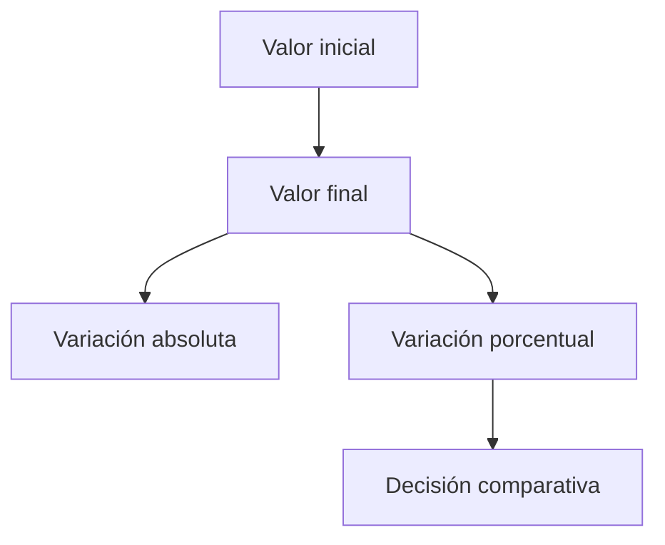
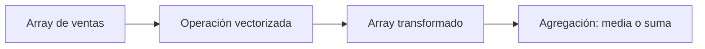
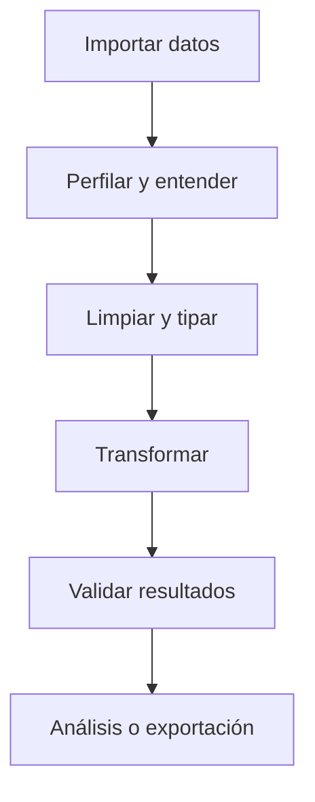
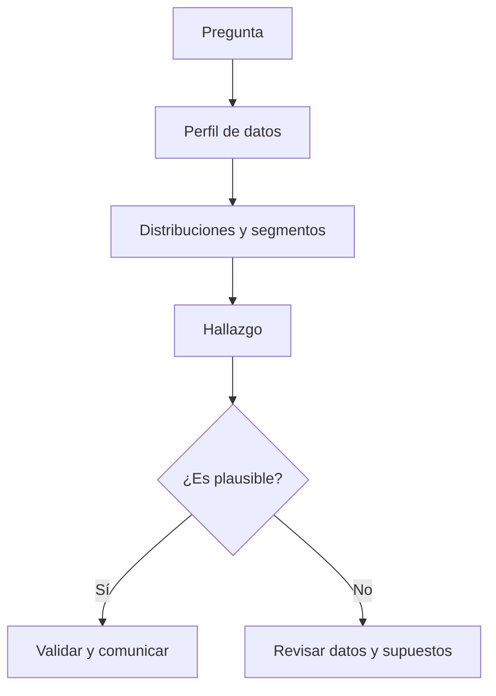
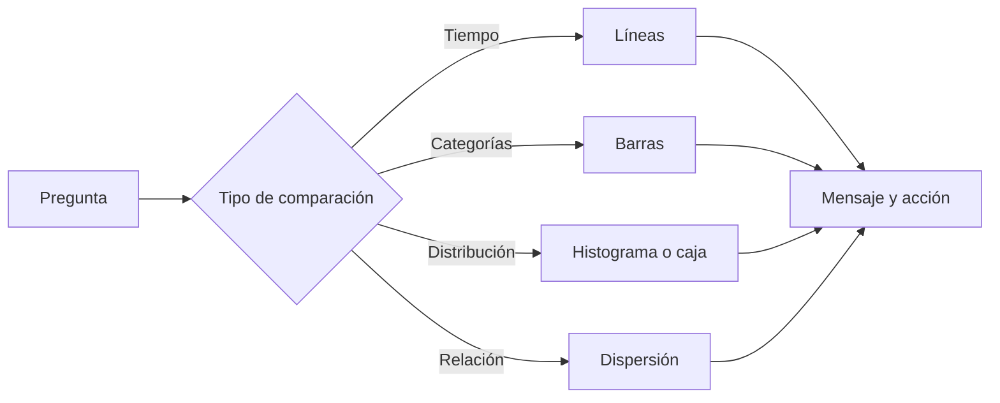
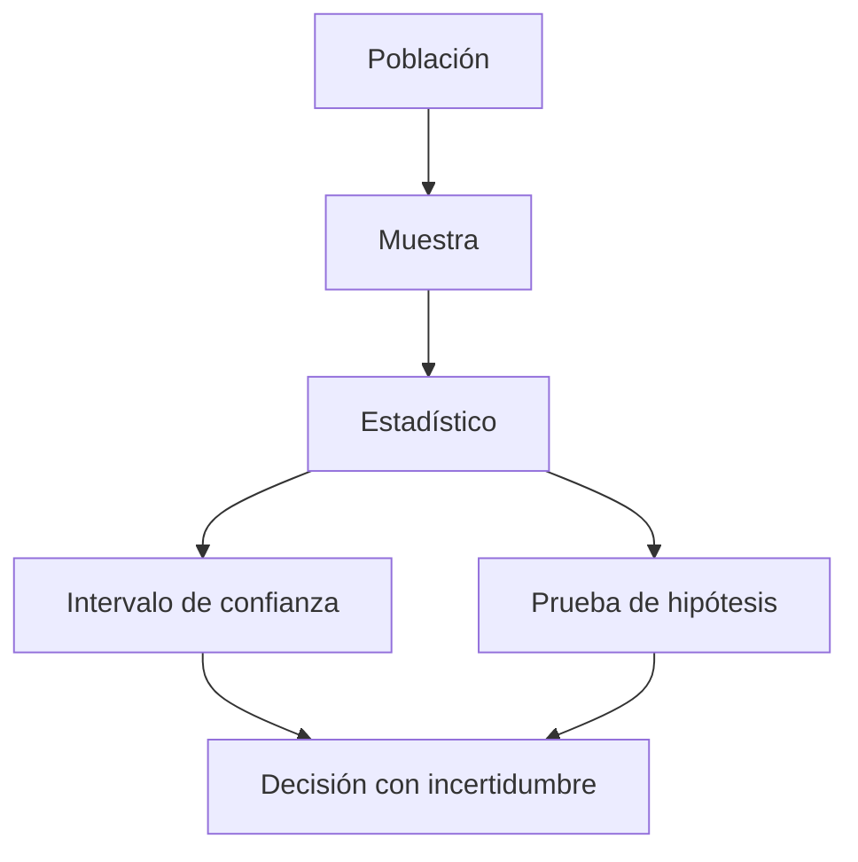
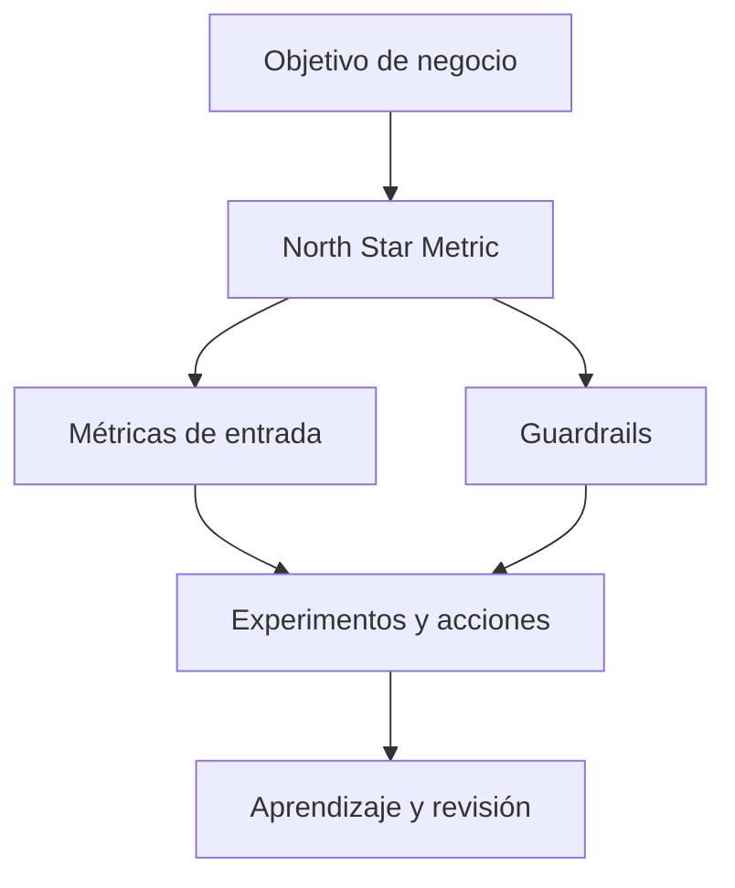
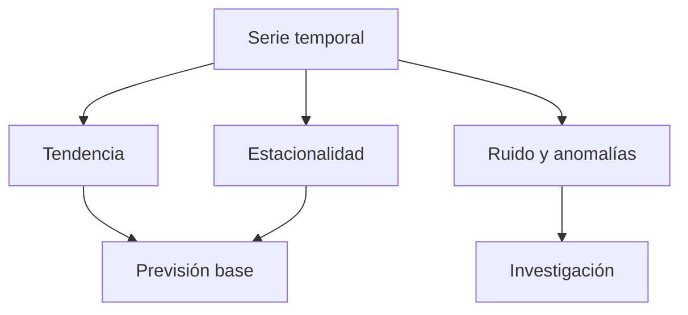

# Temario completo - Curso de Analista de Datos con Python

# Bloque 00 - Orientación y pensamiento analítico

## Objetivo

Entender qué hace un analista de datos, cómo se formula una pregunta útil y cómo aprovechar este curso sin depender siempre de un ordenador.

## Qué hace un analista

Un analista convierte una necesidad de decisión en evidencia comprensible. No consiste en hacer gráficos bonitos ni en ejecutar consultas aisladas. El trabajo habitual sigue un ciclo:

1. Aclarar la decisión que se quiere tomar.
2. Definir una pregunta medible y las métricas relevantes.
3. Localizar, comprender y preparar los datos.
4. Analizar, comprobar supuestos y comunicar límites.
5. Recomendar una acción y medir qué ocurrió después.

## De una petición vaga a una pregunta analítica

Una frase como "las ventas van mal" no es todavía una pregunta analítica. Hay que concretar periodo, segmento, referencia y decisión. Por ejemplo: "¿Qué canales explican la caída del 12 % de ventas de junio frente al promedio de marzo a mayo, y qué acción puede recuperar margen sin aumentar el gasto total?".

Una buena pregunta incluye población, métrica, periodo y comparación. Si falta uno de esos elementos, pide contexto antes de calcular.

## Métricas desde el primer día

Una métrica es una medida definida de forma reproducible. Un KPI es una métrica elegida para seguir un objetivo importante. Antes de aceptar una cifra pregunta:

- ¿Cuál es la fórmula exacta?
- ¿Qué población incluye y excluye?
- ¿Qué intervalo temporal usa?
- ¿De qué fuente procede y cuándo se actualizó?
- ¿Qué decisión cambiaría si el valor sube o baja?

## Herramientas y modo de estudio

La teoría se lee desde GitHub o en PDF. Los notebooks se pueden abrir con Google Colab desde navegador. Para un trabajo profesional también necesitarás aprender a documentar decisiones, trabajar con tickets y colaborar mediante GitHub o Jira; se abordará más adelante.

## Resumen

El análisis empieza por una decisión, no por una herramienta. Define la pregunta y la métrica antes de abrir Python.

## Ejercicios

Realiza [los ejercicios de comprensión](../../ejercicios/temario-00/comprension/preguntas.md) antes de consultar [las soluciones](../../soluciones/temario-00/preguntas.md).

# Bloque 01 - Fundamentos de datos

## Objetivo

Reconocer qué representa un conjunto de datos, evaluar su calidad y evitar conclusiones que los datos no permiten.

## Anatomía de una tabla

Una observación suele ser una fila: por ejemplo, una compra. Una variable es una columna: fecha, importe o canal. Una clave identifica de forma única una observación; una clave mal definida crea duplicados y totales erróneos.

Las variables pueden ser numéricas, categóricas, texto, fecha/hora o booleanas. El tipo no es un detalle técnico: determina qué cálculos y visualizaciones tienen sentido.

## Calidad del dato

Antes de analizar, revisa cinco dimensiones:

- Completitud: ¿faltan valores necesarios?
- Validez: ¿los valores respetan reglas, unidades y formatos?
- Consistencia: ¿la misma idea está codificada igual en todo el conjunto?
- Unicidad: ¿hay duplicados indebidos?
- Actualidad: ¿el dato es suficientemente reciente para la decisión?

No elimines valores ausentes por costumbre. Primero averigua por qué faltan y si el patrón de ausencia puede sesgar el resultado.

## Archivos y bases de datos

CSV es simple y común, pero no conserva todos los tipos. JSON representa estructuras anidadas. Excel es útil para tareas ligeras y revisión manual. Parquet almacena datos de forma columnar y suele ser eficiente en análisis.

Las bases relacionales organizan tablas conectadas por claves y se consultan con SQL. Las bases documentales como MongoDB almacenan documentos flexibles. DynamoDB es una base NoSQL de clave-valor y documentos orientada a patrones de acceso. Ninguna tecnología elimina la necesidad de comprender la semántica de los datos.

## Ética y privacidad

Que se pueda acceder a un dato no significa que se deba usar. Minimiza la información personal, evita compartir identificadores en notebooks y piensa a quién puede perjudicar una clasificación o recomendación.

## Resumen

El análisis fiable empieza por saber qué mide cada columna y por comprobar la calidad de los datos antes de calcular promedios.

## Ejercicios

Realiza [la auditoría de calidad](../../ejercicios/temario-01/comprension/auditoria-calidad.md) antes de consultar [las soluciones](../../soluciones/temario-01/auditoria-calidad.md).

# Bloque 02 - Python desde cero

## Objetivo

Aprender a leer, escribir y depurar pequeños programas de Python orientados a datos.

## Ejecutar Python

Un notebook mezcla texto, código y resultados. Puedes ejecutarlo en Google Colab desde el navegador. Ejecuta una celda, observa el resultado y cambia una sola cosa cada vez cuando estés aprendiendo.

## Valores y variables

Python trabaja con números, texto, booleanos y el valor especial `None`. Una variable da un nombre a un valor:

```python
ventas = 1200
objetivo = 1500
cumplimiento = ventas / objetivo
```

Usa nombres descriptivos. `importe_total` comunica más que `x`.

## Colecciones

Las listas guardan una secuencia ordenada y modificable. Los diccionarios relacionan claves con valores. Para un analista, ambos aparecen con frecuencia al recibir respuestas de APIs o preparar datos antes de pasarlos a Pandas.

```python
canales = ["web", "tienda", "partners"]
venta = {"canal": "web", "importe": 42.50}
```

## Condiciones, bucles y funciones

Una condición selecciona una acción. Un bucle repite una operación. Una función encapsula una tarea reutilizable. Prioriza claridad sobre trucos cortos: tu código debe poder explicarse a otra persona.

```python
def clasificar_venta(importe):
    if importe >= 100:
        return "alta"
    return "normal"
```

## Errores y depuración

Los errores son información. Lee primero la última línea: indica el tipo de error y la causa inmediata. Después comprueba los valores, tipos y nombres de las variables implicadas. No copies una solución de AI sin ejecutar y entender el resultado.

## Resumen

Python permite expresar cálculos de forma reproducible. Primero dominarás piezas pequeñas y después usarás NumPy y Pandas para trabajar con tablas reales.

## Práctica

Abre el [notebook de gastos personales](../../notebooks/practicas/02-gastos-personales.ipynb) o [ejecútalo en Google Colab](https://colab.research.google.com/github/Ayhur/CursoAnalista/blob/main/notebooks/practicas/02-gastos-personales.ipynb). También puedes resolver [el ejercicio](../../ejercicios/temario-02/aplicacion/gastos-personales.md). Las [soluciones](../../soluciones/temario-02/gastos-personales.md) se consultan al terminar.

# Bloque 03 - Matemáticas aplicadas al análisis

## Objetivo

Conectar las herramientas matemáticas con decisiones de negocio y análisis. La teoría general es opcional para quien ya tenga una base universitaria sólida; las aplicaciones sí forman parte del oficio de analista.

## Diagnóstico rápido

Puedes avanzar directamente si manejas porcentajes, tasas de variación, medias ponderadas, funciones y vectores. Si algo resulta familiar pero oxidado, repásalo aquí antes de entrar en estadística.

## Porcentajes y tasas

Un cambio de 100 a 120 es un aumento del 20 %. Un descenso posterior del 20 % no devuelve el valor al origen: 120 x 0,8 = 96. Este detalle importa al comunicar crecimiento, conversión o churn.

La media ponderada evita dar el mismo peso a grupos de tamaño muy distinto. Si dos países convierten al 80 % y 10 %, pero tienen 10 y 10 000 visitantes, la media simple sería engañosa.



## Funciones, vectores y matrices

Una función transforma una entrada en una salida: por ejemplo, `ingresos(clientes, precio)`. Un vector reúne medidas de una observación y una matriz reúne muchas observaciones. NumPy y Pandas usarán estas ideas para calcular sobre miles de filas a la vez.

## Crecimiento y tiempo

Separa nivel, cambio absoluto, cambio porcentual y crecimiento compuesto. Si una métrica tiene estacionalidad, comparar solo con el mes anterior puede ser una mala referencia; compara también con el mismo periodo del año anterior.

## Resumen

Las matemáticas no son un bloque aislado: sirven para definir métricas, detectar comparaciones injustas y explicar magnitudes con precisión.

# Bloque 04 - NumPy y cálculo vectorizado

## Objetivo

Usar arrays para representar datos numéricos y aplicar cálculos de forma rápida, clara y reproducible.

## Arrays y vectorización

Un array almacena valores del mismo tipo en una estructura con forma definida. La vectorización aplica una operación a todos los elementos sin escribir un bucle explícito. Es útil porque expresa mejor la intención y suele ser más eficiente.



## Selección y máscaras

Una máscara booleana responde una pregunta para cada fila: `ventas > 100`. Después sirve para seleccionar solo los elementos que cumplen la condición. Esta idea reaparecerá en Pandas al filtrar DataFrames.

## Forma y broadcasting

La forma indica dimensiones: una serie puede tener forma `(n,)`, una tabla `(filas, columnas)`. Broadcasting permite combinar arrays compatibles, por ejemplo restar la media de cada columna a una matriz sin repetir la media manualmente.

## Reproducibilidad

Al simular datos aleatorios, fija una semilla. Así otra persona puede repetir el mismo experimento y comprobar el resultado.

## Resumen

Piensa en operaciones sobre colecciones completas, no en una fila cada vez. NumPy prepara el modelo mental para análisis tabular a escala.

# Bloque 05 - Pandas: manipulación de datos

## Objetivo

Importar, limpiar, transformar y combinar tablas de datos con Pandas.

## El ciclo de preparación

Un DataFrame representa una tabla con filas y columnas etiquetadas. La primera tarea no es transformar: es inspeccionar tamaño, tipos, nulos, duplicados, rangos y ejemplos reales.



## Operaciones esenciales

- Seleccionar columnas y filtrar filas con condiciones.
- Convertir fechas, números y categorías explícitamente.
- Crear columnas derivadas con operaciones vectorizadas.
- Agrupar con `groupby` para resumir por segmento.
- Combinar fuentes con `merge`, verificando la cardinalidad de las claves.

## Uniones sin sorpresas

Antes de unir tablas identifica la clave y pregunta si es uno a uno, uno a muchos o muchos a muchos. Una unión inesperadamente muchos a muchos multiplica filas y puede inflar ingresos, usuarios o eventos.

## Validación

Después de una transformación compara número de filas, nulos y totales relevantes. Las validaciones simples son una red de seguridad más valiosa que un notebook elegante.

## Práctica

Resuelve [la limpieza de pedidos](../../ejercicios/temario-05/aplicacion/limpieza-pedidos.md) y después consulta [la solución razonada](../../soluciones/temario-05/limpieza-pedidos.md).

# Bloque 06 - Análisis exploratorio de datos

## Objetivo

Explorar datos de manera rigurosa para descubrir patrones, anomalías y preguntas nuevas sin confundir exploración con demostración causal.

## Preguntas antes de gráficos

Empieza por una hipótesis o pregunta: "¿qué segmento ha cambiado?", "¿dónde se concentran los valores atípicos?", "¿hay estacionalidad?". Un gráfico sin pregunta puede ser interesante, pero no necesariamente útil.



## Distribución y segmentos

Observa centro, dispersión, asimetría y valores extremos. Compara siempre segmentos relevantes: una media global puede ocultar que un canal crece mientras otro cae. No borres outliers sin investigar si representan un error, un caso importante o una población distinta.

## Correlación y causalidad

Dos variables pueden moverse juntas por azar, por una tercera causa o porque una afecta a la otra. El EDA genera hipótesis; experimentos, diseños causales o conocimiento del proceso ayudan a evaluar explicaciones.

## Registro de decisiones

Anota filtros, exclusiones, transformaciones y limitaciones. Un buen análisis permite responder no solo "qué encontraste", sino "cómo llegaste ahí".

## Práctica

Resuelve [la investigación de una caída](../../ejercicios/temario-06/aplicacion/investigar-caida.md) antes de mirar [la guía de solución](../../soluciones/temario-06/investigar-caida.md).

# Bloque 07 - Visualización y comunicación

## Objetivo

Elegir y construir visualizaciones que permitan comprender una decisión con rapidez, sin distorsionar los datos.

## Pregunta antes que gráfico

La elección empieza por el mensaje: compara categorías con barras, evolución temporal con líneas, distribución con histogramas o cajas, y relación entre dos variables con dispersión. No hay un gráfico universalmente mejor.



## Diseño honesto

Etiqueta ejes y unidades, usa escalas coherentes y evita cortar un eje de barras cuando convierta diferencias pequeñas en aparentes abismos. El color debe reforzar significado, no decorar. Piensa también en contraste y personas con visión reducida del color.

## De exploración a comunicación

Un gráfico exploratorio ayuda a pensar; uno explicativo ayuda a decidir. El segundo elimina elementos irrelevantes, destaca la comparación importante y añade un título que exponga el hallazgo, no solo el nombre de la métrica.

## Entregables profesionales

Un análisis suele terminar en un dashboard, una presentación, un ticket de Jira o una nota ejecutiva. Cada formato necesita contexto, definición de métricas, hallazgo, recomendación y limitaciones.

## Ejercicio

Haz el [diagnóstico de gráficos](../../ejercicios/temario-07/comprension/elegir-grafico.md) y comprueba [los criterios](../../soluciones/temario-07/elegir-grafico.md).

# Bloque 08 - Estadística para decisiones

## Objetivo

Medir incertidumbre, evaluar diferencias y comunicar resultados sin convertir el p-valor en una respuesta automática.

## Población, muestra y variabilidad

La población es el conjunto que te interesa; la muestra es la parte observada. Un estadístico resume una muestra y un parámetro describe la población. Muestras distintas producen resultados distintos: esa variabilidad es parte del problema, no un fallo.



## Intervalos y pruebas

Un intervalo de confianza expresa un rango compatible con el método y los datos. Una prueba de hipótesis compara los datos con una hipótesis nula. Un p-valor pequeño no mide el tamaño del efecto, la importancia de negocio ni la probabilidad de que una hipótesis sea cierta.

## Experimentos A/B

Define antes la métrica principal, métricas de guardrail, duración y criterio de decisión. Evita mirar resultados cada día y declarar ganador en el primer pico: esa práctica aumenta falsos positivos.

## Tamaño del efecto

Una diferencia minúscula puede ser estadísticamente detectable con muchos datos y aun así no justificar ninguna acción. Comunica siempre efecto absoluto, efecto relativo, incertidumbre y coste de actuar.

## Práctica

Analiza [un experimento de onboarding](../../ejercicios/temario-08/aplicacion/experimento-onboarding.md) y revisa [la interpretación](../../soluciones/temario-08/experimento-onboarding.md).

# Bloque 09 - SQL, NoSQL y almacenamiento

## Objetivo

Entender cómo viven los datos en una empresa, consultar tablas con SQL y saber cuándo un modelo documental o clave-valor requiere una forma distinta de pensar.

## SQL para preguntas de negocio

SQL permite seleccionar, filtrar, agrupar, unir y ordenar datos. Para cada consulta define el grano: ¿una fila representa un pedido, un usuario, una sesión o un evento? El grano evita duplicar o perder información al usar `JOIN`.


## NoSQL sin mitos

MongoDB almacena documentos flexibles y permite filtros y pipelines de agregación. DynamoDB organiza datos alrededor de claves y patrones de acceso con rendimiento predecible. Son excelentes para algunas aplicaciones operacionales; no reemplazan automáticamente un warehouse orientado a análisis histórico y uniones complejas.

## AI para consultas

MongoDB Atlas puede generar filtros y agregaciones a partir de lenguaje natural. Úsalo como borrador, no como autoridad: revisa semántica, filtros, coste, índices, datos sensibles y resultado. Una consulta que "parece" correcta puede contestar otra pregunta.

## Práctica

Resuelve [la consulta de conversión](../../ejercicios/temario-09/aplicacion/consulta-conversion.md) y compara con [la solución](../../soluciones/temario-09/consulta-conversion.md).

# Bloque 10 - Métricas, KPIs y analítica de producto

## Objetivo

Diseñar métricas que conecten comportamiento, resultados de negocio y decisiones, en lugar de limitarse a contar eventos.

## De objetivo a métrica

Una métrica es una definición reproducible. Un KPI es una métrica elegida para seguir un objetivo importante. Cada definición debe incluir fórmula, población, periodo, fuente, propietario y limitaciones.



## Árboles de métricas

Una North Star Metric resume valor entregado y sostenibilidad, pero no se gestiona sola. Descompónla en métricas controlables: adquisición, activación, engagement, retención y monetización. Añade guardrails para no optimizar crecimiento a costa de fraude, soporte o margen.

## Producto digital

DAU, WAU, MAU, stickiness, conversión, adopción de funcionalidades, retención y churn son útiles solo con definiciones consistentes. En Amplitude estas ideas aparecen como eventos, propiedades, funnels, cohorts, retention y dashboards. Aprende primero el concepto; después cualquier herramienta será más fácil de usar.

## Gobierno de métricas

Un catálogo evita que dos equipos calculen "usuarios activos" de forma diferente. Guarda definición, código, fuente, cambios y usos. Este hábito evita discusiones de números y mejora la confianza.

## Práctica

Diseña [un árbol de métricas](../../ejercicios/temario-10/aplicacion/arbol-metricas.md) y contrástalo con [la propuesta](../../soluciones/temario-10/arbol-metricas.md).

# Bloque 11 - Series temporales

## Objetivo

Analizar datos que cambian con el tiempo, distinguir tendencia de estacionalidad y construir previsiones base honestas.

## Componentes temporales

Una serie puede contener tendencia, estacionalidad, ciclos, ruido y cambios de nivel. Antes de modelar, comprueba frecuencia, fechas ausentes, cambios de definición y eventos externos que hayan alterado la métrica.



## Validación temporal

No mezcles futuro y pasado al evaluar un modelo. Entrena con periodos anteriores y valida con periodos posteriores. Una previsión ingenua, como repetir el último valor o el mismo día de la semana anterior, es una referencia obligatoria.

## Comunicación

Una previsión es un rango con supuestos, no una cifra mágica. Explica horizonte, error esperado, eventos no incluidos y qué decisión cambia si la previsión falla.

## Práctica

Plantea [una previsión de demanda](../../ejercicios/temario-11/aplicacion/prevision-demanda.md) y compara con [la guía](../../soluciones/temario-11/prevision-demanda.md).
