# Temario completo - Curso de Analista de Datos con Python

# Bloque 00 - Orientación y pensamiento analítico

## Propósito

Antes de escribir una consulta, abrir Python o crear un gráfico, un analista debe saber qué decisión está ayudando a tomar. Este bloque enseña a convertir una preocupación de negocio en una investigación revisable: una pregunta concreta, una hipótesis que puede fallar, evidencia adecuada, una recomendación prudente y un plan de seguimiento.

El hilo conductor es un caso de producto IT: **Lumen**, una app de reservas de espacios de trabajo, detecta que menos personas que instalan la app completan su primera reserva. Leo acompañará a producto e ingeniería desde el aviso inicial hasta la decisión y su medición posterior.

## Resultados observables

Al completar el bloque podrás:

- distinguir descripción, diagnóstico, predicción y prescripción, y saber qué no permite concluir cada uno;
- redactar un brief analítico que otra persona pueda ejecutar y revisar;
- separar hechos observados, hipótesis y evidencia;
- definir una métrica con evento, denominador, exclusiones, grano, ventana, fuente y decisión asociada;
- estudiar desde el móvil dejando un registro reproducible de tus respuestas y supuestos.

## Ruta de aprendizaje

1. [El rol del analista, tipos de análisis y ciclo de decisión](lecciones/01-rol-y-ciclo-de-decision.md)
2. [Preguntas, hipótesis, evidencia y contrato de métrica](lecciones/02-preguntas-hipotesis-y-evidencia.md)
3. [Método de estudio, brief y trabajo reproducible](lecciones/03-metodo-de-estudio-y-diagnostico.md)

## Prerrequisitos y práctica móvil

No necesitas programación ni vocabulario técnico. Desde el móvil puedes leer las lecciones, copiar la [plantilla de brief](plantillas/brief-analitico.md) en una nota y responder el ejercicio. Cuando dispongas de ordenador, repetirás este mismo razonamiento con datos en los bloques siguientes.

## Evaluación del bloque

Completa el [caso integrador de Lumen](../../ejercicios/temario-00/comprension/preguntas.md) sin mirar la solución. Después compáralo con la [solución razonada y rúbrica](../../soluciones/temario-00/preguntas.md). No se evalúa acertar una causa inventada: se evalúa formular una investigación y una decisión defendibles.

# El rol del analista, tipos de análisis y ciclo de decisión

## Resultado observable y punto de partida

Al terminar podrás recibir una frase como «la activación ha caído» y convertirla en un recorrido de investigación. Distinguirás cuatro tipos de análisis sin confundir una descripción con una causa o una recomendación. No necesitas saber programar: una **app** es un programa que una persona usa en su teléfono; un **evento** será una acción que la app registra, como instalarla o completar una reserva.

## Caso continuo: la caída de activación de Lumen

Lumen permite reservar puestos de trabajo. El lunes, la responsable de producto escribe: «La activación ha bajado; arregladlo». Antes de actuar faltan datos importantes.

Llamaremos **activación** a que una persona nueva llega a realizar la primera acción de valor del producto. En Lumen, de momento, esa acción será completar una primera reserva. Esta definición es una elección de negocio, no una propiedad mágica del software: más adelante se formalizará para que todos cuenten lo mismo.

El encargo útil no es «mirar los datos». Es decidir entre opciones con coste: ¿priorizar una incidencia de ingeniería en el formulario?, ¿cambiar el texto de bienvenida?, ¿pausar una campaña que atrae usuarios poco adecuados?, ¿esperar porque la caída es solo una variación normal? El analista hace visible qué evidencia haría preferible una opción.

## Del brief al seguimiento

Este flujo responde a «¿qué debe ocurrir entre una alarma y una decisión responsable?».


El seguimiento vuelve a abrir una pregunta, aunque lo representemos como el final de este recorrido para conservar un diagrama legible en PDF. Si Lumen simplifica una pantalla, debe comprobar después si sube la activación **sin** empeorar cancelaciones, soporte o ingresos. Una recomendación no cierra el análisis; crea una nueva situación que hay que observar.

## Cuatro preguntas, cuatro tipos de análisis

La misma caída puede estudiarse con preguntas distintas. La tabla no es una escalera automática: cada tipo necesita evidencia diferente.

| Tipo | Pregunta de Lumen | Entrega útil | Lo que no permite afirmar por sí solo |
| --- | --- | --- | --- |
| Descriptivo | ¿Cuánto cambió la activación y en qué fechas? | Serie, segmentos y definición de la medida | Por qué cambió ni qué hacer |
| Diagnóstico | ¿En qué paso, dispositivo o canal se concentra la caída? | Hipótesis priorizadas y comprobaciones | Que un factor observado sea la causa |
| Predictivo | ¿Cuántas activaciones esperamos la próxima semana si continúa el patrón? | Estimación con incertidumbre | Que una acción concreta produzca el resultado |
| Prescriptivo | ¿Qué opción conviene ejecutar dadas las evidencias, costes y riesgos? | Recomendación, condiciones y seguimiento | Que sea óptima o causalmente demostrada sin experimento |

En lectura rápida, el análisis **descriptivo** responde «qué pasó»; el **diagnóstico** pregunta «dónde y con qué explicaciones plausibles»; el **predictivo** estima «qué podría pasar»; y el **prescriptivo** propone «qué conviene hacer, bajo qué condiciones y cómo sabremos si funcionó». Ninguno autoriza por sí solo a afirmar causalidad.

### Ejemplo trabajado

La primera comprobación muestra que la activación pasó de 38% a 29% entre dos semanas comparables. Eso es **descriptivo**. Al separar por plataforma, la caída aparece sobre todo en Android y coincide con una actualización. Eso es **diagnóstico exploratorio**: orienta a revisar el formulario y los registros de error, pero aún no prueba que la actualización sea la causa. Si Lumen estima el número de activaciones de la semana siguiente para dimensionar soporte, está haciendo una **predicción**. Si decide revertir la actualización temporalmente porque el riesgo de perder usuarios es alto y medirá el efecto, está haciendo una **prescripción** bajo incertidumbre.

### Contraejemplos que evitan errores caros

- «Android cayó después de la actualización; por tanto, la actualización causó la caída». Es una hipótesis plausible, no una prueba. También pudo cambiar la mezcla de campañas o dejar de registrarse un evento.
- «El modelo predice 600 activaciones; por tanto, cambiar el botón dará 600». Una predicción de demanda no mide el efecto causal de un cambio de interfaz.
- «Recomiendo cambiar el texto porque parece claro». Una recomendación sin métrica de éxito, coste o plan de reversión es una opinión, no una decisión analítica.

## El producto real del analista

Un gráfico puede ser una evidencia, pero no es el producto final. Una entrega profesional deja una cadena que otra persona puede revisar:

- **Decisión:** qué se puede hacer y quién decide.
- **Pregunta:** qué comparación responderá esa decisión.
- **Evidencia:** qué registros, periodos y comprobaciones la sostienen.
- **Interpretación:** qué muestra el resultado y qué permanece incierto.
- **Recomendación:** acción, coste, riesgo y criterio de seguimiento.

Esta cadena protege tanto a Lumen como al analista: evita que una cifra bonita se convierta en una afirmación que los datos no permiten.

## Resumen y comprobación

- Describir, diagnosticar, predecir y prescribir responden preguntas distintas.
- Una asociación observada puede priorizar una investigación, pero no demuestra causalidad.
- Toda acción debe tener una métrica de seguimiento y una posible condición de reversión.

Comprueba tu comprensión: si la activación baja solo en Android, ¿qué dos explicaciones alternativas investigarías antes de culpar al formulario? ¿Qué dato distinguiría una caída real de un fallo de medición?

En la siguiente lección convertirás la alarma de Lumen en una pregunta comprobable y un contrato de métrica. Después resuelve el [caso integrador](../../../ejercicios/temario-00/comprension/preguntas.md).

# Preguntas, hipótesis, evidencia y contrato de métrica

## Resultado observable y prerrequisitos

Al terminar redactarás una pregunta analítica y el contrato completo de una métrica de activación. Usarás el caso de Lumen de la lección anterior. Una **métrica** es una regla repetible para medir algo; un **KPI** es una métrica elegida para seguir un objetivo importante. No toda cifra merece ser KPI.

## De una preocupación a una pregunta comprobable

«Queremos que más personas usen la aplicación» expresa una intención, no una investigación. Una pregunta comprobable especifica, como mínimo:

- **Población:** ¿de qué personas o casos hablamos?
- **Resultado:** ¿qué acción o valor observaremos?
- **Ventana temporal:** ¿cuánto tiempo tiene cada persona para lograrlo?
- **Comparación:** ¿frente a qué fecha, segmento o versión?
- **Decisión:** ¿qué acción puede cambiar la respuesta?

Para Lumen: «Entre las personas que instalan la versión 4.2 de Lumen, ¿qué porcentaje completa una primera reserva dentro de siete días, comparado con la versión 4.1, y en qué paso del flujo se concentra la diferencia para decidir si revertimos el cambio?».

La pregunta no presupone que la versión sea culpable. Ese detalle permite que la evidencia contradiga la sospecha inicial.

## Hecho, hipótesis y evidencia: mantener las piezas separadas

Una **hipótesis** es una explicación provisional que podría ser falsa; por ejemplo: «el selector de fecha de Android impide avanzar». Un **hecho observado** sería: «en Android, el 31% llega a `reserva_iniciada`, frente al 43% antes de la versión». La **evidencia** es la información que puede apoyar, matizar o refutar la hipótesis: registros de error, repetición del flujo, una comparación con iOS o una prueba controlada.

Este diagrama responde a «¿cómo evitar que una sospecha se disfrace de conclusión?».

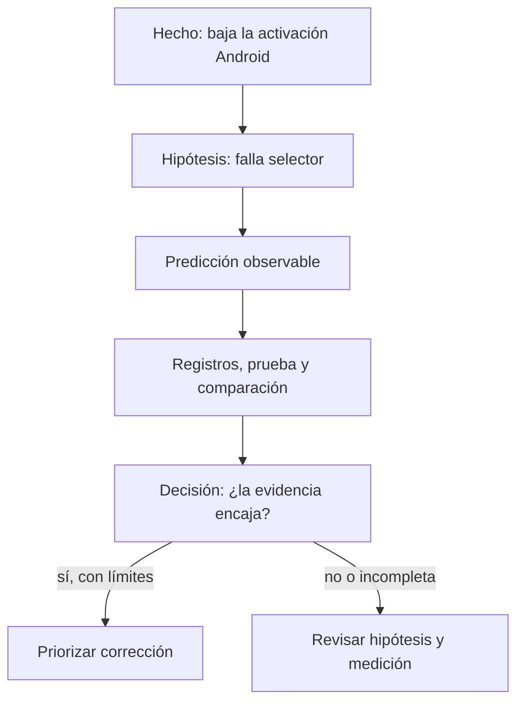

La ruta «sí» no elimina los límites: quizá el cambio coincide con una campaña. Por eso la recomendación debe indicar el nivel de seguridad y qué se medirá tras actuar.

## Contrato completo de métrica

Decir «la activación es 29%» es insuficiente. Dos personas pueden llegar a números distintos si una cuenta instalaciones y otra cuentas, o si una incluye empleados de Lumen. Un **contrato de métrica** documenta las reglas antes de discutir el resultado.

| Campo | Contrato de activación de Lumen | Por qué evita errores |
| --- | --- | --- |
| Nombre y decisión | Activación a 7 días; decidir si investigar/revertir cambios de onboarding | Conecta medida y acción |
| Evento numerador | Usuarios únicos con `reserva_completada` dentro de 7 días tras instalar | Dice qué éxito cuenta |
| Denominador | Usuarios únicos con `app_instalada` en la versión y periodo definidos | Evita dividir por una población distinta |
| Exclusiones | Empleados, cuentas de prueba, fraudes detectados y reinstalaciones identificadas | Evita inflar o sesgar la tasa |
| Grano | Una fila lógica por usuario e instalación elegible | Impide contar varias reservas como varias personas |
| Ventana y fecha de corte | 7 días desde instalación; solo instalaciones con 7 días completos al corte | Evita comparar cohortes inmaduras |
| Fuente y calidad | Eventos de la app y tabla de usuarios; comprobar duplicados, zona horaria y eventos faltantes | Hace el número auditable |
| Segmentos autorizados | Versión, sistema operativo y canal de adquisición | Permite localizar el problema sin inventar segmentos |
| Propietario y revisión | Producto es propietario; Datos revisa cambios de tracking antes de publicar | Define responsabilidad |
| Métricas de protección | Cancelación en 7 días y contactos a soporte por reserva | Evita optimizar activación a costa de la experiencia |

Para que el contrato también pueda leerse sin una tabla, conserva esta lista de control:

- Cuenta como éxito el evento `reserva_completada` dentro de siete días; cuenta como entrada cada instalación elegible.
- Excluye empleados, pruebas, fraude conocido y reinstalaciones identificadas; cada unidad es una instalación elegible por usuario.
- Espera a que cada cohorte complete siete días y documenta zona horaria, fuente y comprobaciones de duplicados o eventos ausentes.
- Segmenta por versión, sistema operativo y canal; Producto es propietario y Datos revisa cambios de tracking.
- Junto a activación, vigila cancelaciones y contactos a soporte para no mejorar un número a costa de la experiencia.

En notación sencilla:

`activación_7d = usuarios elegibles con primera reserva en 7 días / usuarios elegibles que instalaron`

La fórmula no sustituye el contrato. Sin exclusiones, grano y ventana, dos fracciones con el mismo nombre pueden significar cosas opuestas.

## Ejemplo trabajado: decidir con un contrato

El 8 de julio, Lumen compara instalaciones del 1 al 7 de junio (versión 4.1) con instalaciones del 1 al 7 de julio (versión 4.2). Espera hasta el 15 de julio para que todos tengan siete días completos. Tras excluir empleados y reinstalaciones, calcula 380 activados de 1.000 elegibles (38%) frente a 290 de 1.000 (29%).

La diferencia describe una señal prioritaria, pero todavía hay preguntas: ¿el evento `reserva_completada` siguió enviándose? ¿cambió el canal de adquisición? ¿la caída aparece también en iOS? El contrato no responde por sí solo; garantiza que esas preguntas parten del mismo objeto medido.

## Error frecuente: optimizar una métrica huérfana

Si Lumen premia solo «reservas creadas», podría añadir una reserva automática que después se cancela. La tasa parecería mejor mientras el usuario recibe una experiencia peor. Por eso una métrica principal necesita métricas de protección y una decisión explícita. Esto se verá con más profundidad en el bloque de métricas y producto.

Otro error es cambiar el contrato después de ver el resultado para hacerlo favorable. Si la definición debe cambiar por una mejora legítima de tracking, se versiona: se conserva la definición anterior, se indica desde qué fecha rige la nueva y se evita comparar series incompatibles como si fueran iguales.

## Resumen y comprobación

- Una pregunta comprobable incluye población, resultado, ventana, comparación y decisión.
- Hecho, hipótesis y evidencia cumplen papeles distintos; una correlación no prueba una causa.
- Una métrica profesional necesita más que una fórmula: evento, denominador, exclusiones, grano, ventana, fuente y uso.

Antes de avanzar, intenta explicar por qué «usuarios activos: 10.000» no es aún un resultado interpretable. Después usa la [plantilla de brief](../plantillas/brief-analitico.md) y resuelve el [caso integrador](../../../ejercicios/temario-00/comprension/preguntas.md).

# Método de estudio, brief y trabajo reproducible

## Resultado observable y prerrequisitos

Sabrás estudiar una lección desde el móvil y dejar un brief que otra persona pueda continuar. No hace falta instalar nada. Un **brief** es una nota breve que fija el problema, la decisión, las reglas de medida y los límites antes de investigar; no es un informe final ni una orden de confirmar una sospecha.

## Estudiar para poder aplicar, no solo reconocer

Leer «activación = 29%» puede hacer que el concepto parezca familiar. Poder usarlo exige recuperar la idea sin mirar y defender una decisión. Para cada lección, alterna:

1. **Comprender:** lee el ejemplo y señala palabras nuevas.
2. **Recuperar:** cierra la página y explica con tus palabras qué se mide y por qué.
3. **Aplicar:** resuelve una variación pequeña sin consultar la solución.
4. **Contrastar:** compara con la solución, corrige el razonamiento y anota qué supuesto omitiste.

Desde el móvil puedes copiar la plantilla en una aplicación de notas y escribir en frases cortas. No necesitas escribir código todavía. Cuando tengas ordenador, un **notebook** será una página que mezcla explicación, código ejecutable y resultados; empezarás desde cero en el bloque de Python.

## El brief mínimo que hace el análisis continuable

Una investigación no es reproducible porque use una herramienta moderna. Es **reproducible** cuando otra persona puede entender qué se preguntó, qué información se usó, qué reglas se aplicaron y por qué se recomendó actuar. El siguiente mapa responde a «¿qué debe conservarse para revisar el caso de Lumen?».

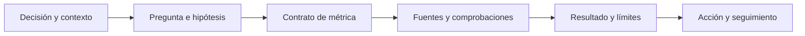

Si alguien recibe solo un gráfico final, no puede comprobar si se incluyeron cuentas de prueba, si la comparación tenía la misma ventana o si la recomendación fue prudente. La [plantilla reutilizable](../plantillas/brief-analitico.md) guarda los seis eslabones.

## Ejemplo: un brief inicial para Lumen

Un inicio honesto podría decir:

> **Decisión:** Producto decidirá el viernes si revierte temporalmente el onboarding 4.2 en Android. **Pregunta:** comparar activación a siete días de instalaciones 4.2 frente a 4.1, por sistema operativo y paso del flujo. **Hipótesis alternativas:** error en selector de fecha, cambio de mezcla de campañas o evento de reserva no registrado. **Límite inicial:** una comparación antes/después no demuestra causalidad. **Seguimiento:** si se revierte, medir activación, cancelación y contactos a soporte durante una semana comparable.

Fíjate en lo que no hace: no afirma que el selector «es la causa» y no borra explicaciones alternativas. Un brief puede empezar con incógnitas; su trabajo es hacerlas visibles.

## Usar AI como tutor, no como piloto automático

La AI puede adaptar ejemplos y hacer preguntas, pero no convierte una respuesta convincente en evidencia. Una petición útil para Leo sería: «No sé qué es un denominador. Explícame la activación de Lumen usando tres personas ficticias; después pídeme que defina a quién excluiría». Después verifica el ejemplo cambiando valores y explica por qué cambia el resultado.

No pegues datos personales, credenciales ni información privada de una empresa en una herramienta pública. Cuando más adelante uses código, conserva la fuente y los pasos; cuando uses AI, conserva también la pregunta importante y verifica cualquier consulta o conclusión antes de compartirla.

## Diagnóstico y siguiente ruta

Tener formación matemática ayuda, pero no permite saltarse las decisiones de medida. Una tasa puede estar bien calculada y responder una pregunta equivocada. Si ya dominas porcentajes, usa los ejemplos para repasar y dedica tiempo a los conceptos nuevos: población, evento, grano, ventana y evidencia.

Después de completar el ejercicio, continúa con el [bloque 01](../../01-fundamentos-datos/README.md). Allí aprenderás qué es un archivo, una tabla, una fila y una columna: las piezas que después permitirán implementar el contrato de métrica con datos reales.

## Resumen y comprobación

- Estudiar implica recuperar, aplicar y corregir, no solo leer.
- Un brief conserva decisión, pregunta, contrato, evidencia, límites y seguimiento.
- AI es útil para practicar si mantienes el control de los datos y verificas las conclusiones.

Pregúntate: ¿qué tendría que escribir Lumen en el brief si el sistema deja de registrar `reserva_completada`? ¿Por qué un número calculado correctamente podría seguir siendo una mala base para decidir?

# Bloque 01 — Fundamentos de datos

## Propósito

Antes de programar, Leo necesita aprender a mirar un conjunto de datos como una representación limitada de una operación real. Usaremos durante todo el bloque el caso de **Mercado Faro**, un marketplace con una web y una app: usuarios crean cuentas, hacen pedidos compuestos por líneas de producto y generan eventos de uso.

## Resultado de salida

Al acabar podrás explicar qué representa cada archivo y cada fila; elegir el grano adecuado; relacionar usuarios, pedidos, líneas y eventos sin multiplicar resultados; leer CSV y JSON con precaución; y documentar controles de calidad, privacidad y trazabilidad antes de recomendar una decisión.

## Prerrequisitos

Ninguno. Los términos archivo, tabla, CSV, JSON, clave y relación se construyen desde cero.

## Caso continuo

La dirección pregunta: «¿cuántos pedidos pagados tuvimos ayer y qué canal conviene mejorar?». Esta pregunta parece simple, pero obliga a distinguir personas de pedidos, pedidos de líneas de producto y acciones dentro de una app. Cada lección añade una pieza al mismo mapa.

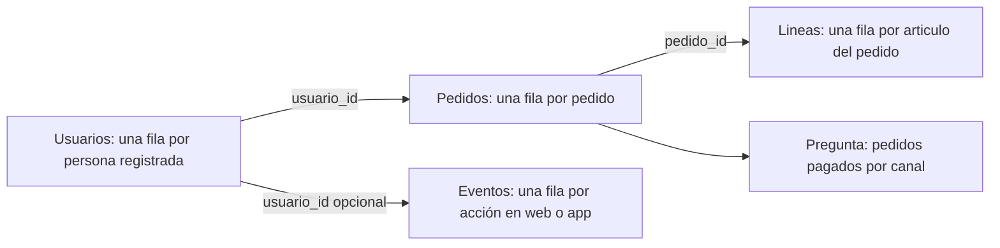

El diagrama no dice que todas las tablas puedan sumarse entre sí: muestra qué identificador permite conectar cada hecho sin cambiar su significado.

## Lecciones

1. [Archivo, tabla, observación y grano](lecciones/01-archivo-tabla-y-grano.md).
2. [Entidades, eventos, claves, relaciones y joins](lecciones/02-filas-columnas-y-relaciones.md).
3. [CSV, JSON y conversión a tablas analizables](lecciones/03-formatos-y-almacenamiento.md).
4. [Contrato, calidad, privacidad y trazabilidad](lecciones/04-calidad-y-uso-responsable.md).

## Práctica y laboratorio

- Resuelve [la auditoría del marketplace](../../ejercicios/temario-01/comprension/auditoria-marketplace.md) y consulta después [la solución razonada](../../soluciones/temario-01/auditoria-marketplace.md).
- Ejecuta [`notebooks/practicas/01-fundamentos-marketplace.py`](../../notebooks/practicas/01-fundamentos-marketplace.py). No requiere instalar librerías: lee los archivos de ejemplo, verifica reglas y demuestra cómo un join mal planteado cambia una cifra.
- Los archivos mínimos del caso están en [`datasets/temario-01/`](../../datasets/temario-01/).

## Criterio de dominio

No sigas al bloque de Python hasta poder completar, para cada tabla: «cada fila representa…», «su identificador es…», «esta métrica se calcula contando/sumando…» y «estos datos no permiten concluir…».

# 01.1 Archivo, tabla, observación y grano

## Objetivos y prerrequisitos

Al terminar podrás distinguir archivo, tabla, fila, columna y celda; escribir el **grano** de una fuente; y explicar por qué contar filas no siempre equivale a contar personas. No se presupone vocabulario técnico.

## Una pregunta cotidiana antes de la jerga

Mercado Faro quiere saber cuántos pedidos pagados recibió ayer. El sistema no guarda «la respuesta»; guarda huellas de cosas que ocurrieron: una persona se registró, pulsó un botón, creó un pedido o añadió dos artículos. Un **dato** es una representación registrada de una parte de la realidad, no la realidad completa.

Un **archivo** es una unidad con nombre y contenido que se puede guardar, copiar y abrir, como una foto o una nota. Si el contenido sigue filas y columnas, puede representar una **tabla**. Una tabla organiza observaciones comparables: una **fila** contiene un caso; una **columna** describe la misma propiedad para todos los casos; una **celda** es el cruce de ambas.

| pedido_id | usuario_id | creado_en | estado | total_eur |
| --- | --- | --- | --- | ---: |
| P-100 | U-10 | 2026-07-24 09:14 | pagado | 42.00 |
| P-101 | U-10 | 2026-07-24 18:05 | cancelado | 18.00 |
| P-102 | U-24 | 2026-07-24 20:22 | pagado | 65.00 |

Aquí cada fila es una observación de **un pedido**, no de un usuario. U-10 aparece dos veces porque hizo dos pedidos. El nombre técnico de esta precisión es el **grano**: la unidad que representa exactamente una fila.

## El grano determina qué cálculo responde a qué pregunta

Antes de abrir una herramienta completa esta frase: «cada fila de esta tabla representa ___». Si la respuesta es «un pedido», contar tres filas responde «tres pedidos»; no «tres clientes». Para clientes únicos se cuentan valores distintos de `usuario_id`; para facturación pagada se suman `total_eur` solo donde `estado = pagado`.

¿Qué camino convierte la pregunta en una cifra defendible?

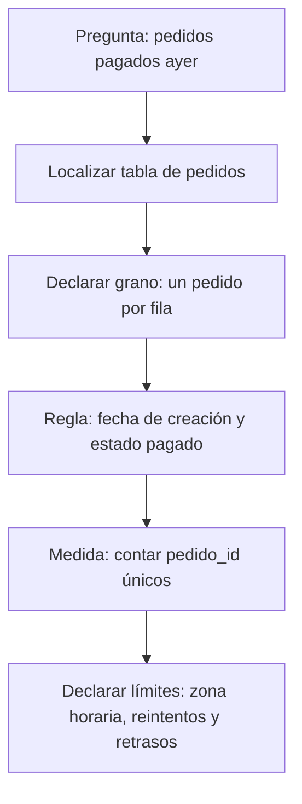

La cifra no es solo un `COUNT`: depende de la definición de «ayer», del estado que cuenta como pago y de que `pedido_id` no esté duplicado.

## Cuatro granos que no se pueden intercambiar

| Fuente | Cada fila representa | Pregunta adecuada | Error si se trata como pedido |
| --- | --- | --- | --- |
| `usuarios` | una cuenta registrada | ¿Cuántas cuentas nuevas? | ignora compras y sesiones |
| `pedidos` | un pedido iniciado | ¿Cuántos pedidos pagados? | puede incluir varios artículos |
| `lineas_pedido` | un artículo dentro de un pedido | ¿Qué unidades se vendieron? | cuenta artículos como pedidos |
| `eventos` | una acción con hora | ¿Dónde abandona la app? | un usuario puede generar cientos |

Una **entidad** es algo relativamente estable que queremos identificar, como usuario o producto. Un **evento** es algo que ocurre en un momento, como `checkout_iniciado`. Un pedido es una **transacción**: registra un intercambio u operación de negocio. En la siguiente lección se afina esta distinción.

## Ejemplo trabajado: un total que parece correcto y no lo es

El pedido P-100 tiene dos líneas: camiseta (20 €) y envío (2 €); P-102 tiene tres líneas por 65 €. Si unimos pedidos con líneas y después contamos filas, veremos cinco filas y podríamos decir «cinco pedidos». Es falso: hay dos pedidos. La suma de `pedidos.total_eur` tras ese join también se repetirá una vez por línea, inflando los ingresos.

El problema no es el software: es haber olvidado el grano al cambiar de tabla. Conserva siempre una nota junto al análisis: fuente, grano, filtro, periodo y unidad.

## Límites y error frecuente

No asumas que una tabla contiene todo. Los eventos pueden faltar si una persona usa bloqueador; un pedido puede estar pendiente de pago; la hora puede venir en UTC mientras la dirección habla de Madrid. Una tabla es evidencia parcial y debe leerse junto con su cobertura y reglas.

## Resumen y comprobación

- Archivo: contenido guardado con un nombre y un formato.
- Tabla: organización en filas y columnas.
- Grano: lo que representa una fila; dicta qué se puede contar o sumar.

1. Escribe el grano de una tabla de sesiones y otro de una tabla de usuarios.
2. ¿Por qué tres filas con el mismo `usuario_id` no son necesariamente un error?
3. Para «productos vendidos», ¿usarías pedidos o líneas de pedido? Justifica la elección.

Aplica estas ideas en [la práctica del marketplace](../../../ejercicios/temario-01/comprension/auditoria-marketplace.md).

# 01.2 Entidades, eventos, claves, relaciones y joins

## Objetivos y prerrequisitos

Aprenderás a diseñar y leer relaciones entre tablas, distinguir clave primaria y foránea, comprobar cardinalidades 1:1, 1:N y N:M, y detectar un join que multiplica filas. Parte de la lección 01: ya sabes que cada tabla tiene grano.

## Del mundo real a varias tablas pequeñas

Guardar nombre, dirección y producto repetidos en cada pedido vuelve los datos difíciles de corregir y de analizar. Separamos la información según lo que representa: `usuarios` para personas registradas, `pedidos` para transacciones y `lineas_pedido` para artículos del pedido. Una **dimensión** suele describir una entidad (por ejemplo, producto o usuario); una tabla de hechos registra eventos o transacciones medibles.

También existe un **snapshot**: una fotografía de estado en un instante. Una tabla con una fila por producto y día que guarda su stock al cierre no es un evento de cambio de stock: es el estado observado a esa fecha. Confundir ambos altera tendencias y acumulados.

## Claves: etiquetas para reconocer y conectar

Una **clave primaria** identifica de manera única una fila dentro de su tabla: `usuarios.usuario_id` o `pedidos.pedido_id`. Una **clave foránea** guarda la referencia a otra tabla: `pedidos.usuario_id` apunta al usuario que hizo el pedido. Que sea numérica o de texto no la convierte en medida: no tiene sentido promediar identificadores.

¿Cómo se conectan las piezas del caso sin inventar relaciones?

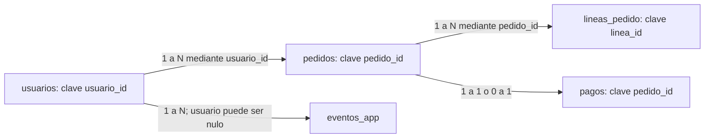

Un usuario puede tener muchos pedidos (1:N); cada pedido pertenece a un usuario si el negocio lo exige. Un pago puede ser 0:1 con pedido si hay pedidos iniciados pero no cobrados. Las relaciones describen una regla de negocio, no una forma de dibujo.

## Cardinalidad y tabla puente

- **1:1:** una fila A se asocia como máximo a una fila B; por ejemplo, pedido y comprobante de pago final si el sistema lo garantiza.
- **1:N:** un usuario puede tener N pedidos; cada pedido tiene un usuario.
- **N:M:** un pedido puede incluir N productos y un producto aparece en M pedidos. No se conecta directamente: `lineas_pedido` actúa como **tabla puente** con `pedido_id`, `producto_id`, cantidad y precio.

| pedido_id | producto_id | cantidad | precio_unitario_eur |
| --- | --- | ---: | ---: |
| P-100 | PR-7 | 1 | 20.00 |
| P-100 | PR-9 | 1 | 20.00 |
| P-102 | PR-7 | 2 | 32.50 |

La tabla puente no es una molestia técnica: conserva el grano «un artículo de un pedido» y permite responder unidades por producto sin repetir atributos del pedido.

## Join: combinar solo con una hipótesis verificable

Un **join** combina filas según una clave. Antes de ejecutarlo escribe: (1) grano de la tabla izquierda, (2) grano de la derecha, (3) cardinalidad esperada, (4) qué métrica se mantendrá. Si `pedidos` (uno por pedido) se une a `lineas_pedido` (varias por pedido), el resultado tendrá grano de línea, no de pedido.

Ejemplo: P-100 total 42 € y dos líneas. Tras el join aparecerá dos veces con 42 €. Sumar `total_eur` da 84 € para ese pedido: una multiplicación silenciosa. Para facturación, agrega las líneas por pedido primero o calcula la métrica en `pedidos` antes de unir dimensiones.

Un caso especialmente peligroso es unir dos tablas que tienen varias filas por `usuario_id` (eventos y pedidos). Si U-10 tiene 3 eventos y 2 pedidos, el join produce 6 filas. Esa tabla no representa ni eventos ni pedidos originales.

## Diccionario y contrato de datos

El **diccionario de datos** define el significado de cada columna. Un **contrato de datos** además expresa reglas compartidas entre quien produce y quien consume la fuente: esquema, grano, claves, actualización, valores válidos y responsable.

| Campo | Definición | Regla | Propietario |
| --- | --- | --- | --- |
| `pedido_id` | identificador estable de pedido | único, no nulo | Checkout |
| `creado_en_utc` | instante de creación en UTC | ISO 8601, no nulo | Plataforma |
| `total_eur` | importe cobrado, IVA incluido | >= 0; devolución separada | Pagos |
| `canal` | origen atribuido al pedido | `web`, `app`, `partner` | Growth |

Un contrato evita que «total» cambie de incluir a excluir IVA sin aviso. También permite investigar una incidencia: versión de fuente, momento de carga y responsable dejan **trazabilidad**.

## Error frecuente, resumen y comprobación

No des por única una clave por el nombre ni des por válida una relación por tener la misma columna. Comprueba nulos, duplicados y número de filas antes y después de cada join.

1. ¿Cuál es el grano del resultado de unir `pedidos` con `lineas_pedido`?
2. Da un ejemplo realista de relación N:M distinta de productos y pedidos.
3. ¿Qué regla del contrato impediría contar dos veces el mismo pedido?

Resuelve las preguntas de joins en [la práctica](../../../ejercicios/temario-01/comprension/auditoria-marketplace.md).

# 01.3 CSV, JSON y conversión a tablas analizables

## Objetivos y prerrequisitos

Sabrás leer un CSV y un JSON como archivos de texto, explicar sus diferencias operativas, reconocer separador, codificación y fechas, y convertir un JSON de pedidos en tablas con grano claro. Se parte de archivo y tabla, no de experiencia con programación.

## CSV: una tabla escrita línea a línea

Un **CSV** (*comma-separated values*) guarda una tabla como texto. La primera línea suele ser el encabezado; cada línea posterior, una fila. El nombre es histórico: en España es frecuente usar punto y coma para no confundir la coma decimal con el separador.

```text
pedido_id;creado_en_utc;total_eur;canal
P-100;2026-07-24T07:14:00Z;42,00;web
P-102;2026-07-24T18:22:00Z;65,00;app
```

Antes de tratarlo como tabla hay que acordar el **dialecto**: separador `;`, decimal `,`, codificación de caracteres (preferiblemente UTF-8), comillas para texto con separadores y formato de fecha. Si una herramienta espera coma como separador, puede leer toda la línea como una sola columna; si interpreta `42,00` en otro contexto, puede dejarlo como texto.

La fecha `2026-07-24T07:14:00Z` sigue ISO 8601: `Z` significa UTC. No la cambies a «hora local» sin declarar zona y regla de conversión.

## JSON: una ficha con estructura interna

Un archivo **JSON** (*JavaScript Object Notation*) también es texto, pero puede contener objetos y listas. Es habitual al recibir datos de una API: un servicio responde con una ficha de pedido que incluye al usuario y sus artículos.

```json
{
  "pedido_id": "P-100",
  "usuario": {"usuario_id": "U-10", "pais": "ES"},
  "items": [
    {"producto_id": "PR-7", "cantidad": 1, "precio_eur": 20.0},
    {"producto_id": "PR-9", "cantidad": 1, "precio_eur": 20.0}
  ],
  "total_eur": 42.0
}
```

No hay una única conversión correcta de JSON a CSV. El objeto principal se puede convertir en una fila de `pedidos`; `usuario.usuario_id` se extrae como una columna; cada elemento de `items` debe crear una fila de `lineas_pedido`. Repetir el pedido en cada línea es válido solo si declaramos que el resultado tiene grano de línea y no reutilizamos `total_eur` como si fuera un importe por línea.

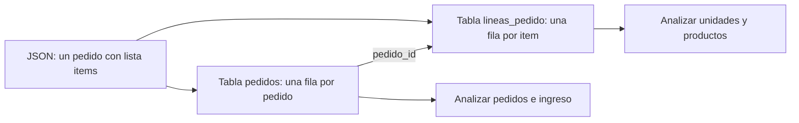

El objetivo de la conversión no es «aplanar todo»: es conservar significado y poder analizar cada pregunta con el grano correspondiente.

## Otros medios y elección razonada

Excel es una aplicación y un formato útil para revisión humana y casos pequeños, pero varias ediciones manuales sin historial dificultan reproducir un análisis. Parquet guarda datos por columnas y tipos de forma eficiente; suele usarse con herramientas de datos, no editándose a mano. Una base de datos mantiene datos compartidos con consultas, permisos y reglas; SQL, MongoDB o DynamoDB se verán más adelante con profundidad.

La elección responde a una necesidad: CSV para intercambio de tabla simple; JSON para respuestas estructuradas; Parquet para volúmenes tabulares y procesos analíticos; base de datos para operación concurrente. Ningún formato arregla un grano o una definición defectuosos.

## Contraejemplos y comprobación

No abras un CSV «a doble clic» y des por hecho que se interpretó bien. Verifica columnas, filas, tipos, caracteres como `ñ` y fechas. No conviertas una lista JSON en una sola celda para luego intentar contar productos.

1. ¿Qué separador y decimal usa el CSV del ejemplo?
2. ¿Qué dos tablas crearías a partir del JSON y cuál sería su clave de unión?
3. ¿Por qué `total_eur` no se debe sumar sin cuidado tras expandir `items`?

El laboratorio ejecutable muestra una conversión deliberadamente pequeña y auditable.

# 01.4 Contrato, calidad, privacidad y trazabilidad

## Objetivos y prerrequisitos

Aprenderás a convertir «revisar datos» en reglas observables, clasificar incidencias por severidad, investigar ausencias sin borrarlas por costumbre y limitar el uso de información personal. Requiere comprender grano, claves y formatos de las lecciones anteriores.

## Calidad no significa perfección

Un conjunto es de calidad suficiente si sirve para una decisión concreta con límites conocidos. Los pedidos de Mercado Faro pueden ser aptos para planificar empaquetado diario y no para estudiar satisfacción, porque no contienen opiniones. Antes de calcular una métrica, documenta qué debe ser cierto.

| Dimensión | Pregunta operativa | Regla de ejemplo |
| --- | --- | --- |
| Completitud | ¿faltan campos necesarios? | `pedido_id`, fecha y estado no nulos |
| Validez | ¿respetan formato y rango? | importe >= 0; fecha ISO 8601 |
| Consistencia | ¿la misma idea se codifica igual? | canal solo `web`, `app`, `partner` |
| Unicidad | ¿se repite indebidamente el hecho? | `pedido_id` único en pedidos |
| Actualidad | ¿llega a tiempo? | carga antes de 09:00 del día siguiente |

La calidad necesita responsable y reacción, no solo una lista. Una regla fallida se registra con fecha, fuente, número de filas afectadas, severidad, decisión y seguimiento: eso es **trazabilidad**.

## De regla a decisión: severidad y contrato

El contrato de datos de la lección 02 declara esquema, grano, reglas, propietario y frecuencia. Ahora añadimos severidad. Un `pedido_id` duplicado que infla ingresos es **crítico**: se bloquea el reporte. Un canal nuevo `affiliate` puede ser una advertencia: se aísla, se consulta a Growth y no se adivina a qué categoría pertenece. Una descripción de producto vacía quizá sea informativa y no impida el cálculo de pedidos.

¿Cómo se gobierna una incidencia sin esconderla bajo una limpieza automática?

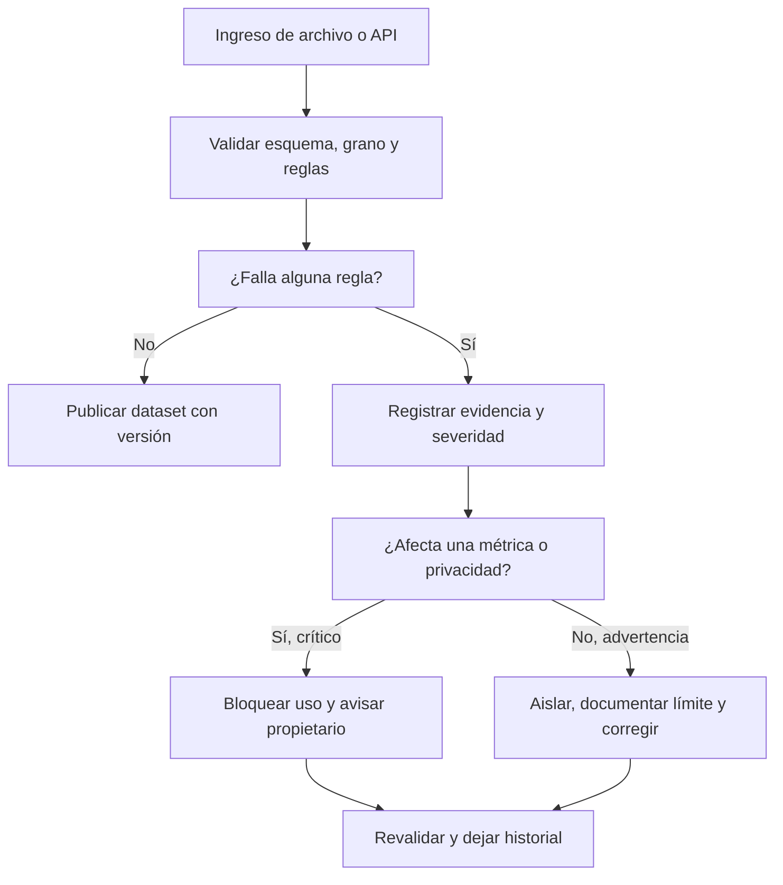

El flujo enseña que «limpiar» no equivale a borrar. Primero se preserva evidencia; después se decide una corrección reproducible.

## Ausencias, sesgo y cobertura

Un vacío puede significar «no aplica», «no se capturó», «falló el tracking» o «la persona no quiso responder». Si `pais` falta sobre todo en usuarios de la app antigua, eliminar esas filas altera la población y puede esconder un fallo técnico. Mide ausencia por fecha, versión, canal y segmento; declara quién queda fuera antes de concluir que un canal rinde peor.

El **sesgo de cobertura** aparece cuando la fuente representa peor a parte de la población. Observar que quienes activaron notificaciones compran más no prueba que activar notificaciones cause compras: pueden ser usuarios ya más interesados. Un analista separa observación, explicación posible y decisión que aún requiere evidencia.

## Privacidad: finalidad, minimización y retención

Los datos personales identificables (**PII**, por *personally identifiable information*) son datos que identifican o pueden ayudar a identificar a una persona, como correo, teléfono, dirección o combinaciones poco frecuentes. Para contar pedidos por canal no necesitamos el correo. Aplicamos:

- **Finalidad:** define para qué se usa cada campo antes de recogerlo o consultarlo.
- **Minimización:** usa solo los campos necesarios; sustituye identificadores por un ID interno cuando sea posible.
- **Acceso:** limita quién puede ver PII y no copies datos reales en notebooks, ejercicios o capturas.
- **Retención:** fija cuánto tiempo se conserva y cómo se elimina o anonimiza según la política y normativa aplicables.

Pseudonimizar no vuelve un conjunto automáticamente anónimo: un identificador sustituido aún puede relacionarse con una persona si existe la tabla de correspondencia o combinaciones reidentificables. Para decisiones legales o de tratamiento real, intervienen responsables de privacidad y la normativa vigente; el analista no debe improvisar permisos.

## Resumen y comprobación

Una métrica defendible exige grano, contrato y controles. La ausencia es un resultado que se investiga; calidad y privacidad son condiciones del análisis, no una fase administrativa final.

1. Clasifica como crítica, advertencia o informativa una fecha nula en un pedido pagado y justifica.
2. ¿Por qué borrar todos los nulos de `pais` puede sesgar una comparación por canal?
3. Para un dashboard de pedidos por canal, ¿qué PII puedes excluir?

Completa [la auditoría](../../../ejercicios/temario-01/comprension/auditoria-marketplace.md) y ejecuta el laboratorio antes de pasar a Python.

# Bloque 02 - Python desde cero: reglas verificables para eventos y pedidos

## Propósito y resultado de salida

Python es un lenguaje para expresar instrucciones que un ordenador puede repetir. En análisis no se aprende para "programar por programar": se usa para convertir una regla de negocio -por ejemplo, «un pedido confirmado debe tener importe positivo»- en un proceso visible, repetible y comprobable.

Al terminar, Leo podrá leer, escribir y depurar un programa pequeño que reciba eventos o pedidos, valide casos anómalos, calcule resultados y explique qué datos descartó y por qué. Aún no trabajará con miles de filas ni con Pandas: primero dominará las piezas que luego Pandas automatiza.

## Caso continuo: Lumen

Lumen es una app ficticia de comercio. Cada vez que una persona inicia o completa una compra se registra un **evento**: un pequeño diccionario con información como `tipo`, `usuario` e `importe`. Durante el bloque construiremos un auditor sencillo de pedidos: clasifica su estado, suma solo pedidos válidos y deja constancia de los errores. El caso permite ver que sintaxis, calidad de datos y decisión de negocio están unidas.

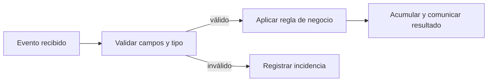

El mismo esquema aparecerá después en un notebook y, con estructuras más potentes, en Pandas. No se debe «arreglar» silenciosamente un evento: que sea inválido es información útil para producto e ingeniería.

## Prerrequisitos y forma de estudio

Solo se presupone haber visto qué es un dato y una tabla en los bloques 00-01. Puede usarse [Google Colab](https://colab.research.google.com/) desde un navegador: crea un notebook, pega una celda, ejecútala y observa la salida. Un **notebook** mezcla texto, código y resultados; un **script** es un archivo `.py` que se ejecuta completo. Ambos usan Python; se elige notebook para explorar y script para repetir un proceso estable.

En cada lección: copia el ejemplo, predice su salida, ejecútalo, cambia un valor y explica qué regla se ha modificado. No avances si un mensaje de error aún parece misterioso: la lección 05 enseña a convertirlo en una pista.

## Lecciones

1. [Entorno, valores, variables y expresiones](lecciones/01-entorno-valores-y-variables.md)
2. [Colecciones: pedidos, copias y estructura anidada](lecciones/02-colecciones-y-datos-sencillos.md)
3. [Condiciones, operadores lógicos y bucles seguros](lecciones/03-condiciones-y-bucles.md)
4. [Funciones, contratos, módulos y alcance](lecciones/04-funciones-y-alcance.md)
5. [Errores, pruebas y depuración basada en evidencia](lecciones/05-errores-y-depuracion.md)
6. [Laboratorio: auditoría reproducible de pedidos](lecciones/06-estilo-y-practica-gastos.md)

## Práctica verificable

1. Lee el [laboratorio ejecutable de Lumen](../../notebooks/practicas/02-auditoria-pedidos.py). Puedes pegarlo por secciones en Colab o ejecutarlo con `python notebooks/practicas/02-auditoria-pedidos.py`.
2. Resuelve [la auditoría de pedidos](../../ejercicios/temario-02/aplicacion/gastos-personales.md) antes de mirar la [solución razonada](../../soluciones/temario-02/gastos-personales.md).
3. El notebook histórico de gastos queda como práctica adicional, pero el caso de Lumen es la evaluación recomendada porque incluye entradas inválidas, límites y salidas esperadas.

## Criterio de dominio

No basta con que el código «no falle». Debes poder señalar la entrada, la salida, la regla y al menos un caso límite para cada función. Si no sabes qué haría tu programa con `None`, un importe como texto, una lista vacía o un pedido exactamente en el umbral, todavía no está listo para automatizar decisiones.

# 01 - Entorno, valores, variables y expresiones

## Resultado observable y prerrequisitos

Al finalizar podrás ejecutar una celda, predecir el resultado de una expresión y guardar cada resultado con un nombre que explique qué representa. No se requiere experiencia programando.

## Del dato a una regla ejecutable

Imagina que Lumen recibe un pedido de 42,50 euros. Antes de hablar de «variables», mira una operación mínima:

```python
42.50 * 1.21
```

Python evalúa esa **expresión** y devuelve `51.425`. Una expresión combina valores y operadores para producir otro valor. Para análisis, conviene dar un significado a cada parte:

```python
importe_sin_iva = 42.50
TIPO_IVA = 0.21
importe_con_iva = importe_sin_iva * (1 + TIPO_IVA)
print(importe_con_iva)
```

Una **variable** es un nombre que referencia un valor; `=` es una asignación, no una igualdad matemática. La constante en mayúsculas comunica una convención humana: no debería cambiar durante el cálculo. Python no impide modificarla, por lo que la revisión sigue siendo necesaria.


El diagrama recuerda que un nombre no convierte un dato en correcto: solo hace visible qué creemos que representa.

## Tipos y operadores

Los tipos básicos son entero (`3`, `int`), decimal (`3.5`, `float`), texto (`"web"`, `str`), booleano (`True` / `False`, `bool`) y ausencia explícita (`None`). `type(valor)` permite inspeccionarlos. Los operadores aritméticos incluyen `+`, `-`, `*`, `/` y `%` (resto); los comparadores `==`, `!=`, `<`, `<=`, `>` y `>=` producen booleanos.

```python
canal = "web"
importe = 42.50
es_web = canal == "web"
es_importe_positivo = importe > 0
print(es_web, es_importe_positivo)  # True True
```

`"42.50" + "10"` da `"42.5010"`: une texto. No conviertas un dato a `float` por reflejo; primero confirma que la fuente define ese texto como número y qué moneda usa.

## Notebook, script y estado de ejecución

En un notebook ejecutas celdas en cualquier orden. Si ejecutas una celda que usa `importe` antes de aquella que lo crea, aparecerá `NameError`. En un script, Python lee las líneas de arriba abajo cada vez. Para aprendizaje, un notebook facilita experimentar; para una auditoría repetible, un script evita depender del orden oculto de clics.

## Micropráctica

1. Predice y ejecuta `7 // 2`, `7 / 2` y `7 % 2`.
2. Crea `importe = "42.50"`. Compara `type(importe)` con `type(42.50)` y explica por qué no deben sumarse directamente.
3. Guarda `importe_original` y `importe_con_descuento` en nombres distintos. ¿Qué valor podrías auditar si sobrescribieras el primero?

## Error frecuente y resumen

Evita nombres como `x` o `dato` cuando `importe_bruto` explica el significado. Tampoco confundas `=` con `==`: el primero guarda; el segundo compara. En la próxima lección varios valores formarán un pedido y una colección de eventos.

# 02 - Colecciones: pedidos, copias y estructura anidada

## Resultado observable y prerrequisitos

Al finalizar sabrás elegir lista, tupla, conjunto o diccionario para representar eventos de Lumen; accederás sin perder de vista índices, claves, copias y mutabilidad. Requiere valores y tipos de la lección 01.

## Un pedido tiene partes; una colección conserva relaciones

Un diccionario asocia una **clave** con su valor. Una lista conserva una secuencia ordenada. Juntos pueden representar pedidos recibidos:

```python
pedido = {"id": "p-101", "canal": "web", "importe": 42.50, "etiquetas": ["nuevo", "promo"]}
pedidos = [pedido, {"id": "p-102", "canal": "app", "importe": 18.00, "etiquetas": []}]
print(pedidos[0]["importe"])  # 42.5
```

`pedidos[0]` significa «primer elemento» porque Python empieza a contar desde cero. `pedido["importe"]` usa una clave, no una posición. El anidamiento (`lista` dentro de `dict`) se parece a una respuesta JSON de una API; todavía no es una tabla, pero ya obliga a preguntar qué campos son obligatorios.

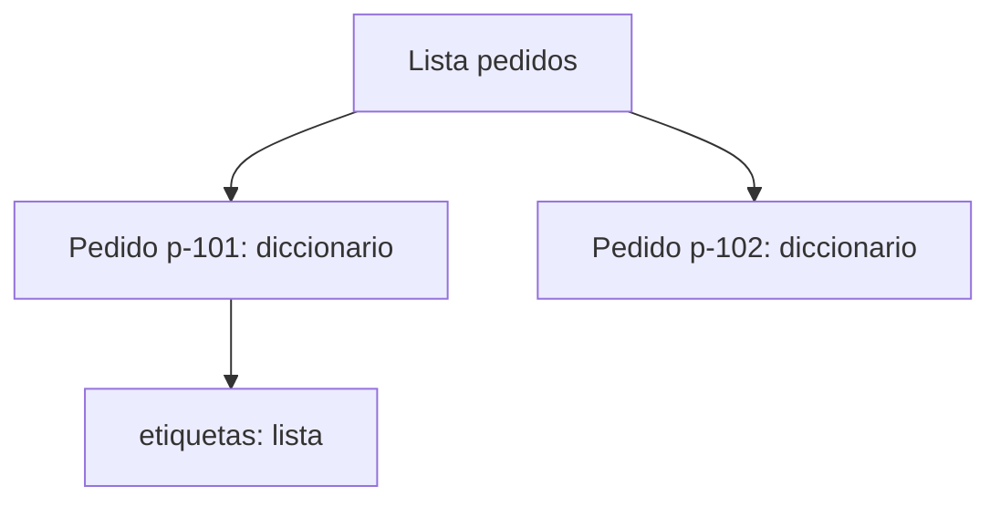

La relación no es una secuencia: un pedido tiene varios campos y una lista contiene varios pedidos.

## Cuatro colecciones y su propósito

| Colección | Ejemplo | Mantiene orden | Se puede modificar | Uso razonable |
| --- | --- | --- | --- | --- |
| Lista `[]` | `["web", "app"]` | Sí | Sí | Eventos o resultados en orden. |
| Tupla `()` | `("EUR", 2)` | Sí | No | Configuración que no debe cambiar. |
| Conjunto `set()` | `{ "web", "app" }` | No prometido | Sí | Valores únicos, por ejemplo canales observados. |
| Diccionario `{}` | `{"importe": 42.5}` | Claves accesibles por nombre | Sí | Un registro con campos. |

Un conjunto elimina duplicados: `set(["web", "web", "app"])` contiene dos canales. No lo uses si necesitas conservar cada evento: que dos pedidos compartan canal no los vuelve duplicados.

## Slicing, mutabilidad y copias

El *slicing* toma una parte: `pedidos[0:2]` incluye posiciones 0 y 1; el extremo final no entra. Las listas y diccionarios son **mutables**: se pueden alterar después de crearse. Por eso esta aparente copia es peligrosa:

```python
original = {"id": "p-101", "etiquetas": ["nuevo"]}
alias = original
alias["etiquetas"].append("revisar")
print(original["etiquetas"])  # también cambia
```

`alias` y `original` apuntan al mismo objeto. `original.copy()` copia solo el nivel exterior; para datos anidados usa `copy.deepcopy` cuando de verdad necesites independizar todos los niveles. Antes de copiar masivamente, pregunta si modificar el original es parte de la regla o un error.

```python
from copy import deepcopy
pedido_limpio = deepcopy(original)
pedido_limpio["etiquetas"].append("auditable")
```

## Microprácticas y límites

1. Crea tres pedidos y obtén los dos últimos con slicing.
2. Obtén los canales únicos con un conjunto. ¿Por qué el resultado no prueba cuántos pedidos hubo?
3. Prueba `pedido["descuento"]`: aparecerá `KeyError`. Después usa `pedido.get("descuento")` y explica la diferencia entre «no existe» y un descuento igual a cero.
4. Haz una copia profunda de un pedido con etiquetas, modifica la copia y verifica que el original no cambia.

No uses `get("importe", 0)` sin acordar su significado: sustituir ausencia por cero puede esconder un fallo de instrumentación. En la siguiente lección decidirás qué hacer con cada pedido mediante condiciones y bucles.

# 03 - Condiciones, operadores lógicos y bucles seguros

## Resultado observable y prerrequisitos

Aplicarás una regla explícita a cada pedido, distinguiendo estados, y repetirás el proceso sin perder eventos. Requiere listas y diccionarios.

## Una regla de negocio tiene bordes

Lumen considera revisable un pedido si su importe es al menos 100 EUR **y** está confirmado. Antes de codificar, decide qué pasa en los límites: 100 entra; 99,99 no; un importe desconocido no se aprueba automáticamente.

```python
importe = 100
estado = "confirmado"

if importe >= 100 and estado == "confirmado":
    accion = "revisar"
elif estado != "confirmado":
    accion = "esperar confirmacion"
else:
    accion = "operacion normal"
```

`if` evalúa una condición, `elif` ofrece una alternativa y `else` cubre el resto. La sangría define qué instrucciones pertenecen a cada rama. Los operadores `and`, `or` y `not` combinan condiciones: `and` exige ambas verdaderas; `or` basta con una; `not` invierte. Usa paréntesis cuando mezcles condiciones para que la prioridad sea legible.

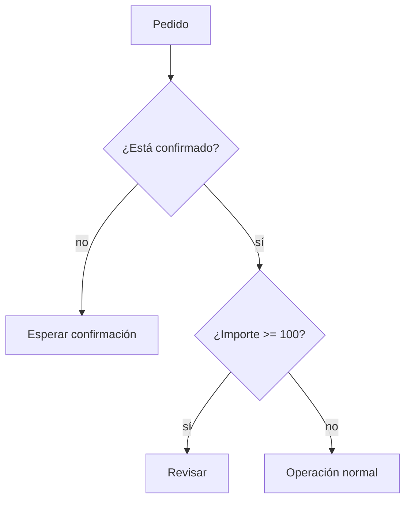

El orden de las preguntas importa: comparar un importe ausente antes de validar el estado o el tipo puede provocar un error o una decisión falsa.

## Repetir: `for` cuando conoces la colección, `while` cuando esperas una condición

Un `for` visita cada elemento de una lista. Para sumar solo confirmados, se usa un acumulador que empieza en cero:

```python
total_confirmado = 0
for pedido in pedidos:
    if pedido["estado"] == "confirmado":
        total_confirmado += pedido["importe"]
```

Un `while` repite mientras una condición sea verdadera. Es útil, por ejemplo, para reintentar una petición con límite; sin actualizar el contador puede no terminar nunca.

```python
intentos = 0
MAX_INTENTOS = 3
while intentos < MAX_INTENTOS:
    intentos += 1
    print(f"Intento {intentos}")
```

No uses `while True` en un primer programa salvo que haya una salida clara (`break`) y una razón documentada. Para recorrer una lista de pedidos, `for` expresa mejor la intención.

## `break`, `continue` y no modificar la lista recorrida

`continue` salta al siguiente elemento; `break` termina el bucle. Pueden ser correctos, pero un `break` tras el primer pedido inválido puede impedir auditar los demás. En análisis suele ser preferible guardar incidencias y continuar cuando el problema es local.

```python
validos = []
incidencias = []
for pedido in pedidos:
    if not isinstance(pedido.get("importe"), (int, float)):
        incidencias.append(pedido.get("id", "sin_id"))
        continue
    validos.append(pedido)
```

No borres elementos de `pedidos` dentro del `for`: puedes saltarte posiciones. Construye `validos` y `incidencias`; así también conservas evidencia de la calidad de origen.

## Microprácticas

1. Clasifica importes 99, 100 y 101. Explica por qué `>` no cumple la regla acordada.
2. Añade un pedido cancelado y otro con `importe=None`. Diseña qué lista debe recibir cada uno y justifica tu decisión.
3. Escribe un `while` de tres intentos y provoca deliberadamente el error de no incrementar el contador; no lo ejecutes sin un límite.
4. Recorre una lista y crea otra solo con canales `web` o `app`. ¿Cuándo usarías `or`?

Las condiciones hacen visibles decisiones; las funciones de la próxima lección impedirán repetir esas decisiones de manera inconsistente.

# 04 - Funciones, contratos, módulos y alcance

## Resultado observable y prerrequisitos

Crearás funciones pequeñas con entradas, salida y casos límite definidos; usarás argumentos opcionales, `return`, docstrings y comprobaciones. Requiere condiciones y bucles.

## Una función es un contrato comprobable

Repetir `if importe >= 100` en varias celdas invita a que cada copia use un límite diferente. Una función nombra la regla y publica su contrato: qué acepta, qué devuelve y qué no hace.

```python
def clasificar_importe(importe, limite=100):
    """Devuelve 'alto' si importe es numérico y alcanza limite; si no, devuelve 'invalido'."""
    if not isinstance(importe, (int, float)):
        return "invalido"
    if importe >= limite:
        return "alto"
    return "normal"
```

`importe` y `limite` son parámetros. `limite=100` es un argumento opcional: la persona que llama puede usar el valor por defecto o indicar otro. `return` entrega un resultado y termina la función; `print` solo lo muestra en pantalla. Por eso una función analítica debe normalmente devolver datos y dejar que otra parte decida cómo presentarlos.

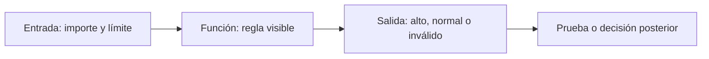

## Pruebas mínimas: normal, límite y dato inválido

Un ejemplo no demuestra que una regla funcione. Comprueba al menos un caso normal, el borde y una entrada inválida:

```python
assert clasificar_importe(99) == "normal"
assert clasificar_importe(100) == "alto"
assert clasificar_importe("100") == "invalido"
assert clasificar_importe(150, limite=200) == "normal"
```

`assert` detiene la ejecución si la afirmación es falsa. No sustituye una suite profesional de tests, pero impide confiar en una salida bonita sin comprobar la regla. Un `AssertionError` es evidencia de que la expectativa y el código no coinciden.

## Alcance y efectos secundarios

Los nombres creados dentro de una función son locales. Pasar datos como parámetros hace visible de qué depende la regla:

```python
LIMITE_GLOBAL = 100

def es_revisable(importe, limite):
    return importe >= limite
```

Evita que `es_revisable` lea `LIMITE_GLOBAL` sin recibirlo: cambiar una variable global en otra celda podría alterar resultados sin que la llamada lo muestre. Evita además modificar una lista recibida salvo que el contrato lo anuncie; es preferible devolver una nueva estructura o documentar el efecto.

## Módulos, imports, script y notebook

Un **módulo** es un archivo Python que contiene funciones reutilizables. `import math` carga un módulo de la biblioteca estándar; `from math import ceil` importa un nombre concreto. No nombres tu archivo `math.py`, porque ocultaría el módulo oficial. Un script puede proteger su ejecución principal:

```python
def main():
    print(clasificar_importe(120))

if __name__ == "__main__":
    main()
```

Al ejecutar el archivo directamente se llama a `main`; al importarlo desde otro archivo se obtienen las funciones sin ejecutar el informe. Un notebook es útil para explorar; un módulo reduce copias cuando una regla ya está estable.

## Microprácticas y resumen

1. Cambia el límite por defecto a 75 y prueba una llamada que lo sobrescriba.
2. Escribe `es_pedido_valido(pedido)` que devuelva `True` solo si contiene id, importe numérico positivo y estado confirmado.
3. Añade tres `assert` antes de confiar en ella.
4. Explica qué diferencia hay entre devolver una lista y hacer `print(lista)`.

Una función clara permite localizar fallos. La próxima lección enseña a distinguir los errores que Python señala y los resultados erróneos que Python no puede adivinar.

# 05 - Errores, pruebas y depuración basada en evidencia

## Resultado observable y prerrequisitos

Sabrás leer el final de un traceback, aislar un fallo, distinguir errores de sintaxis y de datos, y manejar solo excepciones esperadas. Requiere haber ejecutado funciones sencillas.

## El traceback es un mapa, no una acusación

Un **traceback** es la ruta de llamadas que Python muestra cuando no puede continuar. La última línea nombra normalmente el tipo y la causa inmediata. Léela primero, luego vuelve a la línea de tu código indicada.

| Error | Ejemplo típico | Pregunta útil |
| --- | --- | --- |
| `SyntaxError` | Falta `:` o paréntesis | ¿Python puede interpretar el programa? |
| `NameError` | Usar `importe` antes de asignarlo | ¿Ejecuté la definición y escribí el nombre igual? |
| `IndexError` | `pedidos[3]` en lista de tres | ¿Existe esa posición? |
| `KeyError` | `pedido["importe"]` sin clave | ¿El contrato exige ese campo? |
| `ValueError` | `float("cuarenta")` | ¿El valor tiene forma válida para esa conversión? |
| `TypeError` | `"42" + 5` | ¿Las operaciones son compatibles con los tipos? |

Un programa puede no lanzar excepciones y aun así estar equivocado: usar `>` en lugar de `>=` en el umbral de Lumen cambia la clasificación de 100 EUR sin que Python proteste. Por eso se combinan traceback y pruebas de casos límite.

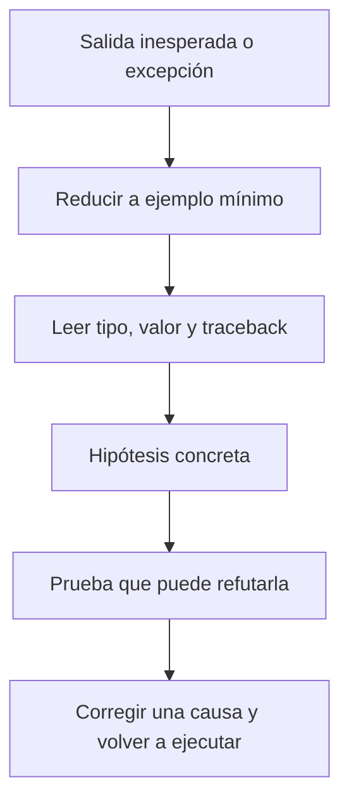

La corrección se hace después de entender la causa; cambiar cinco líneas a la vez impide saber cuál resolvió el problema.

## Validar cerca de la entrada

El laboratorio recibe eventos de una fuente simulada. Conviene transformar o rechazar un valor justo al llegar, no cuando el total ya es extraño:

```python
def leer_importe(pedido):
    try:
        importe = float(pedido["importe"])
    except KeyError as error:
        raise ValueError("El pedido no contiene importe") from error
    except (TypeError, ValueError) as error:
        raise ValueError("El importe debe ser numérico") from error
    if importe <= 0:
        raise ValueError("El importe debe ser positivo")
    return importe
```

Capturamos excepciones concretas porque son esperables en esta frontera. `except Exception: pass` sería mala práctica: silencia también problemas de programación y puede dejar un informe incompleto sin aviso. La excepción se traduce a un mensaje de negocio, pero se conserva la causa con `from error`.

## `assert` y registro de incidencias

Usa `assert` para afirmar un comportamiento que el programador espera durante desarrollo. Para datos que vienen de fuera, una excepción controlada o una incidencia suele ser mejor que detener toda la auditoría:

```python
incidencias = []
for pedido in pedidos:
    try:
        importe = leer_importe(pedido)
    except ValueError as error:
        incidencias.append({"id": pedido.get("id", "sin_id"), "motivo": str(error)})
        continue
```

Esto no «arregla» el origen. Permite calcular un total de pedidos válidos y comunicar cuántos se excluyeron. Un analista debe informar ambos números; de lo contrario, la cifra parece más precisa de lo que es.

## Microprácticas

1. Provoca un `SyntaxError` eliminando dos puntos tras `if`; restaura el código y explica qué esperaba Python.
2. Crea una lista con dos pedidos e intenta acceder a `pedidos[2]`. ¿Por qué es `IndexError` y no `KeyError`?
3. Haz que `leer_importe({"importe": "--"})` lance `ValueError`; comprueba el mensaje.
4. Escribe un `assert` para el borde: un importe 0 no es válido.

Depurar consiste en producir evidencia sobre una hipótesis. En el laboratorio final reunirás datos válidos, incidencias, pruebas y una salida que otra persona pueda revisar.

# 06 - Laboratorio: auditoría reproducible de pedidos

## Resultado observable y prerrequisitos

Construirás y ejecutarás una auditoría pequeña de Lumen: entradas simuladas, reglas explícitas, incidencias, totales y pruebas. Requiere las cinco lecciones anteriores.

## El problema operativo

Producto quiere conocer el importe confirmado del día. Ingeniería advierte que algunos eventos llegan con texto en lugar de número, importe cero o estado inesperado. Informar únicamente un total sería engañoso: también hay que comunicar qué quedó fuera y por qué.

El [laboratorio ejecutable](../../../notebooks/practicas/02-auditoria-pedidos.py) separa cuatro responsabilidades:

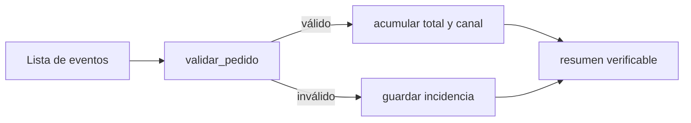

Separar funciones no es estética: permite probar la validación sin depender de la presentación del resumen.

## Lectura guiada del laboratorio

Primero observa `PEDIDOS_DEMO`. Es una lista deliberadamente pequeña con pedidos correctos, un importe de texto convertible, un importe cero, una clave ausente y un pedido cancelado. Después ejecuta las pruebas `assert`: si una falla, no continúes al resumen; la regla ha cambiado o está mal implementada.

La función `validar_pedido` devuelve una copia normalizada del pedido válido o lanza `ValueError` con una explicación. `auditar_pedidos` no oculta la excepción: la convierte en una incidencia con id y motivo. La salida esperada de los datos demo es:

```text
Pedidos válidos confirmados: 2
Importe confirmado: 160.50 EUR
Por canal: {'web': 120.5, 'app': 40.0}
Incidencias: 4
```

El pedido cancelado aparece como incidencia porque este informe tiene el contrato «solo confirmados». En otro informe podría contarse como estado separado; no hay una respuesta universal, sí debe haber una definición visible.

## Estilo que protege el análisis

- Usa nombres que expresen unidad y significado: `importe_confirmado`, no `resultado`.
- Declara límites (`LIMITE_REVISION = 100`) en lugar de números mágicos repartidos.
- No mezcles lectura, validación, cálculo y `print` en un bucle enorme.
- Devuelve datos desde las funciones; imprime solo en el borde del programa.
- Conserva incidencias y recuentos. Un valor excluido sin rastro es una fuga de trazabilidad.

No basta con que una salida coincida una vez. Cambia un pedido demo para que valga 100, añade un canal nuevo y prueba una lista vacía. El programa debe responder de forma definida, no por accidente.

## Ejercicio de cierre

Resuelve [Auditoría de pedidos de Lumen](../../../ejercicios/temario-02/aplicacion/gastos-personales.md). Incluye un estado adicional y un límite de revisión; luego compara tu razonamiento con la [solución](../../../soluciones/temario-02/gastos-personales.md). Si estudias desde móvil, copia por partes el script en Colab o redacta primero el contrato de cada función, sus entradas y salidas esperadas.

## Puente a NumPy y Pandas

Aquí recorres una lista pedido por pedido para comprender el control. NumPy y Pandas aplicarán operaciones parecidas a muchas filas, pero las preguntas no desaparecen: ¿qué es válido?, ¿qué se excluyó?, ¿qué significa cero?, ¿puedo reproducir el resultado? Lleva estas preguntas al bloque 04 y, especialmente, al bloque 05.

# Bloque 03 - Matemáticas aplicadas al análisis

## Por qué este bloque existe

Un analista no estudia matemáticas para repetir fórmulas: las utiliza para no confundir una mejora pequeña con una grande, sumar cantidades incompatibles o recomendar una decisión sobre una comparación injusta. Este bloque acompaña un caso continuo: **Nexo**, una aplicación de reparto. Su equipo quiere saber si el aumento de pedidos está mejorando realmente el negocio y si hace falta más capacidad de reparto.

Leo necesita primero poder leer una cifra con seguridad. Después usará estas ideas con NumPy, Pandas, EDA, estadística y series temporales. Si ya manejas matemática universitaria, puedes saltar la demostración elemental, pero no los supuestos, unidades, contraejemplos ni decisiones del caso.

## Resultados observables

Al completar el bloque podrás:

- declarar qué mide una cifra, en qué unidad, sobre qué población y periodo;
- calcular e interpretar cambios absolutos, porcentajes, tasas y puntos porcentuales sin cambiar la base de comparación;
- resumir datos con media, mediana, percentiles, IQR y desviación estándar, explicando cuándo cada resumen engaña;
- construir agregaciones y medias ponderadas que respeten el grano del dato;
- usar una función, vector o matriz como modelo sencillo de un problema de IT;
- comparar tiempo, crecimiento, ventanas y granularidades sin mezclar periodos.

## Prerrequisitos y ruta

No presupone programación. Se usa una **tabla** como una lista ordenada de registros: cada fila representa una observación y cada columna una propiedad. Por ejemplo, una fila puede ser el resumen de pedidos de un día. Los cálculos se muestran a mano primero y después se automatizan en el laboratorio.

## Lecciones

1. [Magnitudes, unidades, porcentajes y tasas](lecciones/01-magnitudes-porcentajes-y-tasas.md)
2. [Describir una distribución: centro, dispersión y percentiles](lecciones/02-descriptiva-y-distribuciones.md)
3. [Ponderación, agregación y el grano del dato](lecciones/03-ponderacion-agregacion-y-grano.md)
4. [Funciones y modelos sencillos para decisiones](lecciones/04-funciones-y-modelos.md)
5. [Vectores, matrices y cálculo por lotes](lecciones/05-vectores-matrices-y-numpy.md)
6. [Tiempo, granularidad, crecimiento y ventanas](lecciones/06-tiempo-granularidad-y-ventanas.md)

## Práctica y laboratorio

- [Caso integrador: capacidad y crecimiento de Nexo](../../ejercicios/temario-03/aplicacion/caso-nexo-capacidad.md)
- [Solución razonada](../../soluciones/temario-03/caso-nexo-capacidad.md)
- [Laboratorio reproducible](../../notebooks/practicas/03-matematicas-nexo.py)

## Criterio de salida

No basta con obtener un número. Una respuesta se considera defendible cuando explica unidad, denominador, periodo, granularidad, tratamiento de ausencias y qué conclusión permite - y cuál no permite.

# 01. Magnitudes, unidades, porcentajes y tasas

## Objetivo y prerrequisitos

Al terminar distinguirás una cantidad, su unidad y su referencia; calcularás cambio absoluto, relativo, tasa y puntos porcentuales. Basta con aritmética básica. Una **magnitud** es algo medible (pedidos, euros, minutos); su **unidad** expresa cómo se cuenta (pedidos, EUR, minutos).

## El problema antes de la fórmula

El lunes Nexo recibe 1.200 pedidos y el martes 1.320. Decir solamente "subieron 120" no dice si se trata de pedidos, euros o minutos, ni frente a qué periodo se compara. La descripción mínima es: *pedidos confirmados por día, España, martes frente a lunes*. Esa frase funciona como contrato de la cifra.

| Día | Pedidos confirmados | Facturación | Tiempo medio de entrega |
| --- | ---: | ---: | ---: |
| Lunes | 1.200 pedidos | 24.000 EUR | 31 min |
| Martes | 1.320 pedidos | 26.400 EUR | 36 min |

El cambio absoluto de pedidos es `1.320 - 1.200 = +120 pedidos`. El cambio relativo usa una **base**: `(1.320 - 1.200) / 1.200 = 0,10 = 10 %`. El primero ayuda a prever repartidores; el segundo compara mercados de distinto tamaño.

Este esquema responde: "¿qué hay que fijar antes de comparar?"

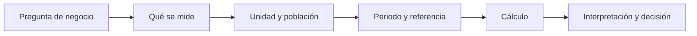

Sin población y periodo, el mismo número puede tener significado opuesto. Un incremento de 120 pedidos diarios sí exige revisar capacidad; 120 pedidos más en todo un año quizá no.

## Porcentaje, tasa y puntos porcentuales

Una **proporción** es una parte dividida entre un total compatible. Si 66 de 1.320 pedidos terminan cancelados, la tasa de cancelación es `66 / 1.320 = 5 %`. Una **tasa** relaciona dos cantidades con un denominador explícito: pedidos por hora, incidencias por 1.000 pedidos o conversiones por visita.

Si la conversión pasa de 3 % a 5 %, aumenta **2 puntos porcentuales (pp)**, porque `5 % - 3 % = 2 pp`. Relativamente aumenta `(5 - 3) / 3 = 66,7 %`. Ambas formas son correctas y responden a preguntas distintas. Nunca llames "2 %" a los 2 pp: borra la base y puede inducir a error.

### Ejemplo trabajado: ¿creció el negocio?

Nexo pasa de 1.200 a 1.320 pedidos y de 24.000 a 26.400 EUR. El valor medio por pedido es `24.000 / 1.200 = 20 EUR` ambos días. Facturación y pedidos crecen al 10 %, no porque cada pedido valga más sino porque entran más pedidos. A la vez, el tiempo de entrega aumenta 5 min, un empeoramiento absoluto de 5 min y relativo de `5 / 31 = 16,1 %`. Una presentación honesta contiene ambos lados.

## Unidades, dimensiones y conversiones

Una **dimensión** describe la clase física o lógica de una cantidad: dinero, tiempo, pedidos o personas. Solo se suman magnitudes de la misma dimensión: `24.000 EUR + 26.400 EUR` tiene sentido; `1.320 pedidos + 36 min`, no. Dividir sí crea una tasa: `1.320 pedidos / 24 horas = 55 pedidos/hora`.

Convierte antes de operar. Si una fuente usa minutos y otra segundos, `36 min = 2.160 s`. Mezclar moneda, IVA incluido/no incluido o zonas horarias produce errores que una fórmula correcta no arregla.

## Límites y errores frecuentes

- Un descenso del 20 % tras un aumento del 20 % no vuelve al origen: `100 × 1,20 × 0,80 = 96`. Los porcentajes usan bases diferentes.
- Una tasa con denominador cero no se define. No sustituyas por 0 sin marcarlo: quizá no hubo visitas o falta el dato.
- Un 100 % sobre dos observaciones puede ser poco relevante. Comunica también el numerador y denominador.
- La tasa no demuestra causa. Una conversión mayor durante una campaña no prueba que la campaña la haya causado.

## Resumen y comprobación

1. ¿Qué especificarías antes de publicar "la conversión subió"?
2. Si pasa de 8 % a 10 %, ¿cuántos pp y qué crecimiento relativo representa?
3. ¿Por qué `pedidos/día` y `pedidos totales` no responden igual a capacidad?

Continúa con [cómo resumir muchos días sin ocultar variabilidad](02-descriptiva-y-distribuciones.md).

# 02. Describir una distribución: centro, dispersión y percentiles

## Resultado observable

Podrás resumir los tiempos de entrega de Nexo sin confundir un día típico con un día problemático. Conocerás media, mediana, percentiles, rango intercuartílico (IQR) y desviación estándar; no necesitas estadística previa.

## De una lista a una pregunta operativa

Una **distribución** es el conjunto de valores que toma una variable y la frecuencia con que aparece. Nexo observa los minutos de entrega de siete pedidos: `22, 24, 25, 26, 27, 28, 80`. La lista no es cómoda para una reunión; resumirla permite responder "¿qué experiencia recibe la mayoría?" y "¿hay colas extremas?".

La **media** suma y divide por el número de valores: `232 / 7 = 33,1 min`. La **mediana** es el valor central al ordenar: `26 min`. El pedido de 80 minutos arrastra la media, pero no la mediana. Ninguno de los dos números es "el correcto" fuera de contexto: la media sirve para estimar minutos totales de capacidad; la mediana describe mejor una entrega típica cuando existen extremos.

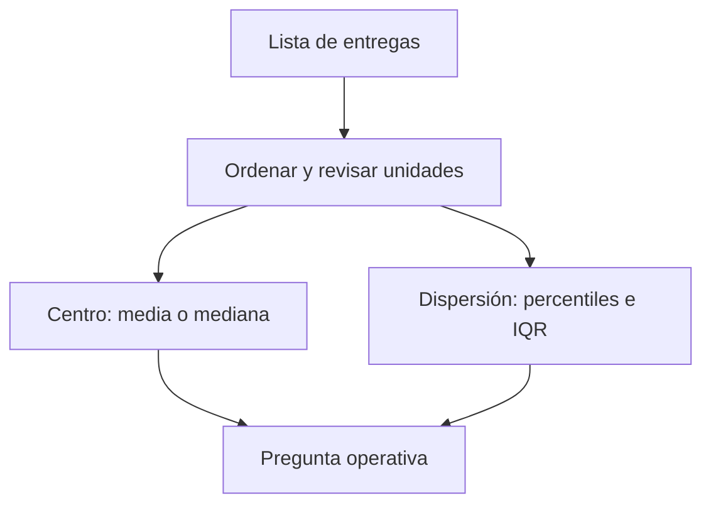

El diagrama separa dos preguntas. Un centro alto puede deberse a que todos empeoran o a unos pocos pedidos muy tardíos; la dispersión lo aclara.

## Percentiles e IQR

Un **percentil p** deja aproximadamente el `p %` de observaciones por debajo. Si el p90 de entrega es 45 min, nueve de cada diez pedidos se entregan en 45 minutos o menos; no significa que el 90 % tarde exactamente 45. El p50 coincide con la mediana. El p25 y p75 delimitan la mitad central; `IQR = p75 - p25` es el rango intercuartílico.

Para una muestra grande de Nexo, `p25=24`, `p50=29`, `p75=38`, `p90=52`. El IQR es `14 min`. Producto puede prometer una experiencia típica cercana a 29 min, mientras Operaciones investiga por qué el 10 % más lento supera 52 min. Publicar solo una media de 31 min ocultaría este riesgo.

## Desviación estándar, con cautela

La **varianza** mide la distancia media cuadrática al promedio; la **desviación estándar** es su raíz y vuelve a la unidad original. Si la media es 30 min y la desviación estándar es 2 min, los tiempos son mucho más homogéneos que con 15 min. Pero esa lectura de "media ± desviación" es especialmente interpretable si la distribución es aproximadamente simétrica y sin colas graves. En entregas con retrasos extremos, percentiles e IQR suelen comunicar mejor el servicio.

No uses un valor atípico automáticamente como error. Un pedido de 80 min puede ser una tormenta, una dirección errónea o un fallo de registro. Primero conserva su identificador, revisa la causa y decide si se analiza por separado.

## Segmentos y comparabilidad

Una distribución agregada puede mezclar centros urbanos y rurales. Si Madrid tiene mediana 26 min y una zona periférica 42 min, una mediana nacional de 29 min no responde qué debe arreglar cada equipo. Segmenta solo cuando la variable cambia la decisión, manteniendo suficientes observaciones y el mismo periodo.

## Resumen y comprobación

- Media: carga/coste promedio; sensible a extremos.
- Mediana y percentiles: experiencia típica y cola de servicio.
- IQR/desviación: variabilidad, no causalidad.

1. ¿Qué usarías para un SLA: media o p90, y por qué?
2. ¿Puede bajar la media mientras empeora p90? Describe un caso.
3. ¿Qué comprobarías antes de borrar un valor de 80 min?

La siguiente lección explica cómo resumir grupos sin dar a cada fila el mismo peso por error.

# 03. Ponderación, agregación y el grano del dato

## Objetivo

Sabrás elegir el denominador y el peso de un resumen. El **grano** indica qué representa una fila: un pedido, un día, una ciudad o un cliente. Agregar sin saberlo puede duplicar o diluir información.

## La falsa media de tasas

Nexo compara conversión por ciudad:

| Ciudad | Visitas | Pedidos | Conversión |
| --- | ---: | ---: | ---: |
| A | 100 | 15 | 15 % |
| B | 10.000 | 800 | 8 % |

La media simple `(15 % + 8 %) / 2 = 11,5 %` trata ambas ciudades como si tuvieran igual exposición. La conversión global correcta es `815 / 10.100 = 8,07 %`. Una **media ponderada** multiplica cada valor por un **peso** adecuado y divide por la suma de pesos: `(0,15×100 + 0,08×10.000) / 10.100`.

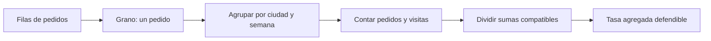

La regla práctica es sumar primero numeradores y denominadores compatibles y dividir después. Promediar porcentajes casi nunca sustituye esa operación.

## Agregar responde una pregunta nueva

De pedidos individuales a ciudad/día cambiamos de grano. El total de ingresos se suma, pero el tiempo de entrega no debe sumarse: puede promediarse o expresarse como percentil. Una tabla diaria tampoco debe unirse a una tabla por pedido sin comprobar cardinalidad; repetir una fila diaria en cada pedido multiplicaría su facturación.

Define antes: población (pedidos confirmados), filtro (sin pruebas internas), periodo (semana 20), agrupación (ciudad) y función (`sum`, `count`, `mean`, percentil). Esa especificación será después el contrato de una métrica en el bloque 10.

## Ponderar no es maquillar

El peso debe corresponder al mecanismo que se resume. Para conversión se pondera por visitas; para tiempo promedio por pedidos entregados; para una encuesta representativa pueden existir pesos muestrales definidos por investigación. Ponderar por ingresos para resumir tiempo de entrega cambia la pregunta a "tiempo medio de un euro facturado", que quizá no interesa.

### Ejemplo: media de promedios diarios

Dos días tienen 20 pedidos a 20 min y 200 pedidos a 40 min. La media simple de sus medias es 30 min; la media por pedido es `(20×20 + 200×40)/220 = 38,2 min`. Si se planifican repartidores con 30 min, faltará capacidad.

## Errores y comprobación

- Un total puede crecer porque hay más filas duplicadas, no porque hay más pedidos: compara claves únicas.
- Un promedio sin número de casos oculta su fiabilidad.
- Agregar puede ocultar diferencias de segmento; desagrega cuando cambia la acción.

1. ¿Cuál es el grano de una tabla con una fila por pedido?
2. ¿Qué peso usarías para combinar tasas de cancelación por ciudad?
3. ¿Qué función usarías para resumir ingresos y cuál para p90 de entrega?

Continúa con [funciones y modelos](04-funciones-y-modelos.md).

# 04. Funciones y modelos sencillos para decisiones

## Objetivo

Representarás una relación entre entradas y salida como una **función**: una regla que asigna una salida a cada entrada válida. Usarás esta idea para planificar capacidad sin confundir una relación observada con una causa demostrada.

## El modelo mínimo

Nexo estima minutos de trabajo de reparto como `M(p) = 24 × p`, donde `p` son pedidos y 24 es una estimación de minutos por pedido. Para 1.320 pedidos, `M(1320)=31.680 minutos`. Dividir por 480 minutos disponibles por repartidor/día da 66 repartidores-equivalentes antes de descansos e incidencias.

La entrada `p` tiene unidad pedidos; el coeficiente `24` tiene unidad minutos/pedido; la salida tiene minutos. Este chequeo dimensional detecta fórmulas absurdas.

```mermaid
flowchart LR
  A[Pedidos previstos p] --> B[Modelo M(p)=24×p]
  B --> C[Minutos requeridos]
  C --> D[Capacidad disponible]
  D --> E{¿Hay holgura?}
  E -->|No| F[Reforzar turno o limitar demanda]
  E -->|Sí| G[Monitorizar servicio]
```

El modelo convierte una previsión en una decisión, no en una verdad. Sus supuestos deben quedar visibles.

## Pendiente, intercepto y linealidad

Una forma frecuente es `y = a + b x`. `a` es un valor base y `b` es la **pendiente**, el cambio esperado de `y` por una unidad de `x`. Si el tiempo total incluye 600 min fijos de preparación y 24 min por pedido, `M(p)=600+24p`.

La linealidad es una aproximación. Con tráfico, saturación o zonas lejanas, el minuto por pedido puede aumentar cuando crece `p`. Un modelo lineal sencillo es útil como baseline y para comunicar, pero debe contrastarse con datos y no extrapolarse fuera del rango observado.

## Funciones por tramos y reglas de negocio

Nexo cobra 2 EUR de entrega hasta 15 EUR de cesta y entrega gratis desde 15 EUR. Esto es una función por tramos: la salida depende del intervalo de la entrada. Las reglas de negocio deben documentar frontera e inclusividad (`>=15`), porque cambiar un símbolo puede afectar a miles de pedidos.

## Asociación no es causalidad

Si los pedidos y las demoras crecen juntos, puede haber saturación, pero también lluvia o una campaña. La función describe o predice una relación; no prueba que cambiar pedidos cause el efecto. Para causalidad harán falta diseño experimental o métodos del bloque 14.

## Comprobación

1. Indica unidades de cada término de `600 + 24p`.
2. ¿Qué supuesto rompería este modelo durante lluvia intensa?
3. ¿Por qué una función útil no demuestra causalidad?

En la siguiente lección aplicarás la misma regla a muchas observaciones de una vez.

# 05. Vectores, matrices y cálculo por lotes

## Objetivo y puente a NumPy

Un **vector** es una lista ordenada de números del mismo tipo conceptual; una **matriz** es una tabla rectangular de números. Estas estructuras permiten aplicar una operación a muchas filas y preparan el pensamiento vectorial de NumPy (bloque 04).

## Del pedido individual al vector

Para tres zonas, los pedidos son `p = [120, 80, 100]` y los minutos medios por pedido son `t = [22, 30, 26]`. Multiplicar componente a componente produce minutos por zona: `[2640, 2400, 2600]`; sumarlos da 7.640 minutos. El orden importa: la primera posición de ambos vectores debe representar la misma zona. Si una fuente ordena zonas distinto, el resultado parece matemático pero es falso.

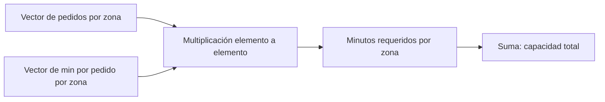

El diagrama muestra una condición oculta: las posiciones deben estar alineadas por una clave de zona, no solo por su posición.

## Matriz: varias variables o relaciones

Una matriz puede tener filas de zonas y columnas de franja horaria. Por ejemplo, la fila de Centro `[30, 45, 35]` puede representar pedidos de mañana, comida y noche. Sumar por fila responde carga por zona; sumar por columna responde carga por franja. El **eje** que se suma cambia la pregunta.

Otra matriz puede representar costes de asignar repartidores a zonas. No hace falta memorizar álgebra lineal avanzada ahora: importa comprender que una dimensión representa entidades y otra variables, y que las etiquetas deben viajar con los números.

## Operaciones seguras y límites

La **multiplicación matricial** combina filas de una matriz con columnas de otra; solo es válida si las dimensiones interiores coinciden. En la práctica, una incompatibilidad de tamaños suele avisar de que se han mezclado variables o periodos. NumPy hará estas operaciones rápido, pero no conoce el significado de las columnas.

Evita confundir multiplicación elemento a elemento con matricial. `[120,80] * [22,30]` equivale a dos productos por zona; no es un cruce de asignaciones. Comprueba forma, unidad y clave antes de automatizar.

## Comprobación

1. ¿Qué representan filas y columnas de una matriz de pedidos por zona y hora?
2. ¿Qué falla si el vector de tiempos usa un orden de zona diferente?
3. ¿Qué suma usarías para conocer carga por franja?

El [laboratorio](../../../notebooks/practicas/03-matematicas-nexo.py) reproduce estas operaciones con listas de Python.

# 06. Tiempo, granularidad, crecimiento y ventanas

## Objetivo

Sabrás definir un periodo comparable y calcular crecimiento sin mezclar días incompletos, zonas horarias ni granularidades. Una **granularidad** es el tamaño de cada intervalo: pedido, hora, día, semana o mes.

## El mismo fenómeno visto a distinta escala

Nexo registra cada pedido a las 23:30 UTC. En España puede pertenecer al día siguiente local. Antes de agrupar por día hay que fijar zona horaria y regla de corte. Después, una fila diaria puede contener total de pedidos, ingresos y p90 de entrega; una fila semanal resume siete días, pero ya no permite estudiar la hora punta.

```mermaid
flowchart LR
  A[Eventos con hora y zona] --> B[Normalizar calendario]
  B --> C[Elegir grano: hora, día o semana]
  C --> D[Agregar con función adecuada]
  D --> E[Comparar periodos equivalentes]
  E --> F[Decisión]
```

La ventana temporal es parte de la definición de una métrica. Cambiarla cambia el valor y, con frecuencia, la conclusión.

## Crecimiento: base y periodo

El crecimiento intersemanal de 10.000 a 11.000 pedidos es 10 %. Para comparar demanda con patrón semanal, lunes contra lunes suele ser más justo que lunes contra domingo. Para campañas estacionales, conviene comparar con el mismo periodo del año anterior. En periodos largos, el crecimiento acumulado no se reparte linealmente: de 100 a 121 en dos meses equivale a 21 % total, no dos meses de 21 %.

Una **ventana móvil** resume los últimos `k` periodos. La media móvil de 7 días suaviza oscilaciones diarias, pero retrasa la detección de un cambio brusco. No uses datos futuros en una ventana destinada a una decisión de hoy; eso sería fuga de información y se trata a fondo en series temporales.

## Datos faltantes, ceros y días parciales

Un cero puede significar que no hubo pedidos; un valor ausente puede significar que el tracking falló. Son casos diferentes. Tampoco compares un día completo con el día actual a las 10:00. Etiqueta cobertura, fecha de extracción y definición de día antes de afirmar que cae la demanda.

## Resumen y comprobación

- El grano controla qué patrones se pueden observar.
- Una comparación exige poblaciones y ventanas equivalentes.
- Una media móvil reduce ruido y añade retraso.

1. ¿Qué perderías al pasar de pedidos por hora a pedidos semanales?
2. ¿Por qué el día actual puede parecer una caída artificial?
3. ¿Qué comparación harías para un lunes posterior a un festivo?

Resuelve ahora el [caso integrador](../../../ejercicios/temario-03/aplicacion/caso-nexo-capacidad.md).

# Bloque 04 - NumPy y cálculo vectorizado

## Propósito

En este bloque Leo trabaja con el caso continuo de **NexoCloud**, una aplicación que registra para cada día las solicitudes resueltas, los minutos de respuesta y el canal de entrada. NumPy es una biblioteca de Python para guardar números en un **array** y calcular con muchos valores de una vez. No sustituye a saber qué mide cada número: hace más segura y breve la parte repetitiva cuando el significado ya está definido.

Al terminar podrás transformar una matriz de métricas operativas, seleccionar observaciones, detectar valores faltantes y explicar qué dimensión representa cada resultado. Es la base numérica sobre la que el bloque 05 construirá tablas con nombres de columnas usando Pandas.

## Resultados observables

- Crear arrays, leer su `dtype`, `ndim`, `shape` y tamaño sin confundirlos con su significado de negocio.
- Aplicar operaciones vectorizadas y reducciones por eje, comprobando unidades y denominadores.
- Extraer subconjuntos con índices, cortes y máscaras booleanas sin desalinear datos.
- Usar broadcasting conscientemente y reconocer el error de forma antes de que propague una regla equivocada.
- Tratar `NaN`, distinguir una vista de una copia y reproducir una simulación sencilla.

## Prerrequisitos y forma de trabajo

Se asume el vocabulario básico de Python del bloque 02: variable, lista, función y error. No se asume experiencia previa con bibliotecas. Puedes leer todo desde el móvil; para ejecutar el laboratorio usa un navegador con Google Colab o un entorno Python remoto. El script está en [notebooks/practicas/04-operaciones-nexocloud.py](../../notebooks/practicas/04-operaciones-nexocloud.py).

## Mapa del caso

La pregunta es: «¿qué canal requiere atención esta semana sin confundir días, métricas o datos ausentes?».

```mermaid
flowchart LR
  A[Registros diarios de NexoCloud] --> B[Array con filas: días]
  B --> C[Columnas: resueltos y minutos]
  C --> D[Filtrar y resumir]
  D --> E[Decisión operativa explicable]
```

El array contiene posición; el diccionario de métricas del caso aporta significado. Mantendremos ambos durante todo el bloque.

## Lecciones

1. [Arrays, tipos y cálculo vectorizado](lecciones/01-arrays-y-vectorizacion.md)
2. [Forma, ejes e indexación](lecciones/02-seleccion-mascaras-y-forma.md)
3. [Máscaras, valores ausentes y copias](lecciones/03-mascaras-nan-y-copias.md)
4. [Broadcasting y reglas por canal](lecciones/04-broadcasting-y-reglas-por-canal.md)
5. [Simulación, reproducibilidad y laboratorio](lecciones/05-simulacion-y-laboratorio.md)

## Práctica evaluable

Resuelve el [diagnóstico operativo de NexoCloud](../../ejercicios/temario-04/diagnostico-operativo-nexocloud.md) antes de consultar la [solución razonada](../../soluciones/temario-04/diagnostico-operativo-nexocloud.md). La práctica no pide memorizar sintaxis: pide justificar formas, filtros, datos faltantes y una recomendación.

# Arrays, tipos y cálculo vectorizado

## Objetivos y prerrequisitos

Al terminar sabrás convertir valores numéricos en un array, comprobar el tipo que NumPy ha elegido y aplicar una misma regla a todos los valores. Necesitas conocer variables y listas de Python. Un **dato** es un valor que describe algo; una **colección** agrupa varios valores. NumPy resulta útil cuando esa colección tiene una estructura numérica conocida.

## El problema antes del nombre técnico

NexoCloud cerró 5, 8 y 6 solicitudes en sus tres primeros días de una prueba. Para calcular la carga total no hace falta recorrer cada número manualmente:

```python
solicitudes = [5, 8, 6]
```

Una lista es flexible: puede mezclar texto, números y otros objetos. Para cálculo científico conviene una estructura homogénea. Un **array de NumPy** (`numpy.ndarray`) es un bloque ordenado de elementos, normalmente de un tipo compatible, sobre el que las operaciones aritméticas se aplican elemento a elemento.

```python
import numpy as np

resueltas = np.array([5, 8, 6], dtype=np.int64)
minutos = np.array([42.5, 51.0, 47.5], dtype=float)
print(resueltas.dtype)  # int64: enteros
print(minutos.dtype)    # float64: números con decimales
```

`dtype` significa *data type*, el tipo con que el array guarda sus elementos. No es una etiqueta de negocio: `float64` no dice si 42.5 son euros, minutos o usuarios. Esa unidad debe documentarse fuera del array.

## Vectorizar: una regla, muchos elementos

Supón que el equipo quiere convertir minutos a horas para comparar el esfuerzo diario. La **vectorización** aplica una operación a cada posición correspondiente sin escribir un bucle explícito:

```python
horas = minutos / 60
objetivo_minutos = np.array([45.0, 45.0, 45.0])
desviacion = minutos - objetivo_minutos
```

El resultado de `minutos / 60` conserva tres posiciones. La tercera línea compara día con día porque los arrays tienen la misma longitud y el mismo orden. Es más fácil revisar «esta regla se aplica a todos los días» que repetir una instrucción manual por cada valor.

Este diagrama responde a «¿qué tiene que seguir siendo cierto para que una operación vectorizada signifique lo que creemos?»:

```mermaid
flowchart LR
  A[Array de minutos por día] --> B[Regla: dividir entre 60]
  B --> C[Horas por día]
  C --> D[Resumen o decisión]
  E[Unidad y orden documentados] --> B
```

La flecha desde unidad y orden no es decorativa: sin ellos el cálculo puede ejecutarse y seguir siendo analíticamente falso.

## Reducciones: de muchos valores a un resumen

Una **reducción** resume varias posiciones en un resultado. `sum`, `mean`, `min` y `max` son comunes:

```python
total = resueltas.sum()       # 19 solicitudes
media = minutos.mean()        # 47.0 minutos
peor_dia = minutos.max()      # 51.0 minutos
```

La media no demuestra que cada cliente espere 47 minutos. Es una descripción de esos tres días y puede ocultar picos. Antes de comunicar «el servicio tarda 47 minutos», define el período, la población incluida y si una media es la medida adecuada.

## Conversión y pérdida de información

NumPy intenta encontrar un tipo común. Si introduces un decimal entre enteros, puede convertir todo el array a `float`; si introduces texto, puede convertir los números en texto. Forzar un tipo también puede perder información:

```python
np.array([42.9, 51.0], dtype=int)  # array([42, 51]); trunca, no redondea
```

No uses esta conversión para «limpiar» datos sin investigarlos. Truncar minutos puede sesgar un promedio y convertir identificadores como `"0012"` a entero puede borrar ceros significativos. Un identificador no es una magnitud para sumar.

## Resumen y comprobación

- Un array organiza valores con forma y tipo; la unidad de negocio no viaja sola en `dtype`.
- Vectorizar aplica una regla a cada elemento; presupone orden, unidad y población compatibles.
- Las reducciones resumen, pero no explican por sí solas la distribución.

Comprueba: ¿por qué `np.array([1, "2"])` es peligroso para una suma? ¿Qué hipótesis estás haciendo al restar dos arrays de igual longitud? En la siguiente lección verás cómo expresar qué representa cada dimensión.

# Forma, ejes e indexación

## Objetivos y prerrequisitos

Aprenderás a leer una matriz como filas y columnas, resumir por la dirección correcta y seleccionar posiciones sin alterar su significado. Requiere arrays y operaciones vectorizadas del tema anterior.

## Una matriz necesita un contrato

Una lista de números no indica por sí sola qué representa cada posición. En NexoCloud registraremos cuatro días (filas) y tres canales (columnas: web, chat y correo). Cada celda es el número de solicitudes resueltas ese día por ese canal:

```python
import numpy as np

canales = np.array(["web", "chat", "correo"])
resueltas = np.array([
    [12, 8, 4],
    [15, 7, 5],
    [11, 9, 6],
    [13, 10, 4],
])
print(resueltas.shape)  # (4, 3): 4 días, 3 canales
print(resueltas.ndim)   # 2 dimensiones
```

`shape` es una tupla que enumera el tamaño de cada dimensión. No dice «días» ni «canales»: eso es parte del contrato que acabamos de escribir. Una matriz con forma `(4, 3)` también podría significar cuatro tiendas y tres productos. `ndim` cuenta dimensiones y `size` cuenta celdas: aquí `4 * 3 = 12`.

## Ejes: resumir hacia una dirección

En una matriz bidimensional, `axis=0` reduce las filas y conserva columnas; `axis=1` reduce las columnas y conserva filas. Es más seguro describirlo como «lo que queda» que memorizar una frase:

```python
por_canal = resueltas.sum(axis=0)  # [51, 34, 19], un total por canal
por_dia = resueltas.sum(axis=1)    # [24, 27, 26, 27], un total por día
```

La relación visual responde a «¿qué etiqueta conserva cada suma?»:

```mermaid
flowchart TB
  A[Matriz: días por canales] --> B[sum axis=0]
  B --> C[Un total por canal]
  A --> D[sum axis=1]
  D --> E[Un total por día]
```

`axis=0` no significa «mejor» ni «vertical» en abstracto; solo resulta correcto porque el contrato asignó filas a días y columnas a canales. Verifica la forma del resultado antes de asignarle un nombre.

## Índices y cortes

Python empieza a contar en cero. La sintaxis `[fila, columna]` selecciona una celda; los cortes `inicio:fin` incluyen el inicio y excluyen el final:

```python
primer_dia = resueltas[0, :]   # [12, 8, 4]
chat = resueltas[:, 1]         # [8, 7, 9, 10]
dos_primeros_dias = resueltas[:2, :]
```

La posición `1` solo significa chat porque `canales[1]` lo documenta. Si se reordena `canales` sin reordenar las columnas, el código seguirá funcionando y la conclusión será errónea. En tablas de producción, Pandas reduce este riesgo al usar etiquetas; aun así hay que validar las claves.

## Error habitual: forma válida, comparación inválida

Dos arrays pueden tener misma forma y referirse a períodos distintos. Restar las solicitudes de lunes a jueves a las de viernes a lunes entrega cuatro números, pero no mide una evolución comparable si los días no representan la misma condición. La forma comprueba compatibilidad técnica; no comprueba comparabilidad de negocio.

## Resumen y comprobación

- Documenta qué representa cada dimensión antes de usar `shape`.
- `axis=0` devuelve una medida por columna; `axis=1`, una medida por fila en este contrato.
- Los índices son posiciones, no etiquetas con significado propio.

Pregunta: si `resueltas.mean(axis=0)` tiene forma `(3,)`, ¿qué representa cada resultado? Continúa con máscaras para seleccionar por una condición explícita.

# Máscaras, valores ausentes y copias

## Objetivos y prerrequisitos

Sabrás construir una condición, usarla para seleccionar datos, reconocer un valor ausente y evitar modificar un array por accidente. Requiere entender `shape`, índices y operaciones de comparación.

## De una pregunta a una máscara

La responsable de soporte pregunta: «¿qué días superaron 50 minutos medios en chat?». Una **máscara booleana** es un array de `True` y `False`, uno por valor, que expresa esa pregunta:

```python
chat_minutos = np.array([48.0, 55.0, 51.0, 43.0])
supera_objetivo = chat_minutos > 50
print(supera_objetivo)          # [False, True, True, False]
print(chat_minutos[supera_objetivo])  # [55., 51.]
```

El umbral de 50 no lo inventa NumPy. Debe proceder de un acuerdo de nivel de servicio, un objetivo o una hipótesis explícita. Cambiarlo a 45 cambia la población seleccionada y, por tanto, la historia que se cuenta.

Para combinar requisitos usa `&` (y) y `|` (o), siempre entre paréntesis:

```python
es_lento = chat_minutos > 50
es_critico = chat_minutos >= 60
revisar = es_lento & ~es_critico
```

No escribas `es_lento and es_critico`: `and` pregunta por el array completo y no representa una comparación elemento a elemento.

## Ausencia no es cero

Un **valor ausente** significa que no conocemos o no recibimos el valor. En datos numéricos NumPy suele representarlo con `np.nan` (*not a number*). No equivale a cero: cero minutos sería una medida real que hay que interpretar; `NaN` dice que no hay medida utilizable.

```python
tiempo_chat = np.array([48.0, np.nan, 51.0, 43.0])
print(np.isnan(tiempo_chat))       # identifica el hueco
print(np.mean(tiempo_chat))        # nan: la ausencia se propaga
print(np.nanmean(tiempo_chat))     # 47.33..., ignora NaN
```

`np.nanmean` puede ser apropiado para un resumen exploratorio, pero no «arregla» el problema. Primero pregunta por qué faltó la medición: ¿falló el tracking, no hubo conversaciones o se retrasó la carga? Si los días de más tráfico son precisamente los ausentes, ignorarlos sesga el resultado.

## Vista frente a copia: una modificación con consecuencias

Un corte básico suele devolver una **vista**: comparte memoria con el array original. Una copia tiene memoria propia. La diferencia importa cuando limpias o pruebas transformaciones:

```python
original = np.array([48.0, 55.0, 51.0, 43.0])
vista = original[:2]
vista[0] = 999.0
print(original[0])  # 999.0: la vista modificó el original

seguro = original.copy()
seguro[0] = 48.0    # solo cambia seguro
```

No dependas de recordar todas las reglas de indexación avanzada. Si vas a alterar valores para una prueba o una imputación, llama explícitamente a `.copy()` y conserva el origen. Esto permite repetir la auditoría.

## Flujo de decisión para un dato sospechoso

```mermaid
flowchart TD
  A[Valor de tiempo] --> B[¿Es NaN?]
  B -->|Sí| C[Investigar causa y cobertura]
  C --> G[Abrir incidencia de calidad]
  B -->|No| D[¿Supera umbral acordado?]
  D -->|Sí| E[Incluir en revisión]
  D -->|No| F[Conservar y documentar]
```

El flujo separa ausencia de rendimiento bajo: sustituir ambos por cero convertiría problemas distintos en el mismo número.

## Resumen y comprobación

- Una máscara deja visible el criterio de selección; valida su longitud y procedencia.
- `NaN` es desconocido, no un cero conveniente.
- Copia antes de modificar datos para análisis; documenta cualquier regla de tratamiento.

¿Qué respuesta adicional pedirías antes de usar `np.nanmean` para informar a dirección? En la siguiente lección aplicarás reglas distintas por canal sin duplicar la matriz.

# Broadcasting y reglas por canal

## Objetivos y prerrequisitos

Aprenderás cuándo NumPy puede combinar dimensiones de forma segura y cómo detectar una regla aplicada sobre el eje equivocado. Requiere matrices, `shape` y operaciones vectorizadas.

## La necesidad: un objetivo distinto para cada canal

NexoCloud pacta objetivos de respuesta diferentes: web 40 minutos, chat 45 y correo 120. Los tiempos diarios tienen forma `(días, canales)`; el objetivo tiene forma `(canales,)`:

```python
tiempos = np.array([
    [38.0, 52.0, 110.0],
    [41.0, 43.0, 130.0],
    [44.0, 47.0, 115.0],
])
objetivos = np.array([40.0, 45.0, 120.0])
desviacion = tiempos - objetivos
```

**Broadcasting** es el conjunto de reglas por el que NumPy alinea dimensiones compatibles. Aquí interpreta `objetivos` como una fila que puede usarse para cada día, sin que tengas que crear manualmente tres copias. El resultado `(3, 3)` conserva una desviación por día y canal.

La pregunta es «¿qué objetivo se resta de cada celda?»:

```mermaid
flowchart LR
  A[Matriz días x canales] --> C[Restar por columnas]
  B[Vector: objetivo por canal] --> C
  C --> D[Matriz: desviación por día y canal]
```

Cada columna recibe su objetivo. No se está calculando todavía la causa de las demoras: solo una diferencia respecto a una referencia acordada.

## Compatibilidad, no telepatía

NumPy compara dimensiones desde el final. Son compatibles si son iguales o una vale 1. Por eso `(3, 3)` y `(3,)` funcionan. En cambio, un vector de tres objetivos de día podría tener también forma `(3,)`; NumPy no puede saber si representa días o canales. Si ambos tamaños coinciden, el código puede ejecutarse sobre el eje incorrecto.

Cuando el significado sea «un valor por fila», haz la orientación visible con `[:, np.newaxis]`:

```python
factor_por_dia = np.array([1.0, 1.1, 0.9])[:, np.newaxis]  # forma (3, 1)
ajustado = tiempos * factor_por_dia
```

`np.newaxis` agrega una dimensión de tamaño uno. No crea conocimiento de negocio; hace explícita la intención de multiplicar cada fila por su factor.

## Error habitual: confundir eficiencia con corrección

Broadcasting ahorra código, pero puede amplificar un supuesto erróneo. Aplicar un factor de campaña a todos los canales cuando solo afectó a web produce números plausibles y falsos. Antes de ejecutar, escribe el contrato: forma, unidades, orden de canales y período de validez de la regla.

## Resumen y comprobación

- Broadcasting combina dimensiones compatibles; no decide qué dimensión tiene sentido.
- Un vector `(canales,)` se alinea con la última dimensión de `(días, canales)`.
- Usa `(días, 1)` para declarar una regla por fila y verifica el resultado.

¿Qué `shape` debería tener una tasa distinta para cada día y canal? Respuesta: `(días, canales)`, salvo que una regla común esté justificada.

# Simulación, reproducibilidad y laboratorio

## Objetivos y prerrequisitos

Aplicarás el caso NexoCloud de principio a fin y sabrás para qué sirve fijar una semilla aleatoria. Requiere máscaras, `NaN`, ejes y broadcasting.

## Simular no es observar

Una simulación crea datos artificiales según reglas elegidas. Sirve para practicar, explorar escenarios y comprobar código cuando aún no tienes acceso a producción. No permite afirmar que clientes reales se comportaron así: esa afirmación requeriría datos observados y evaluación de calidad.

```python
generador = np.random.default_rng(2026)
ruido = generador.normal(loc=0, scale=4, size=(7, 3))
```

La **semilla** `2026` inicializa el generador de forma repetible: otra persona que ejecute las mismas instrucciones obtiene el mismo ruido. No convierte la simulación en verdadera ni debe reutilizarse como mecanismo de seguridad.

## Laboratorio: responder una pregunta operativa

El script [04-operaciones-nexocloud.py](../../../notebooks/practicas/04-operaciones-nexocloud.py) construye siete días de tiempos medios, incorpora un dato ausente y contesta:

1. ¿Qué días y canales superaron su objetivo?
2. ¿Qué media por canal puede calcularse sin ocultar la cobertura?
3. ¿Qué canal merece una revisión y qué dato faltante debe investigarse?

Antes de ejecutar, predice la forma de `tiempos`, `objetivos` y `desviacion`. Después compara tu predicción con la salida. Un análisis reproducible deja visibles los datos de entrada, la semilla si se usa, las transformaciones y las decisiones; no solo un número final.

## Una recomendación responsable

Si `chat` supera el objetivo en varios días, una recomendación inicial podría ser «revisar capacidad y clasificación de conversaciones de chat». No sería correcto afirmar que falta personal solo por esa matriz: pueden intervenir severidad, cambios de tracking, mezcla de casos o fallos de medición. NumPy prepara la evidencia numérica; la investigación operativa exige contexto.

## Cierre

Has pasado de valores sueltos a una matriz con contrato, filtros, valores ausentes y reglas por canal. Resuelve ahora el [ejercicio aplicado](../../../ejercicios/temario-04/diagnostico-operativo-nexocloud.md). El bloque 05 trasladará este razonamiento a datos tabulares con columnas y claves.

# Bloque 05 - Pandas: manipulación de datos

## Propósito

Preparar datos tabulares con trazabilidad. Pandas no “arregla” datos por sí solo: permite expresar y validar decisiones sobre ellos.

## Lecciones

1. [DataFrames, importación y perfilado](lecciones/01-dataframes-importacion-y-perfilado.md)
2. [Selección, tipos y limpieza](lecciones/02-seleccion-tipos-y-limpieza.md)
3. [Columnas derivadas y agregaciones](lecciones/03-transformacion-y-agregacion.md)
4. [Uniones y cardinalidad](lecciones/04-uniones-y-cardinalidad.md)
5. [Validación y trazabilidad](lecciones/05-validacion-y-trazabilidad.md)
6. [Caso integrado de pedidos](lecciones/06-caso-integrado-pedidos.md)

## Práctica

Resuelve [la limpieza de pedidos](../../ejercicios/temario-05/aplicacion/limpieza-pedidos.md) y después consulta [la solución razonada](../../soluciones/temario-05/limpieza-pedidos.md).

# DataFrames, importación y perfilado

## Objetivos y prerrequisitos

Sabrás abrir una tabla con Pandas e inspeccionarla antes de modificarla. Requiere los bloques de datos y Python.

Un **DataFrame** es una tabla en memoria: filas (observaciones) y columnas (variables) con nombres. Un archivo CSV puede guardar una tabla, pero abrirlo no garantiza que cada columna tenga el tipo ni el significado esperado.

```python
import pandas as pd
pedidos = pd.read_csv("pedidos.csv")
pedidos.head()
pedidos.info()
```

`head()` muestra ejemplos; `info()` enseña número de filas, columnas, tipos y valores no nulos. Compleméntalos con `describe()`, revisión de categorías y comprobación del grano: ¿una fila representa un pedido, una línea de pedido o un usuario?

Este flujo responde a “¿qué debe ocurrir antes de calcular?”

```mermaid
flowchart LR
 A[Importar] --> B[Ver ejemplos]
 B --> C[Comprobar grano y tipos]
 C --> D[Medir nulos y duplicados]
 D --> E[Decidir transformación]
```

Un error habitual es llamar “ventas” a una columna sin verificar moneda, impuestos o devoluciones. El perfilado abre preguntas; no las responde automáticamente.

Sigue con [selección, tipos y limpieza](02-seleccion-tipos-y-limpieza.md).

# Selección, tipos y limpieza

## Objetivos y prerrequisitos

Seleccionarás columnas y filas, convertirás tipos explícitamente y tratarás problemas sin borrar información a ciegas.

Seleccionar una columna responde una pregunta concreta: `pedidos["importe"]`. Filtrar filas aplica un criterio visible: `pedidos[pedidos["estado"] == "pagado"]`. Antes de filtrar, cuenta qué se excluye y por qué; “pagado” puede ser una definición distinta a “pedido creado”.

Los valores importados como texto requieren conversión controlada:

```python
pedidos["importe"] = pd.to_numeric(pedidos["importe"], errors="coerce")
pedidos["fecha"] = pd.to_datetime(pedidos["fecha"], errors="coerce")
```

`coerce` convierte valores inválidos en ausentes. Es útil porque no inventa una cifra, pero obliga a medir y decidir qué hacer con esos ausentes. No elimines nulos por costumbre: pueden concentrarse en un canal y sesgar el resultado.

## Resumen

Limpiar es convertir una regla de calidad en código verificable. Continúa con [transformación y agregación](03-transformacion-y-agregacion.md).

# Columnas derivadas y agregaciones

## Objetivos y prerrequisitos

Crearás medidas derivadas y resumirás una tabla sin perder de vista el grano.

Una columna derivada expresa una regla: `importe_neto = importe - descuento`. Documenta si el descuento ya incluye impuestos y qué sucede cuando falta. `groupby` agrupa filas y aplica una agregación:

```python
ventas_canal = pedidos.groupby("canal", as_index=False).agg(
    pedidos=("pedido_id", "nunique"),
    ingresos=("importe_neto", "sum")
)
```

`nunique` cuenta identificadores únicos; `count` cuenta valores no nulos. Elegir uno u otro cambia la métrica. Un promedio de importe también puede ocultar la distribución, por lo que conviene acompañarlo de volumen y percentiles cuando la decisión lo requiera.

## Límite

Agregar convierte muchas filas en pocas. Es útil para comparar canales, pero puede ocultar diferencias por país, dispositivo o periodo. Conserva la tabla de origen y registra cada agregación.

Sigue con [uniones y cardinalidad](04-uniones-y-cardinalidad.md).

# Uniones y cardinalidad

## Objetivos y prerrequisitos

Combinarás tablas comprobando qué clave conecta las filas y cuántas coincidencias son válidas.

Una unión (`merge`) cruza dos tablas mediante una **clave**, por ejemplo `cliente_id`. Antes de ejecutarla declara la cardinalidad: uno a uno, uno a muchos o muchos a uno. Muchos a muchos puede ser correcto, pero multiplica combinaciones y requiere una justificación explícita.

```python
pedidos_con_clientes = pedidos.merge(
    clientes, on="cliente_id", how="left", validate="many_to_one"
)
```

`validate="many_to_one"` convierte un supuesto en una comprobación: muchos pedidos pueden corresponder a un cliente, pero cada pedido no debe encontrar dos fichas de cliente. Tras unir, compara filas, claves sin coincidencia y totales monetarios.

## Error habitual

Ver una columna nueva y asumir que la unión funcionó. Si `clientes` tiene duplicados por error, cada pedido puede repetirse y los ingresos se inflan. La sintaxis válida no demuestra una relación válida.

Continúa con [validación y trazabilidad](05-validacion-y-trazabilidad.md).

# Validación y trazabilidad

## Objetivos y prerrequisitos

Definirás controles simples que convierten una transformación en un paso revisable.

Tras cada paso relevante guarda observaciones: número de filas, claves únicas, porcentaje de nulos y totales de negocio. Una validación puede ser una aserción:

```python
assert pedidos["pedido_id"].is_unique
assert pedidos["importe_neto"].notna().all()
```

No uses una aserción para ocultar un problema. Si falla, inspecciona los registros y decide si el supuesto era incorrecto o si hay un defecto de datos. Registra filtros, versión de la fuente y fecha de extracción: ese rastro permite reproducir el análisis.

## Resumen

Validar no es un último adorno; acompaña a cada transformación. Aplica ahora todo el ciclo en el [caso integrado](06-caso-integrado-pedidos.md).

# Caso integrado de pedidos

## Objetivos y prerrequisitos

Usarás el flujo completo para responder una pregunta simple: “¿qué canal aporta ingresos netos y cuántos pedidos válidos hay?”.

Primero formula el contrato: una fila es un pedido; solo se incluyen estados pagados; importe neto excluye descuento; el periodo es el mes analizado. Después perfila, convierte tipos, mide registros inválidos, crea la columna neta y agrupa por canal. Finalmente compara el total agrupado con el total de pedidos filtrados.

El resultado debe incluir una limitación: si hay pedidos devueltos después de la extracción, los ingresos no representan todavía margen final. Ese tipo de frase es parte del análisis, no una excusa.

Resuelve la [limpieza de pedidos](../../../ejercicios/temario-05/aplicacion/limpieza-pedidos.md) y revisa la solución razonada. El siguiente bloque explorará lo que estos resúmenes sugieren, sin convertirlos de inmediato en causalidad.

# Bloque 06 - Análisis exploratorio de datos

## Propósito

Explorar datos para descubrir patrones, anomalías y preguntas nuevas sin confundir exploración con demostración causal.

## Lecciones

1. [Preguntas y perfil exploratorio](lecciones/01-preguntas-y-perfil-exploratorio.md)
2. [Distribuciones, segmentos y valores extremos](lecciones/02-distribuciones-segmentos-y-outliers.md)
3. [Relaciones, correlación y explicaciones rivales](lecciones/03-relaciones-correlacion-y-causalidad.md)
4. [Registro de hallazgos y decisiones](lecciones/04-registro-de-hallazgos.md)

## Práctica

Resuelve [la investigación de una caída](../../ejercicios/temario-06/aplicacion/investigar-caida.md) antes de mirar [la guía de solución](../../soluciones/temario-06/investigar-caida.md).

# Preguntas y perfil exploratorio

## Objetivos y prerrequisitos

Convertirás un conjunto de datos en preguntas de exploración y comprobarás si la fuente puede responderlas. Requiere manejo básico de Pandas.

El análisis exploratorio, o **EDA**, es una investigación abierta pero disciplinada. No empieza con “haz todos los gráficos”; empieza con una pregunta como “¿en qué segmento se concentra la caída de pedidos?” y con un perfil de grano, periodo, cobertura, nulos y duplicados.

```mermaid
flowchart LR
 A[Pregunta] --> B[Perfil de fuente]
 B --> C[Comparar segmentos]
 C --> D[Hallazgo]
 D --> E[Comprobar plausibilidad]
 E --> F[Nueva pregunta o reporte]
```

El hallazgo genera una hipótesis, no un veredicto. Si faltan datos de dispositivo, no concluyas que no importa: concluye que la fuente no permite evaluarlo.

## Resumen

El EDA limita el espacio de dudas con evidencia visible. Sigue con [distribuciones y segmentos](02-distribuciones-segmentos-y-outliers.md).

# Distribuciones, segmentos y valores extremos

## Objetivos y prerrequisitos

Interpretarás cómo se reparte una medida y decidirás cuándo investigar valores extremos en vez de eliminarlos.

Una **distribución** muestra cómo se repiten los valores. Además de una media, observa mediana, dispersión, asimetría y percentiles. En importes de pedido, unos pocos pedidos empresariales pueden elevar la media aunque la mayoría de clientes gaste poco.

Segmentar divide observaciones por una característica relevante: canal, país, dispositivo o cohorte. Una tendencia global puede esconder un canal en caída y otro en crecimiento. El segmento se elige por una hipótesis de negocio, no porque haya columnas disponibles.

Un **outlier** es un valor inusual respecto al resto; no es sinónimo de error. Puede ser una compra fraudulenta, un cliente clave, una moneda mal parseada o una unidad distinta. Conserva la evidencia, clasifica la causa y documenta la regla si decides excluirlo.

## Resumen

Describe la distribución antes de resumirla y explica cualquier exclusión. Continúa con [relaciones y causalidad](03-relaciones-correlacion-y-causalidad.md).

# Relaciones, correlación y explicaciones rivales

## Objetivos y prerrequisitos

Distinguirás asociación observada, explicación posible y evidencia causal.

Dos medidas pueden moverse juntas. Una **correlación** resume asociación lineal, pero no identifica por qué ocurre. Las visitas y las ventas pueden subir por una campaña; el precio y las devoluciones pueden variar porque se venden productos distintos. Una tercera variable, un cambio de medición o puro azar pueden explicar la relación.

Antes de recomendar una acción, formula explicaciones rivales y busca qué dato las distinguiría. Un experimento o un diseño causal puede aportar mejor evidencia; el EDA prepara esa investigación.

## Error habitual

Ordenar una tabla por dos columnas y afirmar una causa porque el patrón “parece claro”. La visualización ayuda a detectar preguntas; no elimina confusión, sesgo de selección ni estacionalidad.

## Resumen

Una asociación es un punto de partida. Registra qué observaste y qué sería necesario para sostener una explicación.

# Registro de hallazgos y decisiones

## Objetivos y prerrequisitos

Aprenderás a convertir una exploración en un artefacto revisable por producto, ingeniería o dirección.

Para cada hallazgo anota pregunta, fuente y periodo, filtros, método, resultado, interpretación, límites y siguiente acción. Un ejemplo: “La conversión móvil cayó 1,8 puntos desde la versión 4.2; el patrón aparece en Android y no en web; falta comprobar cambios de tracking y errores del formulario”.

No escribas “la versión causó la caída” si solo existe coincidencia temporal. La precisión del lenguaje protege al equipo de decidir demasiado pronto.

Resuelve la [investigación de una caída](../../../ejercicios/temario-06/aplicacion/investigar-caida.md). En el bloque siguiente aprenderás a elegir gráficos que hagan visible esta evidencia sin manipular la percepción.

# Bloque 07 - Visualización y comunicación

## Propósito

Elegir y construir visualizaciones que permitan comprender una decisión con rapidez, sin distorsionar los datos.

## Lecciones

1. [De la pregunta al tipo de gráfico](lecciones/01-pregunta-y-tipo-de-grafico.md)
2. [Diseño honesto y accesible](lecciones/02-diseno-honesto-y-accesible.md)
3. [De exploración a comunicación](lecciones/03-exploracion-y-narrativa.md)
4. [Dashboards y entregables profesionales](lecciones/04-dashboards-y-entregables.md)

## Ejercicio

Haz el [diagnóstico de gráficos](../../ejercicios/temario-07/comprension/elegir-grafico.md) y comprueba [los criterios](../../soluciones/temario-07/elegir-grafico.md).

# De la pregunta al tipo de gráfico

## Objetivos y prerrequisitos

Sabrás escoger una representación según la comparación que una decisión necesita. Requiere EDA básico.

Un gráfico no es una decoración de una tabla: es una forma de hacer visible una comparación. Pregunta primero si necesitas mostrar evolución, diferencias entre categorías, distribución o relación entre dos medidas.

```mermaid
flowchart LR
 A[Pregunta] --> B{Comparación}
 B -->|Tiempo| C[Línea]
 B -->|Categorías| D[Barras]
 B -->|Distribución| E[Histograma o caja]
 B -->|Relación| F[Dispersión]
 C --> G[Hallazgo y acción]
 D --> G
 E --> G
 F --> G
```

Una línea responde bien a “¿cómo cambió semanalmente la conversión?”. Unas barras ordenadas responden mejor a “¿qué canal tiene más pedidos?”. Un histograma muestra si un promedio es representativo. Un gráfico de dispersión ayuda a explorar asociación, no a afirmar causalidad.

## Error habitual

Elegir un gráfico porque “queda profesional”. Un gráfico circular con muchas categorías impide comparar; una línea sobre categorías sin orden temporal inventa continuidad. El gráfico correcto depende de la pregunta y del tipo de dato.

## Resumen

Declara la pregunta antes del gráfico. Continúa con [diseño honesto](02-diseno-honesto-y-accesible.md).

# Diseño honesto y accesible

## Objetivos y prerrequisitos

Aprenderás a etiquetar, escalar y colorear un gráfico sin exagerar diferencias ni excluir a parte de la audiencia.

Un gráfico honesto declara unidad, periodo, población y fuente cuando son necesarios. En barras que comparan magnitudes, empezar el eje en cero evita que diferencias pequeñas parezcan enormes. En líneas puede usarse otro rango si se explica y se busca estudiar variación, no tamaño absoluto.

El color debe codificar una diferencia con significado: versión A frente a B, cumplimiento frente a riesgo. No hagas que el único mensaje dependa de rojo y verde; añade etiquetas, contraste y patrones si el gráfico se va a reutilizar.

## Límite

La claridad no significa ocultar incertidumbre: si un valor procede de pocos usuarios o una estimación, muestra contexto, intervalo o nota metodológica. Simplificar es retirar ruido, no retirar condiciones que cambiarían una decisión.

## Resumen

Cada elección visual transmite una interpretación. Verifica escalas, etiquetas y accesibilidad antes de presentar.

# De exploración a comunicación

## Objetivos y prerrequisitos

Separarás un gráfico para investigar de uno para recomendar una decisión.

Durante exploración puedes producir muchos gráficos, probar segmentos y descubrir errores. Un gráfico explicativo reduce esa exploración a una afirmación revisable: título con hallazgo, comparación destacada, definición de métrica y límite relevante.

Por ejemplo, “La conversión móvil cayó 1,8 puntos desde la versión 4.2” es más informativo que “Conversión por semana”. Acompáñalo de población, ventana temporal y una nota: “asociación temporal; pendiente validar cambio de tracking”.

## Error habitual

Convertir el dashboard exploratorio en una diapositiva ejecutiva con veinte series y filtros. El receptor no puede saber qué mirar ni qué acción se propone. Una buena narrativa deja clara evidencia, recomendación y grado de confianza.

## Práctica

Reformula el título de un gráfico que solo diga “Ventas mensuales” y explica qué dato necesitas para justificar el nuevo mensaje.

# Dashboards y entregables profesionales

## Objetivos y prerrequisitos

Diseñarás un entregable que responda a una decisión y no solo muestre indicadores.

Un **dashboard** reúne métricas para seguimiento continuo; no sustituye un análisis cuando hay una decisión nueva. Cada panel debe indicar definición, actualización, propietario y acción esperada. Una presentación o ticket de Jira puede ser mejor para explicar una incidencia concreta: contexto, evidencia, recomendación, riesgos y siguiente paso.

Antes de entregar pregunta: ¿quién actúa?, ¿qué cambiaría si el dato varía?, ¿qué limitación debe conocer? Si no hay respuesta, probablemente sobra un gráfico o falta una pregunta.

Completa el [diagnóstico de gráficos](../../../ejercicios/temario-07/comprension/elegir-grafico.md). El bloque siguiente añadirá la incertidumbre que una visualización por sí sola no puede resolver.

# Bloque 08 - Estadística para decisiones

## Propósito

Medir incertidumbre, evaluar diferencias y comunicar resultados sin convertir una prueba estadística en una respuesta automática.

## Lecciones

1. [Describir variabilidad](lecciones/01-describir-variabilidad.md)
2. [Población, muestra y sesgo](lecciones/02-poblacion-muestra-y-sesgo.md)
3. [Probabilidad e incertidumbre](lecciones/03-probabilidad-e-incertidumbre.md)
4. [Intervalos y pruebas de hipótesis](lecciones/04-intervalos-y-pruebas.md)
5. [Experimentos A/B](lecciones/05-experimentos-ab.md)
6. [Tamaño de efecto y decisión](lecciones/06-tamano-de-efecto-y-decision.md)

## Práctica

Analiza [un experimento de onboarding](../../ejercicios/temario-08/aplicacion/experimento-onboarding.md) y revisa [la interpretación](../../soluciones/temario-08/experimento-onboarding.md).

# Describir variabilidad

## Objetivos y prerrequisitos

Sabrás resumir un conjunto sin esconder su dispersión. Requiere promedios y distribuciones.

La media responde “¿cuál es el promedio?”, pero no “¿cuánto varían los casos?”. Mediana, percentiles, rango y desviación estándar describen perspectivas distintas. En tiempos de carga, una media de dos segundos puede convivir con usuarios que esperan veinte; los percentiles altos suelen importar para experiencia real.

No elijas la medida que haga mejor la historia. Declara por qué la métrica representa la decisión: media para coste total esperado, mediana para cliente típico, percentil 95 para un compromiso de rendimiento.

## Resumen

Centro y variabilidad se interpretan juntos. Continúa con [población y muestra](02-poblacion-muestra-y-sesgo.md).

# Población, muestra y sesgo

## Objetivos y prerrequisitos

Distinguirás el conjunto sobre el que quieres decidir de los datos que realmente observaste.

La **población** es el conjunto de interés, por ejemplo todos los nuevos usuarios elegibles. Una **muestra** es una parte observada. Un **estadístico** resume la muestra; un parámetro describe la población. Muestras diferentes producen resultados diferentes: esa variabilidad no es un fallo, es la razón para comunicar incertidumbre.

El problema no se arregla solo con más filas. Si solo respondieron usuarios muy activos a una encuesta, hay **sesgo de selección**: la muestra puede ser grande y seguir sin representar a la población.

## Resumen

Pregunta siempre quién quedó dentro, quién fuera y por qué. Sigue con [probabilidad e incertidumbre](03-probabilidad-e-incertidumbre.md).

# Probabilidad e incertidumbre

## Objetivos y prerrequisitos

Usarás probabilidad como modelo de incertidumbre, no como promesa sobre un caso individual.

Una probabilidad expresa qué tan frecuente sería un resultado dentro de un modelo y unas condiciones. Si una conversión histórica es 10 %, no significa que cada décimo usuario vaya a comprar ni que el siguiente tenga 10 % “garantizado”. Depende de población, periodo, medición y estabilidad del proceso.

La incertidumbre aparece porque observamos una parte del proceso, existe variación y las mediciones pueden tener error. Separar esos componentes evita comunicar una cifra estimada como si fuera exacta.

## Resumen

Un modelo probabilístico necesita supuestos explícitos. Sigue con [intervalos y pruebas](04-intervalos-y-pruebas.md).

# Intervalos y pruebas de hipótesis

## Objetivos y prerrequisitos

Interpretarás un intervalo y un p-valor sin atribuirles un significado que no tienen.

Un intervalo de confianza ofrece un rango de valores compatibles con un método, datos y nivel de confianza bajo sus supuestos. Una prueba compara datos con una **hipótesis nula**, por ejemplo “no hay diferencia de conversión”. Un p-valor pequeño indica que los datos serían poco compatibles con esa hipótesis si el modelo fuera correcto.

No dice la probabilidad de que la hipótesis nula sea cierta, no mide importancia de negocio y no corrige sesgo, medición mala ni pruebas repetidas. Comunica efecto absoluto, relativo, intervalo y decisión propuesta.

```mermaid
flowchart LR
 A[Población] --> B[Muestra]
 B --> C[Estimación]
 C --> D[Intervalo]
 C --> E[Prueba]
 D --> F[Decisión con límite]
 E --> F
```

## Resumen

La inferencia cuantifica incertidumbre; no sustituye juicio ni diseño. Continúa con [experimentos A/B](05-experimentos-ab.md).

# Experimentos A/B

## Objetivos y prerrequisitos

Diseñarás la estructura mínima de un experimento antes de mirar su resultado.

Un experimento A/B asigna unidades elegibles a variantes para comparar una métrica. Define antes población, unidad de asignación, métrica principal, guardrails, duración, tamaño necesario y criterio de decisión. Si aleatorizas por usuario pero mides por sesión sin cuidado, puedes contar varias veces una experiencia.

No mires cada día hasta encontrar significación: ese comportamiento eleva falsos positivos. También vigila calidad del tracking, exposición real a la variante y efectos por segmentos relevantes.

## Límite

Un experimento válido estima efecto en la población y periodo estudiados; no garantiza el mismo efecto después de lanzar globalmente ni en otro mercado.

## Práctica

Analiza el [experimento de onboarding](../../../ejercicios/temario-08/aplicacion/experimento-onboarding.md) antes de leer su solución.

# Tamaño de efecto y decisión

## Objetivos y prerrequisitos

Vincularás una diferencia estadística con coste, beneficio, riesgo y recomendación.

Una diferencia minúscula puede resultar “significativa” con millones de usuarios y aun así no pagar el coste de ingeniería. Una diferencia grande con pocos datos puede ser prometedora pero incierta. Por eso una decisión profesional reúne tamaño absoluto, cambio relativo, intervalo, volumen afectado, guardrails y reversibilidad de la acción.

Ejemplo: +0,2 puntos de conversión puede significar miles de pedidos si hay mucho tráfico, pero no conviene lanzar si aumenta reclamaciones o si el intervalo incluye una pérdida importante. La recomendación debe declarar el umbral que hace que actuar merezca la pena.

## Cierre

Estadística no concede permiso automático para afirmar o lanzar. Ayuda a calibrar qué se sabe, qué riesgo queda y qué evidencia faltaría.

# Bloque 09 - SQL, NoSQL y almacenamiento

## Propósito

Entender cómo viven los datos en una empresa, consultar tablas con SQL y saber cuándo un modelo documental o clave-valor exige otro diseño.

## Lecciones

1. [Modelo relacional, tablas y grano](lecciones/01-modelo-relacional-y-grano.md)
2. [Seleccionar, filtrar y resumir con SQL](lecciones/02-sql-seleccion-filtro-y-agregacion.md)
3. [JOIN y validación de cardinalidad](lecciones/03-joins-y-cardinalidad.md)
4. [CTE, ventanas, fechas y nulos](lecciones/04-sql-analitico-y-mantenible.md)
5. [MongoDB y documentos](lecciones/05-mongodb-y-documentos.md)
6. [DynamoDB y patrones de acceso](lecciones/06-dynamodb-y-patrones-de-acceso.md)
7. [Warehouse, lakehouse y consultas asistidas](lecciones/07-arquitectura-y-consultas-asistidas.md)

## Práctica

Resuelve [la consulta de conversión](../../ejercicios/temario-09/aplicacion/consulta-conversion.md) y compara con [la solución](../../soluciones/temario-09/consulta-conversion.md).

# Modelo relacional, tablas y grano

## Objetivos y prerrequisitos

Comprenderás una base de datos relacional como un conjunto de tablas conectadas, antes de escribir una consulta.

Una base de datos guarda información para que programas y personas puedan consultarla de forma consistente. En el modelo **relacional**, una tabla representa una entidad o hecho: `clientes`, `pedidos` o `eventos`. Una fila es una observación y una clave identifica o conecta filas.

La pregunta principal antes de SQL es el **grano**: ¿una fila de `pedidos` representa un pedido completo o una línea de producto? Sumar importes después de unir tablas sin responderla puede duplicar ingresos.

```mermaid
flowchart LR
 A[CLIENTES: un cliente] -->|cliente_id| B[PEDIDOS: un pedido]
 B -->|pedido_id| C[LINEAS: un producto pedido]
```

El diagrama muestra relaciones uno a muchos: un cliente puede tener pedidos y un pedido varias líneas. La clave no es una decoración: define qué combinaciones son válidas.

## Resumen

SQL opera sobre tablas, pero el análisis depende de grano y claves. Sigue con [selección, filtro y agregación](02-sql-seleccion-filtro-y-agregacion.md).

# Seleccionar, filtrar y resumir con SQL

## Objetivos y prerrequisitos

Escribirás una consulta legible que responda una pregunta concreta y comprobarás qué filas excluye.

SQL es un lenguaje declarativo: describes qué resultado quieres, no los pasos internos exactos. Para contar pedidos pagados por canal:

```sql
SELECT canal, COUNT(*) AS pedidos
FROM pedidos
WHERE estado = 'pagado'
GROUP BY canal
ORDER BY pedidos DESC;
```

`WHERE` filtra filas antes de agrupar; `GROUP BY` define el nivel del resultado. `COUNT(*)` cuenta filas, pero `COUNT(DISTINCT pedido_id)` cuenta pedidos únicos. Elegir uno es una definición de métrica, no una preferencia sintáctica.

## Error habitual

Filtrar un periodo con texto o sin zona horaria explícita puede incluir o excluir registros inesperados. Inspecciona datos de borde y declara la ventana temporal.

## Resumen

Una consulta profesional hace visibles medida, población y grano. Continúa con [JOIN y cardinalidad](03-joins-y-cardinalidad.md).

# JOIN y validación de cardinalidad

## Objetivos y prerrequisitos

Combinarás tablas sin multiplicar accidentalmente registros.

Un `JOIN` une filas por una clave. `INNER JOIN` conserva coincidencias; `LEFT JOIN` conserva todas las filas izquierdas y muestra ausencia de coincidencia. Antes de unir, declara cardinalidad: uno a uno, uno a muchos o muchos a muchos.

```sql
SELECT p.pedido_id, c.pais
FROM pedidos p
LEFT JOIN clientes c ON p.cliente_id = c.cliente_id;
```

Si `clientes` contiene dos filas para el mismo `cliente_id`, cada pedido aparecerá dos veces. Comprueba recuento antes y después, claves duplicadas y nulos introducidos por la unión. Un SQL que ejecuta no prueba que el resultado sea válido.

## Resumen

La cardinalidad es un supuesto analítico que debes validar. Sigue con [SQL analítico](04-sql-analitico-y-mantenible.md).

# CTE, ventanas, fechas y nulos

## Objetivos y prerrequisitos

Escribirás consultas por pasos y compararás una fila con su contexto sin destruir el detalle.

Una CTE (`WITH`) da nombre a un resultado intermedio y mejora la revisión. Las funciones de ventana calculan sobre un grupo sin reducirlo: `ROW_NUMBER()` ordena pedidos por cliente, `SUM(...) OVER (...)` construye acumulados y `LAG()` compara con el valor anterior.

Las fechas necesitan una zona y una granularidad; los nulos no equivalen automáticamente a cero. Usa `COALESCE` solo cuando la regla de negocio diga qué significa la ausencia.

## Resumen

La consulta mantenible separa pasos, documenta supuestos y conserva el detalle necesario para validar.

# MongoDB y documentos

## Objetivos y prerrequisitos

Entenderás qué problema resuelve un documento flexible y qué preguntas siguen siendo analíticas.

Un documento puede guardar información anidada de una entidad, por ejemplo un pedido con dirección y líneas. MongoDB almacena colecciones de documentos y permite filtros y pipelines de agregación. Esta flexibilidad ayuda cuando la forma de los datos cambia o una aplicación lee el agregado completo.

No significa “sin modelo”. Debes definir identificadores, campos opcionales, versiones y cómo se agregan importes. Documentos duplicados o esquemas inconsistentes complican análisis histórico y comparaciones.

## AI asistiendo consultas

Una herramienta que genera un filtro o pipeline desde lenguaje natural produce un borrador. Revisa colección, filtros, periodos, campos sensibles, coste e interpretación del resultado antes de ejecutarlo o compartirlo.

## Resumen

NoSQL cambia el modelo de almacenamiento; no elimina definición de métrica ni validación.

# DynamoDB y patrones de acceso

## Objetivos y prerrequisitos

Comprenderás por qué algunas bases clave-valor se diseñan empezando por las consultas que una aplicación necesita.

DynamoDB organiza registros alrededor de una clave de partición y, opcionalmente, una clave de ordenación. Está pensado para accesos predecibles a gran escala: “dame los pedidos de este cliente ordenados por fecha”, no para unir libremente cualquier tabla después.

Antes de modelar, enumera patrones de acceso, volumen, frecuencia y orden requerido. Diseñar solo por “entidades bonitas” puede producir consultas caras o imposibles. Para análisis amplio se suele extraer a un warehouse o lakehouse.

## Resumen

El modelo operativo optimiza accesos conocidos; el modelo analítico optimiza preguntas y historia.

# Warehouse, lakehouse y consultas asistidas

## Objetivos y prerrequisitos

Relacionarás fuentes operacionales con el entorno donde se preparan datos para análisis.

Un sistema operacional registra transacciones para que la aplicación funcione. Un **warehouse** organiza datos históricos y modelados para consulta analítica; un **lakehouse** combina almacenamiento flexible con capacidades analíticas. La arquitectura suele extraer, transformar y documentar datos antes de dashboards, SQL o Python.

```mermaid
flowchart LR
 A[Aplicación y fuentes] --> B[Extracción]
 B --> C[Warehouse o lakehouse]
 C --> D[Modelos y controles]
 D --> E[SQL, Python y BI]
```

La AI puede acelerar un borrador de consulta, pero no conoce por defecto el grano, la semántica, permisos o coste. Contrasta siempre resultado, plan de consulta y definición de métrica.

Resuelve la [consulta de conversión](../../../ejercicios/temario-09/aplicacion/consulta-conversion.md) antes de consultar la solución.

# Bloque 10 - Métricas, KPIs y analítica de producto

## Propósito del bloque

Este bloque enseña a construir un sistema de medición para un producto o negocio tecnológico. No se trata de aprender una lista de siglas ni de abrir un dashboard: se trata de decidir qué representa valor, cómo medirlo de forma consistente, qué señales deben activar una investigación y cómo evitar que una métrica optimizada localmente perjudique al producto.

## Resultado de salida

Al terminar podrás tomar una pregunta como “queremos crecer” y convertirla en un árbol de métricas con definiciones, instrumentación, guardrails, segmentos y una decisión asociada. También sabrás revisar un funnel, una cohorte o un dashboard de Amplitude sin aceptar sus cifras ciegamente.

## Prerrequisitos

- Bloque 00: preguntas y decisiones.
- Bloques 05–08: datos tabulares, exploración y estadística básica.
- Bloque 09: comprensión básica de fuentes y consultas.

## Lecciones

1. [Dato, medida, métrica, indicador y KPI](lecciones/01-lenguaje-de-medicion.md).
2. [Contrato de una métrica: definición que otra persona puede repetir](lecciones/02-contrato-de-metrica.md).
3. [Objetivos, North Star, árboles y guardrails](lecciones/03-arquitectura-de-metricas.md).
4. [Baselines, objetivos, benchmarks, ratios y comparaciones](lecciones/04-baselines-y-comparaciones.md).
5. [Funnels: definición, instrumentación y diagnóstico de conversión](lecciones/05-funnels.md).
6. [Cohortes, retención, churn y segmentación](lecciones/06-cohortes-retencion.md).
7. [Adquisición, engagement, monetización y métricas de valor](lecciones/07-metricas-de-valor.md).
8. [Experimentación, Goodhart y decisiones bajo incertidumbre](lecciones/08-experimentacion-y-goodhart.md).
9. [Catálogo de métricas, tracking plan y Amplitude](lecciones/09-gobierno-y-amplitude.md).

## Práctica

Cuando termines las tres primeras lecciones, realiza [el ejercicio de árbol de métricas](../../ejercicios/temario-10/aplicacion/arbol-metricas.md). No abras [la solución](../../soluciones/temario-10/arbol-metricas.md) hasta haber definido tus propios supuestos.

# 10.1 Dato, medida, métrica, indicador y KPI

## Objetivos

Al terminar esta lección podrás diferenciar los cinco términos que más se confunden en una conversación de negocio y detectar por qué una frase como “la métrica ha subido” puede ser inútil si no está definida.

## El problema no es contar; es representar una realidad

Una empresa tecnológica produce muchas huellas: eventos de aplicación, pedidos, tickets de soporte, pagos, campañas y cambios de código. Ninguno de esos registros, por sí solo, responde una pregunta de negocio. El trabajo del analista consiste en convertirlos en una representación explícita y limitada de una realidad: quién hizo qué, cuándo, bajo qué condiciones y por qué nos importa.

Un **dato** es un valor registrado: `usuario_id=42`, `evento="checkout_completed"`, `importe=39.90`. Una **medida** es una operación elemental sobre datos, como contar eventos o sumar importes. Una **métrica** añade una definición reutilizable y un propósito: por ejemplo, “usuarios activos semanales”, calculados como usuarios únicos que realizan una acción de valor entre lunes y domingo. Un **indicador** interpreta una métrica respecto a un contexto: “la activación está 2 puntos por debajo del objetivo”. Un **KPI** es el indicador elegido para gobernar una prioridad importante y al que se asigna responsabilidad y seguimiento.

```mermaid
flowchart TD
    A[Datos crudos: eventos, pedidos, tickets] --> B[Medida: conteo o suma]
    B --> C[Métrica: definición reproducible]
    C --> D[Indicador: valor frente a contexto]
    D --> E[KPI: señal prioritaria para decidir]
    E --> F[Acción, aprendizaje y revisión]
```

La flecha no significa que toda medida acabe siendo un KPI. La mayoría no debería serlo. Si una organización convierte cada número visible en un KPI, nadie sabe qué priorizar y se optimizan cifras irrelevantes.

## Ejemplo: “usuarios activos” no es una métrica hasta que la definas

Supón que tres equipos presentan el mismo dashboard. Producto llama activo a quien abre la aplicación; Marketing llama activo a quien recibe un correo; Finanzas llama activo a quien paga. Los tres pueden estar usando datos correctos y aun así discutir sobre cifras incompatibles. El problema no es una fórmula: es una definición incompleta.

Una definición mínima de “usuario activo semanal” podría ser: “usuario identificado que completa al menos una acción de valor entre las 00:00 del lunes y las 23:59 del domingo, en la zona horaria del producto; se excluyen empleados, cuentas de prueba y eventos enviados por sistemas automáticos”. Ahora se puede calcular, discutir y cambiar de forma controlada.

## La métrica no debe sustituir la pregunta

Una métrica es buena cuando ayuda a tomar una decisión. “Número de clics” rara vez es una decisión completa. “Porcentaje de usuarios nuevos que completa el primer proyecto en 7 días, segmentado por plataforma” puede orientar si hay que revisar onboarding, compatibilidad móvil o adquisición.

Antes de aceptar una métrica, plantea estas preguntas:

1. ¿Qué comportamiento o resultado pretende representar?
2. ¿Quién entra en la población y quién no?
3. ¿Qué evento o fuente se considera evidencia?
4. ¿Qué ventana temporal y zona horaria aplican?
5. ¿Qué decisión cambiaría si la métrica mejora o empeora?

Si la quinta pregunta no tiene respuesta, probablemente estás ante una cifra decorativa o exploratoria, no ante un KPI.

## Errores frecuentes

- Llamar KPI a todo lo que aparece en un dashboard.
- Confundir volumen con valor: más registros no implica más clientes satisfechos.
- Comparar métricas con definiciones o periodos distintos.
- Usar una media global cuando segmentos diferentes tienen comportamientos opuestos.
- Olvidar que un dato puede ser correcto técnicamente y engañoso para la decisión.

## Comprobación

Clasifica estas frases: “importe de una transacción”, “ingresos mensuales por cliente activo”, “la retención está por debajo del mínimo aceptable”, “retención a 30 días es un KPI del objetivo de sostenibilidad”. Después explica qué información falta en cada una para que sea reproducible.

# 10.2 Contrato de una métrica: una definición que otra persona puede repetir

## Objetivos

Aprender a especificar una métrica como un contrato: una pieza de documentación y lógica que permite que producto, datos, finanzas y dirección hablen del mismo número.

## Por qué una fórmula no basta

Escribir `conversion = compras / visitas` parece claro hasta que aparecen preguntas reales: ¿visitas de quién? ¿una visita por sesión, dispositivo o usuario? ¿la compra debe ocurrir el mismo día? ¿se cuentan devoluciones? ¿qué ocurre si el tracking se duplicó durante dos horas? La fórmula es solo una parte de la definición.

Un contrato de métrica elimina ambigüedad antes de que el dashboard llegue a una reunión. Debe ser breve, pero suficiente para que otra persona pueda reproducirla sin interpretar intenciones.

```mermaid
flowchart LR
    A[Pregunta de negocio] --> B[Contrato de métrica]
    B --> C[Eventos y fuentes]
    C --> D[SQL, modelo o dashboard]
    D --> E[Valor observado]
    E --> F[Decisión y responsable]
    F --> B
```

El último retorno importa: una definición no es eterna. Si cambia el producto, el comportamiento de valor o la fuente, se revisa el contrato y se documenta el cambio. No se sobrescribe silenciosamente la historia.

## Los siete campos mínimos

1. **Nombre y propósito.** “Activación a 7 días” y la decisión que pretende informar.
2. **Fórmula.** Numerador, denominador, unidades y tratamiento de cero.
3. **Población.** Quién es elegible, exclusiones y regla de identidad.
4. **Grano.** Usuario, cuenta, pedido, sesión, evento o día.
5. **Ventana temporal.** Inicio, fin, zona horaria y posible retraso de datos.
6. **Fuentes y lógica.** Eventos, tablas, filtros, versión de modelo y reglas de calidad.
7. **Propietario y límites.** Quién responde por la definición y qué no representa la métrica.

## Ejemplo completo: activación de una aplicación B2B

**Propósito:** saber si usuarios nuevos alcanzan el primer resultado de valor durante su primera semana y decidir qué paso de onboarding debe mejorarse.

**Fórmula:** usuarios únicos que crean un proyecto y ejecutan su primera consulta dentro de los siete días siguientes al registro / usuarios nuevos elegibles registrados en el mismo periodo. La métrica se expresa como porcentaje.

**Población:** usuarios humanos con cuenta verificada; se excluyen empleados, sandboxes internas, bots y migraciones masivas. El identificador estable es `account_user_id`.

**Grano y ventana:** cada usuario aporta una vez a su cohorte de registro. El día cero es el día de registro en UTC. Se esperan siete días completos antes de cerrar una cohorte.

**Fuente:** tabla de usuarios para registro, eventos `project_created` y `query_executed` para el criterio de valor. Validaciones: no más de un 1 % de eventos sin identificador y reconciliación diaria con logs de backend.

**Límites:** medir activación no demuestra retención ni satisfacción. Un usuario puede completar la acción por curiosidad y no volver; por eso se acompaña de retención y métricas de calidad.

## Versionado y cambios

Si el producto cambia y ahora una integración automática crea proyectos por el usuario, la definición anterior deja de medir la misma conducta. Mantener la misma etiqueta sin documentarlo rompe comparaciones históricas. Decide entre conservar la versión antigua, crear una v2 o recalcular el histórico si existe una regla equivalente. La elección debe quedar registrada.

## Comprobación

Escribe el contrato de “tasa de conversión de prueba a pago”. Incluye una exclusión razonable, una decisión que informaría y una limitación que impediría interpretarla como salud total del producto.

# 10.3 Objetivos, North Star, árboles y guardrails

## Objetivos

Relacionar la estrategia de un producto con métricas operables sin caer en la trampa de gestionar una organización con una única cifra.

## De estrategia a sistema de medida

Un objetivo formula una dirección: “hacer que equipos pequeños obtengan valor recurrente del producto”. Una North Star Metric intenta resumir la entrega de valor de ese objetivo. No sustituye a la estrategia ni resume todas las obligaciones de la empresa; sirve como punto de coordinación.

Una North Star útil debe estar relacionada con valor para el cliente, ser medible con suficiente calidad, responder a acciones de equipos y no ser tan fácil de manipular que incentive un comportamiento dañino. “Usuarios registrados” suele ser demasiado superficial; “cuentas que completan un flujo de valor semanal” suele estar más cerca de la experiencia real, aunque exige una definición cuidadosa.

```mermaid
flowchart TD
    A[Objetivo: valor recurrente] --> B[North Star: cuentas con valor semanal]
    B --> C[Activación]
    B --> D[Adopción de funciones]
    B --> E[Retención]
    B --> F[Monetización sostenible]
    C --> G[Guardrails: calidad, soporte, fraude]
    D --> G
    E --> G
    F --> G
```

El árbol no es una cadena causal demostrada automáticamente. Es una hipótesis de negocio: debe contrastarse con análisis, experiencia de producto y experimentos. Su valor está en obligar a explicitar cómo se espera que una acción local contribuya al resultado global.

## Métricas de entrada y de resultado

Las métricas de resultado miran el efecto final: ingresos, retención o valor entregado. Son importantes, pero tardan en cambiar. Las métricas de entrada representan comportamientos o condiciones que un equipo puede influir antes: completar onboarding, tiempo hasta primer valor, cobertura de documentación o tasa de errores.

No elijas una métrica de entrada porque sea fácil de mover. El vínculo con el resultado debe ser plausible y medible. Por ejemplo, aumentar notificaciones enviadas puede mejorar una métrica de actividad a corto plazo y empeorar retención por fatiga.

## Guardrails: progreso sin daño oculto

Un guardrail es una métrica que limita una optimización. Si el objetivo es elevar conversión, guardrails habituales son tasa de devoluciones, tickets de soporte, latencia, fraude, cancelación o satisfacción. No son métricas secundarias: definen qué tipo de éxito es aceptable.

El fenómeno de Goodhart resume el riesgo: cuando una medida se convierte en objetivo, las personas encuentran maneras de mejorarla sin mejorar lo que pretendía representar. Un equipo puede impulsar activación añadiendo un paso obligatorio que dispara el evento de valor, aunque el usuario no haya recibido valor alguno. El árbol de métricas y los guardrails ayudan a detectar esta distorsión.

## Ejemplo de decisión

Un equipo observa menor activación en móvil. Su árbol sugiere revisar el tiempo hasta primer proyecto y el abandono en el permiso de notificaciones. Antes de rediseñar, segmenta por versión, dispositivo y canal; comprueba instrumentación; estima el tamaño de la caída; y decide si necesita un experimento o una corrección técnica. El árbol orienta la investigación, no reemplaza el análisis.

## Comprobación

Para una plataforma de cursos, propone una North Star, tres entradas y dos guardrails. Después describe una forma de manipular la North Star sin generar aprendizaje real y cómo lo detectaría un guardrail.

# 10.4 Baselines, objetivos, benchmarks, ratios y comparaciones

## Objetivos

Evitar conclusiones engañosas al comparar una métrica con un periodo, una población o una referencia inadecuados.

## Un número aislado casi nunca informa

Decir “la conversión es 4 %” no permite decidir. ¿Es 4 % frente a un objetivo de 3 % o de 8 %? ¿Sube respecto a la semana anterior? ¿La semana anterior tenía una campaña, una caída de tracking o un festivo? Toda métrica necesita una referencia: baseline histórico, objetivo acordado, benchmark externo comparable o grupo de control.

```mermaid
flowchart TD
    A[Valor observado] --> B{Referencia válida}
    B --> C[Histórico comparable]
    B --> D[Objetivo acordado]
    B --> E[Control o experimento]
    B --> F[Benchmark comparable]
    C --> G[Interpretación]
    D --> G
    E --> G
    F --> G
```

Un benchmark externo puede orientar, pero rara vez es una meta automática: modelo de negocio, mercado, madurez, definición y población pueden diferir. Es más riguroso usarlo para plantear preguntas que para declarar éxito o fracaso.

## Absoluto, relativo y normalizado

Una caída de 200 conversiones puede ser enorme para un producto pequeño y trivial para otro. Por eso se combinan recuentos absolutos, tasas, cambios porcentuales y, cuando procede, normalización por población o exposición. La tasa de conversión necesita denominador; los ingresos por usuario necesitan periodo y población; la disponibilidad necesita duración observada.

Evita comparar porcentajes cuando los denominadores son minúsculos. Pasar de 1 a 2 compras es un aumento del 100 %, pero no justifica el mismo lenguaje que pasar de 10 000 a 20 000. Comunica ambos valores.

## Segmentos y paradojas

La media global puede mejorar mientras todos los segmentos relevantes empeoran, si cambió la composición de la población. Divide por canal, plataforma, cohorte, región o plan cuando exista una razón de negocio. Pero no busques segmentos hasta encontrar uno “significativo”: define previamente cuáles son plausibles y documenta exploraciones adicionales.

## Comprobación

Una conversión mensual sube del 3 % al 4 %. Escribe cinco datos que pedirías antes de celebrar la mejora y una manera de comunicarla sin exageración.

# 10.5 Funnels: definición, instrumentación y diagnóstico de conversión

## Objetivos

Construir un funnel que represente un recorrido real del usuario y diagnosticar pérdidas sin confundir eventos técnicos con progreso de valor.

## Qué mide un funnel

Un funnel compara cuántas entidades pasan por una secuencia de pasos definidos. La entidad puede ser usuario, cuenta, pedido o sesión; escogerla cambia la respuesta. Un funnel de onboarding por usuario y un funnel de checkout por pedido no son intercambiables.

```mermaid
flowchart LR
    A[Visita elegible] --> B[Registro completado]
    B --> C[Configuración inicial]
    C --> D[Primer valor]
    D --> E[Pago o retención]
```

Cada flecha es una hipótesis sobre un recorrido. Define orden, ventana máxima, repetición de eventos, exclusiones y tratamiento de usuarios que entran a mitad del proceso. Si una persona completa pasos en varios dispositivos, necesitas una regla de identidad antes de calcular.

## Pérdida no significa causa

Que el mayor abandono ocurra entre B y C no demuestra que el formulario sea el problema. Puede haber tráfico de baja intención, una incompatibilidad de navegador, un cambio de precio o un evento que no se está registrando. El funnel localiza dónde investigar; logs, sesiones, segmentación, cualitativo o experimentos ayudan a explicar por qué.

## Instrumentación mínima

Para cada paso documenta nombre, condición de éxito, propiedades, cuándo se envía el evento y qué sistemas pueden generarlo. Distingue “botón pulsado” de “acción completada en backend”. El primer evento mide intención; el segundo confirma resultado. Ambos pueden ser útiles, pero responden preguntas distintas.

## Ejemplo de diagnóstico

Si la conversión cae solo en Android tras una versión, compara el funnel por versión de app, modelo de dispositivo y error técnico. Si el evento de “registro completado” cae pero las cuentas existen en base de datos, el problema puede ser instrumentación. La investigación responsable informa de ambas posibilidades antes de atribuir culpa al producto.

## Comprobación

Define un funnel de compra de suscripción. Indica entidad, pasos, ventana y un evento técnico que no usarías como criterio final de conversión.

# 10.6 Cohortes, retención, churn y segmentación

## Objetivos

Interpretar cuándo una población vuelve, se mantiene o abandona, y evitar comparar cohortes que no son equivalentes.

## La cohorte da contexto temporal

Una cohorte agrupa entidades que comparten una condición de entrada: por ejemplo, usuarios registrados en la misma semana o cuentas que activaron una funcionalidad. La retención pregunta qué proporción vuelve a realizar una acción definida después de esa entrada. Sin cohorte, una media de usuarios activos mezcla generaciones de producto, campañas y antigüedad.

```mermaid
flowchart TD
    A[Cohorte: registro semana 1] --> B[Actividad semana 1]
    B --> C[Retención semana 2]
    C --> D[Retención semana 4]
    D --> E[Investigación por segmento]
```

Define con precisión evento de entrada, evento de retorno, intervalo y tipo de retención. La retención clásica exige volver en un periodo concreto; la no acotada permite volver en o después de cierto día. Ambas son válidas si se nombran correctamente.

## Churn no es simplemente “no activo”

Churn puede referirse a cancelación contractual, inactividad durante un umbral o pérdida de ingresos. Un SaaS anual y una app gratuita no usan la misma definición. Declara el horizonte y la población: una cuenta que aún no tuvo oportunidad razonable de renovar no debe entrar en una tasa de cancelación.

## Segmentación con propósito

Segmenta cuando exista una hipótesis operativa: canales que traen usuarios de distinto valor, planes con onboarding distinto, países con diferencias regulatorias o cuentas con distintos tamaños. No uses segmentos como excusa para ocultar la métrica global; combina ambos niveles y declara denominadores.

## Comprobación

Compara dos cohortes con retención día 30 del 20 % y 25 %. Enumera información necesaria antes de afirmar que la segunda experiencia de onboarding es mejor.

# 10.7 Adquisición, engagement, monetización y valor

## Objetivos

Relacionar métricas de distintas etapas del producto sin convertirlas en una colección desconectada de siglas.

## El recorrido económico y de valor

Adquisición responde quién llega; activación responde quién obtiene primer valor; engagement responde con qué frecuencia y profundidad se usa; retención responde quién vuelve; monetización responde qué valor económico sostiene el servicio. No existe una secuencia universal, pero dibujar la relación evita optimizar una etapa contra otra.

```mermaid
flowchart LR
    A[Adquisición] --> B[Activación]
    B --> C[Engagement]
    C --> D[Retención]
    D --> E[Monetización]
    E --> F[Capacidad de reinversión]
```

DAU, WAU y MAU son recuentos de actividad; el cociente DAU/MAU se usa a veces como aproximación a frecuencia, pero solo es interpretable con una definición de actividad estable. ARPU, CAC y LTV ayudan a hablar de economía unitaria, pero dependen de costes, horizontes y atribución. No los presentes como verdades universales.

La métrica de valor más útil no siempre es ingreso. En un producto B2B puede ser informes entregados; en una plataforma educativa, actividades significativas completadas; en una infraestructura, tareas ejecutadas con éxito. El valor debe conectar una necesidad del usuario con una viabilidad de negocio.

## Comprobación

Elige un producto y propone una métrica de valor, una de engagement, una de monetización y una advertencia sobre la relación entre ellas.

# 10.8 Experimentación, Goodhart y decisiones bajo incertidumbre

## Objetivos

Usar métricas para evaluar cambios sin convertir una mejora puntual en una certeza ni incentivar comportamientos que dañen el producto.

## Antes del experimento

Define hipótesis, población, métrica primaria, guardrails, duración y criterio de decisión antes de mirar los resultados. Si la métrica cambia después de conocer los datos, aumentas la probabilidad de encontrar una historia convincente pero falsa.

La estadística ayuda a medir incertidumbre; no decide por sí sola. Una diferencia puede ser compatible con ruido, demasiado pequeña para justificar coste o perjudicial en un segmento. Comunica magnitud absoluta, relativa, intervalo, tamaño de muestra, duración y límites.

```mermaid
flowchart TD
    A[Hipótesis] --> B[Métrica primaria y guardrails]
    B --> C[Diseño y asignación]
    C --> D[Recogida de datos]
    D --> E[Estimación e incertidumbre]
    E --> F{¿Valor neto aceptable?}
    F -->|Sí| G[Desplegar y monitorizar]
    F -->|No| H[Aprender o iterar]
```

## Goodhart en la práctica

Una medida se degrada cuando las personas optimizan el indicador en vez del fenómeno. Ejemplos: forzar clics para elevar engagement, retrasar una cancelación para reducir churn del mes, o dividir un ticket para mejorar tiempo de primera respuesta. Los guardrails, auditorías cualitativas y métricas complementarias no eliminan el riesgo, pero lo hacen visible.

## Comprobación

Propón un experimento para elevar activación. Incluye métrica primaria, dos guardrails, decisión de parada y una posible forma de Goodhart.

# 10.9 Catálogo de métricas, tracking plan y Amplitude

## Objetivos

Comprender que la confianza en un dashboard depende de un sistema de gobierno: definiciones, eventos, propiedad, cambios y calidad.

## Catálogo de métricas

Un catálogo es el lugar donde se encuentran nombre, propósito, definición, fórmula, fuentes, propietario, versiones, dashboards y consumidores de una métrica. Evita que cada equipo reconstruya “usuarios activos” desde cero y permite investigar diferencias de forma trazable.

## Tracking plan

Antes de instrumentar, documenta qué eventos representan interacciones importantes, qué propiedades permiten segmentar y cómo se identifica a usuario, cuenta o dispositivo. Define también eventos prohibidos: no envíes PII innecesaria a herramientas de analítica. El plan debe incluir validación de cobertura y un proceso de cambio cuando el producto evolucione.

```mermaid
flowchart LR
    A[Decisión y métrica] --> B[Tracking plan]
    B --> C[Implementación]
    C --> D[Validación de eventos]
    D --> E[Amplitude o BI]
    E --> F[Dashboard y acción]
    F --> G[Catálogo y versión]
```

## Amplitude como ejemplo, no como sustituto del criterio

Amplitude permite trabajar con eventos, propiedades, funnels, cohorts, retención y dashboards. Eso no le concede autoridad sobre la definición: una visualización correcta sobre eventos mal instrumentados sigue siendo engañosa. Valida primero identidad, latencia, duplicados, eventos de servidor frente a cliente y cambios de versión.

Una práctica sana consiste en revisar cada métrica con tres capas: definición de negocio, lógica técnica y comportamiento observado. Si las tres no coinciden, el trabajo no está terminado.

## Comprobación

Escribe tres eventos y dos propiedades para medir activación de un producto. Indica qué dato no recogerías por privacidad y cómo comprobarías que el evento llega correctamente.

# Bloque 11 - Series temporales

## Propósito

Analizar pedidos diarios de una aplicación, distinguir patrones temporales de cambios reales y construir previsiones útiles para planificar capacidad e inventario. El objetivo no es memorizar modelos: es definir, validar y comunicar una predicción que otra persona pueda cuestionar.

## Caso continuo: pedidos diarios de Lumen

Lumen es una aplicación de comercio local. Operaciones debe decidir cada lunes cuántos repartidores reservar para los 14 días siguientes. La métrica es `pedidos_completados_diarios`; cada observación es un día en la zona horaria de Madrid. El bloque parte de este caso y conserva su contrato, datos disponibles y riesgos a lo largo de todas las lecciones.

## Lecciones

1. [Contrato de previsión y calidad temporal](lecciones/01-indice-temporal-y-calidad.md)
2. [Tendencia, estacionalidad, calendario y rupturas](lecciones/02-componentes-de-una-serie.md)
3. [Lags, autocorrelación y ventanas móviles](lecciones/03-lags-y-previsiones-base.md)
4. [Baselines y un modelo sencillo](lecciones/04-validacion-temporal-y-comunicacion.md)
5. [Validación walk-forward y fuga de futuro](lecciones/05-validacion-walk-forward-y-fugas.md)
6. [Métricas de previsión y coste de error](lecciones/06-metricas-de-prevision.md)
7. [Intervalos de predicción y calibración](lecciones/07-intervalos-y-calibracion.md)
8. [Rupturas, monitorización y operación](lecciones/08-rupturas-y-monitorizacion.md)
9. [Laboratorio reproducible de demanda](lecciones/09-laboratorio-demanda.md)

## Práctica

Plantea [una previsión de demanda](../../ejercicios/temario-11/aplicacion/prevision-demanda.md), ejecuta el [laboratorio reproducible](../../notebooks/practicas/11-prevision-demanda.py) y compara con [la solución razonada](../../soluciones/temario-11/prevision-demanda.md).

# Contrato de previsión y calidad temporal

## Objetivos y prerrequisitos

Definirás qué se predice, cuándo se predice y qué datos son legítimos antes de mirar un gráfico o elegir un modelo.

Una **serie temporal** es una medida observada en momentos ordenados. En Lumen una fila representa un día; la variable objetivo es el número de `pedidos_completados`; la frecuencia es diaria; la zona es `Europe/Madrid`; el horizonte son los 14 días siguientes; y la fecha de corte es el domingo a las 23:59. Operaciones decide cuántos repartidores reservar el lunes usando solo información anterior al corte.

Esto responde a la pregunta “¿qué contrato evita que una previsión sea una cifra sin contexto?”

```mermaid
flowchart LR
 A[Contrato: pedidos diarios] --> B[Fecha de corte]
 B --> C[Información disponible]
 C --> D[Horizonte de 14 días]
 D --> E[Decisión de capacidad]
```

El diagrama es una secuencia de decisión: no se puede usar una campaña conocida el miércoles para predecir el lunes anterior. El contrato hace visible el momento en que el dato se vuelve utilizable.

Antes de modelar, construye un calendario completo. Un día sin fila puede significar cero pedidos, una caída del sistema de captura o una fuente incompleta; son tres hechos distintos. Comprueba duplicados, zona horaria, horas de cambio estacional, cobertura, agregación y cambios de definición. Si desde julio “pedido completado” excluye pedidos parcialmente reembolsados, no compares niveles sin documentar la ruptura.

Ejemplo mínimo: si el 6 de enero no aparece en el archivo, no rellenas automáticamente con cero. Primero contrastas el registro operacional; solo después decides si es un cero real, un ausente o un día que debe excluirse.

## Resumen

Una serie fiable empieza por un contrato, un calendario y una métrica estable. Continúa con [tendencia, estacionalidad y rupturas](02-componentes-de-una-serie.md).

# Tendencia, estacionalidad, calendario y rupturas

## Objetivos y prerrequisitos

Separarás patrones sostenidos, repeticiones de calendario, ruido y cambios estructurales antes de atribuir una causa.

Una serie puede contener **tendencia** (movimiento de largo plazo), **estacionalidad** (patrón que se repite por día, semana o año), ciclos, ruido y rupturas. En Lumen los viernes pueden superar a los martes; noviembre puede contener un pico de campañas; y un cierre de zonas de reparto puede producir un cambio de nivel. Una caída de lunes a domingo puede ser normal; una caída frente al mismo lunes de semanas comparables merece investigación.

```mermaid
flowchart TD
 A[Pedidos diarios] --> B[Tendencia]
 A --> C[Estacionalidad semanal y anual]
 A --> D[Calendario y festivos]
 A --> E[Ruido, anomalías y rupturas]
 B --> F[Modelo y baseline]
 C --> F
 D --> F
 E --> G[Investigación y anotación]
```

Los componentes son ramas paralelas: no ocurren uno después de otro. Una descomposición puede ser **aditiva** si los efectos se suman aproximadamente (por ejemplo, +20 pedidos cada viernes) o **multiplicativa** si la amplitud crece con el nivel (por ejemplo, un 20 % más). Una transformación logarítmica puede ayudar en el segundo caso, pero no es una obligación ni admite ceros sin tratamiento explícito.

Descomponer no prueba causas. Un cambio de nivel puede coincidir con una campaña, una incidencia, un festivo, falta de stock o error de medición. Cruza eventos y segmentos antes de explicarlo; registra la ruptura para no entrenar un modelo que la interprete como estacionalidad permanente.

## Resumen

Compara contra referencias temporales adecuadas, no solo contra el periodo anterior. Sigue con [lags, autocorrelación y ventanas móviles](03-lags-y-previsiones-base.md).

# Lags, autocorrelación y ventanas móviles

## Objetivos y prerrequisitos

Usarás valores pasados para describir dependencia temporal sin introducir información futura.

Un **lag** es un valor retrasado: `pedidos_t-1` es ayer y `pedidos_t-7` es el mismo día de la semana anterior. La **autocorrelación** resume cuánto se parece la serie a sí misma tras uno o varios retrasos. Una ACF alta en el lag 7 sugiere patrón semanal, no causalidad ni permiso para copiar siete días sin evaluar.

Una media móvil de 7 días suaviza ruido al promediar solo observaciones anteriores. Para predecir el 10 de marzo, su ventana puede usar del 3 al 9, nunca del 11 al 16. La regla evita una fuga de futuro muy común cuando se calculan ventanas sobre toda la tabla.

Ejemplo: si Lumen tuvo 102 pedidos ayer, 118 hace una semana y una media móvil de 110, esos tres números pueden alimentar modelos distintos. Cada variable contiene una hipótesis: continuidad inmediata, patrón semanal o nivel suavizado.

El horizonte importa: prever mañana y prever seis meses son problemas distintos. Declara qué información estaba disponible en el momento de hacer cada previsión; usar datos futuros por accidente produce resultados irreales. En la siguiente lección convertirás estas referencias en baselines comparables.

## Resumen

Lags y ventanas describen dependencia; no prueban que una acción cause pedidos. Sigue con [baselines y un modelo sencillo](04-validacion-temporal-y-comunicacion.md).

# Baselines y un modelo sencillo

## Objetivos y prerrequisitos

Compararás referencias honestas antes de elegir un modelo más elaborado.

Un baseline responde “¿qué lograríamos sin sofisticación?”. Para Lumen compara: naïve (repetir ayer), seasonal naïve (repetir el mismo día de la semana anterior) y media móvil de siete días. Son modelos explícitos, reproducibles y difíciles de superar cuando hay fuerte patrón semanal.

Como modelo sencillo adicional, una regresión con tendencia y variables de día de semana puede estimar nivel y estacionalidad. No es automáticamente mejor: solo se conserva si mejora de forma estable al baseline y su coste/interpretación compensa. Métodos como ETS, ARIMA o modelos de aprendizaje automático se estudian después de dominar esta comparación.

Ejemplo: si la media móvil gana en semanas tranquilas pero pierde sistemáticamente los viernes, la referencia estacional puede ser preferible. No elijas por una única semana ni por una gráfica atractiva.

El siguiente paso es evaluar respetando la flecha del tiempo. Continúa con [validación walk-forward y fuga de futuro](05-validacion-walk-forward-y-fugas.md).

Plantea la [previsión de demanda](../../../ejercicios/temario-11/aplicacion/prevision-demanda.md). En modelos posteriores aprenderás predicción supervisada, pero conservarás esta regla: validación coherente con el momento de decisión.

# Validación walk-forward y fuga de futuro

## Objetivos y prerrequisitos

Validarás una previsión como se usaría en producción: entrenar con pasado y comprobar contra futuro todavía desconocido.

Una partición temporal no se baraja. En Lumen puedes entrenar hasta septiembre, validar octubre-noviembre, ajustar una única vez y reservar diciembre como prueba final. Para conocer estabilidad, el enfoque **walk-forward** avanza sucesivos cortes: se predice la semana siguiente, se compara con lo observado y se avanza.

```mermaid
flowchart LR
 A[Pasado: entrenamiento] --> B[Validación futura 1]
 B --> C[Validación futura 2]
 C --> D[Prueba final intacta]
```

Cada bloque está en orden temporal. La prueba final no decide parámetros ni umbrales; estima cómo habría rendido el proceso al desplegarlo.

Una **fuga de información** ocurre si una variable usa el futuro: una media móvil centrada, normalizar usando todos los meses o incluir un precio que se fijó después de la fecha de corte. Un resultado excepcionalmente bueno merece investigar fuga antes de celebrarlo.

## Resumen y práctica

La validación simula el momento de decisión. Sigue con [métricas de previsión](06-metricas-de-prevision.md).

# Métricas de previsión y coste de error

## Objetivos y prerrequisitos

Elegirás cómo medir un error de previsión según la decisión, la escala y el coste de equivocarse.

El error de un día es `real - predicción`. **MAE** promedia su valor absoluto y se interpreta en la unidad del negocio: “nos equivocamos 12 pedidos al día”. **RMSE** eleva errores al cuadrado antes de promediar y penaliza más fallos grandes; puede convenir si quedarse muy corto de capacidad es especialmente grave.

Las métricas porcentuales requieren cuidado. **MAPE** divide por el valor real: no está definido con ceros y sobrerreacciona ante valores pequeños. **sMAPE** reduce algunos problemas, pero también tiene comportamiento difícil cerca de cero. **MASE** escala el error frente a una previsión naïve y permite comparar series de distinto tamaño, siempre que el baseline sea válido.

Ejemplo: predecir 10 pedidos cuando hubo 0 hace que MAPE falle; MAE sigue diciendo 10 pedidos de error. Si reservar repartidores extra cuesta poco pero faltar capacidad cuesta mucho, una métrica media no basta: comunica también errores por debajo de la demanda y el coste operativo asociado.

## Resumen

No existe “la métrica ganadora” fuera de una decisión. Evalúa varias y explica por qué una domina el criterio de lanzamiento. Continúa con [intervalos y calibración](07-intervalos-y-calibracion.md).

# Intervalos de predicción y calibración

## Objetivos y prerrequisitos

Comunicarás incertidumbre de una previsión y comprobarás si el rango prometido se cumple con la frecuencia esperada.

Una previsión puntual de 120 pedidos no expresa todo lo que sabemos. Un **intervalo de predicción** podría comunicar “entre 95 y 145 pedidos con cobertura nominal del 80 %”, bajo el método y supuestos usados. Debe referirse a observaciones futuras, no solo a incertidumbre sobre una media histórica.

La **calibración** pregunta si los intervalos son honestos: de cien días con intervalos al 80 %, aproximadamente ochenta deberían contener el valor real a largo plazo. Cobertura baja indica rangos demasiado estrechos; cobertura muy alta puede indicar rangos inútilmente amplios. Revisa también si el fallo se concentra en viernes, festivos o campañas.

Para Lumen, operaciones puede planificar tres escenarios: bajo, central y alto. La decisión no es “creer” el número central, sino elegir capacidad compatible con el coste de sobre- y sub-reservar.

## Límite

Un intervalo no protege frente a un evento fuera de la historia, como cierre de una ciudad o campaña inédita. Es un rango condicionado a datos y supuestos, no una garantía.

## Resumen

Una previsión útil incluye incertidumbre verificable. Sigue con [rupturas y monitorización](08-rupturas-y-monitorizacion.md).

# Rupturas, monitorización y operación

## Objetivos y prerrequisitos

Identificarás cambios que pueden invalidar patrones históricos y diseñarás una respuesta operativa ante errores de previsión.

Una **ruptura estructural** es un cambio por el que la relación aprendida deja de ser estable: cambio de precio, falta de stock, expansión de zonas, campaña, nueva versión de producto o cambio de tracking. No se corrige borrando el punto “raro”; se registra el evento, se evalúa el impacto y se decide si el modelo necesita reentrenamiento o una regla temporal.

Monitoriza error por horizonte, cobertura de intervalos, datos ausentes, frescura y sesgo por día de semana. Una alerta debe indicar umbral, dueño y acción: “si el MAE de siete días supera 20 pedidos dos semanas, revisar calendario, stock y extracción”. Alertar sin responsable crea ruido, no control.

## Resumen

Prever es un proceso operativo: datos, modelo, error, aprendizaje y ajuste. Continúa con el [laboratorio reproducible](09-laboratorio-demanda.md).

# Laboratorio reproducible de demanda

## Objetivos y prerrequisitos

Aplicarás el contrato temporal, tres baselines, validación ordenada y métricas de error sobre el caso de Lumen.

El script [11-prevision-demanda.py](../../../notebooks/practicas/11-prevision-demanda.py) genera de forma determinista 90 días de pedidos diarios con patrón semanal y una ruptura documentada. Divide pasado y futuro, compara naïve, seasonal naïve y media móvil, y calcula MAE, RMSE, MAPE, sMAPE y MASE.

No trates la salida como una respuesta universal: inspecciona qué baseline gana y explica por qué. Cambia la fecha de corte o la ruptura para observar que una métrica global puede ocultar días críticos. Escribe en tu entrega qué información estaría disponible realmente antes de predecir.

## Entregable

Resuelve la [práctica de demanda](../../../ejercicios/temario-11/aplicacion/prevision-demanda.md), conserva los resultados esperados y contrasta tu razonamiento con la [solución](../../../soluciones/temario-11/prevision-demanda.md).

# Bloque 12 - Modelos predictivos para analistas

## Propósito

Usar modelos predictivos para estimar resultados, priorizar casos y apoyar decisiones. El objetivo no es maximizar una métrica aislada: es construir una predicción útil, válida y explicable.

## Lecciones

1. [Decidir si la predicción aporta valor](lecciones/01-caso-de-uso-y-objetivo.md)
2. [Datos, variables y fuga de información](lecciones/02-preparacion-y-fuga.md)
3. [Baselines y familias de modelos](lecciones/03-baselines-y-modelos.md)
4. [Evaluación y coste de errores](lecciones/04-evaluacion-y-coste-de-error.md)
5. [Interpretación, sesgo y uso responsable](lecciones/05-interpretacion-sesgo-y-uso-responsable.md)

## Práctica

Resuelve [el caso de churn](../../ejercicios/temario-12/aplicacion/priorizar-churn.md).

# Decidir si la predicción aporta valor

## Objetivos y prerrequisitos

Separarás una pregunta predictiva de una causal y definirás la decisión que una predicción puede mejorar.

Un modelo predictivo usa patrones históricos para estimar un resultado desconocido: probabilidad de abandono, demanda de mañana o importe esperado. Antes de modelar define quién recibirá la predicción, qué acción puede tomar y cuál es el coste de equivocarse.

Predecir riesgo de churn no demuestra por qué alguien abandonará ni qué oferta lo retendrá. Sirve para priorizar contacto; la eficacia de la intervención exige experimento o evidencia causal aparte.

```mermaid
flowchart LR
 A[Decisión] --> B[Objetivo medible]
 B --> C[Datos históricos]
 C --> D[Baseline y modelo]
 D --> E[Evaluación]
 E --> F[Acción y seguimiento]
```

## Resumen

Sin decisión y acción, una predicción puede ser interesante pero no valiosa. Sigue con [datos y fuga](02-preparacion-y-fuga.md).

# Datos, variables y fuga de información

## Objetivos y prerrequisitos

Definirás objetivo, momento de predicción y variables que estarían disponibles entonces.

La **variable objetivo** es lo que se quiere estimar; las variables de entrada describen información disponible antes del resultado. Una **fuga de información** ocurre cuando el modelo usa un dato que solo existe después: una cancelación registrada tras el momento en que querías predecir churn.

Separa entrenamiento, validación y prueba respetando tiempo cuando corresponda. Ajustar transformaciones solo con entrenamiento evita que información del futuro mejore artificialmente la evaluación.

## Error habitual

Crear una variable con “número de tickets resueltos” para predecir una baja cuando esos tickets se abren precisamente al iniciar la baja. Un resultado excelente puede ser señal de fuga, no de inteligencia.

## Resumen

La pregunta correcta es: “¿qué sabíamos en el instante de decidir?”.

# Baselines y familias de modelos

## Objetivos y prerrequisitos

Compararás un modelo con una referencia sencilla antes de usar complejidad adicional.

Un **baseline** puede ser predecir la media, repetir el último valor o clasificar siempre la clase mayoritaria. Si un modelo no lo supera de forma útil, no merece operación ni explicación adicional.

Regresión lineal estima una cantidad; regresión logística estima probabilidad de una clase; árboles capturan divisiones y relaciones no lineales. Ninguna familia es “mejor” sin contexto: más flexibilidad puede sobreajustar y reducir interpretabilidad.

## Resumen

Empieza simple y compara con una referencia honesta. Sigue con [evaluación y coste de error](04-evaluacion-y-coste-de-error.md).

# Evaluación y coste de errores

## Objetivos y prerrequisitos

Elegirás métricas según el tipo de resultado y la consecuencia de cada fallo.

Para cantidades, MAE expresa error medio absoluto y RMSE penaliza más fallos grandes. Para clasificación, precisión pregunta cuántos avisos fueron correctos; recall, cuántos casos reales detectaste. No hay métrica universal: en fraude, perder un caso puede costar mucho; en una campaña cara, contactar falsos positivos también.

El umbral de probabilidad transforma un modelo en una acción. Ajustarlo cambia precisión, recall, capacidad operativa y equidad. Evalúa por segmentos relevantes y en datos futuros, no solo una métrica global.

## Resumen

La mejor métrica refleja la decisión y sus costes, no el número más alto de una tabla.

# Interpretación, sesgo y uso responsable

## Objetivos y prerrequisitos

Comunicarás qué hace un modelo, dónde falla y qué controles necesita antes de automatizar acciones.

Explicar importancia de variables no demuestra causalidad. Una variable puede predecir churn porque está asociada a un canal, no porque modificarla resuelva el abandono. Examina calidad, representatividad, privacidad y posibles proxies de atributos sensibles.

Documenta población, fecha de entrenamiento, objetivo, variables, métricas, umbral, fallos esperados, responsable y monitorización. Si una predicción afecta a personas, conserva revisión humana y mecanismo para detectar daño desigual.

Resuelve el [caso de priorización de churn](../../../ejercicios/temario-12/aplicacion/priorizar-churn.md). El siguiente bloque enseña a entregar este trabajo de forma colaborable y reproducible.

# Bloque 13 - Herramientas y reproducibilidad

## Propósito

Trabajar como analista dentro de un equipo: convertir peticiones en entregables verificables, documentar decisiones y hacer que un análisis pueda repetirse.

## Lecciones

1. [De petición a ticket analítico](lecciones/01-ticket-analitico.md)
2. [Proyecto reproducible y Git](lecciones/02-proyecto-reproducible-y-git.md)
3. [Notebooks, scripts y revisiones](lecciones/03-notebooks-scripts-y-revision.md)
4. [Instrumentación, tracking plan y Amplitude](lecciones/04-instrumentacion-y-amplitude.md)
5. [BI, dashboards y definición de métricas](lecciones/05-bi-y-dashboards.md)
6. [Entrega, seguimiento y comunicación](lecciones/06-entrega-y-seguimiento.md)

## Práctica

Redacta [un ticket analítico completo](../../ejercicios/temario-13/aplicacion/ticket-analitico.md).

# De petición a ticket analítico

## Objetivos y prerrequisitos

Convertirás una petición vaga en un acuerdo de trabajo verificable.

Jira, Linear y herramientas similares registran trabajo y decisiones; no son solo listas. Un ticket analítico debe contener contexto, decisión, pregunta, definición de métrica, alcance, fuentes, criterios de aceptación, responsable y fecha de revisión.

```mermaid
flowchart LR
 A[Petición] --> B[Pregunta y criterios]
 B --> C[Datos y análisis]
 C --> D[Revisión]
 D --> E[Entrega y decisión]
 E --> F[Seguimiento]
```

Si alguien pide “analiza el onboarding”, pregunta qué decisión se tomará y qué resultado cambiaría esa decisión. Así evitas producir un dashboard interesante pero inútil.

## Práctica

Redacta el [ticket analítico](../../../ejercicios/temario-13/aplicacion/ticket-analitico.md) al finalizar el bloque.

# Proyecto reproducible y Git

## Objetivos y prerrequisitos

Organizarás un análisis para que otra persona pueda repetir y revisar sus pasos.

Un proyecto separa código, documentación, datos no versionados, resultados derivados y dependencias. Git registra cambios en archivos de texto como consultas, scripts y definiciones; un commit debe explicar una unidad de cambio comprensible.

Reproducibilidad significa poder responder: qué fuente se usó, en qué fecha, qué versión de código, qué parámetros y qué transformaciones generaron el resultado. No subas datos sensibles al repositorio para “hacerlo reproducible”: documenta un acceso seguro y datos sintéticos de ejemplo.

## Resumen

Git conserva historia; la documentación conserva significado. Necesitas ambos.

# Notebooks, scripts y revisiones

## Objetivos y prerrequisitos

Distinguirás exploración, lógica reutilizable y entrega revisable.

Un notebook mezcla explicación, código y salida: es excelente para aprender, explorar y comunicar. Para lógica repetida, mueve funciones a scripts o módulos probables, con entradas y salidas claras. Ejecuta el notebook de principio a fin antes de compartirlo: celdas ejecutadas fuera de orden producen resultados que nadie puede repetir.

Una revisión de pares busca más que estilo: definiciones, grano, filtros, nulos, uniones, límites y coherencia entre conclusión y evidencia. Deja comentarios que indiquen riesgo y una acción verificable.

## Resumen

La herramienta no impone calidad; el flujo de revisión la hace posible.

# Instrumentación, tracking plan y Amplitude

## Objetivos y prerrequisitos

Entenderás cómo se convierte una acción de producto en un evento analizable y qué debe documentarse antes de medir funnels o retención.

Un evento es un registro de una acción: `reserva_creada`, con momento, usuario y propiedades como canal o importe. Un **tracking plan** define nombre, cuándo se envía, quién lo emite, propiedades, identidad, validaciones y propietario. Amplitude puede explorar eventos, funnels, cohortes y retención, pero no corrige un evento mal definido.

Verifica cobertura y cambios de versión antes de interpretar una caída. Si una app deja de enviar una propiedad, un dashboard puede mostrar un comportamiento inexistente.

## Resumen

Medir producto es diseñar un sistema de evidencia, no pulsar “crear gráfico”.

# BI, dashboards y definición de métricas

## Objetivos y prerrequisitos

Aplicarás principios comunes a Power BI, Tableau, Looker u hojas de cálculo.

Las interfaces cambian, pero un dashboard fiable necesita modelo de datos, métrica con contrato, filtros visibles, actualización conocida, propietario y audiencia. No combines tablas con grano distinto solo para que un panel “tenga más información”.

Cada visual debe responder una pregunta y ofrecer acceso al detalle necesario para auditoría. Documenta zona horaria, exclusiones, último refresco y alertas. Un dashboard es un producto: requiere mantenimiento cuando cambian fuentes o definiciones.

## Resumen

BI comunica decisiones repetidas; no reemplaza investigación ni documentación.

# Entrega, seguimiento y comunicación

## Objetivos y prerrequisitos

Cerrarás un análisis dejando claro qué se recomienda, con qué evidencia y qué ocurrirá después.

Una entrega mínima contiene decisión, hallazgo, evidencia, recomendación, límites, enlace a fuentes y siguiente medición. Adapta forma: nota ejecutiva para dirección, ticket con criterios para ingeniería, dashboard para seguimiento. No cambies el nivel de certeza por cambiar el formato.

El seguimiento convierte análisis en aprendizaje: registra la acción acordada, dueño, fecha y métrica que evaluará resultado. Si el efecto no aparece, vuelve a hipótesis, instrumentación y supuestos en lugar de defender la conclusión inicial.

Completa el [ticket analítico](../../../ejercicios/temario-13/aplicacion/ticket-analitico.md). Después podrás abordar técnicas avanzadas sin abandonar la trazabilidad profesional.

# Bloque 14 - Nivel avanzado: causalidad, escala y criterio

## Propósito

Reconocer problemas avanzados que aparecen al analizar productos y operaciones reales: causalidad, anomalías, datos grandes y datos externos.

## Lecciones

1. [Preguntas causales y diseños posibles](lecciones/01-preguntas-causales-y-disenos.md)
2. [Bootstrap y sensibilidad](lecciones/02-bootstrap-y-sensibilidad.md)
3. [Anomalías, monitorización y alertas](lecciones/03-anomalias-monitorizacion-y-alertas.md)
4. [Escala, formatos y motores analíticos](lecciones/04-escala-formatos-y-motores.md)
5. [APIs, geoespacial y datos externos](lecciones/05-apis-geoespacial-y-datos-externos.md)

## Práctica

Evalúa [un supuesto causal](../../ejercicios/temario-14/aplicacion/supuesto-causal.md).

# Preguntas causales y diseños posibles

## Objetivos y prerrequisitos

Distinguirás “qué ocurrió” de “qué habría ocurrido si cambiamos algo” y elegirás evidencia proporcional a la decisión.

Una pregunta causal compara escenarios que no se observan a la vez: “¿reducir el formulario aumentaría reservas?”. La correlación entre formularios cortos y más reservas no basta; quizá los usuarios o campañas eran distintos. Un experimento aleatorizado aproxima una comparación justa al asignar variantes de forma controlada.

```mermaid
flowchart LR
 A[Pregunta causal] --> B{¿Experimento posible?}
 B -->|Sí| C[A/B y guardrails]
 B -->|No| D[Diseño cuasiexperimental]
 C --> E[Estimación y sensibilidad]
 D --> E
 E --> F[Decisión con límites]
```

Cuando no hay experimento, diferencias en diferencias, regresión discontinua o matching pueden aportar evidencia, pero cada uno necesita supuestos verificables y análisis de sensibilidad. No son “botones de causalidad”.

## Resumen

Declara el cambio, la población, el contrafactual y los supuestos. Continúa con [bootstrap y sensibilidad](02-bootstrap-y-sensibilidad.md).

# Bootstrap y sensibilidad

## Objetivos y prerrequisitos

Usarás remuestreo para entender estabilidad de una estimación y variarás supuestos para comprobar si una conclusión depende de una decisión frágil.

El **bootstrap** crea muchas muestras al volver a seleccionar, con reemplazo, observaciones de los datos disponibles. Al recalcular una métrica se obtiene una distribución de estimaciones. Es útil cuando la fórmula analítica es complicada, pero no corrige una muestra sesgada ni convierte datos insuficientes en evidencia sólida.

Un análisis de sensibilidad cambia decisiones razonables: ventana temporal, tratamiento de outliers, umbral o definición de métrica. Si una recomendación se invierte con cambios pequeños, comunícalo y evita una afirmación tajante.

## Resumen

Incertidumbre no es solo un intervalo: también es dependencia de datos y supuestos.

# Anomalías, monitorización y alertas

## Objetivos y prerrequisitos

Construirás una respuesta ordenada ante un valor inesperado sin confundir señal con incidente.

Una **anomalía** es una observación que se aparta de un patrón esperado. Antes de alertar a negocio, comprueba tracking, frescura de datos, calendario, despliegues y cambios de definición. Una caída de eventos puede ser un fallo de instrumentación; una subida de ventas, una campaña legítima.

Una alerta necesita métrica, referencia, umbral, ventana, responsable y runbook: qué comprobar y cuándo escalar. Umbrales demasiado sensibles producen fatiga de alertas; demasiado laxos detectan tarde. Ajusta con historial y coste de no detectar.

## Resumen

Monitorizar es diseñar una decisión operativa, no solo pintar una línea roja.

# Escala, formatos y motores analíticos

## Objetivos y prerrequisitos

Elegirás una estrategia cuando los datos superen la memoria o el tiempo de una herramienta local.

Primero reduce el problema: selecciona columnas, filtra antes de transferir, agrega cerca de la fuente y evita duplicaciones. Los formatos columnares como Parquet permiten leer solo campos necesarios. DuckDB consulta archivos y tablas localmente; Polars procesa datos de manera eficiente. Son herramientas, no excusas para ignorar grano, calidad o coste.

Cuando el equipo usa warehouse, lakehouse o procesamiento distribuido, mueve cómputo cerca de los datos y controla permisos, gasto y particiones. Una consulta rápida pero semánticamente errónea sigue siendo errónea.

## Resumen

Escalar empieza por una pregunta más precisa y un modelo de datos correcto.

# APIs, geoespacial y datos externos

## Objetivos y prerrequisitos

Integrarás datos externos sin perder trazabilidad, licencias ni contexto geográfico.

Una API permite que programas soliciten datos a otro servicio. Antes de usarla, registra proveedor, permiso, licencia, fecha, versión, límites, campos y transformaciones. Una fuente externa puede cambiar sin avisar o medir una población distinta a la tuya.

Los datos geoespaciales añaden ubicación, pero una coordenada no siempre indica residencia, tienda o zona de entrega. Agregar por áreas puede ocultar diferencias internas o crear riesgos de privacidad. Minimiza precisión cuando no sea necesaria y evita inferencias sensibles sobre personas.

## Cierre

Evalúa el [supuesto causal](../../../ejercicios/temario-14/aplicacion/supuesto-causal.md). El último bloque convertirá el recorrido en pruebas de competencia y portfolio defendible.

# Bloque 15 - Portfolio y preparación profesional

## Propósito

Convertir competencias en evidencia visible: proyectos que muestran criterio, técnica, comunicación y honestidad sobre los límites.

## Lecciones

1. [Seleccionar y delimitar casos](lecciones/01-seleccionar-y-delimitar-casos.md)
2. [Estructurar un proyecto defendible](lecciones/02-estructurar-proyecto-defendible.md)
3. [Narrativa, revisión y publicación](lecciones/03-narrativa-revision-y-publicacion.md)
4. [Entrevistas, CV y capstone](lecciones/04-entrevistas-cv-y-capstone.md)

## Capstone

El [proyecto final](../../proyectos/capstone/README.md) integra el curso: datos sin limpiar, análisis, métricas, visualización, recomendación y una entrega para público no técnico.

## Cierre

Terminar el curso no significa saberlo todo. Significa tener un método fiable para aprender una herramienta nueva, hacer preguntas mejores y justificar decisiones con evidencia.

# Seleccionar y delimitar casos

## Objetivos y prerrequisitos

Elegirás proyectos que demuestren competencias reales y limitarás su alcance para poder terminarlos con rigor.

Un portfolio no es una colección de gráficos ni una lista de tecnologías. Un caso valioso empieza por una decisión: priorizar una mejora de producto, prever demanda, entender abandono o detectar una ineficiencia. Debe permitir mostrar pregunta, datos, calidad, método, evidencia, límites y recomendación.

Elige tres casos variados en vez de diez exploraciones a medias: uno de datos tabulares y limpieza; uno de métricas/producto o SQL; y uno que incorpore incertidumbre, previsión o modelo cuando sea apropiado. Usa datos con licencia y sin información personal innecesaria.

## Límite

No inventes impacto empresarial ni presentes datos simulados como si fueran clientes reales. Un proyecto didáctico puede ser excelente si declara qué es simulado, qué decisión ilustraría y qué evidencia faltaría en producción.

## Resumen

La calidad del problema y la honestidad del alcance pesan más que la complejidad aparente. Continúa con [estructura defendible](02-estructurar-proyecto-defendible.md).

# Estructurar un proyecto defendible

## Objetivos y prerrequisitos

Organizarás los artefactos que permiten a otra persona entender, ejecutar y cuestionar un análisis.

Un proyecto debe incluir README ejecutivo, pregunta y decisión, diccionario de datos, procedencia/licencia, código o notebook reproducible, visualizaciones, límites y próximos pasos. El README no repite cada detalle técnico: permite entender en dos minutos qué se halló y dónde está la evidencia.

Este flujo responde a “¿qué debe poder seguir una persona que revisa un caso?”

```mermaid
flowchart LR
 A[Problema y decisión] --> B[Datos y calidad]
 B --> C[Métodos reproducibles]
 C --> D[Hallazgos]
 D --> E[Límites]
 E --> F[Recomendación]
 F --> G[README y presentación]
```

El diagrama no obliga a una secuencia rígida: al hallar un error de datos puedes volver a la pregunta. Sí obliga a no saltar de datos a recomendación sin mostrar el razonamiento.

## Resumen

Un caso defendible conserva tanto el resultado como el camino. Continúa con [narrativa y revisión](03-narrativa-revision-y-publicacion.md).

# Narrativa, revisión y publicación

## Objetivos y prerrequisitos

Comunicarás un hallazgo a una audiencia concreta y revisarás el proyecto antes de hacerlo público.

Una narrativa analítica ordena contexto, pregunta, evidencia, interpretación, recomendación y límite. No empieza por la herramienta: “usé Python” no es un hallazgo. Un título útil dice qué ocurrió y para quién; una visualización enseña la comparación que lo respalda.

Antes de publicar, revisa enlaces, rutas, instrucciones de ejecución, dependencias, datos sensibles, licencias, definiciones de métricas y conclusiones excesivas. Pide a otra persona que intente seguir el README: si no sabe cómo reproducir o entender una decisión, el proyecto todavía no está listo.

## Error habitual

Eliminar los pasos incómodos para que el portfolio parezca perfecto. Documentar una limitación o un dato descartado con razón aumenta credibilidad profesional.

## Resumen

Publicar es una entrega para lectores reales, no el final de una carpeta local.

# Entrevistas, CV y capstone

## Objetivos y prerrequisitos

Prepararás una explicación oral de tu método y cerrarás el curso con un proyecto integrador.

En entrevista, empieza por aclarar decisión, población, métrica y datos disponibles. Al explicar un caso, distingue hecho observado, interpretación, riesgo y siguiente comprobación. Practica responder: “¿qué grano tiene esta tabla?”, “¿cómo validarías este JOIN?”, “¿qué harías ante un dato ausente?” o “¿por qué no demuestra causalidad este gráfico?”.

El CV y GitHub deben enlazar proyectos que puedas defender línea a línea: problema, contribución, herramientas, resultado y límite. No declares competencias que no puedas aplicar o explicar.

## Capstone

El [proyecto final](../../../proyectos/capstone/README.md) integra el curso: datos sin limpiar, análisis, métricas, visualización, recomendación y una entrega para público no técnico. Empieza leyendo su [rúbrica](../../../evaluaciones/rubricas/capstone.md); úsala como lista de control, no solo como nota final.

## Cierre

El objetivo no es saberlo todo: es tener un método fiable para aprender una herramienta nueva, hacer preguntas mejores y justificar decisiones con evidencia.
