# Temario completo - Curso de Analista de Datos con Python

# Bloque 00 - Orientación y pensamiento analítico

## Propósito

Este bloque enseña a pensar antes de abrir una hoja de cálculo, Python o una herramienta de BI. El resultado esperado es poder convertir una petición vaga en una pregunta analítica que otra persona pueda revisar y usar para decidir.

## Lecciones

1. [El rol del analista y el ciclo de decisión](lecciones/01-rol-y-ciclo-de-decision.md)
2. [Preguntas, hipótesis, evidencia y métricas](lecciones/02-preguntas-hipotesis-y-evidencia.md)
3. [Cómo estudiar y trabajar de forma reproducible](lecciones/03-metodo-de-estudio-y-diagnostico.md)

## Prerrequisitos

Ninguno. No hace falta saber programación ni conocer vocabulario técnico.

## Ejercicios

Realiza [los ejercicios de comprensión](../../ejercicios/temario-00/comprension/preguntas.md) antes de consultar [las soluciones](../../soluciones/temario-00/preguntas.md).

# El rol del analista y el ciclo de decisión

## Objetivos y punto de partida

Al terminar podrás distinguir una decisión de un cálculo y describir el trabajo de un analista sin reducirlo a “hacer gráficos”. No necesitas saber qué es una base de datos ni programar.

## El problema que resuelve el análisis

Una empresa de reparto observa menos pedidos que el mes anterior. La directora debe decidir si cambia una campaña, corrige una incidencia en la aplicación o no hace nada porque la variación es normal. Mirar un número aislado no responde esa decisión: hace falta saber **qué cambió, para quién, respecto a qué referencia y con qué confianza**.

Un **analista de datos** transforma una necesidad de decisión en evidencia revisable. Su producto final no es una tabla ni un gráfico: es una recomendación que explica qué se sabe, qué no se sabe y qué conviene comprobar después.

## Del encargo a la acción

Antes de hablar de herramientas, mira este recorrido. Responde a la pregunta: “¿cómo se evita saltar de una impresión a una conclusión?”

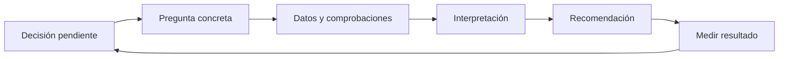

El ciclo es deliberadamente circular. Una recomendación no cierra el trabajo: genera una acción cuya consecuencia debe medirse. Si la campaña cambia, habrá que volver a comprobar pedidos, margen y posibles efectos no deseados.

## Ejemplo trabajado

Petición inicial: “las ventas van mal”.

Una respuesta precipitada sería abrir un gráfico mensual y proponer bajar precios. Una respuesta analítica empieza preguntando: “¿qué decisión está sobre la mesa?”. Supongamos que la decisión es redistribuir 20 000 euros de publicidad. Entonces la pregunta puede ser: “¿Qué canal explica la caída de pedidos de junio frente al promedio de marzo a mayo, y cuál mantiene margen suficiente para recibir inversión?”

La pregunta obliga a definir después “pedido”, “canal”, “margen” y los periodos. Aún no demuestra que un canal **cause** la caída; solo delimita qué evidencia buscar.

## Límite importante: describir no es explicar causas

Que los pedidos hayan bajado después de una campaña no prueba que la campaña sea la causa. Puede haber estacionalidad, un fallo técnico, cambios de precio o clientes distintos. El análisis descriptivo dice qué ocurrió; una explicación causal exige comparaciones y diseño más cuidadoso, que se estudiará más adelante.

## Resumen y comprobación

- El analista ayuda a decidir con evidencia trazable.
- Una cifra es un indicio, no una conclusión.
- El trabajo continúa después de recomendar: hay que medir el resultado.

Pregúntate: ¿qué decisión cambiaría si el análisis mostrara que la caída procede solo de usuarios nuevos? ¿Qué dato adicional pedirías antes de recomendar bajar precios?

Sigue con [preguntas, hipótesis, evidencia y métricas](02-preguntas-hipotesis-y-evidencia.md) y después resuelve el [ejercicio del bloque](../../../ejercicios/temario-00/comprension/preguntas.md).

# Preguntas, hipótesis, evidencia y métricas

## Objetivos y prerrequisitos

Aprenderás a convertir una petición ambigua en una pregunta medible, a separar una hipótesis de un hecho y a pedir una métrica bien definida. Parte de la lección anterior; no requiere matemáticas avanzadas.

## Una pregunta que se pueda comprobar

“Queremos que más personas usen la aplicación” expresa un deseo, no una pregunta. Para que un equipo pueda investigar necesita concretar cuatro piezas: la **población** (quiénes), el **resultado** que se observa, el **periodo** y la **comparación**.

Ejemplo: “Entre quienes instalaron la aplicación en mayo, ¿qué porcentaje completó su primera reserva en siete días, frente a quienes la instalaron en abril?”. Ya se puede buscar evidencia, y también se puede discutir si siete días es una ventana razonable.

## Hecho, hipótesis y evidencia

Una **hipótesis** es una explicación provisional que podría ser falsa: “el formulario largo reduce las reservas”. La **evidencia** es la información que apoya o cuestiona esa explicación: registros de pasos completados, una comparación entre versiones o entrevistas. Un resultado observado es: “solo el 42 % llega al último paso”. No confundas el resultado con su causa.

Este mapa responde a “¿qué hay que mantener separado para razonar con rigor?”

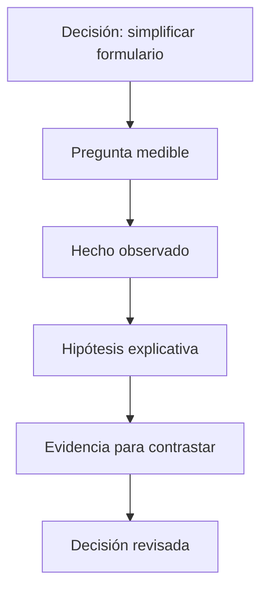

La flecha no convierte una hipótesis en verdad. La evidencia puede hacerla más plausible, descartarla o mostrar que faltan datos.

## Qué significa “métrica”

Una **métrica** es una medida cuya regla se puede repetir. “Usuarios activos” no basta si nadie sabe si cuenta una apertura de la app, una reserva, un día o un mes. Una definición mínima incluye fórmula, población, periodo, fuente y responsable.

Por ejemplo: “tasa de primera reserva a siete días = personas que reservan en los siete días posteriores a instalar / personas que instalan, para instalaciones de mayo, excluyendo cuentas de prueba”. Otra persona debe llegar al mismo número al aplicar la misma regla.

Un **KPI** es una métrica elegida para seguir un objetivo importante. No todo número es KPI: si una métrica no orienta una decisión, quizá es ruido o contexto, no una prioridad.

## Error habitual: optimizar el número equivocado

Si se premia solo “reservas creadas”, un equipo podría facilitar reservas que luego se cancelan. Por eso una métrica principal suele necesitar una métrica de protección: junto a reservas, vigilar cancelaciones, reclamaciones o margen. Este riesgo se retomará al diseñar árboles de métricas.

## Resumen y práctica

- Una pregunta comprobable delimita población, resultado, periodo y comparación.
- Una hipótesis explica provisionalmente; la evidencia la contrasta.
- Una métrica reproducible tiene una definición, no solo un nombre.

Redacta una pregunta sobre el uso de una app y añade una hipótesis alternativa que también pudiera explicar el resultado. Después completa [los ejercicios](../../../ejercicios/temario-00/comprension/preguntas.md).

# Cómo estudiar y trabajar de forma reproducible

## Objetivos y prerrequisitos

Sabrás organizar una sesión de estudio desde el móvil o un ordenador, usar ayuda de AI sin delegar el razonamiento y dejar rastro de tus decisiones. No hace falta instalar nada.

## Teoría, práctica y recuperación

Leer una explicación da familiaridad, pero no garantiza que puedas aplicarla. Alterna tres acciones: comprender un ejemplo, resolver uno parecido sin mirar y explicar con tus palabras por qué la respuesta tiene sentido. Ese último paso descubre lagunas antes de que se conviertan en hábitos.

Una sesión mínima desde el móvil puede consistir en leer una lección, responder dos preguntas de comprobación en notas y revisar la solución solo después. Cuando tengas navegador con teclado, abre el notebook de práctica en Google Colab: un **notebook** es una página que mezcla texto, código ejecutable y resultados; lo estudiarás desde cero en Python.

## Reproducibilidad: poder revisar el camino

Un análisis es **reproducible** si otra persona puede entender qué datos se usaron, qué reglas se aplicaron y cómo se llegó a una conclusión. No requiere una herramienta sofisticada al principio: basta con anotar la pregunta, la fecha, los supuestos y los cambios.

El siguiente flujo responde a “¿qué debe conservarse para que una conclusión sea revisable?”


Si falta un eslabón, alguien puede ver un número final pero no comprobar si era apropiado. Más adelante Git, tickets de Jira y documentación permitirán hacer este proceso colaborativo.

## Usar AI como tutor, no como piloto automático

Una buena petición a una AI incluye contexto: “No sé qué es una lista en Python; explícame este error con un ejemplo de gastos y pregúntame después”. Pide que explique cada línea y cambia un valor para comprobar que entiendes el efecto. Nunca des por correcta una consulta, gráfico o conclusión solo porque suena convincente: ejecútala, verifica los supuestos y conserva la fuente.

## Diagnóstico inicial y ruta adaptable

Si ya manejas porcentajes, medias o álgebra, puedes leer el bloque de matemáticas como repaso y dedicar más atención a sus aplicaciones analíticas. No conviene saltarse la definición de métricas, incertidumbre o sesgo: conocer la fórmula no garantiza interpretar bien un dato empresarial.

## Resumen y siguiente paso

- Estudiar implica recuperar y aplicar, no solo leer.
- Reproducibilidad conserva pregunta, datos, pasos, resultado y límites.
- AI acelera la práctica si puedes explicar y verificar su respuesta.

Completa el [diagnóstico inicial](../../../evaluaciones/diagnosticos/diagnostico-inicial.md). Después continúa con el [bloque 01](../../01-fundamentos-datos/README.md): allí se explicará primero qué es un archivo, una tabla y una observación.

# Bloque 01 - Fundamentos de datos: desde archivos hasta calidad

## Propósito

Antes de programar o abrir una base de datos, Leo debe entender qué representa un dato, cómo se organiza la información y por qué una cifra aparentemente correcta puede conducir a una decisión equivocada. Este bloque no presupone que sepas qué es CSV, JSON, una tabla o una clave.

## Resultado de salida

Al terminar podrás abrir un archivo sencillo y explicar qué información contiene, distinguir una tabla de un documento JSON, identificar el grano de un conjunto de datos, proponer controles de calidad y reconocer límites de privacidad y sesgo.

## Lecciones

1. [Qué es un dato, un archivo y una tabla](lecciones/01-archivo-tabla-y-grano.md).
2. [Filas, columnas, tipos y relaciones](lecciones/02-filas-columnas-y-relaciones.md).
3. [CSV, JSON, Excel, Parquet y bases de datos](lecciones/03-formatos-y-almacenamiento.md).
4. [Calidad, ausencia, sesgo, privacidad y ética](lecciones/04-calidad-y-uso-responsable.md).

## Práctica

Realiza [la auditoría de calidad](../../ejercicios/temario-01/comprension/auditoria-calidad.md) después de la lección 4 y compárala con [la solución razonada](../../soluciones/temario-01/auditoria-calidad.md).

# 01.1 Qué es un dato, un archivo y una tabla

## Objetivos

Entender qué es un dato antes de hablar de herramientas; distinguir una información suelta de un conjunto organizado; y reconocer qué representa una fila de una tabla.

## Empieza por una situación cotidiana

Imagina una tienda que quiere saber qué productos se venden más. Cada vez que una persona compra algo, la tienda puede guardar información: fecha, producto, importe y forma de pago. Cada una de esas piezas es un **dato**: una representación de algo que ocurrió en el mundo real.

La información se guarda en un **archivo**, igual que una fotografía o una nota de texto. Un archivo tiene nombre, contenido y un formato que indica cómo se organiza. No hay magia: un archivo de datos es una manera de guardar información para poder leerla, compartirla o analizarla después.

Una de las formas más comunes de organizar datos es una **tabla**. Una tabla se parece a una hoja de cálculo: tiene columnas que describen qué tipo de información guardamos y filas que recogen casos concretos.

```text
fecha       | producto | importe | canal
2026-01-03  | teclado  | 45.99   | web
2026-01-04  | ratón    | 19.90   | tienda
2026-01-04  | teclado  | 45.99   | web
```

En este ejemplo, la primera fila de datos representa una compra concreta. La columna `producto` responde qué se compró; `importe`, cuánto costó. La tabla no “sabe” qué significa un teclado: nosotros le damos significado a las columnas.

## El grano: la pregunta que evita errores grandes

El **grano** indica qué representa exactamente una fila. Aquí, una fila representa una compra, no un cliente ni un producto. Esta frase parece pequeña, pero evita errores muy caros: si se cuenta una fila como si fuera una persona, un cliente que compra tres veces se contará como tres clientes.

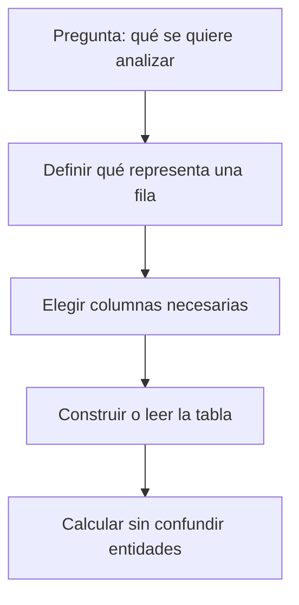

Antes de cualquier análisis, completa siempre esta frase: “cada fila de este conjunto representa…”. Si no puedes completarla, no empieces a sumar ni a calcular promedios.

## Ejemplo IT

Una aplicación registra eventos. Una tabla puede tener una fila por clic, otra por sesión y otra por usuario. Son tablas distintas con granos distintos. Contar clics no responde cuántos usuarios usaron la aplicación; contar sesiones tampoco responde directamente cuántas personas pagaron.

## Error frecuente

Pensar que una tabla es “la realidad”. Una tabla es un modelo parcial. Puede no incluir compras hechas por teléfono, usuarios anónimos o devoluciones. Siempre pregunta qué no está en los datos.

## Comprobación

Para una academia online, escribe el grano de tres tablas posibles: una de alumnos, una de inscripciones y una de visualizaciones de vídeo. ¿Por qué no deben mezclarse sin una relación explícita?

# 01.2 Filas, columnas, tipos y relaciones

## Objetivos

Aprender a leer una tabla con precisión: distinguir filas y columnas, reconocer tipos básicos de datos y entender por qué una clave permite relacionar tablas sin duplicar significado.

## Filas y columnas no son solo una forma visual

Una **fila** contiene información de un caso. Una **columna** guarda el mismo tipo de atributo para muchos casos. En una tabla de compras, `importe` debería contener números; en una tabla de usuarios, `fecha_registro` debería contener fechas. El tipo de información determina qué operaciones tienen sentido.

No tiene sentido calcular la media de `ciudad`; sí puede tener sentido contar cuántos usuarios hay por ciudad. No tiene sentido ordenar alfabéticamente un importe para encontrar la venta mayor; sí tiene sentido convertirlo a número y compararlo.

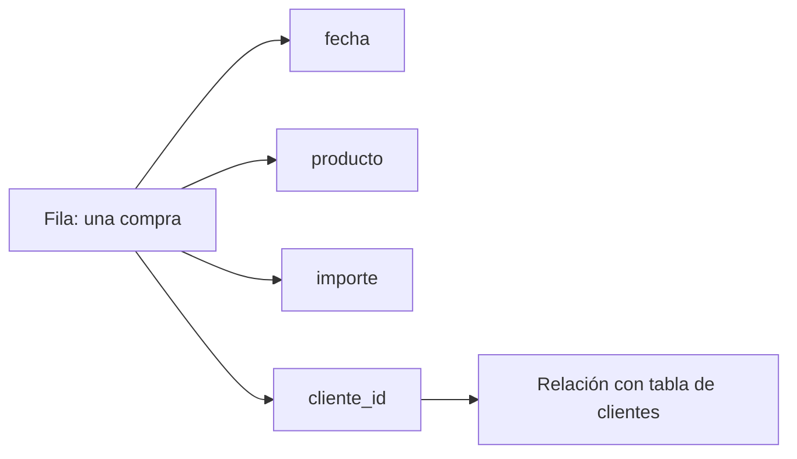

## Tipos que encontrarás al empezar

- **Texto:** nombre de producto, ciudad, comentario.
- **Número:** importe, cantidad, edad, latencia.
- **Fecha y hora:** momento de registro, compra o despliegue.
- **Booleano:** verdadero/falso; por ejemplo, `es_cliente`.
- **Categoría:** conjunto limitado de etiquetas, como plan `gratis`, `pro` o `empresa`.

Un número puede representar cosas distintas: un identificador `cliente_id=1042` parece número, pero no debes calcular su media. Es una etiqueta técnica, no una cantidad.

## Claves y relaciones

Una **clave** es una columna que permite identificar o conectar información. Si `cliente_id` identifica de forma única a cada cliente, se llama clave primaria de la tabla de clientes. La misma columna puede aparecer en la tabla de compras para indicar quién realizó cada compra; allí actúa como clave foránea o referencia.

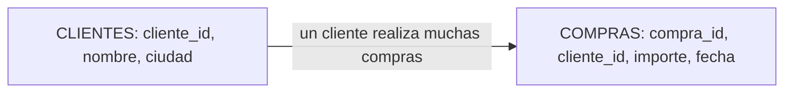

La relación dice: un cliente puede realizar muchas compras; una compra pertenece a un cliente. Esta información es esencial al combinar tablas. Si una tabla de clientes tiene accidentalmente dos filas para el mismo `cliente_id`, una unión puede duplicar importes sin que el error sea evidente.

## Error frecuente

Confundir un identificador con una medida. `pedido_id` y `cliente_id` sirven para identificar; no para hacer promedios. También es un error asumir que una columna “única” realmente lo es sin comprobar duplicados y nulos.

## Comprobación

Diseña las columnas mínimas de una tabla de tickets de soporte. ¿Qué representa cada fila? ¿Qué columna conectaría un ticket con un cliente? ¿Cuál parece numérica pero no debe tratarse como medida?

# 01.3 CSV, JSON, Excel, Parquet y bases de datos

## Objetivos

Saber qué problema resuelve cada formato básico y elegir una forma razonable de guardar o recibir información sin memorizar una lista de siglas.

## CSV: una tabla escrita como texto

Un archivo **CSV** significa *Comma-Separated Values*: valores separados por comas. Es un archivo de texto que representa una tabla. La primera línea suele contener los nombres de las columnas; cada línea posterior es una fila.

```text
fecha,producto,importe
2026-01-03,teclado,45.99
2026-01-04,ratón,19.90
```

CSV es sencillo de abrir, compartir y leer con Python, Excel o un editor de texto. Su simplicidad también tiene límites: no guarda bien tipos complejos, fórmulas, varias hojas ni una estructura dentro de otra. Además, hay que acordar separador, codificación, formato de fecha y separador decimal.

## JSON: una ficha que puede contener otras fichas

**JSON** significa *JavaScript Object Notation*. Es texto estructurado mediante pares `campo: valor`. A diferencia de un CSV, puede guardar objetos dentro de objetos y listas. Es frecuente en APIs, configuraciones y eventos de aplicaciones.

```json
{
  "pedido_id": 1001,
  "cliente": {
    "nombre": "Leo",
    "ciudad": "Madrid"
  },
  "productos": ["teclado", "ratón"],
  "importe": 65.89
}
```

El JSON anterior es una ficha de pedido. No es una tabla, aunque se pueda transformar en una. Para analizar muchos pedidos, normalmente tendrás que decidir qué campos extraer y cómo convertir listas u objetos anidados en columnas o tablas relacionadas.

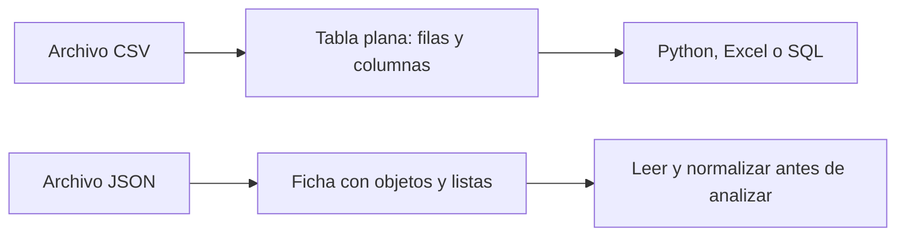

## Excel, Parquet y bases de datos

**Excel** es una aplicación y un formato de libro de trabajo; es útil para revisión manual, cálculos ligeros y comunicación. No es ideal como fuente única de procesos repetibles si múltiples personas lo editan sin control.

**Parquet** es un formato optimizado para datos tabulares grandes. Guarda columnas de forma eficiente y conserva tipos mejor que CSV. Normalmente lo usarás mediante Python, Spark, DuckDB o un warehouse, no editándolo a mano.

Una **base de datos** organiza información para que aplicaciones y personas puedan consultarla con reglas de acceso, relaciones y actualizaciones. SQL es un lenguaje para consultar muchas bases relacionales; MongoDB almacena documentos similares a JSON; DynamoDB se diseña alrededor de claves y patrones de acceso.

## Cómo elegir sin obsesionarte

Empieza preguntando: ¿necesito una tabla simple que cualquiera pueda abrir? CSV. ¿Recibo una respuesta con estructuras anidadas de una API? JSON. ¿Trabajo con muchos datos tabulares repetidamente? Parquet o una base de datos. ¿Necesito revisar manualmente algo pequeño? Excel puede ser adecuado.

La elección no elimina el deber de conocer grano, calidad y significado.

## Comprobación

Explica a otra persona la diferencia entre CSV y JSON sin usar las palabras “plano” ni “anidado”. Después indica cuál esperarías recibir de una API meteorológica y por qué.

# 01.4 Calidad, ausencia, sesgo, privacidad y uso responsable

## Objetivos

Revisar un conjunto de datos antes de analizarlo, interpretar ausencias sin borrarlas por costumbre y reconocer que una decisión basada en datos también puede causar daño.

## Calidad como condición de confianza

La calidad no significa que un dataset sea perfecto. Significa que conocemos si es adecuado para una decisión concreta. Una tabla de compras puede ser suficiente para estimar ingresos diarios y no serlo para saber satisfacción de clientes.

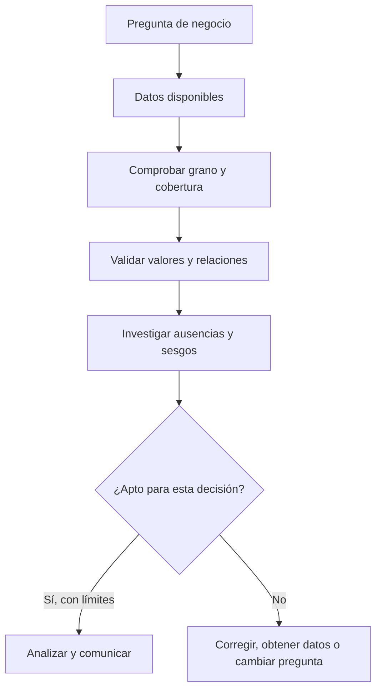

Cinco controles iniciales son especialmente útiles:

- **Completitud:** ¿faltan valores necesarios para la pregunta?
- **Validez:** ¿los valores respetan reglas, unidades y formatos?
- **Consistencia:** ¿la misma idea está registrada de la misma forma?
- **Unicidad:** ¿existen duplicados indebidos?
- **Actualidad:** ¿el dato llega a tiempo para la decisión?

## Los nulos cuentan una historia

Un valor ausente no es automáticamente un error. Puede significar “no se aplica”, “no se midió”, “falló el sistema” o “la persona prefirió no responder”. Borrar todas las filas con nulos puede eliminar justo a la población con la que tienes un problema.

Por ejemplo, si el campo `ingresos` falta sobre todo en usuarios que abandonan un formulario, la ausencia es información sobre fricción. Antes de imputar o eliminar, mide dónde faltan datos, desde cuándo y en qué segmentos.

## Sesgo, privacidad y propósito

Un dataset puede representar peor a grupos que usan menos una aplicación, tienen conectividad limitada o no están incluidos en la fuente. Un modelo entrenado con esos datos puede amplificar esa desigualdad. El analista debe declarar cobertura, exclusiones y riesgos, no tratarlos como una nota al pie.

La privacidad comienza antes de abrir un archivo: recoge solo los datos necesarios, evita copiar identificadores personales en notebooks, limita acceso y define cuánto tiempo se conservan. Que un sistema permita acceder a una columna no significa que sea legítimo usarla para cualquier objetivo.

## Caso práctico

Una empresa quiere comparar uso por ciudad, pero el 30 % de usuarios no informa ciudad y ese porcentaje es mayor en móvil. Concluir que “móvil usa menos el producto en ciertas ciudades” sin estudiar la ausencia puede ser falso. Primero se investiga el formulario, la geolocalización, el consentimiento y los segmentos afectados.

## Comprobación

Elige una de las cinco dimensiones de calidad y describe: un error concreto, cómo lo detectarías, qué decisión podría dañar y cuál sería una respuesta prudente.

# Bloque 02 - Python desde cero

## Propósito

Aprender a leer, escribir y depurar programas pequeños antes de usar bibliotecas de análisis. El objetivo no es memorizar sintaxis: es expresar una regla de negocio de forma clara y verificable.

## Lecciones

1. [Ejecutar código, valores y variables](lecciones/01-entorno-valores-y-variables.md)
2. [Listas, diccionarios y datos sencillos](lecciones/02-colecciones-y-datos-sencillos.md)
3. [Decisiones y repeticiones](lecciones/03-condiciones-y-bucles.md)
4. [Funciones y alcance](lecciones/04-funciones-y-alcance.md)
5. [Errores y depuración](lecciones/05-errores-y-depuracion.md)
6. [Estilo y práctica guiada](lecciones/06-estilo-y-practica-gastos.md)

## Prerrequisitos

Haber leído los bloques 00 y 01. Basta con saber que un dato debe tener significado y que una regla analítica debe poder revisarse.

## Práctica

Abre el [notebook de gastos personales](../../notebooks/practicas/02-gastos-personales.ipynb) o [ejecútalo en Google Colab](https://colab.research.google.com/github/Ayhur/CursoAnalista/blob/main/notebooks/practicas/02-gastos-personales.ipynb). También puedes resolver [el ejercicio](../../ejercicios/temario-02/aplicacion/gastos-personales.md). Las [soluciones](../../soluciones/temario-02/gastos-personales.md) se consultan al terminar.

# Ejecutar código, valores y variables

## Objetivos y prerrequisitos

Aprenderás qué hace un programa, cómo ejecutar una celda de notebook y cómo guardar un resultado con un nombre. No necesitas experiencia previa.

## Código que transforma valores

Un programa es una lista de instrucciones que transforma información. En un análisis, esa información puede ser el importe de una compra, una fecha o una respuesta de usuario. Un **valor** es una pieza concreta de información: `1200`, `"web"` o `True` (verdadero).

En Google Colab, un notebook muestra una celda de código y su resultado. Ejecuta primero esto y cambia después un único valor:

```python
ventas = 1200
objetivo = 1500
cumplimiento = ventas / objetivo
print(cumplimiento)
```

Una **variable** es un nombre que referencia un valor. Aquí `cumplimiento` guarda el resultado `0.8`. El signo `=` no pregunta si dos cosas son iguales: asigna el valor de la derecha al nombre de la izquierda.

## Tipos: la forma del dato importa

Python distingue números enteros (`3`), decimales (`3.5`), texto (`"Madrid"`), booleanos (`True` o `False`) y ausencia representada por `None`. El tipo condiciona qué operaciones tienen sentido: sumar `3 + 5` es válido; sumar `"3" + "5"` une texto y produce `"35"`.

Esta secuencia responde a “¿por qué revisar el tipo antes de calcular?”

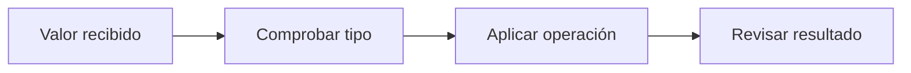

El paso de comprobar evita, por ejemplo, tratar un importe escrito como texto como si fuera dinero calculable.

## Error habitual

`ventas = ventas + 100` parece una igualdad matemática imposible. En programación significa “toma el valor actual de ventas, súmale 100 y guarda el nuevo resultado bajo el mismo nombre”. Usarlo sin cuidado puede ocultar el valor original; cuando importe, conserva ambos nombres: `ventas_iniciales` y `ventas_actualizadas`.

## Resumen y comprobación

- Una celda ejecuta instrucciones y muestra un resultado.
- Una variable etiqueta un valor; no es una caja mágica independiente.
- El tipo determina qué cálculo es válido.

Prueba `type(ventas)` y `type("1200")`. Explica por qué se diferencian. Continúa con [colecciones](02-colecciones-y-datos-sencillos.md).

# Listas, diccionarios y datos sencillos

## Objetivos y prerrequisitos

Sabrás agrupar varios valores y representar una compra sencilla antes de conocer las tablas de Pandas. Requiere variables y tipos básicos.

## Cuando un valor no basta

Una lista guarda una secuencia ordenada. Por ejemplo, los importes de tres pedidos:

```python
importes = [12.50, 18.00, 7.20]
primer_importe = importes[0]
```

Los corchetes indican una **lista** y el índice empieza en cero: `importes[0]` es el primer elemento. Esto sorprende al principio, así que no intentes “corregirlo”: compruébalo imprimiendo el resultado.

Un **diccionario** asocia una clave con un valor. Es útil para una observación con campos nombrados:

```python
pedido = {"canal": "web", "importe": 42.50, "pagado": True}
print(pedido["importe"])
```

La clave evita depender de una posición. Una lista de diccionarios puede representar varias compras pequeñas; más adelante Pandas convertirá esa estructura en una tabla.

## Relación con datos reales

Una API —un mecanismo para que programas intercambien información— suele devolver listas y diccionarios similares. Eso no elimina la necesidad de validar: que un campo se llame `importe` no garantiza que sea numérico, completo o esté expresado en la misma moneda.

## Límite y práctica

`pedido["descuento"]` provoca un error si esa clave no existe. No inventes un cero sin preguntar qué significa que falte: podría significar “sin descuento”, “dato desconocido” o “campo no recogido”.

Resume con tus palabras la diferencia entre lista y diccionario y continúa con [condiciones y bucles](03-condiciones-y-bucles.md).

# Decisiones y repeticiones

## Objetivos y prerrequisitos

Aplicarás una regla distinta según un dato y repetirás una comprobación sobre varios pedidos. Requiere listas y diccionarios.

## Condiciones: expresar una regla

Una condición permite que el programa elija. `if` pregunta por una expresión que da `True` o `False`:

```python
importe = 120
if importe >= 100:
    categoria = "pedido alto"
else:
    categoria = "pedido habitual"
```

La sangría no es decoración: las líneas desplazadas pertenecen a la rama de la condición. La regla debe coincidir con una definición de negocio. Pregunta si exactamente 100 debe contarse como alto antes de decidir entre `>` y `>=`.

## Bucles: repetir sin copiar código

Un bucle `for` visita cada elemento de una colección. El siguiente acumula importes y muestra la idea de agregación que luego hará Pandas:

```python
total = 0
for importe in [12.5, 18.0, 7.2]:
    total = total + importe
print(total)
```

Este flujo responde a “¿qué ocurre para cada dato de entrada?”


El programa repite el mismo criterio; no decide de forma inteligente qué regla usar. La calidad de la conclusión depende de que la regla y los datos sean apropiados.

## Error habitual

No modifiques una lista mientras la recorres salvo que entiendas las consecuencias: puedes saltarte elementos. Para aprender, crea una lista nueva para los resultados o revisa primero el tamaño y contenido de la original.

## Resumen

Las condiciones expresan criterios y los bucles los aplican repetidamente. Sigue con [funciones](04-funciones-y-alcance.md).

# Funciones y alcance

## Objetivos y prerrequisitos

Aprenderás a encapsular una regla reutilizable, diferenciar entrada y salida y evitar depender de variables ocultas. Requiere condiciones y bucles.

## Dar nombre a una transformación

Una **función** es un fragmento de código con un nombre, entradas y una salida. Evita copiar la misma regla en diez lugares y hace que el análisis se pueda revisar por partes.

```python
def clasificar_importe(importe):
    if importe >= 100:
        return "alto"
    return "habitual"

clasificar_importe(120)
```

`importe` es un **parámetro**: el nombre que la función usa para recibir un dato. `return` devuelve un resultado. Una función útil responde una pregunta concreta: “dado un importe, ¿qué etiqueta corresponde según esta regla?”.

## Alcance: qué nombres existen dónde

Los nombres creados dentro de una función normalmente solo existen durante esa llamada. Esto se llama **alcance**. Es una protección: una función debería depender de sus entradas, no de una variable lejana cuyo valor puede cambiar sin avisar.

```python
limite = 100

def es_alto(importe, limite):
    return importe >= limite
```

Aunque parece repetitivo pasar `limite`, deja visible el supuesto. En un análisis, los supuestos invisibles son difíciles de auditar.

## Caso IT y límite

Una función puede estandarizar una comprobación de eventos: clasificar una duración de carga como lenta o aceptable. Pero no convierte el umbral en verdad universal: 2 segundos puede ser aceptable en una página y grave durante un pago. Documenta de dónde sale el umbral.

## Resumen y práctica

- Las funciones nombran transformaciones repetibles.
- Parámetros hacen visibles las entradas; `return` entrega la salida.
- Evitar dependencias ocultas facilita revisar y probar.

Reescribe el cálculo de “pedido alto” como función y pruébalo con 99, 100 y 101. Después estudia [errores y depuración](05-errores-y-depuracion.md).

# Errores y depuración

## Objetivos y prerrequisitos

Sabrás leer el mensaje de error, formular una hipótesis mínima y comprobarla sin cambiar diez cosas a la vez. Requiere haber ejecutado código sencillo.

## Un error también es evidencia

Cuando Python no puede continuar, muestra un mensaje con una última línea relevante. `NameError` suele indicar que un nombre no existe; `TypeError`, que se intentó una operación incompatible; `KeyError`, que falta una clave del diccionario. El mensaje no sustituye la comprensión, pero delimita qué revisar.

Ejemplo:

```python
importe = "42.50"
importe + 10
```

El problema no es que Python “falle”: `importe` contiene texto, no un número. La corrección solo debe hacerse si la regla de origen confirma que ese texto representa un importe válido:

```python
importe_numerico = float(importe)
```

## Método de depuración

Este flujo responde a “¿cómo investigar sin adivinar?”

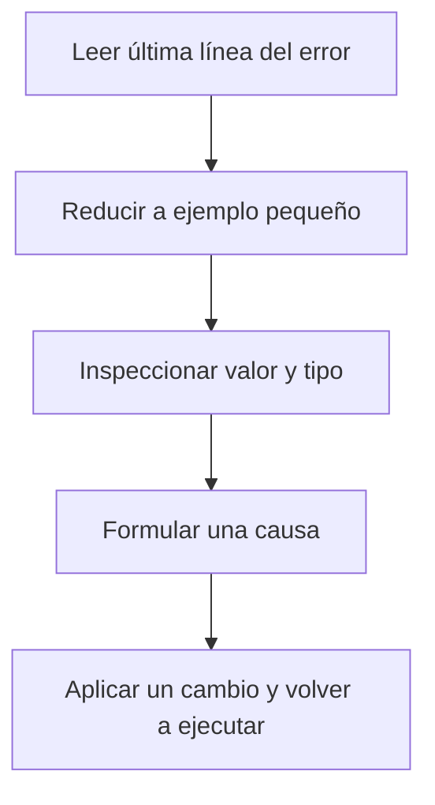

Reducir el ejemplo evita mezclar varios problemas. Usa `print(valor)` y `type(valor)` antes de cambiar código. Si la causa es un dato inesperado, no la tapes con una conversión automática: registra cuántos casos hay y decide qué significan.

## Error habitual: silenciar en lugar de entender

`try/except` permite manejar errores, pero capturarlos todos y continuar puede ocultar importes inválidos o pedidos perdidos. Úsalo para casos esperados y registra qué ocurrió. Un análisis correcto que descarta silenciosamente el 20 % de los datos no es fiable.

## Resumen

Depurar es un proceso de evidencia: leer, aislar, inspeccionar, probar. Continúa con [estilo y práctica](06-estilo-y-practica-gastos.md).

# Estilo y práctica guiada

## Objetivos y prerrequisitos

Aplicarás las piezas del bloque en un problema pequeño y aprenderás a escribir código que otra persona pueda leer. Requiere todas las lecciones anteriores.

## Legibilidad es una propiedad analítica

Un programa de análisis no se evalúa solo por “funciona hoy”. Debe dejar claro qué representa cada valor y qué regla se aplicó. Usa nombres como `gasto_por_categoria`, no `x`; evita repetir números mágicos como `100` sin explicar su significado; separa carga de datos, transformación y resultado.

Un ejemplo legible:

```python
LIMITE_REVISAR = 100

def categorias_sobre_limite(movimientos, limite):
    total_por_categoria = {}
    for movimiento in movimientos:
        categoria = movimiento["categoria"]
        importe = movimiento["importe"]
        total_por_categoria[categoria] = total_por_categoria.get(categoria, 0) + importe
    return [categoria for categoria, total in total_por_categoria.items() if total > limite]
```

Antes de reutilizarlo en una empresa, define cómo se tratan devoluciones, moneda, movimientos duplicados y valores ausentes. El código implementa una decisión; no decide por ti qué es correcto.

## Comprobaciones mínimas

Prueba casos normales y casos límite: lista vacía, importe exactamente 100, importe negativo y un texto donde debería haber número. Escribir esos ejemplos antes de confiar en el resultado es una forma simple de prueba.

## Ejercicio de cierre

Resuelve la [práctica de gastos](../../../ejercicios/temario-02/aplicacion/gastos-personales.md) y compara tu razonamiento con las [soluciones](../../../soluciones/temario-02/gastos-personales.md) solo al terminar. Si solo tienes móvil, escribe primero el pseudocódigo en texto: entradas, pasos y salidas.

## Puente al siguiente bloque

Python permite operar con estructuras pequeñas. En NumPy y Pandas aplicarás operaciones parecidas a miles de valores y tablas, pero conservarás las mismas preguntas: ¿qué representa cada dato?, ¿qué regla se aplica?, ¿cómo se comprueba?

# Bloque 03 - Matemáticas aplicadas al análisis

## Propósito y ruta adaptable

Conectar herramientas matemáticas con decisiones de negocio y análisis. Si manejas porcentajes, medias ponderadas, funciones y vectores, usa las explicaciones generales como repaso; las aplicaciones, los límites y la interpretación no son opcionales.

## Lecciones

1. [Magnitudes, porcentajes y tasas](lecciones/01-magnitudes-porcentajes-y-tasas.md)
2. [Promedios, ponderación y agregación](lecciones/02-promedios-ponderacion-y-agregacion.md)
3. [Funciones, vectores y matrices](lecciones/03-funciones-vectores-y-matrices.md)
4. [Tiempo, crecimiento y comparaciones](lecciones/04-tiempo-crecimiento-y-comparaciones.md)

## Resultado esperado

Podrás calcular y comunicar un cambio sin mezclar unidades, elegir una agregación defendible y cuestionar comparaciones aparentemente obvias.

# Magnitudes, porcentajes y tasas

## Objetivos y prerrequisitos

Sabrás separar cambio absoluto, cambio relativo y puntos porcentuales. La aritmética básica es suficiente; si ya dominas fórmulas, céntrate en los ejemplos y errores de interpretación.

## Una cifra necesita unidad y referencia

Pasar de 100 a 120 pedidos supone un cambio absoluto de 20 pedidos y un crecimiento relativo del 20 %: `(120 - 100) / 100`. Ambas cifras son correctas, pero responden preguntas distintas. El cambio absoluto ayuda a estimar capacidad; el relativo permite comparar grupos de tamaño distinto.

Una tasa relaciona cantidades: por ejemplo, 30 compras de 1 000 visitas son una tasa de conversión del 3 %. No digas “subió un 2 %” si pasó de 3 % a 5 %: aumentó **2 puntos porcentuales** y aproximadamente un 66,7 % relativo. Esa diferencia cambia la percepción de impacto.

Este recorrido responde a “¿qué debe declararse antes de comparar un número?”

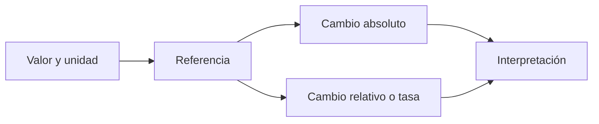

La referencia puede ser ayer, el objetivo, otro segmento o el mismo mes del año anterior; elegirla es una decisión analítica, no una operación automática.

## Ejemplo y contraejemplo

Una app pasa de 10 a 20 conversiones: +10 conversiones y +100 %. Otra pasa de 10 000 a 10 100: +100 conversiones pero +1 %. Presentar solo porcentaje hace enorme el primer cambio; presentar solo conteo oculta que el segundo afecta a más clientes. Comunica ambos cuando importen.

Un descenso del 20 % después de un aumento del 20 % no vuelve al inicio: `100 × 1,2 × 0,8 = 96`. Los porcentajes se aplican a bases distintas.

## Resumen y práctica

- Declara unidad, población y referencia.
- Distingue porcentaje, tasa y punto porcentual.
- El tamaño de la base cambia la interpretación.

Calcula el cambio absoluto, relativo y en puntos porcentuales si una conversión pasa de 4 % a 5 %. Luego sigue con [ponderación](02-promedios-ponderacion-y-agregacion.md).

# Promedios, ponderación y agregación

## Objetivos y prerrequisitos

Aprenderás cuándo un promedio resume un conjunto y cuándo lo distorsiona. Requiere comprender porcentajes y tasas.

## Un promedio siempre combina observaciones

La media aritmética suma valores y divide por su número. Es útil para importes comparables, pero una media de tasas puede ser engañosa si cada grupo tiene un tamaño distinto. Si el país A convierte 8 de 10 visitas (80 %) y B convierte 1 000 de 10 000 (10 %), la media simple de 45 % no describe la conversión conjunta. La respuesta correcta suma éxitos y oportunidades: `1008 / 10010`, aproximadamente 10,1 %.

Eso es una **media ponderada**: cada tasa pesa según su denominador. No es un detalle de fórmula; evita tomar decisiones de inversión basadas en segmentos pequeños y extremos.

## Agregar cambia el grano

Antes de sumar o promediar, pregunta qué representa una fila. Si cada fila es un pedido, sumar importes da ingresos por pedido. Si cada fila es un usuario mensual, sumar ingresos puede duplicar clientes que compraron varias veces. El nivel al que se describe un dato se llama **grano** y se estudió en el bloque 01.

## Error habitual: promedio de promedios

Un dashboard muestra conversión diaria y calcula la media de siete porcentajes. Puede ser válido si cada día tiene el mismo tráfico; si no, conviene dividir compras totales entre visitas totales. Conserva numerador y denominador: permiten revisar y reponderar.

## Resumen

El promedio no es neutral: depende de qué observaciones se incluyan y cuánto pesa cada una. Continúa con [funciones, vectores y matrices](03-funciones-vectores-y-matrices.md).

# Funciones, vectores y matrices

## Objetivos y prerrequisitos

Comprenderás las ideas matemáticas que harán legibles NumPy y Pandas: una función transforma entradas; un vector reúne valores; una matriz organiza muchos vectores.

## Transformar entradas en salidas

Una **función** expresa una relación: dado número de clientes y precio, devuelve ingresos. `ingresos(clientes, precio) = clientes × precio`. No afirma que ambas variables sean independientes ni que subir precio no cambie clientes: solo define el cálculo bajo unos supuestos.

Un **vector** es una lista ordenada de valores de la misma clase, por ejemplo las ventas de tres días: `[120, 140, 110]`. Una **matriz** organiza muchas filas de valores: cada fila podría ser un día y cada columna pedidos, ingresos y devoluciones. En código, un array de NumPy permitirá aplicar un cálculo a todos los elementos sin escribir un bucle manual.

## Relación con el análisis

Los objetos matemáticos no sustituyen el significado. Dos columnas con mil números pueden formar una matriz, pero no por ello es razonable sumarlas si una contiene euros y otra minutos. La estructura permite calcular; el contexto decide si el cálculo responde una pregunta válida.

## Resumen y puente

Funciones hacen explícitas transformaciones; vectores y matrices permiten representar muchas observaciones. En el bloque 04 aprenderás a manejarlos eficientemente con NumPy.

# Tiempo, crecimiento y comparaciones

## Objetivos y prerrequisitos

Sabrás elegir una comparación temporal defendible y distinguir nivel, variación y crecimiento acumulado. Requiere porcentajes.

## El tiempo no siempre avanza de forma comparable

Comparar junio con mayo puede ser útil, pero una tienda de viajes puede tener una estacionalidad fuerte: junio suele diferir de mayo por razones repetidas cada año. Compara también con junio del año anterior y con una referencia acordada. La elección depende de la decisión: planificación anual, respuesta a una incidencia o seguimiento semanal.

El crecimiento compuesto encadena cambios: si una métrica crece 10 % dos meses, el factor es `1,1 × 1,1 = 1,21`, no 1,20. Para comunicarlo, muestra periodo inicial, final y fórmula, no una etiqueta vaga de “crecimiento”.

## Límite: una serie no demuestra causalidad

Que una métrica cambie tras una acción no identifica por sí mismo la causa. El tiempo puede coincidir con campañas, festivos, cambios de mercado o problemas de medición. Las comparaciones temporales son evidencia descriptiva que requiere contexto, segmentos y, cuando sea necesario, experimentos.

## Cierre del bloque

Las matemáticas aplicadas sirven para no confundir escalas, promedios ni referencias. Antes de automatizar con NumPy o Pandas, pregunta siempre: ¿qué mide este número, sobre qué población y frente a qué comparación?

Aplica el bloque en la [práctica de tasas y promedios](../../../ejercicios/temario-03/aplicacion/tasas-y-promedios.md) antes de leer su solución.

# Bloque 04 - NumPy y cálculo vectorizado

## Propósito

Usar arrays para representar datos numéricos y aplicar cálculos sobre colecciones completas. NumPy prepara el modelo mental de Pandas, pero no reemplaza la comprensión del significado de cada número.

## Lecciones

1. [Arrays y cálculo vectorizado](lecciones/01-arrays-y-vectorizacion.md)
2. [Selección, máscaras y forma](lecciones/02-seleccion-mascaras-y-forma.md)
3. [Broadcasting, simulación y reproducibilidad](lecciones/03-broadcasting-simulacion-y-reproducibilidad.md)

# Arrays y cálculo vectorizado

## Objetivos y prerrequisitos

Sabrás crear un array numérico y aplicar un cálculo a todos sus elementos. Requiere entender listas y vectores de los bloques 02 y 03.

## De una lista a un array

Un **array** es una estructura para valores organizados, normalmente del mismo tipo, que permite operaciones numéricas eficientes. En Python se importa NumPy con un alias convencional:

```python
import numpy as np
ventas = np.array([120, 140, 110])
ventas_con_iva = ventas * 1.21
```

La última línea no multiplica la lista como texto ni requiere un `for`: aplica la operación elemento a elemento. Eso se llama **vectorización**. Expresa “aplica la misma regla a cada venta”, una intención fácil de revisar.

Este flujo responde a “¿qué ocurre cuando la regla llega a una colección completa?”

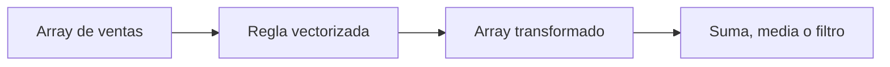

## Límite analítico

Que una operación sea rápida no la hace correcta. Multiplicar por 1,21 solo procede si todos los valores comparten moneda, representan importes sin IVA y la regla de negocio aplica a todos. Vectorizar una mala regla propaga el error más deprisa.

## Resumen

Un array reúne números; la vectorización aplica una operación a cada uno. En la siguiente lección seleccionarás subconjuntos sin perder de vista el criterio usado.

# Selección, máscaras y forma

## Objetivos y prerrequisitos

Aprenderás a elegir elementos por posición o condición y a interpretar la forma de un array. Requiere arrays básicos.

## Preguntar una condición a cada elemento

Una **máscara booleana** contiene `True` o `False` para cada posición. Es la traducción de una pregunta: “¿esta venta supera 100?”

```python
ventas = np.array([80, 125, 210])
es_alta = ventas > 100
ventas[es_alta]  # array([125, 210])
```

La máscara es valiosa porque hace visible el criterio. Antes de filtrar pedidos “altos”, define por qué 100 es el límite y revisa cuántos elementos quedan fuera.

La **forma** (`shape`) describe dimensiones. Un array de tres ventas tiene forma `(3,)`; una matriz de dos días y tres métricas puede tener `(2, 3)`. La forma no da significado a filas y columnas: debes documentarlo.

## Error habitual

Una máscara de longitud distinta al array no se puede aplicar correctamente. Más grave aún: una máscara correcta técnicamente puede estar desalineada conceptualmente si proviene de otro periodo o de clientes ordenados de forma distinta.

## Resumen

Seleccionar es formular un criterio. Comprueba siempre forma, orden y significado antes de combinar arrays.

# Broadcasting, simulación y reproducibilidad

## Objetivos y prerrequisitos

Comprenderás cómo NumPy combina dimensiones compatibles y por qué una simulación debe poder repetirse. Requiere forma y arrays.

## Broadcasting sin magia

**Broadcasting** es la regla por la que NumPy aplica un vector compatible a una matriz sin copiarlo manualmente. Si una matriz contiene ventas por día y canal, restar la media de cada canal puede centrar sus columnas. No memorices casos: imprime `shape` y comprueba qué dimensión representa cada valor antes de operar.

## Simular para explorar, no para fabricar evidencia

Puedes generar números aleatorios para practicar o evaluar un método. Una **semilla** fija el punto de partida del generador y permite repetir el mismo ejemplo:

```python
generador = np.random.default_rng(42)
muestra = generador.normal(loc=100, scale=15, size=5)
```

El 42 no hace la simulación más verdadera; hace el resultado reproducible. Una muestra simulada sirve para aprender o estudiar escenarios, no para afirmar qué hicieron clientes reales.

## Cierre y ejercicio

NumPy permite transformar, seleccionar y resumir números de forma concisa. Antes de Pandas, resuelve una práctica: crea ventas, aplica una máscara y explica qué supuesto contiene el umbral. Documenta semilla y forma. El mismo criterio se aplicará a tablas reales.

# Bloque 05 - Pandas: manipulación de datos

## Objetivo

Importar, limpiar, transformar y combinar tablas de datos con Pandas.

## El ciclo de preparación

Un DataFrame representa una tabla con filas y columnas etiquetadas. La primera tarea no es transformar: es inspeccionar tamaño, tipos, nulos, duplicados, rangos y ejemplos reales.

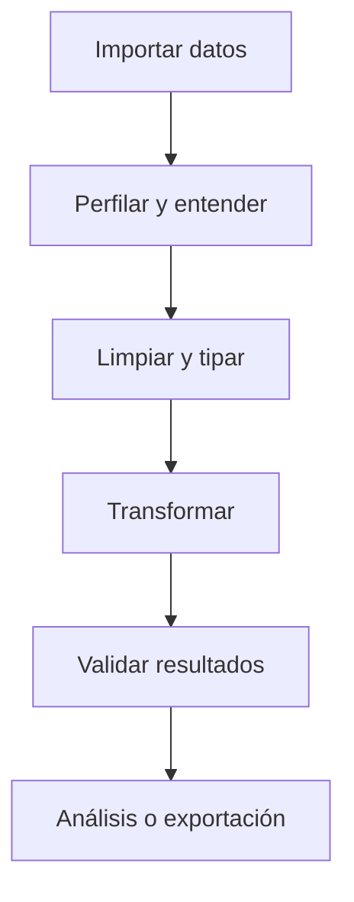

## Operaciones esenciales

- Seleccionar columnas y filtrar filas con condiciones.
- Convertir fechas, números y categorías explícitamente.
- Crear columnas derivadas con operaciones vectorizadas.
- Agrupar con `groupby` para resumir por segmento.
- Combinar fuentes con `merge`, verificando la cardinalidad de las claves.

## Uniones sin sorpresas

Antes de unir tablas identifica la clave y pregunta si es uno a uno, uno a muchos o muchos a muchos. Una unión inesperadamente muchos a muchos multiplica filas y puede inflar ingresos, usuarios o eventos.

## Validación

Después de una transformación compara número de filas, nulos y totales relevantes. Las validaciones simples son una red de seguridad más valiosa que un notebook elegante.

## Práctica

Resuelve [la limpieza de pedidos](../../ejercicios/temario-05/aplicacion/limpieza-pedidos.md) y después consulta [la solución razonada](../../soluciones/temario-05/limpieza-pedidos.md).

# Bloque 06 - Análisis exploratorio de datos

## Objetivo

Explorar datos de manera rigurosa para descubrir patrones, anomalías y preguntas nuevas sin confundir exploración con demostración causal.

## Preguntas antes de gráficos

Empieza por una hipótesis o pregunta: "¿qué segmento ha cambiado?", "¿dónde se concentran los valores atípicos?", "¿hay estacionalidad?". Un gráfico sin pregunta puede ser interesante, pero no necesariamente útil.

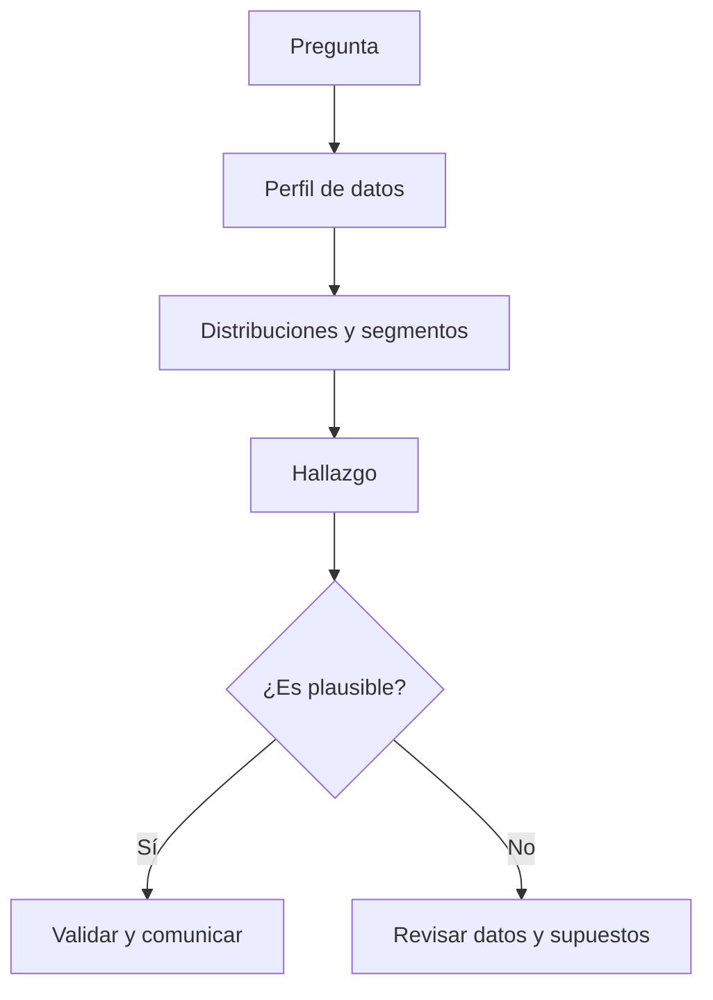

## Distribución y segmentos

Observa centro, dispersión, asimetría y valores extremos. Compara siempre segmentos relevantes: una media global puede ocultar que un canal crece mientras otro cae. No borres outliers sin investigar si representan un error, un caso importante o una población distinta.

## Correlación y causalidad

Dos variables pueden moverse juntas por azar, por una tercera causa o porque una afecta a la otra. El EDA genera hipótesis; experimentos, diseños causales o conocimiento del proceso ayudan a evaluar explicaciones.

## Registro de decisiones

Anota filtros, exclusiones, transformaciones y limitaciones. Un buen análisis permite responder no solo "qué encontraste", sino "cómo llegaste ahí".

## Práctica

Resuelve [la investigación de una caída](../../ejercicios/temario-06/aplicacion/investigar-caida.md) antes de mirar [la guía de solución](../../soluciones/temario-06/investigar-caida.md).

# Bloque 07 - Visualización y comunicación

## Objetivo

Elegir y construir visualizaciones que permitan comprender una decisión con rapidez, sin distorsionar los datos.

## Pregunta antes que gráfico

La elección empieza por el mensaje: compara categorías con barras, evolución temporal con líneas, distribución con histogramas o cajas, y relación entre dos variables con dispersión. No hay un gráfico universalmente mejor.

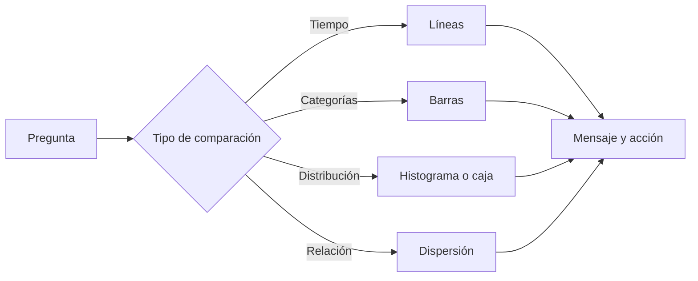

## Diseño honesto

Etiqueta ejes y unidades, usa escalas coherentes y evita cortar un eje de barras cuando convierta diferencias pequeñas en aparentes abismos. El color debe reforzar significado, no decorar. Piensa también en contraste y personas con visión reducida del color.

## De exploración a comunicación

Un gráfico exploratorio ayuda a pensar; uno explicativo ayuda a decidir. El segundo elimina elementos irrelevantes, destaca la comparación importante y añade un título que exponga el hallazgo, no solo el nombre de la métrica.

## Entregables profesionales

Un análisis suele terminar en un dashboard, una presentación, un ticket de Jira o una nota ejecutiva. Cada formato necesita contexto, definición de métricas, hallazgo, recomendación y limitaciones.

## Ejercicio

Haz el [diagnóstico de gráficos](../../ejercicios/temario-07/comprension/elegir-grafico.md) y comprueba [los criterios](../../soluciones/temario-07/elegir-grafico.md).

# Bloque 08 - Estadística para decisiones

## Objetivo

Medir incertidumbre, evaluar diferencias y comunicar resultados sin convertir el p-valor en una respuesta automática.

## Población, muestra y variabilidad

La población es el conjunto que te interesa; la muestra es la parte observada. Un estadístico resume una muestra y un parámetro describe la población. Muestras distintas producen resultados distintos: esa variabilidad es parte del problema, no un fallo.

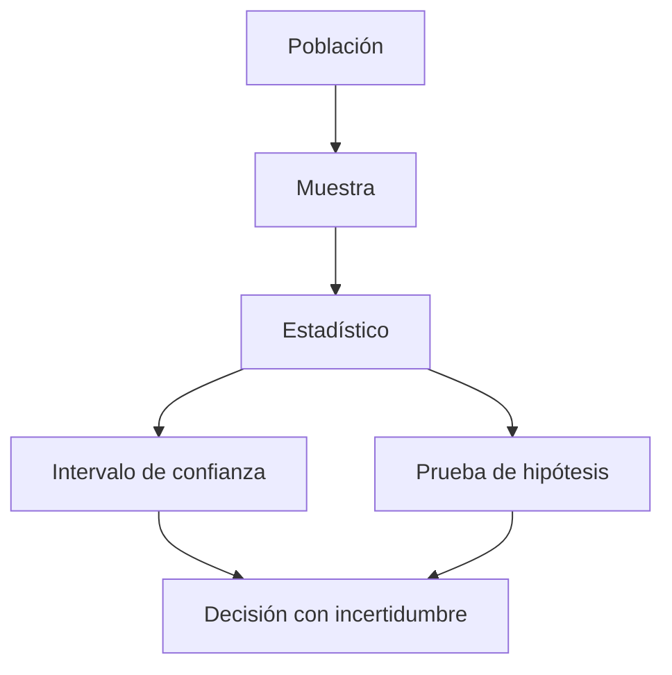

## Intervalos y pruebas

Un intervalo de confianza expresa un rango compatible con el método y los datos. Una prueba de hipótesis compara los datos con una hipótesis nula. Un p-valor pequeño no mide el tamaño del efecto, la importancia de negocio ni la probabilidad de que una hipótesis sea cierta.

## Experimentos A/B

Define antes la métrica principal, métricas de guardrail, duración y criterio de decisión. Evita mirar resultados cada día y declarar ganador en el primer pico: esa práctica aumenta falsos positivos.

## Tamaño del efecto

Una diferencia minúscula puede ser estadísticamente detectable con muchos datos y aun así no justificar ninguna acción. Comunica siempre efecto absoluto, efecto relativo, incertidumbre y coste de actuar.

## Práctica

Analiza [un experimento de onboarding](../../ejercicios/temario-08/aplicacion/experimento-onboarding.md) y revisa [la interpretación](../../soluciones/temario-08/experimento-onboarding.md).

# Bloque 09 - SQL, NoSQL y almacenamiento

## Objetivo

Entender cómo viven los datos en una empresa, consultar tablas con SQL y saber cuándo un modelo documental o clave-valor requiere una forma distinta de pensar.

## SQL para preguntas de negocio

SQL permite seleccionar, filtrar, agrupar, unir y ordenar datos. Para cada consulta define el grano: ¿una fila representa un pedido, un usuario, una sesión o un evento? El grano evita duplicar o perder información al usar `JOIN`.

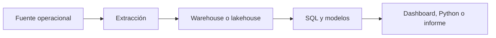

## NoSQL sin mitos

MongoDB almacena documentos flexibles y permite filtros y pipelines de agregación. DynamoDB organiza datos alrededor de claves y patrones de acceso con rendimiento predecible. Son excelentes para algunas aplicaciones operacionales; no reemplazan automáticamente un warehouse orientado a análisis histórico y uniones complejas.

## AI para consultas

MongoDB Atlas puede generar filtros y agregaciones a partir de lenguaje natural. Úsalo como borrador, no como autoridad: revisa semántica, filtros, coste, índices, datos sensibles y resultado. Una consulta que "parece" correcta puede contestar otra pregunta.

## Práctica

Resuelve [la consulta de conversión](../../ejercicios/temario-09/aplicacion/consulta-conversion.md) y compara con [la solución](../../soluciones/temario-09/consulta-conversion.md).

# Bloque 10 - Métricas, KPIs y analítica de producto

## Propósito del bloque

Este bloque enseña a construir un sistema de medición para un producto o negocio tecnológico. No se trata de aprender una lista de siglas ni de abrir un dashboard: se trata de decidir qué representa valor, cómo medirlo de forma consistente, qué señales deben activar una investigación y cómo evitar que una métrica optimizada localmente perjudique al producto.

## Resultado de salida

Al terminar podrás tomar una pregunta como “queremos crecer” y convertirla en un árbol de métricas con definiciones, instrumentación, guardrails, segmentos y una decisión asociada. También sabrás revisar un funnel, una cohorte o un dashboard de Amplitude sin aceptar sus cifras ciegamente.

## Prerrequisitos

- Bloque 00: preguntas y decisiones.
- Bloques 05–08: datos tabulares, exploración y estadística básica.
- Bloque 09: comprensión básica de fuentes y consultas.

## Lecciones

1. [Dato, medida, métrica, indicador y KPI](lecciones/01-lenguaje-de-medicion.md).
2. [Contrato de una métrica: definición que otra persona puede repetir](lecciones/02-contrato-de-metrica.md).
3. [Objetivos, North Star, árboles y guardrails](lecciones/03-arquitectura-de-metricas.md).
4. [Baselines, objetivos, benchmarks, ratios y comparaciones](lecciones/04-baselines-y-comparaciones.md).
5. [Funnels: definición, instrumentación y diagnóstico de conversión](lecciones/05-funnels.md).
6. [Cohortes, retención, churn y segmentación](lecciones/06-cohortes-retencion.md).
7. [Adquisición, engagement, monetización y métricas de valor](lecciones/07-metricas-de-valor.md).
8. [Experimentación, Goodhart y decisiones bajo incertidumbre](lecciones/08-experimentacion-y-goodhart.md).
9. [Catálogo de métricas, tracking plan y Amplitude](lecciones/09-gobierno-y-amplitude.md).

## Práctica

Cuando termines las tres primeras lecciones, realiza [el ejercicio de árbol de métricas](../../ejercicios/temario-10/aplicacion/arbol-metricas.md). No abras [la solución](../../soluciones/temario-10/arbol-metricas.md) hasta haber definido tus propios supuestos.

# 10.1 Dato, medida, métrica, indicador y KPI

## Objetivos

Al terminar esta lección podrás diferenciar los cinco términos que más se confunden en una conversación de negocio y detectar por qué una frase como “la métrica ha subido” puede ser inútil si no está definida.

## El problema no es contar; es representar una realidad

Una empresa tecnológica produce muchas huellas: eventos de aplicación, pedidos, tickets de soporte, pagos, campañas y cambios de código. Ninguno de esos registros, por sí solo, responde una pregunta de negocio. El trabajo del analista consiste en convertirlos en una representación explícita y limitada de una realidad: quién hizo qué, cuándo, bajo qué condiciones y por qué nos importa.

Un **dato** es un valor registrado: `usuario_id=42`, `evento="checkout_completed"`, `importe=39.90`. Una **medida** es una operación elemental sobre datos, como contar eventos o sumar importes. Una **métrica** añade una definición reutilizable y un propósito: por ejemplo, “usuarios activos semanales”, calculados como usuarios únicos que realizan una acción de valor entre lunes y domingo. Un **indicador** interpreta una métrica respecto a un contexto: “la activación está 2 puntos por debajo del objetivo”. Un **KPI** es el indicador elegido para gobernar una prioridad importante y al que se asigna responsabilidad y seguimiento.

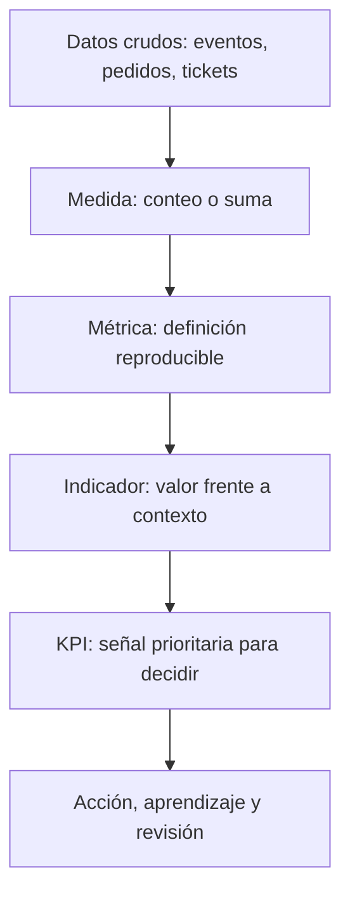

La flecha no significa que toda medida acabe siendo un KPI. La mayoría no debería serlo. Si una organización convierte cada número visible en un KPI, nadie sabe qué priorizar y se optimizan cifras irrelevantes.

## Ejemplo: “usuarios activos” no es una métrica hasta que la definas

Supón que tres equipos presentan el mismo dashboard. Producto llama activo a quien abre la aplicación; Marketing llama activo a quien recibe un correo; Finanzas llama activo a quien paga. Los tres pueden estar usando datos correctos y aun así discutir sobre cifras incompatibles. El problema no es una fórmula: es una definición incompleta.

Una definición mínima de “usuario activo semanal” podría ser: “usuario identificado que completa al menos una acción de valor entre las 00:00 del lunes y las 23:59 del domingo, en la zona horaria del producto; se excluyen empleados, cuentas de prueba y eventos enviados por sistemas automáticos”. Ahora se puede calcular, discutir y cambiar de forma controlada.

## La métrica no debe sustituir la pregunta

Una métrica es buena cuando ayuda a tomar una decisión. “Número de clics” rara vez es una decisión completa. “Porcentaje de usuarios nuevos que completa el primer proyecto en 7 días, segmentado por plataforma” puede orientar si hay que revisar onboarding, compatibilidad móvil o adquisición.

Antes de aceptar una métrica, plantea estas preguntas:

1. ¿Qué comportamiento o resultado pretende representar?
2. ¿Quién entra en la población y quién no?
3. ¿Qué evento o fuente se considera evidencia?
4. ¿Qué ventana temporal y zona horaria aplican?
5. ¿Qué decisión cambiaría si la métrica mejora o empeora?

Si la quinta pregunta no tiene respuesta, probablemente estás ante una cifra decorativa o exploratoria, no ante un KPI.

## Errores frecuentes

- Llamar KPI a todo lo que aparece en un dashboard.
- Confundir volumen con valor: más registros no implica más clientes satisfechos.
- Comparar métricas con definiciones o periodos distintos.
- Usar una media global cuando segmentos diferentes tienen comportamientos opuestos.
- Olvidar que un dato puede ser correcto técnicamente y engañoso para la decisión.

## Comprobación

Clasifica estas frases: “importe de una transacción”, “ingresos mensuales por cliente activo”, “la retención está por debajo del mínimo aceptable”, “retención a 30 días es un KPI del objetivo de sostenibilidad”. Después explica qué información falta en cada una para que sea reproducible.

# 10.2 Contrato de una métrica: una definición que otra persona puede repetir

## Objetivos

Aprender a especificar una métrica como un contrato: una pieza de documentación y lógica que permite que producto, datos, finanzas y dirección hablen del mismo número.

## Por qué una fórmula no basta

Escribir `conversion = compras / visitas` parece claro hasta que aparecen preguntas reales: ¿visitas de quién? ¿una visita por sesión, dispositivo o usuario? ¿la compra debe ocurrir el mismo día? ¿se cuentan devoluciones? ¿qué ocurre si el tracking se duplicó durante dos horas? La fórmula es solo una parte de la definición.

Un contrato de métrica elimina ambigüedad antes de que el dashboard llegue a una reunión. Debe ser breve, pero suficiente para que otra persona pueda reproducirla sin interpretar intenciones.

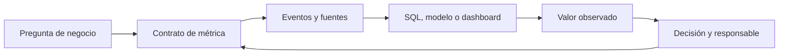

El último retorno importa: una definición no es eterna. Si cambia el producto, el comportamiento de valor o la fuente, se revisa el contrato y se documenta el cambio. No se sobrescribe silenciosamente la historia.

## Los siete campos mínimos

1. **Nombre y propósito.** “Activación a 7 días” y la decisión que pretende informar.
2. **Fórmula.** Numerador, denominador, unidades y tratamiento de cero.
3. **Población.** Quién es elegible, exclusiones y regla de identidad.
4. **Grano.** Usuario, cuenta, pedido, sesión, evento o día.
5. **Ventana temporal.** Inicio, fin, zona horaria y posible retraso de datos.
6. **Fuentes y lógica.** Eventos, tablas, filtros, versión de modelo y reglas de calidad.
7. **Propietario y límites.** Quién responde por la definición y qué no representa la métrica.

## Ejemplo completo: activación de una aplicación B2B

**Propósito:** saber si usuarios nuevos alcanzan el primer resultado de valor durante su primera semana y decidir qué paso de onboarding debe mejorarse.

**Fórmula:** usuarios únicos que crean un proyecto y ejecutan su primera consulta dentro de los siete días siguientes al registro / usuarios nuevos elegibles registrados en el mismo periodo. La métrica se expresa como porcentaje.

**Población:** usuarios humanos con cuenta verificada; se excluyen empleados, sandboxes internas, bots y migraciones masivas. El identificador estable es `account_user_id`.

**Grano y ventana:** cada usuario aporta una vez a su cohorte de registro. El día cero es el día de registro en UTC. Se esperan siete días completos antes de cerrar una cohorte.

**Fuente:** tabla de usuarios para registro, eventos `project_created` y `query_executed` para el criterio de valor. Validaciones: no más de un 1 % de eventos sin identificador y reconciliación diaria con logs de backend.

**Límites:** medir activación no demuestra retención ni satisfacción. Un usuario puede completar la acción por curiosidad y no volver; por eso se acompaña de retención y métricas de calidad.

## Versionado y cambios

Si el producto cambia y ahora una integración automática crea proyectos por el usuario, la definición anterior deja de medir la misma conducta. Mantener la misma etiqueta sin documentarlo rompe comparaciones históricas. Decide entre conservar la versión antigua, crear una v2 o recalcular el histórico si existe una regla equivalente. La elección debe quedar registrada.

## Comprobación

Escribe el contrato de “tasa de conversión de prueba a pago”. Incluye una exclusión razonable, una decisión que informaría y una limitación que impediría interpretarla como salud total del producto.

# 10.3 Objetivos, North Star, árboles y guardrails

## Objetivos

Relacionar la estrategia de un producto con métricas operables sin caer en la trampa de gestionar una organización con una única cifra.

## De estrategia a sistema de medida

Un objetivo formula una dirección: “hacer que equipos pequeños obtengan valor recurrente del producto”. Una North Star Metric intenta resumir la entrega de valor de ese objetivo. No sustituye a la estrategia ni resume todas las obligaciones de la empresa; sirve como punto de coordinación.

Una North Star útil debe estar relacionada con valor para el cliente, ser medible con suficiente calidad, responder a acciones de equipos y no ser tan fácil de manipular que incentive un comportamiento dañino. “Usuarios registrados” suele ser demasiado superficial; “cuentas que completan un flujo de valor semanal” suele estar más cerca de la experiencia real, aunque exige una definición cuidadosa.

```mermaid
flowchart TD
    A[Objetivo: valor recurrente] --> B[North Star: cuentas con valor semanal]
    B --> C[Activación]
    B --> D[Adopción de funciones]
    B --> E[Retención]
    B --> F[Monetización sostenible]
    C --> G[Guardrails: calidad, soporte, fraude]
    D --> G
    E --> G
    F --> G
```

El árbol no es una cadena causal demostrada automáticamente. Es una hipótesis de negocio: debe contrastarse con análisis, experiencia de producto y experimentos. Su valor está en obligar a explicitar cómo se espera que una acción local contribuya al resultado global.

## Métricas de entrada y de resultado

Las métricas de resultado miran el efecto final: ingresos, retención o valor entregado. Son importantes, pero tardan en cambiar. Las métricas de entrada representan comportamientos o condiciones que un equipo puede influir antes: completar onboarding, tiempo hasta primer valor, cobertura de documentación o tasa de errores.

No elijas una métrica de entrada porque sea fácil de mover. El vínculo con el resultado debe ser plausible y medible. Por ejemplo, aumentar notificaciones enviadas puede mejorar una métrica de actividad a corto plazo y empeorar retención por fatiga.

## Guardrails: progreso sin daño oculto

Un guardrail es una métrica que limita una optimización. Si el objetivo es elevar conversión, guardrails habituales son tasa de devoluciones, tickets de soporte, latencia, fraude, cancelación o satisfacción. No son métricas secundarias: definen qué tipo de éxito es aceptable.

El fenómeno de Goodhart resume el riesgo: cuando una medida se convierte en objetivo, las personas encuentran maneras de mejorarla sin mejorar lo que pretendía representar. Un equipo puede impulsar activación añadiendo un paso obligatorio que dispara el evento de valor, aunque el usuario no haya recibido valor alguno. El árbol de métricas y los guardrails ayudan a detectar esta distorsión.

## Ejemplo de decisión

Un equipo observa menor activación en móvil. Su árbol sugiere revisar el tiempo hasta primer proyecto y el abandono en el permiso de notificaciones. Antes de rediseñar, segmenta por versión, dispositivo y canal; comprueba instrumentación; estima el tamaño de la caída; y decide si necesita un experimento o una corrección técnica. El árbol orienta la investigación, no reemplaza el análisis.

## Comprobación

Para una plataforma de cursos, propone una North Star, tres entradas y dos guardrails. Después describe una forma de manipular la North Star sin generar aprendizaje real y cómo lo detectaría un guardrail.

# 10.4 Baselines, objetivos, benchmarks, ratios y comparaciones

## Objetivos

Evitar conclusiones engañosas al comparar una métrica con un periodo, una población o una referencia inadecuados.

## Un número aislado casi nunca informa

Decir “la conversión es 4 %” no permite decidir. ¿Es 4 % frente a un objetivo de 3 % o de 8 %? ¿Sube respecto a la semana anterior? ¿La semana anterior tenía una campaña, una caída de tracking o un festivo? Toda métrica necesita una referencia: baseline histórico, objetivo acordado, benchmark externo comparable o grupo de control.

```mermaid
flowchart TD
    A[Valor observado] --> B{Referencia válida}
    B --> C[Histórico comparable]
    B --> D[Objetivo acordado]
    B --> E[Control o experimento]
    B --> F[Benchmark comparable]
    C --> G[Interpretación]
    D --> G
    E --> G
    F --> G
```

Un benchmark externo puede orientar, pero rara vez es una meta automática: modelo de negocio, mercado, madurez, definición y población pueden diferir. Es más riguroso usarlo para plantear preguntas que para declarar éxito o fracaso.

## Absoluto, relativo y normalizado

Una caída de 200 conversiones puede ser enorme para un producto pequeño y trivial para otro. Por eso se combinan recuentos absolutos, tasas, cambios porcentuales y, cuando procede, normalización por población o exposición. La tasa de conversión necesita denominador; los ingresos por usuario necesitan periodo y población; la disponibilidad necesita duración observada.

Evita comparar porcentajes cuando los denominadores son minúsculos. Pasar de 1 a 2 compras es un aumento del 100 %, pero no justifica el mismo lenguaje que pasar de 10 000 a 20 000. Comunica ambos valores.

## Segmentos y paradojas

La media global puede mejorar mientras todos los segmentos relevantes empeoran, si cambió la composición de la población. Divide por canal, plataforma, cohorte, región o plan cuando exista una razón de negocio. Pero no busques segmentos hasta encontrar uno “significativo”: define previamente cuáles son plausibles y documenta exploraciones adicionales.

## Comprobación

Una conversión mensual sube del 3 % al 4 %. Escribe cinco datos que pedirías antes de celebrar la mejora y una manera de comunicarla sin exageración.

# 10.5 Funnels: definición, instrumentación y diagnóstico de conversión

## Objetivos

Construir un funnel que represente un recorrido real del usuario y diagnosticar pérdidas sin confundir eventos técnicos con progreso de valor.

## Qué mide un funnel

Un funnel compara cuántas entidades pasan por una secuencia de pasos definidos. La entidad puede ser usuario, cuenta, pedido o sesión; escogerla cambia la respuesta. Un funnel de onboarding por usuario y un funnel de checkout por pedido no son intercambiables.

```mermaid
flowchart LR
    A[Visita elegible] --> B[Registro completado]
    B --> C[Configuración inicial]
    C --> D[Primer valor]
    D --> E[Pago o retención]
```

Cada flecha es una hipótesis sobre un recorrido. Define orden, ventana máxima, repetición de eventos, exclusiones y tratamiento de usuarios que entran a mitad del proceso. Si una persona completa pasos en varios dispositivos, necesitas una regla de identidad antes de calcular.

## Pérdida no significa causa

Que el mayor abandono ocurra entre B y C no demuestra que el formulario sea el problema. Puede haber tráfico de baja intención, una incompatibilidad de navegador, un cambio de precio o un evento que no se está registrando. El funnel localiza dónde investigar; logs, sesiones, segmentación, cualitativo o experimentos ayudan a explicar por qué.

## Instrumentación mínima

Para cada paso documenta nombre, condición de éxito, propiedades, cuándo se envía el evento y qué sistemas pueden generarlo. Distingue “botón pulsado” de “acción completada en backend”. El primer evento mide intención; el segundo confirma resultado. Ambos pueden ser útiles, pero responden preguntas distintas.

## Ejemplo de diagnóstico

Si la conversión cae solo en Android tras una versión, compara el funnel por versión de app, modelo de dispositivo y error técnico. Si el evento de “registro completado” cae pero las cuentas existen en base de datos, el problema puede ser instrumentación. La investigación responsable informa de ambas posibilidades antes de atribuir culpa al producto.

## Comprobación

Define un funnel de compra de suscripción. Indica entidad, pasos, ventana y un evento técnico que no usarías como criterio final de conversión.

# 10.6 Cohortes, retención, churn y segmentación

## Objetivos

Interpretar cuándo una población vuelve, se mantiene o abandona, y evitar comparar cohortes que no son equivalentes.

## La cohorte da contexto temporal

Una cohorte agrupa entidades que comparten una condición de entrada: por ejemplo, usuarios registrados en la misma semana o cuentas que activaron una funcionalidad. La retención pregunta qué proporción vuelve a realizar una acción definida después de esa entrada. Sin cohorte, una media de usuarios activos mezcla generaciones de producto, campañas y antigüedad.

```mermaid
flowchart TD
    A[Cohorte: registro semana 1] --> B[Actividad semana 1]
    B --> C[Retención semana 2]
    C --> D[Retención semana 4]
    D --> E[Investigación por segmento]
```

Define con precisión evento de entrada, evento de retorno, intervalo y tipo de retención. La retención clásica exige volver en un periodo concreto; la no acotada permite volver en o después de cierto día. Ambas son válidas si se nombran correctamente.

## Churn no es simplemente “no activo”

Churn puede referirse a cancelación contractual, inactividad durante un umbral o pérdida de ingresos. Un SaaS anual y una app gratuita no usan la misma definición. Declara el horizonte y la población: una cuenta que aún no tuvo oportunidad razonable de renovar no debe entrar en una tasa de cancelación.

## Segmentación con propósito

Segmenta cuando exista una hipótesis operativa: canales que traen usuarios de distinto valor, planes con onboarding distinto, países con diferencias regulatorias o cuentas con distintos tamaños. No uses segmentos como excusa para ocultar la métrica global; combina ambos niveles y declara denominadores.

## Comprobación

Compara dos cohortes con retención día 30 del 20 % y 25 %. Enumera información necesaria antes de afirmar que la segunda experiencia de onboarding es mejor.

# 10.7 Adquisición, engagement, monetización y valor

## Objetivos

Relacionar métricas de distintas etapas del producto sin convertirlas en una colección desconectada de siglas.

## El recorrido económico y de valor

Adquisición responde quién llega; activación responde quién obtiene primer valor; engagement responde con qué frecuencia y profundidad se usa; retención responde quién vuelve; monetización responde qué valor económico sostiene el servicio. No existe una secuencia universal, pero dibujar la relación evita optimizar una etapa contra otra.

```mermaid
flowchart LR
    A[Adquisición] --> B[Activación]
    B --> C[Engagement]
    C --> D[Retención]
    D --> E[Monetización]
    E --> F[Capacidad de reinversión]
```

DAU, WAU y MAU son recuentos de actividad; el cociente DAU/MAU se usa a veces como aproximación a frecuencia, pero solo es interpretable con una definición de actividad estable. ARPU, CAC y LTV ayudan a hablar de economía unitaria, pero dependen de costes, horizontes y atribución. No los presentes como verdades universales.

La métrica de valor más útil no siempre es ingreso. En un producto B2B puede ser informes entregados; en una plataforma educativa, actividades significativas completadas; en una infraestructura, tareas ejecutadas con éxito. El valor debe conectar una necesidad del usuario con una viabilidad de negocio.

## Comprobación

Elige un producto y propone una métrica de valor, una de engagement, una de monetización y una advertencia sobre la relación entre ellas.

# 10.8 Experimentación, Goodhart y decisiones bajo incertidumbre

## Objetivos

Usar métricas para evaluar cambios sin convertir una mejora puntual en una certeza ni incentivar comportamientos que dañen el producto.

## Antes del experimento

Define hipótesis, población, métrica primaria, guardrails, duración y criterio de decisión antes de mirar los resultados. Si la métrica cambia después de conocer los datos, aumentas la probabilidad de encontrar una historia convincente pero falsa.

La estadística ayuda a medir incertidumbre; no decide por sí sola. Una diferencia puede ser compatible con ruido, demasiado pequeña para justificar coste o perjudicial en un segmento. Comunica magnitud absoluta, relativa, intervalo, tamaño de muestra, duración y límites.

```mermaid
flowchart TD
    A[Hipótesis] --> B[Métrica primaria y guardrails]
    B --> C[Diseño y asignación]
    C --> D[Recogida de datos]
    D --> E[Estimación e incertidumbre]
    E --> F{¿Valor neto aceptable?}
    F -->|Sí| G[Desplegar y monitorizar]
    F -->|No| H[Aprender o iterar]
```

## Goodhart en la práctica

Una medida se degrada cuando las personas optimizan el indicador en vez del fenómeno. Ejemplos: forzar clics para elevar engagement, retrasar una cancelación para reducir churn del mes, o dividir un ticket para mejorar tiempo de primera respuesta. Los guardrails, auditorías cualitativas y métricas complementarias no eliminan el riesgo, pero lo hacen visible.

## Comprobación

Propón un experimento para elevar activación. Incluye métrica primaria, dos guardrails, decisión de parada y una posible forma de Goodhart.

# 10.9 Catálogo de métricas, tracking plan y Amplitude

## Objetivos

Comprender que la confianza en un dashboard depende de un sistema de gobierno: definiciones, eventos, propiedad, cambios y calidad.

## Catálogo de métricas

Un catálogo es el lugar donde se encuentran nombre, propósito, definición, fórmula, fuentes, propietario, versiones, dashboards y consumidores de una métrica. Evita que cada equipo reconstruya “usuarios activos” desde cero y permite investigar diferencias de forma trazable.

## Tracking plan

Antes de instrumentar, documenta qué eventos representan interacciones importantes, qué propiedades permiten segmentar y cómo se identifica a usuario, cuenta o dispositivo. Define también eventos prohibidos: no envíes PII innecesaria a herramientas de analítica. El plan debe incluir validación de cobertura y un proceso de cambio cuando el producto evolucione.

```mermaid
flowchart LR
    A[Decisión y métrica] --> B[Tracking plan]
    B --> C[Implementación]
    C --> D[Validación de eventos]
    D --> E[Amplitude o BI]
    E --> F[Dashboard y acción]
    F --> G[Catálogo y versión]
```

## Amplitude como ejemplo, no como sustituto del criterio

Amplitude permite trabajar con eventos, propiedades, funnels, cohorts, retención y dashboards. Eso no le concede autoridad sobre la definición: una visualización correcta sobre eventos mal instrumentados sigue siendo engañosa. Valida primero identidad, latencia, duplicados, eventos de servidor frente a cliente y cambios de versión.

Una práctica sana consiste en revisar cada métrica con tres capas: definición de negocio, lógica técnica y comportamiento observado. Si las tres no coinciden, el trabajo no está terminado.

## Comprobación

Escribe tres eventos y dos propiedades para medir activación de un producto. Indica qué dato no recogerías por privacidad y cómo comprobarías que el evento llega correctamente.

# Bloque 11 - Series temporales

## Objetivo

Analizar datos que cambian con el tiempo, distinguir tendencia de estacionalidad y construir previsiones base honestas.

## Componentes temporales

Una serie puede contener tendencia, estacionalidad, ciclos, ruido y cambios de nivel. Antes de modelar, comprueba frecuencia, fechas ausentes, cambios de definición y eventos externos que hayan alterado la métrica.

```mermaid
flowchart TD
    A[Serie temporal] --> B[Tendencia]
    A --> C[Estacionalidad]
    A --> D[Ruido y anomalías]
    B --> E[Previsión base]
    C --> E
    D --> F[Investigación]
```

## Validación temporal

No mezcles futuro y pasado al evaluar un modelo. Entrena con periodos anteriores y valida con periodos posteriores. Una previsión ingenua, como repetir el último valor o el mismo día de la semana anterior, es una referencia obligatoria.

## Comunicación

Una previsión es un rango con supuestos, no una cifra mágica. Explica horizonte, error esperado, eventos no incluidos y qué decisión cambia si la previsión falla.

## Práctica

Plantea [una previsión de demanda](../../ejercicios/temario-11/aplicacion/prevision-demanda.md) y compara con [la guía](../../soluciones/temario-11/prevision-demanda.md).

# Bloque 12 - Modelos predictivos para analistas

## Objetivo

Usar modelos predictivos de manera responsable para estimar resultados, priorizar casos y apoyar decisiones. El objetivo no es competir por la métrica más alta: es construir una predicción útil, válida y explicable.

## Predicción no es causalidad

Un modelo puede anticipar qué usuarios tienen riesgo de abandono sin demostrar por qué abandonarán ni qué intervención lo evitará. Usa predicción para priorizar y medir intervenciones aparte cuando la pregunta sea causal.

```mermaid
flowchart TD
    A[Pregunta de negocio] --> B[Variable objetivo]
    B --> C[Datos históricos y variables]
    C --> D[Separación temporal]
    D --> E[Modelo base]
    E --> F[Evaluación y sesgos]
    F --> G[Decisión o experimento]
```

## Preparación y evaluación

Define el objetivo antes de tocar variables. Separa entrenamiento, validación y prueba sin filtrar información del futuro. Una fuga de información hace que un modelo parezca excelente en evaluación y fracase al usarse.

Para regresión usa errores como MAE o RMSE; para clasificación considera precisión, recall, F1, AUC y, sobre todo, el coste de cada error. Una métrica no reemplaza el contexto de negocio.

## Modelos que debe conocer un analista

Regresión lineal y logística son referencias interpretables. Árboles y ensembles capturan relaciones complejas, pero requieren más atención a validación e interpretación. Crea primero un baseline sencillo: superar una referencia honesta es más importante que usar el modelo más sofisticado.

## Interpretación y ética

Explica qué variables influyen, para qué población funciona y dónde puede fallar. Evita usar variables sensibles o proxies injustificados. Documenta el impacto de falsos positivos y falsos negativos antes de automatizar una acción.

## Práctica

Resuelve [el caso de churn](../../ejercicios/temario-12/aplicacion/priorizar-churn.md).

# Bloque 13 - Herramientas y reproducibilidad

## Objetivo

Trabajar como analista dentro de un equipo: convertir peticiones en entregables verificables, documentar decisiones y hacer que un análisis pueda repetirse.

## De ticket a entrega

Jira, Linear u otras herramientas no son solo listas de tareas. Una petición analítica debe expresar contexto, decisión, métrica, alcance, criterio de aceptación y responsable. Si falta la decisión, el análisis corre el riesgo de ser interesante pero inútil.

```mermaid
flowchart LR
    A[Ticket o petición] --> B[Pregunta y criterios]
    B --> C[Datos y análisis]
    C --> D[Revisión]
    D --> E[Dashboard, informe o decisión]
    E --> F[Seguimiento]
```

## Git y proyectos analíticos

Git registra cambios en código, documentación y definiciones. Un análisis reproducible separa datos no versionados, código, dependencias, resultados derivados y documentación. Los notebooks sirven para explorar y explicar; la lógica repetida conviene moverla a funciones o scripts comprobables.

## Instrumentación y producto

Herramientas como Amplitude permiten revisar eventos, propiedades, funnels, cohorts y retención. Antes de crear un gráfico, valida el tracking plan: nombre del evento, momento de envío, identidad, propiedades y cobertura. Un dashboard no arregla eventos mal definidos.

## BI y comunicación

Power BI, Tableau, Looker y hojas de cálculo cambian de interfaz, pero comparten lo esencial: modelo de datos, métricas definidas, filtros claros, actualización conocida y audiencia. Entrega siempre contexto, recomendación, límites y enlace al detalle.

## Práctica

Redacta [un ticket analítico completo](../../ejercicios/temario-13/aplicacion/ticket-analitico.md).

# Bloque 14 - Nivel avanzado: causalidad, escala y criterio

## Objetivo

Reconocer problemas avanzados que aparecen al analizar productos y operaciones reales: causalidad, anomalías, datos grandes y datos con estructura espacial o externa.

## Causalidad

Cuando la pregunta es "qué ocurriría si cambiamos X", una correlación no basta. Los experimentos aleatorizados son la referencia cuando son posibles. Cuando no lo son, considera diseños cuasiexperimentales, diferencias en diferencias, regresión discontinua o matching con gran cautela y supuestos explícitos.

```mermaid
flowchart TD
    A[Pregunta causal] --> B{¿Experimento posible?}
    B -->|Sí| C[A/B con guardrails]
    B -->|No| D[Diseño cuasiexperimental]
    C --> E[Estimación y sensibilidad]
    D --> E
    E --> F[Decisión con límites]
```

## Escala y rendimiento

Cuando un dataset no cabe cómodamente en memoria, empieza por reducir columnas y filas, filtrar antes de transferir y usar formatos columnares. DuckDB y Polars son herramientas útiles; no sustituyen un modelado correcto ni la definición clara de la pregunta.

## Anomalías y monitorización

Una anomalía es una observación inesperada respecto a un patrón, no necesariamente un incidente. Comprueba primero cambios de tracking, calendario, despliegues y calidad de datos. Diseña alertas con umbrales y responsables para evitar fatiga de alertas.

## APIs y datos externos

Documenta procedencia, licencia, frecuencia y sesgo de cada fuente. Una API puede cambiar sus campos o límites; la reproducibilidad exige guardar fecha de extracción, versión y transformaciones.

## Práctica

Evalúa [un supuesto causal](../../ejercicios/temario-14/aplicacion/supuesto-causal.md).

# Bloque 15 - Portfolio y preparación profesional

## Objetivo

Convertir competencias en evidencia visible: proyectos que muestran criterio, técnica, comunicación y honestidad sobre los límites.

## Qué demuestra un buen proyecto

Un portfolio no es una colección de gráficos. Cada proyecto debe partir de una pregunta relevante, explicar los datos, mostrar transformaciones, justificar decisiones, comunicar hallazgos y reconocer incertidumbre. La persona que lo lea debe poder reproducir el recorrido o entender dónde no puede hacerlo.

```mermaid
flowchart TD
    A[Problema real] --> B[Pregunta y métricas]
    B --> C[Datos y calidad]
    C --> D[Análisis o modelo]
    D --> E[Hallazgos y límites]
    E --> F[Recomendación]
    F --> G[README y presentación]
```

## Formato recomendado

Un proyecto contiene un README ejecutivo, un diccionario de datos, código o notebook reproducible, visualizaciones explicativas y una presentación breve. Es mejor tener tres proyectos claros y acabados que diez exploraciones incompletas.

## Entrevistas

Practica explicar una consulta SQL, detectar un error de calidad, definir una métrica y cuestionar una conclusión estadística. En casos de negocio, di qué pregunta harías primero, qué datos pedirías y cómo validarías tu recomendación.

## Capstone

El [proyecto final](../../proyectos/capstone/README.md) integra el curso: datos sin limpiar, análisis, métricas, visualización, recomendación y una entrega para público no técnico.

## Cierre

Terminar el curso no significa saberlo todo. Significa tener un método fiable para aprender una herramienta nueva, hacer preguntas mejores y justificar decisiones con evidencia.
