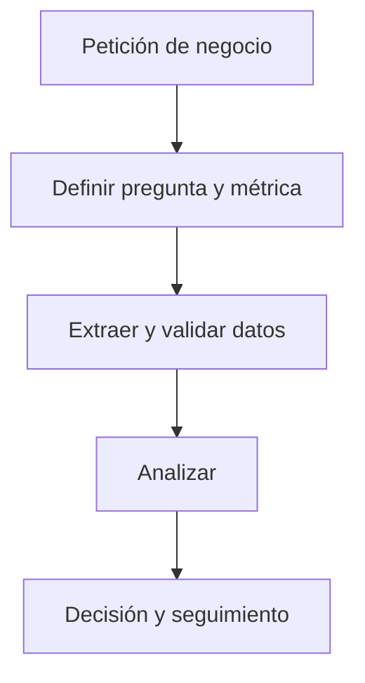
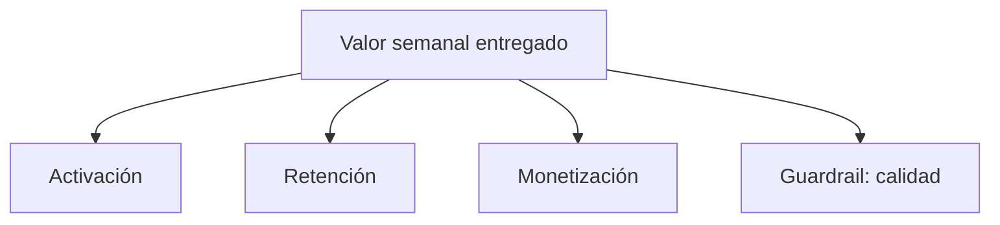

# Diagramas que usa un analista en una empresa

Los diagramas no sustituyen el análisis: hacen visible cómo fluye la información, quién decide y dónde puede existir un problema. Mantén etiquetas breves, un único propósito por diagrama y una pregunta clara en el título.

## 1. Flujo de proceso

Úsalo para explicar un recorrido: por ejemplo, cómo se transforma una petición de negocio en una decisión.

## 2. Arquitectura de datos

Úsalo para explicar de dónde viene un dato y dónde termina. Es crucial para no pedir a una base operacional una consulta que debería resolverse en un warehouse.

## 3. Árbol de métricas

Úsalo para vincular un objetivo con métricas controlables y guardrails.

## 4. Límites y propiedad

Cuando un diagrama cruza equipos, indica propietario, sistema fuente y frecuencia de actualización. Un diagrama bonito sin estas tres cosas suele generar dudas en vez de resolverlas.
